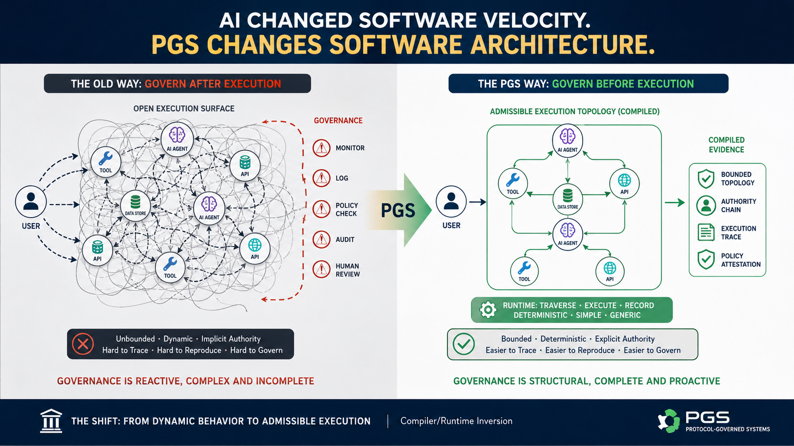

**AI Changed Software Velocity. PGS Changes Software Architecture**

***Why Protocol-Governed Systems v0.3.0 marks the beginning of the
Compiler/Runtime Inversion***
*Part 13 of the Protocol-Governed Systems (PGS) Series*

In the last few years, AI has dramatically accelerated software
implementation velocity.

Code generation.\
Agentic tooling.\
Autonomous orchestration.\
Self-modifying pipelines.\
Framework-assisted composition.

Entire application layers can now be produced in hours instead of
months.

But underneath this acceleration, a deeper architectural problem is
emerging:

AI changed how fast we can build software.\
It did not change how software is fundamentally governed.

And that distinction matters far more than most organizations currently
realize.

Because the dominant software architecture model still assumes something
increasingly dangerous in the AI era:

execution is open\
governance constrains behavior afterward

PGS v0.3.0 marks a different direction.

Not merely a new runtime.\
Not another orchestration engine.\
Not another AI governance dashboard.

A deeper inversion.

An inversion in where architectural intelligence itself lives.

**The Traditional Assumption**

For decades, software architecture concentrated most operational
intelligence inside the runtime:

- frameworks dynamically discovered behavior

- middleware injected authority

- orchestration emerged during execution

- services reconstructed topology at runtime

- policy systems monitored execution afterward

- governance remained largely procedural

The runtime became increasingly "smart."

And the smarter runtimes became, the more difficult systems became to:

- reason about

- bound

- reproduce

- govern

- audit

- secure

- formally attest

This problem existed before AI.

AI simply magnified it.

Because autonomous systems dramatically expand the execution surface.

**AI Did Not Solve Governance**

AI systems increasingly:

- compose tools dynamically

- orchestrate distributed capabilities

- invoke side effects autonomously

- chain execution paths probabilistically

- operate across mutable execution environments

The industry response has mostly been:

- prompts

- middleware

- monitoring

- policy overlays

- output filtering

- human review loops

But these approaches still govern execution *after capability already
exists*.

They supervise behavior operationally.

They do not structurally bound admissible execution itself.

That distinction is becoming critical.

Especially under increasing regulatory pressure from frameworks like the
EU AI Act.

**The PGS Shift**

Protocol-Governed Systems (PGS) takes a different architectural
position:

governance constructs admissible execution before runtime traversal
begins.

This sounds subtle.

It is not.

Because it changes where intelligence lives inside the system.

Traditional systems generally behave like this:

Source Code\
↓\
Runtime reconstructs behavior dynamically\
↓\
Governance supervises afterward

PGS v0.3.0 now behaves more like this:

Protocol Governance\
↓\
Compiler materializes admissible execution topology\
↓\
Runtime traverses bounded topology deterministically

That is the inversion.

**The Compiler/Runtime Inversion**

PGS v0.3.0 introduces what may be the most important architectural
milestone in the project so far:

**Compiler/Runtime Inversion**

The runtime is shrinking.

The compiler is becoming constitutional.

Instead of dynamically reconstructing orchestration during execution,
the compiler now materializes:

- admissible topology

- execution routing

- authority boundaries

- failure surfaces

- side-effect bindings

- mutation ordering

- governance invariants

before runtime execution begins.

The runtime no longer "figures out" behavior dynamically.

It traverses admissible topology.

**What Changed in v0.3.0**

The v0.3.0 public release introduces a token-native execution model.

The runtime no longer operates primarily on symbolic protocol
structures.

Instead, the compiler emits fully materialized execution snapshots:

- integer-addressed topology

- dispatch routing tables

- capability handler bindings

- deterministic execution projections

- bounded governance surfaces

The runtime became intentionally simple:

load snapshot\
traverse topology\
invoke admitted capability\
record governed outcome

That simplicity is not a limitation.

It is the architectural goal.

**The Runtime Became Blind**

One of the most important properties of the new runtime is this:

the runtime no longer needs to understand governance semantics.

It does not load protocol artifacts.

It does not dynamically discover topology.

It does not reconstruct orchestration.

It does not interpret architecture.

It consumes a governed snapshot already compiled into admissible
execution form.

This dramatically reduces:

- hidden runtime behavior

- implicit orchestration

- heuristic execution

- dynamic topology ambiguity

- governance leakage

The execution substrate becomes increasingly generic.

And that turns out to matter enormously.

**The Governance Dividend**

During the v0.3.0 transition, a foundational identity model change was
introduced across the system.

Historically, this type of change would typically ripple through:

- execution engines

- workflows

- runtime bindings

- service layers

- orchestration code

- domain implementations

Instead, the change required touching only:

- artifact discovery

- normalization

- materialization

- loading boundary

- governance declaration

plus one new STRUCTURE artifact.

The execution layer itself remained largely untouched.

That is not normal software behavior.

That is architectural leverage.

The reason this worked is important:

- protocol-first declaration

- compile-time resolution

- strict separation of concerns

- no fallback heuristics

- no ambient authority

- no implicit discovery

The result:

PGS became extensible by declaration, not refactor.

That is the inflection point.

**Change Management Without the Release Drama**

ITIL 2.0 treats Release Management as a major discipline for good reason.

In traditional systems, change is expensive and risky.

A single behavioral change typically requires:

- Change Advisory Board (CAB) approvals

- bundled release packages coordinating multiple teams

- freeze windows that block other work

- rollback plans and contingency procedures

- cross-system regression test suites

- impact assessments across services

- weeks of coordination before anything ships

Why all this ceremony?

Because change in traditional architectures is not bounded.

A change to one service ripples through call sites, configuration,
orchestration, and integration layers.

Nobody knows exactly what breaks until it does.

PGS takes a structurally different position.

Every artifact carries an immutable version suffix:

- `WF_REGISTER_ACTOR_UNVERIFIED_V0`

- `CC_GENERATE_ACTOR_ID_V0`

- `CT_PURE_GENERATE_ID_V0`

A change is not a release package.

A change is a new artifact.

`CT_PURE_GENERATE_ID_V1` and `CT_PURE_GENERATE_ID_V0` co-exist in the
registry.

Workflows that reference V0 continue unaffected.\
New workflows can reference V1.\
No forced migration. No coordinated cutover. No freeze window.

The change surface is bounded at declaration time.

That changes what release management means:

- no bundled packages crossing team boundaries

- no freeze windows

- no regression risk from a change that does not touch your artifact

- no cross-team coordination to adopt a change

- no rollback plan --- the old version was never removed

This is divide and conquer applied to change itself.

Each artifact is sovereign.\
Each change is bounded.\
Each adoption is independent.

The v0.3.0 identity model rename illustrated this at platform scale.
In a conventional system, renaming a foundational identity concept
would require a coordinated multi-team release: workflows, service
layers, orchestration bindings, runtime assumptions --- all
moving together.

In PGS, the change touched artifact discovery, normalization, and the
loading boundary.

The execution layer was untouched.\
Existing workflows ran without modification.\
The change was absorbed structurally, not propagated operationally.

ITIL makes Release Management a formal discipline because architectures
make change expensive.

PGS makes change management a non-event because the architecture bounds
change at the artifact.

**Why This Matters for AI Systems**

As AI systems become increasingly autonomous, the execution surface
expands rapidly.

Traditional architectures attempt to govern this expansion
operationally.

PGS instead governs:

the admissible orchestration surface itself

before runtime begins.

This changes governance from:

post-hoc supervision

into:

structural admissibility

The distinction becomes profound in agentic systems.

An AI system operating inside a PGS-governed workflow may still reason
probabilistically internally.

But the execution topology through which its outputs become admissible
actions is structurally bounded before traversal begins.

That changes the governance conversation entirely.

**The Runtime Is Shrinking**

One of the clearest signals emerging from PGS v0.3.0 is this:

more intelligence is moving toward compile-time governance.

Less intelligence is remaining in runtime execution.

That is deeply countercultural to modern software architecture.

Most systems have evolved toward increasingly intelligent runtimes:

- dynamic frameworks

- adaptive middleware

- reflective orchestration

- runtime inference

- behavioral discovery

PGS moves in the opposite direction.

The runtime becomes smaller.

The compiler becomes more constitutional.

**What Was Released**

The PGS v0.3.0 public release now includes:

- pgs_runtime --- token-native deterministic execution runtime

- pgs_compiler --- governance-driven topology compiler

- updated public repositories under Apache-2.0

- tokenized snapshot architecture

- deterministic admissibility traversal

- Compiler/Runtime Inversion baseline

This release replaces the earlier OmniBachi v0.2.x symbolic runtime
lineage with a structurally simpler and more bounded execution
substrate.

The architectural direction is now substantially clearer.

**The Deeper Shift**

The most important insight from v0.3.0 is not tokenization.

It is not performance.

It is not packaging.

It is not orchestration.

The deeper shift is this:

governance is moving ahead of execution.

That may ultimately become one of the defining architectural changes
required for governable AI systems at scale.

Because increasingly autonomous systems cannot rely indefinitely on:

- procedural supervision

- observational governance

- implicit authority

- dynamically reconstructed topology

The execution surface itself must become structurally governable.

PGS is one attempt at that direction.

**The Open-Source Release**

The Protocol-Governed Systems reference implementation is now publicly
available:

- Runtime: pip install pgs_runtime

- Compiler: pip install pgs_compiler

GitHub repositories:

- pgs_workspace (anchor repo) <https://github.com/bachipeachy/pgs_workspace>

- pgs_runtime

- pgs_compiler

- pgs_governance

All released under Apache-2.0.

**What Comes Next**

PGS is still early.

Many important areas remain ahead:

- authoring systems

- governance UX

- distributed execution

- federated trust

- evidence verification

- AI governance conformance frameworks

- visualization tooling

- snapshot signing and attestation

But v0.3.0 marks an important threshold.

The architecture is no longer merely conceptual.

The inversion is now mechanically demonstrable.

**Final Thought**

AI may dramatically accelerate implementation velocity.

But velocity alone does not solve governance.

And velocity alone does not solve change management.

PGS v0.3.0 represents a different architectural bet:

that the future of governed AI systems will depend less on smarter
runtimes and release coordination ceremonies\
and more on admissible execution and atomic artifact change constructed
before runtime begins.

The Compiler/Runtime Inversion has only begun.

**The PGS Series**

1. The architectural foundation *(published)*

2. Defining PGS and OmniBachi *(published)*

3. Agentic AI needs a constitution *(published)*

4. Governing agentic AI for production *(published)*

5. The quiet privilege escalation *(published)*

6. From blog post to bounded runtime *(published)*

7. From serverless guardrails to structural governance *(published)*

8. The Three Dividends of Protocol-Governed Systems *(published)*

9. Why Smart Coding Is a Double-Edged Sword *(published)*

10. AI Accelerated Implementation. Not Governance. *(published)*

11. The EU AI Act Is Here. Your Governance Architecture Isn't Ready.
    *(published)*

12. What Actually Happens Inside a Protocol-Governed Execution
    *(published)*

13. **AI Changed Software Velocity. PGS Changes Software Architecture**
    *(this post)*

*--- Bhash Ganti (aka Bachi)*\
*Protocol-Governed Systems Initiative*
