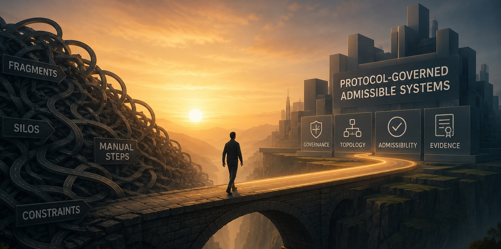

# AI Didn't Break Your Software. It Broke the Assumptions Underneath It

### *Why AI-generated software is exposing the limits of runtime-centric architecture — and why Protocol-Governed Systems (PGS) may represent an emerging alternative.*

AI can now generate application layers faster than organizations can govern them.

The bottleneck is no longer implementation.

The bottleneck is **admissibility** — whether a piece of behavior should be allowed to exist at all, before it runs.

Most modern SDLC tooling still assumes humans produce software slowly enough for governance to remain procedural: review, approve, release, monitor, patch. That assumption held for decades. It is now under pressure that none of its architects anticipated.

This is not an argument that software engineers are obsolete. It is an architectural argument: **AI invalidated key assumptions beneath modern SDLC**. And those assumptions have consequences all the way down — in how we orchestrate, release, audit, and scale governed systems.

# Section 1 — AI Broke the SDLC Timing Assumption

Traditional SDLC was built on a set of implicit timing assumptions that almost no one ever wrote down, because they seemed obvious:

- Implementation is expensive and slow
- Governance is slower, but manageable within that window
- Releases are periodic, with coordination windows between them
- Orchestration evolves gradually, with humans understanding the topology
- Behavioral complexity grows at a rate teams can absorb

AI has changed all five of these:

- Generation speed is no longer the constraint
- Surface area expands faster than review bandwidth
- Dependency graphs mutate between governance checkpoints
- Orchestration complexity can grow faster than any team can trace manually
- Behavioral surface expands in ways that are structurally opaque to procedural review

The governance model, however, stayed procedural.

That is the core tension. Not "AI vs. developers." **Governance velocity vs. generation velocity.** And governance is losing ground.

# Section 2 — Traditional Tooling Is Post-Construction Governance

When teams feel this tension, they reach for familiar tools: CI/CD pipelines, ITIL change management, Change Advisory Boards, observability stacks, policy engines, service meshes, runtime monitoring, AI guardrail frameworks.

These tools are genuinely useful. But they share a structural property that is easy to miss:

**They are all post-construction governance systems.**

They supervise execution *after* capability already exists. They instrument behavior *after* software has been built and deployed. They respond to drift *after* drift has occurred.

In a world where implementation was slow and releases were periodic, this lag was tolerable. Governance had time to catch up.

In a world where AI can generate a new service layer in an afternoon, the lag between construction and governance is no longer a delay — it is an architectural gap. And that gap is where risk accumulates silently.

# Section 3 — The Real Problem Is Runtime-Centric Architecture

This is where the argument reaches its root.

Traditional software architecture has an implicit hierarchy:

> **Execution is primary. Governance is secondary.**

You build the thing. Then you govern it. Runtime orchestration is dynamic — the system figures out what to do based on state, environment, and heuristics. Governance wraps around that dynamism: monitoring it, constraining it, auditing it.

PGS explores an architectural inversion of that hierarchy:

> **Governance is primary. Execution is derivative.**

In this model, execution is not an independent concern. It is a materialized consequence of governed admissibility. Before any capability runs, the set of admissible execution paths has already been declared, compiled, and validated. The runtime enforces structure — it does not reason about it.

This is not a policy engine wrapping a runtime. It is governance that *constructs* the execution topology before runtime begins.

That reframing is the deepest inversion. Everything else follows from it.

# Section 4 — The Four Inversions That Change the Most

PGS formalizes thirteen distinct architectural inversions across governance, orchestration, engineering economics, and scale behavior. Four of them carry the most weight for this argument:

### Governance Inversion

| Traditional | PGS |
|---|---|
| Governance supervises execution after behavior exists | Governance constructs admissible execution before runtime begins |

This is the meta-inversion. In traditional architecture, you build first and govern second. In PGS, you cannot build unadmitted behavior — the governed structure is the precondition for execution, not a wrapper around it.

### Compiler/Runtime Inversion

| Traditional | PGS |
|---|---|
| Runtime reconstructs orchestration dynamically | Compiler materializes bounded topology ahead of execution |

Traditional runtimes carry significant orchestration intelligence — routing logic, service discovery, fallback heuristics, environment-driven behavior. That intelligence is powerful but opaque: it resolves at execution time, often in ways that are difficult to reason about from outside the running system.

In PGS, the compiler materializes a bounded execution DAG from governed declarations. The runtime consumes that topology — it does not reconstruct it. Orchestration intelligence migrates from runtime heuristics to compile-time structure.

### Change Management Inversion

| Traditional | PGS |
|---|---|
| System growth increases release coordination and change ripple | Growth reduces change cost through bounded artifact sovereignty |

This one will resonate with anyone who has managed a large distributed system through a major dependency change. In traditional architectures, growth compounds coordination cost: more services, more release windows, more blast-radius calculation, more regression surfaces, more freeze periods.

PGS calls the counterpart property the **Governance Dividend**: in mature governed systems, structural growth *decreases* coordination cost and change ripple. Each artifact is independently versioned and bounded. A change to one does not ripple through implicit dependencies — it propagates only through explicitly declared relationships.

### Evidence Inversion

| Traditional | PGS |
|---|---|
| Logs attempt to explain execution after the fact | Execution itself produces admissibility evidence structurally |

Logs are reconstructive. They tell you what happened. But they do not tell you whether what happened was structurally admissible — only that it occurred.

In PGS, execution produces a structured trace that *is* the admissibility record. The evidence is not retrofitted; it is a structural output of governed traversal. This distinction matters especially for AI systems, where behavioral auditability is increasingly a regulatory and operational requirement.

# Section 5 — Where Traditional Change Management Starts Breaking

Enterprise engineers will find this section the most familiar.

Large-scale software systems accumulate a particular kind of invisible debt: **orchestration ambiguity**. No single person understands the full topology. Release coordination requires weeks of dependency analysis. Freeze windows exist because the blast radius of a change is genuinely uncertain. Runtime drift happens between releases because environment configuration carries semantics that were never formally declared.

Each of these failure modes has the same root:

**Behavior is implicit in the running system, not explicit in the structure that produced it.**

When the system is small, this is manageable. When AI accelerates surface expansion — more services, more integrations, more auto-generated capability layers — implicit orchestration breaks faster than teams can patch it.

PGS addresses this through what it calls **artifact sovereignty**: each capability is independently versioned, its inputs and outputs explicitly declared, its routing outcomes named and bounded. A foundational change to an identity model can touch discovery, normalization, materialization, and boundary projection — while the execution core remains untouched. The system becomes extensible by declaration, not by refactor.

That is the Governance Dividend made concrete.

# Section 6 — Is Traditional Software Engineering Dead?

No.

And the answer matters, because the honest version of this argument is stronger than the provocative version.

Traditional software engineering remains excellent for:

- Local logic and algorithms
- Domain modeling
- UI systems and application layers
- Libraries and reusable computation
- Data engineering and ML pipelines

AI augments these domains dramatically. Engineers who work in these areas are not facing obsolescence — they are facing a tool shift.

But runtime-centric orchestration governance — the part of the stack that manages *how capabilities are admitted, composed, and executed at scale* — is under genuine architectural pressure. And the tooling for that layer was not designed for AI-scale generation velocity.

Some foundational assumptions beneath modern SDLC are increasingly unstable. Not all of software engineering — but specific load-bearing assumptions about where governance belongs in the architecture.

# Section 7 — Enter PGS v0.3.0

Protocol-Governed Systems is a reference architecture built on the hypothesis that governance belongs ahead of execution in the architectural hierarchy — structurally, not procedurally.

PGS v0.3.0 explores:

- **Compile-time admissibility** — behavioral topology is validated before it can run
- **Bounded execution graphs** — DAGs are materialized by a compiler from protocol declarations, consumed as read-only snapshots by a generic runtime
- **Governed snapshots** — the runtime has no orchestration intelligence; it enforces, it does not reason
- **Artifact sovereignty** — each capability artifact is independently versioned and bounded
- **Deterministic traversal** — identical inputs produce identical execution traces, always
- **Structural evidence** — execution produces its own admissibility audit trail

The nine execution concerns (Transport Ingress, Actor Context, Intent, Workflow, Capability Contract, Capability Transform, Capability Side Effect, Event, Transport Egress) absorb behavioral complexity at the protocol level — before runtime.

PGS is not a framework. It is not a workflow engine, policy system, or service mesh. It is a different architectural assumption about *where* governance belongs.

# Section 8 — Kick the Tires

The architecture is now publicly available for inspection, experimentation, and criticism.

**Reference implementation (Apache-2.0):**
[https://github.com/bachipeachy/pgs_workspace](https://github.com/bachipeachy/pgs_workspace)

This is an early-stage but functional reference implementation. It is reproducible locally in under ten minutes. The workspace contains:

- A compiled protocol snapshot (read-only, compiler-generated)
- A generic runtime that executes governed DAGs
- Blockchain and AI governance domain examples
- A demo workflow that demonstrates idempotency and append-only event semantics
- Execution traces with structured admissibility evidence

The goal is not to convince you. The goal is to give you enough working surface to stress-test the architecture yourself.

If your instinct is skepticism — that is the right instinct. Evaluate the actual artifacts. Run the demo. Examine a trace. Inspect the governance declarations. The structure should be able to defend itself.

# Closing

AI may not eliminate software engineering.

But it may force us to rethink where governance belongs in the architecture itself.

The question is not whether AI helps engineers write more code. It clearly does. The question is whether the surrounding architecture — the SDLC assumptions, the orchestration model, the governance lifecycle — was designed to hold at the velocity AI enables.

The evidence suggests it was not.

PGS is one attempt at that inversion: moving governance from a supervisory wrapper around execution, to the structural precondition for it.

Whether that attempt succeeds is for the engineering community to evaluate.

**The reference implementation is there. The doctrine is documented. The architecture can be run.**

The rest is your call.

*PGS v0.3.0 — May 2026*
*Apache-2.0 — [github.com/bachipeachy/pgs_workspace](https://github.com/bachipeachy/pgs_workspace)*
