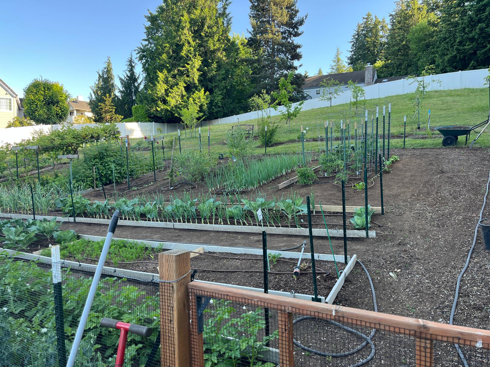

# My Backyard Taught Me To Build Safer Software

### *What a Pacific Northwest edible garden revealed about attack surfaces, admissibility, and why I built Protocol-Governed Systems.*

I should tell you something about myself before we get into software architecture.

When I am not writing Python code as a hobby, I am a regenerative backyard organic edible gardener — or at least I was, until a software project took on a life of its own and consumed most of my waking hours. More on that in a moment.

First, the garden.

---

## The Garden

That photo above is mine. Taken this morning.

In the foreground: a 60' x 40' bunny-fenced edible garden. Behind it: a mini orchard of young fruit trees. In the Pacific Northwest, the growing season is generous if you know how to work with it — and I have learned, over many years, to work with it.

I grow thirteen vegetables: potatoes, peas, eggplant, cabbage, cauliflower, broccoli, beans, cucumber, tomatoes, garlic, onions, carrots, and taro. I am vegetarian, so the garden is not a hobby — it is the pantry.

The orchard has ten fruits and shrubs: apples, plums, cherries, figs, pears, grapes, kiwi, strawberries, raspberries, and blueberries.

Last year I harvested over 80 lbs of carrots and around 120 lbs of tomatoes.

But here is what I never mention when people admire the garden: **I used to spend 80% of my time weeding.** No kidding. Eighty percent. The vegetables were almost incidental.

---

## The Insight That Changed Everything

In regenerative farming, there is a principle that took me an embarrassingly long time to internalize:

**Bare ground is a weed magnet.**

Weeds do not thrive on occupied ground. They thrive on empty ground — open surface with no competition, no canopy, nothing claiming the space. In regenerative practice, leaving soil bare is considered almost reckless. Bare ground, as they say, is like a person with no clothes — nature does not leave it that way for long, and what fills it is rarely what you planned.

So during the last winter solstice, instead of letting the beds sit empty, I planted carrots as a cover crop. Dense. Deliberate. Every inch claimed.

The weeds never got their foothold. The carrots thrived. And I stopped spending 80% of my time reacting to what had grown in the gaps.

**The open surface was the attack surface.**

Cover the surface — declare what belongs there — and the problem inverts itself.

---

## The Software Project That Got Out of Hand

Now the Python hobby.

A few years ago I built a reasonably complex cryptocurrency system supporting Ethereum and Bitcoin transactions. It started clean. Good design. AI agents helping me architect it. I was proud of it.

Then it got complex. Then more complex. Then it became the kind of thing where making any change — especially a security-hardening change — required understanding the full blast radius across dozens of interacting components. Debugging felt exactly like weeding a neglected garden: reactive, exhausting, and never quite finished.

Securing it was not a feature. It was a constant rearguard action.

I had built something with a massive attack surface. Application logic, infrastructure, integrations, runtime behavior — all of it composing dynamically, and most of it outside my direct control at any given moment. Every time I closed one gap, two more opened somewhere I hadn't looked.

Sound familiar?

---

## The Connection I Could Not Unsee

Somewhere in the middle of a late-night debugging session, I saw it.

**Bare ground. Open system. Same problem.**

A computing system with a large, uncontrolled behavioral surface is structurally identical to a garden with exposed soil. Something will grow there. You did not plan it. You do not control it. And you will spend most of your time reacting to it rather than cultivating what you actually intended.

The conventional response in both domains is the same: more monitoring, more fencing, more patching, more review. Work harder on the reaction loop.

But I had already learned, in the garden, that this is the wrong frame.

The question is not *how do I better defend the open surface?*

The question is *how do I eliminate the open surface entirely?*

---

## Inversion

In the garden, the answer was a cover crop: declare what grows on every inch of soil, ahead of time, so nothing uninvited can take hold.

In software, I came to the same answer through a different path.

Instead of protecting every possible execution path after the fact, **declare the only paths that are admissible — ahead of time — and let nothing else run.**

This is what I eventually called *admissibility* and *inversion*. If you read the previous blog in this series, you know the formal framing. But the intuition came from carrots.

The runtime does not need to be clever. It does not need to defend itself against the unexpected. It only needs to enforce the declared paths — and fail hard on anything else. There is no attack surface for what is not admitted.

That realization became the seed of Protocol-Governed Systems.

---

## What PGS Actually Is

Protocol-Governed Systems (PGS) is the architecture I built from that inversion.

The short version: governance is not a wrapper around execution. It is the precondition for it. Before any behavior runs, the set of admissible execution paths has been declared, compiled, and validated. The runtime enforces structure — it does not reason about it.

There is no bare ground. Every path is claimed before the season begins.

The reference implementation is public, functional, and reproducible locally:

**[github.com/bachipeachy/pgs_workspace](https://github.com/bachipeachy/pgs_workspace)**
*(Apache-2.0)*

It includes a compiled protocol snapshot, a generic runtime that executes governed DAGs, blockchain and AI governance domain examples, and execution traces with structured admissibility evidence. You can run the demo workflow in under ten minutes.

If you want the architectural argument in full, the previous blog in this series covers the four major inversions, the compile-time governance model, and where traditional runtime-centric architecture starts breaking under AI-scale generation velocity.

---

## The Part I Did Not Expect

I started building PGS to solve a software problem.

What I did not expect is that the architecture would eventually feel as intuitive as the garden.

Once you stop trying to defend an open surface and start declaring what belongs there — it simplifies everything downstream. Less monitoring. Less patching. Less debugging. The complexity does not disappear; it migrates. It moves from the reactive loop (what grew that I didn't plan?) to the declarative layer (what am I committing to, ahead of time?).

That migration is harder than it sounds. Declaring things ahead of time requires discipline, clarity, and a willingness to say no to what doesn't fit. The garden taught me that too. You cannot grow everything. You have to choose what you are actually tending.

But the payoff is real.

Last year I spent maybe 10% of my time weeding.

The other 90% was gardening.

---

*Blog 15 in the Protocol-Governed Systems series.*
*PGS v0.3.0 — May 2026*
*Apache-2.0 — [github.com/bachipeachy/pgs_workspace](https://github.com/bachipeachy/pgs_workspace)*