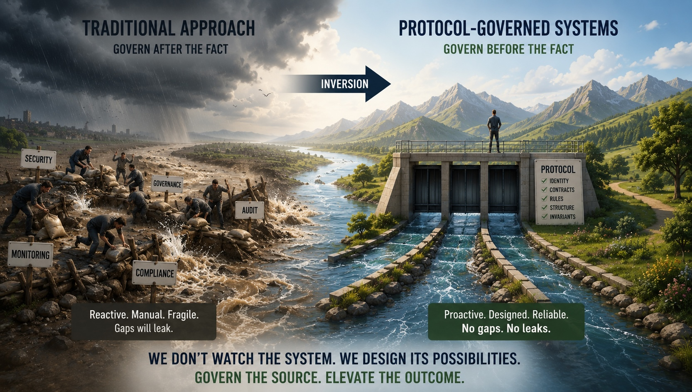

# The human insight that became an architectural inversion.

### *How a painful, helpless feeling — and one friend's offhand remark — became the seed of Protocol-Governed Systems.*

I want to tell you about a Sunday evening that changed the way I think about software.

Not a Sunday spent debugging. Not a Sunday in front of a whiteboard. A Sunday with friends — the kind where conversation wanders into the places you usually avoid, and then someone says something that reorients you without meaning to.

---

## The Weight of Watching

We were a small group, sitting together the way old friends do. At some point the topic turned to the conflict in Gaza. I do not remember exactly how we got there — these things find their way in.

What I remember is saying out loud, for perhaps the first time, how much it was costing me.

Not physically. I am safe and comfortable in the Pacific Northwest. But emotionally — the helplessness of watching suffering at a distance, of caring and being able to do nothing. The images. The numbers. The silence of the world. I said something like: I feel like a silent witness. And I hate it.

A friend looked at me. He is the kind of person who does not offer sympathy when he can offer something more useful.

He said: *You should invert the problem.*

I asked what he meant.

---

## The Gardener and the Gatorade

He told me a story.

The previous week, his gardener had been working in brutal summer heat — the kind of day where the air itself feels like a punishment. My friend watched from inside, uncomfortable, a little guilty. The sight of someone laboring through that heat, day after day, with no end in sight — it was genuinely hard to see.

His wife noticed his mood. She listened to him describe it. Then she said something simple:

*Stop watching him suffer. Go tip him generously, and bring him a Gatorade.*

He did. The next day, and the day after.

The gardener smiled — the wide, real kind. My friend stopped feeling helpless. He started feeling useful. The facts on the ground had not changed: the heat was still brutal, the labor was still hard, the gap between their circumstances was still vast. But the emotional posture had flipped completely.

*That*, my friend said, *is inversion. You cannot always change the source of the sadness. But you can change your relationship to it — from passive witness to active participant.*

---

## The Walk Home

I sat with that for most of the walk home.

He was right about the gardener. He was probably right about me and the conflict — there were things I could do, organizations I could support, voices I could amplify, small dignities I could extend instead of sitting in impotent grief.

But by the time I got back to my desk, the thought had gone somewhere else entirely.

*Inversion.*

I had been sitting with a software problem for months. A different kind of helplessness — watching AI-generated systems grow faster than any governance process could track. Watching security patches chase vulnerabilities that never stopped spawning. Watching architectural complexity compound until no one person could hold the whole topology in their head.

The standard response to that problem is more monitoring. More review. More process. More eyes watching the running system for what went wrong.

But that is the posture of a silent witness.

What if instead of watching and reacting, the architecture itself *prevented* the condition from arising?

---

## The Inversion That Followed

The insight that came out of that Sunday is the one that became Protocol-Governed Systems.

The conventional assumption in software architecture is this: you build the system, then you govern it. You write the code, deploy it, and wrap governance around what is already running — monitoring, policy engines, change advisory boards, audit logs. Governance is supervisory. It watches execution.

The inversion I started building is this: **governance is not a supervisor. It is a precondition.**

Before any behavior runs, the set of admissible execution paths has been declared, compiled, and validated. The runtime does not reason about what is allowed. It enforces a structure that was already proven correct before the first instruction executed.

You do not react to what grew in the gaps. You eliminate the gaps.

You do not watch for drift. You make drift structurally impossible.

That is the inversion. Not supervision after the fact. Admissibility before the fact.

---

## The Paper

With PGS v0.4.0 I published the concept paper that formalizes this argument:

**Protocol-Governed Systems: Architecture Inversion**
[https://doi.org/10.5281/zenodo.20497732](https://doi.org/10.5281/zenodo.20497732)

The paper works through thirteen architectural inversions — the ways PGS systematically flips the conventional hierarchy between governance and execution. A few of the most significant:

**Governance Inversion.** In traditional architecture, governance supervises execution after behavior exists. In PGS, governance constructs admissible execution before runtime begins. You cannot run unadmitted behavior — not because someone is watching, but because the structure does not contain it.

**Compiler/Runtime Inversion.** Traditional runtimes carry orchestration intelligence: routing logic, fallback heuristics, environment-driven behavior. That intelligence lives in the running system and is difficult to reason about from outside it. In PGS, the compiler materializes a bounded execution graph from governed declarations. The runtime consumes that topology — it does not reconstruct it. Orchestration migrates from runtime ambiguity to compile-time structure.

**Evidence Inversion.** Logs try to explain what happened after it happened. In PGS, execution produces a structured trace that *is* the admissibility record. The evidence is not retrofitted; it is a structural output of governed traversal. Every execution is its own audit.

**Change Management Inversion.** In traditional architectures, system growth compounds coordination cost — more services, more blast-radius calculation, more freeze windows. PGS introduces what the paper calls the *Governance Dividend*: in mature governed systems, structural growth *decreases* change coordination cost. Each artifact is independently versioned and bounded. A change propagates only through explicitly declared relationships, not through implicit coupling.

The paper also introduces the nine execution concerns — the named boundary taxonomy (Transport Ingress, Actor Context, Intent, Workflow, Capability Contract, Capability Transform, Capability Side Effect, Event, Transport Egress) — and shows how AI fits into this architecture not as a risk to be controlled, but as a *bounded acceleration tool* operating inside declared admissibility.

That framing matters. The industry's current instinct is to treat AI generation velocity as a governance problem to be managed. PGS suggests an inversion: make the architecture the governance, and let AI generate as fast as it wants inside those bounds.

Silent witness versus active participant. Same impulse.

---

## The Reference Implementation

The paper is accompanied by a working reference implementation — reproducible locally, fully open:

**[github.com/bachipeachy/pgs_workspace](https://github.com/bachipeachy/pgs_workspace)**
*(Apache-2.0)*

It includes a compiled protocol snapshot, a generic runtime that executes governed DAGs, blockchain and AI governance domain examples, and execution traces with structured admissibility evidence. The demo workflow runs in under ten minutes.

I am not asking you to be convinced. I am asking you to run the demo. Examine a trace. Read the governance declarations. Stress-test the architecture yourself.

The structure should be able to defend itself — and if it cannot defend itself against your critique, that is the most useful thing you can do for it.

---

## The Part I Keep Thinking About

I have told the Sunday evening story to a few people since. Most of them respond to the gardener-and-Gatorade part — the warmth of it, the simplicity.

What I keep returning to is the structure underneath it.

The suffering in the world is real and I cannot eliminate it. But I can choose my relationship to it — passive and helpless, or active and present, however small the scale.

The architectural complexity in modern software is real and we probably cannot eliminate it. But we can choose where governance lives relative to it — downstream and reactive, or upstream and structural.

Both of those are inversions. Both of them require deciding, before anything else, whether you want to keep watching or start doing something.

I chose to start building — and that Sunday evening is where it began.

---

*Blog 16 in the Protocol-Governed Systems series.*
*PGS v0.4.0 — June 2026*
*Apache-2.0 — [github.com/bachipeachy/pgs_workspace](https://github.com/bachipeachy/pgs_workspace)*
*Concept paper — [doi.org/10.5281/zenodo.20497732](https://doi.org/10.5281/zenodo.20497732)*
