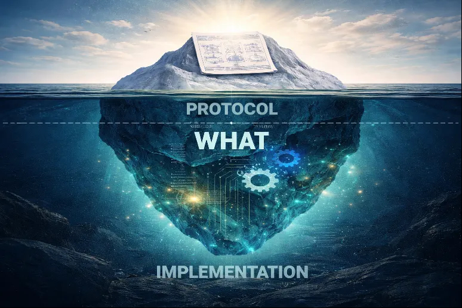

**From Protocol Governance to Platform:** **Defining PGS and OmniBachi**

*Part 2 of the Protocol-Governed Systems (PGS) Series*

In the previous post, I introduced the idea of **Protocol-Governed
Systems (PGS)** --- a class of software architecture where behavior is
separated from implementation and governance becomes the primary system
driver.

The response told me something: the concept resonated, but the
vocabulary needs grounding.

Today, before we move into the mechanics of Paper #2, I want to
establish two precise definitions:

1.  What exactly is a Protocol-Governed System?

2.  What role does OmniBachi play in that landscape?

Because without precise definitions, architectural discussion quickly
turns abstract. And abstract is where good ideas go to die.

**What Is a Protocol-Governed System?**

A **Protocol-Governed System** is a software architecture in which:

- Business and operational rules are expressed as **declarative
  protocols**.

- Those protocols are treated as **authoritative** --- not advisory, not
  supplementary.

- Execution is driven by interpreting those protocols rather than
  embedding rules directly in application code.

In traditional systems:

- Governance logic is distributed across services.

- Rules are hard-coded into conditionals.

- Behavior emerges from code paths --- and can only be understood by
  reading them.

In a Protocol-Governed System:

- Governance is externalized.

- The system executes what the protocol declares.

- Behavior is derived, not hand-wired.

The distinction is subtle but profound.

Instead of asking:

*"What does this service do?"*

You ask:

*"What does the protocol permit?"*

That inversion simplifies reasoning about change. Rules evolve.
Protocols update. Execution remains stable.

**Where OmniBachi Fits**

OmniBachi is a working realization of the PGS paradigm.

More precisely, OmniBachi is the reference implementation of:

> **Protocol-Governed Software Systems with Semantic-Agnostic Execution,
> Linear Scalability, and Inverted Security Architecture**

That is the canonical definition of PGS --- and every word is
load-bearing.

It captures three architectural commitments that distinguish PGS from
conventional middleware, workflow engines, and rules platforms. Let's
unpack them.

**Semantic-Agnostic Execution**

Most software engines carry implicit knowledge of business semantics. A
payments engine "knows" about transactions. A CRM engine "knows" about
contacts. The domain is baked into the machinery.

OmniBachi does not work this way.

Its execution substrate:

- Interprets governance artifacts without domain awareness.

- Executes workflows defined by protocol structure, not business
  meaning.

- Does not embed domain semantics internally.

This separation matters because it means:

- Domains can change without altering execution machinery.

- Governance rules evolve independently of the runtime.

- The same engine can serve finance, logistics, healthcare, or any
  domain --- because it enforces protocol, not vocabulary.

The machine does not "understand" the business. It enforces the
protocol.

**Linear Scalability**

Architectural elegance is irrelevant if the system cannot scale.

In conventional systems, adding governance rules introduces
cross-cutting complexity. New rules interact with existing ones. Edge
cases multiply. The cost of the next rule is always higher than the cost
of the last.

In OmniBachi:

- Governance artifacts compose predictably.

- Workflows expand without exponential complexity growth.

- Execution remains bounded and deterministic.

Scaling the system means scaling declared governance --- not multiplying
code branches or debugging emergent interactions.

The goal is structural linearity:

More governance rules leads to proportionally more execution effort. Not
more chaos.

**Inverted Security Architecture**

In conventional architectures, security is layered around services after
they are built. Firewalls, middleware checks, role-based access --- all
applied externally to constrain behavior that is already permitted by
the code.

In a Protocol-Governed model, this is inverted:

- Governance defines what actions are permitted.

- The execution substrate enforces those constraints constitutionally.

- Security is derived from protocol, not patched onto behavior.

Instead of trusting code and restricting it afterward, the system only
performs what governance authorizes.

Nothing executes unless the protocol declares it. The attack surface is
not managed --- it is structurally eliminated.

Correctness is defined first. Execution follows.

**Why This Separation Matters**

Modern systems struggle with three recurring problems:

- **Rule churn.** Business rules change constantly, and each change
  ripples unpredictably through implementation code.

- **Hidden coupling.** Services that appear independent share implicit
  behavioral dependencies buried in code paths.

- **Cognitive overload.** As systems grow, no single person can hold the
  full behavioral model in their head.

Protocol-Governed Systems address these by shifting authority upward ---
from code to governance. When the protocol is the source of truth, rule
changes are localized. Coupling becomes explicit. And the behavioral
model is readable without reverse-engineering implementation.

OmniBachi exists to demonstrate that this shift is not theoretical. It
is implementable. Today.

**What Comes Next**

In the next post --- aligned with Technical Paper #2 --- we move from
definition to mechanics.

The question shifts from *"What is PGS?"* to:

*How is protocol made executable --- safely and deterministically?*

We will explore how governance artifacts are authored, validated, and
transformed into executable form, and what that implies for systems that
must scale without sacrificing auditability.

That is where things become interesting.

**The PGS Series**

This article is Part 2. Here is the full series outline:

1.  The architectural foundation *(published)*
2.  **Defining PGS and OmniBachi** *(this post)*
3.  Computational universality under governance
4.  The Layer--Concern constitutional model
5.  Governance and authoring mechanics
6.  Protocol as behavioral law
7.  Deterministic enforcement and trace conformance
8.  Pure computation vs governed mutation
9.  Vocabulary-bounded security
10. Lifecycle economics and complexity scaling
11. The Generation--Governance Impedance Mismatch in the AI era

Can't wait? Want to see this in action? Contact me if you want copies of
the technical papers, starting with Paper #1: ***"**Protocol-Governed
Systems: An Architectural Foundation for the AI Era"*

*--- Bachi Contact: bachipeachy@gmail.com*
