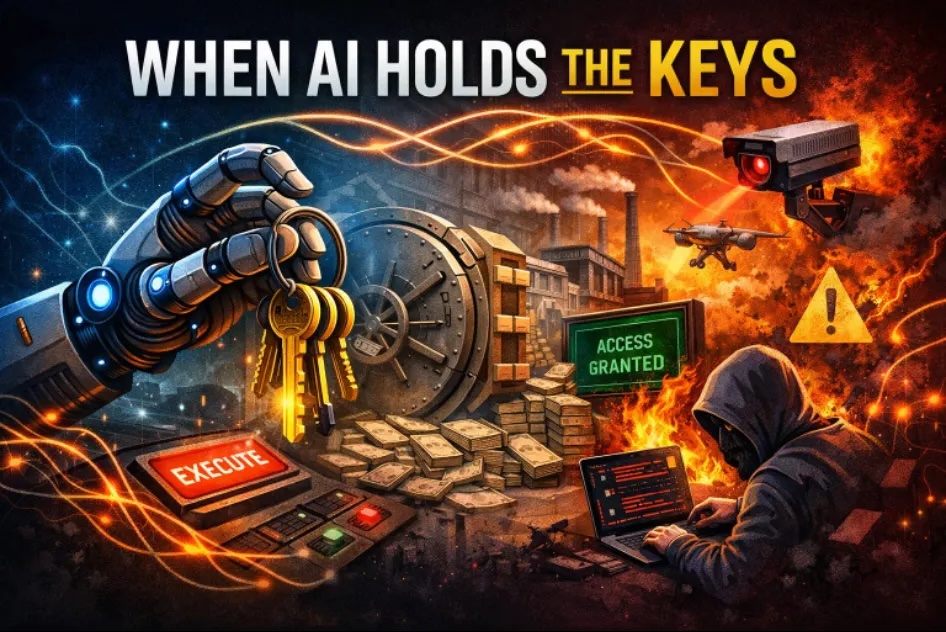

**Agentic AI Needs a Constitution, Not Just Guardrails**

*Part 3 of the Protocol-Governed Systems (PGS) Series*

In [Part 2](link-to-part-2), we defined what a Protocol-Governed System
is and where OmniBachi fits as its reference implementation. We
established three architectural commitments: semantic-agnostic
execution, linear scalability, and inverted security.

Today, we apply those commitments to the most consequential
architectural shift in enterprise software: **agentic AI**.

Because the models are no longer just answering questions. They are
acting. And acting without structural authority is how systems fail.

***AI grips power and chaos unfolds***

**Agentic AI Is No Longer Experimental**

Large language models now:

- Provision cloud resources
- Modify registries and databases
- Route multi-step workflows
- Trigger downstream side effects
- Orchestrate entire operational pipelines

In other words, they act --- autonomously, at scale, across system
boundaries.

This is not a research preview. Major enterprises are deploying agentic
AI into production today. The question is no longer *if* AI agents will
operate inside critical systems.

The question is: **under what authority?**

**The Real Risk Isn't Hallucination**

When executives express discomfort about agentic AI, hallucination is
usually the first concern.

That is not the core issue.

The core issue is **authority**.

Authority determines what is structurally possible --- not merely what
is attempted.

When a probabilistic model is allowed to:

- Select which tools to invoke
- Generate parameters dynamically
- Call APIs that modify state
- Trigger mutations with real-world consequences

...it becomes an **operational actor** inside your system.

And most current agent frameworks grant that authority *implicitly*.

The model proposes an action.\
The runtime executes it.\
Logs are written afterward.

That is execution-first governance --- authority granted by default,
accountability reconstructed after the fact.

It works until it doesn't. And in regulated industries, "until it
doesn't" arrives on the first audit.

**The Structural Gap**

Traditional application-centric architectures were not designed for
this:

- Authority boundaries are embedded in code, not declared externally.
- Behavior is mutable at runtime.
- Change coordination is procedural and fragile.
- Logs tell you what occurred. Governance determines what could not
  occur.

Now introduce a model that dynamically chooses which tools to call,
which parameters to pass, and which APIs to hit.

The attack surface expands immediately:

- **Tool overreach** --- the model invokes capabilities beyond its
  intended scope.
- **Prompt injection** --- adversarial inputs redirect agent behavior.
- **Lateral movement** --- the agent traverses system boundaries it was
  never meant to cross.
- **Privilege drift** --- authority accumulates silently across
  interactions.
- **Untraceable side effects** --- mutations occur without deterministic
  audit trails.

The problem is not intelligence. The problem is **undeclared
authority**.

**What Is Missing: Constitutional Structure**

This is exactly the problem that **Protocol-Governed Systems (PGS)**
address.

PGS is an architectural paradigm in which:

- Governance artifacts are **sovereign** --- they define what is
  permitted before anything executes.
- Behavior is **declared before execution** --- runtime discovery is
  structurally prohibited.
- Capability invocation is **contract-bound** --- every action requires
  a versioned contract.
- Side effects are **isolated** --- mutations run inside bounded,
  auditable runtimes.
- Vocabulary is **closed** --- the system rejects any action it does not
  recognize.
- Execution emits **deterministic, tamper-evident traces** --- not logs,
  traces.

**OmniBachi** is the commercial reference implementation of this
paradigm.

In PGS/OmniBachi:

- No actor --- human or AI --- holds ambient authority.
- No behavior occurs unless declared in governance artifacts.
- No capability can be invoked outside a versioned contract.
- No side effect can execute outside an isolated runtime.
- No execution occurs without trace emission.

Authority is structural, not inferred. And that changes everything about
how agentic AI can be deployed.

**Reframing Agentic AI Through PGS**

Under a protocol-governed model, the LLM is not an autonomous
orchestrator.

It is a **bounded participant**. It cannot create new authority, only
operate within declared authority.

In a conventional agent framework, the execution path looks like this:

> Model → Tool → State Change → (Log)

In PGS/OmniBachi, the sequence becomes:

> Model → **Declared Intent** (IN\_) → **Workflow** (WF\_) →
> **Capability Contract** (CC\_) → **Isolated Side Effect** (CS\_) →
> **Deterministic Trace**

The model can propose. The protocol decides.

That single inversion --- from execution-first to governance-first ---
eliminates ambient authority. The AI operates within declared boundaries
at every step, not because we trust it to, but because the architecture
enforces it.

**A Concrete Example: AI-Managed Enterprise Licensing**

Consider an AI agent tasked with managing software license allocation
across a 10,000-seat enterprise. Licenses cost real money. Compliance
violations carry real penalties.

**Without structural governance:**

- The model selects licensing tools dynamically based on its training.
- Parameters --- seat counts, entitlement tiers, user assignments ---
  are generated on the fly.
- Mutations flow through API calls to the license management system.
- Logs attempt to reconstruct what happened after the fact.
- When 500 seats are incorrectly provisioned at the premium tier,
  rollback requires manual investigation, vendor coordination, and a
  compliance review.

Nobody can answer the fundamental question: *Was the agent authorized to
allocate premium seats?*

**With PGS/OmniBachi:**

- The model emits a **declared intent** (`IN_ALLOCATE_LICENSE`) --- a
  request, not an action.
- A **workflow** (`WF_LICENSE_ALLOCATION_V0`) routes the intent through
  declared steps.
- A **capability contract** (`CC_PROVISION_LICENSE_V0`) defines exactly
  which license tiers, seat ranges, and user classes are permitted.
- **Pure transforms** (`CT_VALIDATE_ENTITLEMENT_V0`) execute
  deterministic logic --- no side effects, no ambiguity.
- **Side effects** (`CS_WRITE_LICENSE_RECORD_V0`) run inside a bounded
  runtime that only permits writes to the license registry.
- Every step produces a **deterministic, replayable trace** --- not a
  log line, a complete execution record.

The model never gains ambient authority. It operates inside declared
boundaries. And when the auditor asks, "Was this allocation authorized?"
--- the answer is in the governance artifact, not in someone's
interpretation of a log file.

**Rigidity as a Feature, Not a Bug**

Governance-first systems are intentionally rigid at the artifact
boundary.

That is precisely the point.

Artifacts are immutable.\
Authority is version-bound.\
Undeclared behavior is rejected.

But that local rigidity creates **global adaptability**:

- **Versions coexist.** V1 and V2 of a capability contract run side by
  side without conflict.
- **Domains compose cleanly.** Licensing, access control, and compliance
  assemble without hidden coupling.
- **Federation is declarative.** New business units onboard by declaring
  governance, not writing code.
- **Change is additive, not destructive.** New capabilities are authored
  and versioned. Old ones remain stable.

Flexibility moves from runtime improvisation to structural evolution.

That is the difference between experimentation and infrastructure. And
enterprises need infrastructure.

**Agentic AI in Regulated Environments**

If an AI system can:

- Provision user access
- Allocate financial resources
- Modify compliance state
- Trigger contractual obligations

Then the question is no longer *"Is the model smart enough?"*

The questions are:

- **Can you prove what authority the agent operated under?**
- **Can you replay its execution deterministically?**
- **Can you demonstrate it never exceeded declared capability?**
- **Can you bound its blast radius to a declared scope?**

If the answers depend on log aggregation, human interpretation, and
after-the-fact forensics, the system is not governed.

It is merely *observed*.

There is a fundamental difference. Observation tells you what happened.
Governance tells you what was *allowed* to happen --- and structurally
prevents everything else.

**Why This Matters Now**

Agentic AI will expand, not contract.

Tool-calling models, autonomous orchestration layers, AI-mediated
operations --- these are becoming standard enterprise architecture.
Every major cloud provider, every major AI lab, every major consultancy
is pushing agentic frameworks into production.

The question is not whether AI agents will operate inside your critical
systems. They will.

The question is whether they will operate under declared authority or
ambient authority.

The only sustainable path forward requires:

- **Declared authority** --- every agent action requires explicit
  governance.
- **Closed vocabulary** --- the system rejects what it does not
  recognize.
- **Contract-bound capability** --- versioned contracts define permitted
  behavior.
- **Isolated side effects** --- mutations run in bounded, auditable
  runtimes.
- **Deterministic trace** --- every execution is replayable, not merely
  logged.

That is what PGS formalizes.\
That is what OmniBachi implements.

**The Bottom Line**

Agentic AI without structural governance is a probabilistic actor with
ambient authority.

Agentic AI with a constitution is **infrastructure** --- reliable,
auditable, and fit for the systems that matter.

And infrastructure requires more than optimism, guardrails, or trust.

It requires **boundaries that are declared before the first action is
taken**.

**What Comes Next**

In Part 4, we move deeper into the architecture --- examining the
**Layer-Concern constitutional model** that makes PGS governance
composable and enforceable. How do you structure governance so that it
scales without becoming a bottleneck? How do concerns like security,
observability, and domain logic coexist without hidden coupling?

That is where the structural elegance of PGS becomes visible.

**The PGS Series**

This article is Part 3. Here is the full series outline:

1.  The architectural foundation *(published)*
2.  Defining PGS and OmniBachi *(published)*
3.  **Agentic AI needs a constitution** *(this post)*
4.  The Layer-Concern constitutional model
5.  Governance and authoring mechanics
6.  Protocol as behavioral law
7.  Deterministic enforcement and trace conformance
8.  Pure computation vs governed mutation
9.  Vocabulary-bounded security
10. Lifecycle economics and complexity scaling
11. The Generation-Governance Impedance Mismatch in the AI era

Want to see PGS in action? Technical papers and product briefings
available upon request, starting with Paper #1: *"Protocol-Governed
Systems: An Architectural Foundation for the AI Era"*

*--- Bachi*

*Contact: bachipeachy@gmail.com*
