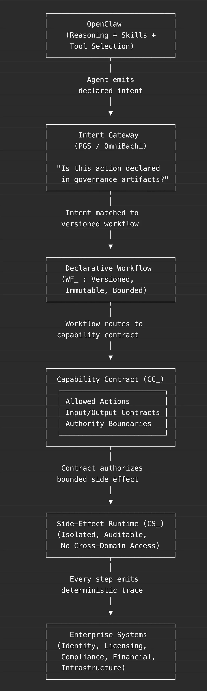

**Governing Agentic AI for Production: OpenClaw Meets Its Constitution**

*Part 3b of the Protocol-Governed Systems (PGS) Series \-\-- A Companion
to Part 3*

In [[Part
3]{.underline}](https://file+.vscode-resource.vscode-cdn.net/Users/bp/z_omnibuzz/pgs_blog/link-to-part-3),
we argued that agentic AI needs a constitution, not just guardrails. The
core insight: the real enterprise risk is not hallucination \-\-- it
is **ambient authority**, the implicit power agent frameworks grant to
models without structural boundaries.

That post was about *why*.

This one is about *how*.

And we have a concrete protagonist: **OpenClaw**.

**OpenClaw: The Agent Enterprises Want**

[[OpenClaw]{.underline}](https://openclaw.ai/) is an open-source
autonomous AI assistant that is catching fire in the developer
community. It runs locally, uses Claude as its reasoning engine, and has
capabilities that would have seemed science fiction two years ago:

- **Full system access** \-\-- file management, shell commands, script
  execution

- **Browser automation** \-\-- web navigation, data extraction, form
  submission

- **50+ service integrations** \-\-- Gmail, GitHub, Slack, Spotify,
  Obsidian, and growing

- **Persistent memory** \-\-- learns user preferences and context across
  sessions

- **Self-extending skills** \-\-- it can write its own capabilities via
  ClawHub

OpenClaw is powerful precisely because it has *broad authority*. It can
read your files, execute commands, navigate the web, send messages, and
modify state across dozens of systems \-\-- autonomously.

For an individual developer, that is transformative.

For an enterprise, that is a risk profile.

**The Enterprise Paradox**

Every enterprise technology leader sees the same thing: agentic AI like
OpenClaw can automate operations that currently require entire teams
\-\-- license provisioning, compliance workflows, infrastructure
management, vendor coordination.

The capability is real. The ROI is obvious.

But the moment an OpenClaw-class agent can:

- Provision user accounts in your identity system

- Allocate budget across cost centers

- Modify compliance records

- Trigger contractual obligations with vendors

- Execute shell commands on production infrastructure

\...every CISO, compliance officer, and auditor asks the same questions:

*What authority does this agent operate under?*\
*Can we prove it never exceeded that authority?*\
*Can we replay what it did \-\-- deterministically?*\
*Can we bound the damage if it goes wrong?*

OpenClaw was not designed to answer these questions. No agent framework
was. They are optimized for capability and flexibility \-\-- not for
declared authority, deterministic audit, and blast-radius containment.

That is not a criticism. It is a statement of architectural scope.

The governance problem belongs to a different layer.

**The Architecture: A Constitutional Layer Between Agent and
Enterprise**

The solution is not to cripple OpenClaw. Its broad capability is the
whole point.

The solution is to introduce a **constitutional governance
layer** between the agent and the enterprise systems it touches.

Instead of:

OpenClaw → Tool → System → (Log)

The execution path becomes:

OpenClaw → **Declared Intent** → **Governed Workflow** → **Capability
Contract** → **Bound Runtime** → **Deterministic Trace**

The agent proposes. The governance layer decides. The enterprise system
executes only what is declared.

{width="6.588716097987752in" height="4.392477034120735in"}

**Figure 1.** *Constitutional governance layer between OpenClaw and
enterprise\
systems.*

*OpenClaw handles reasoning, memory, and skill selection. PGS/OmniBachi
handles authority, isolation, and deterministic trace. Neither replaces
the other.*

**A Concrete Scenario: OpenClaw Managing Enterprise Licenses**

Make this real. A large enterprise deploys an OpenClaw-based agent to
manage software license allocation across 10,000 seats.

**Without the governance layer:**

OpenClaw receives a request: *\"Provision 200 premium licenses for the
APAC engineering team.\"*

It uses its skills to call the license management API. It selects
parameters based on context. It provisions the seats. It logs what it
did.

Three weeks later, an audit reveals 200 premium seats were allocated
when the APAC team was only authorized for standard tier. The cost
difference: \$400,000 annually.

The investigation begins. Log files are aggregated. The agent\'s
reasoning is reconstructed from traces. Nobody can definitively
answer: *Was the agent authorized to allocate premium seats?*

Because the answer was never declared. It was inferred.

**With PGS/OmniBachi as the governance layer:**

OpenClaw receives the same request. It emits a **declared
intent**: IN_ALLOCATE_LICENSE.

The intent hits the PGS gateway.
A **workflow** (WF_LICENSE_ALLOCATION_V0) routes it through declared
steps. A **capability contract** (CC_PROVISION_LICENSE_V0) specifies:
APAC engineering is authorized for standard tier only, maximum 500 seats
per request.

The premium allocation is **structurally rejected**. Not filtered. Not
flagged for review. Rejected \-\-- because the governance artifact does
not declare it.

OpenClaw is informed. It can propose an alternative within declared
bounds. Or escalate to a human with the specific constraint that blocked
it.

The \$400,000 mistake never happens. Not because someone caught it \-\--
but because the architecture made it impossible.

**\**

**What Changes \-\-- Concretely**

{width="6.66in" height="6.004110892388452in"}

The difference is not degree. It is kind.

One system hopes the agent behaves. The other makes misbehavior
architecturally impossible.

**Five Enterprise Guarantees**

For CISOs, compliance officers, and architects evaluating agentic AI for
production, the governance layer provides five structural guarantees:

**1. Contained Authority**

No ambient authority. OpenClaw\'s broad skill set is channeled through
declared governance artifacts. The agent cannot invoke capabilities that
are not versioned and authorized. Authority is explicitly granted, not
assumed.

**2. Bounded Blast Radius**

An agent authorized to read license records cannot write compliance
state. An agent authorized for standard-tier provisioning cannot
allocate premium seats. Cross-domain coupling is structurally
prohibited, not policy-filtered.

**3. Deterministic Auditability**

Every execution produces a structured, tamper-evident trace \-\-- not a
log line, a complete execution record. When the auditor asks *\"What
happened and what was it authorized to do?\"*, the answer is
deterministic and replayable.

**4. Versioned Governance**

Agent capabilities are version-bound. V1 and V2 of a capability contract
coexist without conflict. New authority is additive. Old authority
remains stable. There is no drift.

**5. Compliance as Output**

Audit artifacts are structural outputs of every execution \-\-- not
afterthoughts assembled for quarterly reviews. The system does
not *support* compliance. It *produces* compliance as a byproduct of
governed execution.

**Strategic Positioning: Complementary, Not Competing**

This is worth stating clearly:

PGS/OmniBachi is **not a replacement for OpenClaw**. OpenClaw\'s
reasoning, memory, skill extensibility, and broad integration surface
are exactly what enterprises need for autonomous operations.

PGS/OmniBachi is the **governance substrate** that makes OpenClaw
enterprise-ready.

- **OpenClaw** answers: *What can the agent do?*

- **PGS/OmniBachi** answers: *What is the agent authorized to do?*

Open frameworks accelerate innovation.\
Governed execution enables production.

These are complementary layers \-\-- and both are required.

**Who Needs This**

Any organization deploying agentic AI into:

- **Regulated industries** \-\-- financial services, healthcare,
  insurance, where every action must be auditable and authority
  provable.

- **Large enterprises** \-\-- where blast radius, cross-domain coupling,
  and change coordination are existential concerns.

- **Public sector** \-\-- where authority must be declared, not
  inferred.

- **Any system where AI holds production authority** \-\-- provisioning,
  allocation, approval, compliance, infrastructure.

If the agent can touch systems that matter, governance is not optional.

**Why Now**

Agentic AI is moving from experimentation to operational control faster
than governance teams can respond. OpenClaw\'s trajectory is proof: the
community is growing, the skills are multiplying, the integrations are
expanding.

That acceleration is the opportunity *and* the risk.

As soon as an agent can touch identity systems, allocate financial
resources, modify policy state, or execute compliance workflows \-\--
governance becomes non-optional.

Organizations that adopt structural authority boundaries early will:

- **Reduce coordination overhead** \-\-- governance is declared once,
  not negotiated per deployment.

- **Simplify compliance posture** \-\-- audit artifacts are automatic,
  not manually assembled.

- **Avoid retrofitting** \-\-- adding governance after an incident is
  expensive, disruptive, and late.

The cost of governing early is architectural discipline.\
The cost of governing late is incident response.

**The Bottom Line**

OpenClaw gives agents the capability to act autonomously across
enterprise systems.

PGS/OmniBachi gives enterprises the guarantee that those actions are
declared, bounded, isolated, and traceable.

Together, they convert probabilistic orchestration into **deterministic
infrastructure**.

The agents are ready.\
The question is whether the governance is.

**The PGS Series**

This article is Part 3b \-\-- a companion to Part 3. Here is the full
series outline:

1.  The architectural foundation *(published)*

2.  Defining PGS and OmniBachi *(published)*

3.  Agentic AI needs a constitution *(published)* 

4.  **Governing agentic AI for production** *(this post)*

5.  The Layer-Concern constitutional model

6.  Governance and authoring mechanics

7.  Protocol as behavioral law

8.  Deterministic enforcement and trace conformance

9.  Pure computation vs governed mutation

10. Vocabulary-bounded security

11. Lifecycle economics and complexity scaling

12. The Generation-Governance Impedance Mismatch in the AI era

13. Want to see PGS in action? Technical papers and product briefings
    available upon request, starting with Paper #1: *"Protocol-Governed
    Systems: An Architectural Foundation for the AI Era"*

*\-\-- Bachi\
Contact: [[bachipeachy@gmail.com]{.underline}](mailto:bachipeachy@gmail.com)*
