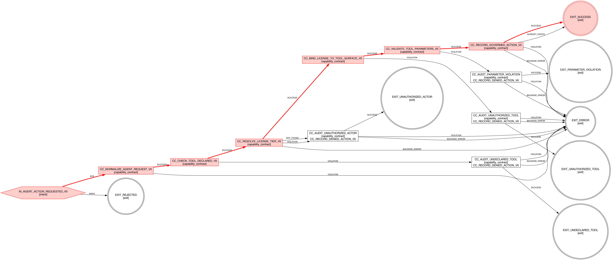

**I Built an AI Governance Domain in a Day. Here Is What That Tells You.**

*Part 6 of the Protocol-Governed Systems (PGS) Series*

In [Part 3](link-to-part-3), I argued that agentic AI needs a constitution, not just guardrails. In [Part 4](link-to-part-4), I made it concrete --- showing how a constitutional governance layer between an agent and enterprise systems could structurally prevent a $400,000 license misallocation. In [Part 5](link-to-part-5), I dissected quiet privilege escalation --- the silent accumulation of composite authority that traditional controls were never designed to catch.

Those posts defined the problem. They made the case. They laid out the architecture.

But they were all arguments.

This post is about what happened when I sat down and actually built the thing.

**The Business Requirements Were Already Written**

Something interesting happened after Part 4. That blog post had described a concrete business scenario: an enterprise deploying an AI agent to manage software license allocation. It defined actors, authority boundaries, denial paths, and the specific governance guarantees an enterprise would need.

Those were business requirements. Concrete ones. The kind you could hand to an architect and say: *build this*.

So I did.

I took the requirements from Part 4 and built a complete governance domain from scratch. A greenfield domain. No prior implementation to extend. No scaffolding to lean on. Just the requirements and the platform.

And the experience was, frankly, surprising.

**Following the Recipe**

OmniBachi has a construction method --- a defined sequence of acts for building a new domain. Think of it as a cookbook. You follow the acts in order. Each act has a clear deliverable. Each deliverable feeds the next.

I had used this method before on existing domains. But this was the first time I applied it to a completely new domain --- one that had never existed in the system. A greenfield build. The hardest test of any construction method.

Before describing how it unfolded, let me show you what the method produced --- because the output tells the story better than the process.

**Reading the Governance Map**

The diagram below is the complete governance workflow for AI agent actions. It was generated automatically from the governance declarations --- before any execution logic was written. The red path shows the "happy flow": the route an authorized action takes through the system.

*Figure 1. Agent governance workflow --- generated from governance declarations before any code was written. The red path traces an authorized action. Every other path is a structurally enforced denial.*

Look at the red path. It tells you everything about how this system governs an AI agent. Read it as a series of questions the system asks --- in order --- before it will allow anything to happen:

**Gate 1 --- "Is this a well-formed request?"**\
The agent proposes an action. Before anything else, the system normalizes and validates the request structure. Malformed requests never proceed. They are rejected at the door.

**Gate 2 --- "Is this tool even declared?"**\
The system checks whether the requested tool exists in a closed registry. Not "is it installed." Not "is there an API for it." Is it *declared* --- explicitly listed as a tool this governance domain recognizes? If an agent asks to run a shell command and shell commands are not in the registry, the request does not fail gracefully. It exits as UNDECLARED_TOOL. The tool was never part of the governed universe.

**Gate 3 --- "Does this user have an active license?"**\
The system looks up the requesting user's license status. Not the agent's permissions. The *human* whose authority the agent is acting under. No license? No active subscription? The request exits as UNAUTHORIZED_ACTOR. The agent cannot proceed on behalf of someone who has no standing.

**Gate 4 --- "Is this tool authorized for this license tier?"**\
A standard-tier license might authorize basic provisioning. An enterprise-tier license might authorize premium operations. The system maps the user's tier to the tools they are authorized to use. A standard-tier user requesting a premium tool? EXIT_UNAUTHORIZED_TOOL. Not filtered. Not flagged. Structurally denied.

**Gate 5 --- "Are the parameters within declared bounds?"**\
Even when the tool is authorized, the *parameters* must satisfy declared constraints. Quantity limits. Value ranges. Required fields. A request to provision 10,000 seats when the constraint says maximum 500? EXIT_PARAMETER_VIOLATION. The agent cannot negotiate. The boundary is declared.

**Gate 6 --- "Record and authorize."**\
Only after passing every gate does the system record the governed action, emit a deterministic audit trail, and reach EXIT_SUCCESS.

That is the red path. Six gates. Each one a structural checkpoint. Each one declared in governance artifacts before any execution logic was written.

Now look at the rest of the diagram. Every branching path that leaves the red line leads to a denial exit --- and every denial exit passes through an audit step first. Denied actions are not silently dropped. They are recorded with the same rigor as authorized ones. The system produces a complete, symmetric audit trail: what was allowed, what was denied, and why.

**What This Diagram Represents**

This is not a flowchart someone drew on a whiteboard. It was generated from the governance declarations by a tool that reads the declared structure and renders the execution graph. The diagram existed before the first line of execution logic was written.

That is worth pausing on.

In conventional software, you build the system first and document the flow afterward --- if you document it at all. Here, the flow was declared first. The diagram is not documentation of behavior. It *is* the behavior. The execution engine reads the same declarations that generated this graph.

What you see is what runs.

**Building It: How the Day Unfolded**

The construction method has a defined sequence of acts. Here is how it went.

**Act 0 --- Write the specification.** Before touching any artifact, I wrote a structured domain spec. Not a slide deck. A formal document declaring six invariants the domain must guarantee: no ambient authority, closed tool surface, license-bound authority, parameter-bound execution, domain isolation, and deterministic trace. It described every actor, every gate, every denial path, and every test scenario.

This turned out to be the most valuable artifact of the entire build. I referenced it in every subsequent act. It was not a formality. It was the constitution that governed the construction itself.

**Acts I through III --- Structure, govern, validate.** I created the domain skeleton, authored fifteen governance declarations (the actors, the intent, the events, the contracts, the workflow, the runtime bindings), and compiled them. Conformance tests were auto-generated. The diagram above was produced. Structural correctness was verified before any execution logic existed.

**Acts V and VI --- Implement and execute.** I wrote three small, pure functions (the kind of straightforward logic that does set-membership checks, lookups, and parameter validation) and ran seven end-to-end test scenarios: two authorized paths and five denial paths covering every gate in the diagram.

The whole build --- from spec to passing tests --- took a day.

**The Bugs That Proved the Architecture**

Act VI surfaced five bugs. In conventional development, integration bugs are dreaded. They cascade. They force refactors. They reveal that your architecture does not actually compose.

These bugs did the opposite.

Every one of them was about *authoring clarity* --- a template formatted wrong, a reference path slightly off, an assumption about how results flow between steps. Not one was a structural failure. No race conditions. No authority bypass. No cross-domain leakage. No trace corruption.

The core engine was stable. The governance model was sound. The friction was in the learning curve of expressing governance declarations precisely.

That is a very good place to be. It means the architecture holds, and the remaining work is making it easier to author correctly --- which is exactly what a maturing cookbook should address.

**Nothing Else Broke**

The most important question after building a new domain is not *does it work?*

It is: *did anything else break?*

The platform already had other domains running --- blockchain wallet creation, actor verification, license management. After adding agent governance, I ran full regression. Every existing domain passed clean. No cross-domain interference. No shared state corruption. No unexpected side effects.

The new domain composed into the existing platform the way a new chapter composes into a book. It consumed data from the licensing domain (read-only --- it cannot modify licensing state), but otherwise it was completely isolated.

That is not typical software behavior. Adding a new governance model to most enterprise systems requires weeks of integration work, cross-team coordination, and regression testing. Here, the isolation is structural. Domains cannot interfere with each other because the architecture makes interference impossible --- not because developers are careful.

**Compare This With How Enterprises Build Governance Today**

In a conventional enterprise, building AI agent governance would look something like this:

1. Business proposes governance requirements.
2. Tickets are created across multiple teams.
3. Developers wire permission checks into existing services.
4. Security reviews happen late, after implementation.
5. Logging and monitoring are bolted on.
6. Edge cases surface. Exceptions are patched.
7. Drift accumulates. The governance surface becomes unclear.
8. An audit reveals gaps. Remediation begins.

Authority is managed by configuration.\
Behavior expands implicitly.\
Governance is reactive.\
The timeline is measured in quarters.

This build followed a different arc:

Business Requirements → Structured Specification → Declared Authority → Deterministic Execution → Trace Validation

The governance boundary --- every gate, every denial path, every audit record you see in that diagram --- existed before the first side effect executed.

**The Role of AI in Building This**

Here is an irony worth noting.

I used an AI coding assistant to help build the governance domain that governs AI agents. The construction method channeled that assistance naturally.

The governance declarations --- the authority boundaries, the workflow structure, the denial paths --- those are human decisions. They define *what is permitted*. No model should be making those choices autonomously.

But the implementation work --- the pure validation functions, the test scenarios --- that is exactly where language models excel. Well-scoped, structurally constrained work with clear acceptance criteria.

The method creates a natural separation: humans define authority; AI assists with mechanism. The architecture enforces that separation structurally, not through trust.

AI can help build the gates.\
It does not get to decide which gates exist.

**What This Actually Validates**

The most important outcome was not that "agent governance works."

It was this:

A complete governance domain --- with the five-gate pipeline, four denial paths, symmetric audit, and deterministic trace you see in that diagram --- was added to a running platform without modifying the execution engine or any existing domain.

That means:

- **Authority is composable.** New governance models compose without coupling.
- **Domains are isolatable.** Agent governance consumes licensing data read-only. It cannot mutate licensing state. The boundary is structural.
- **Structure is sovereign.** The governance declarations are the single source of truth. Not code. Not configuration. Not documentation that drifts.
- **Execution is substrate.** The engine did not need to know it was governing AI. It only needed to enforce declared authority.

The system does not distinguish between governing a blockchain wallet and governing an AI agent. It enforces whatever authority is declared. That semantic blindness is not a limitation. It is the entire point.

**A Different Foundation**

If enterprises are serious about governing agentic AI --- and after the patterns described in Parts 3, 4, and 5, they must be --- they need more than runtime policy layers bolted onto existing infrastructure.

They need a method that starts with structure and ends with deterministic execution.

What I validated is that such a method exists. It moves from business requirements to the running, tested, auditable governance you see in that diagram --- without architectural instability. It composes cleanly with existing domains. It produces compliance as a structural output, not a procedural afterthought.

And it follows a recipe. A defined, repeatable sequence of acts that any disciplined team can follow.

Not hype.\
Not fear.\
Not a six-month integration project.

Just a disciplined path from declared authority to bounded execution.

**The PGS Series**

This article is Part 6. Here is the full series outline:

1. The architectural foundation *(published)*
2. Defining PGS and OmniBachi *(published)*
3. Agentic AI needs a constitution *(published)*
4. Governing agentic AI for production *(published)*
5. The quiet privilege escalation *(published)*
6. **From blog post to bounded runtime** *(this post)*
7. The Layer-Concern constitutional model
8. Governance and authoring mechanics
9. Protocol as behavioral law
10. Deterministic enforcement and trace conformance
11. Pure computation vs governed mutation
12. Vocabulary-bounded security
13. Lifecycle economics and complexity scaling
14. The Generation-Governance Impedance Mismatch in the AI era

Want to see PGS in action? Technical papers and product briefings available upon request, starting with Paper #1: *"Protocol-Governed Systems: An Architectural Foundation for the AI Era"*

*--- Bachi*

*Contact: bachipeachy@gmail.com*
