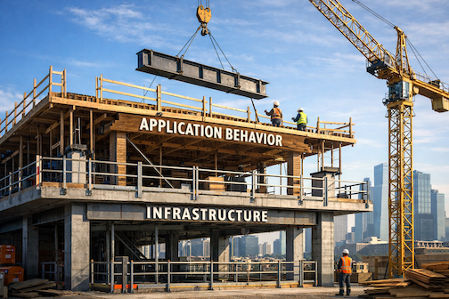

**From Serverless Guardrails to Structural Governance**

*Part 7 of the Protocol-Governed Systems (PGS) Series*

]

In Part 6, I showed what happened when I built a complete AI governance
domain in a day --- from specification to deterministic trace ---
without modifying the execution engine.

That post demonstrated something important:

Governance can be structural.\
It can be declared first and executed mechanically.\
It does not need to be embedded in application code.

After publishing it, several readers pointed me toward a parallel thread
in the industry: the rise of "Security-First" and "Golden Path"
development practices in cloud-native systems.

It's worth pausing on that convergence.

Because it reveals something deeper than tooling trends.

It reveals that the center of gravity in software architecture is shifting.

**The Industry Is Moving Governance Left**

In cloud-native environments, especially serverless architectures,
practitioners have learned a painful lesson:

If security and infrastructure constraints are bolted on after the fact,
they fail.

So the industry response has been to move governance into:

- Infrastructure-as-Code templates

- Serverless blueprints

- Pre-approved constructs

- Schema validation at the edge

Instead of trusting developers to "remember" best practices, the
platform enforces them by default.

If you deploy through the approved construct, you inherit:

- Logging

- Encryption

- IAM boundaries

- Input validation

- Network constraints

This is often called a **Golden Path**.

The developer does not choose governance.\
Governance is embedded in the template.

That is not accidental.\
It is structural pressure responding to integration entropy.

**What Golden Paths Prove**

Golden Paths prove one thing clearly:

Procedural governance does not scale.

You cannot rely on:

- Checklists

- Code reviews

- Late-stage security audits

- "Please follow the guidelines"

So the industry embeds governance into deployable artifacts.

That is progress.

But it operates at a specific layer --- the deployment and infrastructure layer, enforced by the cloud.

**Where PGS Goes One Layer Deeper**

Protocol-Governed Systems operate at a different enforcement layer.

Golden Path governance says:

"If you use this template, you inherit secure infrastructure."

PGS says:

"If it is not declared in protocol, it cannot execute."

Golden Path governance is enforced by:

- Cloud providers

- IaC engines

- Security platforms

PGS governance is enforced by:

- The protocol itself

- The builder

- The execution engine

One governs how systems are deployed.

The other governs what systems are allowed to do.

This is not competition.\
It is layering.

**Embedded vs Declared Governance**

Modern serverless practice insists that governance must be declared, not
tribal.

PGS agrees --- but pushes further.

Infrastructure governance:

- Declares resource boundaries

- Declares IAM policies

- Declares validation schemas

Protocol governance:

- Declares authority boundaries

- Declares behavioral invariants

- Declares outcome classifications

- Declares mutation surfaces

Infrastructure ensures:

"This function runs securely."

Protocol ensures:

"This behavior is admissible."

That is a different axis of control.

**Validated Input vs Structural Admissibility**

Many serverless best practices emphasize strict schema validation at the
edge.

Reject malformed input before it touches business logic.

That is good engineering.

PGS generalizes that concept:

Every governance artifact must pass a constitutional admissibility test
before execution.

Not just input.

The workflow structure.\
The capability bindings.\
The authority declarations.\
The side-effect adapters.

Validation is not a function-level concern.

It is a structural concern.

**Golden Path vs Invariant Binding**

Golden Paths enforce invariants at deployment:

- You cannot deploy without encryption enabled.

- You cannot deploy without logging configured.

PGS enforces invariants at execution:

- You cannot mutate undeclared state.

- You cannot invoke undeclared capability.

- You cannot bypass declared authority path.

- You cannot collapse denial into silent success.

Golden Paths constrain how you deploy.

Protocol governance constrains what the system can do.

**Why This Convergence Matters**

The rise of Security-First and Blueprint-driven development is not a
coincidence.

It is a symptom.

It signals that:

- Integration entropy is unsustainable.

- Procedural governance fails at scale.

- Structural enforcement must replace guideline enforcement.

Cloud-native practices are solving this problem at the infrastructure
layer.

PGS solves it at the architectural layer.

And as AI accelerates generation speed --- as discussed in Part 5 ---
enforcement must move even closer to the source of behavior.

Infrastructure guardrails cannot prevent application-level authority
drift.

Only protocol-level governance can.

**The Layered Governance Model**

Think of governance as layers:

| **Layer** | **What Is Governed** | **Who Enforces** |
|---|---|---|
| Infrastructure | Deployment, IAM, network | Cloud platform |
| Application | Code patterns, security linting | CI / review |
| Protocol | Authority, workflow, mutation | Execution engine |

Golden Paths strengthen Layer 1.

PGS formalizes Layer 3.

As systems grow more autonomous, Layer 3 becomes decisive.

**AI Changes the Equation**

When AI generates code at machine speed, infrastructure guardrails are
not enough.

AI can still:

- Introduce implicit authority coupling

- Create undeclared behavioral paths

- Overwrite prior logic without version structure

- Produce self-validating tests

Infrastructure remains secure.

Behavior drifts.

Security without behavioral governance is still structurally unstable.

Protocol governance addresses that gap.

It does not slow generation.\
It binds generation to declared authority.

That is the structural difference.

**This Is Convergent Evolution**

The industry is not moving backward.

It is evolving toward structural governance.

Serverless blueprints.\
Schema validation.\
Infrastructure-as-Code guardrails.

These are early-stage expressions of the same instinct:

Governance must be structural, not procedural.

Protocol governance extends that instinct from infrastructure to
behavior itself.

The layers are not in conflict.

They are converging toward the same inevitability: structural authority must replace procedural oversight.

**What Comes Next**

If governance can be declared at the protocol layer:

- AI can generate governance artifacts safely.

- New domains can compose without integration code.

- Audit becomes structural, not forensic.

- Marginal domain cost approaches zero.

That is not a tooling claim.

It is an architectural claim.

And it is already demonstrable.

The bar was raised for infrastructure. The same must now happen for behavior.

In Part 8, we'll examine the **Layer-Concern Constitutional Model** ---
the formal separation that makes protocol-level enforcement possible.

**The PGS Series**

1.  The architectural foundation *(published)*
2.  Defining PGS and OmniBachi *(published)*
3.  Agentic AI needs a constitution *(published)*
4.  Governing agentic AI for production *(published)*
5.  The quiet privilege escalation *(published)*
6.  From blog post to bounded runtime *(published)*
7.  **From serverless guardrails to structural governance** *(this post)*
8.  The Layer-Concern constitutional model
9.  Governance and authoring mechanics
10. Protocol as behavioral law
11. Deterministic enforcement and trace conformance
12. Vocabulary-bounded security
13. Lifecycle economics and complexity scaling
14. The Generation-Governance Impedance Mismatch in the AI era

Want to see PGS in action? Technical papers and product briefings available upon request, starting with Paper #1: *"Protocol-Governed Systems: An Architectural Foundation for the AI Era"*

*--- Bachi*

*Contact: bachipeachy@gmail.com*

---

*This post was inspired by Ran Isenberg's work on infrastructure governance at Palo Alto Networks. His thinking on structural enforcement at the deployment layer prompted a natural question: why stop there?*
