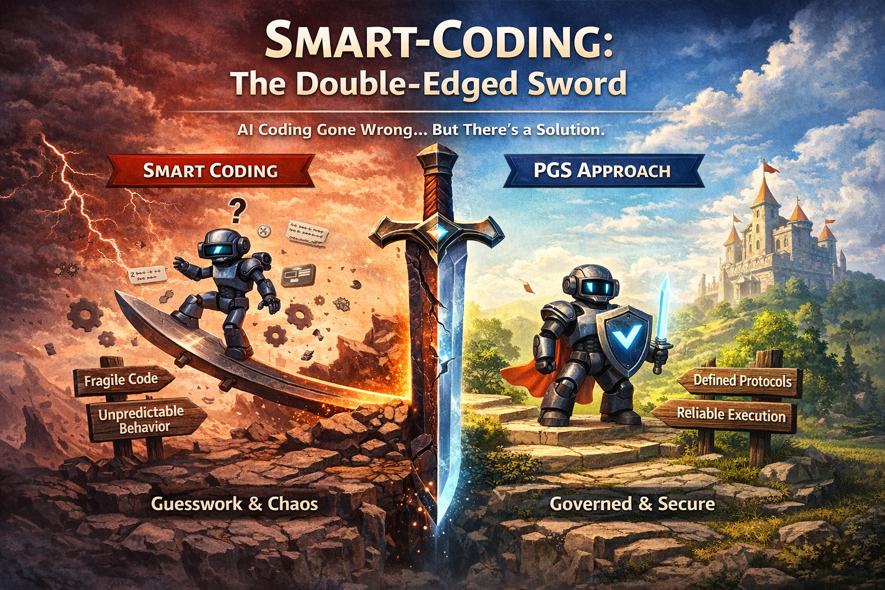

**Why Smart Coding Is a Double-Edged Sword**

***AI coding is sharpening the wrong edge — and how to correct it***

*Part 9 of the Protocol-Governed Systems (PGS) Series*

In the previous post, we explored how Protocol-Governed Systems deliver three structural dividends: governance, protocol reuse, and architectural clarity.

Those dividends become even more relevant when we examine how software is now being created.

Because today, a new force is reshaping development practice:

**AI-assisted coding.**

And with it, a concept that sounds entirely positive — but deserves closer examination:

**Smart coding.**

---

## What Is "Smart Coding"?

Smart coding is the practice of writing software using:

- abstraction
- inference
- flexible patterns
- developer intuition

In traditional engineering, this has been a strength.

A skilled engineer:

- infers intent from context
- writes adaptive logic
- handles edge cases proactively
- builds systems that "just work"

This kind of intelligence embedded in code is often celebrated as craftsmanship.

And for a long time, it worked well.

---

## What Is "AI Coding"?

AI coding extends that philosophy.

Instead of a human applying intuition,
AI systems now:

- generate code from prompts
- infer missing details
- suggest patterns and fixes
- optimize for speed and completion

The result is powerful:

**Software can now be produced at machine speed.**

But there is a subtle shift happening beneath the surface.

---

## Where the Double Edge Appears

Smart coding has always assumed something important:

**The person writing the code understands the system.**

AI fundamentally changes that assumption.

Now:

- code is generated faster than it can be reviewed
- intent is partially inferred, not fully declared
- behavior emerges from patterns, not explicit design
- assumptions multiply invisibly

In other words:

**The system becomes implicitly defined.**

This is where the edge flips.

---

## The First Edge (Helpful)

Smart coding:

- reduces boilerplate
- accelerates development
- adapts to changing requirements
- enables rapid prototyping

This is the edge we celebrate — and rightly so.

For small systems, skilled teams, and well-understood domains, smart coding remains effective.

---

## The Second Edge (Risky)

When scaled through AI:

- implicit assumptions multiply exponentially
- behavior becomes harder to reason about
- governance drifts away from execution
- correctness depends on interpretation
- edge cases compound silently

What used to be *cleverness* becomes:

**Unbounded inference at machine speed.**

And that is not a coding problem.

It is an **architectural problem**.

---

## The Core Tension

From the previous post, we saw:

**Software can now be generated faster than humans can govern it.**

Smart coding amplifies that gap.

Because it relies on:

- **inference** instead of declaration
- **flexibility** instead of constraint
- **intelligence inside code** instead of structural governance

But effective governance requires the opposite:

- explicit rules
- deterministic behavior
- inspectable structure
- mechanical validation

This mismatch creates what we call:

**The generation–governance gap.**

And AI is widening it every day.

---

## A Different Approach: Protocol-Governed Systems (PGS)

Protocol-Governed Systems take a fundamentally different path.

Instead of making code smarter, they make **execution governed**.

### What Is PGS?

PGS is an architectural approach where:

- system behavior is **declared as protocol artifacts**
- execution is **driven by those declarations**
- code becomes a **mechanism**, not a decision-maker

In practical terms:

- workflows define allowed behavior
- capability contracts define boundaries
- validation happens before execution
- violations are rejected, not handled

---

## Why This Changes the Equation

Smart coding tries to improve *how code behaves*.

PGS changes *where behavior is defined*.

### In a Smart Coding Model

- behavior lives in code
- correctness depends on interpretation
- safety depends on discipline
- governance is procedural

### In a PGS Model

- behavior lives in protocol
- correctness is validated structurally
- safety is enforced mechanically
- governance is architectural

The difference is subtle but profound.

---

## Reframing the Role of AI

This is not an argument against AI coding.

In fact, **AI becomes more powerful in a governed model**.

### Without Governance

AI:

- generates code with implicit assumptions
- introduces hidden variability
- compounds complexity invisibly
- makes systems harder to reason about

### With Protocol Governance

AI can:

- generate workflows safely within defined boundaries
- compose capabilities inside enforceable constraints
- operate at machine speed without sacrificing correctness
- amplify engineering velocity without amplifying risk

Instead of amplifying risk,
AI becomes a **controlled accelerator**.

That is the opportunity most organizations are missing.

---

## The Real Insight

Smart coding is not wrong.

It is simply **incomplete at scale**.

It works effectively when:

- systems are small
- developers share context
- behavior is manageable
- change is gradual

But in the AI era:

**Inference scales faster than understanding.**

And that is where architecture must evolve.

---

## From Smart Code to Governed Execution

The shift is subtle but critical:

- from **intelligent code**
- to **explicitly governed systems**

This does not eliminate flexibility.

It relocates it:

- from hidden logic
- to visible, enforceable structure

The result is systems that are both:

- **evolvable** (behavior can change through protocol)
- **governable** (constraints are enforced mechanically)

That combination becomes essential as AI accelerates.

---

## What Comes Next

If we accept that:

- AI will continue to accelerate code generation
- systems will continue to grow in complexity
- governance cannot remain procedural

Then the question is no longer:

**"How do we write smarter code?"**

It becomes:

**"How do we constrain behavior without slowing innovation?"**

Protocol-Governed Systems are one answer.

By moving governance from code into protocol, we create systems where:

- AI can generate safely
- domains can compose cleanly
- complexity scales linearly
- behavior remains deterministic

---

## The Architectural Choice

We are at an inflection point.

AI coding tools are becoming exponentially more capable.

Organizations have two paths:

**Path 1: Accelerate smart coding**

- Generate code faster
- Rely on review processes
- Accept growing governance debt
- Hope discipline scales

**Path 2: Adopt structural governance**

- Declare behavior in protocol
- Enforce constraints mechanically
- Let AI operate within boundaries
- Scale governance architecturally

The first path is familiar.

The second path requires rethinking architecture.

But the second path is the one that scales.

---

## Final Thought

Smart coding served us well in the human-speed era.

But machine-speed generation requires machine-speed governance.

That governance cannot live in code.

It must live in **architecture**.

Protocol-Governed Systems demonstrate how.

---

In the next post, we will explore how this structural governance is implemented through the **Layer–Concern Constitutional Model**, and how it enables large systems to evolve without losing control.

---

## The PGS Series

1. The architectural foundation *(published)*
2. Defining PGS and OmniBachi *(published)*
3. Agentic AI needs a constitution *(published)*
4. Governing agentic AI for production *(published)*
5. The quiet privilege escalation *(published)*
6. From blog post to bounded runtime *(published)*
7. From serverless guardrails to structural governance *(published)*
8. The Three Dividends of Protocol-Governed Systems *(published)*
9. **Why Smart Coding Is a Double-Edged Sword** *(this post)*
10. The Layer-Concern Constitutional Model
11. Governance and authoring mechanics
12. Deterministic enforcement and trace conformance
13. Vocabulary-bounded security
14. The generation–governance gap in the AI era

---

*These ideas are explored in depth in the upcoming book:*
***Protocol-Governed Systems: Architecture for the AI Era***

*The book includes a working reference implementation called **OmniBachi**, demonstrating how protocol governance can be enforced mechanically.*

---

*— Bhash Ganti (aka Bachi)*
*OmniBachi™ Initiative*

---

## LinkedIn Teaser

Really appreciate this thread — bringing mathematical rigor into software execution is long overdue.

LeanFRO's focus on proving correctness *after execution* is a powerful step forward. It raises the bar from "works in practice" to "can be verified in principle."

But AI-driven development is changing the timing of the problem.

When code is generated at machine speed, even provable correctness *after the fact* can become a bottleneck. The question then becomes:

**Can we shift correctness *earlier* — before execution even begins?**

One approach we've been exploring is **protocol-first architecture**:

- behavior is declared explicitly (workflows, intents)
- side-effects are enumerated as contracts
- execution is constrained to what the protocol permits

In that model:

**Correctness isn't just proven — it's structurally enforced upfront.**

Which creates an interesting complement to LeanFRO:

- **LeanFRO** → proves correctness of execution
- **Protocol-first** → constrains what can be executed

Together, this opens the door to systems where correctness is both **pre-guaranteed and post-verifiable**.

Curious how the LeanFRO community sees this "shift-left" of correctness.

I wrote a short piece expanding on this idea in the context of AI coding:

👉 [link to blog]
