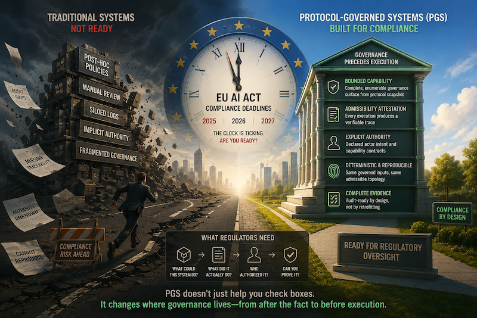

**The EU AI Act Is Here. Your Governance Architecture Isn't Ready.**

*Why the compliance clock is ticking --- and why post-hoc policy won't
survive it*

*Part 11 of the Protocol-Governed Systems (PGS) Series*

------------------------------------------------------------------------

In the previous post, we examined how AI accelerates implementation
velocity without solving governance --- and how Protocol-Governed
Systems invert that equation by making governance structural rather than
procedural.

That argument was architectural.

This one is regulatory.

Because the EU AI Act is no longer a proposal. It is law. And its
obligations are phasing in now.

------------------------------------------------------------------------

## The Regulatory Reality

The EU AI Act entered into force in August 2024. Its obligations are
being phased in between 2025 and 2027.

For providers and deployers of AI systems --- particularly those
classified as "high-risk" --- the Act imposes specific, enforceable
requirements:

- **Traceability**: the ability to trace what an AI system did and why
- **Authority provenance**: demonstrating who authorized an AI action
  and under what constraints
- **Risk management**: ongoing identification and mitigation of risks
  throughout the AI lifecycle
- **Record-keeping**: maintaining logs sufficient to ensure traceability
  of the AI system's functioning
- **Human oversight**: ensuring AI systems can be effectively overseen
  by humans
- **Transparency**: providing clear information about the system's
  capabilities and limitations

These are not aspirational guidelines.

They are legal obligations with enforcement mechanisms, significant
fines, and market access consequences.

------------------------------------------------------------------------

## Why This Is an Architecture Problem

Most organizations are approaching EU AI Act compliance as a **process
problem**:

- add documentation
- layer on monitoring
- implement review workflows
- create audit trails after the fact
- hire compliance teams

This is the same pattern the industry has followed for decades:

**Build the system first. Apply governance afterward.**

For traditional software, that pattern was survivable --- if expensive.

For AI systems, it is structurally inadequate.

Here is why.

------------------------------------------------------------------------

## The Post-Hoc Governance Trap

Post-hoc governance means:

1.  The AI system executes behavior
2.  The behavior is logged
3.  The logs are checked against policy
4.  Violations are flagged after the fact

This creates several structural problems under the EU AI Act:

**Traceability gaps.** Logs record what happened. They do not record
what was *admissible*. An auditor can see that action X occurred, but
cannot determine whether action X was the *only* action that could have
occurred, or whether actions Y and Z were also possible but ungoverned.

**Authority ambiguity.** In most systems, authority is implicit ---
derived from role conventions, environment variables, middleware rules,
or framework defaults. The Act requires demonstrating *who* authorized
*what*, under *which* constraints. Implicit authority cannot satisfy
this.

**Non-reproducibility.** Post-hoc logs are observational. They cannot be
independently verified. If a regulator asks "can you reproduce this
exact execution to confirm it was governed?" --- most systems cannot
answer yes.

**Governance surface opacity.** The Act requires understanding what an
AI system *can* do --- not just what it *did*. Post-hoc governance
cannot answer this question because the execution space was never
formally bounded.

------------------------------------------------------------------------

## What Regulators Actually Need

Strip away the legal language, and the EU AI Act asks four questions:

1.  **What could this system do?** (the bounded execution space)
2.  **What did it actually do?** (the execution record)
3.  **Who authorized it?** (the authority chain)
4.  **Can you prove it?** (reproducible evidence)

These four questions map directly to an architectural concern --- not a
process concern.

You cannot answer them by adding logging.

You can only answer them if governance is **structural**.

------------------------------------------------------------------------

## Where PGS Meets the Regulation

Protocol-Governed Systems were not designed for EU AI Act compliance.
They were designed around a deeper architectural principle: governance
precedes execution.

But that principle produces exactly the evidence the regulation demands.

### What could this system do?

In PGS, the **governance surface** --- the complete set of admissible
execution topologies --- is fully derivable from the protocol snapshot
at compile time. It is closed, finite, and enumerable.

An auditor can inspect the snapshot and determine *every possible
execution path* without running the system.

An important distinction: bounded execution topology does not imply
bounded model cognition. An LLM operating within a PGS-governed workflow
may still be probabilistic internally. What PGS bounds is not the
model's reasoning --- it is the *orchestration surface* through which
the model's outputs become admissible actions. The governance surface
constrains what the system is *permitted to do*, not what it is *capable
of thinking*.

This property is uncommon in mainstream execution architectures.

### What did it actually do?

Every admitted execution produces a **trace** --- a structured,
immutable, deterministic record of the complete execution path. The
trace records not just what happened, but which snapshot version
governed it, which actor context authorized it, which intent was
admitted, and which capability steps executed with which outcomes.

A PGS trace is not a log. It is an **admissibility attestation**.

### Who authorized it?

Authority in PGS originates exclusively from declared artifacts: Actor
Context (AC\_), Intent (IN\_), Workflow (WF\_), and Capability Contract
(CC\_). No ambient authority. No implicit permissions. No role
conventions. No environment variable escalation.

The authority chain is explicit, declared, and present in the trace.

### Can you prove it?

Because PGS execution is semantically deterministic, identical governed
inputs against the same snapshot produce equivalent admissibility
topology. A claim that "execution X occurred under governance Y" is
independently verifiable by replaying the inputs against the same
snapshot.

This is not "trust us, here are our logs."

This is **reproducible evidence of governed execution**.

------------------------------------------------------------------------

## The Mapping

  -------------------------------------------------------------
  EU AI Act Requirement          PGS Architectural Property
  ------------------------------ ------------------------------
  Traceability of AI decisions   Full topology traversal record
                                 in every trace

  Authority provenance           AC\_ + IN\_ admissibility
                                 record; no ambient authority

  Bounded capability             Governance surface is closed
  demonstration                  and enumerable from snapshot

  Record-keeping                 Append-only traces per
                                 execution unit; deterministic
                                 IDs

  Human oversight                Human Governance Space defines
                                 admissibility; machine
                                 executes within bounds

  Reproducibility                Semantic determinism:
                                 identical inputs produce
                                 identical trace topology

  Risk management                Constitutional invariants
                                 enforced at compile time;
                                 violations are hard failures
  -------------------------------------------------------------

------------------------------------------------------------------------

## Why "Aggressively" and Why Now

Three forces are converging:

**1. The compliance clock is ticking.**

High-risk AI system obligations under the EU AI Act begin enforcement in
August 2026. Organizations deploying AI in healthcare, critical
infrastructure, employment, education, law enforcement, and financial
services are already subject to classification requirements. Full
enforcement follows.

**2. The market has no structural answer.**

The current AI governance market is dominated by policy overlays,
monitoring dashboards, and manual review workflows. These tools help
organizations *manage* compliance. They do not help organizations
*architect* compliance. When a regulator asks "enumerate every action
this AI system could have taken" --- dashboards cannot answer.

**3. The gap will widen before it narrows.**

AI systems are becoming more autonomous, more compositional, and more
deeply embedded in organizational workflows. The governance surface is
expanding. Post-hoc approaches will become exponentially more expensive
to maintain as AI capability scales.

The urgency is not speculative. It is calendrical.

------------------------------------------------------------------------

## A Concrete Example

Consider an AI-powered claims processing system in insurance.

Under PGS governance, the AI agent may be admissible to:

- summarize submitted claims
- request supporting documents from the claimant
- escalate complex cases to human review

but structurally incapable of:

- approving payouts
- modifying policy limits
- transferring funds
- overriding risk classifications

These boundaries are not enforced by application logic or middleware
rules. They are declared in the protocol snapshot and enforced at the
execution topology level. The AI cannot escalate its own permissions
because the governance surface does not contain those execution paths.
They do not exist in the snapshot. There is nothing to exploit,
override, or circumvent.

When a regulator asks "could this system have approved a payout without
human review?" --- the answer is not "our policy says it shouldn't." The
answer is: "the execution topology does not contain that path. Here is
the snapshot. Verify it yourself."

------------------------------------------------------------------------

## What This Means for Organizations

If you are building or deploying AI systems that may fall under EU AI
Act high-risk classification, the architectural question is:

**Can your system prove it was governed before it executed?**

Not "can it show logs."

Not "can it pass an audit with enough documentation."

**Can it produce structural evidence that governance preceded execution
--- reproducibly, deterministically, and completely?**

If the answer is no, the compliance gap is not a documentation problem.

It is an architecture problem.

And architecture problems do not get solved by adding process.

------------------------------------------------------------------------

## The PGS Position

Protocol-Governed Systems offer a fundamentally different approach to AI
governance compliance:

- **Governance is structural**, not procedural --- admissibility is
  constructed at compile time
- **Evidence is native**, not bolted on --- every execution produces an
  admissibility attestation
- **The execution space is bounded**, not open-ended --- the governance
  surface is enumerable before execution begins
- **Authority is explicit**, not ambient --- declared through protocol
  artifacts, not inferred from context
- **Reproducibility is architectural**, not aspirational --- semantic
  determinism guarantees trace equivalence

This is not a monitoring tool.

It is not a policy overlay.

It is an **execution substrate where governance is the precondition for
execution itself**.

PGS does not eliminate the need for policy, risk assessment, human
review, or organizational governance. Rather, it changes *where*
governance is enforced: from post-hoc operational process to
pre-admission execution structure. The organizational work remains. The
architectural foundation becomes structural.

------------------------------------------------------------------------

## The Open-Source Foundation

The PGS reference implementation --- OmniBachi v0.2.0 --- is available
now under Apache-2.0:

- **Workspace**:
  [github.com/bachipeachy/pgs_workspace](https://github.com/bachipeachy/pgs_workspace)
- **Runtime**: `pip install omnibachi`

Published documentation:

- [Protocol-Governed Systems: A Conceptual
  Model](https://doi.org/10.5281/zenodo.20272695) --- the semantic
  foundation defining PGS-Protocol as a constitutional execution
  substrate (29 pages)
- [Technical Paper](https://doi.org/10.5281/zenodo.20272695) --- the
  original architectural paper (34 pages)
- [Practitioner's Guide](https://doi.org/10.5281/zenodo.20278311) ---
  comprehensive implementation guide (304 pages)
- [Field Manual](https://doi.org/10.5281/zenodo.20278357) ---
  operational reference (28 pages)

The AI governance compliance evidence framework --- mapping PGS trace
semantics to EU AI Act requirements --- is the next parallel track of
development.

------------------------------------------------------------------------

## What Comes Next

The compliance clock does not wait for architecture to catch up.

Organizations that embed governance into architecture now will have
structural evidence when regulators ask for it.

Organizations that rely on post-hoc process will be retrofitting
evidence into systems that were never designed to produce it.

The question is no longer whether AI governance regulation is coming.

It is here.

The question is whether your architecture can answer for it.

------------------------------------------------------------------------

In the next post, we will explore **governance and authoring mechanics**
--- how protocol artifacts are authored, composed, and compiled into the
deterministic execution structures that make this level of governance
possible.

------------------------------------------------------------------------

## The PGS Series

1.  The architectural foundation *(published)*
2.  Defining PGS and OmniBachi *(published)*
3.  Agentic AI needs a constitution *(published)*
4.  Governing agentic AI for production *(published)*
5.  The quiet privilege escalation *(published)*
6.  From blog post to bounded runtime *(published)*
7.  From serverless guardrails to structural governance *(published)*
8.  The Three Dividends of Protocol-Governed Systems *(published)*
9.  Why Smart Coding Is a Double-Edged Sword *(published)*
10. AI Accelerated Implementation. Not Governance. *(published)*
11. **The EU AI Act Is Here. Your Governance Architecture Isn't Ready.**
    *(this post)*

------------------------------------------------------------------------

*These ideas are explored in depth in the upcoming book:*
***Protocol-Governed Systems: Architecture for the AI Era***

*The book includes a working reference implementation called
**OmniBachi**, demonstrating how protocol governance can be enforced
mechanically.*

------------------------------------------------------------------------

*-- Bhash Ganti (aka Bachi)* *OmniBachi Initiative*
