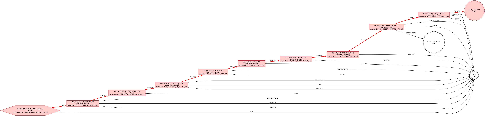

**What Actually Happens Inside a Protocol-Governed Execution**

*Following a single blockchain transaction through the execution
topology of Protocol-Governed Systems (PGS)*

*Part 12 of the Protocol-Governed Systems (PGS) Series*



In the previous post, we examined why the EU AI Act turns governance
into an architectural problem --- and why post-hoc monitoring cannot
provide structural evidence of governed execution.

That discussion was conceptual.

This one is operational.

Because eventually every architectural claim has to answer a simple
question:

"Show me what actually happens."

So let's do exactly that.

We will follow a single blockchain transaction through a live
Protocol-Governed Systems (PGS) execution trace and examine what
governance looks like *under the covers*.

Not policy documents.

Not architecture diagrams.

Actual execution topology.

**The Traditional Black Box**

In most systems, submitting a blockchain transaction appears deceptively
simple:

submit_transaction(payload)

Underneath that call, dozens of things may happen:

- identity resolution

- authority checks

- policy enforcement

- nonce handling

- cryptographic signing

- hashing

- persistence

- event generation

- error handling

But in conventional architectures, most of this behavior is:

- implicit

- framework-dependent

- dynamically orchestrated

- partially observable

- operationally inferred after execution

Governance exists mostly in:

- application logic

- middleware

- conventions

- environment configuration

- monitoring systems

- human assumptions

The execution topology itself is rarely visible.

And more importantly:

the admissible execution space is rarely bounded before execution
begins.

PGS approaches this differently.

**The Reveal**

The image below is not a debug trace.

It is not a sequence diagram manually drawn by an architect.

It is a real execution topology graph, generated directly by the PGS
compiler from protocol artifacts. Every node, every branch, every
failure exit was declared in protocol and compiled into a governed
snapshot before a single line of runtime code executed.

This is what governed execution actually looks like.


At first glance, it may look like a workflow graph.

It is not.

It is something more restrictive:

an admissible execution topology.

Every node, branch, failure surface, and exit condition was declared in
protocol, compiled into a snapshot, and admitted before runtime
traversal began.

The runtime does not invent behavior dynamically.

It traverses admissible topology.

That distinction is the core inversion behind PGS.

**The Full Execution Flow**

The trace above is a real PGS execution topology for
`blockchain::WF_SUBMIT_TRANSACTION_V0`. It was compiled from protocol
artifacts and rendered by the PGS toolchain --- not drawn by hand.

Here is the governed path this transaction traverses, step by step:

```
                        ┌──────────────────────────────┐
                        │  IN_TRANSACTION_SUBMITTED_V0 │  Intent Admission
                        └──────────────┬───────────────┘
                                  ACK  │
                                       ▼
                        ┌──────────────────────────────┐
                        │  CC_RESOLVE_ACTOR_ID_V0      │  Actor Resolution
                        └──────────────┬───────────────┘
                               SUCCESS │
                                       ▼
                        ┌──────────────────────────────┐
                        │  CC_VALIDATE_TX_STRUCTURE_V0 │  Structural Validation
                        └──────────────┬───────────────┘
                               SUCCESS │
                                       ▼
                        ┌──────────────────────────────┐
                        │  CC_VALIDATE_TX_POLICY_V0    │  Policy Governance
                        └──────────────┬───────────────┘
                               SUCCESS │
                                       ▼
                        ┌──────────────────────────────┐
                        │  CC_RESERVE_NONCE_V0         │  Nonce Reservation
                        └──────────────┬───────────────┘
                               SUCCESS │
                                       ▼
                        ┌──────────────────────────────┐
                        │  CC_BUILD_ETH_TX_V0          │  Transaction Assembly
                        └──────────────┬───────────────┘
                               SUCCESS │
                                       ▼
                        ┌──────────────────────────────┐
                        │  CC_SIGN_TRANSACTION_V0      │  Cryptographic Signing
                        └──────────────┬───────────────┘
                               SUCCESS │
                                       ▼
                        ┌──────────────────────────────┐
                        │  CC_HASH_TRANSACTION_V0      │  Transaction Hashing
                        └──────────────┬───────────────┘
                               SUCCESS │
                                       ▼
                        ┌──────────────────────────────┐
                        │  CC_PERSIST_MEMPOOL_TX_V0    │  Governed Persistence
                        └──────────────┬───────────────┘
                               SUCCESS │
                                       ▼
                        ┌──────────────────────────────┐
                        │  CC_APPEND_TX_EVENT_V0       │  Trace Event Append
                        └──────────────┬───────────────┘
                               SUCCESS │
                                       ▼
                              ╔════════════════╗
                              ║  EXIT_SUCCESS  ║
                              ╚════════════════╝

  At every node, failure outcomes (VIOLATION, NOT_FOUND,
  BACKEND_ERROR, ALREADY_EXISTS) route to governed failure
  exits — never to undefined behavior.
```

This sequence is not:

- dynamically discovered

- framework-generated

- middleware-composed

- agent-planned at runtime

It already existed before execution began.

The compiler projected this topology from protocol artifacts into a
bounded admissible execution surface.

The runtime simply traversed it.

That is the architectural shift.

**Step 1 --- Intent Admission**

IN_TRANSACTION_SUBMITTED_V0

The execution begins with an admitted intent.

This is not merely:

- an HTTP request

- an RPC method

- an API handler

It is a protocol-defined admission boundary.

The runtime first asks:

"Is this execution intent admissible under the compiled governance
snapshot?"

Traditional systems usually assume execution first and validate
afterward.

PGS reverses that.

Execution begins only after intent admission succeeds.

**Step 2 --- Actor Resolution**

CC_RESOLVE_ACTOR_ID_V0

The runtime resolves the actor identity associated with the transaction.

Importantly:

- authority is explicit

- identity is declared

- governance is structural

The system does not rely on:

- ambient session trust

- framework injection

- implicit permissions

- middleware conventions

Identity admission itself becomes governed topology.

**Step 3 --- Structural Validation**

CC_VALIDATE_TX_STRUCTURE_V0

The payload structure is validated against declared protocol semantics.

Malformed transactions terminate immediately into governed failure
exits.

This matters because in PGS:

invalid topology is not merely rejected ---\
it becomes inadmissible execution.

Notice the difference.

Traditional systems often allow malformed execution to travel deep into
runtime behavior before exceptions occur.

PGS bounds the execution surface early.

**Step 4 --- Policy Validation**

CC_VALIDATE_TX_POLICY_V0

This is where governance becomes visible.

The runtime is not asking:

"Can this code run?"

It is asking:

"Was this transaction declared admissible under policy topology before
runtime?"

That distinction is profound.

Traditional policy systems usually:

- monitor execution

- filter outputs

- intercept violations afterward

PGS instead governs:

- admissible execution itself.

The execution path literally does not continue unless governance admits
it.

**Step 5 --- Nonce Reservation**

CC_RESERVE_NONCE_V0

Now we cross into mutation territory.

Even here:

- state mutation

- ordering guarantees

- replay boundaries

- concurrency semantics

are governed through protocol-defined capability contracts.

Mutation is not ambient runtime behavior.

Mutation is admitted topology.

This becomes especially important in distributed systems where:

- race conditions

- replay attacks

- duplicate execution

- ordering ambiguity

all become governance concerns.

**Step 6 --- Transaction Assembly**

CC_BUILD_ETH_TX_V0

Before signing can occur, the transaction must be assembled into its
canonical form.

This step constructs the Ethereum transaction object from the validated
and nonce-reserved inputs.

In PGS, even assembly is governed --- the capability contract declares
exactly what inputs are consumed and what output structure is produced.
The runtime does not allow ad-hoc construction.

**Step 7 --- Transaction Signing**

CC_SIGN_TRANSACTION_V0

Cryptographic signing executes through governed capability contracts.

The runtime does not dynamically discover arbitrary signing behavior.

The execution surface is already bounded.

This matters because:

- cryptographic authority

- signing scope

- execution ordering

are all now inspectable before runtime execution begins.

**Step 8 --- Transaction Hashing**

CC_HASH_TRANSACTION_V0

The signed transaction is hashed inside governed topology.

Even pure computation becomes:

- bounded

- inspectable

- topology-constrained

rather than ambient application behavior.

The runtime remains intentionally simple:

- traverse topology

- invoke admitted capability

- record governed outcome.

**Step 9 --- Persistence**

CC_PERSIST_MEMPOOL_TX_V0

Only after:

- admission

- identity resolution

- structure validation

- policy validation

- nonce reservation

- transaction assembly

- signing

- hashing

does persistence become admissible.

That ordering was not decided dynamically.

It was compiled.

This is one of the deepest architectural shifts in PGS:

governance defines execution ordering before runtime traversal begins.

**Step 10 --- Trace Event Append**

CC_APPEND_TX_EVENT_V0

Finally, the execution emits a governed trace event.

But this is not merely logging.

A PGS trace records:

- admitted intent

- authority chain

- topology traversal

- governed outcomes

- failure surfaces

- snapshot provenance

A PGS trace is not operational telemetry.

It is:

an admissibility attestation.

The trace proves:

- governance preceded execution

- execution remained inside bounded topology

- undeclared paths were never traversed.

**The Hidden Insight**

The most important part of the image is not the success path.

It is the explicit failure topology.

Notice how:

- VIOLATION

- NOT_FOUND

- BACKEND_ERROR

- ALREADY_EXISTS

all terminate into governed exits.

Traditional systems usually focus governance on:

- successful execution

while:

- exception handling

- escalation

- retries

- failure propagation

remain partially implicit.

PGS governs failure semantics too.

An undeclared failure surface is itself a governance violation.

**Why This Is Not "Just a Workflow Engine"**

At this point, a reasonable question emerges:

"Isn't this just orchestration?"

No.

A workflow engine orchestrates execution.

PGS governs admissibility.

That sounds subtle, but the architectural difference is enormous.

Workflow systems typically:

- coordinate execution

- route tasks

- manage retries

- sequence operations

But the execution surface itself often remains open-ended.

PGS instead defines:

- what execution paths may exist

- what authority boundaries apply

- what mutation surfaces are legal

- what side effects are admissible

- what failure exits are allowed

- what topology may be traversed

before runtime execution begins.

The runtime becomes:

- topology traversal

not:

- behavioral improvisation.

**Why This Matters for AI Systems**

This distinction becomes dramatically more important for AI systems and
autonomous agents.

As AI systems become:

- more autonomous

- more compositional

- more tool-capable

- more distributed

the execution surface expands rapidly.

Traditional architectures attempt to govern this expansion through:

- prompts

- middleware

- monitoring

- output filtering

- policy overlays

But those approaches govern behavior after capability already exists.

PGS instead governs:

- admissible execution topology itself.

The execution path literally does not exist unless:

- declared

- compiled

- admitted

- bounded

before runtime execution begins.

That changes governance from:

- operational supervision

into:

- structural admissibility.

**The Deeper Architectural Shift**

The transaction trace reveals something larger than blockchain
execution.

It reveals a different philosophy of software architecture.

Traditional systems generally assume:

execution is open

governance constrains behavior afterward

PGS inverts that:

governance constructs admissible execution first

runtime traversal happens inside it afterward

This is why PGS increasingly behaves less like:

- a framework\
  or

- an orchestration engine

and more like:

- a constitutional execution substrate.

The blockchain trace is not merely a blockchain example.

It is the smallest visible expression of a much larger architectural
direction.

**The PGS Series**

1.  The architectural foundation *(published)*

2.  Defining PGS and OmniBachi *(published)*

3.  Agentic AI needs a constitution *(published)*

4.  Governing agentic AI for production *(published)*

5.  The quiet privilege escalation *(published)*

6.  From blog post to bounded runtime *(published)*

7.  From serverless guardrails to structural governance *(published)*

8.  The Three Dividends of Protocol-Governed Systems *(published)*

9.  Why Smart Coding Is a Double-Edged Sword *(published)*

10. AI Accelerated Implementation. Not Governance. *(published)*

11. The EU AI Act Is Here. Your Governance Architecture Isn\'t Ready.
    *(published)*

12. **What Actually Happens Inside a Protocol-Governed Execution**
    *(this post)*

*These ideas are explored in depth in the upcoming book:*\
***Protocol-Governed Systems: Architecture for the AI Era***

*The book includes a working reference implementation called
**OmniBachi**, demonstrating how protocol governance can be enforced
mechanically.*

*\-- Bhash Ganti (aka Bachi)*\
*OmniBachi Initiative*
