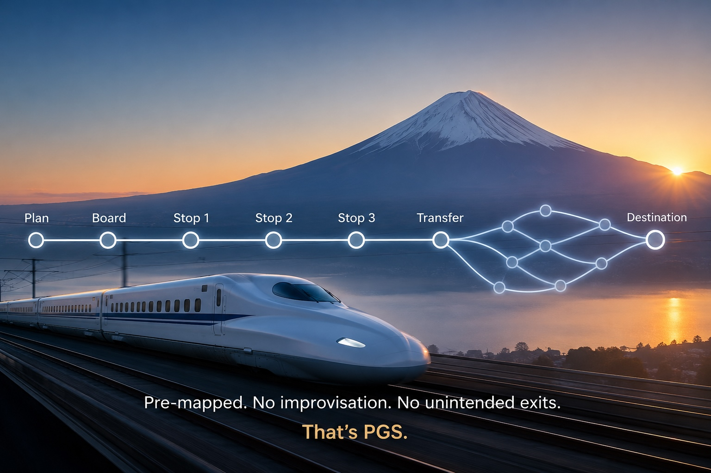

# How vacation planning sparked the ideas behind PGS architecture.

### *A milestone birthday atop Mt. Fuji, eight days of criss-crossing Japan by train, and the shower-thought that sparked the idea for Protocol-Governed Systems.*

I want to tell you about a vacation that changed the way I think about software.

Not a vacation spent debugging. Not a working trip. A real one — a milestone birthday, a mountain, eight days of trains — and somewhere on the far side of it, an idea I had been chasing for months finally walked up and introduced itself.

---

## The Trip

My son treated me to a milestone birthday with a plan I could not have dreamed up myself: stand on top of Mt. Fuji on the 4th of July and unfurl a US flag at the summit.

The seed had been planted earlier, in an unlikely place. We were touring a friend's backyard vineyard in Silicon Valley — a hobbyist operation that had somehow produced *five hundred bottles* of wine that season — and something about that ambition was contagious. If a friend could turn a backyard into a vineyard, surely we could turn a birthday into an adventure.

So I did what I do. I am, for better or worse, the family's seasoned vacation planner. I carved out an eight-day trip through Tokyo and Kyoto, ending with the main event: a 21-hour Mt. Fuji hike, with an overnight stop at a base station three-quarters of the way up, so we would be in position to catch the 5:00 AM sunrise from the summit.

And because we are who we are, we made it a foodie trip too — including a visit to a Kyoto sake factory laced with a seven-course sake tasting.

It was, in a word, *busy*. And it ran flawlessly.

---

## The Part Nobody Admires

Here is the thing nobody admires when they hear about a trip like this. They picture Mt. Fuji at sunrise. They do not picture the spreadsheet.

But the spreadsheet is where the trip was actually won.

The whole week was stitched together by trains. Which line. Which platform. Which direction. Where to get off. What time to be standing there. There was a pre-reserved bullet train, early one morning, for a day trip from Tokyo to Kyoto — booked in advance because the margin for error was zero.

We had a language barrier and the addresses were complex and unfamiliar. So we made a deliberate rule: **no cab rides into places we could not read.** A cab is improvisation. A cab is "trust the driver, trust the traffic, trust that the destination you mumbled is the one you meant." In a city whose signs we could not decipher, improvisation was the enemy.

The trains were the opposite of improvisation. A train goes exactly where the track goes. It stops exactly where it is scheduled to stop. You do not negotiate with a train. You do not ask it to take a shortcut. You board at a known point, you step off at a known point, and in between, the path is not up for debate.

For an entire week, every activity hung off a pre-determined map: *this train, this stop, this connection, this window of time.* No detours. No surprises. No "let's just wing this leg."

It was exhausting. And it was perfect.

---

## Back Home, At the Laptop

Fast forward. I am home, jet-lagged, back in front of my laptop, wrestling with a problem that had been nagging me for months.

I wanted to architect software that could *never* execute an unintended operation. Not "rarely." Not "we'd probably catch it in review." Never. Under any circumstance.

If you have built anything beyond a toy system, you know how absurd that sounds. Real software is a city full of cab rides. Some component calls some other component, which improvises a path through a dozen layers, any of which might do something nobody quite intended. You spend your life adding guardrails, monitoring, reviews — all of it reacting to a system that is, fundamentally, free to wander.

I was trying to bolt certainty onto something built for improvisation. And it was not working.

---

## The Shower

Then one morning — and it really was the shower; the clichés are clichés for a reason — the light bulb went on.

*Why am I not building software the way I built the Fuji trip?*

On the trip, I did not trust the system to behave. I removed its freedom to misbehave. Every leg was a train on a track with a known boarding point and a known exit. The plan did not *defend against* wrong turns — it made wrong turns structurally impossible, because there was no track that led anywhere I had not already chosen.

That was the answer I had been circling for months. The technical name for it is **deterministic DAG execution** — a directed graph where every step is a known stop, every transition is a laid track, and every exit point is mapped before anything starts moving.

That is the punch line of the whole PGS story. It is the Fuji itinerary, turned into an architecture.

---

## The Parallel I Could Not Unsee

Once I saw it, I could not unsee how cleanly the trip mapped onto the system I eventually called Protocol-Governed Systems (PGS).

**The route is decided before you travel.** The entire execution topology — the graph of what may run, in what order, with what exits — is declared and compiled *before* a single step executes. Like booking the bullet train the night before, not flagging a cab in the moment.

**A train on a track cannot take a detour.** The runtime does not improvise. It follows the declared graph from one known stop to the next. If a path was not laid down ahead of time, there is no track for it — and the system fails hard rather than wandering off.

**Every stop has a defined exit.** Each step finishes with a named outcome that routes you onward — the way each station hands you to your next connection. No guessing. No "let's see where this goes."

**The experiences are the destinations.** All the actual *doing* — the sake tasting, the Kyoto temples, the summit at sunrise — those are why you travel at all. In PGS, the real work lives in the capability steps: the parts that compute, and the parts that change the world. The graph simply guarantees you arrive at each one, in order, having taken no path you did not choose.

The mountain was not the architecture. The *itinerary* was. Mt. Fuji was just the payoff at the end of a perfectly governed route.

---

## If You Want to Watch the Train Run

I have kept this deliberately light on the machinery. If you would like to watch a real "train" run its track — a single transaction walking the execution topology, stop by stop, taking only the exits it was allowed to take — I traced exactly that in an earlier post:

**[What Actually Happens Inside a Protocol-Governed Execution (Blog 12)](/blog/inside-a-protocol-governed-execution/)**

That one opens the box and follows a live execution end to end. Think of this post as *why I planned the trip this way*, and that one as *the train pulling out of the station*.

---

## The Reference Implementation

The architecture is not a slide deck. There is a working reference implementation — reproducible locally, fully open:

**[github.com/bachipeachy/pgs_workspace](https://github.com/bachipeachy/pgs_workspace)**
*(Apache-2.0)*

It includes a compiled protocol snapshot, a generic runtime that executes governed DAGs, blockchain and AI governance domain examples, and execution traces with structured admissibility evidence. The demo workflow runs in under ten minutes.

I am not asking you to be convinced. I am asking you to run the demo, examine a trace, and see for yourself what it looks like when a system can only travel the tracks it was given.

---

## The Part I Keep Thinking About

I planned a vacation to celebrate a birthday. I did not expect it to hand me the mental model I had been missing at work.

But that is how the good ideas tend to arrive — not from staring harder at the problem, but sideways, from somewhere you were not looking. A friend's backyard vineyard. A pre-reserved bullet train. A rule against cabs in places we could not read.

The unfamiliarity of a foreign city is real, and I could not make myself fluent overnight. But I could choose my relationship to it — improvise and hope, or lay the route and follow the track.

The complexity of modern software is real, and we probably cannot eliminate it. But we can choose where governance lives relative to it — downstream and reactive, scrambling after a system free to wander, or upstream and structural, where wandering is simply not a track on the map.

Both of those are the same decision, made twice. And we made the summit at sunrise, by the way. Flag and all. Exactly on schedule.

---

*Blog 18 in the Protocol-Governed Systems series.*
*PGS v0.5.1 — June 2026*
*Apache-2.0 — [github.com/bachipeachy/pgs_workspace](https://github.com/bachipeachy/pgs_workspace)*
