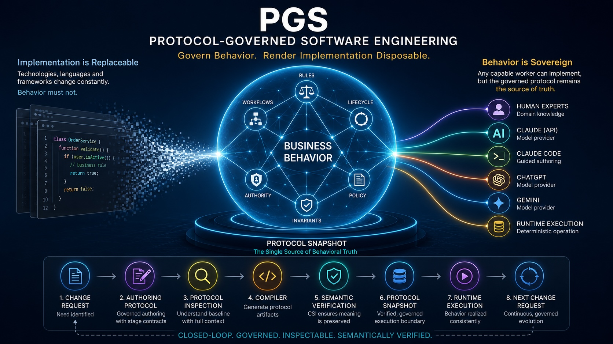

# Beyond AI Coding: Why Software Implementation is Becoming Disposable
## Why the future of AI software engineering is about governing behavior, not generating code.

*"The future of software engineering isn't about replacing programmers. It's about separating business behavior from software implementation."*

---

## Every week brings another AI coding breakthrough

Claude writes production code.

Cursor refactors entire repositories.

GitHub Copilot completes functions before we finish typing.

OpenAI, Anthropic and Google continue pushing software generation toward astonishing levels.

The question dominating our industry has become:

> **"How soon will AI write all software?"**

I believe that's the wrong question.

The more interesting question is:

> **"If implementation can be regenerated indefinitely, what actually deserves governance?"**

That question has quietly shaped the architecture of PGS for the past several months.

---

## We have confused software with implementation

Traditional software engineering bundles two fundamentally different concerns together.

* Business behavior
* Software implementation

The implementation contains:

* algorithms
* data structures
* APIs
* frameworks
* libraries
* deployment choices

But it also embeds:

* business rules
* authority
* lifecycle
* workflow
* invariants
* organizational policy

These evolve at completely different rates.

Yet we version them together.

Deploy them together.

Review them together.

Rewrite them together.

That coupling is the root of much accidental complexity.

---

## AI changes the economics

Large language models have dramatically reduced the cost of generating implementation.

Implementation is becoming abundant.

Business knowledge is not.

If an implementation can be regenerated tomorrow by a better model...

...why is it the primary artifact we govern today?

---

## PGS starts from a different premise

PGS treats implementation as an execution strategy.

Behavior is the primary artifact.

Behavior is expressed as governed protocols.

Instead of asking:

> "How should we implement this feature?"

PGS asks:

> "What business behavior should always remain true?"

Those answers become protocols rather than source code.

---

## Software evolution is never greenfield

One observation became increasingly obvious while building the PGS Change Management pipeline.

Real software almost never starts from scratch.

Every change begins with an existing system.

There is already:

* architecture
* governance
* terminology
* workflows
* authority
* constraints
* runtime behavior

Traditional AI coding often starts with a prompt.

PGS starts with a protocol snapshot.

Every proposed change begins by understanding what already exists.

---

## The Authoring Protocol

One of the newest ideas inside PGS is something I call the **Authoring Protocol**.

Rather than giving an AI worker an unconstrained prompt, PGS governs the authoring process itself.

Every stage has:

* bounded inputs
* declared outputs
* governed contracts
* validation rules
* admissibility gates

Workers don't "write whatever they want."

They participate inside a protocol.

That protocol—not the model—defines correctness.

---

## Protocol Inspection

Another recent addition is **Protocol Inspection (PI).**

Before authoring a change, workers inspect the existing protocol snapshot.

Instead of relying on memory, they query governed protocol artifacts.

The system answers questions like:

* What capabilities already exist?
* Which authority owns this behavior?
* Which lifecycle is affected?
* Which business invariant already governs this concept?

Authoring becomes grounded in reality rather than recollection.

---

## Semantic verification

Traditional compilers answer one question:

> "Can this compile?"

PGS now asks a second one:

> "Did compilation preserve the authored meaning?"

Compilation Semantic Inspection (CSI) independently reconstructs the authored protocol from compiler output and compares semantic equivalence across multiple dimensions.

Compiler correctness is no longer assumed.

It is verified.

---

## Worker independence

An unexpected result emerged while experimenting with multiple LLMs.

Different models failed in different ways.

Some authored well but could not ground.

Others grounded correctly but violated authoring contracts.

The important discovery wasn't which model was "best."

It was that the architecture objectively localized each failure.

The protocol remained unchanged.

Only the worker changed.

That led to an important realization.

Workers should be interchangeable.

Claude API.

Claude Code.

ChatGPT.

Gemini.

Future open-source models.

Or even a human expert.

All become transports that participate in the same governed protocol.

---

## Closed-loop software engineering

The resulting lifecycle looks very different from traditional SDLC.

Instead of:

Requirements

↓

Design

↓

Implementation

↓

Testing

↓

Maintenance

PGS evolves software as a continuous protocol loop:

Protocol Snapshot

↓

Change Request

↓

Authoring Protocol

↓

Protocol Inspection

↓

Compiler

↓

Semantic Verification

↓

Runtime

↓

Next Change Request

Every change starts from the previous snapshot.

Every change is governed.

Every change is inspectable.

Every change is semantically verified.

---

## A different future

For decades we've treated source code as the product.

AI is challenging that assumption.

Perhaps source code is only one possible realization of governed business behavior.

If implementation becomes inexpensive to regenerate, the scarce asset is no longer code.

The scarce asset is organizational knowledge.

Business intent.

Governance.

Authority.

Behavior.

Those deserve to become first-class engineering artifacts.

Implementation becomes replaceable.

Behavior becomes sovereign.

---

## Looking ahead

The recent additions to PGS—Authoring Protocols, Protocol Inspection, Semantic Verification, and Worker Observability—have convinced me that protocol-governed software engineering deserves to be considered a distinct architectural paradigm rather than simply another AI-assisted development workflow.

The interesting question is no longer whether AI can write software.

The more enduring question may be this:

**Can we build systems where business behavior survives every future implementation technology?**

I believe that is where software engineering is headed.
And that is the journey PGS is exploring.

Check it out for youself.

[github.com/bachipeachy/pgs_workspace](https://github.com/bachipeachy/pgs_workspace)
