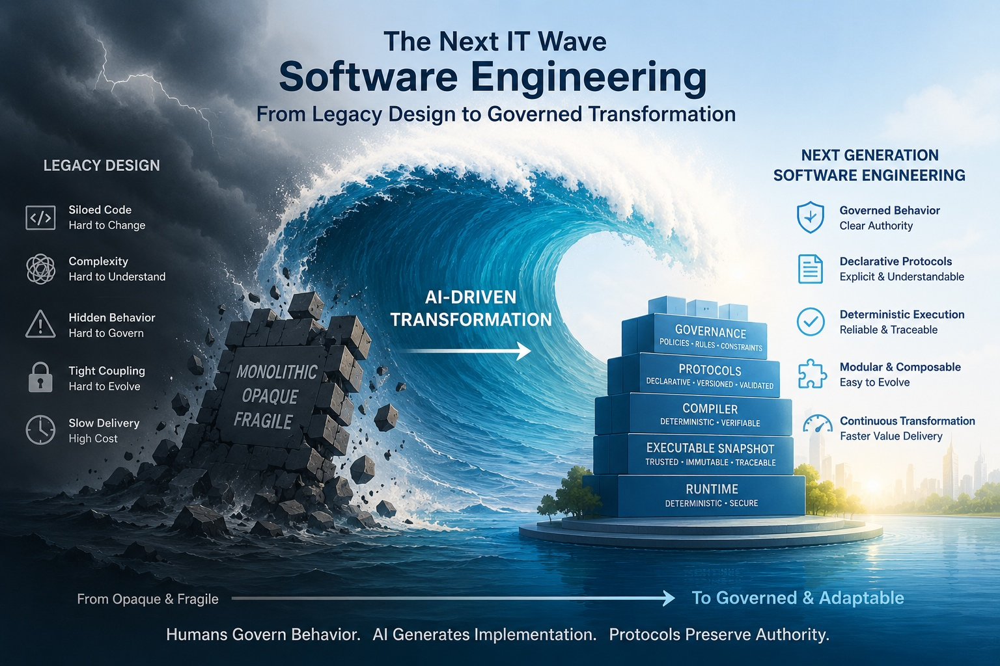

# Software Engineering --- The Next IT Wave in the Making

The new millennium entered adolescence after the Dotcom Bust, followed by waves of Cloud Computing, Mobile/Social Networking, and now, the AI boom. Each wave follows a ten-year cycle, and the next one is already written on the wall in invisible ink, if you only connect the dots.

The next great IT wave will not be CapEx-rich Quantum Computing. It will be OpEx-rich **Software Engineering**.

## 1. The Perfect Storm

Every major IT wave is born from a perfect storm of three converging forces: a pressing problem, financial resources, and human resources. Today, all three are converging on software engineering.

### The Pressing Problem: Software Governance

The most successful application of AI is code generation. Systems like OpenAI's ChatGPT and Anthropic's Claude are generating code at a staggering rate. This creates an urgent operational crisis: **Software Governance**. As AI generates software faster than humans can review it, how do we retain authority over what the code is allowed to do? The challenge is no longer just writing code, but governing its behavior.

### The Financial Engine: AI Must Generate Value

The AI boom is fueled by enormous capital investment in data centers, chips, and energy. To avoid an "AI Bust," this investment must generate massive revenue. The killer app for AI isn't just creating new software; it's **transforming existing software**. By enabling the virtual rewriting of the world's legacy business software, AI can unlock a multi-trillion-dollar market, turning its token-burning engine into a fire hydrant of revenue.

### The Human Opportunity: From Implementation to Governance

The rise of AI doesn't mean the end of developers. It signals a shift in their role. As AI handles implementation, human resources can be redeployed to a higher level of abstraction: defining and governing software behavior, business logic, and rules. This creates an opportunity to build new software for finance, healthcare, and government services at a scale never before possible, with humans guiding the "what" and AI handling the "how."

## 2. The Next Wave: A New Computing Model

The current crisis stems from our decades-old computing model. We have built our systems on the **Imperative Turing Machine**, where behavior is a side effect of a sequence of low-level instructions. To govern AI-generated code, we need a new model.

The next wave is the **Declarative Protocol-Governed Machine**.

Here’s a brief comparison:

| | **Imperative Turing Machine (Old Wave)** | **Declarative Protocol-Governed Machine (Next Wave)** |
| :--- | :--- | :--- |
| **Core Idea** | Tell the machine *how* to do something. | Declare *what* behavior is authorized to exist. |
| **Process** | Program → Instructions → Execution → Behavior | Intent → Governed Behavior → Protocol → Compiler → Execution |
| **Authority** | Lives in the source code, mixed with implementation. | Lives in a separate, governed protocol that is compiled. |
| **Result** | Behavior is an emergent property of the implementation. | Behavior is deterministic and guaranteed by the protocol. |

In this new model, the implementation (code) is generated by AI but is constrained by a human-governed protocol. The protocol, not the code, is the source of truth. An AI can regenerate the implementation, but the governed behavior remains unchanged.

## The Future is Governed Software

The next wave of software engineering is about inverting our model. We are moving from an era where the primary artifact was **Source Code** to one where it is **Governed Behavior**.

AI is the catalyst, not the destination. It makes implementation abundant, forcing us to finally answer the question: Where does authority over software behavior live?

If the answer remains "somewhere in the code," we are headed for a crisis of ungovernable systems. If the answer is "in an explicit, governed protocol," we unlock a future of human-governed, AI-implemented software.

The age of software engineering is not ending. It is finally beginning.

## Documentation and Reference Implementation

Curious what is Protocol-Governed computing is? Read all about it at:

- [PGS documentation](https://omnibachi.org)

Now you want see what it looks like? Go to:

- [PGS Reference Implementation](https://github.com/bachipeachy/pgs_workspace)

