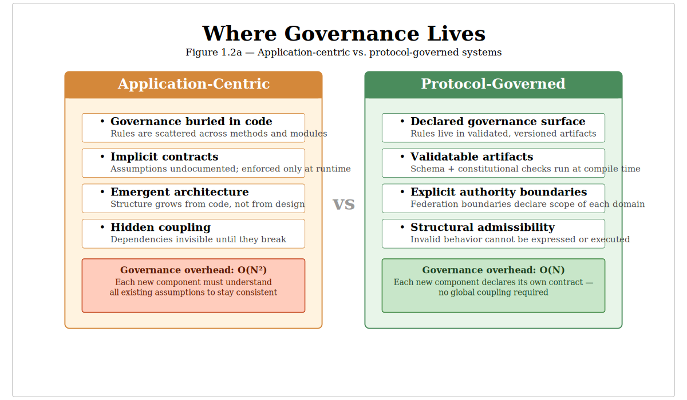
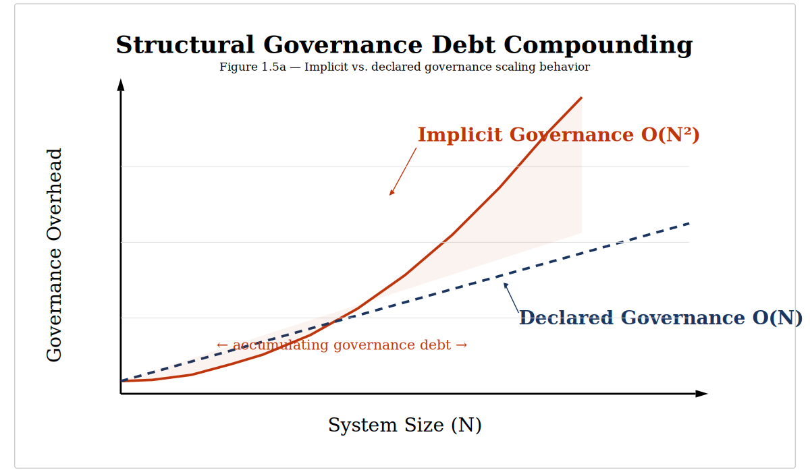

# Chapter 1 — Why Software Breaks at Scale

This chapter is a diagnosis. Before proposing a solution, the book must make the problem visible — not as a collection of anecdotes, but as a structural pathology with identifiable root causes. The chapter argues that the dominant model of software construction — the application-centric model — embeds governance in code rather than declaring it as structure, and that this architectural choice produces a distinct form of debt that no amount of better tooling, process improvement, or code refactoring can eliminate. It introduces Structural Governance Debt as a formal concept, shows why it compounds polynomially with scale, and explains why AI-speed code generation removes the last natural throttle on its accumulation. The reader who finishes this chapter will recognize the pathology in their own systems — and understand why the remedy must be architectural, not procedural.

* * *

Modern software does not fail because engineers are careless. **It fails because governance is embedded in code instead of declared as structure.**

In 2012, [Knight Capital Group](https://en.wikipedia.org/wiki/Knight_Capital_Group#2012_stock_trading_disruption
) deployed a routine software update to eight production servers. One server retained a legacy code path that had been repurposed for the new release — a flag that previously controlled a dormant feature now activated unintended trading logic. In forty-five minutes, the system executed \$7 billion in erroneous trades. The firm lost \$440 million. Within days, it required emergency recapitalization.

The root cause was not a coding error. The developers wrote correct code. The root cause was structural: the relationship between the deployment flag, the legacy code path, and the new trading logic existed in no artifact. The implicit contract — "this flag must be deactivated on all servers before deployment" — was tribal knowledge. It was real, load-bearing, and invisible to every automated system. No test caught it because the constraint was never declared in a form that tests could validate. No review caught it because the dependency was not documented. The governance was embedded in operational memory, not in structure.

This is structural governance debt — not a mistake, but the predictable consequence of an architectural model that permits load-bearing constraints to exist without declaration.

This chapter is a diagnosis. It argues that the dominant model of software construction — the application-centric model — is structurally incapable of sustaining governance at scale.

The purpose is not to criticize engineers or practices. It is to make the structural root cause of our industry's maintenance burden visible—clearly enough that you can recognize it in your own systems before we move to the alternative.

* * *

## 1.1 — The Billion-Dollar Maintenance Problem

The software industry spends most of its money not building systems, but sustaining them.

Multiple longitudinal studies over the last two decades consistently show that **60-80% of software expenditure goes to maintenance**—not to new features, not to innovation, but to keeping existing systems running, understood, and compliant with expectations that were never structurally declared.

This ratio is treated as normal. It is not.

A maintenance-dominated cost structure is a signal that something about how we build software produces systems whose cost of sustenance grows faster than their cost of creation. The question is not "how do we maintain better?" but **"why does maintenance dominate?"**

The answer is not people, process, or tools. It is structural.

The cost of this structural deficit extends beyond budgets. It is paid in:
- **Suppressed Evolution:** Teams stop innovating because the cost and risk of change are too high.
- **Talent Burnout:** Engineers burn out on coordination overhead, not on hard technical problems.
- **Institutional Risk:** The inability to verify what a system *actually does* versus what it was *intended to do* creates a compliance and security blind spot.

The maintenance ratio is the visible symptom. The underlying pathology is architectural. This chapter identifies it.

> **A Note on "Governance"**
>
> Throughout this book, **governance** means *structural admissibility of behavior*—what a system is permitted to do and how that permission is declared, validated, and enforced.

* * *

## 1.2 — The Application-Centric Model

The dominant model of software construction treats the **application** as the fundamental unit of design. This model is so pervasive that most engineers do not see it as a choice—it is simply how software is built.

That invisibility is the problem. The application-centric model has three structural properties that make it unstable at scale:

1.  **Behavior is Embedded.** What the system does is inseparable from how it does it. Business rules, validation logic, and authorization are all woven into the implementation. To understand the intent, you must read the code.

2.  **Governance is Implicit.** The rules that constrain the system—its invariants and contracts—exist in code comments, team wikis, and the memories of senior engineers. They are real and load-bearing, but they are invisible to any structural validation.

3.  **Structure is Emergent.** The system's true architecture—its dependency graph, its failure modes—is not declared. It is discovered after the fact by reading code and tracing execution paths. System diagrams are approximations, structurally disconnected from the running system.

This model was not a mistake. It was efficient for a world where systems were small and change velocity was human-speed. The analogy is building codes: you can build a house without them, but you cannot build a city.

The software industry is now building cities with the methods designed for houses.

{ width=5in }

Left: Application-centric systems bury governance in code.  
Right: Protocol-governed systems expose a declared governance surface.

## 1.3 — What Breaks and Why

The failures of the application-centric model emerge at scale, as human compensations are exhausted. Three categories of structural failure are inevitable.

### 1. Version Drift and Hidden Coupling
Systems break not because of errors, but because an implicit contract between components was never declared and therefore could not be validated when one component changed.
- **Version Drift:** The deployed code silently diverges from its original specification.
- **Hidden Coupling:** Components share undeclared assumptions (e.g., API response formats, call ordering).

In mature SaaS systems — especially those that evolved from monoliths into microservices — version drift becomes visible in subtle ways: staging and production behave differently, deprecated endpoints continue to receive traffic, and runtime traffic patterns no longer match architectural diagrams. The dependency graph derived from logs often diverges from the diagram maintained by the architecture team.

### 2. Runtime Mutation and the Illusion of Control
The system's behavior depends on state that is not part of its governed surface.
- **Configuration Drift:** "It works on my machine" is a structural problem. The code is identical across environments, but the runtime state (environment variables, feature flags, cache state) is not.
- **Ungoverned Governance:** Feature flags are a form of governance, but the relationship between the flag and the behavior it controls exists nowhere as a structural artifact.

Agentic systems that modify their own configuration at runtime multiply this mutation surface beyond human audit capacity.

### 3. The Semantic Gap
What architects intend, what documents describe, and what code *actually does* are three different things. No structural mechanism connects them.
- **Code review** is a human patch for this structural absence. It is expensive, probabilistic, and does not scale.
- **Documentation drifts** from implementation not because engineers are lazy, but because there is no structural coupling between the document and the behavior.

This divergence between intended and enacted behavior will later be formalized as **Constitution Drift** (Chapter 3). It is a structural absence that no amount of process can fill.

### Structural Autopsy of a Failed Release
This class of incident is common in distributed systems: a “safe” change adjusts a timeout, retry, or caching policy; another component retries by default; a downstream workflow silently assumes exactly-once or idempotent behavior. None of those assumptions are declared as artifacts. No test fails because no test encodes the missing contract. The incident is not a bug in any single module — it is a structural failure caused by undeclared coupling.

### Structural Summary
The three failure categories trace directly to the three properties of the application-centric model:

- Embedded behavior → no declared contract → version drift and hidden coupling
- Implicit governance → no validation surface → runtime mutation without audit
- Emergent structure → no invariant binding intent to execution → semantic gap

The failures are not independent. They reinforce each other. Drift widens the semantic gap. Mutation accelerates drift. The absence of declared structure makes all three invisible until they manifest as incidents.

* * *

## 1.4 — Why Existing Remedies Don't Work

The industry has developed powerful tools to address these symptoms. Each is a genuine advance. Each leaves the core governance deficit untouched.

| Remedy | What It Governs | What It **Cannot** Govern |
| :--- | :--- | :--- |
| **CI/CD** | The build and deploy pipeline | Behavioral semantics; inter-component contracts |
| **Microservices** | Service boundaries; interface schemas | Behavior *behind* interfaces; cross-service invariants |
| **IaC (Terraform)** | Machine topology; resource provisioning | Application logic; business rules |
| **Feature Flags** | Activation state | Semantic consequences of activation |

Each remedy governs a layer. None declares the system’s behavioral semantics as a first-class, validatable artifact.

**Microservices:** The governance gap does not shrink when you move from monolith to microservices. It moves—from within the monolith to between services. And between services, it is harder to see, harder to test, and harder to reason about.

You can ship faster. You cannot ship more correctly. Speed without structural governance is faster accumulation of governance debt.

The pattern is consistent: each remedy governs one layer but stops short of the **semantic layer**—what the system means, what it promises, and what it is allowed to do.

> **A Note on High-Assurance Systems**
>
> Aviation and telecom systems survive at scale because they impose structural governance *externally*—through formal specifications, certification regimes, and immense human discipline. They prove that structural governance works, but at a cost that is economically infeasible for most software. The question is whether governance can be an *architectural property* of the system itself, rather than an external institutional burden.

* * *

## 1.5 — Structural Governance Debt

The accumulated cost of embedding governance in code is not "technical debt." It is a distinct pathology.

**Technical debt** lives in code and can be repaid by refactoring. Technical debt is about the quality of the answer.

**Structural governance debt** lives in the absence of a declared governance surface. Because the governance constraints themselves are undeclared, refactoring code cannot eliminate it.

You can rewrite every function in the system to be clean, well-tested, and idiomatically perfect — and the structural governance debt remains unchanged, because the governance constraints that should bind the system's behavior to its declared intent still do not exist as validatable artifacts. The code is better. The governance surface is identical. The debt persists.

> ### Formal Definition
>
> **Structural Governance Debt** is the accumulated cost of embedding governance decisions in code rather than in explicit, validatable protocol structures.

It has three defining properties:
1.  **It is invisible to code-level metrics** like test coverage or complexity.
2.  **It compounds polynomially** as implicit relationships between components explode ($O(N^2)$).
3.  **It cannot be repaid by code-level remediation.**

The compounding is concrete. In a small system — five components, one team — the debt is manageable. The team holds the full model in their heads. Implicit contracts are maintained through direct communication. In a medium system — fifty components, five teams — "tribal knowledge" becomes a recognized phenomenon: certain engineers are indispensable not for coding skill but because they hold implicit governance knowledge that exists nowhere else. Mystery failures appear — incidents where the root cause is a violated implicit contract that no one documented. Teams begin to fear change. In a large system — hundreds of components, dozens of teams — governance debt dominates. Architecture review boards, change advisory boards, and cross-team synchronization meetings are all human governance mechanisms created to compensate for the absence of architectural governance.

{ width=5in }

> A graph showing two curves:
> - **Application-Centric (Implicit Governance):** Polynomial growth ($O(N^2)$).
> - **Protocol-Governed (Explicit Governance):** Linear growth ($O(N)$).
>
> The ever-widening gap between the curves *is* the structural governance debt.

This compounding cost is why maintenance dominates budgets and why a **fear of change** becomes the dominant engineering constraint in mature systems. Fear of change is not timidity. It is a rational response to a system whose behavioral dependencies are implicit — every change is a gamble.

> **The Litmus Test**
>
> Your system carries structural governance debt if:
>
> - Deploying to production requires tribal knowledge not captured in any artifact
> - A change to one component breaks a seemingly unrelated component
> - You cannot answer: "What version of behavior was authoritative last March?"
> - Onboarding a new engineer requires oral tradition, not artifact reading
>
> If any of these are true, the debt exists — regardless of code quality, test coverage, or CI pipeline sophistication.

* * *

## 1.6 — The Generation-Governance Impedance Mismatch

This structural deficit predates AI. What is new is the speed.

- **Code Generation Velocity** is accelerating exponentially.
- **Governance Establishment Velocity** is bounded by human deliberation.

The widening gap between these two velocities is the **Generation-Governance Impedance Mismatch**.

{ width=5in }

If governance cannot be repaired inside the application-centric model, it must be relocated outside it.

The acceleration maps directly onto the failure categories from Section 1.3:

- Faster code generation means faster **version drift**. Implicit contracts between components diverge at machine speed. Code review and architectural oversight cannot keep pace.
- Agentic runtime modification means higher **mutation velocity**. Systems that modify their own configuration increase the mutation surface beyond human audit capacity.
- Generated code with no governance surface means a wider **semantic gap**. The gap between intent and implementation is bridged by a statistical model, not a structural artifact.

In an application-centric model, AI-generated code—produced at machine speed with no structural governance—compounds debt at an unprecedented rate. AI is not the problem; it is a force multiplier for the existing structural pathology. **AI removes the last natural throttle—human coding speed—that was slowing the accumulation of structural governance debt.**

This book is not anti-AI. It argues that protocol governance is the **architectural precondition for safe AI-speed development.**

* * *

## 1.7 — The Question This Book Answers

The diagnosis is complete. The application-centric model creates structural governance debt that compounds with scale and accelerates under AI.

The question is not whether engineers are good enough. The question is whether the model is.

> Is there a model of software construction where governance is structural—not embedded in code, not enforced by process, but a first-class architectural property of the system itself?

The answer is yes. The rest of this book defines it, implements it, and proves it.

Application-centric systems externalize governance; protocol-governed systems internalize it structurally.

The application-centric model made software possible. **It did not make software governable.**
