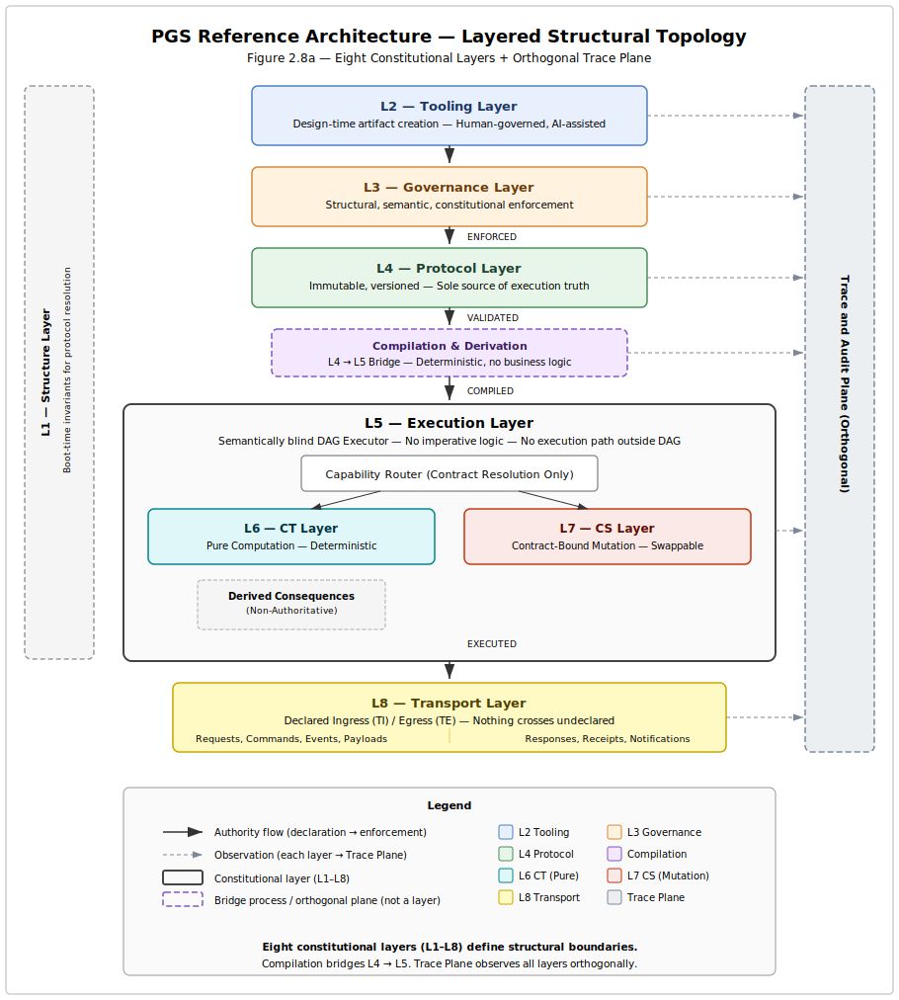
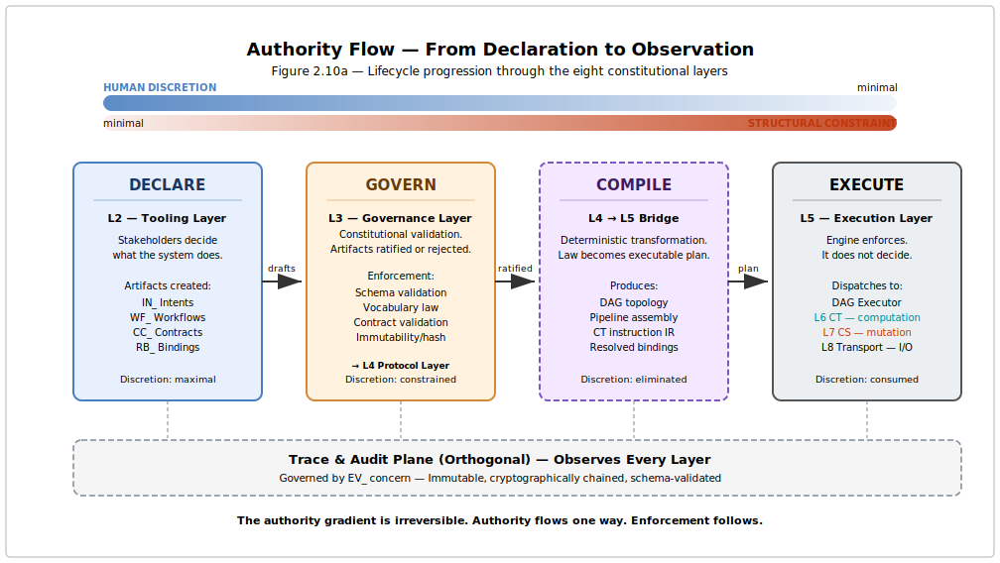
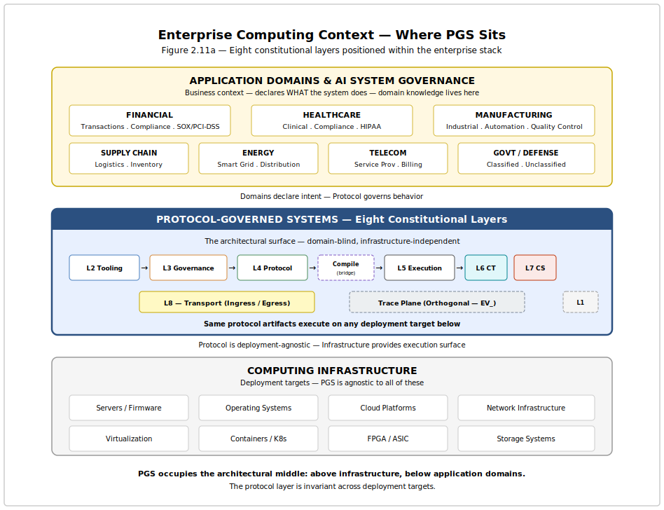

# Chapter 2 — From Applications to Protocols
*Paradigm and Reference Architecture*

Chapter 1 diagnosed the pathology: Structural Governance Debt — the accumulated cost of embedding governance in code rather than declaring it as structure. The diagnosis is complete. This chapter defines the cure.

It is the foundational chapter of the book. It answers two questions in sequence. **Part I — The Paradigm** (Sections 2.1–2.6) asks: *What is a Protocol-Governed System?* It defines the five canonical properties, the WHAT/HOW separation, the Layer-Concern structural grammar (eight layers, ten concerns), and the emergent properties that follow from structural governance. **Part II — The Reference Architecture** (Sections 2.8–2.11) asks: *What does this look like as a system?* It maps the paradigm onto a concrete layered topology with strict authority flow — from declaration through governance through compilation to enforcement. By the end, the reader will hold the complete architectural vocabulary and system model that every subsequent chapter builds upon: layers, concerns, artifact types, authority flow, and the deployment context within which protocol-governed systems operate.

* * *

The structural alternative to embedded governance is not better tooling. It is a different architectural model—one in which governance is the system's own structure, not an external discipline imposed upon it.

Chapter 1 identified the pathology: **Structural Governance Debt**.
This chapter defines the cure: **Protocol-Governed Systems (PGS)**.

**Part I — The Paradigm**

We will proceed in seven steps:
1.  **The Core Insight:** Separating *What* from *How*.
2.  **Formal Definition:** The five canonical properties of PGS.
3.  **The Separation:** Why behavioral specification must be distinct from execution.
4.  **Structural Grammar:** The Layer-Concern model.
5.  **Differentiation:** How PGS differs from IaC, Workflow Engines, and DDD.
6.  **Emergent Properties:** What you get for free.
7.  **The Road Ahead:** Mapping the rest of the book.

* * *

## 2.1 — The Core Insight

The architectural response to the governance crisis begins with a single move:

*   **WHAT (Behavior):** Business rules, constraints, state transitions, contracts. In PGS, this is expressed as **declarative, versioned governance artifacts**. These artifacts are the system's behavioral authority.
*   **HOW (Execution):** Runtime strategy, language, platform, optimization. In PGS, this is encapsulated in **semantic-agnostic execution engines**.

### The Building Code Analogy
A building code declares safety standards (load-bearing, fire safety). A construction crew implements them.
*   The code exists independently of the crew.
*   When the code changes, you modify the document, not the crew.
*   The crew's competence is execution, not legislation.

Mainstream software asks the construction crew (engineers) to simultaneously write the code and build the building. The result is that the "law" is buried in the "bricks" (code).

The problem is not that engineers write bad code. The problem is that the architectural model allows code to be law. When the same artifact that implements behavior also defines what behavior is permitted, there is no independent authority to appeal to — no governance surface that exists apart from the implementation. Every function is simultaneously a fact about what the system does and a claim about what the system should do. PGS separates them.

> **[DIAGRAM 2] — The Governance Evolution**
>
> 1.  **Application-Centric:** Code is behavior. Governance is implicit.
> 2.  **Infrastructure-as-Code (IaC):** Infrastructure is declarative. Behavior remains embedded.
> 3.  **Protocol-Governed Systems (PGS):** Behavior is declarative. Governance is structural.

### What "Protocol" Means
The word is chosen deliberately. It is not "configuration" or "policy."

| Term | Definition | Role |
| :--- | :--- | :--- |
| **Configuration** | Parameterizes existing behavior. | Adjusts options (e.g., feature flags). |
| **Policy** | Constrains existing behavior. | Limits actions (e.g., rate limits). |
| **Protocol** | **Declares the behavior itself.** | Defines the system's existence. |

Without the protocol, the system has *no* behavior. The execution engine is like a PLC without ladder logic: a machine that can run, but has nothing to do.

A protocol is also not a domain-specific language. A DSL is a syntactic construct — a notation system. A protocol is an architectural locus of authority. The distinction is structural, not syntactic. Configuration files, YAML documents, and DSL programs can all *express* protocol artifacts — what matters is not the syntax but the architectural role: the artifact is the behavioral authority, and the system has no behavior that the artifact does not declare. DSL runtimes are typically domain-aware — the interpreter contains domain knowledge. Protocol engines are domain-blind — the engine interprets structure without knowing what the artifacts mean in any domain. This prevents the most common misreading: that protocol governance is "just fancy config files."

The word "protocol" carries the right structural weight. Network protocols — TCP, HTTP, TLS — declare behavioral contracts that any conformant implementation must honor. The protocol exists independently of any implementation. Multiple implementations coexist. Conformance is verifiable. The protocol is the authority; implementations are enforcement mechanisms.

One caveat: this paradigm is not optimized for greenfield experimentation or disposable prototypes. It is designed for systems that must sustain governance at scale — systems where the cost of ungoverned behavior exceeds the cost of declaring governance.

* * *

## 2.2 — Formal Definition: What Is a Protocol-Governed System?

A system is PGS-conformant if and only if it satisfies these five canonical properties.

### The Five Canonical Properties

**1. System behavior is defined by explicit, versioned governance artifacts.**
All behavioral authority resides in declared artifacts—not code, not wikis.
*   *Contrast:* In application-centric systems, the code *is* the behavior. In PGS, the protocol is the behavior; code is merely the enforcer.

**2. Authoring is constitutionally constrained and validated.**
Not just anyone can author anything. Artifacts are validated against constitutional schemas *at authoring time*.
*   *Contrast:* In application-centric systems, invalid logic is often caught at runtime (or by customers). In PGS, the distance between authoring and validation is zero.

**3. Execution is semantic-agnostic.**
The engine interprets structure, not meaning. It routes a financial workflow and a device provisioning workflow using identical logic. It is domain-blind.
*   *Contrast:* Application code is full of domain-specific logic (controllers, business rules). PGS engines are generic.

**4. Scalability emerges linearly from compositional isolation.**
Adding a new domain does not create $O(N^2)$ implicit couplings. Domains interact only through declared contracts.
*   *Contrast:* Application-centric complexity grows polynomially because every component can implicitly depend on every other.

**5. Security is inverted: Enforcement is structural.**
There is no ambient authority. The system does *nothing* that is not protocol-declared. Side effects are impossible unless explicitly authorized.

A developer cannot "accidentally" introduce a side effect because the architectural vocabulary does not permit undeclared side effects — in the same way that a TCP implementation cannot "accidentally" send a UDP packet.

*   *Contrast:* Application security is additive (firewalls, filters). PGS security is subtractive (nothing is allowed unless declared).

#### Failure of Omission

PGS is binary: partial protocol governance reintroduces structural drift.
Remove any one property and the system collapses:
*   Remove artifact authority → code regains legislative power.

*   Remove constitutional validation → governance drifts.

*   Remove semantic agnosticism → engine entangles with domain.

*   Remove compositional isolation → complexity explodes.

*   Remove structural enforcement → security becomes additive again.

> **The Canonical Definition**
>
> **A Protocol-Governed Software System (PGS)** is an architecture where behavior is defined by explicit artifacts, authoring is constitutionally constrained, execution is semantic-agnostic, scalability is linear, and security is inverted.

An attentive reader will ask: who guards the constitution itself? If governance artifacts must conform to constitutional rules, who authors those rules, and what constrains their evolution? The paradigm does not evade this question. Constitutional evolution is itself governed — through vocabulary registries, schema versioning, and amendment processes that are structurally constrained. Chapter 3 addresses this directly.

* * *

## 2.3 — The WHAT/HOW Separation

This separation is not new. It is the standard in mature engineering disciplines.

This separation is constitutional, not organizational. It is not the separation between "frontend and backend." It is not the interface/implementation boundary of object-oriented design. It is not the model/view/controller division. All of those separations occur within the application-centric model — they organize code, but they do not separate behavioral authority from enforcement mechanics.

### Proven Patterns
1.  **Industrial Control Systems (PLCs):** Process engineers write ladder logic (WHAT). The PLC hardware executes it (HOW). The hardware has no idea it is running a chemical plant.
2.  **Operating Systems:** Applications declare requirements (memory, file access). The OS provides services. No one writes a custom OS for every app.

**Why Software Missed This:**
We assumed business logic was too complex to be declarative. We were wrong. With the right primitives (**Capability Transforms** and **Side Effects**), any computable function can be governed.
Governance does not reduce computational expressiveness; it relocates authority.

* * *

## 2.4 — Layers and Concerns: The Structural Grammar

To make this enforceable, we need a precise grammar. We use a two-dimensional model: **Layers** (Lifecycle) and **Concerns** (Behavior).

### Why Two Axes?

Protocol-governed systems require four structural properties that conventional single-axis architecture cannot provide:

1.  **Deterministic artifact classification.** Every artifact must belong to exactly one cell, without ambiguity or judgment calls.
2.  **Explicit authority boundaries.** The governing authority for any artifact must be identifiable from its classification alone — not from organizational charts.
3.  **Machine-verifiable behavioral typing.** The execution engine must know how to handle an artifact from its classification, without inspecting its contents.
4.  **Vocabulary-bounded extensibility.** New artifact types may only be introduced through constitutional amendment, not informal addition.

These cannot be satisfied unless lifecycle structure and runtime behavior are modeled separately. A **Layer** answers: *Where in the lifecycle does this artifact belong?* A **Concern** answers: *What behavioral semantics does this artifact carry?* The two axes are independent — an artifact's layer may change during its lifecycle (draft → ratified → compiled), but its concern never changes. A `WF_` is always a `WF_`.

### The Eight Canonical Layers
Ordered by lifecycle position (the "Legislative Pipeline"):

| # | Layer | Responsibility |
| :--- | :--- | :--- |
| 1 | **Tooling** | Intent creation (Drafts). |
| 2 | **Governance** | Validation and Ratification. |
| 3 | **Protocol** | The Law (Immutable, Versioned). |
| 4 | **Execution** | The Enforcement Engine. |
| 5 | **Capability Transforms** | Pure computation (No side effects). |
| 6 | **Capability Side Effects** | Governed world interaction. |
| 7 | **Transport** | Ingress/Egress (APIs, Queues). |
| 8 | **Structure** | Boot-time invariants. |

Authority flows downward through the layers. At the Tooling layer, human discretion is maximal — stakeholders choose what to declare. At the Governance layer, discretion is constrained by constitutional rules. At the Protocol layer, discretion is consumed — the artifact is ratified and immutable. By the Execution layer, discretion has been fully consumed by governance. The engine enforces. It does not decide.

### The Ten Canonical Concerns
The vocabulary of the execution engine. Each has a unique prefix.

**Group I: Authority**
*   `AC_` **Actors:** Who is asking?
*   `IN_` **Intents:** What do they want?

**Group II: Orchestration**
*   `WF_` **Workflows:** The sequence of steps.
*   `CC_` **Capability Contracts:** Permissions for each step.
*   `RB_` **Runtime Bindings:** Mapping abstract to concrete.

**Group III: Execution**
*   `CT_` **Capability Transforms:** Pure computation.
*   `CS_` **Capability Side Effects:** World mutation.

**Group IV: Observation**
*   `EV_` **Events:** Emitted facts.
*   `TI_` **Transport Ingress:** Entry points.
*   `TE_` **Transport Egress:** Exit points.

> **The Orthogonality Matrix:**
> Every artifact belongs to exactly one **(Layer, Concern)** coordinate. This eliminates ambiguity.

### A Concrete Example: Loan Approval

To ground this grammar, consider a loan approval process mapped to the Layer-Concern model:

*   **Intent (`IN_`):** "Approve consumer loan application." The declared state transition.
*   **Workflow (`WF_`):** Orchestrates credit check → risk scoring → approval decision → notification as a governed DAG.
*   **Capability Contracts (`CC_`):** Each step declares its permissions. The credit check may read external data. The approval step may persist a decision. Each permission is explicit.
*   **Capability Transforms (`CT_`):** Pure computation — credit score calculation, risk model evaluation, approval threshold comparison. No side effects.
*   **Capability Side Effects (`CS_`):** Governed world interaction — persist the approval decision, emit an audit event, send a notification. Each declared in a governance artifact.
*   **Events (`EV_`):** "Loan approved" or "Loan denied" — not a log message, but a governed, schema-validated fact.

The same execution engine processes this workflow that processes a device provisioning workflow or a compliance audit. No loan-specific code exists in the execution layer.

* * *

## 2.5 — How This Differs

PGS is not a rebranding. It is structurally distinct.

| Approach | What It Governs | PGS Distinction |
| :--- | :--- | :--- |
| **Terraform (IaC)** | Infrastructure Topology | PGS governs *what runs on* the infrastructure. |
| **Workflow Engines** | Task Orchestration | PGS tasks are transparent; Workflow engines treat tasks as opaque code. |
| **Domain-Driven Design** | Modeling Vocabulary | PGS binds the model to execution structurally; DDD is descriptive. |
| **Microservices** | Interface Schemas | PGS governs the behavior *behind* the interface. |
| **Serverless / FaaS** | Deployment mechanics | PGS governs function composition constitutionally; functions are ungoverned code units. |
| **Configuration Management** | Parameters | Configuration parameterizes existing behavior; protocol declares the behavior itself. |

**What PGS Is Not:**
*   Not a framework (no library to install).
*   Not a product (no vendor to buy).
*   Not a language (implementation agnostic).
*   **It is a structural paradigm.**

* * *

## 2.6 — What This Paradigm Makes Possible

If you satisfy the five properties, you get these emergent superpowers for free:

1.  **Deterministic Execution:** Identical artifacts + identical inputs = identical behavior. Always.
2.  **Compositional Purity:** Pure transforms (`CT_`) compose without side-effect risks.
3.  **Structural Failure Classification:** Failures are categorized by the architecture (Violation vs. Backend Error), not by debugging.
4.  **Reconstructability:** Any execution state can be replayed from artifacts and traces.
5.  **Tamper-Evident Traces:** Traces are cryptographically chained proofs of execution, not just logs.
6.  **Vocabulary-Bounded Security:** You cannot "accidentally" hack the system because the vocabulary of allowed actions is finite and audited.
7.  **Declarative Federation:** Domains integrate by reading each other's governance metadata, not by coupling code.
8.  **Linear Scalability:** Coordination cost grows linearly ($O(N)$), not polynomially. This is a claim about structural coupling, not computational throughput.

Consider how two of these properties interact in practice. A compliance auditor needs to verify that a loan approval workflow operated correctly six months ago. **Deterministic execution** guarantees that the same artifacts and inputs reproduce the same behavior. **Tamper-evident traces** guarantee that the recorded execution is the execution that actually occurred. Together, they enable compliance audit replay — the auditor can reconstruct and verify the entire execution from artifacts and traces alone, without trusting anyone's account of what happened. Neither property alone is sufficient. Their interaction is what makes the audit structurally trustworthy.

### The Three Dividends of Protocol Governance

The upfront cost of authoring governance artifacts is real. The return on that investment is structural — and it compounds. Three dividends emerge from the five canonical properties. Each is distinct, measurable, and cumulative.

#### The Governance Dividend

The **Governance Dividend** is the long-term reduction in lifecycle cost achieved through constitutional constraint. Where governance debt compounds — each year of embedded governance making the next year more expensive — the governance dividend also compounds. Each governed domain makes the next domain cheaper to add, because the structural grammar is established, the vocabulary is defined, and the validation infrastructure is in place.

The dividend derives from bounded vocabulary (finite behavioral surface), explicit artifacts (traceable change), deterministic execution (replay and audit), bounded mutation (enumerable state changes), and structural security (no additive defense burden). Chapter 15 quantifies this in detail.

#### The Protocol Dividend

The **Protocol Dividend** is the reduction in marginal domain implementation cost achieved by separating governance from execution.

In traditional systems, each new domain pays for business logic, integration glue, orchestration, error routing, and state management — from scratch. In PGS, the execution engine is fixed, the side-effect adapters are shared, and the reusable atom library grows with each domain. By the third domain on a governed platform, the probability of zero novel atoms approaches one. The marginal implementation cost converges on governance authoring alone.

Integration — historically the dominant cost driver in enterprise software — changes representation. It moves from imperative code (where bugs live) to governance artifacts (where the builder validates). The protocol dividend is why the economics improve with scale rather than degrade. Chapter 15 provides the industrial proof.

#### The Architectural Dividend

The **Architectural Dividend** is the structural reduction of human cognitive load achieved by relocating behavioral complexity from application code into governed protocol artifacts.

In application-centric systems, developers must mentally simulate the entire integration surface before making a change. In protocol-governed systems, the architecture absorbs that burden.

**1. Orthogonal Authoring.** In traditional systems, business logic and technical constraints are entangled. In PGS, intent authoring and capability implementation are orthogonal activities. Architects define behavior without anticipating database physics, API quirks, or hidden integration coupling. Intent becomes independent of execution constraints.

**2. Semantic Compression.** Traditional systems require full-stack expertise, cross-layer awareness, and constant translation between business and engineering vocabularies. PGS requires domain expertise for protocol authoring and capability expertise for atom implementation. The protocol becomes the shared semantic surface. Translation loss between domain and system behavior is structurally reduced.

**3. Structural Change Isolation.** The traditional cognitive burden — "If I modify this, what else breaks?" — is replaced by constitutional admissibility. Undeclared behavior cannot execute. Invalid artifacts cannot compile. New capabilities cannot mutate outside declared CC\_ boundaries. Change risk becomes mechanical, not intuitive.

In large systems, cognitive load becomes a scaling constraint. Protocol governance converts cognitive scaling into structural scaling.

| Dimension | Application-Centric | Protocol-Governed | Dividend |
| :--- | :--- | :--- | :--- |
| Behavior Definition | Mixed with implementation | Declared independently | Orthogonal authoring |
| Change Impact Analysis | Implicit, mental simulation | Explicit, structural admissibility | Change isolation |
| Cross-Team Communication | Translation-heavy | Protocol as shared semantic surface | Semantic compression |
| Regression Risk | Probabilistic | Constitutionally bounded | Structural confidence |

The three dividends are not independent. The Governance Dividend reduces lifecycle cost. The Protocol Dividend reduces marginal domain cost. The Architectural Dividend reduces the human cost of operating within the system. Together, they constitute the complete economic and organizational case for protocol governance — quantified in Chapter 15, experienced in Chapter 16.

* * *

## 2.7 — From Paradigm to System

Sections 2.1–2.6 defined the paradigm: what protocol-governed systems are, why they exist, and what they make possible. An architect reading this far can articulate the five canonical properties, draw the Layer-Concern matrix, and explain how PGS differs from existing approaches.

But one question remains unanswered: *What does this look like as a system?*

Paradigms without system views are philosophies. An architect needs layers, boundaries, authority flow, and a mapping to real structure — something that can be drawn on a whiteboard in five minutes and debriefed to a team in ten.

The remainder of this chapter provides that system view.
Having established the paradigm, we now examine what a protocol-governed system looks like as a concrete architecture.

Having established the paradigm, we now examine what a protocol-governed system looks like as a concrete architecture.

**Part II — The Reference Architecture**

## 2.8 — Reference Architecture: Layered Structural Topology

A protocol-governed system is organized into eight constitutional layers, ordered here by authority flow — from the point where behavioral intent is declared to the point where execution is enforced. An orthogonal Trace Plane observes every layer but participates in none.

These are the same eight layers defined in Section 2.4. What follows is their instantiation as a system topology.

{ width=5in fig-align="center" }
>
> Eight layers arranged in authority-flow order. Authority enters at the Tooling Layer, passes through Governance and Protocol, is compiled into an execution plan, and is enforced by the semantically blind Execution Layer. The CT and CS layers provide the computation and mutation surfaces. The Transport layer bounds ingress and egress. The Trace Plane runs orthogonally — observing every layer.

| Layer | Name | Role |
| :--- | :--- | :--- |
| L1 | **Structure** | Boot-time invariants for protocol resolution. Path registry, environment facts. |
| L2 | **Tooling** | Design-time creation of governance artifacts. Human-governed, AI-assisted. No runtime access. |
| L3 | **Governance** | Structural, semantic, and constitutional enforcement. Schema validation, vocabulary law, contract validation, immutability enforcement. |
| L4 | **Protocol** | Immutable, versioned, read-only store of ratified governance artifacts. The sole source of execution truth. |
| L5 | **Execution** | Semantically blind DAG executor. Interprets structure, not meaning. Routes by concern prefix. No imperative logic, no execution path outside the DAG. |
| L6 | **Capability Transform (CT)** | Pure computation surface. Deterministic, side-effect-free. Atoms compose into molecules. |
| L7 | **Capability Side-Effect (CS)** | Contract-bound, swappable mutation surface. Storage, registry, external integration — all declared, all isolated. |
| L8 | **Transport** | Declared ingress and egress boundary. Requests enter; responses, events, and records exit. Nothing crosses the boundary undeclared. |

The **Trace Plane** is orthogonal to the eight layers. It observes execution but does not influence authority flow. Trace records are artifacts of the Execution layer and are governed by the `EV_` concern. They are deterministic, immutable, cryptographically chained, and schema-validated — structural proof of what the system did, not narrative logs of what someone observed.

These layers are not deployment units. They are *structural boundaries*. A minimal implementation may collapse several into a single process. A distributed deployment may replicate some across nodes. The boundaries are constitutional, not operational.

Two properties distinguish this architecture from superficially similar diagrams:

1. **The engine knows nothing about the domain.** The Execution layer processes a financial workflow and a device provisioning workflow using identical logic. Domain knowledge lives exclusively in the Protocol layer. This is not a design aspiration — it is a structural invariant enforced by the architecture.

2. **Nothing executes that the protocol does not declare.** There is no ambient authority. The CT layer cannot persist data. The CS layer cannot compute business logic. The Transport layer cannot route undeclared messages. Each layer's vocabulary is bounded and machine-verifiable.

* * *

## 2.9 — Layer Responsibilities

Each layer has a precise constitutional role and a corresponding structural mapping in the reference implementation. This section connects the layered topology to real, executable structure.

### L1. Structure Layer

**Constitutional Role:** Provides boot-time invariants required for protocol resolution. The Structure layer is the foundation on which all other layers depend — it establishes the path registry, module mappings, and environmental configuration that the system needs before any artifact can be loaded or any execution can begin.

**Structural Mapping:**
- Path registry: constitutional single source of truth for all filesystem paths (`structure/path_registry.py`)
- Environment facts: module mappings and configuration (`structure/env_facts/default.json`)
- Protocol loading infrastructure (`structure/protocol_loading/`)

### L2. Tooling Layer

**Constitutional Role:** Defines behavioral authority. Authors — human or AI-assisted under human governance — declare intents, workflows, capability contracts, and all other governance artifacts. The Tooling layer has no runtime access and cannot influence execution directly.

**Structural Mapping:**
- Governance registries containing artifact specifications (`governance/registry/`)
- Builder pipeline that compiles specifications into validated artifacts (`pgs_compiler/tooling/`)
- Vocabulary enforcement ensuring all artifact types conform to the constitutional prefix vocabulary

### L3. Governance Layer

**Constitutional Role:** Constitutional enforcement. Every artifact must pass structural, semantic, and constitutional validation before it can be ratified. The Governance Layer is the checkpoint between human intent and system law.

**Structural Mapping:**
- Schema validation (structural law — does the artifact conform to its type's schema?)
- Vocabulary and semantic law (does the artifact use only declared concern prefixes?)
- DAG and contract validation (are workflow graphs well-formed? do contracts reference valid capabilities?)
- Immutability and hash enforcement (has a ratified artifact been tampered with?)

### L4. Protocol Layer

**Constitutional Role:** The law. Immutable, versioned, read-only. Once an artifact is ratified and enters the Protocol Repository, it cannot be modified — only superseded by a new version. The repository is the sole source of execution truth.

**Structural Mapping:**
- Ratified governance artifacts: Workflows (`WF_`), Intents (`IN_`), Capability Contracts (`CC_`), Runtime Bindings (`RB_`), Events (`EV_`), Actors (`AC_`)
- Each artifact is versioned (e.g., `WF_CREATE_WALLET_V0`, `CC_GENERATE_KEYPAIR_V0`)
- Protocol loading resolves artifacts by code and version, not by filesystem path

### Compilation & Derivation (L4 → L5 Bridge)

Compilation is not a constitutional layer — it is the deterministic process that bridges Protocol (L4) and Execution (L5). It takes ratified artifacts and produces an executable representation — a directed acyclic graph (DAG) with compiled capability pipelines and transform instructions. No business logic enters this process. Compilation is deterministic: identical artifacts always produce identical plans.

**Structural Mapping:**
- DAG constructor (topology derived from workflow and intent declarations)
- Capability pipeline compiler (resolves CC contract steps into CT and CS dispatch sequences)
- CT instruction IR generator (deterministic intermediate representation for transform execution)
- Binding resolver (maps abstract capability references to concrete runtime implementations)

### L5. Execution Layer

**Constitutional Role:** The enforcement engine. Semantically blind. Executes the compiled DAG by routing each node to the appropriate capability handler based on concern prefix — not domain knowledge. The DAG Executor is the sole execution authority. No imperative logic. No execution path outside the DAG.

**Structural Mapping:**
- Workflow executor (DAG traversal and orchestration)
- Node router (dispatches by concern prefix: `IN_` → Intent Executor, `CC_` → Capability Pipeline)
- Runtime binding resolver (resolves environment-specific bindings at execution time)
- Step executor (executes individual pipeline steps within a capability contract)

### L6. Capability Transform (CT) Layer

**Constitutional Role:** Pure computation surface. Transforms accept inputs, produce outputs, and have no side effects. They do not read from storage, call external services, or emit events. This purity guarantee is what makes transforms deterministic, testable, and composable.

**Structural Mapping:**
- Atoms: single-purpose, side-effect-free Python functions (reusable and domain-specific)
- Molecules: deterministic compositions of atoms declared in governance artifacts
- CT-IR loader: loads and executes the intermediate representation produced by compilation

### L7. Capability Side-Effect (CS) Layer

**Constitutional Role:** Bounded mutation surface. All world interaction — persistence, external API calls, event emission — is declared in governance artifacts, bound by contract, and isolated from pure computation. CS implementations are swappable: the same contract can be fulfilled by different backends without changing the protocol.

**Structural Mapping:**
- Mutable JSON store (read, write, delete, exists, list)
- Append-only JSONL store (append, read-all — immutability-biased persistence)
- Registry store (register, resolve, exists, deregister)
- External adapters (declared integration points)

### L8. Transport Layer

**Constitutional Role:** The declared boundary between the system and the outside world. Ingress (requests, commands, events, payloads) enters through declared transport bindings. Egress (responses, receipts, notifications, state views) exits through declared paths. Nothing crosses the boundary that the protocol does not declare.

**Structural Mapping:**
- CLI transport (command-line workflow invocation)
- REST API transport (HTTP request/response binding)
- Event bindings (trigger-based invocation)

### Trace & Audit Plane (Orthogonal)

The Trace Plane is not a constitutional layer — it is an orthogonal observability surface produced by the Execution layer and governed by the `EV_` concern. It records every execution step as a schema-validated, cryptographically chained record. Traces are not logs — they are structural proof of what the system did, sufficient to reconstruct any execution state without access to the original runtime. The Trace Plane observes every layer but influences none.

**Structural Mapping:**
- Trace sink (append-only JSONL with constitutional schema validation)
- Cryptographic chaining (each trace record references the hash of its predecessor)
- Trace examiner (structural introspection and conformance verification tool)

* * *

## 2.10 — Authority Flow

The eight layers are not peers. They form a strict lifecycle progression defined in Section 2.4 and formally specified in the Layer-Concern Constitutional Model. Authority flows through them in a single direction — from declaration to enforcement to observation. Understanding this flow is understanding how PGS eliminates governance drift.

{ width=5in fig-align="center" }
>
> Four stages, left to right:
>
> **DECLARE** → **GOVERN** → **COMPILE** → **EXECUTE**
>
> The Trace Plane observes every stage orthogonally.
>
> At each stage, human discretion decreases and structural constraint increases.

### Stage 1: Declare (Tooling Environment)

Human discretion is maximal. Stakeholders — business analysts, architects, domain experts, AI assistants under human governance — decide *what* the system should do. They express this as governance artifacts: intents, workflows, capability contracts.

At this stage, the system has no behavior. The artifacts are drafts — proposals awaiting constitutional validation.

### Stage 2: Govern (Governance Layer → Protocol Repository)

Discretion is constrained. The Governance Layer subjects every artifact to structural, semantic, and constitutional validation. Artifacts that pass are ratified and enter the Protocol Repository as immutable law.

At this stage, human discretion is consumed. The ratified artifact is no longer a proposal — it is an authoritative declaration that the execution engine will enforce exactly as written.

### Stage 3: Compile (Compilation & Derivation Layer)

Discretion is eliminated. The compilation layer transforms ratified artifacts into a deterministic execution plan. The DAG is constructed. Capability pipelines are assembled. Transform instructions are generated.

The compilation process introduces no discretion. Identical artifacts always produce identical plans. This is not an implementation choice — it is a constitutional requirement.

### Stage 4: Execute (Execution Core → CT → CS → Transport)

The engine enforces. It does not decide. The DAG Executor traverses the compiled plan, routing each node by concern prefix, dispatching to CT for computation and CS for mutation. The Transport layer binds ingress and egress.

At this stage, every action is traceable to a governance artifact. Every trace record is cryptographically chained. The Trace Plane produces structural proof of what happened — not a narrative account, but a machine-verifiable record.

**The authority gradient is irreversible.** The Execution Core cannot modify the Protocol Repository. The Compilation layer cannot bypass the Governance Layer. The Transport layer cannot introduce undeclared ingress. Authority flows one way. Enforcement follows.

* * *

## 2.11 — Deployment Context

Where does this architecture sit within the broader enterprise computing landscape?

{ width=5in fig-align="center" }

> Three tiers, top to bottom:
>
> **Application Domains** — Healthcare, Financial, Manufacturing, Supply Chain, etc.
>
> **Protocol-Governed Systems** — The eight-layer constitutional architecture defined in this chapter.
>
> **Computing Infrastructure** — Servers, firmware, operating systems, virtualization, containers, cloud platforms.

PGS occupies the architectural middle: above infrastructure, below application domains.

**Below PGS: Computing Infrastructure.** Servers, operating systems, container orchestration, cloud platforms, network infrastructure, storage systems. These are deployment targets — PGS is agnostic to them. The same protocol artifacts execute on a cloud cluster, an edge device, an embedded firmware image, or a custom silicon implementation. The protocol layer is invariant across deployment targets.

**Above PGS: Application Domains.** Healthcare, financial services, manufacturing, supply chain, telecommunications, government, energy. These provide business context — the *what* that governance artifacts declare. But domain knowledge never enters the execution engine. The engine is domain-blind by constitutional requirement.

**PGS itself: The Architectural Surface.** The protocol layer is the new architectural boundary. It separates business intent (above) from execution mechanics (below). It separates domain semantics (above) from infrastructure concerns (below). Neither the domain nor the infrastructure can reach into the protocol layer to modify behavior. The protocol is the authority. Everything else — above and below — either declares to it or implements for it.

This deployment agnosticism is not a design aspiration — it is a consequence of semantic agnosticism. An engine that does not know it is running a financial workflow also does not know it is running on Kubernetes. Both facts — the domain and the infrastructure — are external to the protocol.

* * *

## 2.12 — The Road Ahead

The paradigm is defined. The system architecture is mapped.

Sections 2.1–2.6 established *what* protocol-governed systems are: the five canonical properties, the WHAT/HOW separation, the Layer-Concern grammar, and the emergent superpowers. Sections 2.8–2.11 established *what they look like*: eight constitutional layers, authority flow, structural boundaries, and deployment context.

Now we must prove it works.

| Chapters | What They Prove |
| :--- | :--- |
| **3–4** | **Tooling and compilation.** How governance artifacts are created, validated, ratified, and compiled into executable plans. |
| **5–8** | **Execution model.** How the semantically blind engine executes DAGs, how transforms compute, how side effects mutate, and how failures are structurally classified. |
| **9–10** | **Observability and security.** How traces provide deterministic proof of execution and how inverted security eliminates ambient authority. |
| **11–12** | **Federation and scaling.** How governed domains compose without coupling and why complexity grows linearly. |
| **13** | **Construction method.** How to build a governed domain from scratch — specification through seven architectural acts. |
| **14** | **Industrial proof.** A complete AI agent governance domain — seven capability contracts, five denial paths, cross-domain reads, zero engine changes. |
| **15–18** | **Strategic implications.** Structural economics, engineering discipline, AI-augmented development, and incremental adoption. |

The difficulty ahead is not technical — it is cultural. PGS asks engineers to relinquish the authority to define behavior in code. In exchange, they gain a system that is knowable, auditable, and safe.

**Protocol governance does not constrain what you can build. It constrains how what you build can fail.**
