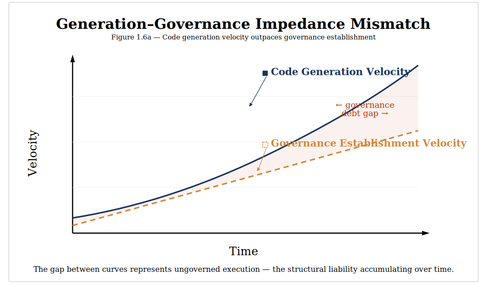

# Protocol-Governed Systems

## A Constitutionally Constrained Architecture for Autonomous and AI-Generated Software

## A Practitioner's Guide

**Version 0 --- First Edition · Baseline: PGS v0.4.0**

*Bhash Ganti (aka Bachi)*

Contact: bachipeachy@gmail.com

© 2026 Bhash Ganti. All rights reserved. Released under the Apache-2.0 License.

Reference Implementation GitHub: [bachipeachy/pgs_workspace](https://github.com/bachipeachy/pgs_workspace)

## Abstract

Software systems are entering a new operational reality. As AI coding agents accelerate implementation velocity, the gap between what organizations intend systems to do and what those systems are actually capable of doing is widening rapidly. In conventional architectures, behavioral authority remains embedded in imperative code, dispersed across frameworks, orchestration layers, service boundaries, and runtime interpretation. Governance is typically applied after implementation through testing, review, policy, or operational controls rather than being structurally enforced before execution begins.

Protocol-Governed Systems (PGS) proposes a different execution model.

In PGS, behavior is declared in governed protocol artifacts, validated through compile-time constitutional enforcement, materialized into deterministic execution topology, and executed by a semantic-agnostic runtime constrained to previously declared behavioral surfaces. The runtime does not dynamically infer permissible behavior. It traverses admissible execution paths already constructed and validated by the compiler.

This guide presents the architectural principles, governance model, compiler-runtime separation, and execution semantics underlying PGS. It covers constitutional authoring, invariant enforcement, federated governance boundaries, capability isolation, deterministic execution graphs, transport governance, immutable execution evidence, and protocol-directed domain construction. It also examines the implications of protocol-governed execution for AI-assisted software development, organizational governance, and high-integrity system design.

The central premise of PGS is simple: software systems become more governable when protocol --- not imperative runtime code --- becomes the primary authority surface of execution.

## Scope Note

This guide describes a reference implementation and architectural model for Protocol-Governed Systems (PGS). The work is exploratory and intended to contribute to ongoing discussion around software governance, deterministic execution, and AI-assisted system construction. PGS should be understood as an architectural research direction and operational substrate rather than a finalized industry standard.

## Dedication

*To the engineers, architects, and technical leaders who have sensed that software systems are becoming operationally more complex than they are governable.*

*To those who have watched behavior dissolve into orchestration layers, service meshes, framework conventions, runtime indirection, and increasingly machine-generated implementation --- while the system itself became harder to reason about, audit, or constrain with confidence.*

*This work is dedicated to the belief that software governance should be structural rather than procedural. That correctness should emerge from declared admissibility instead of retrospective inspection. That execution environments should be constrained by protocol before they are trusted with authority.*

*PGS is an exploration of that possibility: a model in which protocol becomes the governing substrate of execution, the compiler becomes the constructor of admissible behavior, and runtime systems become intentionally incapable of exceeding declared operational boundaries.*

*If successful, systems built this way may allow humans and AI to collaborate at machine speed without surrendering determinism, traceability, or governance.*

*Build forward.*

# Table of Contents

[Protocol-Governed Systems [1](#protocol-governed-systems)](#protocol-governed-systems)

[A Constitutionally Constrained Architecture for Autonomous and AI-Generated Software [1](#a-constitutionally-constrained-architecture-for-autonomous-and-ai-generated-software)](#a-constitutionally-constrained-architecture-for-autonomous-and-ai-generated-software)

[A Practitioner's Guide [2](#a-practitioners-guide)](#a-practitioners-guide)

[Abstract [3](#abstract)](#abstract)

[Scope Note [4](#scope-note)](#scope-note)

[Dedication [5](#dedication)](#dedication)

[Table of Contents [5](#table-of-contents)](#table-of-contents)

[Chapter 00 --- Introduction and Orientation [13](#chapter-00-introduction-and-orientation)](#chapter-00-introduction-and-orientation)

[Who This Book Is For [16](#who-this-book-is-for)](#who-this-book-is-for)

[What You Will Build [17](#what-you-will-build)](#what-you-will-build)

[How This Book Is Organized [18](#how-this-book-is-organized)](#how-this-book-is-organized)

[Chapter 1 --- Why Software Breaks at Scale [20](#chapter-1-why-software-breaks-at-scale)](#chapter-1-why-software-breaks-at-scale)

[1.1 --- The Billion-Dollar Maintenance Problem [22](#the-billion-dollar-maintenance-problem)](#the-billion-dollar-maintenance-problem)

[1.2 --- The Application-Centric Model [23](#the-application-centric-model)](#the-application-centric-model)

[1.3 --- What Breaks and Why [25](#what-breaks-and-why)](#what-breaks-and-why)

[1.4 --- Why Existing Remedies Don't Work [27](#why-existing-remedies-dont-work)](#why-existing-remedies-dont-work)

[1.5 --- Structural Governance Debt [28](#structural-governance-debt)](#structural-governance-debt)

[1.6 --- The Generation-Governance Impedance Mismatch [30](#the-generation-governance-impedance-mismatch)](#the-generation-governance-impedance-mismatch)

[1.7 --- The Question This Book Answers [32](#the-question-this-book-answers)](#the-question-this-book-answers)

[Chapter 2 --- From Applications to Protocols [32](#chapter-2-from-applications-to-protocols)](#chapter-2-from-applications-to-protocols)

[2.1 --- The Core Insight [34](#the-core-insight)](#the-core-insight)

[2.2 --- Formal Definition: What Is a Protocol-Governed System? [36](#formal-definition-what-is-a-protocol-governed-system)](#formal-definition-what-is-a-protocol-governed-system)

[2.3 --- The WHAT/HOW Separation [38](#the-whathow-separation)](#the-whathow-separation)

[2.4 --- Layers and Concerns: The Structural Grammar [39](#layers-and-concerns-the-structural-grammar)](#layers-and-concerns-the-structural-grammar)

[2.5 --- How This Differs [41](#how-this-differs)](#how-this-differs)

[2.6 --- What This Paradigm Makes Possible [42](#what-this-paradigm-makes-possible)](#what-this-paradigm-makes-possible)

[2.7 --- From Paradigm to System [45](#from-paradigm-to-system)](#from-paradigm-to-system)

[2.8 --- Reference Architecture: Layered Structural Topology [46](#reference-architecture-layered-structural-topology)](#reference-architecture-layered-structural-topology)

[2.9 --- Layer Responsibilities [49](#layer-responsibilities)](#layer-responsibilities)

[2.10 --- Authority Flow [52](#authority-flow)](#authority-flow)

[2.11 --- Deployment Context [54](#deployment-context)](#deployment-context)

[2.12 --- The Road Ahead [56](#the-road-ahead)](#the-road-ahead)

[Chapter 3 --- Constitutional Authoring [57](#chapter-3-constitutional-authoring)](#chapter-3-constitutional-authoring)

[3.1 --- The Engineering Objective [58](#the-engineering-objective)](#the-engineering-objective)

[3.2 --- Artifact 1: The Intent (IN\_) [59](#artifact-1-the-intent-in_)](#artifact-1-the-intent-in_)

[3.3 --- Artifact 2: The Workflow (WF\_) [61](#artifact-2-the-workflow-wf_)](#artifact-2-the-workflow-wf_)

[3.4 --- Artifact 3: The Capability Contract (CC\_) [62](#artifact-3-the-capability-contract-cc_)](#artifact-3-the-capability-contract-cc_)

[3.5 --- Validation and Failure Surface [64](#validation-and-failure-surface)](#validation-and-failure-surface)

[3.6 --- Structural Insight (Doctrine Moment) [66](#structural-insight-doctrine-moment)](#structural-insight-doctrine-moment)

[3.7 --- Solved Problems [67](#solved-problems)](#solved-problems)

[3.8 --- Generated Output: The Execution Graph [69](#generated-output-the-execution-graph)](#generated-output-the-execution-graph)

[3.9 --- Boundary and Forward Pointer [71](#boundary-and-forward-pointer)](#boundary-and-forward-pointer)

[3.10 --- Review Questions [72](#review-questions)](#review-questions)

[Chapter 4 --- The Builder as Constitutional Compiler [73](#chapter-4-the-builder-as-constitutional-compiler)](#chapter-4-the-builder-as-constitutional-compiler)

[4.1 --- The Engineering Objective [74](#the-engineering-objective-1)](#the-engineering-objective-1)

[4.2 --- The Build Constitution: The FQDN Tree [75](#the-build-constitution-the-fqdn-tree)](#the-build-constitution-the-fqdn-tree)

[4.3 --- Governance Input vs. Protocol Output [77](#governance-input-vs.-protocol-output)](#governance-input-vs.-protocol-output)

[4.4 --- The Builder Pipeline [79](#the-builder-pipeline)](#the-builder-pipeline)

[4.5 --- Validation and Failure Surface [81](#validation-and-failure-surface-1)](#validation-and-failure-surface-1)

[4.6 --- Structural Insight (Doctrine Moment) [83](#structural-insight-doctrine-moment-1)](#structural-insight-doctrine-moment-1)

[4.7 --- Solved Problems [85](#solved-problems-1)](#solved-problems-1)

[4.8 --- Generated Output: The Compiled Protocol Bundle [87](#generated-output-the-compiled-protocol-bundle)](#generated-output-the-compiled-protocol-bundle)

[4.9 --- Current Compiler Architecture Note [89](#current-compiler-architecture-note)](#current-compiler-architecture-note)

[4.10 --- The Compiler Evidence Graph [91](#the-compiler-evidence-graph)](#the-compiler-evidence-graph)

[4.11 --- Boundary and Forward Pointer [93](#boundary-and-forward-pointer-1)](#boundary-and-forward-pointer-1)

[4.12 --- Review Questions [94](#review-questions-1)](#review-questions-1)

[Chapter 5 --- Semantic-Agnostic Execution [95](#chapter-5-semantic-agnostic-execution)](#chapter-5-semantic-agnostic-execution)

[5.1 --- The Engineering Objective [97](#the-engineering-objective-2)](#the-engineering-objective-2)

[5.2 --- The Immutable DAG [98](#the-immutable-dag)](#the-immutable-dag)

[5.3 --- Runtime Bindings [100](#runtime-bindings)](#runtime-bindings)

[5.4 --- The Execution Context [102](#the-execution-context)](#the-execution-context)

[5.5 --- DAG Traversal: The Execution Loop [104](#dag-traversal-the-execution-loop)](#dag-traversal-the-execution-loop)

[5.6 --- Validation and Failure Surface [107](#validation-and-failure-surface-2)](#validation-and-failure-surface-2)

[5.7 --- Structural Insight (Doctrine Moment) [109](#structural-insight-doctrine-moment-2)](#structural-insight-doctrine-moment-2)

[5.8 --- Solved Problems [110](#solved-problems-2)](#solved-problems-2)

[5.9 --- Generated Output: The Execution Trace [112](#generated-output-the-execution-trace)](#generated-output-the-execution-trace)

[5.10 --- Boundary and Forward Pointer [116](#boundary-and-forward-pointer-2)](#boundary-and-forward-pointer-2)

[5.11 --- Review Questions [117](#review-questions-2)](#review-questions-2)

[Chapter 6 --- Capability Transforms and Composition [118](#chapter-6-capability-transforms-and-composition)](#chapter-6-capability-transforms-and-composition)

[6.1 --- The Engineering Objective [119](#the-engineering-objective-3)](#the-engineering-objective-3)

[6.2 --- The CT Atom [120](#the-ct-atom)](#the-ct-atom)

[6.3 --- The Molecule [122](#the-molecule)](#the-molecule)

[6.4 --- CT-IR: The Intermediate Representation [124](#ct-ir-the-intermediate-representation)](#ct-ir-the-intermediate-representation)

[6.5 --- Validation and Failure Surface [126](#validation-and-failure-surface-3)](#validation-and-failure-surface-3)

[6.6 --- Structural Insight (Doctrine Moment) [128](#structural-insight-doctrine-moment-3)](#structural-insight-doctrine-moment-3)

[6.7 --- Solved Problems [131](#solved-problems-3)](#solved-problems-3)

[6.8 --- Generated Output: The CT Execution Trace [133](#generated-output-the-ct-execution-trace)](#generated-output-the-ct-execution-trace)

[6.9 --- Boundary and Forward Pointer [135](#boundary-and-forward-pointer-3)](#boundary-and-forward-pointer-3)

[6.10 --- Review Questions [136](#review-questions-3)](#review-questions-3)

[Chapter 7 --- Capability Side Effects and Isolation [137](#chapter-7-capability-side-effects-and-isolation)](#chapter-7-capability-side-effects-and-isolation)

[7.1 --- The Engineering Objective [138](#the-engineering-objective-4)](#the-engineering-objective-4)

[7.2 --- The CT/CS Constitutional Boundary [139](#the-ctcs-constitutional-boundary)](#the-ctcs-constitutional-boundary)

[7.3 --- The CS Capability Model [140](#the-cs-capability-model)](#the-cs-capability-model)

[7.4 --- Runtime Bindings (RB\_) [145](#runtime-bindings-rb_)](#runtime-bindings-rb_)

[7.5 --- The CC\_ Pipeline: CT/CS Integration [147](#the-cc_-pipeline-ctcs-integration)](#the-cc_-pipeline-ctcs-integration)

[7.6 --- Validation and Failure Surface [149](#validation-and-failure-surface-4)](#validation-and-failure-surface-4)

[7.7 --- Structural Insight (Doctrine Moment) [151](#structural-insight-doctrine-moment-4)](#structural-insight-doctrine-moment-4)

[7.8 --- Solved Problems [153](#solved-problems-4)](#solved-problems-4)

[7.9 --- Generated Output: The Mixed CT+CS Execution Trace [155](#generated-output-the-mixed-ctcs-execution-trace)](#generated-output-the-mixed-ctcs-execution-trace)

[7.10 --- Boundary and Forward Pointer [157](#boundary-and-forward-pointer-4)](#boundary-and-forward-pointer-4)

[7.11 --- Review Questions [158](#review-questions-4)](#review-questions-4)

[Chapter 8 --- Failure as a First-Class Architectural Construct [159](#chapter-8-failure-as-a-first-class-architectural-construct)](#chapter-8-failure-as-a-first-class-architectural-construct)

[8.1 --- The Engineering Objective [161](#the-engineering-objective-5)](#the-engineering-objective-5)

[8.2 --- The Failure Taxonomy [162](#the-failure-taxonomy)](#the-failure-taxonomy)

[8.3 --- The Structured Error Model [169](#the-structured-error-model)](#the-structured-error-model)

[8.4 --- Result Status Contracts [171](#result-status-contracts)](#result-status-contracts)

[8.5 --- Validation and Failure Surface [173](#validation-and-failure-surface-5)](#validation-and-failure-surface-5)

[8.6 --- Structural Insight (Doctrine Moment) [175](#structural-insight-doctrine-moment-5)](#structural-insight-doctrine-moment-5)

[8.7 --- Solved Problems [177](#solved-problems-5)](#solved-problems-5)

[8.8 --- Generated Output: Trace-Based Diagnosis Workflow [180](#generated-output-trace-based-diagnosis-workflow)](#generated-output-trace-based-diagnosis-workflow)

[8.9 --- Boundary and Forward Pointer [184](#boundary-and-forward-pointer-5)](#boundary-and-forward-pointer-5)

[8.10 --- Review Questions [185](#review-questions-5)](#review-questions-5)

[Chapter 9 --- Deterministic Traces as First-Class Artifacts [186](#chapter-9-deterministic-traces-as-first-class-artifacts)](#chapter-9-deterministic-traces-as-first-class-artifacts)

[9.1 --- The Engineering Objective [188](#the-engineering-objective-6)](#the-engineering-objective-6)

[9.2 --- The Execution Trace Record [189](#the-execution-trace-record)](#the-execution-trace-record)

[9.3 --- The Trace Chain [191](#the-trace-chain)](#the-trace-chain)

[9.4 --- The Trace Examiner [193](#the-trace-examiner)](#the-trace-examiner)

[9.5 --- Validation and Failure Surface [196](#validation-and-failure-surface-6)](#validation-and-failure-surface-6)

[9.6 --- Structural Insight (Doctrine Moment) [198](#structural-insight-doctrine-moment-6)](#structural-insight-doctrine-moment-6)

[9.7 --- Solved Problems [200](#solved-problems-6)](#solved-problems-6)

[9.8 --- Generated Output: Trace Examination Report [204](#generated-output-trace-examination-report)](#generated-output-trace-examination-report)

[9.9 --- Boundary and Forward Pointer [206](#boundary-and-forward-pointer-6)](#boundary-and-forward-pointer-6)

[9.10 --- Review Questions [208](#review-questions-6)](#review-questions-6)

[Chapter 10 --- Inverted Security Architecture [209](#chapter-10-inverted-security-architecture)](#chapter-10-inverted-security-architecture)

[10.1 --- The Engineering Objective [211](#the-engineering-objective-7)](#the-engineering-objective-7)

[10.2 --- The Vocabulary as Security Perimeter [212](#the-vocabulary-as-security-perimeter)](#the-vocabulary-as-security-perimeter)

[10.3 --- The Closed Runtime Registry [215](#the-closed-runtime-registry)](#the-closed-runtime-registry)

[10.4 --- The Protocol Boundary Chain [217](#the-protocol-boundary-chain)](#the-protocol-boundary-chain)

[10.5 --- Validation and Failure Surface [219](#validation-and-failure-surface-7)](#validation-and-failure-surface-7)

[10.6 --- Structural Insight (Doctrine Moment) [221](#structural-insight-doctrine-moment-7)](#structural-insight-doctrine-moment-7)

[10.7 --- Solved Problems [224](#solved-problems-7)](#solved-problems-7)

[10.8 --- Generated Output: Vocabulary-Bounded Attack Surface Map [228](#generated-output-vocabulary-bounded-attack-surface-map)](#generated-output-vocabulary-bounded-attack-surface-map)

[10.9 --- Boundary and Forward Pointer [231](#boundary-and-forward-pointer-7)](#boundary-and-forward-pointer-7)

[10.10 --- Review Questions [232](#review-questions-7)](#review-questions-7)

[Chapter 11 --- Declarative Package Federation [233](#chapter-11-declarative-package-federation)](#chapter-11-declarative-package-federation)

[11.1 --- The Engineering Objective [235](#the-engineering-objective-8)](#the-engineering-objective-8)

[11.2 --- The FQDN Tree as Governance Topology [236](#the-fqdn-tree-as-governance-topology)](#the-fqdn-tree-as-governance-topology)

[11.3 --- The Path Registry as Constitutional Source of Truth [238](#the-path-registry-as-constitutional-source-of-truth)](#the-path-registry-as-constitutional-source-of-truth)

[11.4 --- Cross-Domain Artifact Resolution [240](#cross-domain-artifact-resolution)](#cross-domain-artifact-resolution)

[11.5 --- Validation and Failure Surface [242](#validation-and-failure-surface-8)](#validation-and-failure-surface-8)

[11.6 --- Structural Insight (Doctrine Moment) [245](#structural-insight-doctrine-moment-8)](#structural-insight-doctrine-moment-8)

[11.7 --- Solved Problems [247](#solved-problems-8)](#solved-problems-8)

[11.8 --- Generated Output: Federation Topology Map [250](#generated-output-federation-topology-map)](#generated-output-federation-topology-map)

[11.9 --- Boundary and Forward Pointer [253](#boundary-and-forward-pointer-8)](#boundary-and-forward-pointer-8)

[11.10 --- Review Questions [254](#review-questions-8)](#review-questions-8)

[Chapter 12 --- Linear Scalability Through Compositional Isolation [255](#chapter-12-linear-scalability-through-compositional-isolation)](#chapter-12-linear-scalability-through-compositional-isolation)

[12.1 --- The Engineering Objective [256](#the-engineering-objective-9)](#the-engineering-objective-9)

[12.2 --- Compositional Isolation [257](#compositional-isolation)](#compositional-isolation)

[12.3 --- Version Coexistence [261](#version-coexistence)](#version-coexistence)

[12.4 --- Environment Facts as Deterministic Context [263](#environment-facts-as-deterministic-context)](#environment-facts-as-deterministic-context)

[12.5 --- Validation and Failure Surface [265](#validation-and-failure-surface-9)](#validation-and-failure-surface-9)

[12.6 --- Structural Insight (Doctrine Moment) [267](#structural-insight-doctrine-moment-9)](#structural-insight-doctrine-moment-9)

[12.7 --- Solved Problems [269](#solved-problems-9)](#solved-problems-9)

[12.8 --- Generated Output: Compositional Isolation Report [273](#generated-output-compositional-isolation-report)](#generated-output-compositional-isolation-report)

[12.9 --- Boundary and Forward Pointer [275](#boundary-and-forward-pointer-9)](#boundary-and-forward-pointer-9)

[12.10 --- Review Questions [276](#review-questions-9)](#review-questions-9)

[Chapter 13 --- Building a Protocol-Governed Domain [277](#chapter-13-building-a-protocol-governed-domain)](#chapter-13-building-a-protocol-governed-domain)

[13.1 --- The Goal of Our Building Project [278](#the-goal-of-our-building-project)](#the-goal-of-our-building-project)

[13.2 --- The Plan and the Seven Building Steps [279](#the-plan-and-the-seven-building-steps)](#the-plan-and-the-seven-building-steps)

[Chapter 14 --- Use Case: AI Agent Governance Domain [285](#chapter-14-use-case-ai-agent-governance-domain)](#chapter-14-use-case-ai-agent-governance-domain)

[14.1 --- The Engineering Objective [286](#the-engineering-objective-10)](#the-engineering-objective-10)

[14.2 --- From Business Thesis to Domain Specification (Act 0) [288](#from-business-thesis-to-domain-specification-act-0)](#from-business-thesis-to-domain-specification-act-0)

[14.3 --- Domain Construction: Act I Through Act VII [292](#domain-construction-act-i-through-act-vii)](#domain-construction-act-i-through-act-vii)

[14.4 --- The Workflow DAG: Governing Agent Action [307](#the-workflow-dag-governing-agent-action)](#the-workflow-dag-governing-agent-action)

[14.5 --- Execution Scenarios [309](#execution-scenarios)](#execution-scenarios)

[14.6 --- Cross-Domain Composition [314](#cross-domain-composition)](#cross-domain-composition)

[14.7 --- Trace Examination [316](#trace-examination)](#trace-examination)

[14.8 --- What Did Not Change [318](#what-did-not-change)](#what-did-not-change)

[14.9 --- Structural Insight (Doctrine Moment) [320](#structural-insight-doctrine-moment-10)](#structural-insight-doctrine-moment-10)

[14.10 --- Boundary and Forward Pointer [322](#boundary-and-forward-pointer-10)](#boundary-and-forward-pointer-10)

[14.11 --- Review Questions [323](#review-questions-10)](#review-questions-10)

[Chapter 15 --- Structural Economics of Governance [325](#chapter-15-structural-economics-of-governance)](#chapter-15-structural-economics-of-governance)

[15.1 --- The Cost Problem No One Solves [326](#the-cost-problem-no-one-solves)](#the-cost-problem-no-one-solves)

[15.2 --- The Governance Dividend [327](#the-governance-dividend-1)](#the-governance-dividend-1)

[15.3 --- The Protocol Dividend [329](#the-protocol-dividend-1)](#the-protocol-dividend-1)

[15.3a --- The Architectural Dividend [332](#a-the-architectural-dividend)](#a-the-architectural-dividend)

[15.4 --- The Proof: Agent Governance in Numbers [334](#the-proof-agent-governance-in-numbers)](#the-proof-agent-governance-in-numbers)

[15.5 --- Debugging Economics [337](#debugging-economics)](#debugging-economics)

[15.6 --- Failure Containment Economics [339](#failure-containment-economics)](#failure-containment-economics)

[15.7 --- Compliance Economics [340](#compliance-economics)](#compliance-economics)

[15.8 --- Integration Economics [341](#integration-economics)](#integration-economics)

[15.9 --- The Technical Debt Inversion [343](#the-technical-debt-inversion)](#the-technical-debt-inversion)

[15.10 --- Organizational Structure Implications [345](#organizational-structure-implications)](#organizational-structure-implications)

[15.11 --- The AI Velocity Multiplier [347](#the-ai-velocity-multiplier)](#the-ai-velocity-multiplier)

[15.12 --- Quantified Comparisons [349](#quantified-comparisons)](#quantified-comparisons)

[15.13 --- Honest Limits [351](#honest-limits)](#honest-limits)

[15.14 --- The Two Dividends: A Synthesis [353](#the-two-dividends-a-synthesis)](#the-two-dividends-a-synthesis)

[Chapter 16 --- Engineering Under Constitutional Constraint [354](#chapter-16-engineering-under-constitutional-constraint)](#chapter-16-engineering-under-constitutional-constraint)

[16.1 --- The Engineering Objective [356](#the-engineering-objective-11)](#the-engineering-objective-11)

[16.2 --- From Integration-Centric to Composition-Centric Engineering [357](#from-integration-centric-to-composition-centric-engineering)](#from-integration-centric-to-composition-centric-engineering)

[16.3 --- The Governance-First Mindset [359](#the-governance-first-mindset)](#the-governance-first-mindset)

[16.4 --- Runtime Minimalism as Engineering Discipline [361](#runtime-minimalism-as-engineering-discipline)](#runtime-minimalism-as-engineering-discipline)

[16.5 --- Engineering Risk Surface Compression [363](#engineering-risk-surface-compression)](#engineering-risk-surface-compression)

[16.6 --- Deterministic Debugging as Daily Practice [365](#deterministic-debugging-as-daily-practice)](#deterministic-debugging-as-daily-practice)

[16.7 --- What Disappears From Engineering Work [368](#what-disappears-from-engineering-work)](#what-disappears-from-engineering-work)

[16.8 --- Code Review Becomes Artifact Review [370](#code-review-becomes-artifact-review)](#code-review-becomes-artifact-review)

[16.9 --- Team Structure Under the Model [372](#team-structure-under-the-model)](#team-structure-under-the-model)

[16.10 --- The Psychological Shift [373](#the-psychological-shift)](#the-psychological-shift)

[16.11 --- Limits in Engineering Practice [375](#limits-in-engineering-practice)](#limits-in-engineering-practice)

[16.12 --- Bridge to Chapter 17 [377](#bridge-to-chapter-17)](#bridge-to-chapter-17)

[Chapter 17 --- AI-Augmented Development Under Protocol Governance [378](#chapter-17-ai-augmented-development-under-protocol-governance)](#chapter-17-ai-augmented-development-under-protocol-governance)

[17.1 --- The Engineering Objective [379](#the-engineering-objective-12)](#the-engineering-objective-12)

[17.2 --- The Generation-Governance Impedance Mismatch [380](#the-generation-governance-impedance-mismatch-1)](#the-generation-governance-impedance-mismatch-1)

[17.3 --- Why Traditional Governance Cannot Keep Up [382](#why-traditional-governance-cannot-keep-up)](#why-traditional-governance-cannot-keep-up)

[17.4 --- Protocol Governance as the Resolution [384](#protocol-governance-as-the-resolution)](#protocol-governance-as-the-resolution)

[17.5 --- AI as Protocol Author [387](#ai-as-protocol-author)](#ai-as-protocol-author)

[17.6 --- Structural Entropy Under AI Generation [389](#structural-entropy-under-ai-generation)](#structural-entropy-under-ai-generation)

[17.7 --- Runtime Stability Under AI-Speed Generation [391](#runtime-stability-under-ai-speed-generation)](#runtime-stability-under-ai-speed-generation)

[17.8 --- The Human Role Under AI-Speed Generation [393](#the-human-role-under-ai-speed-generation)](#the-human-role-under-ai-speed-generation)

[17.9 --- Preventing AI-Generated Technical Debt [395](#preventing-ai-generated-technical-debt)](#preventing-ai-generated-technical-debt)

[17.10 --- Limits and Honest Risks [397](#limits-and-honest-risks)](#limits-and-honest-risks)

[17.11 --- Bridge to Chapter 18 [399](#bridge-to-chapter-18)](#bridge-to-chapter-18)

[Chapter 18 --- Adopting Protocol Governance Incrementally [400](#chapter-18-adopting-protocol-governance-incrementally)](#chapter-18-adopting-protocol-governance-incrementally)

[18.1 --- The Adoption Question [401](#the-adoption-question)](#the-adoption-question)

[18.2 --- Starting With a Single Governed Capability [402](#starting-with-a-single-governed-capability)](#starting-with-a-single-governed-capability)

[18.3 --- Wrapping Existing Services as Capability Side Effects [404](#wrapping-existing-services-as-capability-side-effects)](#wrapping-existing-services-as-capability-side-effects)

[18.4 --- The Incremental Adoption Path [406](#the-incremental-adoption-path)](#the-incremental-adoption-path)

[18.5 --- When Protocol Governance Is Overkill [408](#when-protocol-governance-is-overkill)](#when-protocol-governance-is-overkill)

[18.6 --- Migration Patterns From Common Architectures [410](#migration-patterns-from-common-architectures)](#migration-patterns-from-common-architectures)

[18.7 --- The Rigidity Question [413](#the-rigidity-question)](#the-rigidity-question)

[18.8 --- The Adoption Decision Framework [417](#the-adoption-decision-framework)](#the-adoption-decision-framework)

[18.9 --- Closing the Book [419](#closing-the-book)](#closing-the-book)

[Appendix A --- Glossary of PGS Terms [421](#appendix-a-glossary-of-pgs-terms)](#appendix-a-glossary-of-pgs-terms)

[Core Paradigm [422](#core-paradigm)](#core-paradigm)

[The Lifecycle Axis (How Behavior is Constructed) [423](#the-lifecycle-axis-how-behavior-is-constructed)](#the-lifecycle-axis-how-behavior-is-constructed)

[The Execution Axis (What Behavior Does) [424](#the-execution-axis-what-behavior-does)](#the-execution-axis-what-behavior-does)

[The Capability Surface [426](#the-capability-surface)](#the-capability-surface)

[Identity and Structure [427](#identity-and-structure)](#identity-and-structure)

[Security Properties [428](#security-properties)](#security-properties)

[Domain Construction [429](#domain-construction)](#domain-construction)

[Appendix B --- Protocol Snapshot Reference [429](#appendix-b-protocol-snapshot-reference)](#appendix-b-protocol-snapshot-reference)

[Location [430](#location)](#location)

[How to Browse [431](#how-to-browse)](#how-to-browse)

[Naming Convention [432](#naming-convention)](#naming-convention)

[Current Artifact Counts [433](#current-artifact-counts)](#current-artifact-counts)

[Source [434](#source)](#source)

[Appendix C --- pgs_runtime CLI Reference [434](#appendix-c-pgs_runtime-cli-reference)](#appendix-c-pgs_runtime-cli-reference)

[Global Usage [435](#global-usage)](#global-usage)

[pgs_runtime run [436](#pgs_runtime-run)](#pgs_runtime-run)

[pgs_runtime examine [440](#pgs_runtime-examine)](#pgs_runtime-examine)

[Operational Notes [441](#operational-notes)](#operational-notes)

[pgs_compiler CLI Reference [441](#pgs_compiler-cli-reference)](#pgs_compiler-cli-reference)

[Global Usage [442](#global-usage-1)](#global-usage-1)

[compile [443](#compile)](#compile)

[build [444](#build)](#build)

[inspect [445](#inspect)](#inspect)

[Compiler Operational Notes [446](#compiler-operational-notes)](#compiler-operational-notes)

[Appendix D --- Artifact Schema Reference [446](#appendix-d-artifact-schema-reference)](#appendix-d-artifact-schema-reference)

[Common Fields [447](#common-fields)](#common-fields)

[Intent (IN\_) [448](#intent-in_)](#intent-in_)

[Workflow (WF\_) [450](#workflow-wf_)](#workflow-wf_)

[Capability Contract (CC\_) [452](#capability-contract-cc_)](#capability-contract-cc_)

[Capability Transform (CT\_) [454](#capability-transform-ct_)](#capability-transform-ct_)

[Capability Side Effect (CS\_) [456](#capability-side-effect-cs_)](#capability-side-effect-cs_)

[Runtime Binding (RB\_) [458](#runtime-binding-rb_)](#runtime-binding-rb_)

[Actor (AC\_) [460](#actor-ac_)](#actor-ac_)

[Event (EV\_) [462](#event-ev_)](#event-ev_)

[Assertion (AS\_) [464](#assertion-as_)](#assertion-as_)

[Field Type Reference [466](#field-type-reference)](#field-type-reference)

[Reading Compiled Artifacts [467](#reading-compiled-artifacts)](#reading-compiled-artifacts)

[]{#chapter-00-introduction-and-orientation .anchor}

# Chapter 00 --- Introduction and Orientation {#chapter-00-introduction-and-orientation-1}

Software is now generated faster than it can be governed.

AI-assisted development, distributed infrastructure, microservice sprawl, and accelerating delivery pipelines have dramatically increased implementation velocity. Governance --- correctness, traceability, behavioral authority, operational auditability --- remains bounded by human deliberation. The gap between these two velocities is structural and widening.

This is not a problem you solve with better tooling, more diligent code review, or a stronger CI pipeline. Those are compensations for a structural absence. The absence is the governance surface itself: there is no artifact in most software systems that declares what the system is *authorized to do*, in a form that can be validated, compiled, and enforced before execution begins.

**Protocol-Governed Systems (PGS)** is an architectural model designed to close that gap --- not by slowing implementation, but by making governance itself a first-class computational construct.

In most software architectures, governance is layered on top of behavior: code review, documentation, policy enforcement, runtime checks, observability tooling. These are compensations for a structural absence. You know what the system *does* by reading its code. You know what it *should* do by talking to the engineers who built it.

PGS reverses this relationship.

Rather than treating governance as documentation, policy, convention, or runtime enforcement layered on top of application logic, PGS treats behavioral admissibility as a structural declaration --- one that is compiled constitutionally, validated deterministically, and realized through a semantic-blind execution model that is architecturally incapable of exceeding its declared behavioral surface.

In a protocol-governed system:

- **Behavioral admissibility is declared structurally** --- in protocol artifacts, not embedded in code
- **Governance is compiled prior to execution** --- not enforced at runtime, not asserted in tests
- **Execution is semantic-blind** --- the runtime realizes compiled topology without interpreting business semantics
- **Authority is separated from implementation** --- compromising execution infrastructure does not grant authority to alter behavioral law

The result is a system where governance is not documentation you hope someone reads. It is not policy layered on running code. It is not a convention you trust your team to maintain. It is a computational precondition for execution.

The direct architectural consequences are:

- **Execution becomes deterministic.** Given identical artifacts and inputs, every conformant execution produces identical observable results.
- **Behavioral authority becomes explicit.** There is a governed artifact that answers "what is this system authorized to do?" --- validated before the system ran.
- **Traces become first-class artifacts.** Every execution produces evidence sufficient for replay, verification, and forensic audit --- structurally, not instrumentally.
- **Security is inverted.** Semantic authority resides in governed protocol artifacts. Execution infrastructure possesses only realization authority. Compromise of the execution layer does not grant behavioral authority.
- **System extensibility compounds.** Adding a new capability requires adding governed artifacts --- not modifying the execution engine, not touching running workflows.

> The strongest conceptual claim in this architecture: governance-derived admissibility topology is compiled prior to execution and realized by an abstract machine that is structurally prohibited from possessing semantic authority. The separation is not policy. It is architectural.

This is not a framework tutorial, a workflow engine manual, or a product guide.

It is a practitioner-oriented architectural guide built around a working multi-repository open-source reference implementation --- designed to be cloned, inspected, modified, extended, stress-tested, and challenged directly. Every concept in this book is backed by executable artifacts, compiler behavior, governance constraints, deterministic traces, and a functioning implementation. Claims can be verified by running the system.

The reader is not expected to agree with every architectural decision. In many places, PGS intentionally challenges deeply embedded assumptions in mainstream software engineering:

- runtime semantic authority as an acceptable design
- imperative orchestration as the natural execution model
- dynamic behavioral discovery at runtime
- implicit dependency resolution
- governance-by-convention rather than governance-by-structure

The objective is not ideological persuasion. It is to present a coherent, executable, inspectable computational model that practitioners can evaluate directly --- through architecture, implementation, and operational behavior --- and draw their own conclusions.

## Who This Book Is For

This guide is written for practitioners who build systems, not consume them.

**Open-source developers** who want a genuinely novel execution model to inspect, extend, fork, or challenge --- one with a complete multi-repo reference implementation, not just architectural theory. If your default instinct when reading an architecture claim is "show me the code," this book is built for you.

**Systems engineers** designing infrastructure for correctness, determinism, and auditability --- particularly in environments where behavior must be provable rather than merely testable, or where execution must be reproducible across environments and time.

**Protocol designers** working on behavioral specification, governance models, or formal constraint systems who want a concrete executable realization they can run, inspect, and probe.

**Infrastructure architects** facing the governance deficit that comes with distributed systems, microservice sprawl, agentic infrastructure, or AI-assisted development pipelines --- and who are willing to consider that the remedy must be architectural, not procedural.

**AI tooling builders** who recognize that AI-generated implementation without governance authority is an unbounded liability --- and who want an architectural model in which generated code cannot exceed its declared behavioral surface, regardless of the sophistication of the generating system.

**Technically curious practitioners** who ask *why does the architecture look like this?* before asking *how do I use it?* --- and who treat resistance from unfamiliar design decisions as a reason to investigate rather than to dismiss.

You do not need prior exposure to PGS. You need to be willing to question assumptions about how software should be built and to evaluate the answers through direct experimentation rather than argument alone.

## What You Will Build

This guide is structured around direct engagement with the reference implementation. The goal is not familiarity --- it is judgment. By working through it, you will:

**Run a governed system end-to-end.** Clone the six-repo ecosystem, bootstrap the runtime, execute a workflow, and examine the deterministic execution trace it produces. Understand what each component contributes before reading an explanation of why.

**Read protocol artifacts before running them.** Before executing anything, you will understand the workflow declaration, intent, capability contracts, runtime bindings, and governance constraints that authorize the execution. The artifacts *are* the system specification.

**Watch the compiler derive admissibility.** Observe how the PGS compiler transforms governed artifacts into compiled admissible topology --- and what it structurally rejects before execution begins.

**Deliberately violate governance constraints.** Introduce a vocabulary violation. Remove an invariant. Write an artifact that references an undeclared capability. Watch the governance layer reject it --- not at runtime, but at construction time.

**Extend the system without modifying the engine.** Add a new capability domain with its own workflows, contracts, and governance constraints. The execution engine does not change. Only governed artifacts do. Verify that the engine realizes the new behavior correctly without any modification.

**Examine evidence-backed execution traces.** Inspect execution traces with sufficient fidelity for replay, conformance verification, and forensic audit. Understand operationally what "complete auditability" means --- and what it requires architecturally.

**Probe the governance dividend.** Observe how the cost of extending a mature governed system decreases as the governance structure matures --- and why this inverts the technical debt curve that dominates application-centric systems.

**Evaluate the architecture on your own terms.** The reference implementation is not a demonstration. It is an argument in code. You are invited to probe its limits, stress-test its invariants, and draw your own conclusions about where it succeeds and where it has open problems worth solving.

## How This Book Is Organized

The chapters that follow progressively construct the PGS model from structural motivation through full operational capability:

  ------------------------------------------------------------------------------------------------------------------------------------------------------------------------
  Chapter   Title                                                Theme
  --------- ---------------------------------------------------- ---------------------------------------------------------------------------------------------------------
  1         Why Software Breaks at Scale                         Structural diagnosis --- governance debt, its root causes, and why AI makes it worse

  2         From Applications to Protocols                       The paradigm shift and reference architecture --- five canonical properties, eight layers, ten concerns

  3         Constitutional Authoring                             Declaring behavioral law as protocol artifacts --- the legislative process for system behavior

  4         The Builder as Constitutional Compiler               How governed artifacts become admissible topology --- what the compiler does and cannot do

  5         Semantic-Agnostic Execution                          The abstract machine --- realizing compiled topology without semantic authority

  6         Capability Transforms and Composition                Pure computation --- deterministic, referentially transparent, replay-safe

  7         Capability Side Effects and Isolation                Governed mutation --- contract-bound, swappable, no ambient authority

  8         Failure as a First-Class Architectural Construct     Failure semantics declared in protocol, not inferred from exceptions

  9         Deterministic Traces as First-Class Artifacts        Execution evidence --- replay, conformance verification, and forensic audit

  10        Inverted Security Architecture                       Security through semantic authority separation --- not defensive programming

  11        Declarative Package Federation                       Federated governance boundaries --- constitutional admissibility profiles

  12        Linear Scalability Through Compositional Isolation   Why PGS scales O(N+M) where application-centric systems scale O(N×M)

  13        Building a Protocol-Governed Domain                  End-to-end domain construction --- from vocabulary to running workflows

  14        Use Case: AI Agent Governance Domain                 Governing AI agent behavior within declared constitutional constraints

  15        Structural Economics of Governance                   The governance dividend --- why marginal extension cost decreases with maturity

  16        Engineering Under Constitutional Constraint          What the development experience looks like for a governed system

  17        AI-Augmented Development Under Protocol Governance   Protocol governance as the architectural precondition for safe AI-speed authorship

  18        Adopting Protocol Governance Incrementally           Meeting real systems where they are --- introduction without full rewrite
  ------------------------------------------------------------------------------------------------------------------------------------------------------------------------

The complete reference implementation is open, federated, and inspectable. Every chapter references specific artifacts, compiler behavior, and execution traces you can examine directly. Architecture claims are backed by running code.

Protocol-Governed Systems is ultimately an attempt to answer one question:

> **What would software architecture look like if governance --- not implementation --- became the primary computational authority?**

The answer is in the code.

Clone it. Run it. Break it. Extend it. Decide for yourself.

# Chapter 1 --- Why Software Breaks at Scale

This chapter is a diagnosis. Before proposing a solution, the book must make the problem visible --- not as a collection of anecdotes, but as a structural pathology with identifiable root causes. The chapter argues that the dominant model of software construction --- the application-centric model --- embeds governance in code rather than declaring it as structure, and that this architectural choice produces a distinct form of debt that no amount of better tooling, process improvement, or code refactoring can eliminate. It introduces Structural Governance Debt as a formal concept, shows why it compounds polynomially with scale, and explains why AI-speed code generation removes the last natural throttle on its accumulation. The reader who finishes this chapter will recognize the pathology in their own systems --- and understand why the remedy must be architectural, not procedural.

Modern software does not fail because engineers are careless. **It fails because governance is embedded in code instead of declared as structure.**

In 2012, [Knight Capital Group](https://en.wikipedia.org/wiki/Knight_Capital_Group#2012_stock_trading_disruption) deployed a routine software update to eight production servers. One server retained a legacy code path that had been repurposed for the new release --- a flag that previously controlled a dormant feature now activated unintended trading logic. In forty-five minutes, the system executed \$7 billion in erroneous trades. The firm lost \$440 million. Within days, it required emergency recapitalization.

The root cause was not a coding error. The developers wrote correct code. The root cause was structural: the relationship between the deployment flag, the legacy code path, and the new trading logic existed in no artifact. The implicit contract --- "this flag must be deactivated on all servers before deployment" --- was tribal knowledge. It was real, load-bearing, and invisible to every automated system. No test caught it because the constraint was never declared in a form that tests could validate. No review caught it because the dependency was not documented. The governance was embedded in operational memory, not in structure.

This is structural governance debt --- not a mistake, but the predictable consequence of an architectural model that permits load-bearing constraints to exist without declaration.

This chapter is a diagnosis. It argues that the dominant model of software construction --- the application-centric model --- is structurally incapable of sustaining governance at scale.

The purpose is not to criticize engineers or practices. It is to make the structural root cause of our industry's maintenance burden visible---clearly enough that you can recognize it in your own systems before we move to the alternative.

## 1.1 --- The Billion-Dollar Maintenance Problem

The software industry spends most of its money not building systems, but sustaining them.

Multiple longitudinal studies over the last two decades consistently show that **60-80% of software expenditure goes to maintenance**---not to new features, not to innovation, but to keeping existing systems running, understood, and compliant with expectations that were never structurally declared.

This ratio is treated as normal. It is not.

A maintenance-dominated cost structure is a signal that something about how we build software produces systems whose cost of sustenance grows faster than their cost of creation. The question is not "how do we maintain better?" but **"why does maintenance dominate?"**

The answer is not people, process, or tools. It is structural.

The cost of this structural deficit extends beyond budgets. It is paid in: - **Suppressed Evolution:** Teams stop innovating because the cost and risk of change are too high. - **Talent Burnout:** Engineers burn out on coordination overhead, not on hard technical problems. - **Institutional Risk:** The inability to verify what a system *actually does* versus what it was *intended to do* creates a compliance and security blind spot.

The maintenance ratio is the visible symptom. The underlying pathology is architectural. This chapter identifies it.

> **A Note on "Governance"**
>
> Throughout this book, **governance** means *structural admissibility of behavior*---what a system is permitted to do and how that permission is declared, validated, and enforced.

## 1.2 --- The Application-Centric Model

The dominant model of software construction treats the **application** as the fundamental unit of design. This model is so pervasive that most engineers do not see it as a choice---it is simply how software is built.

That invisibility is the problem. The application-centric model has three structural properties that make it unstable at scale:

1.  **Behavior is Embedded.** What the system does is inseparable from how it does it. Business rules, validation logic, and authorization are all woven into the implementation. To understand the intent, you must read the code.

2.  **Governance is Implicit.** The rules that constrain the system---its invariants and contracts---exist in code comments, team wikis, and the memories of senior engineers. They are real and load-bearing, but they are invisible to any structural validation.

3.  **Structure is Emergent.** The system's true architecture---its dependency graph, its failure modes---is not declared. It is discovered after the fact by reading code and tracing execution paths. System diagrams are approximations, structurally disconnected from the running system.

This model was not a mistake. It was efficient for a world where systems were small and change velocity was human-speed. The analogy is building codes: you can build a house without them, but you cannot build a city.

The software industry is now building cities with the methods designed for houses.

{width="5.0in" height="2.9166666666666665in"}

Left: Application-centric systems bury governance in code.\
Right: Protocol-governed systems expose a declared governance surface.

## 1.3 --- What Breaks and Why

The failures of the application-centric model emerge at scale, as human compensations are exhausted. Three categories of structural failure are inevitable.

### 1. Version Drift and Hidden Coupling

Systems break not because of errors, but because an implicit contract between components was never declared and therefore could not be validated when one component changed. - **Version Drift:** The deployed code silently diverges from its original specification. - **Hidden Coupling:** Components share undeclared assumptions (e.g., API response formats, call ordering).

In mature SaaS systems --- especially those that evolved from monoliths into microservices --- version drift becomes visible in subtle ways: staging and production behave differently, deprecated endpoints continue to receive traffic, and runtime traffic patterns no longer match architectural diagrams. The dependency graph derived from logs often diverges from the diagram maintained by the architecture team.

### 2. Runtime Mutation and the Illusion of Control

The system's behavior depends on state that is not part of its governed surface. - **Configuration Drift:** "It works on my machine" is a structural problem. The code is identical across environments, but the runtime state (environment variables, feature flags, cache state) is not. - **Ungoverned Governance:** Feature flags are a form of governance, but the relationship between the flag and the behavior it controls exists nowhere as a structural artifact.

Agentic systems that modify their own configuration at runtime multiply this mutation surface beyond human audit capacity.

### 3. The Semantic Gap

What architects intend, what documents describe, and what code *actually does* are three different things. No structural mechanism connects them. - **Code review** is a human patch for this structural absence. It is expensive, probabilistic, and does not scale. - **Documentation drifts** from implementation not because engineers are lazy, but because there is no structural coupling between the document and the behavior.

This divergence between intended and enacted behavior will later be formalized as **Constitution Drift** (Chapter 3). It is a structural absence that no amount of process can fill.

### Structural Autopsy of a Failed Release

This class of incident is common in distributed systems: a "safe" change adjusts a timeout, retry, or caching policy; another component retries by default; a downstream workflow silently assumes exactly-once or idempotent behavior. None of those assumptions are declared as artifacts. No test fails because no test encodes the missing contract. The incident is not a bug in any single module --- it is a structural failure caused by undeclared coupling.

### Structural Summary

The three failure categories trace directly to the three properties of the application-centric model:

- Embedded behavior → no declared contract → version drift and hidden coupling
- Implicit governance → no validation surface → runtime mutation without audit
- Emergent structure → no invariant binding intent to execution → semantic gap

The failures are not independent. They reinforce each other. Drift widens the semantic gap. Mutation accelerates drift. The absence of declared structure makes all three invisible until they manifest as incidents.

## 1.4 --- Why Existing Remedies Don't Work

The industry has developed powerful tools to address these symptoms. Each is a genuine advance. Each leaves the core governance deficit untouched.

  --------------------------------------------------------------------------------------------------------------------------
  Remedy                  What It Governs                           What It **Cannot** Govern
  ----------------------- ----------------------------------------- --------------------------------------------------------
  **CI/CD**               The build and deploy pipeline             Behavioral semantics; inter-component contracts

  **Microservices**       Service boundaries; interface schemas     Behavior *behind* interfaces; cross-service invariants

  **IaC (Terraform)**     Machine topology; resource provisioning   Application logic; business rules

  **Feature Flags**       Activation state                          Semantic consequences of activation
  --------------------------------------------------------------------------------------------------------------------------

Each remedy governs a layer. None declares the system's behavioral semantics as a first-class, validatable artifact.

**Microservices:** The governance gap does not shrink when you move from monolith to microservices. It moves---from within the monolith to between services. And between services, it is harder to see, harder to test, and harder to reason about.

You can ship faster. You cannot ship more correctly. Speed without structural governance is faster accumulation of governance debt.

The pattern is consistent: each remedy governs one layer but stops short of the **semantic layer**---what the system means, what it promises, and what it is allowed to do.

> **A Note on High-Assurance Systems**
>
> Aviation and telecom systems survive at scale because they impose structural governance *externally*---through formal specifications, certification regimes, and immense human discipline. They prove that structural governance works, but at a cost that is economically infeasible for most software. The question is whether governance can be an *architectural property* of the system itself, rather than an external institutional burden.

## 1.5 --- Structural Governance Debt

The accumulated cost of embedding governance in code is not "technical debt." It is a distinct pathology.

**Technical debt** lives in code and can be repaid by refactoring. Technical debt is about the quality of the answer.

**Structural governance debt** lives in the absence of a declared governance surface. Because the governance constraints themselves are undeclared, refactoring code cannot eliminate it.

You can rewrite every function in the system to be clean, well-tested, and idiomatically perfect --- and the structural governance debt remains unchanged, because the governance constraints that should bind the system's behavior to its declared intent still do not exist as validatable artifacts. The code is better. The governance surface is identical. The debt persists.

### Formal Definition

> **Structural Governance Debt** is the accumulated cost of embedding governance decisions in code rather than in explicit, validatable protocol structures.

It has three defining properties: 1. **It is invisible to code-level metrics** like test coverage or complexity. 2. **It compounds polynomially** as implicit relationships between components explode ($O(N^{2})$). 3. **It cannot be repaid by code-level remediation.**

The compounding is concrete. In a small system --- five components, one team --- the debt is manageable. The team holds the full model in their heads. Implicit contracts are maintained through direct communication. In a medium system --- fifty components, five teams --- "tribal knowledge" becomes a recognized phenomenon: certain engineers are indispensable not for coding skill but because they hold implicit governance knowledge that exists nowhere else. Mystery failures appear --- incidents where the root cause is a violated implicit contract that no one documented. Teams begin to fear change. In a large system --- hundreds of components, dozens of teams --- governance debt dominates. Architecture review boards, change advisory boards, and cross-team synchronization meetings are all human governance mechanisms created to compensate for the absence of architectural governance.

{width="5.0in" height="2.9166666666666665in"}

> A graph showing two curves: - **Application-Centric (Implicit Governance):** Polynomial growth ($O(N^{2})$). - **Protocol-Governed (Explicit Governance):** Linear growth ($O(N)$).
>
> The ever-widening gap between the curves *is* the structural governance debt.

This compounding cost is why maintenance dominates budgets and why a **fear of change** becomes the dominant engineering constraint in mature systems. Fear of change is not timidity. It is a rational response to a system whose behavioral dependencies are implicit --- every change is a gamble.

> **The Litmus Test**
>
> Your system carries structural governance debt if:

- Deploying to production requires tribal knowledge not captured in any artifact
- A change to one component breaks a seemingly unrelated component
- You cannot answer: "What version of behavior was authoritative last March?"
- Onboarding a new engineer requires oral tradition, not artifact reading

> If any of these are true, the debt exists --- regardless of code quality, test coverage, or CI pipeline sophistication.

## 1.6 --- The Generation-Governance Impedance Mismatch

This structural deficit predates AI. What is new is the speed.

- **Code Generation Velocity** is accelerating exponentially.
- **Governance Establishment Velocity** is bounded by human deliberation.

The widening gap between these two velocities is the **Generation-Governance Impedance Mismatch**.

{width="5.0in" height="2.9166666666666665in"}

If governance cannot be repaired inside the application-centric model, it must be relocated outside it.

The acceleration maps directly onto the failure categories from Section 1.3:

- Faster code generation means faster **version drift**. Implicit contracts between components diverge at machine speed. Code review and architectural oversight cannot keep pace.
- Agentic runtime modification means higher **mutation velocity**. Systems that modify their own configuration increase the mutation surface beyond human audit capacity.
- Generated code with no governance surface means a wider **semantic gap**. The gap between intent and implementation is bridged by a statistical model, not a structural artifact.

In an application-centric model, AI-generated code---produced at machine speed with no structural governance---compounds debt at an unprecedented rate. AI is not the problem; it is a force multiplier for the existing structural pathology. **AI removes the last natural throttle---human coding speed---that was slowing the accumulation of structural governance debt.**

This book is not anti-AI. It argues that protocol governance is the **architectural precondition for safe AI-speed development.**

## 1.7 --- The Question This Book Answers

The diagnosis is complete. The application-centric model creates structural governance debt that compounds with scale and accelerates under AI.

The question is not whether engineers are good enough. The question is whether the model is.

> Is there a model of software construction where governance is structural---not embedded in code, not enforced by process, but a first-class architectural property of the system itself?

The answer is yes. The rest of this book defines it, implements it, and proves it.

Application-centric systems externalize governance; protocol-governed systems internalize it structurally.

The application-centric model made software possible. **It did not make software governable.**

# Chapter 2 --- From Applications to Protocols

*Paradigm and Reference Architecture*

Chapter 1 diagnosed the pathology: Structural Governance Debt --- the accumulated cost of embedding governance in code rather than declaring it as structure. The diagnosis is complete. This chapter defines the cure.

It is the foundational chapter of the book. It answers two questions in sequence. **Part I --- The Paradigm** (Sections 2.1--2.6) asks: *What is a Protocol-Governed System?* It defines the five canonical properties, the WHAT/HOW separation, the Layer-Concern structural grammar (eight layers, ten concerns), and the emergent properties that follow from structural governance. **Part II --- The Reference Architecture** (Sections 2.8--2.11) asks: *What does this look like as a system?* It maps the paradigm onto a concrete layered topology with strict authority flow --- from declaration through governance through compilation to enforcement. By the end, the reader will hold the complete architectural vocabulary and system model that every subsequent chapter builds upon: layers, concerns, artifact types, authority flow, and the deployment context within which protocol-governed systems operate.

The structural alternative to embedded governance is not better tooling. It is a different architectural model---one in which governance is the system's own structure, not an external discipline imposed upon it.

Chapter 1 identified the pathology: **Structural Governance Debt**. This chapter defines the cure: **Protocol-Governed Systems (PGS)**.

**Part I --- The Paradigm**

We will proceed in seven steps: 1. **The Core Insight:** Separating *What* from *How*. 2. **Formal Definition:** The five canonical properties of PGS. 3. **The Separation:** Why behavioral specification must be distinct from execution. 4. **Structural Grammar:** The Layer-Concern model. 5. **Differentiation:** How PGS differs from IaC, Workflow Engines, and DDD. 6. **Emergent Properties:** What you get for free. 7. **The Road Ahead:** Mapping the rest of the book.

## 2.1 --- The Core Insight

The architectural response to the governance crisis begins with a single move:

- **WHAT (Behavior):** Business rules, constraints, state transitions, contracts. In PGS, this is expressed as **declarative, versioned governance artifacts**. These artifacts are the system's behavioral authority.
- **HOW (Execution):** Runtime strategy, language, platform, optimization. In PGS, this is encapsulated in **semantic-agnostic execution engines**.

### The Building Code Analogy

A building code declares safety standards (load-bearing, fire safety). A construction crew implements them. \* The code exists independently of the crew. \* When the code changes, you modify the document, not the crew. \* The crew's competence is execution, not legislation.

Mainstream software asks the construction crew (engineers) to simultaneously write the code and build the building. The result is that the "law" is buried in the "bricks" (code).

The problem is not that engineers write bad code. The problem is that the architectural model allows code to be law. When the same artifact that implements behavior also defines what behavior is permitted, there is no independent authority to appeal to --- no governance surface that exists apart from the implementation. Every function is simultaneously a fact about what the system does and a claim about what the system should do. PGS separates them.

> **\[DIAGRAM 2\] --- The Governance Evolution**

1.  **Application-Centric:** Code is behavior. Governance is implicit.
2.  **Infrastructure-as-Code (IaC):** Infrastructure is declarative. Behavior remains embedded.
3.  **Protocol-Governed Systems (PGS):** Behavior is declarative. Governance is structural.

### What "Protocol" Means

The word is chosen deliberately. It is not "configuration" or "policy."

  ----------------------------------------------------------------------------------------------------
  Term                    Definition                          Role
  ----------------------- ----------------------------------- ----------------------------------------
  **Configuration**       Parameterizes existing behavior.    Adjusts options (e.g., feature flags).

  **Policy**              Constrains existing behavior.       Limits actions (e.g., rate limits).

  **Protocol**            **Declares the behavior itself.**   Defines the system's existence.
  ----------------------------------------------------------------------------------------------------

Without the protocol, the system has *no* behavior. The execution engine is like a PLC without ladder logic: a machine that can run, but has nothing to do.

A protocol is also not a domain-specific language. A DSL is a syntactic construct --- a notation system. A protocol is an architectural locus of authority. The distinction is structural, not syntactic. Configuration files, YAML documents, and DSL programs can all *express* protocol artifacts --- what matters is not the syntax but the architectural role: the artifact is the behavioral authority, and the system has no behavior that the artifact does not declare. DSL runtimes are typically domain-aware --- the interpreter contains domain knowledge. Protocol engines are domain-blind --- the engine interprets structure without knowing what the artifacts mean in any domain. This prevents the most common misreading: that protocol governance is "just fancy config files."

The word "protocol" carries the right structural weight. Network protocols --- TCP, HTTP, TLS --- declare behavioral contracts that any conformant implementation must honor. The protocol exists independently of any implementation. Multiple implementations coexist. Conformance is verifiable. The protocol is the authority; implementations are enforcement mechanisms.

One caveat: this paradigm is not optimized for greenfield experimentation or disposable prototypes. It is designed for systems that must sustain governance at scale --- systems where the cost of ungoverned behavior exceeds the cost of declaring governance.

## 2.2 --- Formal Definition: What Is a Protocol-Governed System?

A system is PGS-conformant if and only if it satisfies these five canonical properties.

### The Five Canonical Properties

**1. System behavior is defined by explicit, versioned governance artifacts.** All behavioral authority resides in declared artifacts---not code, not wikis. \* *Contrast:* In application-centric systems, the code *is* the behavior. In PGS, the protocol is the behavior; code is merely the enforcer.

**2. Authoring is constitutionally constrained and validated.** Not just anyone can author anything. Artifacts are validated against constitutional schemas *at authoring time*. \* *Contrast:* In application-centric systems, invalid logic is often caught at runtime (or by customers). In PGS, the distance between authoring and validation is zero.

**3. Execution is semantic-agnostic.** The engine interprets structure, not meaning. It routes a financial workflow and a device provisioning workflow using identical logic. It is domain-blind. \* *Contrast:* Application code is full of domain-specific logic (controllers, business rules). PGS engines are generic.

**4. Scalability emerges linearly from compositional isolation.** Adding a new domain does not create $O(N^{2})$ implicit couplings. Domains interact only through declared contracts. \* *Contrast:* Application-centric complexity grows polynomially because every component can implicitly depend on every other.

**5. Security is inverted: Enforcement is structural.** There is no ambient authority. The system does *nothing* that is not protocol-declared. Side effects are impossible unless explicitly authorized.

A developer cannot "accidentally" introduce a side effect because the architectural vocabulary does not permit undeclared side effects --- in the same way that a TCP implementation cannot "accidentally" send a UDP packet.

- *Contrast:* Application security is additive (firewalls, filters). PGS security is subtractive (nothing is allowed unless declared).

#### Failure of Omission

PGS is binary: partial protocol governance reintroduces structural drift. Remove any one property and the system collapses: \* Remove artifact authority → code regains legislative power.

- Remove constitutional validation → governance drifts.

- Remove semantic agnosticism → engine entangles with domain.

- Remove compositional isolation → complexity explodes.

- Remove structural enforcement → security becomes additive again.

> **The Canonical Definition**
>
> **A Protocol-Governed Software System (PGS)** is an architecture where behavior is defined by explicit artifacts, authoring is constitutionally constrained, execution is semantic-agnostic, scalability is linear, and security is inverted.

An attentive reader will ask: who guards the constitution itself? If governance artifacts must conform to constitutional rules, who authors those rules, and what constrains their evolution? The paradigm does not evade this question. Constitutional evolution is itself governed --- through vocabulary registries, schema versioning, and amendment processes that are structurally constrained. Chapter 3 addresses this directly.

## 2.3 --- The WHAT/HOW Separation

This separation is not new. It is the standard in mature engineering disciplines.

This separation is constitutional, not organizational. It is not the separation between "frontend and backend." It is not the interface/implementation boundary of object-oriented design. It is not the model/view/controller division. All of those separations occur within the application-centric model --- they organize code, but they do not separate behavioral authority from enforcement mechanics.

### Proven Patterns

1.  **Industrial Control Systems (PLCs):** Process engineers write ladder logic (WHAT). The PLC hardware executes it (HOW). The hardware has no idea it is running a chemical plant.
2.  **Operating Systems:** Applications declare requirements (memory, file access). The OS provides services. No one writes a custom OS for every app.

**Why Software Missed This:** We assumed business logic was too complex to be declarative. We were wrong. With the right primitives (**Capability Transforms** and **Side Effects**), any computable function can be governed. Governance does not reduce computational expressiveness; it relocates authority.

## 2.4 --- Layers and Concerns: The Structural Grammar

To make this enforceable, we need a precise grammar. We use a two-dimensional model: **Layers** (Lifecycle) and **Concerns** (Behavior).

### Why Two Axes?

Protocol-governed systems require four structural properties that conventional single-axis architecture cannot provide:

1.  **Deterministic artifact classification.** Every artifact must belong to exactly one cell, without ambiguity or judgment calls.
2.  **Explicit authority boundaries.** The governing authority for any artifact must be identifiable from its classification alone --- not from organizational charts.
3.  **Machine-verifiable behavioral typing.** The execution engine must know how to handle an artifact from its classification, without inspecting its contents.
4.  **Vocabulary-bounded extensibility.** New artifact types may only be introduced through constitutional amendment, not informal addition.

These cannot be satisfied unless lifecycle structure and runtime behavior are modeled separately. A **Layer** answers: *Where in the lifecycle does this artifact belong?* A **Concern** answers: *What behavioral semantics does this artifact carry?* The two axes are independent --- an artifact's layer may change during its lifecycle (draft → ratified → compiled), but its concern never changes. A `WF_` is always a `WF_`.

### The Eight Canonical Layers

Ordered by lifecycle position (the "Legislative Pipeline"):

  ------------------------------------------------------------------------
  \#   Layer                         Responsibility
  ---- ----------------------------- -------------------------------------
  1    **Tooling**                   Intent creation (Drafts).

  2    **Governance**                Validation and Ratification.

  3    **Protocol**                  The Law (Immutable, Versioned).

  4    **Execution**                 The Enforcement Engine.

  5    **Capability Transforms**     Pure computation (No side effects).

  6    **Capability Side Effects**   Governed world interaction.

  7    **Transport**                 Ingress/Egress (APIs, Queues).

  8    **Structure**                 Boot-time invariants.
  ------------------------------------------------------------------------

Authority flows downward through the layers. At the Tooling layer, human discretion is maximal --- stakeholders choose what to declare. At the Governance layer, discretion is constrained by constitutional rules. At the Protocol layer, discretion is consumed --- the artifact is ratified and immutable. By the Execution layer, discretion has been fully consumed by governance. The engine enforces. It does not decide.

### The Ten Canonical Concerns

The vocabulary of the execution engine. Each has a unique prefix.

**Group I: Authority** \* `AC_` **Actors:** Who is asking? \* `IN_` **Intents:** What do they want?

**Group II: Orchestration** \* `WF_` **Workflows:** The sequence of steps. \* `CC_` **Capability Contracts:** Permissions for each step. \* `RB_` **Runtime Bindings:** Mapping abstract to concrete.

**Group III: Execution** \* `CT_` **Capability Transforms:** Pure computation. \* `CS_` **Capability Side Effects:** World mutation.

**Group IV: Observation** \* `EV_` **Events:** Emitted facts. \* `TI_` **Transport Ingress:** Entry points. \* `TE_` **Transport Egress:** Exit points.

> **The Orthogonality Matrix:** Every artifact belongs to exactly one **(Layer, Concern)** coordinate. This eliminates ambiguity.

### A Concrete Example: Loan Approval

To ground this grammar, consider a loan approval process mapped to the Layer-Concern model:

- **Intent (**`IN_`**):** "Approve consumer loan application." The declared state transition.
- **Workflow (**`WF_`**):** Orchestrates credit check → risk scoring → approval decision → notification as a governed DAG.
- **Capability Contracts (**`CC_`**):** Each step declares its permissions. The credit check may read external data. The approval step may persist a decision. Each permission is explicit.
- **Capability Transforms (**`CT_`**):** Pure computation --- credit score calculation, risk model evaluation, approval threshold comparison. No side effects.
- **Capability Side Effects (**`CS_`**):** Governed world interaction --- persist the approval decision, emit an audit event, send a notification. Each declared in a governance artifact.
- **Events (**`EV_`**):** "Loan approved" or "Loan denied" --- not a log message, but a governed, schema-validated fact.

The same execution engine processes this workflow that processes a device provisioning workflow or a compliance audit. No loan-specific code exists in the execution layer.

## 2.5 --- How This Differs

PGS is not a rebranding. It is structurally distinct.

  --------------------------------------------------------------------------------------------------------------------------------------------------
  Approach                       What It Governs           PGS Distinction
  ------------------------------ ------------------------- -----------------------------------------------------------------------------------------
  **Terraform (IaC)**            Infrastructure Topology   PGS governs *what runs on* the infrastructure.

  **Workflow Engines**           Task Orchestration        PGS tasks are transparent; Workflow engines treat tasks as opaque code.

  **Domain-Driven Design**       Modeling Vocabulary       PGS binds the model to execution structurally; DDD is descriptive.

  **Microservices**              Interface Schemas         PGS governs the behavior *behind* the interface.

  **Serverless / FaaS**          Deployment mechanics      PGS governs function composition constitutionally; functions are ungoverned code units.

  **Configuration Management**   Parameters                Configuration parameterizes existing behavior; protocol declares the behavior itself.
  --------------------------------------------------------------------------------------------------------------------------------------------------

**What PGS Is Not:** \* Not a framework (no library to install). \* Not a product (no vendor to buy). \* Not a language (implementation agnostic). \* **It is a structural paradigm.**

## 2.6 --- What This Paradigm Makes Possible

If you satisfy the five properties, you get these emergent superpowers for free:

1.  **Deterministic Execution:** Identical artifacts + identical inputs = identical behavior. Always.
2.  **Compositional Purity:** Pure transforms (`CT_`) compose without side-effect risks.
3.  **Structural Failure Classification:** Failures are categorized by the architecture (Violation vs. Backend Error), not by debugging.
4.  **Reconstructability:** Any execution state can be replayed from artifacts and traces.
5.  **Tamper-Evident Traces:** Traces are cryptographically chained proofs of execution, not just logs.
6.  **Vocabulary-Bounded Security:** You cannot "accidentally" hack the system because the vocabulary of allowed actions is finite and audited.
7.  **Declarative Federation:** Domains integrate by reading each other's governance metadata, not by coupling code.
8.  **Linear Scalability:** Coordination cost grows linearly ($O(N)$), not polynomially. This is a claim about structural coupling, not computational throughput.

Consider how two of these properties interact in practice. A compliance auditor needs to verify that a loan approval workflow operated correctly six months ago. **Deterministic execution** guarantees that the same artifacts and inputs reproduce the same behavior. **Tamper-evident traces** guarantee that the recorded execution is the execution that actually occurred. Together, they enable compliance audit replay --- the auditor can reconstruct and verify the entire execution from artifacts and traces alone, without trusting anyone's account of what happened. Neither property alone is sufficient. Their interaction is what makes the audit structurally trustworthy.

### The Three Dividends of Protocol Governance

The upfront cost of authoring governance artifacts is real. The return on that investment is structural --- and it compounds. Three dividends emerge from the five canonical properties. Each is distinct, measurable, and cumulative.

#### The Governance Dividend

The **Governance Dividend** is the long-term reduction in lifecycle cost achieved through constitutional constraint. Where governance debt compounds --- each year of embedded governance making the next year more expensive --- the governance dividend also compounds. Each governed domain makes the next domain cheaper to add, because the structural grammar is established, the vocabulary is defined, and the validation infrastructure is in place.

The dividend derives from bounded vocabulary (finite behavioral surface), explicit artifacts (traceable change), deterministic execution (replay and audit), bounded mutation (enumerable state changes), and structural security (no additive defense burden). Chapter 15 quantifies this in detail.

#### The Protocol Dividend

The **Protocol Dividend** is the reduction in marginal domain implementation cost achieved by separating governance from execution.

In traditional systems, each new domain pays for business logic, integration glue, orchestration, error routing, and state management --- from scratch. In PGS, the execution engine is fixed, the side-effect adapters are shared, and the reusable atom library grows with each domain. By the third domain on a governed platform, the probability of zero novel atoms approaches one. The marginal implementation cost converges on governance authoring alone.

Integration --- historically the dominant cost driver in enterprise software --- changes representation. It moves from imperative code (where bugs live) to governance artifacts (where the builder validates). The protocol dividend is why the economics improve with scale rather than degrade. Chapter 15 provides the industrial proof.

#### The Architectural Dividend

The **Architectural Dividend** is the structural reduction of human cognitive load achieved by relocating behavioral complexity from application code into governed protocol artifacts.

In application-centric systems, developers must mentally simulate the entire integration surface before making a change. In protocol-governed systems, the architecture absorbs that burden.

**1. Orthogonal Authoring.** In traditional systems, business logic and technical constraints are entangled. In PGS, intent authoring and capability implementation are orthogonal activities. Architects define behavior without anticipating database physics, API quirks, or hidden integration coupling. Intent becomes independent of execution constraints.

**2. Semantic Compression.** Traditional systems require full-stack expertise, cross-layer awareness, and constant translation between business and engineering vocabularies. PGS requires domain expertise for protocol authoring and capability expertise for atom implementation. The protocol becomes the shared semantic surface. Translation loss between domain and system behavior is structurally reduced.

**3. Structural Change Isolation.** The traditional cognitive burden --- "If I modify this, what else breaks?" --- is replaced by constitutional admissibility. Undeclared behavior cannot execute. Invalid artifacts cannot compile. New capabilities cannot mutate outside declared CC\_ boundaries. Change risk becomes mechanical, not intuitive.

In large systems, cognitive load becomes a scaling constraint. Protocol governance converts cognitive scaling into structural scaling.

  ----------------------------------------------------------------------------------------------------------------------
  Dimension                  Application-Centric           Protocol-Governed                     Dividend
  -------------------------- ----------------------------- ------------------------------------- -----------------------
  Behavior Definition        Mixed with implementation     Declared independently                Orthogonal authoring

  Change Impact Analysis     Implicit, mental simulation   Explicit, structural admissibility    Change isolation

  Cross-Team Communication   Translation-heavy             Protocol as shared semantic surface   Semantic compression

  Regression Risk            Probabilistic                 Constitutionally bounded              Structural confidence
  ----------------------------------------------------------------------------------------------------------------------

The three dividends are not independent. The Governance Dividend reduces lifecycle cost. The Protocol Dividend reduces marginal domain cost. The Architectural Dividend reduces the human cost of operating within the system. Together, they constitute the complete economic and organizational case for protocol governance --- quantified in Chapter 15, experienced in Chapter 16.

## 2.7 --- From Paradigm to System

Sections 2.1--2.6 defined the paradigm: what protocol-governed systems are, why they exist, and what they make possible. An architect reading this far can articulate the five canonical properties, draw the Layer-Concern matrix, and explain how PGS differs from existing approaches.

But one question remains unanswered: *What does this look like as a system?*

Paradigms without system views are philosophies. An architect needs layers, boundaries, authority flow, and a mapping to real structure --- something that can be drawn on a whiteboard in five minutes and debriefed to a team in ten.

The remainder of this chapter provides that system view. Having established the paradigm, we now examine what a protocol-governed system looks like as a concrete architecture.

Having established the paradigm, we now examine what a protocol-governed system looks like as a concrete architecture.

**Part II --- The Reference Architecture**

## 2.8 --- Reference Architecture: Layered Structural Topology

A protocol-governed system is organized into eight constitutional layers, ordered here by authority flow --- from the point where behavioral intent is declared to the point where execution is enforced. An orthogonal Trace Plane observes every layer but participates in none.

These are the same eight layers defined in Section 2.4. What follows is their instantiation as a system topology.

{width="5.0in" height="5.560438538932633in"} \> \> Eight layers arranged in authority-flow order. Authority enters at the Tooling Layer, passes through Governance and Protocol, is compiled into an execution plan, and is enforced by the semantically blind Execution Layer. The CT and CS layers provide the computation and mutation surfaces. The Transport layer bounds ingress and egress. The Trace Plane runs orthogonally --- observing every layer.

  -----------------------------------------------------------------------------------------------------------------------------------------------------------------------------------------------------------------
  Layer                   Name                              Role
  ----------------------- --------------------------------- -------------------------------------------------------------------------------------------------------------------------------------------------------
  L1                      **Structure**                     Boot-time invariants for protocol resolution. Path registry, environment facts.

  L2                      **Tooling**                       Design-time creation of governance artifacts. Human-governed, AI-assisted. No runtime access.

  L3                      **Governance**                    Structural, semantic, and constitutional enforcement. Schema validation, vocabulary law, contract validation, immutability enforcement.

  L4                      **Protocol**                      Immutable, versioned, read-only store of ratified governance artifacts. The sole source of execution truth.

  L5                      **Execution**                     Semantically blind DAG executor. Interprets structure, not meaning. Routes by concern prefix. No imperative logic, no execution path outside the DAG.

  L6                      **Capability Transform (CT)**     Pure computation surface. Deterministic, side-effect-free. Atoms compose into molecules.

  L7                      **Capability Side-Effect (CS)**   Contract-bound, swappable mutation surface. Storage, registry, external integration --- all declared, all isolated.

  L8                      **Transport**                     Declared ingress and egress boundary. Requests enter; responses, events, and records exit. Nothing crosses the boundary undeclared.
  -----------------------------------------------------------------------------------------------------------------------------------------------------------------------------------------------------------------

The **Trace Plane** is orthogonal to the eight layers. It observes execution but does not influence authority flow. Trace records are artifacts of the Execution layer and are governed by the `EV_` concern. They are deterministic, immutable, cryptographically chained, and schema-validated --- structural proof of what the system did, not narrative logs of what someone observed.

These layers are not deployment units. They are *structural boundaries*. A minimal implementation may collapse several into a single process. A distributed deployment may replicate some across nodes. The boundaries are constitutional, not operational.

Two properties distinguish this architecture from superficially similar diagrams:

1.  **The engine knows nothing about the domain.** The Execution layer processes a financial workflow and a device provisioning workflow using identical logic. Domain knowledge lives exclusively in the Protocol layer. This is not a design aspiration --- it is a structural invariant enforced by the architecture.

2.  **Nothing executes that the protocol does not declare.** There is no ambient authority. The CT layer cannot persist data. The CS layer cannot compute business logic. The Transport layer cannot route undeclared messages. Each layer's vocabulary is bounded and machine-verifiable.

## 2.9 --- Layer Responsibilities

Each layer has a precise constitutional role and a corresponding structural mapping in the reference implementation. This section connects the layered topology to real, executable structure.

### L1. Structure Layer

**Constitutional Role:** Provides boot-time invariants required for protocol resolution. The Structure layer is the foundation on which all other layers depend --- it establishes the path registry, module mappings, and environmental configuration that the system needs before any artifact can be loaded or any execution can begin.

**Structural Mapping:** - Path registry: constitutional single source of truth for all filesystem paths (`structure/path_registry.py`) - Environment facts: module mappings and configuration (`structure/env_facts/default.json`) - Protocol loading infrastructure (`structure/protocol_loading/`)

### L2. Tooling Layer

**Constitutional Role:** Defines behavioral authority. Authors --- human or AI-assisted under human governance --- declare intents, workflows, capability contracts, and all other governance artifacts. The Tooling layer has no runtime access and cannot influence execution directly.

**Structural Mapping:** - Governance registries containing artifact specifications (`governance/registry/`) - Builder pipeline that compiles specifications into validated artifacts (`pgs_compiler/tooling/`) - Vocabulary enforcement ensuring all artifact types conform to the constitutional prefix vocabulary

### L3. Governance Layer

**Constitutional Role:** Constitutional enforcement. Every artifact must pass structural, semantic, and constitutional validation before it can be ratified. The Governance Layer is the checkpoint between human intent and system law.

**Structural Mapping:** - Schema validation (structural law --- does the artifact conform to its type's schema?) - Vocabulary and semantic law (does the artifact use only declared concern prefixes?) - DAG and contract validation (are workflow graphs well-formed? do contracts reference valid capabilities?) - Immutability and hash enforcement (has a ratified artifact been tampered with?)

### L4. Protocol Layer

**Constitutional Role:** The law. Immutable, versioned, read-only. Once an artifact is ratified and enters the Protocol Repository, it cannot be modified --- only superseded by a new version. The repository is the sole source of execution truth.

**Structural Mapping:** - Ratified governance artifacts: Workflows (`WF_`), Intents (`IN_`), Capability Contracts (`CC_`), Runtime Bindings (`RB_`), Events (`EV_`), Actors (`AC_`) - Each artifact is versioned (e.g., `WF_CREATE_WALLET_V0`, `CC_GENERATE_KEYPAIR_V0`) - Protocol loading resolves artifacts by code and version, not by filesystem path

### Compilation & Derivation (L4 → L5 Bridge)

Compilation is not a constitutional layer --- it is the deterministic process that bridges Protocol (L4) and Execution (L5). It takes ratified artifacts and produces an executable representation --- a directed acyclic graph (DAG) with compiled capability pipelines and transform instructions. No business logic enters this process. Compilation is deterministic: identical artifacts always produce identical plans.

**Structural Mapping:** - DAG constructor (topology derived from workflow and intent declarations) - Capability pipeline compiler (resolves CC contract steps into CT and CS dispatch sequences) - CT instruction IR generator (deterministic intermediate representation for transform execution) - Binding resolver (maps abstract capability references to concrete runtime implementations)

### L5. Execution Layer

**Constitutional Role:** The enforcement engine. Semantically blind. Executes the compiled DAG by routing each node to the appropriate capability handler based on concern prefix --- not domain knowledge. The DAG Executor is the sole execution authority. No imperative logic. No execution path outside the DAG.

**Structural Mapping:** - Workflow executor (DAG traversal and orchestration) - Node router (dispatches by concern prefix: `IN_` → Intent Executor, `CC_` → Capability Pipeline) - Runtime binding resolver (resolves environment-specific bindings at execution time) - Step executor (executes individual pipeline steps within a capability contract)

### L6. Capability Transform (CT) Layer

**Constitutional Role:** Pure computation surface. Transforms accept inputs, produce outputs, and have no side effects. They do not read from storage, call external services, or emit events. This purity guarantee is what makes transforms deterministic, testable, and composable.

**Structural Mapping:** - Atoms: single-purpose, side-effect-free Python functions (reusable and domain-specific) - Molecules: deterministic compositions of atoms declared in governance artifacts - CT-IR loader: loads and executes the intermediate representation produced by compilation

### L7. Capability Side-Effect (CS) Layer

**Constitutional Role:** Bounded mutation surface. All world interaction --- persistence, external API calls, event emission --- is declared in governance artifacts, bound by contract, and isolated from pure computation. CS implementations are swappable: the same contract can be fulfilled by different backends without changing the protocol.

**Structural Mapping:** - Mutable JSON store (read, write, delete, exists, list) - Append-only JSONL store (append, read-all --- immutability-biased persistence) - Registry store (register, resolve, exists, deregister) - External adapters (declared integration points)

### L8. Transport Layer

**Constitutional Role:** The declared boundary between the system and the outside world. Ingress (requests, commands, events, payloads) enters through declared transport bindings. Egress (responses, receipts, notifications, state views) exits through declared paths. Nothing crosses the boundary that the protocol does not declare.

**Structural Mapping:** - CLI transport (command-line workflow invocation) - REST API transport (HTTP request/response binding) - Event bindings (trigger-based invocation)

### Trace & Audit Plane (Orthogonal)

The Trace Plane is not a constitutional layer --- it is an orthogonal observability surface produced by the Execution layer and governed by the `EV_` concern. It records every execution step as a schema-validated, cryptographically chained record. Traces are not logs --- they are structural proof of what the system did, sufficient to reconstruct any execution state without access to the original runtime. The Trace Plane observes every layer but influences none.

**Structural Mapping:** - Trace sink (append-only JSONL with constitutional schema validation) - Cryptographic chaining (each trace record references the hash of its predecessor) - Trace examiner (structural introspection and conformance verification tool)

## 2.10 --- Authority Flow

The eight layers are not peers. They form a strict lifecycle progression defined in Section 2.4 and formally specified in the Layer-Concern Constitutional Model. Authority flows through them in a single direction --- from declaration to enforcement to observation. Understanding this flow is understanding how PGS eliminates governance drift.

{width="5.0in" height="2.8174595363079615in"} \> \> Four stages, left to right: \> \> **DECLARE** → **GOVERN** → **COMPILE** → **EXECUTE** \> \> The Trace Plane observes every stage orthogonally. \> \> At each stage, human discretion decreases and structural constraint increases.

### Stage 1: Declare (Tooling Environment)

Human discretion is maximal. Stakeholders --- business analysts, architects, domain experts, AI assistants under human governance --- decide *what* the system should do. They express this as governance artifacts: intents, workflows, capability contracts.

At this stage, the system has no behavior. The artifacts are drafts --- proposals awaiting constitutional validation.

### Stage 2: Govern (Governance Layer → Protocol Repository)

Discretion is constrained. The Governance Layer subjects every artifact to structural, semantic, and constitutional validation. Artifacts that pass are ratified and enter the Protocol Repository as immutable law.

At this stage, human discretion is consumed. The ratified artifact is no longer a proposal --- it is an authoritative declaration that the execution engine will enforce exactly as written.

### Stage 3: Compile (Compilation & Derivation Layer)

Discretion is eliminated. The compilation layer transforms ratified artifacts into a deterministic execution plan. The DAG is constructed. Capability pipelines are assembled. Transform instructions are generated.

The compilation process introduces no discretion. Identical artifacts always produce identical plans. This is not an implementation choice --- it is a constitutional requirement.

### Stage 4: Execute (Execution Core → CT → CS → Transport)

The engine enforces. It does not decide. The DAG Executor traverses the compiled plan, routing each node by concern prefix, dispatching to CT for computation and CS for mutation. The Transport layer binds ingress and egress.

At this stage, every action is traceable to a governance artifact. Every trace record is cryptographically chained. The Trace Plane produces structural proof of what happened --- not a narrative account, but a machine-verifiable record.

**The authority gradient is irreversible.** The Execution Core cannot modify the Protocol Repository. The Compilation layer cannot bypass the Governance Layer. The Transport layer cannot introduce undeclared ingress. Authority flows one way. Enforcement follows.

## 2.11 --- Deployment Context

Where does this architecture sit within the broader enterprise computing landscape?

{width="5.0in" height="3.8396620734908136in"}

> Three tiers, top to bottom:
>
> **Application Domains** --- Healthcare, Financial, Manufacturing, Supply Chain, etc.
>
> **Protocol-Governed Systems** --- The eight-layer constitutional architecture defined in this chapter.
>
> **Computing Infrastructure** --- Servers, firmware, operating systems, virtualization, containers, cloud platforms.

PGS occupies the architectural middle: above infrastructure, below application domains.

**Below PGS: Computing Infrastructure.** Servers, operating systems, container orchestration, cloud platforms, network infrastructure, storage systems. These are deployment targets --- PGS is agnostic to them. The same protocol artifacts execute on a cloud cluster, an edge device, an embedded firmware image, or a custom silicon implementation. The protocol layer is invariant across deployment targets.

**Above PGS: Application Domains.** Healthcare, financial services, manufacturing, supply chain, telecommunications, government, energy. These provide business context --- the *what* that governance artifacts declare. But domain knowledge never enters the execution engine. The engine is domain-blind by constitutional requirement.

**PGS itself: The Architectural Surface.** The protocol layer is the new architectural boundary. It separates business intent (above) from execution mechanics (below). It separates domain semantics (above) from infrastructure concerns (below). Neither the domain nor the infrastructure can reach into the protocol layer to modify behavior. The protocol is the authority. Everything else --- above and below --- either declares to it or implements for it.

This deployment agnosticism is not a design aspiration --- it is a consequence of semantic agnosticism. An engine that does not know it is running a financial workflow also does not know it is running on Kubernetes. Both facts --- the domain and the infrastructure --- are external to the protocol.

## 2.12 --- The Road Ahead

The paradigm is defined. The system architecture is mapped.

Sections 2.1--2.6 established *what* protocol-governed systems are: the five canonical properties, the WHAT/HOW separation, the Layer-Concern grammar, and the emergent superpowers. Sections 2.8--2.11 established *what they look like*: eight constitutional layers, authority flow, structural boundaries, and deployment context.

Now we must prove it works.

  ----------------------------------------------------------------------------------------------------------------------------------------------------------------------------------------------------------
  Chapters                            What They Prove
  ----------------------------------- ----------------------------------------------------------------------------------------------------------------------------------------------------------------------
  **3--4**                            **Tooling and compilation.** How governance artifacts are created, validated, ratified, and compiled into executable plans.

  **5--8**                            **Execution model.** How the semantically blind engine executes DAGs, how transforms compute, how side effects mutate, and how failures are structurally classified.

  **9--10**                           **Observability and security.** How traces provide deterministic proof of execution and how inverted security eliminates ambient authority.

  **11--12**                          **Federation and scaling.** How governed domains compose without coupling and why complexity grows linearly.

  **13**                              **Construction method.** How to build a governed domain from scratch --- specification through seven architectural acts.

  **14**                              **Industrial proof.** A complete AI agent governance domain --- seven capability contracts, five denial paths, cross-domain reads, zero engine changes.

  **15--18**                          **Strategic implications.** Structural economics, engineering discipline, AI-augmented development, and incremental adoption.
  ----------------------------------------------------------------------------------------------------------------------------------------------------------------------------------------------------------

The difficulty ahead is not technical --- it is cultural. PGS asks engineers to relinquish the authority to define behavior in code. In exchange, they gain a system that is knowable, auditable, and safe.

**Protocol governance does not constrain what you can build. It constrains how what you build can fail.**

# Chapter 3 --- Constitutional Authoring

Chapter 1 diagnosed the pathology --- structural governance debt. Chapter 2 defined the cure --- Protocol-Governed Systems --- and laid out the eight-layer architecture with its ten canonical concerns. The paradigm is established. The vocabulary is defined. But paradigms do not build systems. Artifacts do.

This chapter is where the reader picks up a pen. It answers the central question of PGS authoring: **How do you express system behavior as governance artifacts --- and how does the system guarantee that those artifacts are structurally complete before any execution occurs?**

The stakes are practical. In the application-centric model, the distance between writing code and discovering its governance failures is measured in weeks --- sometimes months, sometimes production incidents. In PGS, that distance is zero. Constitutional authoring means that incomplete, inconsistent, or structurally invalid behavior is rejected at the moment of declaration, not at the moment of failure. The chapter walks through the complete authoring lifecycle --- Draft, Validation, Ratification --- using a concrete User Registration flow as the running example. By the end, the reader will have authored five governance artifacts (an Intent, a Workflow, and three Capability Contracts), seen the five constitutional validation checks that every artifact must pass, and witnessed the system generate a complete execution graph from those declarations alone.

Every engineer has experienced the moment when a simple feature request turns into an archaeological expedition. "Add a new field to the user profile" becomes three days of tracing code paths, discovering undocumented dependencies, and testing interactions that no one can fully enumerate. The fear is not that the change is hard --- it is that the consequences are unknowable. Constitutional authoring exists to make those consequences knowable. The artifacts in this chapter are not bureaucratic overhead. They are the structural mechanism that replaces "I think this is safe" with "the system proves this is safe." The formalism that follows is the engineering response to the human experience of working in systems whose rules exist only in people's heads.

## 3.1 --- The Engineering Objective

In the application-centric model, implementing "User Registration" means writing code: a controller receives the request, a service validates the input, a repository writes to a database, an event publisher emits a message. The business rules --- what constitutes a valid registration, what identifier scheme to use, how to handle duplicates --- are distributed across these components and discoverable only by reading the code.

**The Task:** Implement a User Registration flow that:

1.  Accepts a user record (first name, last name, email)
2.  Generates a deterministic user identifier
3.  Registers the user's credentials in a lookup index
4.  Emits an immutable audit event

**The Constraint:** No application code may be written. All behavior must be defined in declarative, versioned governance artifacts that pass constitutional validation before execution.

In the application-centric approach, this task produces a codebase --- a set of files containing business logic, infrastructure plumbing, and implicit behavioral contracts, all intertwined. In PGS, this task produces a set of governance artifacts and a system-generated execution graph. The artifacts are authored as YAML, embedded in human-readable markdown files, and organized into governance registries. They declare what the system does. The graph proves that declaration is structurally complete. These artifacts are not yet executable --- they must first pass through a compilation step (Chapter 4) that transforms them into the machine-readable protocol artifacts the engine loads.

## 3.2 --- Artifact 1: The Intent (IN\_)

In practice, authors write these artifacts as YAML files in a standard IDE. A CLI validator or IDE plugin performs the five validation checks described in Section 3.5 before ratification. The experience is closer to compiling code than submitting a document for review.

**Definition:** An Intent is a formal declaration of a requested state transition --- what the author wants the system to do.

**Key Properties:**

1.  **Schema-Bound.** Inputs are validated against a declared schema. A request missing a required field is rejected before any logic executes.
2.  **Outcome-Bounded.** The set of possible results (ACK, NACK) is finite and declared in the artifact. No other outcomes can occur.
3.  **Workflow-Bound.** The intent names the specific workflow responsible for fulfillment. Multiple intents may be fulfilled by a single workflow. The binding is structural, not discovered at runtime.

### Example 3.1 --- Authoring IN_USER_REGISTERED_V0

*(The full artifact is provided in Appendix B, Example 3.1.)*

**Analysis:**

- **Input validation is pre-execution.** A request missing `email` or providing an invalid format is rejected by the governance layer --- not by a try/catch block in application code. The validation is deterministic and occurs before the workflow begins.
- **The workflow binding is a hard structural link.** `workflow: WF_REGISTER_USER_UNVERIFIED_V0` means this intent can only be fulfilled by that workflow. The binding is declared in the artifact, not computed by a router.
- **The artifact does not contain logic.** No branching, no computation, no side effects. The intent declares the interface --- what goes in and what comes out. How the request is processed is the workflow's concern.

### What the Header Declares

The header fields carry architectural meaning:

- `governed_by: CONSTITUTION_INTENTS_V0` --- this artifact must conform to the constitutional schema for intents. The validation system uses this reference to select the correct schema.
- `version: v0` --- this is a behavioral version, not a release version. If registration requirements change, a new version (v1) is authored. Version v0 remains immutable and addressable. Both versions can coexist.

## 3.3 --- Artifact 2: The Workflow (WF\_)

**Definition:** A Workflow is a directed acyclic graph of capability invocations --- the governed sequence of steps that fulfills an intent.

**Key Properties:**

1.  **Step-Wise.** Execution proceeds node by node through the graph.
2.  **Explicitly Branched.** Every possible outcome of every step must have a declared edge. No implicit fallthrough paths.
3.  **Capability-Bound.** Steps reference Capability Contracts (CC\_) by code, not implementations. The workflow does not know what programming language will execute it.

### Example 3.2 --- Authoring WF_REGISTER_USER_UNVERIFIED_V0

*(The full artifact is provided in Appendix B, Example 3.2.)*

**Analysis:**

- **Data flow is structural.** `$.payload.user_id` references a specific location in the execution context. The workflow declares what data each step needs; the engine resolves the references. Data dependencies are visible from the artifact alone.
- **Branching is explicit.** CC_REGISTER_USER_KYC_V0 has four outcomes. Both SUCCESS and ALREADY_EXISTS proceed to the event step --- duplicate registration is a valid, non-terminal state. VIOLATION and BACKEND_ERROR terminate the workflow. These rules are behavioral law, not conditional logic.
- **Completeness is verifiable.** Every outcome of every node has a `next` target. If one were missing, the artifact would fail validation --- the system rejects incomplete graphs before they can execute.

## 3.4 --- Artifact 3: The Capability Contract (CC\_)

**Definition:** A Capability Contract defines the permission boundary of a single workflow step --- what it is allowed to do, what it receives, and what it produces.

**The CT/CS Split:**

This is where the paradigm's most fundamental execution boundary becomes visible. Every pipeline step in a capability contract is classified by prefix:

- **CT\_ (Capability Transform):** Pure computation. No side effects. Cannot write to a database, call an API, or mutate any external state. This is constitutional, not conventional.
- **CS\_ (Capability Side Effect):** Governed world interaction. Can persist data, emit events, or modify external state --- but only within the scope declared in the artifact.

### Example 3.3 --- Pure Computation (CC_GENERATE_USER_ID_V0)

*(The full artifact is provided in Appendix B, Example 3.3.)*

**Analysis:**

- **The pipeline is CT-only.** This contract is constitutionally guaranteed to be side-effect-free. It cannot write to a database, not because of a code review rule, but because the CT\_ prefix structurally prohibits I/O operations.
- **The result status contract is bounded.** Only SUCCESS and VIOLATION are permitted outcomes. The engine will reject any result not in this list.
- **Bindings declare data flow.** The `inputs` block maps contract inputs to transform arguments. The `outputs` block maps transform results back to the contract's output surface. Both are declared --- not computed by the engine.

### Example 3.4 --- Mixed Pipeline (CC_REGISTER_USER_KYC_V0)

*(The full artifact is provided in Appendix B, Example 3.4.)*

**Analysis:**

- **The CT/CS boundary is visible in the pipeline.** Step 1 computes (CT\_). Step 2 persists (CS\_). The reader can see, from the artifact alone, where computation ends and world interaction begins.
- **Step 2 references Step 1's output.** `$.results.CT_PURE_GENERATE_ID_V0.kyc_key` chains the pipeline --- the KYC key computed by the pure transform becomes the registry key for the side effect. Data flows through declared expressions, not function calls.
- **The result status contract is wider.** Four outcomes are permitted, including ALREADY_EXISTS (duplicate) and BACKEND_ERROR (storage failure). The engine grants world-interaction permission only within the declared scope of CS_USER_ALIAS_INDEX_V0 --- nowhere else.

### Example 3.5 --- Side-Effect Only (CC_APPEND_USER_EVENT_V0)

*(The full artifact is provided in Appendix B, Example 3.5.)*

**Analysis:**

- **The pipeline is CS-only.** This contract's sole purpose is to append a record to an immutable event log. No computation precedes it.
- **The operation is APPEND.** The underlying runtime (CS_APPENDONLY_JSONL) is an append-only log: records can be added but never modified or deleted. This is a constitutional property of the runtime, not a developer choice.
- **The record is assembled from declared expressions.** The engine resolves `$.inputs.event_type`, `$.inputs.user_id`, and `$.inputs.data` and assembles the record. The engine does not know this record represents a user registration event. It sees a structured input to a side-effect operation.

**A note on bindings.** The reader may wonder: how does `CT_PURE_GENERATE_ID_V0` map to an actual function? The answer is runtime bindings --- a separate artifact type (RB\_) that maps abstract capability codes to concrete implementations at build time. Bindings are not authored in capability contracts; they are resolved independently. Chapter 5 covers this mechanism. For now, it is sufficient to understand that the contract declares *what* is permitted; the binding resolves *how* it executes.

## 3.5 --- Validation and Failure Surface

In PGS, you do not run code to find errors. You submit artifacts for constitutional validation. The Governance layer acts as a strict compiler --- it enforces structural rules deterministically, before any execution cost is incurred.

Every artifact must traverse the following enforcement pipeline before ratification. Failure at any stage terminates the pipeline with rejection.

> **\[DIAGRAM 4\] --- Governance Enforcement Pipeline**

    Authored Artifact (DRAFT)
            ↓
    Prefix Validation
            ↓
    Schema Validation
            ↓
    Referential Integrity
            ↓
    Layer–Concern Consistency
            ↓
    Ratification (Hash Recorded)
            ↓
    Protocol Layer Promotion

> *Each stage is a gate. Success at all stages produces a ratified, immutable, enforceable artifact.*

### The Five Validation Checks

  -------------------------------------------------------------------------------------------------------
  Step     Check              What It Verifies          Failure Condition
  -------- ------------------ ------------------------- -------------------------------------------------
  1        **Schema**         Artifact structure        Missing field, wrong type, malformed YAML

  2        **Vocabulary**     Prefix registration       Unregistered prefix (e.g., `XY_`)

  3        **Prefix**         Kind/prefix match         Intent artifact with CC\_ prefix

  4        **Integrity**      Reference resolution      `next: CC_MISSING_V0` --- target does not exist

  5        **Completeness**   Outcome coverage          A node outcome has no declared edge
  -------------------------------------------------------------------------------------------------------

**Rule:** An artifact is ratified if and only if it passes all five checks. There is no partial admissibility. Failure at any step rejects the artifact entirely.

Vocabulary enforcement is evaluated during validation, not during execution. By the time the engine runs, every artifact has passed vocabulary checks. The engine never encounters an unrecognized prefix --- not because it rejects them at runtime, but because the validation pipeline structurally prevents them from reaching the engine.

### A Deliberate Failure

Suppose an author references a capability transform that does not exist *(see Appendix B, Example 3.6)*:

The validation system produces a deterministic diagnostic:

    VALIDATION FAILURE
      Artifact:   CC_GENERATE_USER_ID_V0
      Check:      Referential Integrity
      Rule:       Pipeline references must resolve to registered capabilities
      Location:   core.pipeline[0]
      Detail:     CT_MAGIC_HASH_V0 is not a registered capability transform
      Resolution: Use a registered CT_ artifact or register CT_MAGIC_HASH_V0

The failure identifies the artifact, the check that failed, the location, and the correction path. This is not a runtime stack trace. It is a structural diagnostic at authoring time. The distance between authoring and failure is zero.

## 3.6 --- Structural Insight (Doctrine Moment)

The reader has now seen five governance artifacts authored and a validation pipeline that enforces constitutional rules. This section connects the example to the paradigm.

What the reader witnessed is a legislative process --- not metaphorically, but structurally:

  -----------------------------------------------------------------
  Legislative Concept   PGS Equivalent
  --------------------- -------------------------------------------
  **Proposal**          Drafted artifact (Tooling layer)

  **Examination**       Governance validation (5 checks)

  **Ratification**      Promotion to Protocol layer

  **Law**               Ratified, immutable, enforceable artifact
  -----------------------------------------------------------------

A proposal becomes law through ratification. No proposal becomes law without passing governance. No law may be created directly in the Protocol layer.

**Ratification transfers behavioral authority from author to system.** Before ratification, the author has discretion --- they can modify, restructure, or discard the artifact. After ratification, the artifact is version-locked. Its content is immutable. It carries behavioral authority that the execution engine will enforce. The author's discretion is consumed. Behavioral law evolves by addition --- new versions --- not by mutation of existing ones.

This is Chapter 2's **Property 2** made visible: *Authoring is constitutionally constrained and validated against formal protocol definitions.* The five validation checks are the constitutional constraint. The lifecycle progression --- Draft → Validation → Ratified --- is the mechanism that prevents ungoverned artifacts from reaching execution.

**Structural impossibility (Invariant I-G8 --- No Execution-Level Law Creation):** The execution engine cannot create, modify, or bypass ratified artifacts. It enforces law; it does not make law. Execution is constitutionally subordinate to Protocol. The Execution layer has no authority over the Protocol layer.

This separation becomes especially consequential as AI accelerates code generation. If AI generates the implementation --- the HOW --- then humans must explicitly govern the WHAT. The artifacts authored in this chapter are that explicit governance. They are the laws. Code --- whether written by humans or generated by machines --- must obey them. Under this model, compliance is not bolted on after implementation. It is embedded at authoring time, enforced at validation time, and provable at any time thereafter.

## 3.7 --- Solved Problems

### Problem 3.1 --- Adding a New Requirement

**Scenario:** The product manager requires that registration also captures the user's phone number.

**Application-Centric Approach:** A developer adds a column to the database, updates the controller, the service, and the repository. Frontend and backend must coordinate. The specification --- if one exists --- is updated manually, if at all.

**PGS Approach:**

1.  Author `IN_USER_REGISTERED_V1` --- add `phone_number` to the input schema
2.  Author `WF_REGISTER_USER_UNVERIFIED_V1` --- bind to the new intent version
3.  Author `CC_REGISTER_USER_KYC_V1` --- update inputs to accept the new field
4.  Submit all three for validation. The system ensures V1 artifacts reference each other correctly
5.  V0 remains immutable and active for existing clients. Both versions coexist

**Eliminated pathology:** Version drift. The old behavior is preserved structurally, not abandoned implicitly. No client breaks because V0 is unchanged.

### Problem 3.2 --- Preventing Shadow Logic

**Scenario:** A developer wants to add a "quick hack" --- send a welcome email directly inside the ID generation step.

**Application-Centric Approach:** The developer adds an email call inside the hash function. Code review might catch it. Might not.

**PGS Approach:**

1.  CC_GENERATE_USER_ID_V0 declares a CT\_-only pipeline
2.  The developer attempts to add CS_SEND_EMAIL_V0 to the pipeline
3.  **Validation failure:** CT\_ pipelines cannot contain CS\_ artifacts. The constitutional boundary between pure computation and world interaction is enforced structurally
4.  **Resolution:** The developer must add a new workflow step (CC_SEND_WELCOME_EMAIL_V0) with its own capability contract. The email logic becomes visible in the graph --- explicit, governed, auditable

**Eliminated pathology:** Semantic drift. The side effect cannot hide inside a pure computation. It must be declared, validated, and visible in the workflow graph.

### Problem 3.3 --- Detecting Vocabulary Drift

**Scenario:** A team creates a new artifact type `XY_SPECIAL_LOGIC_V0` to bypass standard constraints.

**Application-Centric Approach:** There is no mechanism to prevent it. The code compiles. The tests pass. The artifact proliferates.

**PGS Approach:**

1.  **Validation failure:** Prefix `XY_` is not in the constitutional vocabulary registry
2.  The artifact is rejected. It cannot enter the Protocol layer. It cannot be referenced by workflows or capability contracts
3.  **Resolution:** The team must use standard artifact types (CC\_, WF\_, CT\_, CS\_) or propose a constitutional amendment to add `XY_` --- a governed process requiring vocabulary registration, schema definition, and execution semantics

**Eliminated pathology:** Vocabulary drift. Ungoverned artifact types cannot proliferate because the vocabulary is constitutionally bounded.

## 3.8 --- Generated Output: The Execution Graph

The artifacts are authored. They are validated. They are ratified. Now the system generates the execution graph --- a DAG derived from the ratified artifacts.

This is the chapter's proof reveal. The graph is not hand-drawn. It is not coded. It is a structural consequence of what was declared.

> **\[DIAGRAM 3\] --- System-Generated DAG for WF_REGISTER_USER_UNVERIFIED_V0**

    IN_USER_REGISTERED_V0 [intent]
        ├─ ACK ──→ CC_GENERATE_USER_ID_V0 [capability_contract]
        │              ├─ SUCCESS ──→ CC_REGISTER_USER_KYC_V0 [capability_contract]
        │              │                  ├─ SUCCESS ──→ CC_APPEND_USER_EVENT_V0 ──→ EXIT
        │              │                  ├─ ALREADY_EXISTS ──→ CC_APPEND_USER_EVENT_V0 ──→ EXIT
        │              │                  ├─ VIOLATION ──→ EXIT
        │              │                  └─ BACKEND_ERROR ──→ EXIT
        │              └─ VIOLATION ──→ EXIT
        └─ NACK ──→ EXIT

**Node classification.** Each node carries a concern prefix that determines how the engine handles it. The engine does not read the node's content to determine its type --- the prefix is sufficient. IN\_ is admitted. CC\_ executes a pipeline. EXIT terminates.

**Edge classification.** Every edge is a declared outcome from a result status contract: SUCCESS, VIOLATION, ALREADY_EXISTS, BACKEND_ERROR, ACK, NACK. Every edge in the DAG is declared --- there are no implicit fallthrough paths.

**Failure classification.** The graph makes failure types structurally visible. VIOLATION edges are governance failures. BACKEND_ERROR edges are infrastructure failures. ALREADY_EXISTS is a domain condition. An operator can determine the failure category from the edge traversed --- without logs, without stack traces, without forensic analysis. Chapter 8 develops this into the full Failure Taxonomy.

**Completeness.** The graph is total: every possible outcome of every node has a declared edge. An incomplete graph --- a node with an undeclared outcome --- fails validation and cannot be ratified. Graph completeness is a structural guarantee, not a testing outcome.

**What the graph proves:** The behavioral surface of user registration is entirely visible from artifacts. An architect can audit the graph without reading code. The execution engine cannot add, remove, or reinterpret edges in the graph. It traverses the law. It does not extend it.

You authored the artifacts. The system generated the graph.

## 3.9 --- Boundary and Forward Pointer

This chapter proved that governance artifacts can be authored, validated, and ratified through a structural lifecycle --- and that the system generates a complete execution graph from those artifacts alone.

**What this chapter did not cover:**

- Runtime execution --- how the engine traverses the graph (Chapter 5)
- DAG compilation mechanics --- how artifacts are compiled into executable protocol (Chapter 4)
- Capability transform internals --- how CT\_ steps execute (Chapter 6)
- Capability side-effect internals --- how CS\_ steps interact with the world (Chapter 7)
- Execution traces --- what the engine records as it runs (Chapter 9)
- No new artifact types were introduced --- all concern prefixes (IN\_, WF\_, CC\_, CT\_, CS\_, EV\_) were defined in Chapter 2

**What comes next:** The artifacts are ratified. The graph is generated. But between ratification and execution, there is a compilation step. The governance YAML the reader authored in this chapter is not what the execution engine loads. A builder pipeline transforms governance artifacts into compiled protocol JSON --- normalized, machine-readable, and deterministically reproducible. Chapter 4 shows how that compilation works, what the FQDN tree governs about build order and federation, and what happens when artifacts pass governance validation but fail compilation constraints.

We are moving from the Tooling and Governance layers to the boundary between Governance and Execution.

## 3.10 --- Review Questions

1.  **True or False:** An Intent (IN\_) contains the logic for how to fulfill a registration request.

- *False. An Intent declares the interface --- inputs, outcomes, and workflow binding. The Workflow (WF\_) declares the orchestration. The Capability Contracts (CC\_) declare the step-level behavior.*

2.  **Which artifact type is permitted to perform a database write?**

- *Only a Capability Side Effect (CS\_). CT\_ artifacts are constitutionally prohibited from performing I/O.*

3.  **If a workflow node has 3 possible outcomes but only 2 are mapped in the** `next` **block, what happens?**

- *The artifact fails validation (Completeness Check) and cannot be ratified. The graph must be total --- every outcome must have a declared edge.*

4.  **A developer modifies a ratified V0 workflow to add a new step. What is wrong with this approach?**

- *Ratified artifacts are immutable. The developer must author a new version (V1), which undergoes its own validation and ratification. V0 remains unchanged and addressable.*

5.  **Explain why vocabulary enforcement during validation (not execution) matters.**

- *If vocabulary is checked at runtime, invalid artifacts can enter the Protocol layer and cause failures during execution --- when the cost is highest. By enforcing vocabulary at validation time, the system guarantees that the execution engine never encounters an unrecognized prefix. Invalid artifacts are rejected before they can cause runtime harm.*

6.  **In Example 3.4, why does the pipeline order matter (CT\_ before CS\_)?**

- *The CT\_ step generates the KYC key that the CS\_ step uses as a registry key. The CS\_ step's input (*`$.results.CT_PURE_GENERATE_ID_V0.kyc_key`*) references the CT\_ step's output. The pipeline is a composition chain --- data flows through declared expressions in declared order.*

7.  **What is the structural difference between ALREADY_EXISTS and VIOLATION in the workflow graph?**

- *ALREADY_EXISTS is a domain condition --- the user's credentials are already registered. The workflow treats it as continuable (it proceeds to the event step). VIOLATION is a governance failure --- invalid inputs or a broken contract. The workflow terminates. Both are declared outcomes, but they carry different structural meaning and follow different edges.*

# Chapter 4 --- The Builder as Constitutional Compiler

Chapter 3 authored governance artifacts and proved that constitutional validation rejects incomplete or invalid declarations at authoring time. The artifacts are ratified --- immutable, versioned, hash-anchored. But they are YAML embedded in markdown, organized for human readability. The execution engine does not read YAML. It loads compiled JSON.

This chapter addresses the bridge between ratification and execution: **How do ratified governance artifacts become the compiled protocol that the execution engine loads --- and what guarantees that the compilation is faithful, deterministic, and complete?**

The Builder is not a convenience tool like a bundler or minifier. It is a constitutional compiler --- a six-phase pipeline that translates behavioral law from governance representation to execution representation without adding, removing, or reinterpreting any behavioral content. The chapter introduces the FQDN tree (the build constitution that declares what exists, where it lives, and in what order it compiles), walks through the governance-to-protocol transformation side by side, and exposes a failure surface invisible to governance validation: compilation failures that emerge only when individually valid artifacts are assembled together. By the end, the reader will understand why the gap between what was authored and what executes is structurally zero.

## 4.1 --- The Engineering Objective

Chapter 3 produced ratified governance artifacts --- an intent, a workflow, three capability contracts. They passed constitutional validation. They are immutable, versioned, and hash-anchored. But they are not executable.

The governance artifacts are written in YAML, embedded in human-readable markdown files, and organized into governance registries. The execution engine does not load YAML. It does not parse markdown. It does not scan registries. It loads compiled protocol artifacts --- normalized, machine-readable JSON files in a deterministic directory structure.

Something must stand between ratification and execution. That something is the Builder.

**The Task:** Transform the ratified user registration artifacts from Chapter 3 into compiled protocol artifacts ready for the execution engine.

**The Constraint:** The Builder may not reinterpret, mutate, or extend behavioral law. It must compile deterministically or fail loudly. If a governance artifact is incomplete, the Builder does not repair it. If a reference is unresolved, the Builder does not guess. It fails.

In the application-centric approach, the distinction between authoring and execution barely exists. A developer writes code; a build tool packages it; the runtime loads the package. The build step is a mechanical convenience --- minification, bundling, dependency resolution --- with no constitutional authority. The builder can and often does silently modify what the developer wrote: injecting polyfills, rewriting imports, adding instrumentation.

A natural question arises: why not let the execution engine load YAML directly? The answer is structural. Governance artifacts are human-facing --- organized by concern, scoped to registries, embedded in markdown for readability and review. Execution must be registry-agnostic and concern-blind: it loads a normalized DAG and traverses it. Compilation removes governance-layer traversal from the runtime path entirely. The engine never opens a registry, never parses YAML, never resolves a governance path. This preserves runtime determinism and performance isolation --- the cost of structural resolution is paid once at compile time, not on every execution.

In PGS, the compilation boundary is constitutional. The Builder is a separate phase with its own failure surface. It translates law --- it does not make law. The governance layer has already determined what the system will do. The Builder determines whether that declaration can become executable protocol.

## 4.2 --- The Build Constitution: The FQDN Tree

Before the Builder can compile anything, it must know what exists, where it lives, and in what order to process it. In application-centric systems, build tools typically discover this by scanning the filesystem --- searching for files matching patterns, inferring module boundaries from directory structure, resolving dependencies at build time.

The Builder does none of this. Its first action is loading a governance artifact: the FQDN tree.

**Definition:** The FQDN tree (Fully Qualified Domain Name tree) is the authoritative declaration of every package, registry, artifact pattern, and dependency relationship in the system. It is itself a governance artifact, governed by a constitution.

**Key Properties:**

1.  **Sovereign Authority.** The FQDN tree is loaded first --- before any artifact is discovered, validated, or compiled. No build phase may execute until the tree is loaded and validated.
2.  **Explicit Build Ordering.** Each package declares a `build_order` integer. The Builder processes packages in this order. Dependencies must be forward-only: a package at order N may depend on packages at order \< N, never on packages at order \>= N.
3.  **Hash-Anchored.** The FQDN tree's content hash is recorded in the build manifest. Any change to the tree --- a new package, a reordered dependency, a modified pattern --- produces a different hash and constitutes a governance-visible change.

### Example 4.1 --- FQDN Tree Excerpt

*(The full artifact is provided in Appendix B, Example 4.1.)*

**Analysis:**

- **Build order is law.** The `governance` package builds at order 1. The `blockchain` package builds at order 4. The Builder cannot reverse this. If `blockchain` depends on `reusable`, and `reusable` builds at order 3, then `blockchain` cannot be compiled until `reusable` completes. The ordering is declared, not computed.
- **Discovery is declared.** The `artifact_patterns` section tells the Builder exactly which file patterns to match in which registry paths. `wf_*.md` discovers workflow artifacts. `CC_*.md` discovers capability contracts. The Builder does not scan the filesystem speculatively --- it looks where the FQDN tree says to look.
- **Dependencies are acyclic.** `blockchain` depends on `[governance, reusable]`. Both have lower build orders. If an author declared `depends_on: [transport]` (build order 8), the Builder would reject the FQDN tree before any artifact is discovered.

## 4.3 --- Governance Input vs. Protocol Output

The reader authored governance artifacts in Chapter 3. Now the Builder compiles them. The transformation is structural: YAML governance → JSON protocol. The content is preserved. The representation changes. The Builder adds nothing.

### Example 4.2 --- Governance Input: WF_REGISTER_USER_UNVERIFIED_V0 (YAML)

This is the artifact the reader authored in Chapter 3, now viewed as input to the Builder *(see Appendix B, Example 4.2)*.

### Example 4.3 --- Compiled Protocol Artifact: WF_REGISTER_USER_UNVERIFIED_V0 (JSON)

This is what the Builder emits --- the protocol artifact loaded by the execution engine *(see Appendix B, Example 4.3)*.

**Analysis:**

- **Structural equivalence.** Every node, every edge, every input binding in the JSON traces to a corresponding declaration in the YAML. The Builder has not invented any edges. It has not added any nodes. The behavioral surface is identical.
- **Normalization.** The compiled artifact adds a `code` field to each node --- making the node's identity explicit rather than derived from its key name. This is a structural normalization, not a behavioral addition.
- **Machine-readability.** The execution engine loads this JSON directly. No YAML parsing, no markdown extraction, no governance registry traversal at runtime. The cost of compilation is paid once; the cost of execution is minimized.

### Example 4.4 --- Compiled Capability Contract: CC_GENERATE_USER_ID_V0 (JSON)

*(The full artifact is provided in Appendix B, Example 4.4.)*

**Analysis:**

- **The compilation surface is richer for capability contracts.** The compiled artifact includes resolved input/output schemas, a `result_status_contract` with failure-handling semantics (`on_input_failure`), and per-step result routing (`on_ct_result`, `on_result`). These are compiled from the governance declarations --- they are structural elaborations, not behavioral additions.
- **Pipeline execution semantics are frozen.** The `on_result` block declares that SUCCESS continues the pipeline and VIOLATION exits. The engine does not decide this at runtime --- it reads the compiled contract. The decision was made at authoring time, compiled at build time, and enforced at execution time.
- **The CT/CS boundary is preserved.** `CT_PURE_GENERATE_ID_V0` is still a CT\_ step. The compilation has not changed its classification. The constitutional boundary between pure computation and world interaction survives compilation intact.

## 4.4 --- The Builder Pipeline

The Builder does not perform a single compilation pass. It executes a phased pipeline, where each phase has constitutional authority over a specific concern and each phase must complete before the next begins.

### The Six Phases

  -----------------------------------------------------------------------------------------------------------------------------------------------------------
  Phase         Name                   Input                                         Output                                Halts On
  ------------- ---------------------- --------------------------------------------- ------------------------------------- ----------------------------------
  0             FQDN Load              FQDN tree file                                Validated package hierarchy           Malformed tree

  1             Discovery              FQDN tree + registries                        Enumerated artifact list              Fatal discovery error

  2             Validation             Discovered artifacts + schemas + vocabulary   Validated artifact set                Schema or vocabulary violation

  3             Conformance            Validated artifacts                           Test descriptors                      Test generation error

  4             Materialization        Validated artifacts                           JSON protocol artifacts               Serialization or path failure

  5             Molecule Compilation   Materialized artifacts                        CT-IR (intermediate representation)   Invalid molecule or missing atom

  6             Manifest               All phase outputs                             Build manifest with hashes            Manifest generation failure
  -----------------------------------------------------------------------------------------------------------------------------------------------------------

**Phase ordering is constitutional.** The FQDN tree must load before discovery. Discovery must complete before validation. Validation must pass before materialization. The pipeline is strictly sequential --- no phase may execute out of order. This is not an optimization choice; it is a constitutional constraint that guarantees each phase operates on verified inputs from the previous phase.

**Halt semantics.** If any phase produces a fatal or error-level failure, the pipeline halts. No subsequent phase executes. The Builder does not "compile what it can" --- it succeeds completely or fails completely. Partial compilation is not a valid state.

### What Each Phase Proves

- **Phase 0** proves the build constitution exists and is well-formed.
- **Phase 1** proves every artifact the FQDN tree declares actually exists on disk, and no undeclared artifacts are included.
- **Phase 2** proves every discovered artifact conforms to its schema and uses only registered vocabulary.
- **Phase 3** proves the artifact set is mechanically testable --- the system can derive test descriptors from governance declarations without author input. If conformance tests cannot be generated, the artifact set is structurally incomplete.
- **Phase 4** proves the governance declarations can be materialized into executable protocol without loss or invention.
- **Phase 5** proves composite transforms (molecules) can be decomposed into valid atom sequences. Molecule compilation reduces multi-step transforms into atomic instruction sequences (CT-IR), preserving execution determinism while enabling composition at the authoring level.
- **Phase 6** proves the entire build is content-addressable --- any future build from identical inputs will produce an identical manifest hash.

## 4.5 --- Validation and Failure Surface

Chapter 3 showed governance validation --- the five checks that an artifact must pass before ratification. This section shows a different failure surface: compilation failures. These are structural violations that governance validation does not and cannot catch, because they emerge only when artifacts are compiled together.

### Compilation Checks (Beyond Governance)

  --------------------------------------------------------------------------------------------------------------------
  Step           Check                   What It Catches
  -------------- ----------------------- -----------------------------------------------------------------------------
  1              FQDN Resolution         Package not declared in tree --- artifact exists but has no build authority

  2              Dependency Closure      Artifact references a code from a package outside its declared dependencies

  3              Build Order Integrity   Forward dependency --- package at order N depends on package at order \> N

  4              Pattern Match           Artifact file in a registry path doesn't match declared file patterns

  5              Deterministic Hash      Same governance input produces different compiled output between runs
  --------------------------------------------------------------------------------------------------------------------

**Why governance cannot catch these.** Governance validates individual artifacts against their constitutional schemas. It verifies that CC_GENERATE_USER_ID_V0 has a valid pipeline declaration, valid bindings, and a valid result status contract. But governance does not know which packages are declared in the FQDN tree. It does not know the build order. It does not know whether a cross-package reference falls within the dependency closure. These are compilation concerns --- they emerge when individually valid artifacts are assembled into a protocol.

### A Compilation Failure

Suppose the `blockchain` package's workflow references a capability transform from a package called `experimental`, which is not declared in the FQDN tree *(see Appendix B, Example 4.5)*.

The governance layer does not reject this. The artifact schema is valid. The pipeline declaration is well-formed. The prefix `CT_` is a registered vocabulary term.

The Builder rejects it:

    COMPILATION FAILURE
      Phase:      Discovery
      Artifact:   CC_GENERATE_USER_ID_V0
      Package:    blockchain
      Check:      Dependency Closure
      Rule:       Pipeline references must resolve to artifacts within the
                  declared dependency closure
      Detail:     CT_EXPERIMENTAL_HASH_V0 is not discoverable in packages
                  [governance, reusable] (declared dependencies of blockchain)
      Resolution: Either declare 'experimental' as a dependency of 'blockchain'
                  in the FQDN tree, or use a CT_ from an existing dependency

**What this proves:** The Builder enforces constraints that governance cannot. Governance validates the individual artifact's structure. The Builder validates the artifact's relationship to the system. Both are constitutional. Both are deterministic. Both fail loudly. Neither repairs silently.

### The Contrast

  --------------------------------------------------------------------
           Application-Centric Build   PGS Builder
  -------- --------------------------- -------------------------------
  Step 1   Scan filesystem             Load constitution (FQDN tree)

  Step 2   Infer modules               Discover declared artifacts

  Step 3   Inject defaults             Validate deterministically

  Step 4   Package code                Compile or halt
  --------------------------------------------------------------------

## 4.6 --- Structural Insight (Doctrine Moment)

The reader has now seen governance artifacts compiled into protocol artifacts through a six-phase pipeline. The compilation preserved behavioral content and changed only representation. The failure surface caught violations invisible to governance validation.

This is Chapter 2's **Property 3** made concrete: *The compilation boundary hardens the WHAT/HOW separation.* Governance declares WHAT the system does --- in human-readable YAML, organized by concern. The Builder compiles this into HOW the system executes --- in machine-readable JSON, organized by execution type. The two representations are structurally equivalent, but the transformation is irreversible in authority: the execution engine loads only the compiled artifact. It never reads governance YAML. The compilation boundary is a one-way gate.

**Invariant I-C1 --- Deterministic Compilation:** Identical ratified governance artifacts always produce identical compiled protocol artifacts. The Builder is a pure function. Given the same FQDN tree and the same governance registries, the Builder produces the same protocol artifacts, the same manifest, and the same content hash. This is not an aspiration --- it is a structural consequence of the pipeline design. There are no timestamps in compiled artifacts. There is no environment-dependent behavior. There is no randomness.

**Structural impossibility:** The Builder cannot inject new behavior or repair incomplete artifacts. If a workflow node has an undeclared outcome edge, the Builder does not add a default. If a capability contract references an atom that does not exist, the Builder does not substitute an alternative. The Builder's authority is translation --- structural transformation from one representation to another. It has no legislative authority. It cannot create law. It can only compile it. Equally, the Builder cannot inspect runtime state. It compiles structure, not behavior. It has no access to execution payloads, runtime bindings, or trace history. Compilation is entirely static.

**Authority chain:**

    Governance (Law) → Builder (Translation) → Execution (Enforcement)

Governance defines behavioral law (Chapter 3). The Builder translates law into executable form (this chapter). The Execution engine enforces law at runtime (Chapter 5). Each layer has exactly one responsibility. No layer performs another layer's function. This separation is not organizational --- it is constitutional.

Traditional software relies on test-driven confidence: unit tests, integration tests, canaries, and observability after the fact. These techniques tell you something probably worked. The Builder offers something stronger: compile-time proof that the governance declarations are structurally complete, dependency-closed, and deterministically reproducible --- before a single line of execution occurs.

## 4.7 --- Solved Problems

### Problem 4.1 --- Silent Graph Mutation

**Scenario:** A build tool encounters a workflow with a missing error-handling edge and silently adds a default fallback.

**Application-Centric Approach:** The build tool detects the incomplete graph and auto-inserts a default error handler --- a catch-all retry, a fallback to a generic error page, or a silent swallow of the exception. The developer never sees the addition. The deployed system contains behavior that was never authored.

**PGS Approach:**

1.  The workflow artifact is discovered and validated in Phase 2
2.  If the workflow has incomplete outcome edges, governance validation rejects it (Chapter 3)
3.  If the workflow passes governance but references a non-existent artifact, the Builder rejects it in Phase 1 (Discovery) or Phase 4 (Materialization)
4.  The Builder cannot add edges. It cannot insert default handlers. It compiles what is declared or it fails

**Eliminated pathology:** Silent repair. The gap between what was authored and what executes is zero, because the Builder is a faithful translator with no editorial discretion.

### Problem 4.2 --- Cross-Package Leakage

**Scenario:** A capability contract in the `blockchain` package imports a utility from a shared `utils` package that is not declared as a dependency.

**Application-Centric Approach:** The import resolution mechanism (Node.js, Python, Java classloader) silently resolves the import. The dependency is real but invisible. When `utils` changes, `blockchain` breaks --- and no one knows why, because the dependency was never declared.

**PGS Approach:**

1.  The FQDN tree declares `blockchain` depends on `[governance, reusable]`
2.  The `utils` package is not in the dependency list
3.  The Builder's discovery phase enumerates artifacts only within declared dependencies
4.  A reference to an artifact in `utils` is unresolvable --- compilation fails at dependency closure check
5.  The developer must either add `utils` to the FQDN tree's dependency list for `blockchain`, or use an artifact from an already-declared dependency

**Eliminated pathology:** Namespace drift. Cross-package dependencies are declared in the FQDN tree and enforced by the Builder. Implicit imports cannot exist because the Builder does not scan --- it resolves within declared scope only.

### Problem 4.3 --- Non-Deterministic Builds

**Scenario:** Two developers compile the same governance artifacts and get different protocol artifacts.

**Application-Centric Approach:** Build artifacts differ by environment: timestamps embedded in output, platform-specific file ordering, locale-dependent string comparisons, environment variables that influence bundler behavior. Debugging production issues becomes forensic archaeology.

**PGS Approach:**

1.  The FQDN tree declares package ordering explicitly --- `build_order: 1, 2, 3, 4...`
2.  Discovery patterns are declared --- `wf_*.md`, `CC_*.md` --- not filesystem-dependent globs
3.  Compiled artifacts contain no timestamps, no environment references, no platform-dependent values
4.  The build manifest records the FQDN tree hash --- if the tree hasn't changed, the manifest hash is reproducible
5.  Invariant I-C1 guarantees: identical governance inputs → identical protocol outputs

**Eliminated pathology:** Build inconsistency (compilation drift). The build is a deterministic function. The same inputs produce the same outputs on any machine, at any time.

## 4.8 --- Generated Output: The Compiled Protocol Bundle

The artifacts are authored (Chapter 3). They are validated and ratified (Chapter 3). Now they are compiled (this chapter). The Builder has transformed governance YAML into protocol JSON through a six-phase pipeline. The output is a compiled protocol bundle.

> **\[DIAGRAM 5\] --- Builder Pipeline: Governance to Protocol**

    FQDN Tree (STRUCTURE_DISCOVERY_V0)
            ↓
    Phase 0: Load & Validate Tree
            ↓
    Phase 1: Discover Artifacts
      governance/registry/ → [constitutions, schemas]
      reusable/governance/registry/ → [CT_, CS_]
      blockchain/governance/registry/identity/ → [IN_, WF_, CC_, EV_]
            ↓
    Phase 2: Validate (Schema + Vocabulary)
            ↓
    Phase 3: Generate Conformance Tests
            ↓
    Phase 4: Materialize → protocol/artifacts/
      workflows/wf_register_user_unverified_v0.json
      capability_contracts/CC_GENERATE_USER_ID_V0.json
      capability_contracts/CC_REGISTER_USER_KYC_V0.json
      capability_contracts/CC_APPEND_USER_EVENT_V0.json
            ↓
    Phase 5: Compile Molecules → CT-IR
            ↓
    Phase 6: Generate Manifest (content hash)
            ↓
    BUILD MANIFEST
      fqdn_tree_hash: sha256:a3f7...
      packages: [governance(1), execution(2), reusable(3), blockchain(4)]
      artifacts: 4 materialized
      status: SUCCESS

**What the output proves:**

- **Traceability.** Every compiled JSON file in `protocol/artifacts/` traces to a governance YAML file in `governance/registry/`. The manifest records what was compiled, from which packages, in what order.
- **Completeness.** The Builder materialized all artifacts discovered in the FQDN tree's declared registries. No artifact was skipped. No artifact was invented.
- **Determinism.** The manifest hash anchors the entire build. Run the Builder again with the same FQDN tree and the same governance artifacts, and the manifest hash is identical. The build is reproducible. The manifest becomes the root of trace integrity in Chapter 9 --- every execution trace references the manifest hash of the build that produced the protocol artifacts it ran.
- **Separation.** The governance registries (YAML .md files) remain untouched. The protocol artifacts (JSON files) are generated alongside them in `protocol/artifacts/`. The two representations coexist but serve different consumers: governance is for authors and auditors; protocol is for the execution engine.

**Structural impossibility:** The Builder cannot create an artifact that does not correspond to a governance declaration. Every line of compiled JSON traces to a line of governance YAML. The Builder cannot add a node to a workflow, extend a pipeline, or modify a result status contract. It is constitutionally incapable of invention.

You authored YAML. The Builder compiled JSON. The two are structurally equivalent. The execution engine will load the JSON in Chapter 5.

## 4.9 --- Current Compiler Architecture Note

The six-phase pipeline described in this chapter (Discover → Parse → Validate → Assert → Materialize → Snapshot) reflects the conceptual structure that remains accurate. The current compiler implementation names these phases as nine explicit stages:

  ---------------------------------------------------------------------------------------------------------------------------------
  Stage             Name                  Corresponds To
  ----------------- --------------------- -----------------------------------------------------------------------------------------
  S1                EXTRACT               Discover + Parse

  S2                CANONICALIZE          Normalization + edge typing

  S3                SEMANTIC_ADDRESSING   Address space closure

  S4                GOVERN                Assert (all invariants + conformance assertions)

  S5                CONSTRUCT             Materialize (IR build + topology seal)

  S6                PROJECT               Visualization projection

  S7                MATERIALIZE           Snapshot write + evidence graph

  S8                VERIFY                Post-write integrity verification + snapshot admission

  S9                ATTEST                Cryptographic attestation computed and written for each structure and the full snapshot
  ---------------------------------------------------------------------------------------------------------------------------------

The **STRUCTURE\_ artifact** is the current compiler's build constitution --- analogous to the FQDN tree described in this chapter. It declares what exists, which registries contribute, and in what scope to compile.

**Two Phase Types.** Compilation runs in two phase types:

  ------------------------------------------------------------------------------------------------------------------------------------------------------------------------------------------------------------
  Phase Type                    Name                          Semantics
  ----------------------------- ----------------------------- ------------------------------------------------------------------------------------------------------------------------------------------------
  **Phase Type A**              Per-Structure Local           S1--S9 within a single structure; self-contained semantic closure

  **Phase Type B**              Cross-Structure Aggregation   Consumes declared output surfaces from multiple Phase Type A builds; produces federated governance products (vocabulary, transport, authority)
  ------------------------------------------------------------------------------------------------------------------------------------------------------------------------------------------------------------

Phase Type B is governed by an aggregation STRUCTURE\_ artifact with an `aggregation_type` field. It must run after all contributing Phase Type A builds complete. Phase Type B may never introduce execution node types or alter workflow behavior --- it synthesizes governance products only.

**S4 GOVERN: Three categories of enforcement (v0.4.0).** The GOVERN stage runs all registered assertion handlers. As of v0.4.0, three assertion families run at this stage --- each is a hard fail on violation:

  -----------------------------------------------------------------------------------------------------------------------------------------------------------------------------------------------------------------------------------------
  Assertion                                                               Scope                What It Enforces
  ----------------------------------------------------------------------- -------------------- --------------------------------------------------------------------------------------------------------------------------------------------
  **Constitutional invariants**                                           All artifacts        Schema closure, FQDN identity, vocabulary closure, topology completeness

  **CC Storage Op Conformance** (`ASSERT_CC_STORAGE_OP_CONFORMANCE_V0`)   All CC\_ artifacts   Every storage operation declared in a CC\_ must be bounded, enumerated, and expressible within the declared CS\_ surface

  **RB Policy Conformance** (`ASSERT_RB_BINDING_POLICY_CONFORMANCE_V0`)   All RB\_ artifacts   Every runtime binding must declare a policy-compliant mapping; undeclared or policy-violating bindings are rejected before materialization
  -----------------------------------------------------------------------------------------------------------------------------------------------------------------------------------------------------------------------------------------

**FQDN 100% compliance** is enforced as a hard invariant in S4. Every artifact reference anywhere in the compiled surface must use the full `domain::ARTIFACT_CODE_Vn` form. Short names --- even in comments or metadata fields --- produce a GOVERN-stage failure. There are no warnings; the pipeline halts.

**Snapshot Admission Control (S8 gate).** After S7 writes the snapshot and evidence graph to disk, S8 runs `assert_snapshot_valid()` before allowing S9 to attest. This gate verifies: - All declared artifacts are present on disk and non-empty - Evidence graph integrity hash checks out - No unexpected files appear in snapshot directories - The snapshot is structurally complete for the declared structure scope

If `assert_snapshot_valid()` fails, S9 does not run and the snapshot is never attested --- the runtime will refuse to load an unattested snapshot. This gate is the final constitutional seal between compilation and attestation.

The **PIR (Protocol Intermediate Representation)** is the internal typed structure produced by S1. All subsequent stages operate on PIR, not raw YAML. The PIR is never exposed outside the compiler.

## 4.10 --- The Compiler Evidence Graph

The current compiler emits a second governed artifact during S7: `evidence_graph.json`. This is the compiler's own observability record --- the compilation equivalent of the execution trace described in Chapter 9.

**Why it exists:** The compiler performs hundreds of semantic operations across nine stages. Without a structured record of that work, the only way to answer "why was this artifact produced this way?" is to re-run the compiler with debug flags. The evidence graph makes that record permanent, inspectable, and consumer-accessible without compiler re-execution.

**What it contains:**

Every compiler trace event (S1--S7) becomes a node in the graph:

    event_id  stage          operation             family        subject_fqdn
    1         S1_EXTRACT     discovery_complete    DISCOVERY     blockchain
    2         S1_EXTRACT     node_created          DISCOVERY     blockchain::CC_GENERATE_ACTOR_ID_V0
    3         S1_EXTRACT     node_created          DISCOVERY     blockchain::CC_REGISTER_ACTOR_KYC_V0
    ...

Edges are typed and directed:

  -----------------------------------------------------------------------------------------------------------------------------
  Edge Kind                               Meaning
  --------------------------------------- -------------------------------------------------------------------------------------
  `CAUSALITY`                             Parent event caused/gated child event (e.g., `discovery_complete` → `node_created`)

  `STAGE_SEQUENCE`                        Last event of stage N → first event of stage N+1
  -----------------------------------------------------------------------------------------------------------------------------

The graph is sealed with a SHA-256 integrity hash covering the core content (events, edges, families, counts). S8 verifies it.

**The consumer contract:**

The `visualization/consumers/` package is the only sanctioned interface between `evidence_graph.json` and all downstream consumers:

    load_evidence_graph(path)  →  EvidenceQuery
    EvidenceQuery              →  TraceEventDTO, EvidenceEdgeDTO
    EvidenceProjection         →  StageView, provenance, construction summary

Consumers --- visualization, AI tooling, debugging, replay --- never import from the compiler. The JSON schema is the contract. This means the compiler can be replaced, refactored, or versioned independently of every consumer.

**Evidence Semantics Doctrine (the formal guarantees):**

The full doctrine is in the companion paper `pgs_compiler_conceptual_model_v0.md`. The critical guarantees:

- Causality is inferred from two patterns: `discovery_complete` → `node_created` (S1), and IR build events → `construction_complete` (S5)
- Stage sequencing produces exactly 7 STAGE_SEQUENCE edges (S1→S7); deterministic
- The evidence graph covers S1--S7 only; S8's `verification_complete` is absent by design
- Identical source artifacts always produce an identical evidence graph
- The file is self-contained --- no compiler state needed to read it

**Structural parallel to the execution trace:**

  ---------------------------------------------------------------------------------------------------------
                          Execution Trace                        Compiler Evidence Graph
  ----------------------- -------------------------------------- ------------------------------------------
  Produced by             Runtime (S8+ equivalent)               Compiler (S7)

  Records                 Workflow execution events              Compilation events

  Integrity               Hash chain (ADVANCED policy)           SHA-256 over core content (S8 Check 7)

  Consumer API            Trace Examiner                         `EvidenceQuery` / `EvidenceProjection`

  Contract                `SCHEMA_TRACE_EVENT_V0`                `evidence_graph.json` schema

  Sovereignty             Append-only; immutable post-emission   READ-ONLY post-build; never edit by hand
  ---------------------------------------------------------------------------------------------------------

Both artifacts embody the same principle: **observability is a governed constitutional obligation, not optional instrumentation**.

## 4.11 --- Boundary and Forward Pointer

This chapter proved that ratified governance artifacts are compiled deterministically into executable protocol artifacts through a constitutionally governed pipeline.

**What this chapter did not cover:**

- Runtime execution --- how the engine traverses the compiled DAG (Chapter 5)
- Runtime state transitions --- how the execution payload evolves step by step (Chapter 5)
- Runtime binding resolution --- how abstract codes (CT_PURE_GENERATE_ID_V0) map to concrete implementations (Chapter 5)
- Trace emission --- what the engine records during execution (Chapter 9)
- Capability transform internals --- how CT\_ steps compute their results (Chapter 6)
- Capability side-effect internals --- how CS\_ steps interact with the world (Chapter 7)
- Compiler evidence graph querying --- the consumer API for inspecting compilation semantics (`pgs_compiler_conceptual_model_v0.md`)

**What comes next:** The protocol artifacts are compiled. They sit in `protocol_snapshot/artifacts/`, waiting. Chapter 5 picks them up. The execution engine loads the compiled DAG, resolves runtime bindings, and traverses the graph node by node. The reader will see the same user registration workflow --- authored in Chapter 3, compiled in Chapter 4 --- execute for the first time.

We are crossing from the Governance/Execution boundary into the Execution layer.

## 4.12 --- Review Questions

1.  **Why is compilation a separate constitutional phase from governance validation?**

- *Governance validates individual artifacts against their schemas --- structural conformance. Compilation validates relationships between artifacts --- dependency closure, build ordering, cross-package resolution. An artifact can pass governance validation but fail compilation if it references an artifact outside its declared dependency scope.*

2.  **What happens if a workflow references a CC\_ from a package not declared in the FQDN tree?**

- *The Builder fails at the dependency closure check. The referenced capability contract is not discoverable within the workflow's package dependencies. The Builder cannot resolve the reference and halts compilation.*

3.  **Can the Builder add missing edges to an incomplete workflow? Why not?**

- *No. The Builder's authority is translation, not legislation. It compiles what is declared. Adding an edge would constitute creating behavioral law --- a function reserved for the Governance layer. The Builder must fail, and the author must fix the governance artifact.*

4.  **True or False: The compiled JSON artifact may contain fields not present in the governance YAML.**

- *True --- but only structural fields, not behavioral ones. The compiled artifact adds normalization fields (e.g.,* `code` *on each node,* `on_result` *routing) that are derived from the governance declarations. These are structural elaborations, not behavioral additions. No new edges, nodes, or outcomes appear in the compiled artifact that were not declared in the governance YAML.*

5.  **How does the FQDN tree prevent non-deterministic builds?**

- *The FQDN tree declares package ordering (build_order), registry locations, artifact patterns, and dependency relationships explicitly. The Builder uses these declarations --- not filesystem scanning --- to discover and order artifacts. Since the inputs are deterministic and the pipeline is pure, the outputs are deterministic (Invariant I-C1).*

6.  **What is the structural difference between a governance validation failure (Chapter 3) and a compilation failure (Chapter 4)?**

- *A governance validation failure rejects a single artifact for violating its schema --- a missing field, an unregistered prefix, a broken reference within the artifact. A compilation failure rejects an artifact (or the entire build) for violating system-level constraints --- a cross-package dependency outside the FQDN closure, a build-order violation, or a discovery mismatch. Governance validates the artifact. Compilation validates the artifact's place in the system.*

7.  **Why must the FQDN tree be loaded before any other build phase?**

- *The FQDN tree defines what packages exist, where their registries are, what artifact patterns to match, and in what order to process them. Every subsequent phase --- discovery, validation, materialization --- depends on this information. Without the tree, the Builder does not know what to compile. Loading it first is constitutional, not conventional.*

# Chapter 5 --- Semantic-Agnostic Execution

Chapters 3 and 4 established the legislative pipeline: governance artifacts are authored, validated, ratified, and compiled into protocol JSON. The law is written. The law is compiled. But it has never executed.

This chapter is the moment of enforcement. It answers the question that separates PGS from every workflow engine, orchestrator, and application framework: **Can a single execution engine process any domain's workflows --- financial, medical, industrial, blockchain --- without containing a single line of domain-specific logic?**

The answer is semantic-agnostic execution. The engine loads a compiled DAG, constructs it as an immutable in-memory graph, resolves runtime bindings that map abstract capability codes to concrete implementations, and traverses the graph by structural prefix alone --- `IN_` for admission, `CC_` for capability dispatch, `EXIT` for termination. It never inspects what a payload contains. It never interprets what a workflow means. It routes structure. The chapter walks through the complete execution of the User Registration workflow from Chapter 3, step by step, showing how each node is dispatched and how the resulting trace constitutes structural proof of what the engine did. By the end, the reader will understand why the same engine that processes user registration can process loan approval, device provisioning, or AI agent governance --- without modification.

> **The Structural Invariance Principle**
>
> Five invariants govern all execution in a protocol-governed system. They are established by the architectural layers defined in Chapters 2--4 and enforced by the execution engine described in Chapters 5--8. They are stated here once and referenced throughout.

1.  **The engine is domain-blind.** It interprets structure, not meaning. No domain concept enters the execution layer.
2.  **Execution is edge-bound.** The engine traverses compiled DAG edges. No execution path exists outside the graph.
3.  **Mutation is declared.** Only CS\_ steps with explicit runtime bindings can change world state. CT\_ steps are pure. Both CT\_ and CS\_ are resolved to their concrete implementations via RB\_ (Runtime Binding) artifacts --- the same symmetric binding mechanism applies to all capability types.
4.  **Behavior is deterministic.** Identical artifacts and identical inputs produce identical execution, always.
5.  **Undeclared behavior is impossible.** The vocabulary is finite, the artifacts are validated, and the engine enforces only what is declared. There is no ambient authority.

> These five invariants are not design aspirations. They are structural consequences of the architecture. Each is independently verifiable. Together they constitute the guarantee that makes protocol-governed execution trustworthy.

## 5.1 --- The Engineering Objective

The compiled protocol artifacts sit in `protocol/artifacts/`. They were authored in Chapter 3. They were compiled in Chapter 4. They have never executed.

This chapter changes that.

But the execution engine that runs these artifacts knows nothing about users, registration, or email addresses. It does not know what `user_record` contains. It does not know why `CC_GENERATE_USER_ID_V0` exists. It does not know the difference between a financial transaction and a user registration --- and it must not. The moment the engine understands domain semantics, it becomes entangled with the domain it executes. Entanglement means every domain change requires an engine change. That path leads back to the application-centric model.

**The Task:** Execute the compiled user registration workflow from Chapter 4 --- traversing the DAG, dispatching capabilities, recording a trace.

**The Constraint:** The execution engine must not contain domain-specific logic. No references to "user," "registration," or "email." Routing is determined entirely by structural prefix (IN\_, CC\_, EXIT) and compiled edge conditions (SUCCESS, VIOLATION, BACKEND_ERROR). The engine sees structure. It is blind to meaning.

In the application-centric approach, the runtime is the locus of domain logic. Controllers parse domain objects. Services apply business rules. Repositories know their entity schemas. Scale this to hundreds of workflows across dozens of domains and the execution engine must understand insurance claims, loan applications, inventory management, compliance reporting --- it becomes an encyclopedia with a runtime. The runtime and the domain are inseparable --- and that inseparability is the root of semantic entanglement.

In PGS, the execution engine is a graph walker. PostgreSQL does not know the difference between customer records and inventory items --- it executes queries against relational structures. The PGS execution engine is the same: it does not know the difference between user registration and financial settlement. It loads a compiled DAG. It follows edges. It dispatches to capabilities by prefix. It records a trace. It does not think.

## 5.2 --- The Immutable DAG

The first thing the engine does is construct a DAG from the compiled workflow JSON. This is not a planning step --- it is a structural translation. The JSON becomes a frozen, immutable graph data structure.

**Definition:** The DAG (Directed Acyclic Graph) is the engine's internal representation of a compiled workflow --- an immutable set of nodes, edges, and entry/terminal points.

**Key Properties:**

1.  **Immutable.** Once constructed, the DAG cannot be modified. No nodes can be added, no edges can be removed, no routing can change during execution. The DAG is frozen. The engine never queries governance registries during traversal; it executes solely from compiled protocol artifacts loaded at startup.
2.  **Prefix-classified.** Each node carries a `node_type` derived from its concern prefix: `IN_` becomes `"intent"`, `CC_` becomes `"capability_contract"`, `EXIT` becomes `"exit"`. The type determines how the engine dispatches the node --- nothing else.
3.  **Edge-conditioned.** Each edge carries a `condition` --- the result status that triggers traversal. The edge from CC_GENERATE_USER_ID_V0 with condition `SUCCESS` leads to CC_REGISTER_USER_KYC_V0. The edge with condition `VIOLATION` leads to EXIT. The engine selects the edge matching the returned result status.

### Example 5.1 --- DAG Constructed from WF_REGISTER_USER_UNVERIFIED_V0

    DAG {
      dag_id:        "WF_REGISTER_USER_UNVERIFIED_V0"
      workflow_code: "WF_REGISTER_USER_UNVERIFIED_V0"
      entry_nodes:   ["IN_USER_REGISTERED_V0"]
      terminal_nodes: ["EXIT"]

      nodes:
        IN_USER_REGISTERED_V0  → type: intent
        CC_GENERATE_USER_ID_V0 → type: capability_contract
                                  inputs: {user_record: "$.payload.user_record"}
        CC_REGISTER_USER_KYC_V0 → type: capability_contract
                                   inputs: {user_record: "$.payload.user_record",
                                            user_id: "$.payload.user_id"}
        CC_APPEND_USER_EVENT_V0 → type: capability_contract
                                   inputs: {event_type: "EV_USER_REGISTERED_..._V0",
                                            user_id: "$.payload.user_id",
                                            data: "$.payload.user_record"}
        EXIT                    → type: exit, reason: "EXITED"

      edges:
        IN_USER_REGISTERED_V0  --[ACK]-->     CC_GENERATE_USER_ID_V0
        IN_USER_REGISTERED_V0  --[NACK]-->    EXIT
        CC_GENERATE_USER_ID_V0 --[SUCCESS]--> CC_REGISTER_USER_KYC_V0
        CC_GENERATE_USER_ID_V0 --[VIOLATION]-->EXIT
        CC_REGISTER_USER_KYC_V0--[SUCCESS]--> CC_APPEND_USER_EVENT_V0
        CC_REGISTER_USER_KYC_V0--[ALREADY_EXISTS]-->CC_APPEND_USER_EVENT_V0
        CC_REGISTER_USER_KYC_V0--[VIOLATION]-->EXIT
        CC_REGISTER_USER_KYC_V0--[BACKEND_ERROR]-->EXIT
        CC_APPEND_USER_EVENT_V0--[SUCCESS]--> EXIT
        CC_APPEND_USER_EVENT_V0--[VIOLATION]-->EXIT
        CC_APPEND_USER_EVENT_V0--[BACKEND_ERROR]-->EXIT
    }

**Analysis:**

- **What the engine sees.** Nodes with types (`intent`, `capability_contract`, `exit`). Edges with conditions (`ACK`, `SUCCESS`, `VIOLATION`). Input bindings with JSONPath expressions (`$.payload.user_record`). This is the engine's entire world.
- **What the engine does not see.** It does not see "user registration." It does not see "email validation." It does not see "KYC compliance." The strings `user_record`, `user_id`, `email` are opaque tokens to the engine --- they are keys it resolves, not concepts it understands.
- **Immutability is structural.** The DAG is constructed from frozen data structures. There is no `add_node()` method. There is no `remove_edge()` method. The engine cannot modify the graph it executes --- by construction, not by convention.

## 5.3 --- Runtime Bindings

The compiled protocol artifacts declare abstract capability codes: `CT_PURE_GENERATE_ID_V0`, `CS_USER_ALIAS_INDEX_V0`, `CS_USER_EVENTS_V0`. These are not function names. They are not class names. They are protocol-level identifiers. Something must map them to executable code.

That something is the Runtime Binding artifact (RB\_).

**Definition:** A Runtime Binding is a mapping from abstract capability codes --- both CT\_ (Capability Transforms) and CS\_ (Capability Side Effects) --- to their concrete runtime implementations, resolved at startup before any workflow executes. The same binding mechanism applies symmetrically to both capability types: the runtime is fully implementation-agnostic across the entire capability surface.

**Key Properties:**

1.  **Resolved at startup.** The engine resolves all bindings before the first node is dispatched. If a binding is missing --- for either a CT\_ or CS\_ code --- execution halts before the DAG traversal begins, not mid-workflow.
2.  **Environment-scoped.** The same compiled protocol can execute against different runtime bindings. In development, `CS_USER_EVENTS_V0` might bind to a local JSON file. In production, it might bind to a distributed event store. The DAG is identical. The bindings differ.
3.  **Immutable during execution.** Once resolved, bindings cannot change. A capability contract that dispatches to `MutableJsonRuntime` at the start of execution dispatches to `MutableJsonRuntime` at the end. There is no dynamic rebinding.

### Example 5.2 --- Runtime Binding Resolution

    Abstract Code              → Concrete Runtime          → Configuration
    ─────────────────────────────────────────────────────────────────────
    CT_PURE_GENERATE_ID_V0     → PureTransformRuntime      → module: pgs_transforms.transforms.generate_id
    CS_USER_ALIAS_INDEX_V0     → RegistryRuntime           → path: data/user_kyc_index.json
    CS_USER_EVENTS_V0          → AppendOnlyJsonlRuntime    → path: data/user_events.jsonl

The RB\_ artifact declares this mapping for all CT\_ and CS\_ codes used by a domain's workflows.

*(Representative RB\_ artifact examples are available in* `protocol_snapshot/artifacts/runtime_bindings/`*.)*

**Analysis:**

- **Separation of protocol from environment.** The workflow declares `CS_USER_EVENTS_V0`. The runtime binding resolves it to `AppendOnlyJsonlRuntime` with a specific file path. The workflow does not know what `AppendOnlyJsonlRuntime` is. The runtime does not know why the workflow uses `CS_USER_EVENTS_V0`. Each knows only its own concern. The same isolation applies to CT\_ bindings.
- **Parameter substitution is explicit.** `{{module_data_root}}` is a declared parameter, substituted at binding resolution time --- not a hidden environment variable discovered at runtime. The set of parameters is finite and declared in the RB\_ artifact.
- **The closed runtime registry.** The engine maintains a fixed set of runtime classes: `MutableJsonRuntime`, `RegistryRuntime`, `AppendOnlyJsonlRuntime`, `PureTransformRuntime`, and others. The RB\_ artifact's `host` field must name one of these. An RB\_ artifact that references an undeclared class fails at binding resolution --- before any workflow executes. There is no plugin discovery. The runtime surface is bounded. Extending the runtime surface requires modifying the engine codebase --- not an RB\_ artifact. This is a deliberate authority boundary: runtime bindings configure which implementations are used; only the engine codebase determines which implementations are available.

## 5.4 --- The Execution Context

Everything in the execution model is immutable --- the DAG, the bindings, the compiled artifacts --- except one thing: the execution context.

**Definition:** The Execution Context is the single mutable structure in the execution model. It carries the evolving payload, tracks node states, accumulates capability results, and records termination.

**Key Properties:**

1.  **Payload evolution.** The context starts with the initial payload (the intent's input). As each capability executes, its outputs are merged into the payload. After CC_GENERATE_USER_ID_V0 completes, `user_id` appears in the payload. Subsequent steps can reference it via `$.payload.user_id`.
2.  **Terminal classification.** The context tracks whether execution ended in SUCCESS, FAILURE, ABORT, or TIMEOUT. This is a structural classification, not a domain judgment.
3.  **Context hash.** The engine computes a SHA-256 hash of the payload at termination. This hash enables replay verification --- an auditor can re-execute the workflow and compare context hashes to confirm determinism.

### Example 5.3 --- Context Evolution Through Execution

    STEP 0 — Initial payload (from intent submission):
      payload: {
        user_record: {first_name: "Jane", last_name: "Doe", email: "jane@example.com"}
      }

    STEP 1 — After CC_GENERATE_USER_ID_V0 (SUCCESS):
      payload: {
        user_record: {first_name: "Jane", last_name: "Doe", email: "jane@example.com"},
        user_id: "AC_7f3a2b..."
      }

    STEP 2 — After CC_REGISTER_USER_KYC_V0 (SUCCESS):
      payload: {
        user_record: {first_name: "Jane", last_name: "Doe", email: "jane@example.com"},
        user_id: "AC_7f3a2b...",
        target_ref: "AC_7f3a2b..."
      }

    STEP 3 — After CC_APPEND_USER_EVENT_V0 (SUCCESS):
      payload: {
        user_record: {first_name: "Jane", last_name: "Doe", email: "jane@example.com"},
        user_id: "AC_7f3a2b...",
        target_ref: "AC_7f3a2b...",
        result_status: "SUCCESS"
      }

    EXIT — Classification: SUCCESS → COMPLETED
      context_hash: sha256:e4a1c9...

**Analysis:**

- **The payload is a monotonically growing record.** Each capability adds to it. No capability removes from it. Capabilities may overwrite their own declared output keys, but cannot delete prior keys from the payload. The context is an accumulation of structural results, not a domain object.
- **Expression resolution is mechanical.** When CC_REGISTER_USER_KYC_V0 declares `user_id: $.payload.user_id`, the engine resolves this by looking up the path in the current payload. It does not know what a `user_id` is. It finds the value at the path, or it returns None --- which fails the step. Resolution is a dictionary lookup, not a semantic interpretation. Expression resolution does not evaluate predicates --- it only dereferences paths. There is no `$.payload.user_id > 100` or `$.payload.email contains "@"`. The engine resolves values; it does not judge them.
- **The engine does not interpret results.** After CC_GENERATE_USER_ID_V0 returns SUCCESS, the engine merges its outputs into the payload and follows the SUCCESS edge. It does not inspect what `user_id` contains. It does not validate that the ID looks like a user ID. It follows the edge.

## 5.5 --- DAG Traversal: The Execution Loop

The engine has loaded the DAG. The bindings are resolved. The execution context is initialized. Now the engine traverses.

The traversal loop is structurally simple:

    while current_node exists and execution not terminated:
        1. Get node from DAG
        2. If EXIT → classify exit, terminate
        3. Route by node_type:
             "intent"              → validate payload against intent schema
             "capability_contract" → execute capability pipeline
        4. Get result_status
        5. Follow edge matching result_status → next node
        6. If no matching edge → NO_TRANSITION failure
           (The absence of an edge is a protocol violation, not an implicit termination)

### Walking the User Registration Workflow

**Node 1: IN_USER_REGISTERED_V0** (type: `intent`)

The engine dispatches to the intent executor. The intent executor validates the payload against the intent's declared input schema: does the payload contain `user_record`? Does `user_record` contain `first_name`, `last_name`, `email`? Are the types correct?

The payload is valid. The intent executor returns `ACK`.

The engine looks up the edge: `IN_USER_REGISTERED_V0 --[ACK]--> CC_GENERATE_USER_ID_V0`.

Current node becomes CC_GENERATE_USER_ID_V0.

**Node 2: CC_GENERATE_USER_ID_V0** (type: `capability_contract`)

The engine resolves the node's input bindings:

    user_record: $.payload.user_record → {first_name: "Jane", last_name: "Doe", email: "jane@example.com"}

The engine dispatches to the capability pipeline with the resolved inputs. The pipeline loads the capability contract, finds the pipeline declaration (`[CT_PURE_GENERATE_ID_V0]`), resolves step-level bindings, and dispatches to the CT executor.

The CT executor runs the atom. It returns a deterministic ID: `AC_7f3a2b...`.

The pipeline wraps the result: `{user_id: "AC_7f3a2b...", result_status: "SUCCESS"}`.

The engine merges the result into the execution context. The payload now contains `user_id`.

The engine follows the edge: `CC_GENERATE_USER_ID_V0 --[SUCCESS]--> CC_REGISTER_USER_KYC_V0`.

**Node 3: CC_REGISTER_USER_KYC_V0** (type: `capability_contract`)

The engine resolves input bindings:

    user_record: $.payload.user_record → {first_name: "Jane", ...}
    user_id:     $.payload.user_id     → "AC_7f3a2b..."

Note: `$.payload.user_id` resolves because CC_GENERATE_USER_ID_V0 merged it into the payload in the previous step. If that step had failed, this binding would resolve to None, and the pipeline would return VIOLATION.

The capability pipeline executes two steps: CT_PURE_GENERATE_ID_V0 (generates a KYC key) then CS_USER_ALIAS_INDEX_V0 (registers the key in the alias index). The CT\_ step is pure computation. The CS\_ step is a governed side effect --- the first point in the workflow where the system writes to the world.

Result: `SUCCESS`.

Edge: `CC_REGISTER_USER_KYC_V0 --[SUCCESS]--> CC_APPEND_USER_EVENT_V0`.

**Node 4: CC_APPEND_USER_EVENT_V0** (type: `capability_contract`)

The engine resolves input bindings:

    event_type: "EV_USER_REGISTERED_UNVERIFIED_V0"  (literal — not a path expression)
    user_id:    $.payload.user_id → "AC_7f3a2b..."
    data:       $.payload.user_record → {first_name: "Jane", ...}

The pipeline executes one step: CS_USER_EVENTS_V0 with operation `APPEND`. The runtime binding resolved this to `AppendOnlyJsonlRuntime`. The runtime appends a record to an immutable event log.

Result: `SUCCESS`.

Edge: `CC_APPEND_USER_EVENT_V0 --[SUCCESS]--> EXIT`.

**Node 5: EXIT** (type: `exit`)

The engine reaches the terminal node. It classifies the exit: the last edge condition was `SUCCESS`, so the exit reason is `COMPLETED`. The execution context is marked as SUCCESS.

The traversal loop terminates.

### What the Engine Did Not Do

The engine did not:

- Parse `user_record` to understand what a user is
- Validate that `email` looks like an email address (the intent schema did that)
- Decide whether a duplicate registration should continue or terminate (the workflow edges declared that)
- Choose between different storage backends (the runtime binding declared that)
- Add retry logic, timeout handlers, or error recovery (none were declared)

The engine followed the graph. It resolved bindings. It dispatched capabilities. It recorded results. It followed edges. That is all it does.

This reveals a profound separation of concerns:

  -------------------------------------------------------------------------------------------------------------------
  Concern                                        Owner                Changes When
  ---------------------------------------------- -------------------- -----------------------------------------------
  **Execution** (graph traversal)                Engine               Never --- write once, run any domain

  **Behavior** (workflow composition)            Protocol artifacts   When governance authors change business rules

  **Domain logic** (computation, side effects)   Capabilities         When implementations evolve
  -------------------------------------------------------------------------------------------------------------------

Three different concerns. Three different change surfaces. Zero overlap. The engine does not change when the domain changes. The protocol does not change when an implementation is optimized. The capabilities do not change when a workflow is recomposed. This is not layered architecture --- it is constitutional separation.

## 5.6 --- Validation and Failure Surface

Chapters 3 and 4 showed governance and compilation failures --- structural violations caught before execution begins. This section shows a third failure surface: runtime failures. These occur when the compiled protocol is structurally valid, the FQDN tree is correct, the Builder succeeded --- but the runtime environment cannot satisfy the protocol's requirements.

### Runtime Failure Table

  ---------------------------------------------------------------------------------------------------------------------------------------------------------
  Step            Failure                         Cause                                                                           When
  --------------- ------------------------------- ------------------------------------------------------------------------------- -------------------------
  1               Missing protocol artifact       Compiled JSON not found at expected path                                        Load time

  2               Unbound capability              RB\_ artifact missing a binding for a declared CS\_ code                        Startup

  3               Intent rejection                Payload violates intent input schema                                            First node

  4               Expression resolution failure   `$.payload.user_id` not yet in payload                                          Mid-traversal

  5               Undeclared result status        Capability returns status not in `result_status_contract.allowed`               Mid-traversal

  6               No transition                   Result status has no matching edge in the DAG                                   Mid-traversal

  7               Context hash mismatch           Re-execution produces different payload hash --- non-deterministic capability   Post-execution (replay)
  ---------------------------------------------------------------------------------------------------------------------------------------------------------

### A Runtime Failure

Suppose the RB\_ artifact declares a binding for `CS_USER_ALIAS_INDEX_V0` that references a runtime class not in the closed registry *(see Appendix B, Example 5.4)*.

The engine rejects this at startup:

    RUNTIME FAILURE
      Phase:      Binding Resolution
      Artifact:   RB_CAPABILITY_BINDINGS_V0
      Binding:    CS_USER_ALIAS_INDEX_V0
      Check:      Runtime class lookup
      Detail:     "MongoRegistryRuntime" is not a registered runtime class.
                  Available: [MutableJsonRuntime, RegistryRuntime,
                              AppendOnlyJsonlRuntime]
      Resolution: Use a registered runtime class or extend the runtime registry

**Key distinction from earlier failures:**

  ---------------------------------------------------------------------------------------------------
  Failure Surface         Chapter      When             What It Validates
  ----------------------- ------------ ---------------- ---------------------------------------------
  Governance validation   Ch 3         Authoring time   Individual artifact structure

  Compilation             Ch 4         Build time       Artifact relationships, dependency closure

  Runtime                 Ch 5         Execution time   Environment readiness, binding satisfaction
  ---------------------------------------------------------------------------------------------------

Each failure surface catches violations that earlier surfaces cannot detect. Governance does not know about runtime classes. The Builder does not know about binding satisfaction. The execution engine validates what only it can see --- the runtime environment.

## 5.7 --- Structural Insight (Doctrine Moment)

The reader has now seen a compiled workflow execute from first node to last --- prefix-driven routing, expression resolution, capability dispatch, and payload evolution. At no point did the engine interpret domain semantics.

This is Chapter 2's **Property 4 --- Semantic Agnosticism** made operational. The engine is not merely "unaware" of the domain --- it is structurally incapable of encoding domain awareness. The dispatch table is fixed:

  ----------------------------------------------------------------------
  Prefix   Dispatch                          Domain Knowledge Required
  -------- --------------------------------- ---------------------------
  IN\_     Validate payload against schema   None

  CC\_     Execute capability pipeline       None

  EXIT     Classify and terminate            None
  ----------------------------------------------------------------------

There is no `if node.code.startswith("USER")` in the engine. There is no handler registry keyed by domain concept. The engine sees prefixes and conditions --- structural markers that determine execution behavior without semantic interpretation.

**Invariant I-E1 --- Prefix-Driven Execution:** Execution routing is determined solely by structural prefix and compiled edge conditions. The engine contains no conditional logic based on payload content. A workflow that registers users and a workflow that processes financial transactions traverse the same engine, use the same dispatch table, and produce traces in the same schema. The engine is domain-invariant. It enforces protocol law the way a CPU enforces instruction order --- without understanding the program's purpose.

This is a direct consequence of the Structural Invariance Principle (Chapter 5 opening): execution is edge-bound, the engine is domain-blind, and undeclared behavior is impossible. The engine cannot invent new states, edges, or outcomes --- the compiled DAG is law.

A common intuition resists this: flexibility requires intelligence. The opposite is true. An engine coupled to one domain must be rewritten for another. An engine that understands nothing is coupled to nothing. Semantic blindness is not a limitation --- it is the precondition for domain-invariant execution. This matters acutely as AI-generated artifacts enter production. The engine does not care who authored the protocol. It enforces the law.

## 5.8 --- Solved Problems

### Problem 5.1 --- Hidden Business Logic in Runtime

**Scenario:** A runtime handler checks whether a user has a premium account and conditionally skips a validation step.

**Application-Centric Approach:** The handler contains `if user.is_premium: skip_kyc_check()`. This logic is invisible in the architecture diagram, absent from any specification, and discoverable only by reading source code. When the business rule changes, a developer must find this conditional --- in a handler, in a service, in middleware --- and modify it without breaking surrounding logic.

**PGS Approach:**

1.  The engine dispatches CC_REGISTER_USER_KYC_V0 by prefix --- it is a CC\_ node
2.  The engine resolves input bindings mechanically --- `$.payload.user_record`, `$.payload.user_id`
3.  The engine receives a result status --- SUCCESS, ALREADY_EXISTS, VIOLATION, or BACKEND_ERROR
4.  The engine follows the corresponding edge. There is no conditional. There is no `if premium`. The engine does not know what "premium" means
5.  If the business requires different treatment for premium users, that must be authored as a different workflow (WF_REGISTER_PREMIUM_USER_V0) with different governance artifacts --- visible, validated, and ratified

**Eliminated pathology:** Semantic entanglement. Domain logic cannot hide in the engine because the engine has no mechanism to express it.

### Problem 5.2 --- Runtime Environment Drift

**Scenario:** The same codebase behaves differently in staging and production because of environment variables and feature flags.

**Application-Centric Approach:** `process.env.ENABLE_KYC_CHECK` controls whether KYC validation runs. Staging has it set to `false`. Production has it set to `true`. The deployed code is identical; the behavior diverges. A test that passes in staging fails in production --- and the cause is invisible in the code itself.

**PGS Approach:**

1.  The compiled protocol artifact is identical in staging and production. The DAG has the same nodes, same edges, same input bindings
2.  Only the runtime binding (RB\_) differs. In staging, `CS_USER_ALIAS_INDEX_V0` binds to a local JSON file. In production, it binds to a persistent store
3.  The behavioral surface --- which steps execute, in what order, with what edges --- is invariant across environments
4.  Environment variability is scoped to a single, explicit artifact (RB\_) that can be audited independently

**Eliminated pathology:** Execution drift. The protocol artifact is the same everywhere. Environmental differences are confined to binding resolution --- a separate, auditable concern.

### Problem 5.3 --- Implicit Exception Semantics

**Scenario:** A capability throws an unhandled exception that propagates up the call stack, skipping cleanup logic and leaving the system in an inconsistent state.

**Application-Centric Approach:** Exceptions are control flow. A database timeout throws `ConnectionException`. If caught at the service level, the service retries. If caught at the controller level, the controller returns a 500. If caught nowhere, the process crashes. The failure path depends on where the exception is caught --- a non-local, implicit decision with no formal specification.

**PGS Approach:**

1.  The capability contract declares `result_status_contract: {allowed: [SUCCESS, VIOLATION, BACKEND_ERROR]}`
2.  The capability must return one of these statuses. It does not throw exceptions into the engine
3.  The engine follows the edge matching the returned status. BACKEND_ERROR → EXIT is a declared path, not an exception handler
4.  Every failure mode has a declared edge. There are no unhandled exceptions in the protocol sense --- every outcome is structural

**Eliminated pathology:** Implicit control flow. Failure paths are edges in the graph --- declared, visible, and auditable. Exceptions do not propagate across the protocol boundary. The engine sees result statuses, not stack traces.

## 5.9 --- Generated Output: The Execution Trace

The DAG has been traversed. Every node was entered and exited. Every result status was recorded. Every edge was followed. The trace is the structural proof of what happened.

> **\[DIAGRAM 6\] --- Execution Flow: DAG to Trace**

    Compiled Protocol Artifacts (JSON)
            ↓
    Protocol Loader (static load, no discovery)
            ↓
    DAG Construction (frozen, immutable graph)
            ↓
    Runtime Binding Resolution (RB_ → concrete runtimes)
            ↓
    Execution Loop
      IN_USER_REGISTERED_V0     → ACK
      CC_GENERATE_USER_ID_V0    → SUCCESS
      CC_REGISTER_USER_KYC_V0   → SUCCESS
      CC_APPEND_USER_EVENT_V0   → SUCCESS
      EXIT                      → COMPLETED
            ↓
    Execution Trace (JSONL)

### The Trace

    {"event_type": "execution_start",
     "execution_id": "EX_20260222_143012",
     "workflow_code": "WF_REGISTER_USER_UNVERIFIED_V0",
     "timestamp": "2026-02-22T14:30:12.001Z",
     "sequence": 1}

    {"event_type": "node_start",
     "node_id": "IN_USER_REGISTERED_V0",
     "node_type": "intent",
     "timestamp": "2026-02-22T14:30:12.002Z",
     "sequence": 2}

    {"event_type": "node_end",
     "node_id": "IN_USER_REGISTERED_V0",
     "result_status": "ACK",
     "duration_ms": 3,
     "timestamp": "2026-02-22T14:30:12.005Z",
     "sequence": 3}

    {"event_type": "node_start",
     "node_id": "CC_GENERATE_USER_ID_V0",
     "node_type": "capability_contract",
     "timestamp": "2026-02-22T14:30:12.006Z",
     "sequence": 4}

    {"event_type": "node_end",
     "node_id": "CC_GENERATE_USER_ID_V0",
     "result_status": "SUCCESS",
     "duration_ms": 12,
     "timestamp": "2026-02-22T14:30:12.018Z",
     "sequence": 5}

    {"event_type": "node_start",
     "node_id": "CC_REGISTER_USER_KYC_V0",
     "node_type": "capability_contract",
     "timestamp": "2026-02-22T14:30:12.019Z",
     "sequence": 6}

    {"event_type": "node_end",
     "node_id": "CC_REGISTER_USER_KYC_V0",
     "result_status": "SUCCESS",
     "duration_ms": 8,
     "timestamp": "2026-02-22T14:30:12.027Z",
     "sequence": 7}

    {"event_type": "node_start",
     "node_id": "CC_APPEND_USER_EVENT_V0",
     "node_type": "capability_contract",
     "timestamp": "2026-02-22T14:30:12.028Z",
     "sequence": 8}

    {"event_type": "node_end",
     "node_id": "CC_APPEND_USER_EVENT_V0",
     "result_status": "SUCCESS",
     "duration_ms": 5,
     "timestamp": "2026-02-22T14:30:12.033Z",
     "sequence": 9}

    {"event_type": "workflow_complete",
     "exit_condition": "SUCCESS",
     "exit_reason": "COMPLETED",
     "total_duration_ms": 32,
     "context_hash": "sha256:e4a1c9...",
     "timestamp": "2026-02-22T14:30:12.034Z",
     "sequence": 10}

**What the trace proves:**

- **Completeness.** Every node entry and exit is recorded. No step is invisible. The trace captures the entire traversal --- from `execution_start` to `workflow_complete`.
- **Structural ordering.** Events are sequenced monotonically (`sequence: 1, 2, 3...`). The trace is a total order over execution events. There is no ambiguity about what happened when.
- **Result status fidelity.** Each `node_end` records the result status returned by the node. The transition from one node to the next can be verified against the compiled DAG: did the engine follow the correct edge for the returned status?
- **Context hash.** The `workflow_complete` event includes a SHA-256 hash of the final payload. An auditor can re-execute the same workflow with the same inputs, compute the context hash, and compare. If the hashes match, execution was deterministic. If they differ, something changed --- and the trace identifies where.
- **No domain content in trace events.** The trace records `node_id`, `node_type`, `result_status`, `duration_ms`. It does not record "Jane Doe was registered" or "email was jane@example.com." The trace is structural, not narrative. Chapter 9 explores trace structure in full depth.
- **Auditability is a consequence of blindness.** Because the engine cannot distinguish important events from unimportant ones, it records everything --- every node entry, every node exit, every result status, every edge traversal. In regulated industries, this is not a feature added as an afterthought. It is a structural consequence of the engine's ignorance. The engine does not choose what to log. It logs what it does, and what it does is everything. Audits become queries against structured trace data --- not forensic investigations through application logs.
- **From confidence to proof.** Traditional systems rely on test-driven confidence: unit tests, integration tests, observability dashboards. These tell you something probably worked. The execution trace offers something stronger: trace-proven correctness. Instead of asking "did our tests catch it?" an operator can ask "show me exactly what happened --- and why it was allowed." Every decision is traceable to a declared edge. Every capability dispatch is traceable to a compiled contract. Chapter 9 develops this into the full trace examination model.

**Structural impossibility:** The engine cannot invent new states, edges, or outcomes. The trace is a faithful record of the compiled DAG's traversal --- nothing more and nothing less. If the trace records `CC_GENERATE_USER_ID_V0 → SUCCESS → CC_REGISTER_USER_KYC_V0`, then the compiled DAG declares that edge and the capability returned that status. The trace cannot contain a transition that the DAG does not declare.

You authored governance artifacts. The Builder compiled them. The engine executed them. The trace recorded the execution. At no point did the engine know what it was doing --- and that is the point.

The same engine that executed user registration will execute financial settlement, compliance auditing, and supply chain orchestration in later chapters. No code changes. No configuration tweaks. No domain-specific extensions. Just different protocol artifacts. The execution problem is solved once. Every domain thereafter is a protocol authoring problem --- not an engineering problem.

## 5.10 --- Boundary and Forward Pointer

This chapter proved that the execution engine traverses compiled protocol artifacts without domain awareness --- routing by prefix, resolving bindings mechanically, and recording a structural trace.

**What this chapter did not cover:**

- Capability transform internals --- how CT\_ atoms and molecules compute results (Chapter 6)
- Capability side-effect internals --- how CS\_ runtimes interact with the world (Chapter 7)
- The full failure taxonomy --- classifying failures by structural category (Chapter 8)
- Trace inspection and replay --- what traces reveal under forensic examination (Chapter 9)
- Admission control --- pre-execution precondition enforcement (Chapter 8)

**What comes next:** The engine dispatched to CT\_ and CS\_ steps as black boxes --- it sent inputs and received result statuses. Chapter 6 opens the CT\_ box. The reader will see how pure computation is expressed as composable, deterministic capability transforms --- atoms and molecules --- with constitutional isolation from side effects.

We are moving from the execution loop into execution internals.

## 5.11 --- Review Questions

1.  **Why must execution be semantic-agnostic?**

- *If the engine encodes domain logic, every domain change requires an engine change. Semantic entanglement means the execution layer and the domain are inseparable --- the engine becomes an application. Semantic agnosticism ensures the engine is domain-invariant: it can execute any workflow from any domain without modification.*

2.  **What determines node routing at runtime --- payload content or compiled edges?**

- *Compiled edges. The engine selects the next node by matching the returned result_status against declared edge conditions. It does not inspect payload content to make routing decisions. The routing is structural, not semantic.*

3.  **Can the engine inspect payload meaning to alter flow? Why not?**

- *No. The engine resolves payload paths mechanically (e.g.,* `$.payload.user_id` *→ value lookup) but does not interpret what the values mean. There is no mechanism in the engine to write* `if payload.email == "admin@..."`*. The dispatch table is fixed: prefix → handler. The handler does not branch on payload semantics.*

4.  **What happens if a capability returns a status not declared in its result_status_contract?**

- *The engine rejects the status. The result_status_contract declares the bounded set of allowed outcomes. A status outside this set is a protocol violation --- the engine cannot follow an edge that was never declared. This prevents capabilities from inventing new control flow paths.*

5.  **How do runtime bindings (RB\_) differ from governance artifacts?**

- *Governance artifacts (IN\_, WF\_, CC\_) declare behavioral law --- what the system does. Runtime bindings (RB\_) declare operational mapping --- how abstract codes resolve to concrete implementations. Changing an RB\_ changes which runtime executes a CS\_ step, but does not change the workflow's behavioral surface (nodes, edges, result statuses). RB\_ is an execution concern, not a governance concern.*

6.  **Why does prefix-driven dispatch preserve the WHAT/HOW separation?**

- *The WHAT (behavioral specification) lives in governance artifacts and compiled protocol. The HOW (execution mechanics) lives in the engine's dispatch table and runtime bindings. Prefix-driven dispatch is the mechanism that connects them without entangling them: IN\_ → intent validation, CC\_ → capability pipeline, EXIT → termination. The dispatch is structural, not domain-specific.*

7.  **How does execution determinism differ from compilation determinism (I-C1)?**

- *Compilation determinism (I-C1) guarantees that identical governance inputs produce identical compiled artifacts. Execution determinism guarantees that identical compiled artifacts with identical inputs and identical runtime bindings produce identical traces and context hashes. Compilation determinism is about the Builder. Execution determinism is about the engine. Both are structural guarantees, but they operate on different inputs at different phases.*

# Chapter 6 --- Capability Transforms and Composition

Chapter 5 executed the User Registration workflow as a DAG traversal. When the engine reached a CT\_ step inside a capability contract, it dispatched to a transform and received a result. The transform was a black box --- the engine sent inputs in and got outputs back. It did not know what happened inside. It followed the edge.

This chapter opens the box. It answers: **How does pure computation work inside a protocol-governed system --- and how do small, single-purpose functions compose into complex pipelines without losing determinism or governance?**

The CT\_ layer is where PGS delivers on a promise that object-oriented programming made but could not structurally sustain: genuine, governed reuse. An atom is a pure function --- no side effects, no state, no I/O. Given the same inputs, it always produces the same outputs. Atoms compose into molecules through explicit dataflow declarations, not inheritance hierarchies or dependency injection. The chapter shows how atoms are defined, how molecules compose them, and how CT-IR (the intermediate representation) normalizes both into the uniform execution format that the transform executor consumes. By the end, the reader will understand why the same atom that generates a user ID also generates a wallet ID, a transaction ID, or any other deterministic identifier --- without modification, without subclassing, without configuration.

## 6.1 --- The Engineering Objective

Chapter 5 dispatched to CT\_ steps as black boxes. When CC_GENERATE_USER_ID_V0 executed, the engine sent inputs to a transform and received a result. The engine did not know --- and could not know --- what happened inside. It followed the edge.

This chapter opens the box.

**The Task:** Examine how pure computation executes inside a capability contract --- how atoms are defined, how molecules compose atoms, and how CT-IR normalizes both into a uniform execution format.

**The Constraint:** No side effects. A CT\_ atom cannot write to a database, call an API, read a file, access a clock, or mutate any state outside its declared outputs. Given identical inputs, it must produce identical outputs --- always.

In the application-centric approach, business logic lives in service classes that share mutable state, call databases mid-computation, and accumulate hidden dependencies. A "helper function" can do anything the programming language permits --- and often does. Reuse degrades because every helper carries invisible baggage: constructor parameters, initialization sequences, database connections, cached state. Three teams need the same computation. Each copies the code rather than risk the hidden dependencies. Object-oriented programming promised "write once, use everywhere." Implicit coupling made that promise structurally undeliverable.

In PGS, computation is governed. A CT\_ atom is a pure function with a declared contract: these inputs in, those outputs out, nothing else touched. An atom that works in one context works in every context --- not because engineers are disciplined, but because the architecture prohibits the conditions that would make reuse fail.

## 6.2 --- The CT Atom

**Definition:** A CT atom is a single-purpose, side-effect-free transform that maps declared inputs to declared outputs.

**Key Properties:**

1.  **Deterministic.** Same inputs produce same outputs, every time, on every machine.
2.  **No external state access.** No database reads, no API calls, no file I/O, no ambient clock, no randomness unless explicitly injected.
3.  **Explicit input and output schema.** Every input and every output is declared in the governance artifact. The atom cannot consume undeclared inputs or produce undeclared outputs.
4.  **Versioned and immutable.** CT_PURE_GENERATE_ID_V0 is a structural fact --- it cannot be modified in place. Changes require a new version. Both versions coexist --- CT_PURE_GENERATE_ID_V0 and CT_PURE_GENERATE_ID_V1 can live side by side in the registry. Molecules and CC\_ pipelines reference explicit versions. There is no "latest" --- there is only the version you declared.
5.  **Resolved via Runtime Binding.** Like CS\_ side effects, CT\_ atoms are not invoked directly. The engine resolves each CT\_ code to its concrete implementation through an RB\_ (Runtime Binding) artifact at startup. This keeps the runtime fully implementation-agnostic: it dispatches to `CT_PURE_GENERATE_ID_V0` as a protocol identifier, not as a class name or import path. The binding from identifier to implementation is declared, not discovered.

### Example 6.1 --- CT_PURE_GENERATE_ID_V0

*(The full artifact is provided in Appendix B, Example 6.1.)*

The implementation is a pure function:

    def execute(inputs: Dict[str, Any], context: Any = None) -> Dict[str, Any]:
        prefix = inputs["prefix"]
        data = inputs["data"]
        id_value = generate_deterministic_id(prefix=prefix, data=data)
        return {"id": id_value}

**Analysis:**

- **The atom is a functional mapping.** Inputs go in. Outputs come out. Nothing else is touched. The function does not read from a database to check for collisions. It does not write to a log. It does not consult a cache. Its entire world is the `inputs` dictionary.
- **No ambient authority.** The atom cannot reach outside its declared inputs. There is no `self.db`, no injected service, no global variable. The function's parameters are its complete dependency surface.
- **The governance artifact is the contract.** It declares what the atom accepts (prefix, data) and what it produces (id). The implementation must honor this contract. The CT executor validates inputs against the declared schema before dispatch.
- **Reuse is immediate.** Any CC\_ pipeline in any domain can reference CT_PURE_GENERATE_ID_V0. The user registration workflow uses it to generate user IDs. A financial workflow could use it to generate transaction IDs. A device provisioning workflow could use it to generate device IDs. Same atom, different prefix, different data --- same structural guarantee.

### Example 6.2 --- CT_PURE_ECDSA_SIGN_V0

A domain atom from the blockchain package --- structurally identical to the reusable atom above *(see Appendix B, Example 6.2)*.

**Analysis:**

- **Same pattern, different domain.** The CT executor dispatches CT_PURE_ECDSA_SIGN_V0 exactly as it dispatches CT_PURE_GENERATE_ID_V0 --- resolve inputs, invoke the atom, collect outputs. The executor does not know what ECDSA is. It does not know what a private key is. It resolves symbols and invokes functions.
- **Security through purity.** Private key bytes enter as an input. They are consumed by the computation. They do not appear in the outputs --- only the signature components (v, r, s) are returned. The atom cannot leak secrets because it cannot write to a log, call an API, or store data anywhere except its declared outputs. Purity is a security property, not just a correctness property.
- **Domain-specific computation, domain-agnostic execution.** The cryptographic knowledge lives in the atom implementation. The execution framework knows nothing about cryptography. This is the WHAT/HOW separation applied at the transform level.

## 6.3 --- The Molecule

**Definition:** A molecule is a deterministic composition of CT atoms into a single transform unit with explicit dataflow between steps.

**Key Properties:**

1.  **Ordered step execution.** Steps execute in declared sequence --- step 1, then step 2, then step 3.
2.  **Explicit dataflow.** Every step declares where its inputs come from: `$.inputs.field` for molecule inputs, `$.results.previous_step.field` for intermediate values. There is no implicit data passing.
3.  **No implicit control flow.** Molecules are linear pipelines. There is no branching, no conditionals, no loops. Conditional routing belongs in the workflow layer (WF\_), not the transform layer. Loops are excluded deliberately: loops would make transform termination a runtime property. PGS requires termination to be structurally guaranteed --- deterministic at authoring time, not discovered at execution time.
4.  **Compositional closure.** A molecule is itself a CT --- it composes as an atom from the engine's perspective. Molecules can compose other molecules.

### Example 6.3 --- CT_PURE_MNEMONIC_TO_KEY_AND_ADDRESS_V0_MOLECULE

A molecule that derives a blockchain address from a mnemonic phrase --- composing four atoms with explicit dataflow *(see Appendix B, Example 6.3)*.

**Step Binding Expansion Rules:**

The shorthand bindings in the molecule expand to full symbol paths:

  -------------------------------------------------------------------------------------------------------------------------
  Shorthand                              Expands To                                       Meaning
  -------------------------------------- ------------------------------------------------ ---------------------------------
  `mnemonic`                             `$.inputs.mnemonic`                              Molecule input

  `generate_seed.seed_bytes`             `$.results.generate_seed.seed_bytes`             Previous step output

  `derive_key.value.private_key_bytes`   `$.results.derive_key.value.private_key_bytes`   Nested field from molecule step

  `path_indices`                         `$.inputs.path_indices`                          Molecule input
  -------------------------------------------------------------------------------------------------------------------------

**A note on** `.value` **semantics:** When a molecule invokes another molecule as a step (e.g., `CT_PURE_DERIVE_BIP32_PATH_V0_MOLECULE`), the inner molecule's result is wrapped in a `.value` envelope --- a canonical payload wrapper that unifies pipeline integration. The binding `derive_key.value.private_key_bytes` unwraps through this envelope to reach the actual computation result. This wrapping is not arbitrary nesting --- it is the standard CT result envelope that separates "the computation output" from "the protocol status." Chapter 7 develops this integration fully when CT results flow through the CC pipeline.

**Analysis:**

- **Composition is declared, not coded.** The molecule is a governance artifact. The dataflow is visible by reading the YAML --- no code inspection required. An auditor can trace every input from its source to its destination without opening a single Python file.
- **Intermediate values are named and traceable.** `generate_seed`, `derive_key`, `derive_pubkey`, `assemble_result` --- each step produces a named result. There are no anonymous temporaries, no implicit pipelines, no hidden intermediate state.
- **The molecule is pure because its atoms are pure.** If every step is side-effect-free, the composition is side-effect-free. Purity composes upward. This is not an assumption --- it is a structural guarantee enforced by the CT executor.
- **Reuse compounds.** The molecule itself is reusable as a single atom in larger compositions. `CT_PURE_DERIVE_BIP32_PATH_V0_MOLECULE` (step 2) is itself a molecule --- composed of lower-level atoms. Composition is recursive. The CT executor handles it uniformly.

## 6.4 --- CT-IR: The Intermediate Representation

**Definition:** CT-IR is the normalized internal representation that the CT executor consumes. Both atoms and molecules compile to CT-IR.

**Key Properties:**

1.  **Uniform format.** Every CT-IR has an `atom_stream` --- an ordered list of steps, each with `atom` (the code to invoke), `args` (symbol bindings), and `out` (the name to store the result under).
2.  **Symbol resolution.** `$.inputs.X` resolves to the CT's declared input. `$.results.step.field` resolves to a field from a previous step's output.
3.  **Pre-validated.** The CT-IR is constructed at build time, not at execution time. Invalid bindings (references to undefined steps) are caught during compilation.
4.  **Immutable at execution time.** The CT executor cannot modify the CT-IR it executes --- by construction, not by convention.

### Example 6.4 --- CT-IR: Atom vs. Molecule

**Atom CT-IR** (CT_PURE_GENERATE_ID_V0) *(see Appendix B, Example 6.4a)*.

**Molecule CT-IR** (CT_PURE_MNEMONIC_TO_KEY_AND_ADDRESS_V0_MOLECULE) *(see Appendix B, Example 6.4b)*.

**Analysis:**

- **The executor sees no difference.** Both formats have `atom_stream` and `outputs`. The atom has one step. The molecule has four. The CT executor iterates the stream, resolves symbols, invokes atoms, stores results. It does not know which is which --- and does not need to.
- **CT-IR is the WHAT/HOW separation within transforms.** The authoring syntax (governance YAML with shorthand bindings) is the WHAT --- what the molecule computes. The CT-IR is the HOW --- how the executor processes it. Authors write YAML. The builder compiles CT-IR. The executor runs CT-IR. Three concerns, three representations, zero entanglement.
- **Deterministic lowering.** The same governance YAML always produces the same CT-IR. The same CT-IR always produces the same execution. Determinism flows from authoring through compilation through execution --- unbroken.

> **\[DIAGRAM 3\] --- The CT Transform Pipeline**

    Governance YAML  →  Builder  →  CT-IR  →  CT Executor  →  Trace
    (Authoring)         (Compile)    (Lowered)   (Dispatch)     (Record)

> This mirrors the system-level pipeline from Chapter 4 (governance artifacts → builder → compiled protocol → execution engine → trace) --- applied at the computation level. The WHAT/HOW separation operates at every scale.

## 6.5 --- Validation and Failure Surface

The CT layer has its own failure surface --- distinct from governance validation (Chapter 3), compilation (Chapter 4), and runtime execution (Chapter 5).

### Transform Validation Checks

  -----------------------------------------------------------------------------------------------
  Step                    Check                      Failure Condition
  ----------------------- -------------------------- --------------------------------------------
  1                       Input schema validation    Required input missing or wrong type

  2                       Output schema validation   Atom returns undeclared output key

  3                       Purity enforcement         CT_PURE atom attempts external I/O

  4                       Step binding resolution    Molecule references undefined intermediate

  5                       Atom registry lookup       CT-IR references unregistered atom code
  -----------------------------------------------------------------------------------------------

### Broken Example: Molecule with Undefined Reference

A molecule step attempts to reference a step that does not exist *(see Appendix B, Example 6.5)*.

The CT-IR builder rejects this at build time:

    CT-IR CONSTRUCTION FAILURE
      Artifact:   CT_PURE_BROKEN_MOLECULE_V0
      Step:       derive_key
      Check:      Step binding resolution
      Binding:    seed_bytes: $.results.generate_seed.seed_bytes
      Detail:     Symbol "generate_seed" is not defined.
                  No prior step produces this output.
      Available:  [] (no prior steps)
      Resolution: Add a step that produces "generate_seed" before this step,
                  or bind to a molecule input ($.inputs.X)

### Broken Example: Atom Violating Purity

An atom implementation attempts to read a file:

    def execute(inputs: Dict[str, Any], context: Any = None) -> Dict[str, Any]:
        with open("/etc/config.json") as f:    # VIOLATION
            config = json.load(f)
        return {"result": compute(inputs, config)}

This atom is classified `ct_pure` in its governance artifact. The purity contract prohibits I/O. The violation is caught at validation:

    PURITY VIOLATION
      Atom:       CT_PURE_IMPURE_HELPER_V0
      Category:   CT_PURE
      Violation:  File I/O detected in pure transform
      Detail:     Pure transforms cannot perform file reads, writes,
                  network calls, or any external state access.
      Resolution: Move I/O to a CS_ capability side effect, or
                  pass the required data as a declared input.

**This section proves:** CT failures are structural and pre-runtime. Molecule binding errors are caught at build time. Purity violations are caught at validation. The distance between authoring a broken transform and discovering the failure is zero.

## 6.6 --- Structural Insight (Doctrine Moment)

The reader has seen atoms execute as pure functions, molecules compose atoms with explicit dataflow, and CT-IR normalize both into a uniform execution format. At no point did the CT executor interpret domain semantics. It resolved symbols. It invoked functions. It collected outputs.

This is Chapter 2's **Property 4 --- Compositional Isolation** made operational within the transform layer. Pure transforms compose without side-effect contamination because the architecture prohibits the conditions that would cause contamination. A CT_PURE atom cannot access external state --- not by convention, but by construction.

**Invariant I-T1 --- Pure Transform Determinism:** Identical inputs to a CT atom or molecule always produce identical outputs and identical execution traces. This invariant is constitutional. The architecture prohibits non-deterministic inputs (ambient clock, randomness) unless explicitly declared. It prohibits side effects (database access, file I/O) unconditionally for CT_PURE. Determinism is not a testing aspiration --- it is a structural guarantee.

**Structural impossibility:** The CT executor cannot skip steps in the atom_stream, reorder steps, inject computation not declared in the CT-IR, or allow a CT_PURE atom to perform I/O. The executor is a symbol resolver and function dispatcher --- it does not decide what to compute or how to compute it.

### The Reuse Invariant

An atom that works in one context works in every context. This is not a design aspiration --- it is a structural consequence of three architectural properties:

1.  **Purity** --- no hidden state, no implicit dependencies, no side effects
2.  **Declared interfaces** --- inputs and outputs are the atom's complete dependency surface
3.  **Domain-agnostic execution** --- the CT executor does not know what domain the atom serves

Object-oriented programming promised exactly this: write a class once, reuse it everywhere. The promise failed because objects carry implicit state (fields that must be initialized), inherit hidden behavior (superclass methods that change without notice), and depend on runtime context (dependency injection, singletons, environment configuration). Each hidden dependency is a coupling point. As the system grows, coupling accumulates. Reuse becomes risky. Teams copy code rather than risk the hidden dependencies. Duplication replaces composition.

Atoms have none of these failure modes. An atom's inputs are its complete world. Compose it into any molecule, reference it from any CC\_ pipeline, use it in any domain. The atom does not know or care where it runs. As the system expands, the atom library expands with it --- and every atom is immediately available to every domain, every workflow, every capability contract. The reuse that OOP promised is now a structural reality.

**Invariant I-T2 --- CT/CS Separation:** Pure computation (CT\_) and world mutation (CS\_) must never co-exist in the same artifact. A CT\_ atom cannot invoke a CS\_ operation. A CS\_ step cannot be embedded inside a molecule. Crossing the boundary requires a capability contract (CC\_) --- the governing artifact that declares which CT\_ and CS\_ steps execute, in what order, with what permissions. This invariant is what makes Chapter 7 structurally necessary: the CT/CS boundary is not a convention to be followed but a constitutional law to be enforced.

### Why Not "Just Functional Programming"?

An advanced reader may observe: atoms are pure functions. Molecules are function composition. Is this not simply functional programming?

It is --- and it is more. Functional programming gives purity and composition. PGS adds what FP alone does not provide:

- **Governance versioning.** Every atom is a versioned, immutable governance artifact --- not a function in a module that changes on the next commit.
- **Constitutional validation.** Atom contracts are validated against constitutional schemas at authoring time --- not by type inference or unit tests.
- **Transform registry.** Atoms are registered in a federated discovery system. Any domain can reference any atom by code --- no import paths, no dependency management.
- **Structural isolation from side effects.** The CT/CS boundary is architectural, not conventional. Haskell's IO monad marks effects at the type level. PGS prevents them at the vocabulary level --- CT\_ artifacts cannot contain CS\_ operations by construction, not by discipline.
- **Engine semantic blindness.** The CT executor does not interpret what atoms compute. FP runtimes are general-purpose --- they execute whatever code the programmer writes. The CT executor is a governed dispatcher --- it executes only what the CT-IR declares.

Functional programming provides the right computational model. Protocol governance provides the right authority model. Atoms are both.

This is not a minor convenience. It is an economic inflection point. In application-centric systems, the cost of the Nth domain includes re-implementing computation that already exists elsewhere in the system --- because reusing it is riskier than rewriting it. In PGS, the cost of the Nth domain includes only the domain-specific atoms it needs. Every reusable atom it inherits from the existing library is free --- structurally free, not aspirationally free.

## 6.7 --- Solved Problems

### Problem 6.1 --- Hidden Side Effects in Business Logic

**Scenario:** A validation helper writes an audit log entry as a "side effect" of computing a validation result.

**Application-Centric Approach:** The function `validate_user(record)` checks field validity AND writes to the audit database. Callers assume it is pure --- it is not. Moving the function to a different context breaks the audit trail or causes duplicate writes. The function's actual dependency surface is invisible. Reuse is impossible without understanding every hidden side effect.

**PGS Approach:** 1. CT\_ atoms cannot call CS\_ operations --- the boundary is architectural, not conventional 2. Validation is CT_PURE: it takes inputs, produces outputs, touches nothing else 3. Audit logging is a separate CS\_ step declared in the CC\_ pipeline --- visible, governed, independently evolvable 4. The validation atom is reusable in any context because it has no hidden dependencies to satisfy

**Eliminated pathology:** Implicit mutation. Side effects cannot hide inside pure computation because the architecture does not permit CT\_ to perform them.

### Problem 6.2 --- Non-Deterministic Helpers

**Scenario:** A computation helper calls `datetime.now()` to generate a timestamp or `random.random()` to generate entropy.

**Application-Centric Approach:** The function produces different results on each call. Tests require mocking the clock and the random source. Replay is impossible without reproducing exact runtime conditions. Debugging a production issue requires guessing what `now()` returned at the time of the incident.

**PGS Approach:** 1. CT_PURE atoms cannot access the ambient clock or randomness source 2. If a computation needs a timestamp, it is passed as a declared input --- visible, reproducible, auditable 3. If a computation needs entropy, the entropy is injected explicitly --- the atom's governance artifact declares it 4. Determinism is constitutional: same inputs always produce same outputs. Replay is trivial

**Eliminated pathology:** Non-reproducible computation. Every CT\_ execution is deterministic and replayable by construction.

### Problem 6.3 --- Duplication Through Fear of Reuse

**Scenario:** Three teams in three domains need deterministic ID generation. Each writes their own implementation.

**Application-Centric Approach:** The existing `IdGenerator` class requires a database connection for collision checking, a configuration object for prefix rules, and an initialization call that sets up a cache. Team B's domain does not use the same database. Team C's prefix rules differ slightly. Rather than untangle the dependencies, both teams copy the core algorithm into their own services. Three implementations drift independently. A bug found in one must be fixed in all three --- if anyone remembers they exist.

**PGS Approach:** 1. CT_PURE_GENERATE_ID_V0 is a governed atom: declared inputs (prefix, data), declared outputs (id), no hidden dependencies 2. Any CC\_ pipeline in any domain references it by code --- no constructor, no initialization, no database connection 3. One atom, one governance artifact, one implementation, one version 4. Team B passes a different prefix. Team C passes different data. Same atom. Same guarantee. Zero duplication

**Eliminated pathology:** Duplication through coupling fear. Atoms are reusable by construction --- their inputs are their complete dependency surface. As the system grows, the atom library grows with it. Every new domain inherits every existing atom. The reuse dividend compounds.

## 6.8 --- Generated Output: The CT Execution Trace

The CT executor produces a step-by-step trace of atom execution. This trace is the structural proof of what the transform computed.

### Trace: CT_PURE_MNEMONIC_TO_KEY_AND_ADDRESS_V0_MOLECULE

    CT_EXEC_START
      molecule: CT_PURE_MNEMONIC_TO_KEY_AND_ADDRESS_V0_MOLECULE
      inputs: {mnemonic: "abandon abandon ... about",
               passphrase: "",
               path_indices: [2147483692, 2147483708, 2147483648],
               curve: "secp256k1"}

      STEP 1: CT_PURE_MNEMONIC_TO_SEED_V0
        args: {mnemonic: $.inputs.mnemonic,
               passphrase: $.inputs.passphrase}
        out: generate_seed
        status: SUCCESS

      STEP 2: CT_PURE_DERIVE_BIP32_PATH_V0_MOLECULE
        args: {seed_bytes: $.results.generate_seed.seed_bytes,
               path_indices: $.inputs.path_indices}
        out: derive_key
        status: SUCCESS

      STEP 3: CT_PURE_PRIVATE_KEY_TO_PUBLIC_V0
        args: {private_key_bytes: $.results.derive_key.value.private_key_bytes,
               curve: $.inputs.curve}
        out: derive_pubkey
        status: SUCCESS

      STEP 4: CT_PURE_ASSEMBLE_RECORD_V0
        args: {public_key_uncompressed_bytes: $.results.derive_pubkey.public_key_uncompressed_bytes,
               eth_address_hex: $.results.derive_address.eth_address_hex}
        out: assemble_result
        status: SUCCESS

    CT_EXEC_END
      output_symbol: assemble_result
      total_steps: 4
      deterministic: true

**What the trace proves:**

- **Every atom execution is visible.** Four steps, four atoms, four results. No hidden computation exists outside the declared atom_stream. The trace is a faithful record of the CT-IR.
- **Dataflow is explicit.** Each step's `args` shows exactly where each input came from --- molecule inputs (`$.inputs`) or previous step outputs (`$.results`). An auditor can trace any value from its origin to its consumption without reading code.
- **The trace is replayable.** Provide the same inputs to the same molecule. The same atoms execute in the same order with the same bindings. The outputs are identical. This is not a test assertion --- it is a structural guarantee of I-T1.
- **The executor did not interpret meaning.** It did not know what a mnemonic is, what BIP32 derivation means, or why the curve is secp256k1. It resolved symbols, invoked atoms, stored results, and moved to the next step. Semantic blindness at the transform level mirrors semantic blindness at the execution level (Chapter 5).

**Structural impossibility:** The CT executor cannot skip steps, reorder steps, or inject computation not declared in the CT-IR. The trace is a faithful record of the atom_stream --- nothing more and nothing less. If the trace records four steps, the CT-IR declared four steps. There is no mechanism for the executor to deviate from the declared stream.

You authored governance artifacts for atoms and molecules. The builder compiled them to CT-IR. The CT executor ran the atom_stream. The trace recorded every step. At no point did the executor know what it was computing --- and that is the point.

## 6.9 --- Boundary and Forward Pointer

This chapter proved that pure computation can be governed structurally --- through atoms with declared interfaces, molecules with explicit dataflow, and CT-IR as a uniform execution format. It proved that atom purity enables structural reuse: atoms compose without coupling, scale without duplication, and execute without domain awareness.

**What this chapter did not cover:**

- World mutation (CS\_) --- how governed side effects interact with databases, files, and external systems (Chapter 7)
- The CC pipeline's `.value` wrapping --- how CT results are wrapped as `{"value": <output>, "result_status": "SUCCESS"}` before integration into the capability contract result (Chapter 7)
- Persistence guarantees, retry semantics, and idempotency for I/O operations (Chapter 7)
- The full failure taxonomy across all layers (Chapter 8)

**What comes next:** Chapter 7 opens the CS\_ layer --- Capability Side Effects --- where controlled world mutation occurs under constitutional constraint. The reader will see how the CT/CS boundary is the paradigm's most important governance invariant. On one side: pure computation that composes freely, reuses structurally, and replays deterministically. On the other: governed world interaction that writes databases, appends event logs, and registers state --- each operation declared, each mutation authorized, each side effect visible.

The CT/CS boundary is not organizational. It is constitutional.

## 6.10 --- Review Questions

1.  **True or False: A CT_PURE atom may read from a database if it does not write to it.**

- *False. CT_PURE atoms cannot perform any I/O --- reads or writes. All inputs must be passed through declared parameters. Database access is a side effect regardless of direction. If an atom needs data from a database, a prior CS\_ step must retrieve it and pass it as an input.*

2.  **What structural guarantee does CT-IR provide?**

- *CT-IR normalizes both atoms and molecules into a uniform execution format (atom_stream with symbol resolution). The CT executor handles all transforms identically --- it does not distinguish atoms from molecules. Authoring syntax (governance YAML) is separated from execution structure (CT-IR JSON). This is the WHAT/HOW separation applied within the transform layer.*

3.  **Can a molecule branch conditionally? Why or why not?**

- *No. Molecules are linear pipelines --- ordered step sequences with explicit bindings. There is no* `if/else` *in the molecule grammar. Conditional routing belongs in the workflow layer (WF\_), where edges declare outcome-based paths. This keeps the CT layer deterministic and compositionally pure.*

4.  **Why does atom purity enable structural reuse?**

- *A pure atom's inputs are its complete dependency surface. It has no hidden state, no initialization sequence, no runtime context requirements, no implicit dependencies. Any CC\_ pipeline in any domain can reference it without understanding anything beyond its declared input/output schema. Reuse is a structural consequence of purity and declared interfaces --- not a design aspiration.*

5.  **Explain the symbol resolution paths in CT-IR.**

- `$.inputs.X` *resolves to the CT's declared input named X --- provided by the CC pipeline when it dispatches the transform.* `$.results.step.field` *resolves to a specific field from a previous step's output in the molecule's internal symbol table. The first reaches outside the CT (to the pipeline). The second reaches within the CT (to intermediate results). Both are mechanical dictionary lookups --- no interpretation, no evaluation.*

6.  **What distinguishes a CT-level failure from a runtime failure (Chapter 5)?**

- *CT-level failures are transform-internal: missing inputs, undefined symbol references, purity violations, unregistered atom codes. Runtime failures (Chapter 5) are environment-level: missing protocol artifacts, unbound capabilities, expression resolution failures in the execution context. CT failures occur inside the transform. Runtime failures occur in the execution loop that dispatches to the transform.*

7.  **How does the atom model differ from object-oriented reuse?**

- *Objects carry implicit state (fields), inherit hidden behavior (superclasses), and depend on runtime context (dependency injection, singletons). Each hidden dependency is a coupling point. As systems grow, coupling accumulates and reuse becomes risky --- teams copy code rather than risk the dependencies. Atoms have none of these failure modes. An atom's inputs are its complete world. Purity eliminates hidden state. Declared interfaces eliminate hidden dependencies. Domain-agnostic execution eliminates context requirements. The reuse that OOP promised is structurally delivered.*

# Chapter 7 --- Capability Side Effects and Isolation

Chapter 6 proved that pure computation is governed --- atoms and molecules execute as deterministic, side-effect-free transforms. But a system that cannot write to storage, register state, or record events cannot do useful work. The CT\_ layer computes. Something else must mutate.

This chapter opens the CS\_ layer and answers: **How does a protocol-governed system perform world mutation --- persistence, registration, event recording --- without compromising the determinism and auditability guarantees that the CT\_ layer provides?**

The answer is isolation through declaration. Every side effect in PGS is declared in a capability contract, routed through a registered runtime binding, and executed by a swappable runtime implementation. The chapter examines the three persistent runtime types --- mutable JSON stores, append-only event logs, and symbolic registries --- showing how each enforces its own structural invariants (last-write-wins, immutability, tombstone-based deletion). It introduces runtime bindings (RB\_) as the indirection layer that maps abstract capability codes to concrete storage backends, making the same workflow portable across environments without changing a single governance artifact. By the end, the reader will understand why the CT/CS constitutional boundary is not a design preference but a structural prerequisite --- it is what makes mutation visible, bounded, and replay-aware.

## 7.1 --- The Engineering Objective

Chapter 6 established that pure computation is governed. Atoms and molecules execute as side-effect-free transforms --- given identical inputs, they produce identical outputs, always. The CT executor resolves symbols, invokes functions, and collects results. It does not write to a database. It does not append to a log. It does not register state. Pure computation computes. It does not mutate.

But systems must mutate the world. A wallet must be persisted. An actor must be registered. An event must be recorded. If the system cannot write, it cannot do useful work. The question is not whether mutation happens --- it is whether mutation is governed or wild.

**The Task:** Show how PGS performs world mutation --- writing to storage, appending event logs, registering state --- without violating the determinism guarantees established in Chapter 6 for CT\_.

**The Constraint:** No side effects inside CT\_. All mutation must be declared in a capability contract (CC\_). All mutation must be routed through a registered runtime binding (RB\_). The execution engine remains domain-agnostic --- it dispatches operations without knowing what a wallet is, what an actor is, or why an event matters.

In the application-centric approach, service methods write to databases, call APIs, and append logs mid-computation --- all invisible to the caller. A "validation helper" that appears pure may write an audit record as a side effect. A "lookup function" may update a cache on every call. The mutation surface is invisible and unbounded. When a production incident occurs, the first question is always: "What else did this function touch?" The answer requires reading every line of implementation --- and every line of every function it calls.

In PGS, mutation is declared. A CS\_ capability performs a single, bounded side effect through a governed operation on a declared storage target. The mutation surface is not discovered by reading code --- it is visible by reading governance artifacts. The distance between "what does this system write?" and the answer is one artifact.

## 7.2 --- The CT/CS Constitutional Boundary

Before examining CS\_ artifacts, the reader must understand the boundary they cross.

**Invariant I-S1 --- Transform Purity:** CT\_ artifacts may not perform I/O or state mutation. This was established in Chapter 6 and enforced by the CT executor. A CT_PURE atom that attempts file access is rejected at validation.

**Invariant I-S2 --- Declared Mutation:** All CS\_ execution must be explicitly declared in a capability contract (CC\_). A side effect that does not appear in a CC\_ pipeline does not execute. There is no mechanism for the engine to perform undeclared mutation.

**Invariant I-S3 --- Binding Isolation:** CS\_ capabilities execute only through registered runtime bindings (RB\_). No direct infrastructure calls are permitted. The engine does not instantiate database connections, open files, or call APIs. It dispatches to a runtime host that the RB\_ artifact declared.

These three invariants create a constitutional boundary:

    CC_ Pipeline:  [CT_ ... CT_] → [CS_ ... CS_] → EXIT
                     │                │
                     │                └─ Mutation: declared, bound, traced
                     └─ Pure: no I/O, no state, deterministic

The boundary is architectural, not conventional. Crossing from CT\_ to CS\_ requires CC\_ orchestration. No artifact may mix the two. A CT\_ atom cannot invoke a CS\_ operation. A CS\_ step cannot be embedded inside a molecule. The CC\_ pipeline is the only artifact that orchestrates both --- and it declares them as distinct, ordered steps.

## 7.3 --- The CS Capability Model

**Definition:** A CS\_ capability performs a bounded side effect through a declared operation on a governed storage target.

**Key Properties:**

1.  **Explicit operation.** Every CS\_ step declares its operation by name: REGISTER, WRITE, APPEND, READ, RESOLVE. The operation is dispatched by exact name match --- `op.lower()` must correspond to a method on the runtime host class. There are no wildcard operations, no dynamic dispatch, no "execute whatever the payload says."
2.  **Explicit input binding.** Every field the CS\_ operation receives is resolved from the CC\_ pipeline state. Inputs come from the workflow payload (`$.inputs.field`), from prior step outputs (`$.results.STEP_CODE.field`), or from literal values declared in the binding. There are no implicit parameters.
3.  **Explicit result_status.** Every CS\_ operation returns a `result_status` --- SUCCESS, NOT_FOUND, ALREADY_EXISTS, VIOLATION, or BACKEND_ERROR. There are no void operations. There are no silent failures. The CC\_ pipeline routes on result_status to decide whether to continue or exit.

The system provides six CS\_ runtime types. Each serves a distinct storage or interaction pattern.

### CS_REGISTRY_V0 --- Stable Indirection

A registry maps symbolic keys to storage locations. It provides stable indirection --- a name that does not change even when the underlying storage address does.

**Operations:**

  -------------------------------------------------------------------------------------------------------------------------------
  Operation             Input                        Output                                 Semantics
  --------------------- ---------------------------- -------------------------------------- -------------------------------------
  REGISTER              key, target_cs, target_ref   address, result_status                 Create mapping. Fails if key exists

  RESOLVE               key_or_address               target_cs, target_ref, result_status   Lookup by key or address

  EXISTS                key_or_address               exists (bool), result_status           Check existence

  DEREGISTER            key_or_address               result_status                          Tombstone deletion
  -------------------------------------------------------------------------------------------------------------------------------

**Storage mechanics:** Append-only JSONL file. Each registration appends a record with a deterministic UUID-based address. Deletion appends a tombstone record (`tombstone: true`). Resolution reads the last non-tombstoned record per key. The append-only format means every registration is an immutable historical fact --- even deletions are recorded, not erased.

### Example 7.1 --- CS_REGISTRY_V0 in a CC\_ Pipeline

From the capability contract CC_PERSIST_VERIFIED_ACTOR_V0:

*(The full artifact is provided in Appendix B, Example 7.1.)*

**Analysis:**

- **The mutation surface is fully visible.** The binding declares exactly what this step does: REGISTER with a key, a target_cs, and a target_ref. An auditor reads three lines and knows the complete side effect. No code inspection required.
- **Result routing is explicit.** SUCCESS continues the pipeline. ALREADY_EXISTS, VIOLATION, and BACKEND_ERROR exit. The CC\_ pipeline does not guess what to do on failure --- the governance artifact declares it.
- **Output binding is direct.** CS\_ results are returned directly --- `$.result_status` and `$.address` --- not wrapped in a `.value` envelope. This differs from CT\_ result wrapping (Chapter 6) and matters for output binding paths, as Section 7.5 will show.

### CS_MUTABLE_JSON_V0 --- Key-Addressable State

A mutable JSON store provides read-write access to key-addressable records. It is the simplest persistence model: one JSON file, last-write-wins semantics.

**Operations:**

  -----------------------------------------------------------------------------------------------
  Operation             Input         Output                         Semantics
  --------------------- ------------- ------------------------------ ----------------------------
  WRITE                 key, value    result_status                  Create or overwrite record

  READ                  key           value, result_status           Retrieve record

  DELETE                key           result_status                  Remove record

  EXISTS                key           exists (bool), result_status   Check existence

  LIST_KEYS             (none)        keys (array), result_status    Enumerate all keys
  -----------------------------------------------------------------------------------------------

**Storage mechanics:** Single JSON file. The entire file is loaded on each operation and saved atomically --- write to a temporary file, fsync, then atomic rename. This prevents corruption from partial writes. The trade-off is explicit: simplicity over concurrency. For high-throughput concurrent access, a different CS\_ runtime type would be authored.

### Example 7.2 --- CS_MUTABLE_JSON_V0 in a CC\_ Pipeline

From the capability contract CC_RESERVE_NONCE_V0, the CS step that persists an updated wallet record:

*(The full artifact is provided in Appendix B, Example 7.2.)*

**Analysis:**

- **CT computes, CS persists.** The prior CT step (`CT_PURE_INCREMENT_WALLET_NONCE_V0`) computed the updated wallet record and the new nonce --- purely, deterministically. This CS step writes the result to storage. The separation is absolute: computation produces no side effects; persistence performs no computation.
- **The value being written is fully resolved.** The `value` input references the prior CT step's output. The expression resolver traverses the pipeline state to produce the concrete record. The CS runtime receives a complete value --- it does not compute, transform, or interpret it.
- **Output forwarding.** The CS step's outputs include `nonce` --- but this value comes from the prior CT step (`$.results.CT_PURE_INCREMENT_WALLET_NONCE_V0.nonce`), not from the CS operation itself. This is output forwarding: the last step in a CC\_ pipeline determines the CC\_ result, so earlier step outputs must be forwarded through the final step's output bindings if they are needed downstream.

### CS_APPENDONLY_JSONL_V0 --- Immutable Event Streams

An append-only JSONL store records immutable events. Records can be added but never modified or deleted.

**Operations:**

  ------------------------------------------------------------------------------------------------------------------------------------------------------------
  Operation             Input                                               Output                                      Semantics
  --------------------- --------------------------------------------------- ------------------------------------------- --------------------------------------
  APPEND                record, stream_id (optional), actor_id (optional)   record_id, sequence_number, result_status   Append record with auto-generated ID

  READ_ALL              stream_id (optional filter)                         entries (array), result_status              Retrieve all records
  ------------------------------------------------------------------------------------------------------------------------------------------------------------

**Storage mechanics:** Each appended entry is enriched with a `record_id` (timestamp + sequence), a `sequence_number`, and a `timestamp`. The file is opened in append mode --- prior records cannot be modified. This provides a structural audit trail: every event is an immutable fact.

### Example 7.3 --- CS_APPENDONLY_JSONL_V0 in a CC\_ Pipeline

From the capability contract CC_APPEND_ACTOR_EVENT_V0:

*(The full artifact is provided in Appendix B, Example 7.3.)*

**Analysis:**

- **Nested dict resolution.** The `record` input is a nested dictionary with fields resolved from the pipeline state. The expression resolver recursively resolves `$.inputs.event_type`, `$.inputs.actor_id`, and `$.inputs.data` --- producing a complete record before the CS runtime receives it. The runtime appends; it does not assemble.
- **Append-only guarantees are structural.** The AppendOnlyJsonlRuntime opens the file in append mode. There is no `UPDATE` operation. There is no `DELETE` operation. Prior records are immutable by construction --- the runtime class does not provide methods to modify them.
- **Event streams are filterable.** The optional `stream_id` on both APPEND and READ_ALL enables logical partitioning within a single JSONL file. Events for different actors or different workflows coexist in the same file but can be filtered independently.

### CS_SEND_EMAIL_V0 --- External Notification

Delivers an email notification to a declared recipient. This CS\_ type represents the pattern for external communication side effects: the operation is bounded, the recipient and content are declared as inputs, and the runtime handles delivery through a configured transport (SMTP, API, or stub for testing).

**Operations:**

  --------------------------------------------------------------------------------------------------------------
  Operation             Input               Output                      Semantics
  --------------------- ------------------- --------------------------- ----------------------------------------
  SEND                  to, subject, body   message_id, result_status   Deliver email via configured transport

  --------------------------------------------------------------------------------------------------------------

**Design note:** `CS_SEND_EMAIL_V0` is the canonical example of how external I/O fits the CS\_ model. The workflow does not know how email is delivered. The runtime binding maps the CS\_ code to the actual transport. Swapping from SMTP to an API requires only an RB\_ binding change --- no workflow or CC\_ modification.

### CS_WORKFLOW_GATEWAY_V0 --- Cross-Workflow Invocation

Invokes another workflow as a governed side effect, enabling workflow composition without coupling. One workflow can trigger another while keeping the governance boundary explicit --- the invoked workflow executes as an independent governed operation with its own trace.

**Operations:**

  --------------------------------------------------------------------------------------------------------
  Operation             Input                    Output                    Semantics
  --------------------- ------------------------ ------------------------- -------------------------------
  INVOKE                workflow_code, payload   trace_id, result_status   Trigger governed sub-workflow

  --------------------------------------------------------------------------------------------------------

**Design note:** `CS_WORKFLOW_GATEWAY_V0` is the cross-workflow coordination primitive. It is how PGS composes workflows without creating hidden couplings. The invoking workflow declares the target workflow code; the gateway resolves and dispatches it. The sub-workflow's execution is fully traced and governed independently.

### CS_NAME_REGISTRY_V0 --- Name Service

Provides a domain-scoped name registry that maps logical names to structured records. Used by name service infrastructure to support stable FQDN resolution within the runtime.

**Operations:**

  -----------------------------------------------------------------------------------------------
  Operation             Input          Output                         Semantics
  --------------------- -------------- ------------------------------ ---------------------------
  REGISTER              name, record   result_status                  Register a named record

  RESOLVE               name           record, result_status          Look up a registered name

  EXISTS                name           exists (bool), result_status   Check registration status
  -----------------------------------------------------------------------------------------------

**Design note:** `CS_NAME_REGISTRY_V0` is structurally similar to `CS_REGISTRY_V0` but operates at the naming layer --- it maps logical FQDN names to their structural records rather than symbolic keys to storage addresses. This separation keeps domain-level registry operations distinct from infrastructure-level name resolution.

## 7.4 --- Runtime Bindings (RB\_)

**Definition:** An RB\_ artifact binds abstract capability codes --- both CS\_ (Capability Side Effects) and CT\_ (Capability Transforms) --- to their concrete runtime host classes and configurations. It is the symmetric indirection layer between what a CC\_ pipeline declares and how the system fulfills it. Chapter 6 noted that CT\_ atoms are resolved via RB\_ at startup; Section 5.3 explained the mechanism. This section focuses on how RB\_ artifacts are authored and what they declare for the CS\_ layer, which is typically where environment-specific configuration (storage paths, transport configs) lives.

### Example 7.4 --- RB_CAPABILITY_BINDINGS_V0

From the blockchain module's runtime binding artifact:

*(The full artifact is provided in Appendix B, Example 7.4.)*

**Key Properties:**

1.  **Abstract-to-concrete mapping.** Each CS\_ code maps to a host class and a storage policy. `CS_ACTOR_EVENTS_V0` maps to `AppendOnlyJsonlRuntime` with a specific file path. The CC\_ pipeline declares "append to CS_ACTOR_EVENTS_V0." The RB\_ artifact declares "CS_ACTOR_EVENTS_V0 is an AppendOnlyJsonlRuntime at this path." The pipeline does not know the path. The runtime does not know the pipeline.
2.  **Parameter substitution.** The `parameters` array declares template variables. `{{module_data_root}}` is resolved at load time from the path registry --- the constitutional single source of truth for all filesystem paths (Chapter 3). The RB\_ artifact does not hardcode absolute paths. It declares parameterized paths that the runtime loader resolves.
3.  **Domain-scoped binding.** Each module provides its own RB\_ artifact. The blockchain module binds its CS\_ codes to its storage locations. A different module binds its own CS\_ codes to its own storage. There is no cross-domain leakage --- a CS\_ code bound in one module cannot be resolved from another module's binding.
4.  **Closed runtime class registry.** The runtime loader maps host names to a fixed set of runtime classes: `MutableJsonRuntime`, `RegistryRuntime`, `AppendOnlyJsonlRuntime`, `SendEmailRuntime`, `WorkflowGatewayRuntime`, `NameRegistryRuntime`. CT\_ codes bind to `PureTransformRuntime` or equivalent transform-dispatch classes. A host name that does not appear in this registry is rejected. There is no plugin system, no dynamic class loading, no reflection-based discovery.

### Binding Resolution Flow

The runtime loader processes the RB\_ artifact at workflow bootstrap:

    RB_ artifact loaded
      → Parameter substitution ({{module_data_root}} → concrete path)
      → For each CS_ code:
          → Look up host class in closed registry
          → Instantiate runtime with policy (storage path)
          → Register in CapabilityRegistry
      → CapabilityRouter wraps registry for pipeline dispatch

When a CC\_ pipeline encounters a CS\_ step, the capability router resolves the CS\_ code through the registry, retrieves the runtime instance, and dispatches the declared operation. The engine never interprets what the operation means. It dispatches `op="REGISTER"` to a runtime that has a `register()` method. The method name must match exactly --- `op.lower()` is called as `getattr(runtime_engine, op.lower())`. There is no fuzzy matching, no alias resolution, no fallback.

## 7.5 --- The CC\_ Pipeline: CT/CS Integration

The capability contract pipeline orchestrates both CT\_ and CS\_ steps in a declared sequence. The CC\_ pipeline order is authoritative at authoring time, but execution order is enforced by the compiled DAG generated by the builder (Chapter 4), not by runtime interpretation of JSON array order. The pipeline array declares intent; the compiled artifact governs execution. The critical integration detail is how results flow between steps --- and how CT\_ and CS\_ results differ.

### Example 7.5 --- Mixed CT+CS Pipeline

From CC_REGISTER_ACTOR_KYC_V0 --- a pipeline that computes an identifier (CT\_) then registers it (CS\_):

*(The full artifact is provided in Appendix B, Example 7.5.)*

### The CT/CS Result Wrapping Distinction

This pipeline reveals a critical structural difference in how the CC\_ pipeline handles CT\_ and CS\_ results:

**CT\_ steps:** The pipeline wraps CT\_ return values as `{"value": <ct_output>, "result_status": "SUCCESS"}`. CT\_ returns pure values --- including structured data that may internally represent success or failure conditions. The pipeline maps those values to protocol-level `result_status` using the binding's `on_ct_result` declaration. Output bindings must use `$.capability_result.value.field` to reach the actual computation output.

**CS\_ steps:** The runtime returns results directly --- `{"result_status": "SUCCESS", "address": "ADDR_xyz"}`. There is no `.value` wrapper. Output bindings use `$.capability_result.field` to reach the result fields.

  -----------------------------------------------------------------------------------------------------------------------
  Aspect                 CT\_ Steps                                        CS\_ Steps
  ---------------------- ------------------------------------------------- ----------------------------------------------
  Result wrapping        `{"value": <output>, "result_status": ...}`       Direct: `{"result_status": ..., field: ...}`

  Output binding path    `$.capability_result.value.field`                 `$.capability_result.field`

  result_status source   From `on_ct_result` declaration                   From runtime's execute() return

  Executor               CT-IR executor (symbol resolve + atom dispatch)   Capability router (op dispatch to runtime)
  -----------------------------------------------------------------------------------------------------------------------

This distinction is not arbitrary. CT\_ is pure computation --- it produces values, not protocol status codes. The pipeline is responsible for interpreting those values into protocol-level result statuses via `on_ct_result`. CS\_ is a governed operation --- it natively returns result statuses because its contract with the system includes them. The wrapping reflects the architectural difference between computation and interaction.

### Cross-Step Data Flow

In the example above, the CS\_ step's `key` input binds to `$.results.CT_PURE_GENERATE_ID_V0.kyc_key` --- the resolved output of the prior CT\_ step. The pipeline accumulates step outputs in a `results` dictionary keyed by capability code. Each step can reference any prior step's resolved outputs.

**Output forwarding rule:** Only the last step's resolved outputs become the CC\_ result. If the CC\_ needs to expose values from earlier steps, the last step's output bindings must forward them. In Example 7.2 (CC_RESERVE_NONCE_V0), the final CS\_ step forwards `nonce` from the prior CT\_ step: `"nonce": "$.results.CT_PURE_INCREMENT_WALLET_NONCE_V0.nonce"`. Without this forwarding, the nonce would be lost --- it was computed by the first step but the CC\_ result contains only the last step's outputs.

## 7.6 --- Validation and Failure Surface

The CS\_ layer has its own failure surface --- distinct from governance validation (Chapter 3), compilation (Chapter 4), runtime dispatch (Chapter 5), and transform execution (Chapter 6).

### CS Validation Checks

  ------------------------------------------------------------------------------------------------------
  Step          Check                Failure Condition
  ------------- -------------------- -------------------------------------------------------------------
  1             Binding resolution   CS\_ code not found in RB\_ registry

  2             Path resolution      Storage path template `{{param}}` unresolvable

  3             Operation dispatch   Operation name does not match any runtime method

  4             Input resolution     Required input expression resolves to None

  5             Runtime I/O          Storage file corrupt, inaccessible, or locked

  6             Result status        CS returns classified error (NOT_FOUND, VIOLATION, BACKEND_ERROR)
  ------------------------------------------------------------------------------------------------------

### Broken Example: Missing Runtime Binding

A CC\_ pipeline references `CS_AUDIT_LOG_V0`, but no RB\_ artifact binds this code:

    CC PIPELINE FAILURE
      Contract:    CC_LOG_ACTIVITY_V0
      Step:        CS_AUDIT_LOG_V0
      Check:       Binding resolution
      Detail:      Capability code "CS_AUDIT_LOG_V0" not found in registry.
                   No runtime binding declares this CS_ code.
      Resolution:  Add CS_AUDIT_LOG_V0 to the module's RB_ artifact
                   with a host class and storage policy.

The pipeline does not silently skip the step. It does not fall back to a default logger. It fails immediately with a classified diagnostic. The failure names the contract, the step, the check, and the resolution.

### Broken Example: Storage Path Failure

An RB\_ artifact binds CS_WALLET_STATE_V0 to a path that does not exist:

    CS EXECUTION FAILURE
      Capability:  CS_WALLET_STATE_V0
      Operation:   WRITE
      Check:       Runtime I/O
      Detail:      Storage backend error at "/nonexistent/path/wallet_state.json"
      Status:      BACKEND_ERROR
      Resolution:  Verify the module_data_root parameter resolves to an
                   existing directory. Check path_registry configuration.

The runtime catches the I/O error and returns `result_status: "BACKEND_ERROR"`. The CC\_ pipeline routes on this status --- if the binding declares `"BACKEND_ERROR": "exit"`, the pipeline terminates with a classified failure. The error does not propagate as an unhandled exception. It is a governed result.

**This section proves:** CS\_ failures are structural and classified. Every failure has a named check, a diagnostic message, and a declared routing action. The distance between a misconfigured binding and a classified failure is zero.

## 7.7 --- Structural Insight (Doctrine Moment)

The reader has seen three CS\_ runtime types with declared operations, RB\_ artifacts that bind abstract capabilities to concrete storage, and CC\_ pipelines that orchestrate CT\_ and CS\_ steps with explicit result routing. At no point did the execution engine interpret what was being stored, why it was being registered, or what the event meant. It dispatched operations. It collected results. It routed on status codes.

This is Chapter 2's **Property 3 --- Structural Enforcement** made operational at the mutation layer. Side effects are not discovered in code. They are declared in governance artifacts. The CC\_ pipeline declares which CS\_ steps execute. The RB\_ artifact declares which runtime hosts serve them. The runtime class declares which operations it supports. Each layer constrains the next. No layer can expand its authority beyond what the layer above declares.

**Invariant I-S4 --- Explicit Mutation Policy:** Side effects must declare behavior under repeated execution. Replay safety is not universal idempotency; it is declared behavior under repeated execution --- each CS\_ type has distinct replay characteristics. Append-only stores (CS_APPENDONLY_JSONL_V0) are naturally idempotent-aware --- each append creates a new record with a unique ID, so replaying an append produces a new entry rather than corrupting an existing one. Mutable stores (CS_MUTABLE_JSON_V0) use last-write-wins --- replaying a WRITE overwrites with the same value. Registries (CS_REGISTRY_V0) return ALREADY_EXISTS on duplicate registration --- the CC\_ pipeline routes on this status, making replay handling explicit in the governance artifact. The point is not that all CS\_ operations are idempotent --- they are not. The point is that every CS\_ type's replay behavior is known, declared, and routable.

**Invariant I-S5 --- No Ambient Authority:** The system cannot mutate anything not declared in a CS\_ capability and bound through RB\_. There is no `db.write()` call hidden in a helper. There is no `logger.append()` embedded in a transform. There is no `cache.update()` triggered by a read. Every mutation flows through a single chain:

    CC_ declares CS_ step → RB_ binds CS_ to runtime → Runtime executes operation

Break any link in this chain and mutation cannot occur. The engine has no backdoor, no escape hatch, no "just this once" override. Mutation authority is constitutional.

**Structural impossibility:** The execution engine cannot write to storage, call an external service, or mutate state unless a CC\_ pipeline declares a CS\_ step, the CS\_ code is bound in an RB\_ artifact, and the RB\_ maps to a registered runtime class with a matching operation method. There is no mechanism to bypass this chain.

> **\[DIAGRAM 4\] --- The Mutation Authority Chain**

            CT_ Layer
         (Pure Computation)
                |
         ===== Constitutional Boundary =====
                |
                v
            CC_ Pipeline
         (Declared Orchestration)
                |
                v
            RB_ Binding
         (Abstract -> Concrete)
                |
                v
           CS_ Runtime
         (Bounded Mutation)

> Every mutation traverses this chain from top to bottom. Break any link and mutation cannot occur. The chain is not a convention --- it is the only path the architecture provides.

CT\_ purity + CS\_ declaration = total mutation visibility.

This is the enforcement half of the paradigm. Chapter 6 proved that computation is pure. This chapter proves that mutation is declared. Together, they complete the execution layer: everything the system does is either governed computation (CT\_) or governed interaction (CS\_), including both reads and writes. There is no third category.

## 7.8 --- Solved Problems

### Problem 7.1 --- Hidden Database Writes

**Scenario:** A validation helper writes an audit record to the database as a side effect of computing a validation result.

**Application-Centric Approach:** The function `validate_actor(record)` checks field validity AND writes to an audit table. Callers assume it is pure --- it is not. Moving the function to a batch processing context writes thousands of unexpected audit records. Moving it to a test context requires a database connection that the test environment does not have. The function's actual dependency surface is invisible.

**PGS Approach:** 1. Validation is a CT\_ atom --- pure, deterministic, no I/O. It takes a record, returns a validation result. 2. Audit logging is a separate CS\_ step in the CC\_ pipeline --- declared, bound, independently traceable. 3. The CC\_ pipeline declares the order: validate first (CT\_), then log (CS\_). The ordering is visible in the artifact. 4. The validation atom is reusable in any context --- batch processing, testing, different modules --- because it has no hidden dependencies.

**Eliminated pathology:** Implicit mutation. Side effects cannot hide inside pure computation because the architecture does not permit CT\_ to perform I/O. The CT/CS boundary is constitutional.

### Problem 7.2 --- Implicit Transaction Scopes

**Scenario:** A service method opens a database transaction, calls three helper functions that each perform writes, and commits the transaction implicitly when the method returns. One helper fails mid-transaction. The transaction scope is invisible to the caller.

**Application-Centric Approach:** The service method's `@transactional` annotation wraps an implicit scope around all database operations within the call. If helper B fails after helper A has written, the framework silently rolls back A's write. If the framework does not support distributed transactions, A's write persists while B's fails --- producing an inconsistent state that no one declared or anticipated. The transaction boundary is a framework convention, not a structural guarantee.

**PGS Approach:** 1. No implicit transaction scope. Each CS\_ step in the CC\_ pipeline is a declared, independent mutation. 2. Ordering is explicit --- step 1, then step 2, then step 3. The pipeline artifact shows the sequence. 3. Each step's `on_result` declaration specifies what happens on failure. If step 2 returns BACKEND_ERROR and the binding declares `"BACKEND_ERROR": "exit"`, the pipeline terminates. Step 3 does not execute. 4. Compensating logic, if needed, is itself a declared workflow --- not hidden rollback magic.

**Eliminated pathology:** Hidden commit/rollback semantics. Every mutation is a declared step with explicit failure routing. The system does not silently roll back or silently commit. What happens on failure is written in the governance artifact.

### Problem 7.3 --- Side-Effect Drift

**Scenario:** A developer adds a new logging call to a helper function. Production behavior changes silently --- the new log writes to a shared event stream that downstream consumers depend on. The change was a one-line addition to a helper. The impact was a schema change to a production event stream.

**Application-Centric Approach:** The helper function is "just code." Adding a logging call requires no approval, no schema change, no version update. The change passes code review because it looks harmless. The downstream consumer breaks two weeks later when it encounters event records with a new field it does not expect. Root cause analysis takes days because no one connected the helper change to the event stream impact.

**PGS Approach:** 1. A new CS\_ step requires a governance artifact --- it must be declared in a CC\_ pipeline. 2. The CC\_ pipeline change requires builder validation --- the new CS\_ code must be bound in an RB\_ artifact. 3. The RB\_ binding must reference a registered runtime class with a matching operation. 4. The entire chain is versioned. The CC\_ is versioned. The RB\_ is versioned. The change is traceable from governance through compilation through execution.

**Eliminated pathology:** Silent mutation expansion. No side effect can enter the system without a governance artifact, a runtime binding, and a pipeline declaration. The cost of adding a side effect is the cost of declaring it --- which is exactly the cost it should have.

## 7.9 --- Generated Output: The Mixed CT+CS Execution Trace

The CC\_ pipeline produces a step-by-step trace that records both pure computation and side-effect execution. This trace is the structural proof of what the system computed and what it mutated.

### Trace: CC_REGISTER_ACTOR_KYC_V0

    CC_PIPELINE_START
      contract: CC_REGISTER_ACTOR_KYC_V0
      inputs: {actor_record: {first_name: "Ada", last_name: "Lovelace",
               email_registration: "ada@example.com"},
               actor_id: "AC_7f3a2b"}

      STEP 1: CT_PURE_GENERATE_ID_V0
        type: CT (pure computation)
        op: GENERATE_ID
        inputs: {prefix: "KYC",
                 data: {first_name: "Ada", last_name: "Lovelace",
                        email: "ada@example.com"}}
        result: {value: "KYC_8a4c1d9e", result_status: "SUCCESS"}
        resolved_outputs: {kyc_key: "KYC_8a4c1d9e"}
        routing: SUCCESS → continue

      STEP 2: CS_ACTOR_ALIAS_INDEX_V0
        type: CS (side effect)
        op: REGISTER
        inputs: {key: "KYC_8a4c1d9e",
                 target_cs: "CS_ACTOR_STATE_V0",
                 target_ref: "AC_7f3a2b"}
        result: {result_status: "SUCCESS", address: "ADDR_f91b3c"}
        resolved_outputs: {address: "ADDR_f91b3c"}
        routing: SUCCESS → continue

    CC_PIPELINE_END
      final_outputs: {address: "ADDR_f91b3c"}
      result_status: SUCCESS
      steps_executed: 2
      ct_steps: 1
      cs_steps: 1

### What the Trace Proves

- **Every side effect is visible.** Step 2 records the CS\_ operation (REGISTER), the inputs (key, target_cs, target_ref), and the result (address, result_status). There is no hidden write. The trace is a complete record of what the system mutated.
- **CT and CS results follow distinct conventions.** Step 1's result is wrapped: `{value: "KYC_8a4c1d9e", result_status: "SUCCESS"}`. Step 2's result is direct: `{result_status: "SUCCESS", address: "ADDR_f91b3c"}`. The trace makes the wrapping convention visible --- an auditor can distinguish pure computation from side effects by inspecting the result structure.
- **Cross-step data flow is traceable.** Step 2's `key` input (`"KYC_8a4c1d9e"`) is the resolved output of Step 1. The trace records both the symbolic binding and the resolved value. An auditor can trace every value from its source to its consumption.
- **Ordering is structural.** Step 1 executes before Step 2 because the pipeline array declares that order. The trace records the execution in pipeline order. There is no concurrent execution, no implicit interleaving, no race condition.
- **The engine did not interpret meaning.** It did not know what KYC means, what an actor alias is, or why the registry matters. It dispatched GENERATE_ID to a CT atom. It dispatched REGISTER to a CS runtime. It collected results and routed on status codes.

**Structural impossibility:** The CC\_ pipeline cannot execute a CS\_ step that is not declared in the pipeline array, not bound in the RB\_ artifact, or not registered as a runtime class. The trace cannot contain a side effect that the governance artifacts did not declare. If the trace records two steps, the pipeline declared two steps. There is no mechanism for the engine to deviate from the declared pipeline.

You authored governance artifacts for capability contracts and runtime bindings. The pipeline dispatched CT\_ and CS\_ steps in declared order. The trace recorded every computation and every mutation. At no point did the engine decide what to compute or what to mutate --- and that is the point.

## 7.10 --- Boundary and Forward Pointer

This chapter proved that world mutation is governed structurally --- through CS\_ capabilities with declared operations, RB\_ artifacts that bind capabilities to concrete runtimes, and CC\_ pipelines that orchestrate CT\_ and CS\_ steps with explicit result routing. It proved that the CT/CS boundary is constitutional: pure computation on one side, governed mutation on the other, with no mechanism to cross the boundary except through the CC\_ pipeline.

Together with Chapter 6, this completes the execution layer:

- **Chapter 6:** Pure computation --- atoms, molecules, CT-IR, deterministic execution
- **Chapter 7:** Controlled mutation --- CS\_ runtimes, RB\_ bindings, declared side effects

Everything the system does is either a governed computation or a governed side effect. There is no third category.

**What this chapter did not cover:**

- Domain-specific CS\_ runtimes beyond the three persistent types (e.g., external services, workflow gateways)
- External side effects (email, webhooks) and the disable mechanism for test environments
- Distributed consistency models and cross-node mutation coordination
- Cross-domain federation and how separate modules' RB\_ bindings interact (Chapter 11)
- The full failure taxonomy across all layers (Chapter 8)
- Trace field suppression for sensitive data (e.g., `suppress_trace_fields` in CC\_ artifacts)

**What comes next:** Chapter 8 --- Failure Taxonomy and Structural Diagnostics. Chapters 3 through 7 each introduced layer-specific failures: governance validation, compilation, runtime dispatch, transform execution, and side-effect execution. Chapter 8 classifies all failure modes into a unified taxonomy. The reader will see that PGS failure is structural --- every failure has a layer, a check, a classification, and a deterministic diagnostic. There are no unclassified errors.

## 7.11 --- Review Questions

1.  **True or False: A CS\_ runtime may perform computation on the values it receives before writing them to storage.**

- *False. CS\_ runtimes perform bounded storage operations --- WRITE, REGISTER, APPEND --- on the values they receive. Computation belongs in CT\_ steps. The CS\_ runtime stores the value it is given without transforming it. If computation is needed before persistence, it must be a prior CT\_ step in the CC\_ pipeline.*

2.  **What structural guarantee does runtime binding (RB\_) provide?**

- *RB\_ provides a governed indirection between abstract CS\_ codes and concrete runtime implementations. It guarantees that: (a) every CS\_ code maps to exactly one runtime host class and storage policy, (b) storage paths are parameterized and resolved from the path registry, (c) the set of host classes is closed --- no dynamic class loading or plugin discovery, and (d) bindings are domain-scoped, preventing cross-module storage leakage.*

3.  **Explain the difference between CT\_ and CS\_ result wrapping in the CC\_ pipeline, and why it matters.**

- *CT\_ results are wrapped as* `{"value": <output>, "result_status": "SUCCESS"}` *by the pipeline. CS\_ results are returned directly as* `{"result_status": "SUCCESS", "field": "value"}`*. This means CT\_ output bindings must use* `$.capability_result.value.field` *while CS\_ output bindings use* `$.capability_result.field`*. The distinction exists because CT\_ is pure computation --- it does not know about result statuses --- so the pipeline wraps its output to integrate it into the protocol flow. CS\_ operations natively return result statuses as part of their contract.*

4.  **Why is append-only logging structurally safer than mutable state for audit trails?**

- *CS_APPENDONLY_JSONL_V0 opens the file in append mode. There is no UPDATE operation. There is no DELETE operation. Prior records cannot be modified because the runtime class does not provide methods to modify them. Every event is an immutable fact. Append-only safety is not a convention enforced by discipline --- it is a structural property of the runtime API surface. Mutable state (CS_MUTABLE_JSON_V0) uses last-write-wins, which is appropriate for current state but not for historical records.*

5.  **What chain must be satisfied before the system can perform a mutation?**

- *Three links: (1) A CC\_ pipeline must declare a CS\_ step in its pipeline array with a binding that specifies the operation and inputs. (2) An RB\_ artifact must bind the CS\_ code to a registered runtime host class with a storage policy. (3) The runtime host class must have a method matching the declared operation name (op.lower()). If any link is missing, the mutation cannot occur. There is no bypass mechanism.*

6.  **Why must the last step in a CC\_ pipeline forward outputs from earlier steps?**

- *Only the last step's resolved outputs become the CC\_ result. If a CC\_ needs to expose a value computed by an earlier CT\_ step, the last step must include that value in its output bindings --- either by re-resolving it from* `$.results.PRIOR_STEP.field` *or by passing it through its own computation. This rule is structural: the pipeline accumulates results but only surfaces the final step's outputs to the calling workflow.*

7.  **If a new CS\_ operation (e.g., logging to an external analytics service) is needed, what governance artifacts must change?**

- *At minimum: (a) a new CS\_ runtime class must be authored and registered in the closed runtime class registry, (b) the module's RB\_ artifact must add a binding for the new CS\_ code with the appropriate host class and policy, and (c) the CC\_ pipeline must declare the new CS\_ step with operation, inputs, outputs, and result routing. The change is traceable across three versioned artifacts. It cannot be done silently.*

# Chapter 8 --- Failure as a First-Class Architectural Construct

Chapters 5 through 7 proved that PGS execution works --- DAG traversal, pure computation, governed mutation. The happy path is established. But architects do not evaluate systems by their happy paths. They evaluate them by their failure modes.

This chapter answers: **When a protocol-governed system fails, what exactly happens --- and why is every failure classifiable, deterministic, and diagnosable without the original runtime?**

In application-centric systems, failures are discovered forensically --- log spelunking, stack trace analysis, hypothesis testing, and the dreaded "works on my machine." In PGS, failure is a first-class architectural construct. Every failure falls into exactly one of four canonical categories: governance violations, binding resolution failures, execution failures, and structural violations. Each category has a deterministic signature, a trace-complete record, and a reconstruction path. The chapter introduces the Reconstructability Property --- the guarantee that any failure can be fully diagnosed from governance artifacts and execution traces alone, without access to the original runtime environment. It establishes "no silent repair" as a constitutional invariant: no layer may fix, mask, or compensate for violations originating in another layer. Failures propagate honestly. The reader will understand why PGS systems are easier to debug than systems with more sophisticated error handling --- because the failure taxonomy is structural, not procedural.

## 8.1 --- The Engineering Objective

Chapters 5 through 7 proved that PGS execution works. The workflow executor traverses a compiled DAG. The CC\_ pipeline dispatches CT\_ and CS\_ steps. Pure computation produces deterministic results. Governed side effects perform declared mutations. Traces record every step.

This chapter proves that PGS failure works.

Every architecture book explains how things succeed. Few explain how things break. Yet architects evaluate systems by their failure modes --- not by their happy paths. A system that works correctly under ideal conditions is unremarkable. A system that fails structurally, classifiably, and reproducibly under any conditions is architecturally sound.

**The Task:** Demonstrate that failure in PGS is classifiable into exactly four structural categories, deterministic under identical inputs, trace-complete without source code inspection, and reconstructable without the original runtime.

**The Constraint:** No silent repair --- the system may not auto-correct schema mismatches, substitute missing bindings, suppress failed CS\_ operations, or retry without explicit declaration. No ambiguous failure classes --- every failure maps to exactly one category determined by the layer at which it occurs. No debugging by guessing --- diagnosis requires only governance artifacts and execution traces.

In the application-centric approach, failures manifest as stack traces, log fragments, and Slack threads. A NullPointerException in a service class could mean a missing database record, a misconfigured environment variable, a race condition in a cache, or a deployment that shipped the wrong version. The exception does not tell you which. Diagnosis requires reproducing the environment, reading source code, stepping through debuggers, and reasoning about hidden mutable state. Two identical inputs can fail differently because the runtime carries implicit context --- connection pools, cached values, session state, thread-local variables. "Works on my machine" is not a joke. It is the canonical symptom of systems where failure behavior depends on invisible runtime state.

In PGS, failure is structural. Every failure has a category, a diagnostic signature, and a trace record. The same governance artifacts with the same payload produce the same failure at the same step with the same classification --- on any machine, at any time, in any environment. Failure is not an operational accident. It is an architectural event.

## 8.2 --- The Failure Taxonomy

**Definition:** Every failure in PGS falls into exactly one of four structural classes, determined by the layer at which it occurs. The categories are exhaustive --- there is no fifth class. The categories are mutually exclusive --- a failure belongs to exactly one.

### The Four Categories

  -------------------------------------------------------------------------------------------------------------------------
  Category                         Layer               When Detected         Trace Generated?
  -------------------------------- ------------------- --------------------- ----------------------------------------------
  1\. Governance Violation         Authoring / Build   Build time            No --- failure prevents execution

  2\. Binding Resolution Failure   CC\_ Pipeline       Pre-dispatch          Yes --- trace records the resolution failure

  3\. Execution Failure            CT\_ or CS\_        During dispatch       Yes --- trace records the step failure

  4\. Structural Violation         DAG / Routing       During traversal      Yes --- trace records the routing failure
  -------------------------------------------------------------------------------------------------------------------------

These categories classify failures by architectural layer, not by domain semantics. Domain-level errors (e.g., "insufficient funds," "duplicate registration") still manifest as one of these four structural classes --- typically as a Category 3 execution failure with a domain-classified result_status.

The ordering is not arbitrary. Category 1 is caught earliest (before execution begins). Category 4 is caught latest (during DAG traversal). The progression follows the execution pipeline from authoring through compilation through dispatch through routing. A failure detected at an earlier layer never reaches a later layer.

### Category 1 --- Governance Violations

Governance violations are caught at build time --- before any runtime execution occurs. The builder validates governance artifacts against constitutional schemas, vocabulary constraints, and referential integrity rules. A governance violation means: the artifact is structurally malformed and cannot be compiled into an executable protocol.

**When detected:** During `build.py` execution or constitutional validation.

**Trace generated:** No. The system never reaches execution. There is no runtime trace because there is no runtime. The builder produces a structured diagnostic instead.

**Diagnostic model:**

    BuildError:
      phase:         "validate"
      severity:      ERROR | FATAL
      message:       Human-readable description
      file_path:     Source artifact path
      violated_rule: Constitutional reference (e.g., CONSTITUTION_VOCABULARY_V0.result_status)

**Error sources:**

  -----------------------------------------------------------------------------------
  Check                   Example Failure
  ----------------------- -----------------------------------------------------------
  Schema validation       Required field missing, wrong type

  Vocabulary validation   Result status not in constitutional vocabulary

  Prefix validation       Artifact code uses wrong prefix for its type

  Referential integrity   CC\_ references CT\_ code that does not exist in registry

  Constitutional rules    CT_PURE atom contains forbidden opcode (ENGINE_000)
  -----------------------------------------------------------------------------------

### Example 8.1 --- Vocabulary Violation at Build Time

A capability contract declares `result_status: "OK"` in its binding *(see Appendix B, Example 8.1)*.

The builder rejects:

    BUILD ERROR
      Phase:         validate
      Severity:      ERROR
      Artifact:      CC_PROVISION_USER_V0
      File:          governance/registry/capability_contracts/cc_provision_user_v0.md
      Check:         Vocabulary validation
      Detail:        Unknown result_status "OK" not in constitutional vocabulary.
                     Allowed: SUCCESS, VIOLATION, BACKEND_ERROR, NOT_FOUND,
                     ALREADY_EXISTS, ACK, NACK
      Violated Rule: CONSTITUTION_VOCABULARY_V0.result_status
      Resolution:    Replace "OK" with "SUCCESS" and "FAIL" with "VIOLATION"

**Analysis:**

- **The failure never reaches execution.** No runtime is started. No trace is generated. No partial side effects occur. The artifact is rejected at the gate.
- **The diagnostic names the violation precisely.** It identifies the artifact, the field, the invalid value, the constitutional rule that was violated, and the allowed alternatives. An author reads one diagnostic and knows exactly what to fix.
- **The vocabulary is constitutional.** "OK" is not wrong because a linter flags it. It is wrong because the constitution defines the allowed result statuses and "OK" is not among them. The vocabulary boundary is a structural fact, not a style preference.

### Category 2 --- Binding Resolution Failures

Binding resolution failures occur during CC\_ pipeline execution --- after artifacts have been loaded and validated, but before CT\_ or CS\_ steps are dispatched. The expression resolver attempts to satisfy input bindings from the pipeline state. When a required binding resolves to None, the step cannot execute.

**When detected:** During `resolve_inputs()` in the capability pipeline.

**Trace generated:** Yes. The pipeline was executing. The trace records the step at which resolution failed.

**Diagnostic model:** The pipeline returns the CC\_ artifact's declared `on_input_failure` status (typically VIOLATION) and records the failed input name.

**Error sources:**

  ------------------------------------------------------------------------------------------------------
  Check                       Example Failure
  --------------------------- --------------------------------------------------------------------------
  Payload field missing       `$.inputs.employee_id` --- field not in workflow payload

  Prior step output missing   `$.results.CT_STEP.field` --- prior step did not produce expected output

  CS\_ code not registered    Capability router cannot find runtime for CS\_ code

  Nested dict resolution      Inner expression `$.inputs.nested.field` resolves to None
  ------------------------------------------------------------------------------------------------------

### Example 8.2 --- Missing Payload Field

A CC\_ pipeline step binds its input to a payload field that was not provided *(see Appendix B, Example 8.2)*.

The workflow is invoked with a payload that contains `actor_id` but not `employee_id`. The expression resolver returns None for `$.inputs.employee_id`. The pipeline cannot dispatch the CT\_ step.

    CC PIPELINE FAILURE
      Contract:     CC_ONBOARD_EMPLOYEE_V0
      Step:         CT_PURE_GENERATE_ID_V0
      Check:        Input resolution
      Failed Input: employee_id
      Expression:   $.inputs.employee_id
      Detail:       Expression resolved to None. Field "employee_id" not found
                    in pipeline inputs.
      Result:       VIOLATION (from result_status_contract.on_input_failure)
      Resolution:   Verify the workflow payload includes "employee_id", or
                    update the CC_ binding to reference the correct field name.

**Analysis:**

- **The failure occurs before dispatch.** The CT\_ atom is never invoked. No computation occurs. No side effects execute. The pipeline detects the unresolvable binding and routes to the declared failure status.
- **The routing is governance-declared.** The CC\_ artifact's `result_status_contract` specifies `on_input_failure: "VIOLATION"`. This is not a default --- it is a declared governance decision. A different CC\_ might declare `on_input_failure: "BACKEND_ERROR"` if that classification is more appropriate for its domain.
- **The trace records the failure point.** The execution trace shows which step failed, which input could not be resolved, and which expression was attempted. An operator reads the trace and knows: the payload is missing a field.

The boundary between Category 2 and Category 3 is precise: if a step cannot be invoked, it is Category 2. If a step is invoked and fails during execution, it is Category 3.

### Category 3 --- Execution Failures

Execution failures occur during CT\_ or CS\_ dispatch --- the step was reached, inputs were resolved, but the computation or side effect failed during execution.

**When detected:** During `execute_ct()` or CS\_ runtime `execute()`.

**Trace generated:** Yes. The trace records the failing step, the operation, and the classified result status.

**CT\_ failures:** An atom raises an exception during execution. The pipeline catches `CTExecutionError` and maps it to the binding's `on_ct_result.on_failure` status (typically VIOLATION). The CT\_ itself does not know about result statuses --- the pipeline performs the mapping.

**CS\_ failures:** The runtime's `execute()` method returns a result with a non-SUCCESS `result_status`. The status is domain-classified: NOT_FOUND, ALREADY_EXISTS, VIOLATION, or BACKEND_ERROR. The CC\_ pipeline routes on this status via the binding's `on_result` declaration.

### Example 8.3 --- Registry Collision (CS\_ Failure)

A CS_REGISTRY_V0 REGISTER operation encounters a key that already exists:

    CC PIPELINE STEP
      Contract:    CC_REGISTER_ACTOR_KYC_V0
      Step:        CS_ACTOR_ALIAS_INDEX_V0
      Operation:   REGISTER
      Inputs:      {key: "KYC_8a4c1d9e", target_cs: "CS_ACTOR_STATE_V0",
                    target_ref: "AC_7f3a2b"}
      Result:      {result_status: "ALREADY_EXISTS",
                    address: "ADDR_f91b3c"}
      Routing:     ALREADY_EXISTS → continue

**Analysis:**

- **The failure is domain-classified.** The registry runtime returns ALREADY_EXISTS --- not a generic error code, but a specific semantic classification that tells the pipeline exactly what happened. The pipeline routes on this classification.
- **The routing may not terminate.** In this example, `ALREADY_EXISTS → continue` means the pipeline proceeds. This is a governance decision: the CC\_ author decided that a duplicate registration is acceptable, not fatal. A different CC\_ might declare `ALREADY_EXISTS → exit` if duplicates are violations.
- **The trace records the CS\_ result.** The operation, inputs, and result_status are all visible. An auditor can determine that the registration was attempted, what key was used, and that the key already existed --- without reading runtime code.

### Example 8.4 --- CT\_ Atom Exception

A CT_PURE atom raises during execution because the input data violates an internal invariant:

    CC PIPELINE STEP
      Contract:    CC_DERIVE_ADDRESS_V0
      Step:        CT_PURE_PRIVATE_KEY_TO_PUBLIC_V0
      Operation:   PRIVATE_KEY_TO_PUBLIC
      Inputs:      {private_key_bytes: "<32 bytes>", curve: "invalid_curve"}
      CT Result:   CTExecutionError("Unsupported curve: invalid_curve")
      Mapped To:   {value: null, result_status: "VIOLATION"}
      Routing:     VIOLATION → exit

**Analysis:**

- **CT\_ failure is mapped, not propagated.** The atom raises a Python exception. The pipeline catches it and maps to the binding's `on_ct_result.on_failure` status. The exception does not escape to the workflow layer as an unhandled error --- it becomes a classified protocol result.
- **The mapping is governance-declared.** `on_failure: "VIOLATION"` is written in the CC\_ artifact. The pipeline does not invent status codes at runtime. It applies the declared mapping.

### Category 4 --- Structural Violations

Structural violations occur during DAG traversal --- the workflow executor cannot route to the next node because the graph structure does not support the current execution state.

**Invariant I-F0 --- Graph Completeness:** A workflow must declare transitions for all result statuses its capability contracts permit. An undeclared transition is a governance defect, not a runtime anomaly.

**When detected:** During workflow runner's node traversal loop.

**Trace generated:** Yes. The trace records the failing node and the routing failure.

**Error sources:**

  ---------------------------------------------------------------------------------------------------------
  Check           Exit Reason Code                     Example
  --------------- ------------------------------------ ----------------------------------------------------
  No entry node   NO_ENTRY_NODE                        DAG has no start node

  Missing node    NODE_NOT_FOUND                       Edge references non-existent node ID

  No transition   NO_TRANSITION                        No edge declared for current result_status

  Unmapped exit   GOVERNANCE_VIOLATION                 Exit node receives status not in \_EXIT_REASON_MAP
  ---------------------------------------------------------------------------------------------------------

### Example 8.5 --- Missing Transition

Node N003 (CC_PERSIST_RECORD_V0) returns BACKEND_ERROR, but no outgoing edge is declared for that status:

    WORKFLOW FAILURE
      Workflow:        WF_ONBOARD_EMPLOYEE_V0
      Current Node:    N003 (CC_PERSIST_RECORD_V0)
      Result Status:   BACKEND_ERROR
      Check:           Transition lookup
      Detail:          No outgoing edge from N003 for result_status "BACKEND_ERROR".
                       Declared edges: SUCCESS → N004, VIOLATION → EXIT_FAILED
      Exit Reason:     NO_TRANSITION
      Resolution:      Add an edge from N003 for BACKEND_ERROR in the workflow
                       specification. Route to an appropriate exit node.

**Analysis:**

- **The graph is incomplete.** The workflow author declared edges for SUCCESS and VIOLATION but forgot BACKEND_ERROR. The CC\_ step can produce this status (it is in the result_status_contract), but the workflow has no edge for it. The execution cannot continue because there is no declared path.
- **The failure is not a runtime bug.** It is a governance incompleteness --- the workflow specification does not handle all possible outcomes of its capability contracts. This is detectable at build time by comparing CC\_ result_status_contracts against workflow edge declarations.
- **The exit reason is constitutional.** NO_TRANSITION is a member of the constitutional exit_reason_code vocabulary. The workflow runner does not invent exit reasons --- it selects from a frozen governance-declared set.

### Comparative Case Study --- A Payment Processing Failure

Consider the same failure in both architectures: a payment service attempts to persist a transaction record, but the database connection is unavailable.

**Application-Centric:** The ORM throws a `ConnectionRefusedError`. A retry decorator catches it, waits, retries three times, then raises a `ServiceUnavailableException`. The calling service catches that, logs a message at WARN level, and returns HTTP 503. The API gateway retries the entire request. The payment may or may not have been partially committed --- it depends on whether the ORM flushed before the connection dropped. The engineering team investigates by correlating timestamps across three services' logs, checking database transaction logs, and reasoning about retry timing. Time to diagnosis: hours to days.

**Protocol-Governed:** The CS\_ adapter returns `BACKEND_ERROR`. The CC\_ pipeline maps this to the declared `on_result` status. The workflow follows the `BACKEND_ERROR` edge to the declared exit node. The trace records the exact step, the exact status, the exact exit reason, and the exact payload state at the point of failure. No partial commit is possible --- the CS\_ step either succeeds completely or returns a classified error (the Structural Invariance Principle's mutation-is-declared guarantee). Time to diagnosis: the trace record is the diagnosis.

The difference is not tooling. It is structural. In the first case, the failure manifests across layers, services, and time --- diagnosis requires reconstruction. In the second case, the failure is classified at the point of occurrence --- diagnosis requires inspection.

## 8.3 --- The Structured Error Model

All errors in PGS carry structural metadata --- not just a message string, but a classified error code and a layer attribution.

**The StructuredError base class:**

    class StructuredError(RuntimeError):
        error_code:    str   # Constitutional error code (e.g., EXPRESSION_RESOLUTION_FAILED)
        node_category: str   # Layer attribution: WF, IN, CC, CT, or CS
        message:       str   # Human-readable description
        cause:         Exception  # Original exception if wrapping unstructured error

**Error Code Vocabulary** (from SCHEMA_TRACE_EVENT_V0):

  -------------------------------------------------------------------------------------------------
  Code                           Layer                  Meaning
  ------------------------------ ---------------------- -------------------------------------------
  EXPRESSION_RESOLUTION_FAILED   CC                     JSONPath expression could not be resolved

  BINDING_RESOLUTION_FAILED      CC                     Input binding could not be satisfied

  SCHEMA_VALIDATION_FAILED       CC                     Schema conformance check failed

  CT_VALIDATION_FAILED           CT                     CT-IR validation rejected the transform

  CT_EXECUTION_FAILED            CT                     CT atom raised during execution

  CT_ARTIFACT_NOT_FOUND          CT                     CT code not in transform registry

  CS_EXECUTION_FAILED            CS                     CS runtime returned error status

  CAPABILITY_NOT_FOUND           CC                     CS code not in capability registry

  CAPABILITY_DISPATCH_FAILED     CC                     Pipeline could not dispatch step

  NODE_NOT_FOUND                 WF                     DAG references non-existent node

  INTENT_NOT_FOUND               IN                     Intent specification missing

  PROTOCOL_LOAD_FAILED           WF                     Artifact loading error

  EXECUTION_ERROR                WF                     Generic execution failure

  ADMISSION_DENIED               WF                     Admission precondition not met
  -------------------------------------------------------------------------------------------------

**Node Category Attribution:**

Every error identifies the layer where it originated --- WF (workflow), IN (intent), CC (capability contract), CT (capability transform), or CS (capability side effect). This attribution is not a tag added after the fact. It is a required field on every StructuredError, set at the point of failure. When the trace records an error event, the `node_category` tells the operator which layer to investigate --- without reading a stack trace.

**Wrapping Unstructured Exceptions:**

When a CT\_ atom or CS\_ runtime raises an ordinary Python exception (not a StructuredError), the pipeline wraps it with the layer where the failure was detected:

    except Exception as e:
        wrapped = StructuredError(
            error_code="EXECUTION_ERROR",
            node_category=detected_layer,  # CT, CS, CC, or WF — set at the catch site
            message=str(e),
            cause=e,
        )

The `node_category` is set at the point where the exception is caught --- a CT\_ atom failure is attributed to "CT", a CS\_ runtime failure to "CS", a pipeline-level failure to "CC". No exception escapes the pipeline unclassified. Every failure --- structured or unstructured --- is normalized into the constitutional error model before it reaches the trace emitter.

## 8.4 --- Result Status Contracts

The CC\_ artifact declares which result statuses are possible. This declaration is not documentation --- it is a constitutional contract that the builder validates and the pipeline enforces.

*(The full artifact is provided in Appendix B, Example 8.5.)*

**What the contract governs:**

1.  **Allowed statuses.** Only statuses in the `allowed` array may appear in the CC\_ result. Each must be a member of the constitutional vocabulary. The builder rejects unknown statuses at compile time (Example 8.1).

2.  **Input failure routing.** When `resolve_inputs` fails, the pipeline returns the `on_input_failure` status. This status must be in the `allowed` array. The author declares how unresolvable inputs are classified --- VIOLATION, BACKEND_ERROR, or another appropriate status.

3.  **Per-step routing.** Each binding's `on_result` declaration maps result statuses to pipeline actions (continue or exit). Every status that a step can produce should have a declared route. Missing routes cause implicit exits --- a governance gap that the builder can detect.

4.  **Edge completeness.** The builder validates that every allowed result_status appears in at least one workflow edge or explicitly routes to an exit node. A CC\_ that can produce BACKEND_ERROR but whose workflow declares no edge for that status is a governance deficiency --- flagged before runtime.

**Exit Reason Mapping:**

When a workflow reaches an exit node, the workflow runner maps the last `result_status` to an `exit_reason_code` through a frozen governance table:

  --------------------------------------
  Result Status    Exit Reason Code
  ---------------- ---------------------
  SUCCESS          COMPLETED

  ACK              COMPLETED

  VIOLATION        EXIT_VIOLATION

  BACKEND_ERROR    EXIT_BACKEND_ERROR

  NOT_FOUND        EXIT_NOT_FOUND

  ALREADY_EXISTS   EXIT_ALREADY_EXISTS

  NACK             EXIT_REJECTED
  --------------------------------------

This table is frozen in the workflow runner --- not configurable per workflow. If a result_status has no entry in the map, the exit reason is classified as GOVERNANCE_VIOLATION. An unmapped exit status is itself a failure --- the system does not invent classifications at runtime.

## 8.5 --- Validation and Failure Surface

This chapter's failure surface is meta: it concerns failures about failures --- incomplete failure handling in governance artifacts.

### Failure Path Validation Checks

  -------------------------------------------------------------------------------------------------------
  Step          Check                      Failure Condition
  ------------- -------------------------- --------------------------------------------------------------
  1             Result status vocabulary   Status string not in CONSTITUTION_VOCABULARY_V0

  2             on_result completeness     CC\_ binding missing route for a status the step can produce

  3             Edge completeness          Workflow has no edge for a CC\_ result status

  4             Exit reason mapping        Result status has no entry in \_EXIT_REASON_MAP

  5             Error code conformance     StructuredError uses code not in SCHEMA_TRACE_EVENT_V0
  -------------------------------------------------------------------------------------------------------

### Broken Example: Incomplete Failure Routing

A CC\_ binding declares `on_result` for SUCCESS and VIOLATION but omits BACKEND_ERROR *(see Appendix B, Example 8.6)*.

The CS\_ runtime returns `result_status: "BACKEND_ERROR"`. The pipeline looks up the routing action:

    action = binding.get("on_result", {}).get("BACKEND_ERROR")
    # action is None — no declared route

The pipeline treats an undefined route as an implicit exit --- but this is a governance gap. The CC\_ author did not declare what should happen on BACKEND_ERROR. The builder can detect this gap by comparing the CS\_ runtime's possible statuses against the declared `on_result` keys.

    BUILD WARNING
      Phase:         validate
      Severity:      WARNING
      Artifact:      CC_PERSIST_WALLET_V0
      Step:          CS_WALLET_STATE_V0
      Check:         on_result completeness
      Detail:        CS_MUTABLE_JSON_V0 can return BACKEND_ERROR, but
                     CS_WALLET_STATE_V0 binding declares no on_result route
                     for this status. Pipeline will treat as implicit exit.
      Resolution:    Add "BACKEND_ERROR": "exit" to the on_result declaration
                     to make the failure path explicit.

**This section proves:** PGS validates its own failure paths. Incomplete failure routing is a governance deficiency --- detectable, classifiable, and correctable before runtime. The system does not wait for a production incident to discover that a failure path was never declared.

## 8.6 --- Structural Insight (Doctrine Moment)

The reader has seen four failure categories, each with distinct diagnostic signatures, classified error codes, and trace records. At no point did failure require reading source code, reproducing an environment, or guessing at hidden state. The trace identified the layer. The error code identified the class. The artifact identified the root cause.

This is Chapter 2's **Property 5 --- Observable Execution** extended to failure. Observability in PGS is not about logging --- it is about structural completeness. Every step is traced. Every failure is classified. Every classification is constitutional.

**Invariant I-F1 --- Deterministic Failure Signature:** Given identical governance artifacts, runtime bindings, and payload, the same failure occurs at the same step with the same classification. This is not a testing aspiration --- it is a structural consequence of deterministic execution (Chapter 5), pure computation (Chapter 6), and declared mutation (Chapter 7). If the artifacts do not change and the payload does not change, the execution path does not change --- and neither does the failure.

**Invariant I-F2 --- Trace Sufficiency:** The execution trace contains enough information to identify the failing artifact, the failing layer, the failure class, and the structural cause --- without source code inspection. The trace records: which node executed, what inputs were bound, what result_status was returned, what error_code was emitted, and what exit_reason_code terminated the workflow. This is not a log file that might contain useful information. It is a schema-validated record that must contain this information --- the trace schema is constitutional.

**Invariant I-F3 --- No Silent Repair:** The system may not auto-correct schema mismatches, substitute missing bindings, suppress failed CS\_ operations, or retry without explicit declaration. Silent repair is the most dangerous failure mode in application-centric systems --- the system "fixes" a problem without telling anyone, creating the illusion of correctness while accumulating hidden divergence. PGS prohibits this constitutionally: every failure emits a structured event, is classified by error code, and terminates through a declared governance path. There is no catch-and-swallow. There is no fallback-to-default. There is no "close enough."

> **\[DIAGRAM 5\] --- The Failure Classification Chain**

     Failure Occurs
          |
          v
     Failure Origin Layer?
          |
          +-- Build-time ---------> Category 1: Governance Violation
          |                              (BuildError, no trace)
          |
          +-- Input Resolution ---> Category 2: Binding Resolution
          |                              (on_input_failure, trace records step)
          |
          +-- CT/CS Dispatch -----> Category 3: Execution Failure
          |                              (error_code + result_status, trace records op)
          |
          +-- DAG Traversal ------> Category 4: Structural Violation
                                         (exit_reason_code, trace records node)

> Every failure enters this chain at exactly one point. The layer determines the category. The category determines the diagnostic format. There is no "uncategorized" failure. An uncategorized failure is itself a structural violation --- Category 4.

**Structural impossibility:** The execution engine cannot swallow a failure, reclassify a failure into a different category, or repair a failure. Every exception is either a StructuredError (already classified) or is wrapped into one before reaching the trace emitter. The wrapping preserves the original cause while adding constitutional metadata. No failure exits the pipeline without a classification.

## 8.7 --- Solved Problems

### Problem 8.1 --- "Works on My Machine"

**Scenario:** A workflow succeeds in development but fails in staging. The teams spend three days comparing environment configurations.

**Application-Centric Approach:** The service reads configuration from environment variables, pulls secrets from a vault, connects to environment-specific databases, and loads feature flags from a remote service. The failure in staging is caused by a missing environment variable that the development environment provides through a .env file that is not committed to version control. Diagnosis requires comparing .env files, vault configurations, database schemas, and feature flag states across environments. The root cause is invisible because the dependency on that environment variable is implicit --- buried in a constructor that reads `os.getenv()`.

**PGS Approach:** 1. Governance artifacts are versioned and identical across environments. 2. Runtime bindings declare all external dependencies explicitly --- storage paths resolved through `{{module_data_root}}`, not implicit environment variables. 3. The same payload + the same artifacts = the same execution path on any machine. 4. If the binding references a path that does not exist in staging, the CS\_ runtime returns BACKEND_ERROR at the exact step where the path was accessed. The trace names the step, the operation, and the storage path. The operator reads one trace event and knows: this path does not exist in staging.

**Eliminated pathology:** Environment-dependent failure behavior. Execution determinism is not a property of the environment --- it is a property of the architecture. The artifacts govern behavior. The environment provides only the parameters that the bindings explicitly declare.

### Problem 8.2 --- Ghost Failures (Non-Reproducible Bugs)

**Scenario:** A production workflow fails intermittently. The failure is logged, but running the same request again succeeds. The team cannot reproduce the failure in any environment.

**Application-Centric Approach:** The service depends on a cache that is populated by a background job. When the cache is warm, the request succeeds. When the cache entry expires between the lookup and the computation, the request fails. The failure is a race condition between the request thread and the cache eviction thread. Reproducing it requires exact timing that no test harness can reliably create. The team adds a retry loop and moves on. The race condition remains --- it just fails less often.

**PGS Approach:** 1. CT\_ atoms are pure --- no caches, no background jobs, no race conditions. Given the same inputs, they produce the same outputs. Always. 2. CS\_ runtimes operate on declared storage with atomic operations. There is no background eviction. There is no cache warming. The storage state at the time of execution is the storage state. 3. If a CS\_ step fails (e.g., NOT_FOUND because a prior workflow has not yet registered the expected record), the trace records exactly which step failed, what key was looked up, and what status was returned. Replaying the same payload against the same storage state reproduces the same failure --- deterministically. 4. The "ghost" disappears because the conditions that create ghosts --- hidden mutable state, background jobs, cache timing --- do not exist in the execution model.

**Eliminated pathology:** Non-deterministic failure behavior (Heisenbugs). PGS execution is deterministic by construction. CT\_ is pure. CS\_ operates on declared state. The trace records the execution path. Replay with identical inputs and identical state produces identical results --- including identical failures.

### Problem 8.3 --- Silent Partial Mutation

**Scenario:** A service method writes to two databases in sequence. The first write succeeds. The second fails. The service catches the exception and returns an error --- but the first write has already committed. The system is in an inconsistent state that no one detects until a downstream consumer encounters the orphaned record.

**Application-Centric Approach:** The team adds a transaction wrapper. But the two databases are different systems --- distributed transactions are not supported. The team adds a cleanup job. The cleanup job has its own failure modes. The compensating logic is more complex than the original operation. Six months later, the cleanup job has a bug that deletes records it should not. The original problem --- silent partial mutation --- has metastasized into a secondary system with its own failure modes.

**PGS Approach:** 1. Each CS\_ step in the CC\_ pipeline is an independent, declared mutation with explicit result routing. 2. The trace records the result_status of every step. If step 1 succeeds (result_status: SUCCESS) and step 2 fails (result_status: BACKEND_ERROR), the trace shows both results. 3. The pipeline terminates at step 2 because the binding declares `"BACKEND_ERROR": "exit"`. Step 3 does not execute. The partial state is visible --- not hidden. 4. Compensating logic, if needed, is itself a declared workflow --- governed, traced, and auditable. It is not a background job with hidden failure modes.

**Eliminated pathology:** Undetected inconsistent state. Every CS\_ step's outcome is traced. Partial mutation is visible by reading the trace. The system does not silently leave inconsistent state --- it explicitly records which mutations succeeded, which failed, and where execution stopped.

### Problem 8.4 --- Debugging by Guessing

**Scenario:** A production failure requires diagnosis. The on-call engineer has never seen this workflow before.

**Application-Centric Approach:** The engineer reads the stack trace. It points to a line in a service class. The engineer reads the service class --- it calls three other services. The engineer reads those services --- each has its own dependencies. The call chain is four levels deep. The engineer sets up a debugger, reproduces the request in a staging environment, and steps through the code. Two hours later, the engineer discovers that a helper function deep in the call chain is reading from a database table that was migrated last week. The migration changed a column name. The helper function's query was not updated.

**PGS Approach:** 1. The engineer opens the execution trace. The trace header shows `exit_reason_code: "EXIT_BACKEND_ERROR"`. 2. The engineer scans the trace for the last `node_end` event with a non-SUCCESS status. It shows: `node: N003, capability: CC_PERSIST_RECORD_V0, step: CS_RECORD_STATE_V0, result_status: BACKEND_ERROR`. 3. The engineer opens the RB\_ artifact. CS_RECORD_STATE_V0 is bound to `MutableJsonRuntime` with path `{{module_data_root}}/record_state.json`. 4. The engineer checks the path. The file does not exist --- the data directory was not provisioned in this environment. 5. Total diagnosis time: five minutes. No source code reading. No debugger. No environment reproduction.

**Eliminated pathology:** Interpretive debugging. The trace provides structural diagnosis --- layer, step, operation, and status. The artifact provides the root cause --- the binding references a path that does not exist. The engineer does not guess. The engineer reads.

## 8.8 --- Generated Output: Trace-Based Diagnosis Workflow

The execution trace is the diagnostic instrument. This section demonstrates a complete diagnosis from trace to root cause.

### Failed Execution Trace: WF_REGISTER_ACTOR_UNVERIFIED_V0

A workflow execution fails during actor registration. The operator receives only the trace.

    TRACE: WF_REGISTER_ACTOR_UNVERIFIED_V0
      execution_id: exec_2026_02_23_001
      exit_condition: FAILURE
      exit_reason_code: EXIT_VIOLATION

      EVENT 1: execution_start
        workflow: WF_REGISTER_ACTOR_UNVERIFIED_V0
        timestamp: 2026-02-23T10:00:00.000Z
        payload: {actor_record: {first_name: "Ada", last_name: "Lovelace",
                  email_registration: "ada@example.com"}}

      EVENT 2: node_start
        node_id: N001
        node_type: intent
        capability_code: IN_REGISTER_ACTOR_V0

      EVENT 3: node_end
        node_id: N001
        result_status: ACK

      EVENT 4: node_start
        node_id: N002
        node_type: capability_contract
        capability_code: CC_GENERATE_ACTOR_ID_V0

      EVENT 5: node_end
        node_id: N002
        result_status: SUCCESS

      EVENT 6: node_start
        node_id: N003
        node_type: capability_contract
        capability_code: CC_REGISTER_ACTOR_KYC_V0

      EVENT 7: capability_dispatch
        cc_code: CC_REGISTER_ACTOR_KYC_V0
        step: CT_PURE_GENERATE_ID_V0
        op: GENERATE_ID

      EVENT 8: transform_end
        step: CT_PURE_GENERATE_ID_V0
        result_status: SUCCESS

      EVENT 9: capability_dispatch
        cc_code: CC_REGISTER_ACTOR_KYC_V0
        step: CS_ACTOR_ALIAS_INDEX_V0
        op: REGISTER

      EVENT 10: side_effect_end
        step: CS_ACTOR_ALIAS_INDEX_V0
        result_status: ALREADY_EXISTS

      EVENT 11: node_end
        node_id: N003
        result_status: ALREADY_EXISTS

      EVENT 12: node_start
        node_id: EXIT_FAILED
        node_type: exit
        exit_reason: FAILED

      EVENT 13: workflow_complete
        exit_condition: FAILURE
        exit_reason_code: EXIT_ALREADY_EXISTS

      EVENT 14: error
        error_code: CS_EXECUTION_FAILED
        node_category: CS
        node_id: N003
        message: "Registry key KYC_8a4c1d9e already exists"

### Diagnosis Walkthrough

**Step 1 --- Read the trace header.**

`exit_condition: FAILURE`, `exit_reason_code: EXIT_ALREADY_EXISTS`. The workflow failed because something already existed.

**Step 2 --- Locate the failing node.**

Scan for the last `node_end` with a non-SUCCESS status: Event 11 --- `node: N003, capability: CC_REGISTER_ACTOR_KYC_V0, result_status: ALREADY_EXISTS`.

**Step 3 --- Identify the failing step within the CC\_ pipeline.**

Event 10 --- `step: CS_ACTOR_ALIAS_INDEX_V0, result_status: ALREADY_EXISTS`. The CT\_ step succeeded (Event 8). The CS\_ step failed with ALREADY_EXISTS.

**Step 4 --- Classify the failure.**

Layer: CS\_ (side effect). Category: **Category 3 --- Execution Failure**. The CS\_ runtime executed and returned a classified status.

**Step 5 --- Identify the structural root cause.**

The registry already contains key `KYC_8a4c1d9e`. This means: an actor with the same first_name, last_name, and email_registration was previously registered. The deterministic ID generation (CT_PURE_GENERATE_ID_V0 with prefix "KYC" and the same data) produces the same key every time. The duplicate is not a bug --- it is a re-registration attempt.

**Step 6 --- Determine the resolution.**

Two options, both governance-level: - If duplicate registration should be allowed: change the CC\_ binding's `on_result` to route `ALREADY_EXISTS → continue`. - If duplicate registration should be prevented: add admission logic that checks for prior registration events before allowing the workflow.

**Diagnosis complete.** No source code was read. No debugger was attached. No environment was reproduced. The trace identified the layer (CS\_), the step (CS_ACTOR_ALIAS_INDEX_V0), the operation (REGISTER), the key (KYC_8a4c1d9e), and the status (ALREADY_EXISTS). The resolution is a governance decision --- not a code fix.

### The Reconstructability Property

**Invariant I-F4 --- Runtime Independence:** Any execution --- success or failure --- can be reconstructed from governance artifacts (versioned), runtime bindings, payload, and trace. The original runtime instance is not required.

**Reconstruction procedure:**

1.  Copy the versioned governance artifacts to a clean environment.
2.  Apply the same RB\_ bindings with equivalent storage.
3.  Replay the same payload.
4.  Observe: the same failure occurs at the same step with the same classification.

This is not a theoretical property. It is a structural consequence of three architectural guarantees:

- **Deterministic execution** (Chapter 5): the DAG traversal is determined by the workflow specification and the payload --- not by runtime state.
- **Pure computation** (Chapter 6): CT\_ atoms produce identical outputs from identical inputs --- no hidden state, no ambient context.
- **Declared mutation** (Chapter 7): CS\_ runtimes operate on declared storage with classified results --- no implicit transactions, no background state.

Together, these guarantees mean: the execution path is a function of (artifacts, bindings, payload). Remove any hidden variable from the equation and reconstructability follows by construction.

Reconstructability assumes identical storage state at replay time. If storage has evolved between the original execution and the replay (e.g., a registry entry was added by a subsequent workflow), the CS\_ results may differ --- but the difference is explainable by trace-comparable state divergence, not by hidden runtime behavior. The failure category and diagnostic path remain deterministic; only the CS\_ result values may change with storage state.

## 8.9 --- Boundary and Forward Pointer

This chapter proved that failure in PGS is a first-class architectural construct --- classified, deterministic, trace-complete, and reconstructable. It proved that the four failure categories (governance violations, binding resolution failures, execution failures, and structural violations) are exhaustive and mutually exclusive. It proved that the Reconstructability Property follows from the architectural guarantees established in Chapters 5 through 7.

Together with Chapters 5 through 7, this completes the execution model:

- **Chapter 5:** Semantic-agnostic execution --- the engine traverses a governed DAG
- **Chapter 6:** Pure computation --- atoms and molecules execute deterministically
- **Chapter 7:** Controlled mutation --- side effects are declared, bound, and traced
- **Chapter 8:** Governed failure --- every failure is classified, traced, and reconstructable

**What this chapter did not cover:**

- Observability dashboards and operational alerting infrastructure
- SRE practices and incident response procedures
- Distributed failure correlation across federated domains (Chapter 11)
- Compensating transactions and saga patterns for multi-step rollback
- Trace cryptographic chaining and tamper-evidence (Chapter 9)
- Trace schema structure and the trace examiner tool (Chapter 9)

**What comes next:** Chapter 9 --- Deterministic Traces as First-Class Artifacts. This chapter diagnosed failures by reading execution traces. Chapter 9 examines the trace itself --- its schema, its cryptographic chaining, its tamper-evidence properties, and why it is a governed artifact, not a log file. The trace that served as a diagnostic instrument in this chapter will be shown to be a constitutional artifact in its own right.

## 8.10 --- Review Questions

1.  **What distinguishes a governance violation (Category 1) from a binding resolution failure (Category 2)?**

- *A governance violation is detected at build time --- the artifact fails constitutional validation before any runtime execution occurs. No trace is generated. A binding resolution failure is detected at runtime during CC\_ pipeline input resolution --- the artifact is valid, but the execution state does not satisfy the input bindings. A trace is generated. The key distinction is timing: build-time vs. runtime, and whether a trace exists.*

2.  **Why can PGS failures be replayed deterministically?**

- *Because execution is a function of (artifacts, bindings, payload) --- not of hidden runtime state. CT\_ atoms are pure (same inputs, same outputs). CS\_ runtimes operate on declared storage. DAG traversal follows the compiled graph. If none of these inputs change, the execution path does not change --- and neither does the failure. There are no caches, background jobs, race conditions, or thread-local variables that could alter the outcome.*

3.  **What enables runtime-independent failure reconstruction?**

- *The Reconstructability Property (I-F4): governance artifacts are versioned and immutable, runtime bindings are declarative, and the payload is the complete input. Copy the artifacts to a clean environment, apply equivalent bindings, replay the payload, and the same failure occurs at the same step with the same classification. The original runtime instance --- its JVM, its connection pool, its cached state --- is not needed.*

4.  **What does "no silent repair" (I-F3) prevent?**

- *It prevents the system from creating the illusion of correctness by hiding failures. Auto-correcting a schema mismatch, substituting a default for a missing binding, suppressing a CS\_ error, or retrying without declaration --- each creates hidden divergence between governed intent and actual behavior. Silent repair is the most dangerous failure mode because it looks like success. I-F3 ensures that every failure is emitted, classified, and routed through a declared governance path.*

5.  **How does the result_status_contract ensure failure paths are complete?**

- *The CC\_ artifact declares which result statuses are allowed. Each status must be in the constitutional vocabulary (validated at build time). Each binding's on_result declaration maps statuses to pipeline actions (continue or exit). The builder can detect gaps --- a CS\_ runtime that can return BACKEND_ERROR but a binding that only routes SUCCESS and VIOLATION. Incomplete routing is a governance deficiency, not a runtime surprise.*

6.  **Why is failure classification an architectural property rather than an operational practice?**

- *Because the classification is determined by the layer at which the failure occurs --- build (Category 1), resolution (Category 2), dispatch (Category 3), or routing (Category 4). The layer is determined by the execution model's structure, not by operational tooling. The error codes are constitutional (defined in SCHEMA_TRACE_EVENT_V0). The exit reason codes are frozen in a governance table. Classification is a property of the architecture --- it exists whether or not anyone builds a dashboard to display it.*

7.  **True or False: A CT\_ atom failure always terminates the workflow.**

- *False. A CT\_ atom failure is mapped to a result_status via the binding's on_ct_result.on_failure declaration (typically VIOLATION). The CC\_ pipeline then routes on this status via on_result. If on_result declares "VIOLATION": "exit", the pipeline exits and the workflow routes the CC\_ result_status through the DAG. But the DAG may have an edge for VIOLATION that routes to another node --- not necessarily an exit node. The CT\_ failure terminates the CC\_ pipeline, but the workflow may continue on a different path. Whether the workflow terminates depends on the DAG structure, not on the CT\_ failure alone.*

# Chapter 9 --- Deterministic Traces as First-Class Artifacts

Chapter 8 diagnosed failures by reading execution traces --- inspecting which node failed, what result status was returned, and what exit reason terminated the workflow. At no point did diagnosis require source code or environment reproduction. But Chapter 8 treated the trace as a given. It used the trace without examining the trace itself.

This chapter examines the trace as an artifact. It answers: **What makes an execution trace more than a log file --- and how does its construction guarantee that audit, replay, and forensic diagnosis are architectural properties rather than operational aspirations?**

In application-centric systems, logs are best-effort. They are unstructured, mutable, selectively emitted, and frequently incomplete under stress --- precisely when they matter most. In PGS, the trace is a constitutional obligation: every execution must emit a schema-validated, append-only, cryptographically hash-chained record. The trace cannot be partial. It cannot be tampered with silently. It cannot be omitted. The chapter shows how trace records are structured, how hash chaining creates tamper evidence, and how the Trace Examiner --- a structural introspection tool --- diagnoses failures without re-executing workflows. By the end, the reader will understand why replayability and audit follow from trace construction, not from organizational discipline.

## 9.1 --- The Engineering Objective

Chapter 8 diagnosed failures by reading execution traces. The trace showed which node failed, what step returned a non-SUCCESS status, what error code was emitted, and what exit reason terminated the workflow. At no point did diagnosis require reading source code, reproducing an environment, or guessing at hidden state.

But Chapter 8 treated the trace as a given --- something the engine produced, available for reading. This chapter examines the trace itself. How is it structured? What governs its schema? What prevents tampering? What makes it more than a log file?

**The Task:** Construct a deterministic trace artifact from a workflow execution, validate its structural integrity and tamper evidence, examine it using a structural introspection tool, and prove that replayability and audit guarantees follow from its construction --- not from operational discipline.

**The Constraint:** PGS does not permit narrative logs, partial capture, or mutable execution history. The trace is not an optional debugging aid. It is a constitutional obligation. The governance layer mandates that every execution emits a schema-validated, append-only trace record. The execution engine cannot run a workflow without producing one.

In the application-centric approach, logging is observational, optional, and mutable. A developer adds `logger.info("processing user request")` where it seems useful and removes it when the console gets noisy. Log formats vary by team. Log levels are adjusted at runtime. Log storage is a retention policy decision --- thirty days, ninety days, whatever compliance requires. The logs describe behavior but cannot prove it. A production incident occurs. The team searches logs. Some entries are missing because the log level was set to WARN. Some entries are misleading because the format changed in a deployment three weeks ago. Some entries were never written because the service crashed between the database write and the log call. Logs are side effects of code execution --- they inherit every fragility of the code that emits them.

In PGS, the trace is not a side effect. It is a constitutional artifact. Its schema is governed by SCHEMA_TRACE_EVENT_V0. Its emission is mandated by CONSTITUTION_TRACE_EXECUTION_V0. Its format is JSONL --- one JSON object per line, append-only, no multi-line events. Its integrity is cryptographically chained under the ADVANCED policy. The trace does not describe what happened. It is the structural record of what happened --- machine-verifiable, tamper-evident, and sufficient for deterministic replay.

## 9.2 --- The Execution Trace Record

**Definition:** A trace record is a schema-bound, immutable event emitted during workflow execution, containing structural metadata sufficient for classification, verification, and replay.

**Key Properties:**

1.  **Schema-validated at emission.** Every trace event is validated against SCHEMA_TRACE_EVENT_V0 before it reaches the sink. An event that fails schema validation is not emitted --- it is a constitutional violation. The emitter does not write first and validate later.
2.  **Monotonically sequenced.** Each event carries an integer `sequence` field that increments by one. Gaps are detectable. Reordering is detectable. The sequence is not a timestamp --- it is an ordinal position in the execution history.
3.  **Policy-governed granularity.** The trace depth is controlled by execution policy: MINIMAL emits only structural boundaries (execution start, node start, node end, workflow complete). FULL emits every dispatch, transform, side effect, and context snapshot. The policy is declared in governance --- not chosen at debug time.

### Example 9.1 --- Minimal Trace Record (BASIC Event)

*(The full artifact is provided in Appendix B, Example 9.1.)*

**Analysis:**

- The record is self-describing. `event_type` classifies the event. `sequence` positions it in the chain. `payload` carries exactly the fields that SCHEMA_TRACE_EVENT_V0 requires for a `node_end` event --- no more, no less.
- The record carries no business data. It records that N002 completed with SUCCESS in 12 milliseconds. What N002 computed, what inputs it received, what domain meaning the result carries --- none of this appears. The trace is structurally complete and semantically agnostic.
- The timestamp is ISO-8601 UTC. It is informational --- useful for human readers and operational dashboards. The ordering authority is `sequence`, not `timestamp`. Two events with identical timestamps are still ordered by their sequence numbers.

### Example 9.2 --- ADVANCED Trace Record with Hash Chain

Under the FULL trace depth policy, every event carries a `prev_hash` field that links it to its predecessor *(see Appendix B, Example 9.2)*.

**Analysis:**

- `prev_hash` is the SHA-256 hash (truncated to 16 hex characters) of the previous event's complete JSON serialization. The first event's `prev_hash` is derived from the `execution_id` itself. Every subsequent event hashes its predecessor. The chain is mechanical --- not policy-based.
- `outputs_hash` records a hash of the transform's output, not the output itself. The trace proves that computation occurred and what its structural fingerprint was --- without embedding business data in the trace record.
- Under BASIC policy, the `prev_hash` field is absent. The trace still records structural boundaries but does not provide cryptographic tamper evidence. Hash continuity is a capability of the trace infrastructure that FULL policy activates; BASIC policy omits internal step events and their chaining. The policy choice is a governance decision --- declared in the runtime binding or workflow specification, not toggled at debug time.

## 9.3 --- The Trace Chain

**Definition:** A trace chain is the ordered sequence of all trace records emitted during a single workflow execution, forming a tamper-evident linked structure under ADVANCED policy.

**Key Properties:**

1.  **Deterministic ordering.** Events are sequenced by emission order. The `sequence` field provides the canonical ordering. There is no out-of-order emission --- the trace emitter is synchronous within a single execution.
2.  **Hash continuity (ADVANCED).** Each event's `prev_hash` equals the SHA-256 hash of the preceding event's JSON serialization. Breaking any record in the chain invalidates every subsequent hash. Tampering with a single field in a single record produces a detectable discontinuity.
3.  **Complete coverage.** Every node traversal, every capability dispatch, every transform execution, every side effect operation, and every error is emitted as a trace event. There are no silent steps. The engine cannot execute a node without emitting `node_start` and `node_end`. This is structural --- the emission calls are part of the execution path, not decorators that can be removed.

### Example 9.3 --- Three-Step Trace Chain (Condensed)

A workflow with three nodes produces the following chain under FULL policy:

    Event 1: execution_start
      seq: 1, prev_hash: hash(execution_id)
      payload: {workflow_code: "WF_REGISTER_ACTOR_UNVERIFIED_V0"}

    Event 2: node_start
      seq: 2, prev_hash: hash(Event 1)
      payload: {node_id: "N001", node_type: "intent",
                capability_code: "IN_REGISTER_ACTOR_V0"}

    Event 3: node_end
      seq: 3, prev_hash: hash(Event 2)
      payload: {node_id: "N001", status: "ACK", duration_ms: 1}

    Event 4: node_start
      seq: 4, prev_hash: hash(Event 3)
      payload: {node_id: "N002", node_type: "capability_contract",
                capability_code: "CC_GENERATE_ACTOR_ID_V0"}

    Event 5: capability_dispatch
      seq: 5, prev_hash: hash(Event 4)
      payload: {cc_code: "CC_GENERATE_ACTOR_ID_V0", node_id: "N002"}

    Event 6: transform_end
      seq: 6, prev_hash: hash(Event 5)
      payload: {ct_code: "CT_PURE_GENERATE_ID_V0",
                duration_ms: 2, outputs_hash: "7d1e9f3a2c5b4806"}

    Event 7: node_end
      seq: 7, prev_hash: hash(Event 6)
      payload: {node_id: "N002", status: "SUCCESS", duration_ms: 5}

      ... (N003 events) ...

    Event 14: workflow_complete
      seq: 14, prev_hash: hash(Event 13)
      payload: {status: "SUCCESS", duration_ms: 23,
                exit_condition: "NORMAL",
                exit_reason_code: "COMPLETED"}

**Analysis:**

- The chain forms a linked list through `prev_hash`. Modifying Event 3's `status` from "ACK" to "NACK" changes its JSON serialization, which invalidates Event 4's `prev_hash`. The tampering cascades forward. Removing any event breaks the chain at the next record.
- BASIC events (execution_start, node_start, node_end, workflow_complete) are always emitted. ADVANCED events (capability_dispatch, transform_end, side_effect_end) appear only under FULL policy. A BASIC trace captures the structural skeleton. A FULL trace captures internal mechanics --- transforms, side effects, and output hashes.
- The chain is persisted as JSONL --- one JSON object per line, appended to a file named by execution_id (e.g., `T_20260225_143000_a1b2c3d4.jsonl`). The format is append-only. The file is never rewritten, never truncated, never edited. The trace sink's interface exposes no mutation operations.

## 9.4 --- The Trace Examiner

**Definition:** The Trace Examiner is a structural introspection tool that reads a trace chain and produces a deterministic diagnostic report --- without re-executing the workflow, without accessing runtime state, and without interpreting business logic.

**Key Properties:**

1.  **Deterministic classification.** The examiner applies a fixed ruleset to the trace's structural fields (error_code, node_category, exit_reason_code). The rules are ordered and exhaustive. The same trace always produces the same classification.
2.  **Artifact locator.** When a failure is classified, the examiner maps the failing node to the governance artifact responsible --- the workflow specification, the capability contract, the transform, or the runtime binding. The operator knows which file to open.
3.  **Prescriptive hints.** The examiner generates actionable fix suggestions referencing specific artifacts and fields. Not "check your configuration" --- but "add missing field `employee_id` to payload, or fix expression `$.inputs.employee_id` in CC_ONBOARD_EMPLOYEE_V0."

### Example 9.4 --- Trace Examiner Diagnostic Report

Given the failed trace from Example 8.5 (Chapter 8 --- the actor registration that encountered ALREADY_EXISTS), the examiner produces:

    TRACE DIAGNOSTIC REPORT
    ============================================================
    Execution ID:    T_20260225_143000_a1b2c3d4
    Workflow:        WF_REGISTER_ACTOR_UNVERIFIED_V0
    Structural Failure: YES

    Failure Class:   CS_RUNTIME_ERROR
    Failing Node:    N003 (CC_REGISTER_ACTOR_KYC_V0)
    Reason:          Side-effect CS_ACTOR_ALIAS_INDEX_V0 returned
                     ALREADY_EXISTS during REGISTER operation

    Artifact Path:   blockchain/governance/registry/
                     capability_contracts/cc_register_actor_kyc_v0.md

    Fix Hint:        CS execution returned ALREADY_EXISTS. If
                     duplicate registration is expected, update
                     on_result routing for ALREADY_EXISTS in the
                     CC_ binding. If duplicates should be
                     prevented, add admission logic to check for
                     prior registration.

    Side Effect Outcomes:
      CS_ACTOR_ALIAS_INDEX_V0  REGISTER  -> ALREADY_EXISTS
    ============================================================

**Analysis:**

- The examiner did not re-execute the workflow. It read the trace --- a JSONL file --- and applied classification rules. The error event's `node_category: CS` triggered the CS_RUNTIME_ERROR classification. The `exit_reason_code: EXIT_ALREADY_EXISTS` confirmed the failure's structural origin.
- The artifact path points the operator to the specific governance file. This is not a stack trace pointing to a line of Python code. It is a governance reference pointing to the CC\_ artifact that declared the capability. The fix is a governance change --- modifying the `on_result` routing --- not a code patch.
- The side effect outcomes section summarizes every CS\_ invocation and its result. In a pipeline with multiple CS\_ steps, this summary tells the operator which mutations succeeded and which failed --- the partial state visibility that Chapter 8's Problem 8.3 required.

### The Examiner Pipeline

The Trace Examiner operates as a five-stage pipeline:

  -----------------------------------------------------------------------------------------------------
  Stage           Component               Input                          Output
  --------------- ----------------------- ------------------------------ ------------------------------
  1               Parser                  JSONL file                     ParsedTrace (indexed events)

  2               Classifier              ParsedTrace                    FailureClass + failing node

  3               Locator                 FailureClass + node            Artifact file path

  4               Hint Engine             FailureClass + error details   Prescriptive fix string

  5               Reporter                All above                      DiagnosticReport
  -----------------------------------------------------------------------------------------------------

Each stage is deterministic. The parser validates event structure against the schema. The classifier applies ordered rules --- not heuristics. The locator uses the path registry to resolve artifact locations. The hint engine generates concrete suggestions from structured error fields. The reporter formats the output.

### Example 9.5 --- Classification Rules (Excerpt)

The classifier applies rules in priority order. The first matching rule determines the classification:

    Rule 1: error_code == EXPRESSION_RESOLUTION_FAILED
            → EXPRESSION_ERROR

    Rule 2: error_code == SCHEMA_VALIDATION_FAILED
            → SCHEMA_ERROR

    Rule 3: node_end.status == NACK on intent node
            → BUSINESS_VIOLATION

    Rule 4: node_category == CT
            → CT_STRUCTURE_ERROR

    Rule 5: node_category == CS
            → CS_RUNTIME_ERROR

    Rule 6: exit_reason_code in {NO_TRANSITION, NO_ENTRY_NODE,
            NODE_NOT_FOUND}
            → GRAPH_STRUCTURE_ERROR

    Rule 7: error_code == BINDING_RESOLUTION_FAILED
            → BINDING_ERROR

**Analysis:**

- The rules are structural --- they match on constitutional fields (error_code, node_category, exit_reason_code), not on message strings. "Registry key KYC_8a4c1d9e already exists" is a human-readable message. The classifier ignores it. It classifies on `node_category: CS` --- Rule 5.
- The ordering matters. An EXPRESSION_RESOLUTION_FAILED error with node_category CT would match Rule 1 (expression error), not Rule 4 (CT structure error). The expression error is the root cause; the CT attribution is incidental.
- The classifier also detects "unhappy paths" --- CC\_ nodes that return non-SUCCESS statuses followed by exit routing. These are not necessarily failures. A workflow that routes ALREADY_EXISTS to an exit node may be operating correctly --- the examiner distinguishes structural failures (broken traces, missing transitions) from business violations (domain rejections that the governance anticipated).

The Examiner is not observability tooling. It is a constitutional verifier. Its authority derives from governance artifacts, not runtime introspection. It reads only what the constitution mandates must exist --- schema-validated trace events with constitutional field vocabularies. Its classifications are governance judgments, not operational heuristics.

## 9.5 --- Validation and Failure Surface

### Trace Validation Checks

  ----------------------------------------------------------------------------------------------
  Step          Check                    Failure Condition
  ------------- ------------------------ -------------------------------------------------------
  1             Schema conformance       Required field missing or wrong type in trace event

  2             Sequence monotonicity    `sequence` does not increment by 1

  3             Hash integrity           `prev_hash` does not match SHA-256 of preceding event

  4             Event type vocabulary    `event_type` not in SCHEMA_TRACE_EVENT_V0

  5             Error code vocabulary    `error_code` not in constitutional error code enum

  6             Exit reason vocabulary   `exit_reason_code` not in constitutional enum

  7             Payload completeness     Event-specific required payload fields missing
  ----------------------------------------------------------------------------------------------

### Broken Example 9.6 --- Tampered Trace Record

An operator --- or an attacker --- modifies a trace record to change a failure into a success. Event 11 originally recorded `status: "ALREADY_EXISTS"`. The modified trace is shown in Appendix B, Example 9.6.

The `status` field has been changed from `ALREADY_EXISTS` to `SUCCESS`. But the `prev_hash` of Event 12 was computed from the original Event 11 --- which contained `"status": "ALREADY_EXISTS"`. The modified Event 11 has a different JSON serialization. Its hash no longer matches Event 12's `prev_hash`.

**Deterministic Diagnostic:**

    TRACE INTEGRITY VIOLATION
      Execution ID:   T_20260225_143000_a1b2c3d4
      Break Point:    Between sequence 11 and sequence 12
      Expected Hash:  b8d2f41a7c3e9506
      Computed Hash:  4e7a1f9c3d5b2801
      Detail:         SHA-256 of event at sequence 11 does not match
                      prev_hash of event at sequence 12.
                      Trace chain is broken. Records at or after
                      sequence 11 may have been modified.
      Status:         CHAIN INTEGRITY FAILED

**Correction Required:** Trace artifacts are immutable. A broken chain cannot be repaired by adjusting hashes --- that would require recomputing every subsequent event's hash, which requires the exact JSON serialization of every subsequent event. The correct response to a broken chain is: re-execute the workflow from the original artifacts and payload. The original trace is flagged as compromised. It cannot serve as an audit record.

**This section proves:** Execution history cannot be silently altered under ADVANCED policy. Modifying any field in any record produces a detectable hash discontinuity. The distance between tampering and detection is zero --- the next record's `prev_hash` fails verification.

## 9.6 --- Structural Insight (Doctrine Moment)

The reader has now seen trace records (Example 9.1), hash chains (Example 9.2), a complete trace chain (Example 9.3), the Trace Examiner's diagnostic output (Example 9.4), and what happens when a record is tampered with (Example 9.6). At no point was the trace optional. At no point was the trace format chosen by the developer. At no point was the hash chain toggled in a debug session.

This is Chapter 2's **Property 5 --- Observable Execution** rendered as a constitutional artifact. Observability in PGS is not instrumentation added to code. It is a governance obligation that the execution engine fulfills structurally.

**Invariant I-G8 --- Deterministic Reconstructability:** Given ratified governance artifacts, a runtime binding, a payload, and a complete trace chain, any execution can be replayed deterministically. This invariant was previewed in Chapter 8. This chapter demonstrates the mechanism: the trace chain records every structural event in emission order, with schema-validated fields, monotonic sequencing, and (under ADVANCED policy) cryptographic hash continuity. Replay does not require the original runtime. It requires the artifacts that governed the execution and the trace that recorded it.

**What the engine cannot do** (consequences of the Structural Invariance Principle):

- **Modify trace records post-emission.** The trace sink is append-only --- no update, no delete, no rewrite.
- **Omit intermediate events.** Emission calls are embedded in the execution path. The engine cannot execute a node without emitting `node_start` and `node_end`.
- **Conceal executed capabilities.** Every dispatch is bounded by trace events. There is no silent execution channel. Whether undeclared capabilities can be invoked at all is an authority question --- addressed in Chapter 10.

**Authority transfer:** At the moment of emission, authority transfers from the runtime process to the immutable artifact. The engine produced the event. Once written to the sink, the engine cannot retract it. The trace becomes the sovereign record --- it may be examined, verified, and audited independently of the engine that produced it. The engine is a witness. The trace is the testimony.

> **\[DIAGRAM 6\] --- Trace Chain Structure**

      execution_id
          |
          v
      hash(execution_id) = H0
          |
          v
      Event 1: execution_start
        prev_hash: H0
        payload: {workflow_code, ...}
          |
          v
      hash(Event 1) = H1
          |
          v
      Event 2: node_start
        prev_hash: H1
        payload: {node_id, node_type, ...}
          |
          v
      hash(Event 2) = H2
          |
          v
      Event 3: node_end
        prev_hash: H2
        payload: {node_id, status, ...}
          |
          ...
          v
      Event N: workflow_complete
        prev_hash: H(N-1)
        payload: {exit_condition, exit_reason_code, ...}

> Each event's `prev_hash` is computed from the full JSON serialization of the preceding event. The chain is tamper-evident: modifying any event invalidates every subsequent hash. Verification is linear --- walk the chain, recompute each hash, compare. The structural impossibility: an event cannot be inserted, removed, or modified without breaking the chain.

## 9.7 --- Solved Problems

### Problem 9.1 --- "The Log Gap"

**Scenario:** A production incident occurs. The operations team searches logs. The service processed 10,000 requests that hour. The logs show 9,847 entries. Where are the other 153?

**Application-Centric Approach:** The service writes logs from application code. Some paths have logging; others do not. The error handler logs exceptions, but a particular code path returns early without logging. Another path logs at DEBUG level, which is disabled in production. A third path logs to stdout, but the log aggregator only collects from the structured logger. The 153 missing entries are distributed across three different causes --- none of which are visible without reading the source code of every request handler.

**PGS Approach:**

1.  Every workflow execution emits `execution_start` and `workflow_complete` events. These are BASIC events --- emitted regardless of trace depth policy. There is no execution without these two events.
2.  The `sequence` field provides monotonic ordering within each execution. A gap in the sequence is detectable mechanically --- if Event 5 is followed by Event 7, Event 6 is missing.
3.  Under FULL policy, hash chaining makes gaps unforgeable. Event 7's `prev_hash` would reference Event 6. If Event 6 is absent, the chain is broken.
4.  The trace sink is append-only JSONL. Events are not buffered and flushed periodically --- they are appended at emission. A crash between emission and the next step does not lose the emitted event.

**Eliminated pathology:** Observability ambiguity. In PGS, the question "how many executions occurred?" is answered by counting `execution_start` events. The question "did execution N complete?" is answered by the presence of `workflow_complete` at the end of its chain. There are no missing entries because emission is structural --- not optional.

### Problem 9.2 --- "The Silent Production Patch"

**Scenario:** A production hotfix modifies a service's behavior. The deployment succeeds. The service processes requests differently than before. But the logs look the same --- same format, same messages, same levels. Three weeks later, an audit asks: "What changed in production on February 10th?" No one can answer with certainty.

**Application-Centric Approach:** The deployment log shows that version 2.3.7 was deployed. But version 2.3.7 is a Git tag --- it tells you what code was deployed, not what behavior changed. To determine behavioral change, someone must diff the code between 2.3.6 and 2.3.7, understand the diff, and reason about its impact. If the diff is large, this is a multi-day exercise. If the diff touches shared utilities, the blast radius is unclear.

**PGS Approach:**

1.  Governance artifacts are version-bound. CC_REGISTER_ACTOR_KYC_V0 is version "v0" --- structurally frozen. A behavioral change requires a new artifact version: CC_REGISTER_ACTOR_KYC_V1.
2.  Every trace records the artifact versions that governed the execution. The `capability_code` field in `node_start` events references the versioned artifact. The workflow code in `execution_start` is versioned.
3.  To answer "what changed on February 10th?" --- compare traces before and after. If the workflow code changed from WF_REGISTER_ACTOR_UNVERIFIED_V0 to WF_REGISTER_ACTOR_UNVERIFIED_V1, the change is visible in the trace. If the workflow code is the same but a CC\_ version changed, the `capability_dispatch` events show the new CC\_ code.
4.  Replay confirms: execute the old artifacts with the same payload, execute the new artifacts with the same payload, compare traces structurally. The behavioral difference is the structural difference between two deterministic trace chains.

**Eliminated pathology:** Undetected semantic drift. Behavioral changes are artifact version changes. Artifact version changes are visible in traces. Traces are immutable records. The audit trail is not reconstructed from memory --- it is read from governed artifacts.

### Problem 9.3 --- "The Compliance Audit"

**Scenario:** A financial regulator asks: "Prove that transaction T-4492 was processed according to your declared procedures, that no unauthorized steps were executed, and that the execution record has not been modified since the transaction occurred."

**Application-Centric Approach:** The compliance team manually reconstructs the execution from logs, database records, and code reviews. They identify the relevant log entries (hoping the log retention policy has not expired them). They trace the execution through multiple services (hoping the correlation IDs are consistent). They verify that the code deployed at the time of the transaction matches the code in the repository (hoping the deployment records are accurate). The reconstruction takes two weeks. The regulator asks clarifying questions. The process repeats.

**PGS Approach:**

1.  Retrieve the trace file for execution T-4492. It is a single JSONL file, append-only, stored at the declared trace path.
2.  Run the Trace Examiner. The parser validates schema conformance. The hash chain verifier confirms integrity --- every `prev_hash` matches the SHA-256 of its predecessor. If the chain is intact, no record has been modified since emission.
3.  The trace records every node traversal, every capability dispatch, every transform execution, every side effect operation. Each references a versioned governance artifact. The examiner confirms: every capability invoked in the trace is declared in the CC\_ artifacts. No undeclared capabilities appear.
4.  Provide the regulator with: (a) the trace file, (b) the versioned governance artifacts, (c) the examiner's verification report. The regulator can independently verify: run the examiner on the trace, confirm hash integrity, confirm artifact version bindings, confirm no undeclared capabilities.

**Eliminated pathology:** Interpretive audit risk. The audit does not depend on human reconstruction. It does not depend on log completeness. It does not depend on deployment records. The trace is the execution record. The artifacts are the declared procedures. The hash chain is the integrity proof. The examiner is the verification tool. The entire audit is structural --- machine-verifiable, independently reproducible, and non-interpretive.

### Problem 9.4 --- "Retroactive Log Editing"

**Scenario:** An operator modifies historical log entries to conceal an operational error that caused a service disruption. The modification is performed directly on the log storage system. No one notices for six months --- until an external audit cross-references the logs against a downstream system's records and finds inconsistencies.

**Application-Centric Approach:** Logs are mutable files or database records. An administrator with storage access can edit, truncate, or delete entries. Without WORM (Write Once, Read Many) storage or external attestation services, tampering is undetectable. Even with WORM storage, the protection is infrastructure-dependent --- it works only if the storage system is correctly configured and the administrator does not have override access. The integrity guarantee lives in the infrastructure, not in the record.

**PGS Approach:**

1.  The trace is append-only JSONL. The trace sink exposes no mutation operations. Modifying a trace requires direct file system access --- bypassing the execution engine entirely.
2.  Under FULL policy, every trace event carries a `prev_hash` computed from the SHA-256 of its predecessor's JSON serialization. Modifying any field in any record changes that record's serialization. The next record's `prev_hash` no longer matches. The chain breaks.
3.  Chain verification is mechanical and independent. Any party with access to the trace file can recompute the hash chain. A broken chain is not an ambiguous signal --- it is a deterministic proof of modification.
4.  A broken chain is itself a classified constitutional event. The trace is not merely damaged --- it is compromised. It cannot serve as an audit record. Re-execution from original artifacts and payload is the only path to a valid trace.

**Eliminated pathology:** Undetectable historical tampering. The hash chain transforms trace integrity from an infrastructure concern (correctly configured WORM storage) into a structural property (cryptographic linkage embedded in the record itself). Tampering is not prevented by access controls --- it is made structurally evident regardless of who performs it.

## 9.8 --- Generated Output: Trace Examination Report

This section demonstrates the full output of the Trace Examiner on a successful execution --- proving that the examiner is not only a failure diagnosis tool but a structural verification instrument.

### Successful Execution: WF_CREATE_WALLET_V0

A wallet creation workflow executes successfully. The operator runs the Trace Examiner on the resulting trace file.

### Examiner Verification Output

    TRACE DIAGNOSTIC REPORT
    ============================================================
    Execution ID:    T_20260225_150000_d4c3b2a1
    Workflow:        WF_CREATE_WALLET_V0
    Structural Failure: NO

    Chain Integrity:  VALID (14 events, 0 hash breaks)
    Sequence:         MONOTONIC (1..14, no gaps)
    Schema:           CONFORMANT (all events pass SCHEMA_TRACE_EVENT_V0)

    Node Traversal:
      N001  IN_CREATE_WALLET_V0         intent     ACK        1ms
      N002  CC_GENERATE_WALLET_ID_V0    cc         SUCCESS    4ms
      N003  CC_DERIVE_WALLET_ADDRESS_V0 cc         SUCCESS    7ms
      N004  CC_PERSIST_WALLET_V0        cc         SUCCESS    3ms
      EXIT  —                           exit       COMPLETED  —

    Capability Dispatches:
      N002: CT_PURE_GENERATE_ID_V0          -> SUCCESS
      N003: CT_PURE_PRIVATE_KEY_TO_PUBLIC_V0 -> SUCCESS
            CT_PURE_PUBLIC_KEY_TO_ADDRESS_V0 -> SUCCESS
      N004: CS_WALLET_STATE_V0 (WRITE)      -> SUCCESS
            CS_WALLET_INDEX_V0 (REGISTER)   -> SUCCESS

    Side Effect Outcomes:
      CS_WALLET_STATE_V0    WRITE     -> SUCCESS
      CS_WALLET_INDEX_V0    REGISTER  -> SUCCESS

    Undeclared Capabilities: NONE
    Version Mismatches:      NONE

    Exit Condition:   NORMAL
    Exit Reason Code: COMPLETED
    Total Duration:   23ms
    ============================================================

### What the Output Proves

**1. Chain integrity is verified.** Fourteen events, zero hash breaks. Every `prev_hash` matches the SHA-256 of its predecessor. No record has been modified, inserted, or removed since emission.

**2. Node traversal is complete.** Every node declared in the workflow specification appears in the trace. The traversal path --- N001 through N004 to EXIT --- matches the compiled DAG. No nodes were skipped. No undeclared nodes were visited.

**3. Capability dispatches match declarations.** Every CT\_ and CS\_ invocation recorded in the trace corresponds to a declaration in the CC\_ artifacts. The examiner checks: does CT_PURE_GENERATE_ID_V0 appear in CC_GENERATE_WALLET_ID_V0's pipeline? Yes. Does CS_WALLET_STATE_V0 appear in CC_PERSIST_WALLET_V0's pipeline? Yes. No capability was invoked that was not declared in governance.

**4. Side effect outcomes are visible.** Both CS\_ operations succeeded. The operator can see --- at a glance --- what mutations were performed and what their results were. If CS_WALLET_INDEX_V0 had returned ALREADY_EXISTS, it would appear here. The state of the world after execution is structurally described.

**5. WHAT/HOW separation is manifest.** The author wrote WF_CREATE_WALLET_V0, IN_CREATE_WALLET_V0, CC_GENERATE_WALLET_ID_V0, CC_DERIVE_WALLET_ADDRESS_V0, CC_PERSIST_WALLET_V0, and the CT\_ and CS\_ governance artifacts. The system generated an immutable, hash-chained trace that proves: these artifacts governed this execution, these capabilities were dispatched, these results were produced, and the chain has not been broken.

**Structural impossibility:** The engine cannot execute capabilities outside the ratified artifacts, nor can it conceal that execution. Every dispatch is traced. Every trace event is schema-validated. Every chain is hash-linked. An execution that bypasses governance would either fail to emit valid trace events (detectable by schema validation) or break the hash chain (detectable by integrity verification). There is no silent execution path.

## 9.9 --- Boundary and Forward Pointer

This chapter proved that the execution trace is a first-class governed artifact --- schema-bound, append-only, cryptographically chained, and machine-verifiable. It proved that the Trace Examiner can diagnose failures and verify successful executions from the trace alone --- without re-executing workflows, without accessing runtime state, and without interpreting business logic. It proved that replayability and audit are architectural consequences of the trace structure, not operational aspirations.

Together with Chapter 8, this completes the observability model:

- **Chapter 8:** Governed failure --- every failure is classified, deterministic, trace-complete, and reconstructable
- **Chapter 9:** Governed observability --- the trace itself is a constitutional artifact with structural integrity guarantees

**What this chapter did not cover:**

- Log aggregation tools and operational dashboards
- APM (Application Performance Monitoring) metrics and alerting systems
- Performance instrumentation and profiling
- Distributed trace correlation across federated domains (Chapter 11)
- Long-term trace storage, archival, and retention policies
- **Compiler evidence graph** --- the compiler emits its own governed observability artifact (`evidence_graph.json`) per structure during S7, applying the same constitutional obligations to compilation events that this chapter applies to execution events: typed events, hash integrity, append-only semantics, and a stable consumer contract. The compiler evidence graph is to compilation what the execution trace is to runtime. See Field Manual Section 6.5 for the Evidence Semantics Doctrine governing that artifact.

This chapter proves trace integrity. It does not yet prove execution impossibility --- that undeclared capabilities cannot be invoked at all. That proof belongs to Chapter 10.

**What comes next:** Chapter 10 --- Inverted Security Architecture. This chapter proved that execution records are tamper-evident and that executed capabilities cannot be concealed. Chapter 10 takes the next step: proving that the governance artifact vocabulary defines the total executable surface --- that security is structural, not perimeter-based. The vocabulary-bounded attack surface is not defended by firewalls. It is enforced by the impossibility of executing what governance has not declared.

**Layer movement:** Execution observability formalized within the Security axis. Moving to security architecture proper.

## 9.10 --- Review Questions

1.  **True or False: A trace record may be modified after emission if the hash chain is recomputed.**

- *False. While recomputing the hash chain from the point of modification forward would restore chain continuity, this requires access to the exact JSON serialization of every subsequent event and the ability to rewrite the trace file. The trace sink is append-only --- it does not support in-place modification. More fundamentally, a modified trace with a recomputed chain is a different trace --- it no longer records what actually happened. The original trace is the sovereign record. A "corrected" trace is a fabrication.*

2.  **What is the difference between BASIC and FULL trace depth policy?**

- *BASIC (MINIMAL) emits only structural boundary events: execution_start, node_start, node_end, and workflow_complete. FULL emits all event types including capability_dispatch, transform_start, transform_end, side_effect_start, side_effect_end, context_snapshot, and audit_event. Additionally, FULL enables cryptographic hash chaining via the prev_hash field. The policy is declared in governance --- the runtime binding or workflow specification --- not chosen at debug time.*

3.  **Why is the sequence field the ordering authority, not the timestamp?**

- *The sequence field is a monotonically increasing integer set by the trace emitter at emission time. It provides a canonical, gap-detectable ordering. Timestamps depend on system clocks, which can drift, repeat (NTP adjustments), or collide (sub-millisecond events). Two events with identical timestamps are still unambiguously ordered by sequence. The sequence is structural; the timestamp is informational.*

4.  **What structural guarantee does the Trace Examiner's classifier provide?**

- *Deterministic classification. The classifier applies an ordered, exhaustive ruleset to constitutional fields (error_code, node_category, exit_reason_code). The same trace always produces the same FailureClass. The rules are structural --- they match on schema-defined enums, not on message strings. Classification does not depend on the examiner operator's interpretation or the engineer's domain knowledge.*

5.  **Can the execution engine omit intermediate trace events?**

- *No. Trace emission calls are embedded in the execution path --- node_start is emitted before node dispatch, node_end is emitted after. The engine cannot execute a node without emitting both boundary events. Under FULL policy, capability_dispatch, transform, and side_effect events are similarly embedded. This is structural --- emission is part of execution, not a decorator applied to it.*

6.  **What makes the trace a constitutional artifact rather than a log file?**

- *Three properties: (1) Its schema is governed --- SCHEMA_TRACE_EVENT_V0 defines the required fields, allowed event types, and valid vocabularies for error codes and exit reasons. (2) Its emission is mandated --- CONSTITUTION_TRACE_EXECUTION_V0 requires trace production for every execution. (3) Its integrity is cryptographically verifiable --- the hash chain (under ADVANCED policy) provides tamper evidence. A log file is optional, unschematized, and mutable. A trace artifact is mandated, schema-validated, and append-only.*

7.  **How does the Trace Examiner support compliance audits?**

- *The examiner provides three audit capabilities: (1) Hash chain verification --- confirms no trace records have been modified since emission. (2) Capability declaration verification --- confirms every invoked CT\_ and CS\_ matches a governance artifact declaration. (3) Structural completeness verification --- confirms the trace covers the full execution from start to completion with no sequence gaps. An auditor can independently run the examiner on the trace file and governance artifacts to verify execution integrity without accessing the runtime environment.*

# Chapter 10 --- Inverted Security Architecture

Chapters 5 through 9 proved that PGS execution is deterministic, that failures are classified, and that traces provide tamper-evident records of everything the system did. But one claim remains unproven: that the system cannot do what it was not told to do.

This chapter completes the security axis. It answers: **How does a protocol-governed system achieve security not by defending against unauthorized behavior, but by making unauthorized behavior structurally inexpressible?**

Conventional security is additive --- firewalls, access control lists, runtime guards, penetration testing. Each defense is a layer added on top of a system that is, by default, permissive. PGS inverts this model. The system is, by default, inert. It has no behavior until governance artifacts declare behavior. The attack surface is not the code --- it is the vocabulary. A finite set of governed prefixes (`IN_`, `CC_`, `CT_`, `CS_`, `WF_`, `EV_`) defines the total executable surface. No ambient authority exists --- the machine, the network zone, the operating system user grant no capabilities. The chapter walks through the vocabulary-bounded attack surface, shows why dynamic symbol admission is structurally impossible, and demonstrates that security is a consequence of governance, not a discipline applied after implementation.

## 10.1 --- The Engineering Objective

Chapter 8 proved that failures are classified and deterministic. Chapter 9 proved that execution records are tamper-evident and that executed capabilities cannot be concealed. This chapter completes the security axis by proving the remaining claim: undeclared capabilities cannot be invoked at all.

The distinction is precise. Chapter 9 proved that the trace records what happened --- faithfully and immutably. This chapter proves that what happens is bounded --- structurally, constitutionally, and before any runtime begins.

**The Task:** Demonstrate that the governance vocabulary defines a finite, enumerable executable surface, and that no behavior outside this surface can occur --- not because defensive guards prevent it, but because the architecture cannot express it.

**The Constraint:** PGS does not permit ambient authority, implicit capability invocation, dynamic symbol admission, or runtime-only access checks. Authority derives from ratified governance artifacts. Execution context --- the machine, the network zone, the deployment environment, the operating system user --- grants no capabilities.

In the application-centric approach, security is a defensive discipline. The system is built first, then secured. Firewalls restrict network access. Role-based access control restricts user operations. Input validation prevents injection attacks. Code reviews catch vulnerabilities. Penetration tests probe for gaps. Each layer is a defense against the assumption that the layer below it might fail. The result is defense in depth --- concentric rings of protection around an unbounded execution surface. The attack surface grows with every line of code, every library, every framework, every runtime. Any component that can affect execution is a potential attack vector. Security teams spend their careers defending a surface they cannot fully enumerate.

In PGS, security is inverted. The system does not defend against undeclared behavior. It eliminates the structural possibility of undeclared behavior. The vocabulary is finite --- eight prefixes governing eight concerns. The artifacts are ratified --- immutable once they pass constitutional validation. The execution engine interprets what governance declares --- it cannot invent, discover, or infer additional behavior. The attack surface is not the sum of all code paths. It is the sum of all declared mutation primitives (CS\_), authority artifacts (AC\_), and binding declarations (RB\_). This surface is finite, enumerable, and inspectable. Security is not a layer applied after construction. It is a consequence of the construction itself.

## 10.2 --- The Vocabulary as Security Perimeter

**Definition:** A vocabulary constraint is the constitutionally enumerated, finite set of artifact prefixes, structural keywords, and operation verbs that bound all expressible behavior in the system.

**Key Properties:**

1.  **Prefix-bound registration.** Every artifact in the system carries a recognized prefix: WF\_, IN\_, CC\_, CT\_, CS\_, AC\_, EV\_, RB\_. An artifact without a recognized prefix cannot be loaded, cannot be compiled, and cannot execute. The prefix is not a naming convention --- it is a structural gate.
2.  **No dynamic symbol admission.** The vocabulary is fixed at constitutional ratification. Expanding it requires a constitutional amendment --- a governance process, not a configuration change. No runtime operation, no deployment script, no environment variable can introduce a new prefix or a new structural keyword.
3.  **Enforcement at authoring and compilation.** Vocabulary violations are caught by the builder before any artifact reaches the execution engine. An unknown prefix, an unrecognized operation verb, a forbidden keyword --- each produces a build-time rejection. The runtime never sees the violation because the artifact never reaches the runtime.

### Example 10.1 --- The Vocabulary Boundary

PGS defines three constitutional vocabulary files that together bound all expressible behavior:

    VOCAB_PROTOCOL_KINDS_V0
      artifact_kinds:   workflow, intent, capability_contract,
                        capability_transform, capability_side_effect,
                        event, actor, runtime_binding, governance
      node_types:       AC, CC, CS, CT, EV, EXIT, IN, WF, RB, ...

    VOCAB_EXECUTION_STATES_V0
      result_status:    SUCCESS, VIOLATION, BACKEND_ERROR, NOT_FOUND,
                        ALREADY_EXISTS, ACK, NACK, TIMEOUT, ...
      exit_reasons:     COMPLETED, FAILED, HALTED, TIMEOUT, ...

    VOCAB_LANGUAGE_CONSTRAINTS_V0
      structural_keys:  bindings, code, next, pipeline, type, ...
      binding_verbs_cs: APPEND, DELETE, EXISTS, READ, READ_ALL,
                        REGISTER, RESOLVE, WRITE, ...
      forbidden:        TERM, TERMINAL, TERMINATE

**Analysis:**

- The vocabulary is finite and enumerable. There are eight artifact prefixes, not an open-ended namespace. There are fourteen CS\_ operation verbs, not arbitrary method names. There are seven result statuses in the constitutional core, not application-defined error codes. An architect can read these three files and know the total behavioral surface of the system.
- The `forbidden` list is a hard prohibition. Words like TERMINATE cannot appear in any authoring artifact. This is not a linting rule --- it is a constitutional constraint enforced by the builder. A forbidden word in a governance artifact produces a build-time rejection.
- Casing is constitutional. Node types are UPPER_SNAKE. Artifact kinds are lower_snake. Structural keys are lower_snake. The builder validates casing and rejects mismatches. Casing is not style --- it is a structural classifier that enables deterministic routing.

### Example 10.2 --- Capability Contract as Authority Declaration

Viewed through a security lens, the CC\_ artifact is not merely an execution contract --- it is an authority declaration. It declares which CT\_ transforms and CS\_ side effects may be invoked for a given workflow node *(see Appendix B, Example 10.2)*.

**Analysis:**

- The `pipeline` array is a closed declaration. CS_WALLET_STATE_V0 and CS_WALLET_INDEX_V0 are the only side effects this contract may invoke. A third CS\_ step cannot be added at runtime. It cannot be injected through payload manipulation. It cannot be discovered through reflection. The pipeline is ratified --- it is what the governance declares and nothing else.
- The `result_status_contract` bounds the outcome space. This contract may produce SUCCESS, VIOLATION, or BACKEND_ERROR. No other result status can emerge from this pipeline. The workflow that references this contract can reason about a closed set of outcomes --- there are no surprise statuses.
- Version binding is structural. CC_PERSIST_WALLET_V0 is immutable. A behavioral change requires CC_PERSIST_WALLET_V1 --- a new artifact that must pass constitutional validation, be registered in the governance registry, and be referenced explicitly by a workflow. Silent behavioral modification is structurally impossible.

### Example 10.3 --- Rejected Undeclared Capability

A workflow references a capability contract that declares a CT\_ transform not present in the registry.

*(The full artifact is provided in Appendix B, Example 10.3.)*

CT_PURE_CUSTOM_CIPHER_V0 does not exist in any governance registry. The builder rejects:

    BUILD ERROR
      Phase:         discover
      Severity:      FATAL
      Artifact:      CC_CUSTOM_ENCRYPT_V0
      Check:         Referential integrity
      Detail:        Pipeline references CT_PURE_CUSTOM_CIPHER_V0,
                     which is not registered in any governance registry.
                     All CT_ artifacts must exist as ratified governance
                     entries before they can be referenced.
      Violated Rule: CONSTITUTION_VOCABULARY_V0.referential_integrity
      Resolution:    Register CT_PURE_CUSTOM_CIPHER_V0 in the appropriate
                     governance registry, or reference an existing CT_ code.

Even if the builder were bypassed and the artifact somehow reached the execution engine, the protocol loader would reject it:

    PROTOCOL LOAD ERROR
      Artifact:      CC_CUSTOM_ENCRYPT_V0
      Check:         CT artifact loading
      Detail:        CT_PURE_CUSTOM_CIPHER_V0 not found in materialized
                     CT artifacts directory.
      Error Code:    CT_ARTIFACT_NOT_FOUND
      Resolution:    Run the builder to materialize all referenced CT_
                     artifacts, or correct the CC_ pipeline reference.

**Analysis:**

- The rejection is layered but not redundant. The builder catches the violation at authoring time. The protocol loader catches it at load time. The capability pipeline would catch it at dispatch time. Each layer enforces the same invariant independently: no undeclared capability may execute. An attacker who bypasses one layer encounters the next.
- The failure is structural, not conditional. The system does not check a permission table or consult an access control list. It attempts to load an artifact that does not exist. Existence is binary --- the artifact is registered or it is not. There is no "almost registered" or "temporarily authorized."
- The engine remains semantic-agnostic. It does not know what CT_PURE_CUSTOM_CIPHER_V0 would do if it existed. It does not evaluate whether encryption is a permitted operation. It simply cannot load what governance has not declared. The security boundary is the vocabulary --- not a policy engine that reasons about operations.

## 10.3 --- The Closed Runtime Registry

The vocabulary bounds what artifacts may be declared. The closed runtime registry bounds what implementations may execute.

The execution engine maintains a fixed set of runtime classes:

    RUNTIME_CLASSES:
      MutableJsonRuntime      (read, write, delete, exists, list_keys)
      RegistryRuntime         (register, resolve, exists, deregister)
      AppendOnlyJsonlRuntime  (append, read_all)

This set is defined in the engine codebase --- not in configuration, not in artifacts, not in environment variables. An RB\_ artifact that references a runtime class not in this set fails at binding resolution --- before any workflow executes.

### Example 10.4 --- Runtime Binding to Unknown Implementation

An RB\_ artifact declares a binding to a runtime class that does not exist *(see Appendix B, Example 10.4)*.

The runtime loader rejects:

    BINDING RESOLUTION ERROR
      Phase:          runtime_loading
      CS Code:        CS_EXTERNAL_API_V0
      Runtime Class:  HttpClientRuntime
      Detail:         HttpClientRuntime is not a registered runtime class.
                      Available: MutableJsonRuntime, RegistryRuntime,
                      AppendOnlyJsonlRuntime
      Resolution:     Use a registered runtime class, or extend the engine
                      codebase to add HttpClientRuntime as a new runtime.

**Analysis:**

- The runtime surface is bounded by codebase modification, not by configuration. Adding a new runtime class requires changing engine source code --- a development and governance activity. It cannot be done through an RB\_ artifact, a deployment script, or a payload. This is a deliberate authority boundary: runtime bindings configure which instances are used; only the engine codebase determines which classes are available.
- The set of available operations per runtime is fixed. MutableJsonRuntime supports `read`, `write`, `delete`, `exists`, `list_keys` --- and nothing else. An RB\_ artifact cannot add methods to a runtime. A CS\_ binding that specifies `op: "EXECUTE_SQL"` on a MutableJsonRuntime fails at dispatch --- there is no `execute_sql` method to call.
- This is the deepest authority boundary in PGS. Vocabulary bounds what may be declared. The builder bounds what may be compiled. The protocol loader bounds what may be loaded. The closed runtime registry bounds what may execute. Each boundary narrows the executable surface. By the time a CS\_ operation reaches a runtime, it has passed through four gates --- and the runtime itself exposes only its declared operations.

## 10.4 --- The Protocol Boundary Chain

Execution in PGS flows through a mandatory chain. Every link in the chain is a structural gate that rejects undeclared behavior:

  --------------------------------------------------------------------------------------------------------------------------------------------------------
  Gate                      What It Enforces                                           What Cannot Pass
  ------------------------- ---------------------------------------------------------- -------------------------------------------------------------------
  1\. Vocabulary            Prefix recognition, keyword validation, casing             Unknown prefixes, forbidden words, casing violations

  2\. Builder               Schema conformance, referential integrity, WF-CC linking   Malformed artifacts, broken references, unhandled result statuses

  3\. Protocol Loader       Artifact existence, code-to-filename matching              Artifacts not in registry, code mismatches

  4\. Admission Gate        Pre-DAG event preconditions                                Workflows with unmet admission requirements

  5\. Capability Pipeline   CC\_ contract validation, binding resolution               Undeclared CC\_ codes, unresolvable bindings

  6\. Runtime Registry      Closed implementation set, operation dispatch              Unknown runtime classes, undeclared operations
  --------------------------------------------------------------------------------------------------------------------------------------------------------

No gate trusts the output of the preceding gate. Each validates independently. This is not defense in depth --- it is structural enforcement at every architectural boundary.

These gates are not redundant protective layers around the same surface. Each gate constrains a different dimension of execution: vocabulary constrains expressibility; the builder constrains artifact validity; the loader constrains materialization; admission constrains traversal; the pipeline constrains authority; the runtime registry constrains implementation. They do not defend the same surface repeatedly --- they progressively narrow it.

### The WF-CC Link Validator

The builder enforces three linking rules between workflow specifications and capability contracts:

**Rule 1 --- CC Exists.** Every CC\_ code referenced by a workflow node must exist in the governance registry. A workflow that references CC_PHANTOM_V0 is rejected if no such contract exists.

**Rule 2 --- Result Status Alignment.** Every result_status that the workflow routes on must be declared in the CC\_'s `result_status_contract.allowed` array. A workflow edge labeled BACKEND_ERROR on a CC\_ that only declares SUCCESS and VIOLATION is a governance error --- the workflow references a status the contract cannot produce.

**Rule 3 --- No Silent Drop.** Every result_status the CC\_ declares in its `allowed` array must be handled by the workflow --- either routed to another node or explicitly routed to an exit. A CC\_ that declares BACKEND_ERROR as a possible outcome, but whose workflow has no edge for that status, is flagged as an unhandled capability outcome. No result may silently vanish.

These three rules ensure that the workflow and its contracts form a closed system. The workflow cannot reference undeclared contracts. It cannot route on undeclared statuses. It cannot ignore declared outcomes. The governance surface is complete --- every declared possibility has a declared response.

## 10.5 --- Validation and Failure Surface

### Security Validation Checks

  -------------------------------------------------------------------------------------------------------------
  Step          Check                            Failure Condition
  ------------- -------------------------------- --------------------------------------------------------------
  1             Vocabulary admission             Unknown prefix, forbidden keyword, casing violation

  2             Contract binding                 CT\_ or CS\_ referenced in CC\_ not registered in governance

  3             Version integrity                Artifact references unratified or non-existent version

  4             Ingress enforcement              Execution attempted without WF\_ binding

  5             Result status completeness       CC\_ outcome not handled in workflow edges

  6             Runtime class validation         RB\_ references implementation not in closed registry

  7             Constitutional code separation   Engine source code contains hardcoded contract literals
  -------------------------------------------------------------------------------------------------------------

### Broken Example 10.5 --- Ambient Authority Attempt

A developer attempts to invoke a CS\_ runtime directly from application code, bypassing the workflow and CC\_ pipeline:

    # Developer writes this in a utility script:
    from reusable.capability_side_effects.persistent.mutable_json import (
        MutableJsonRuntime
    )

    runtime = MutableJsonRuntime(storage_path="/data/wallet_state.json")
    runtime.write(key="WALLET_001", value={"balance": 999999})

This code compiles. Python does not prevent it. The import succeeds. The write method exists. The file is modified.

But:

1.  **No workflow governed this execution.** There is no WF\_ artifact, no IN\_ intent, no CC\_ contract. The mutation is ungoverned.
2.  **No trace was emitted.** The trace emitter is part of the workflow executor's execution path. A direct runtime invocation bypasses the executor entirely. There is no `execution_start`, no `side_effect_end`, no `workflow_complete`. The mutation is invisible.
3.  **No admission check occurred.** The admission gate validates preconditions before DAG traversal begins. A direct invocation skips admission entirely.
4.  **No result routing occurred.** The CC\_ pipeline routes on result_status. A direct invocation returns a Python dict --- no governance classification, no exit reason mapping.

The constitutional validator detects this class of violation at the engine level. The rule EngineNoContractLiterals scans runtime engine source code for hardcoded CC\_ references --- ensuring that the engine treats contracts opaquely. But the deeper defense is architectural: the only execution path that produces governed, traced, auditable results flows through the workflow executor. Everything else is ungoverned --- it does not correspond to any ratified artifact chain, and therefore falls outside the system's defined authority model.

**Correction Required:** Declare the mutation in a CC\_ artifact, bind it through a WF\_ specification, and execute through the workflow engine. There is no authorized shortcut.

**This section proves:** Security violations are eliminated at the authoring and compilation boundary --- not mitigated at runtime. The protocol boundary chain enforces six independent gates. An undeclared capability must bypass all six to execute. Even if it does (through direct code execution outside the engine), the result is ungoverned, untraced, and structurally illegitimate.

## 10.6 --- Structural Insight (Doctrine Moment)

The reader has now seen the vocabulary boundary (Example 10.1), the capability contract as authority declaration (Example 10.2), the structural rejection of undeclared capabilities (Example 10.3), the closed runtime registry (Example 10.4), the protocol boundary chain, and the failure of ambient authority attempts (Example 10.5). At no point did security depend on a firewall, a role check, an access control list, or a runtime guard. At every point, security was a structural consequence of the architecture --- the vocabulary, the builder, the loader, the registry, the pipeline.

This is Chapter 2's **Property 6 --- No Ambient Authority** rendered as an architectural enforcement chain.

**Invariant I-S2 --- No Ambient Authority:** Authority must be derivable from explicit governance artifacts and workflow declarations. Execution context does not grant capabilities. An operation has exactly the authority declared in its artifacts --- no more.

In conventional systems, ambient authority is pervasive. Running as root grants root permissions. Running in a network zone grants network access. Running with credentials grants credentialed operations. Environment variables grant configuration authority. A function call inherits the caller's permissions. An object inherits the permissions of the process that instantiated it. Authority is implicit, contextual, and cumulative.

In PGS, authority is explicit, declared, and bounded:

1.  **Actor declaration.** AC\_ artifacts declare actors and their scope.
2.  **Intent authorization.** IN\_ artifacts declare what may be requested.
3.  **Workflow authorization.** WF\_ artifacts declare what operations may occur and in what order.
4.  **Capability declaration.** CC\_ artifacts declare which transforms and side effects may execute.

At any point, the authority an operation possesses is derivable from artifact inspection. No runtime context --- no environment variable, no network zone, no operating system user, no deployment configuration --- grants additional authority. The confused deputy problem, which requires ambient authority to exploit, is structurally eliminated. The deputy has nothing implicit to be confused about.

**What the engine cannot do:**

- **Invoke undeclared capabilities.** The protocol loader rejects unregistered artifacts. The capability pipeline rejects unknown CC\_ codes. The runtime registry rejects unknown implementation classes. Three independent mechanisms enforce the same invariant.
- **Accept dynamic runtime permissions.** There is no API to grant a workflow additional capabilities at runtime. The pipeline reads the CC\_ artifact's declared pipeline. It does not accept runtime extensions.
- **Expand vocabulary during execution.** The vocabulary is loaded at bootstrap. The builder validates against it at compile time. The execution engine does not modify, extend, or query the vocabulary during execution. Vocabulary expansion requires a constitutional amendment --- a governance process with deliberate friction.

**The trust inversion:** In conventional systems, trust is distributed across developers, reviewers, runtime guards, and operational monitoring. In PGS, trust is concentrated in governance artifacts. The execution engine is a low-trust utility --- it faithfully interprets what governance declares. Compromise of the execution engine can disrupt availability and corrupt data. It cannot grant new behaviors, authorize new operations, or alter protocol meaning. The attacker can break the system. The attacker cannot cause the engine to execute behavior not representable in the loaded governance vocabulary. Governance artifacts are immutable, version-bound, and validated at load time; modification requires re-build and re-load under constitutional validation, not runtime mutation.

> **\[DIAGRAM 7\] --- The Protocol Boundary Chain**

      Governance Artifacts (Trust Root)
          |
          v
      GATE 1: Vocabulary
        Prefix recognition, keyword validation
          |
          v
      GATE 2: Builder
        Schema, referential integrity, WF-CC linking
          |
          v
      GATE 3: Protocol Loader
        Artifact existence, code matching
          |
          v
      GATE 4: Admission Gate
        Pre-DAG precondition enforcement
          |
          v
      GATE 5: Capability Pipeline
        CC_ contract validation, binding resolution
          |
          v
      GATE 6: Runtime Registry
        Closed implementation set, operation dispatch
          |
          v
      Execution (Low-Trust Utility)

> Each gate validates independently. No gate trusts the output of the preceding gate. Undeclared behavior must bypass all six gates to execute --- and even then produces no trace, no governance classification, and no audit record. The structural impossibility: no behavior outside the declared vocabulary can produce a governed, traced, auditable execution.

## 10.7 --- Solved Problems

### Problem 10.1 --- "Privilege Escalation via Hidden Code Path"

**Scenario:** A junior developer discovers that a service class has a method `resetAllBalances()` that is not exposed through any public API. The method was written during testing and never removed. The developer realizes that any code in the same process can call this method --- no authorization check protects it. The method runs with the service's database credentials. It can zero every account balance in the system.

**Application-Centric Approach:** The method exists in the codebase. It compiles. It is callable from any code with access to the class instance. The application's security depends on no one calling it --- but the method's existence is an ambient authority. Any new feature that imports the class gains the ability to call `resetAllBalances()`. Code review might catch intentional invocations, but an accidental invocation (auto-complete in an IDE, copy-paste error) could trigger it. The method is a loaded gun in the codebase, accessible to anyone who opens the drawer.

**PGS Approach:**

1.  There is no `resetAllBalances()` method. There are CS\_ side effects with declared operations. CS_WALLET_STATE_V0 supports `WRITE`, `READ`, `DELETE`, `EXISTS`, `LIST_KEYS`. There is no `RESET_ALL` operation --- it is not in the vocabulary.
2.  Even if a developer wrote a CT\_ atom that computed zero balances, it could not persist the result without a CS\_ step declared in a CC\_ pipeline, bound through a WF\_ workflow, and admitted through an IN\_ intent.
3.  The capability chain is: IN\_ declares what may be requested. WF\_ declares what operations may execute. CC\_ declares which CS\_ side effects may fire. Each is a governance artifact. Adding "reset all balances" requires authoring artifacts, passing constitutional validation, and being ratified. The governance process makes the authorization visible and deliberate --- not hidden in a utility method.

**Eliminated pathology:** Implicit privilege escalation. In application-centric systems, any callable code path is a potential privilege. In PGS, only declared and ratified artifact chains constitute authorized behavior. Undeclared code paths have no governance backing, produce no traces, and carry no structural authority.

### Problem 10.2 --- "Security Drift Over Deployment Cycles"

**Scenario:** A financial services application undergoes quarterly security audits. Each audit certifies the application as compliant. Between audits, the team deploys 47 patches. Some patches modify input validation. Some add new API endpoints. Some change database queries. The next audit discovers that three patches introduced behaviors not covered by the original security assessment. The application has been operating with undeclared capabilities for four months.

**Application-Centric Approach:** Each patch is a code change. Code changes may alter behavior. Altered behavior may introduce security-relevant capabilities. But the security audit certified code --- not behavior. The 47 patches each modified code without triggering a security review because the change management process classifies patches as "minor." Security drift accumulates silently between audits. The audit cycle is too slow to catch per-patch behavioral drift.

**PGS Approach:**

1.  Behavioral changes require new artifact versions. Adding an API endpoint requires a new IN\_ artifact. Changing database queries requires modifying a CC\_ pipeline (new CS\_ step or different CS\_ operation). Each change produces a new versioned artifact --- visible, inspectable, and auditable.
2.  The builder validates every artifact against the constitution on every build. A patch that introduces an undeclared CS\_ operation, an unrecognized result_status, or a broken WF-CC link is rejected at build time. The governance boundary does not wait for the quarterly audit.
3.  Traces bind artifact versions. To answer "what changed between audit Q1 and audit Q2?" --- compare the artifact registries. The version diff is the behavioral diff. Traces from each period reference the specific artifact versions that governed execution. The audit compares artifacts, not code.
4.  Security assessment can target the delta: which new artifacts were introduced? Which existing artifacts changed versions? What new CS\_ operations appeared? The assessment surface is the governance change set --- finite and enumerable --- not the code diff of 47 patches.

**Eliminated pathology:** Silent security erosion. Behavioral changes are artifact version changes. Artifact version changes are visible at the governance layer. The builder enforces constitutional conformance on every build --- not on an audit schedule. Security posture is defined at artifact ratification, not certified retroactively.

### Problem 10.3 --- "Expanding Attack Surface via Plugin"

**Scenario:** A platform supports plugins. A plugin author writes a plugin that registers a new "analytics" capability that reads user data, computes metrics, and posts results to an external API. The platform's plugin system loads the plugin at runtime, registers its capabilities in a discovery registry, and makes them available to workflows. The security team did not review the plugin. The external API endpoint is controlled by the plugin author.

**Application-Centric Approach:** The plugin system is designed for extensibility. It discovers plugins by scanning a directory, loads their code, and registers their capabilities dynamically. Each plugin expands the executable surface. The platform's security perimeter now includes the plugin author's code --- and the plugin author's external API. The attack surface has expanded at runtime through a mechanism designed for convenience.

**PGS Approach:**

1.  The vocabulary is fixed at constitutional ratification. There is no plugin discovery mechanism because there is no dynamic symbol admission. A new CS\_ type requires a new runtime class in the engine codebase. A new CT\_ requires a governance artifact registered through the builder.
2.  The protocol loader does not scan directories for unknown artifacts. It loads artifacts by explicit code reference from governance registries. Dropping a file into a directory does not register it. The loader's constitutional rule is: "No directory scanning. No discovery. No inference. Canonical filenames only. Missing or mismatched artifact equals hard failure."
3.  The closed runtime registry contains a fixed set of implementation classes. Adding HttpClientRuntime (to post to an external API) requires modifying engine source code --- a development decision, not a configuration action. The RB\_ artifact system cannot introduce new runtime classes.
4.  The external API call is structurally impossible without a CS\_ runtime that supports HTTP operations. No such runtime exists in the closed registry. No amount of artifact authoring can create one. The plugin's desired behavior is outside the vocabulary.

**Eliminated pathology:** Unbounded execution expansion. In application-centric systems, extensibility mechanisms (plugins, hooks, middleware, interceptors) expand the executable surface at runtime. In PGS, the executable surface is bounded by vocabulary, enforced by the builder, and closed at the runtime registry. Expansion requires governance action --- not deployment configuration.

### Problem 10.4 --- "Perimeter Collapse in Distributed Systems"

**Scenario:** A microservices architecture relies on network segmentation for security. The payment service runs in a restricted network zone. The user service runs in a public zone. The boundary is enforced by firewall rules. A new feature requires the user service to call the payment service. The team adds a firewall rule allowing the connection. Six months later, the user service is compromised. The attacker uses the firewall opening to reach the payment service directly --- bypassing the API gateway, the authentication middleware, and the rate limiter.

**Application-Centric Approach:** Security was infrastructure-dependent. The firewall rule was the security boundary. When the rule was relaxed for a legitimate feature, the security boundary weakened. The attacker did not need to compromise the payment service's code --- only its network accessibility. The perimeter collapsed because the boundary was defined by network topology, not by behavioral authority.

**PGS Approach:**

1.  The protocol boundary is structural, not topological. A workflow on the user service can only invoke capabilities declared in its WF\_ specification, bound through its CC\_ contracts, and executed through its declared CS\_ side effects. The workflow does not "call the payment service" --- it executes a governed pipeline that may include CS\_ steps bound to payment-related storage.
2.  Network access does not grant capability. Even if an attacker gains network access to a PGS execution engine, the engine only executes workflows declared in its loaded governance artifacts. The attacker cannot craft a request that invokes undeclared capabilities because the protocol loader has not loaded them.
3.  The execution engine does not expose arbitrary endpoints. It exposes a workflow execution interface: given a WF\_ code and a payload, traverse the compiled DAG. The DAG is fixed at load time. The nodes are fixed. The edges are fixed. The capabilities are fixed. Network access to the engine grants the ability to invoke declared workflows --- not arbitrary operations.
4.  Compromise of the execution engine is bounded. The attacker can disrupt availability (prevent workflow execution). The attacker can observe data (read payloads and trace events). The attacker cannot define new behaviors because behavioral authority resides in governance artifacts --- which the engine interprets but does not author.

**Eliminated pathology:** Security dependent on infrastructure perimeter. Network segmentation is valuable for availability and data protection. But behavioral security in PGS does not depend on it. The protocol boundary chain enforces six structural gates between a request and a mutation. Each gate is independent of network topology. The system's behavioral authority is the same whether it runs behind a firewall, on a public endpoint, or on an attacker-controlled machine.

## 10.8 --- Generated Output: Vocabulary-Bounded Attack Surface Map

This section demonstrates the system-generated output that makes the attack surface visible and enumerable.

### Attack Surface Formula

The attack surface of a PGS module is structurally quantifiable:

    |Attack Surface| = |CS_ mutation primitives| + |AC_ authority declarations|
                       + |RB_ binding declarations|

No other vector is structurally admissible. The formula is not an approximation --- it is a structural enumeration derived from governance artifacts.

### Attack Surface Enumeration: Blockchain Module

Given the governance artifacts for the blockchain module, the system produces an attack surface map --- the complete set of behaviors the module can exhibit:

    VOCABULARY-BOUNDED ATTACK SURFACE MAP
    ============================================================
    Module: blockchain

    REGISTERED WORKFLOWS (3):
      WF_CREATE_WALLET_V0
      WF_REGISTER_ACTOR_UNVERIFIED_V0
      WF_VERIFY_ACTOR_V0

    REGISTERED INTENTS (3):
      IN_CREATE_WALLET_V0
      IN_REGISTER_ACTOR_V0
      IN_VERIFY_ACTOR_V0

    CAPABILITY CONTRACTS (6):
      CC_GENERATE_WALLET_ID_V0        pipeline: [CT x1]
      CC_DERIVE_WALLET_ADDRESS_V0     pipeline: [CT x2]
      CC_PERSIST_WALLET_V0            pipeline: [CS x2]
      CC_GENERATE_ACTOR_ID_V0         pipeline: [CT x1]
      CC_REGISTER_ACTOR_KYC_V0        pipeline: [CT x1, CS x2]
      CC_VERIFY_ACTOR_V0              pipeline: [CT x1, CS x2]

    MUTATION SURFACE (CS_ operations):
      CS_WALLET_STATE_V0       WRITE      (MutableJsonRuntime)
      CS_WALLET_INDEX_V0       REGISTER   (RegistryRuntime)
      CS_ACTOR_STATE_V0        WRITE      (MutableJsonRuntime)
      CS_ACTOR_ALIAS_INDEX_V0  REGISTER   (RegistryRuntime)
      CS_ACTOR_EVENT_LOG_V0    APPEND     (AppendOnlyJsonlRuntime)
      CS_ACTOR_KYC_STATE_V0    WRITE      (MutableJsonRuntime)

    TRANSFORM SURFACE (CT_ invocations):
      CT_PURE_GENERATE_ID_V0
      CT_PURE_PRIVATE_KEY_TO_PUBLIC_V0
      CT_PURE_PUBLIC_KEY_TO_ADDRESS_V0
      CT_PURE_SIGN_MESSAGE_V0

    RUNTIME CLASSES IN USE (3):
      MutableJsonRuntime         (ops: write, read, delete, exists)
      RegistryRuntime            (ops: register, resolve, exists)
      AppendOnlyJsonlRuntime     (ops: append, read_all)

    ATTACK SURFACE METRICS:
      Mutation primitives (CS_ ops):    6
      Authority artifacts (AC_ refs):   2
      Binding declarations (RB_ refs):  1
      Total attack surface:             9 enumerable points

    STRUCTURALLY IMPOSSIBLE (without new runtime class + governance artifact):
      - HTTP outbound calls        (no HttpClientRuntime)
      - SQL execution              (no SqlRuntime)
      - File system traversal      (no FsTraversalRuntime)
      - Dynamic code execution     (no EvalRuntime)
      - Message queue publish      (no MqRuntime)
    ============================================================

### What the Output Proves

**1. The attack surface is finite and enumerable.** Nine points --- six CS\_ operations, two AC\_ references, one RB\_ declaration. This is the total set of operations that can change state or declare authority in this module. A security assessment can evaluate every point individually.

**2. The mutation surface is explicit.** Six CS\_ operations across three runtime types. Each operation is named, typed, and bound to a specific runtime class. There are no hidden write paths, no implicit state mutations, no side effects buried in utility functions.

**3. Structurally impossible operations are declarable.** The map does not merely list what the module can do --- it lists what the module cannot do. No HTTP calls, no SQL execution, no filesystem traversal, no dynamic code execution, no message queue publishing. These are not capabilities that are disabled by configuration. They are capabilities that do not exist in the vocabulary or the runtime registry. They are structurally absent.

**4. WHAT/HOW separation is manifest.** The author declared WF\_ workflows, IN\_ intents, CC\_ contracts, and the CT\_ and CS\_ governance artifacts. The system generated an attack surface map that enumerates every behavioral possibility and every structural impossibility. The author defined the vocabulary. The system enforces the boundary.

**Structural impossibility:** The engine cannot execute behavior not representable in the registered vocabulary and not bound through the closed runtime registry. The attack surface map is not an approximation or a best-effort scan. It is a structural enumeration derived from governance artifacts. Adding a new mutation pathway requires authoring new governance artifacts, passing constitutional validation, modifying the engine codebase (if a new runtime class is needed), and re-building. Each step is visible, auditable, and governed.

## 10.9 --- Boundary and Forward Pointer

This chapter proved that security in PGS is a structural property --- not a defensive overlay. The vocabulary bounds expressible behavior. The builder enforces constitutional conformance. The protocol loader rejects unregistered artifacts. The closed runtime registry bounds implementation execution. The protocol boundary chain enforces six independent gates between a request and a mutation. Ambient authority is structurally eliminated. The attack surface is finite, enumerable, and inspectable.

Together with Chapters 8 and 9, this completes the Failure and Security mode:

- **Chapter 8:** Governed failure --- every failure is classified, deterministic, and reconstructable
- **Chapter 9:** Governed observability --- execution records are tamper-evident and machine-verifiable
- **Chapter 10:** Governed authority --- the vocabulary defines the total executable surface

Chapter 9 proved that executed behavior cannot be concealed. Chapter 10 proved that undeclared behavior cannot be expressed. Together, these form a duality: the system can only do what governance declares, and everything it does is structurally recorded.

**What this chapter did not cover:**

- Specific cryptographic primitives and encryption schemes
- Network transport security (TLS, mTLS, certificate management)
- Penetration testing methodologies
- Infrastructure hardening (OS, container, cloud configuration)
- Authentication mechanisms (identity verification is orthogonal to behavioral governance)
- Insider threats with governance authority (governance capture is a process risk, not an architectural gap)
- Economic analysis of security tradeoffs

**What comes next:** Chapter 11 --- Federation and cross-domain boundary resolution. This chapter proved that a single module's attack surface is bounded by its vocabulary. Chapter 11 addresses what happens when multiple modules --- each with their own governance artifacts --- compose into a federated system. How do vocabulary boundaries interact across domain boundaries? How are cross-module references validated? How does the attack surface scale under composition?

**Layer movement:** Security axis completed. Moving to federation and scaling.

## 10.10 --- Review Questions

1.  **True or False: Runtime role checks are sufficient to eliminate ambient authority in PGS.**

- *False. Runtime role checks restrict which users may perform operations, but they do not restrict which operations exist. Ambient authority is the problem of capabilities inherited from execution context --- not user identity. PGS eliminates ambient authority structurally: capabilities exist only as declared governance artifacts. No execution context grants additional capabilities. Role checks may complement this model but cannot substitute for it.*

2.  **What defines the executable attack surface in PGS?**

- *The vocabulary --- the constitutionally enumerated set of artifact prefixes, structural keywords, and operation verbs. All behavior must be expressible within this vocabulary. The attack surface equals the sum of mutation primitives (CS\_ operations), authority artifacts (AC\_ references), and binding declarations (RB\_ artifacts). This surface is finite, enumerable, and inspectable.*

3.  **If a developer adds a CT\_ atom to the codebase but does not register it in the governance registry, can it execute?**

- *No. The builder will not compile a CC\_ pipeline that references it (referential integrity check). The protocol loader will not load it (artifact existence check). The capability pipeline will not dispatch to it (CT artifact not found). Three independent gates enforce the same invariant. The code exists on disk, but it has no governance backing --- it is structurally inert.*

4.  **Why is the closed runtime registry a security boundary rather than a design limitation?**

- *Because it bounds the implementation surface. The vocabulary bounds what may be declared. The builder bounds what may be compiled. The closed runtime registry bounds what may execute. Adding a new runtime class requires modifying engine source code --- a deliberate governance decision, not a configuration change. This means: no RB\_ artifact, no deployment script, and no payload can introduce new execution capabilities. The set of possible operations is fixed until the engine codebase is deliberately extended.*

5.  **What is the structural difference between PGS security and defense-in-depth?**

- *Defense-in-depth places concentric defensive layers around an unbounded execution surface. Each layer defends against the failure of the layer below. PGS does not defend against undeclared behavior --- it eliminates the structural possibility of undeclared behavior. The vocabulary is finite. The artifacts are ratified. The runtime registry is closed. There is no unbounded surface to defend. The six gates of the protocol boundary chain are not redundant defenses --- they are independent structural enforcement points at different architectural boundaries.*

6.  **Can vocabulary expand during runtime execution?**

- *No. The vocabulary is loaded at bootstrap and validated at build time. There is no API, no configuration mechanism, and no runtime operation that can introduce a new prefix, a new structural keyword, or a new operation verb during execution. Vocabulary expansion requires a constitutional amendment --- a governance process that produces new vocabulary artifacts, passes validation, and triggers a rebuild. This deliberate friction is architectural: it ensures that vocabulary changes are visible, reviewed, and ratified.*

7.  **Where does the trust root reside in PGS?**

- *In governance artifacts. The execution engine is a low-trust utility that interprets what governance declares. Compromise of the execution engine can disrupt availability and corrupt data, but it cannot grant new behaviors or authorize new operations. Security guarantees derive from protocol artifacts, not from execution implementations (Invariant I-S6). Protecting the system means protecting the governance artifacts and the governance process that ratifies them --- not defending every execution pathway.*

# Chapter 11 --- Declarative Package Federation

Chapters 5 through 10 treated each domain as a self-contained governance unit --- one vocabulary, one set of artifacts, one execution surface. But real systems are not single domains. The blockchain module references crypto transforms from the reusable package. The AI licensing module uses the same shared side-effect runtimes. The transport layer wraps workflow execution in HTTP semantics. Every production system is a federation.

This chapter answers: **How do independently authored domains discover, reference, and compose each other's artifacts --- and how is that federation itself governed rather than emergent?**

In application-centric systems, system structure is discovered: build tools scan filesystems, resolve imports, and infer module boundaries. The result is implicit coupling --- dependencies that exist because a file happened to be on a path, not because a governance artifact declared the relationship. PGS replaces discovery with declaration. The FQDN tree --- a constitutional artifact loaded before any build phase executes --- declares every package, every registry, every dependency, and every artifact resolution path in the system. A package not declared in the tree does not exist. A dependency not declared cannot be resolved. The chapter shows how cross-domain artifact resolution works, how build ordering is governed rather than computed, and why federation is a governance property rather than a deployment convenience.

## 11.1 --- The Engineering Objective

Chapter 10 proved that a single module's attack surface is bounded by its vocabulary and enforced through the protocol boundary chain. That chapter treated each module as a self-contained governance unit --- one vocabulary, one set of artifacts, one attack surface map. But real systems are not single modules. They are compositions. The blockchain module references crypto transforms authored in the reusable package. The ai_licensing module references side-effect runtimes defined in the same shared substrate. The transport layer wraps workflow execution in HTTP semantics. Every production system is a federation of independently governed packages.

This chapter proves that the federation itself is governed.

**The Task:** Demonstrate that system structure --- the complete topology of packages, registries, dependencies, and artifact resolution paths --- is derivable from ratified governance artifacts alone. No filesystem convention, no runtime scanning, no directory inference, no deployment topology contributes to structural discovery.

**The Constraint:** PGS does not permit implicit filesystem discovery, dynamic registry mutation, or undeclared package admission. A package that exists on disk but is not declared in the governance tree does not exist in the system. A directory that contains artifacts but is not registered as a governance registry is invisible to the builder.

In the application-centric approach, federation is emergent. Packages discover each other through filesystem scanning, classpath discovery, plugin registries, or import resolution. A Python package exists because it has an `__init__.py` file. A Java service exists because it is on the classpath. A microservice exists because a service registry has discovered it. In each case, structural presence is inferred from physical artifacts rather than declared through governance. The result is fragile: rename a directory and the package vanishes. Add a directory and an unintended package appears. Move a service and its registry entry drifts. Federation by inference produces systems whose structural topology is unknowable without executing the discovery mechanism itself.

In PGS, federation is declarative. A single constitutional document --- the FQDN tree --- declares every package, its role, its authority level, its registries, its dependencies, and its build order. The builder reads this document first. It does not scan the filesystem. It does not infer package existence from directory structure. It iterates the declared packages in declared order, discovers artifacts in declared registries, and rejects anything undeclared. The structural topology is readable, auditable, and deterministic --- because it is authored, not inferred.

## 11.2 --- The FQDN Tree as Governance Topology

**Definition:** The FQDN tree (Fully Qualified Domain Name tree) is a constitutional governance artifact that declares the complete package topology of a PGS system --- every participating package, its role, its authority level, its registries, its dependencies, and its position in the build order.

**Key Properties:**

1.  **Constitutional authority.** The FQDN tree is not a configuration file. It is a governance artifact governed by CONSTITUTION_GOVERNANCE_V0. Changes to it constitute governance-visible changes. It is hashed (SHA-256) and the hash is embedded in every build manifest. Any modification --- adding a package, reordering build dependencies, registering a new artifact type --- produces a new hash, a new manifest, and a traceable governance change.
2.  **Exhaustive declaration.** Every package that participates in the build must appear in the FQDN tree. Every registry that contains governance artifacts must be declared within its owning package. Every artifact type that a registry provides must be enumerated. Omission is a build error, not a silent absence.
3.  **Explicit dependency ordering.** Dependencies between packages are declared as an acyclic, forward-only graph. Package `blockchain` (build_order 4) depends on `reusable` (build_order 3) and `governance` (build_order 1). The builder validates that every dependency reference points to a package with a lower build order. Cycles are structurally impossible.

### Example 11.1 --- The FQDN Tree (Excerpt)

The FQDN tree declares packages with three roles --- `core` (protocol infrastructure), `capability_pack` (shared implementations), and `domain_pack` (domain-specific workflows) --- and two authority levels --- `sovereign` (root authority) and `delegated` (authority derived from sovereign):

*(The full artifact is provided in Appendix B, Example 11.1.)*

**Analysis:**

- The topology is explicit. Four packages with declared roles, authority levels, build orders, registry paths, and dependency relationships. An architect can read this artifact and know the complete structural composition of the system --- without executing anything.
- The `blockchain` package has three registries (identity, wallet, transaction) --- each scoped to a subdomain concern. The `ai_licensing` package has a single flat registry. Both patterns are valid because registries are declarative. The FQDN tree does not prescribe internal organization --- it declares what exists and where to find it.
- Dependencies are acyclic and forward-only. `blockchain` (order 4) depends on `reusable` (order 3). `reusable` depends on `governance` (order 1) and `execution` (order 2). No package can depend on a package with equal or higher build order. The builder validates this constraint at load time and rejects cycles before any artifact is discovered.

### Example 11.2 --- The Build Contract

The FQDN tree includes an explicit build contract that governs builder behavior:

*(The full artifact is provided in Appendix B, Example 11.2.)*

**Analysis:**

- The build contract is constitutional --- it governs the builder's behavior, not advisory guidance. A builder that scans a directory to discover an undeclared package violates the FQDN tree's explicit prohibition.
- The `forbidden` list names three operations that are structurally impossible within the build process: implicit discovery, dynamic mutation, and undeclared execution. These are not features that were considered and rejected. They are capabilities that the architecture cannot express.
- The contract's positive requirements are equally structural: load the FQDN tree first, validate dependencies, resolve paths explicitly. The builder's first action is constitutional --- it reads the governance document that defines the system's structure.

## 11.3 --- The Path Registry as Constitutional Source of Truth

The FQDN tree declares what exists. The path registry resolves where it lives. The FQDN tree declares structural intent; the path registry derives concrete filesystem paths from that declaration. The former is governance; the latter is deterministic projection.

**Definition:** The path registry is the constitutional source of truth for all filesystem paths in a PGS system. It derives paths from the FQDN tree and env_facts --- never from filesystem inspection.

The path registry bootstraps in a deterministic sequence:

1.  Find project root (upward walk from a `.project_root` marker file)
2.  Load env_facts from `structure/env_facts/default.json`
3.  Load FQDN tree from `pgs_governance/registry/FB_CONSTITUTION/structures/STRUCTURE_DISCOVERY_V0.md`
4.  Derive all paths from these two governance sources

### Example 11.3 --- Path Resolution for Federated Modules

When the system needs to locate artifacts for the blockchain module, the path registry resolves through the FQDN tree --- not through directory scanning:

    Path Resolution Chain:
      1. FQDN tree declares: blockchain.physical_root = ./blockchain
      2. Path registry derives: blockchain artifacts at
           blockchain/protocol/artifacts/
      3. Module-specific artifact lookup:
           blockchain/protocol/artifacts/workflows/wf_create_wallet_v0.json
           blockchain/protocol/artifacts/capability_contracts/cc_persist_wallet_v0.json

    Runtime Resolution Chain:
      1. env_facts declares: workflow_to_module["WF_CREATE_WALLET_V0"] = "blockchain"
      2. env_facts declares: module_data_roots["blockchain"] = "blockchain/testbed/outputs"
      3. Path registry derives: trace output at
           blockchain/testbed/outputs/<trace_id>/<trace_id>.jsonl

**Analysis:**

- Path resolution is derived, not discovered. The path registry does not walk the filesystem to find blockchain artifacts. It reads the FQDN tree's `physical_root` declaration and constructs the canonical path. If the directory does not exist at the declared location, the system fails loudly --- it does not search elsewhere.
- Runtime module mapping is explicit. The `workflow_to_module` mapping in env_facts declares which module owns each workflow. When WF_CREATE_WALLET_V0 executes, the system does not scan for it --- it looks up the mapping and resolves the module's data root. Adding a new module requires a governance change to env_facts, not a filesystem reorganization.
- Each module is isolated by path. Blockchain traces go to `blockchain/testbed/outputs/`. AI licensing traces go to `ai_licensing/testbed/outputs/`. Module isolation is not enforced by permissions --- it is a structural consequence of the path registry's derivation from the FQDN tree.

## 11.4 --- Cross-Domain Artifact Resolution

Domains in PGS are authored independently. The blockchain team authors wallet workflows. The reusable package provides shared transform atoms. Neither team coordinates with the other during authoring. But at build time, the artifacts must compose --- blockchain CC\_ pipelines reference CT\_ atoms defined in the reusable package. How does cross-domain resolution work without prior coordination?

The answer is the builder's discovery phase, governed by the FQDN tree's build order.

### Example 11.4 --- Cross-Domain Reference Map

The blockchain module's CC_DERIVE_WALLET_KEYS_V0 references a capability transform that is defined in the blockchain domain's own registry but depends on atoms implemented in the reusable package:

    Domain: blockchain
      CC_DERIVE_WALLET_KEYS_V0
        pipeline:
          - CT_PURE_DERIVE_WALLET_KEYPAIRS_V0
              (declared in blockchain/governance/registry/wallet/
               capability_transforms/)
              (implementation: reusable/capability_transforms/atoms/
               or blockchain/capability_transforms/atoms/)

      CC_PERSIST_WALLET_V0
        pipeline:
          - CS_WALLET_STATE_V0   (op: WRITE, MutableJsonRuntime)
          - CS_WALLET_INDEX_V0   (op: REGISTER, RegistryRuntime)
              (runtime classes: defined in reusable/capability_side_effects/)
              (governance specs: defined in reusable/governance/registry/
               capability_side_effects/)

    Domain: ai_licensing
      CC_CHECK_LICENSE_QUOTA_V0
        pipeline:
          - CT_PURE_CHECK_QUOTA_AVAILABLE_V0
              (declared in reusable/governance/registry/
               capability_transforms/)

**Analysis:**

- Cross-domain references resolve through build order, not explicit import declarations. The reusable package (build_order 3) is built before blockchain (build_order 4). When the builder discovers blockchain artifacts, the reusable package's transforms and side effects are already validated and materialized. The blockchain domain's CC\_ pipelines can reference reusable CT\_ atoms because the builder has already confirmed they exist.
- There is no import statement, no include directive, no cross-package reference file. The FQDN tree's dependency declaration (`depends_on: [governance, reusable]`) and the build order create the resolution scope: anything built at a lower order is eligible for reference --- provided the referencing package declares the dependency in its `depends_on` list. The builder validates referential integrity across this scope.
- The ai_licensing module (build_order 5) independently references the same reusable atoms. Neither domain coordinates with the other. Both depend on the same shared substrate. The reusable package functions as a governed commons --- a set of validated, versioned, constitutionally compliant capabilities available to all domain packs.

### The Builder's Discovery Phase

The builder processes packages strictly in build_order:

    Build Order Execution:
      Order 1: governance    → Load constitutions, vocabulary, schemas
      Order 2: execution     → No registries (engine code only)
      Order 3: reusable      → Discover and validate shared CT_, CS_ artifacts
                                Materialize to reusable/protocol/artifacts/
      Order 4: blockchain    → Discover domain artifacts in 3 registries
                                Validate cross-references (CT_ exists in
                                reusable or blockchain registry)
                                Materialize to blockchain/protocol/artifacts/
      Order 5: ai_licensing  → Discover domain artifacts in 1 registry
                                Validate cross-references
                                Materialize to ai_licensing/protocol/artifacts/

Each package materializes to its own `protocol/artifacts/` directory. The federation is structural --- each domain owns its artifact output space. At runtime, the protocol loader reads from a specific module's artifact directory. It does not search across modules. The workflow-to-module mapping in env_facts determines which artifact root to load from.

## 11.5 --- Validation and Failure Surface

### Federation Validation Checks

  --------------------------------------------------------------------------------------------------------------------------
  Step          Check                                Failure Condition
  ------------- ------------------------------------ -----------------------------------------------------------------------
  1             Package existence                    Package in `depends_on` not declared in FQDN tree

  2             Dependency acyclicity                Package depends on equal or higher build_order

  3             Registry declaration                 Artifact found outside declared registry path

  4             Code-filename match                  Artifact code does not match canonical filename

  5             Cross-domain referential integrity   CC\_ pipeline references CT\_ not registered in any declared registry

  6             FQDN tree hash consistency           Build manifest references different FQDN tree hash than current

  7             Duplicate authority                  Two packages declare the same registry path
  --------------------------------------------------------------------------------------------------------------------------

### Broken Example 11.5 --- The Phantom Domain

A workflow in the blockchain module references a capability contract from a domain that does not exist in the FQDN tree:

*(The full artifact is provided in Appendix B, Example 11.5.)*

The domain `quantum_trading` does not appear in the FQDN tree. It has no package declaration, no registries, no build order. The builder rejects:

    BUILD ERROR
      Phase:         discover
      Severity:      FATAL
      Artifact:      WF_FAST_SETTLEMENT_V0
      Check:         Cross-domain reference validation
      Detail:        Workflow references module 'quantum_trading'
                     which is not declared in STRUCTURE_DISCOVERY_V0.
                     Only declared packages participate in the build.
      Violated Rule: STRUCTURE_DISCOVERY_V0.global_rules.package_existence
      Resolution:    Register 'quantum_trading' in the FQDN tree with
                     appropriate role, authority, build_order, and
                     registries — or reference an existing domain.

**Analysis:**

- The rejection is constitutional, not heuristic. The builder does not check whether a `quantum_trading/` directory exists on disk. It checks whether the domain is declared in the FQDN tree. A directory with governance artifacts, materialized protocols, and test payloads --- all sitting on the filesystem --- is structurally invisible if it is not declared. Directory presence does not equal domain existence.
- The error message names the violated rule: `STRUCTURE_DISCOVERY_V0.global_rules.package_existence`. This is not a generic error code. It is a constitutional citation --- traceable to the specific governance clause that the artifact violates.
- The recovery path requires a governance action: register the domain in the FQDN tree. This means declaring a package role, authority level, build order, registries, and dependencies. The registration is a constitutional amendment --- visible, auditable, and deliberate. Domains do not slip into existence through filesystem proximity.

### Broken Example 11.6 --- Dependency Cycle

A developer reorganizes the FQDN tree so that the reusable package depends on blockchain:

*(The full artifact is provided in Appendix B, Example 11.6.)*

The builder rejects at FQDN tree load time:

    FQDN ERROR
      Package:       reusable (build_order: 3)
      Dependency:    blockchain (build_order: 4)
      Detail:        Package 'reusable' (order 3) depends on
                     'blockchain' (order 4). Dependencies must
                     reference packages with strictly lower
                     build_order.
      Violated Rule: STRUCTURE_DISCOVERY_V0.global_rules.acyclic_dependencies

**Analysis:**

- The constraint is mathematical, not policy-based. Build order is a strict partial order. Dependencies must be forward-only --- lower order to higher order. A dependency cycle would imply mutual structural authority --- which contradicts the delegated authority hierarchy. This is not a convention that teams must remember. It is a structural property validated at FQDN tree load time, before any artifact is discovered.
- The error is caught early --- before the builder begins discovery, validation, or materialization. A dependency cycle means the build cannot start. There is no partial build, no "build what you can" heuristic. The structural precondition is unsatisfied. The builder halts.

## 11.6 --- Structural Insight (Doctrine Moment)

The reader has now seen the FQDN tree as governance topology (Example 11.1), the build contract (Example 11.2), federated path resolution (Example 11.3), cross-domain artifact composition (Example 11.4), and structural rejection of phantom domains and dependency cycles (Examples 11.5--11.6). At no point did federation depend on filesystem scanning, runtime service discovery, or deployment configuration. At every point, federation was a structural consequence of governance artifacts --- the FQDN tree, the build contract, the path registry, and the env_facts module mapping.

This is a new invariant:

**Invariant I-F1 --- Declarative Federation:** System structure must be derivable exclusively from ratified governance metadata present at build time. No implicit discovery, filesystem scanning, or runtime reflection may contribute to structural topology.

I-F1 extends the authority model established in Chapter 10. Where I-S2 (No Ambient Authority) proved that no execution context grants capabilities, I-F1 proves that no physical context grants structural existence. A domain does not exist because its directory exists. It exists because governance declares it.

**What the system cannot do:**

- **Admit undeclared packages.** The builder iterates the FQDN tree's declared packages. A directory on the filesystem that contains governance artifacts but is not declared in the FQDN tree is invisible. The builder will never discover it. The runtime will never load it.
- **Import undeclared peers.** Cross-domain references resolve through build order and registry declarations. A domain cannot reference artifacts from a package it does not depend on. The dependency graph is declared and validated --- not inferred from import statements.
- **Derive structure from scanning.** The `forbidden` list in the FQDN tree's machine contract explicitly prohibits `implicit_filesystem_discovery`. This is not a lint rule --- it is a constitutional constraint. The builder's build contract requires loading the FQDN tree first and iterating only declared registries.

**Federation as constitutional alignment:** The word "federation" in conventional systems implies runtime coordination --- service meshes, load balancers, API gateways. In PGS, federation is constitutional alignment. Two domain packs that both declare `depends_on: [governance, reusable]` are federated --- they share a common constitutional substrate, a common vocabulary, and a common set of shared capabilities. They compose at build time, not at runtime. Their structural relationship is declared in the FQDN tree, validated by the builder, and immutable until the governance artifact is amended.

> **\[DIAGRAM 8\] --- The FQDN Federation Topology**

      GOVERNANCE (Order 1)
      Sovereign authority, constitutions, vocabulary
          |
          v
      EXECUTION (Order 2)        REUSABLE (Order 3)
      Engine, runtime              Shared CT_, CS_ atoms
          |                            |
          +----------------------------+
          |              |             |
          v              v             v
      BLOCKCHAIN     AI_LICENSING     BOOK
      (Order 4)      (Order 5)       (Order 6)
      Identity,      Licensing,       Pedagogical
      Wallet,        Provisioning,    examples
      Transaction    Reclamation
          |              |             |
          v              v             v
      TOOLING (Order 7)       TRANSPORT (Order 8)
      Builder, validator      CLI, HTTP gateway

> Each arrow represents a declared dependency. Dependencies flow strictly downward (lower build_order to higher). No horizontal dependencies between domain packs. Each domain pack depends on the same governance and reusable substrate but not on each other. Federation is determined at build time through shared constitutional foundation; runtime coordination operates within that pre-declared topology.

## 11.7 --- Solved Problems

### Problem 11.1 --- "Filesystem as Authority"

**Scenario:** A platform infers package structure from filesystem layout. A `services/payments/` directory is treated as a payments service. A developer creates `services/test-payments/` for debugging. The framework discovers both directories, registers both as services, and routes traffic to the test service. Production data flows through a debugging stub.

**Application-Centric Approach:** The framework scans the `services/` directory to discover service implementations. Directory presence is service existence. The test directory was never intended to be a service --- but it occupies the correct filesystem location, so the framework treats it as one. The developer's intent is invisible. The filesystem layout is the authority.

**PGS Approach:**

1.  The FQDN tree declares exactly which packages participate in the build. A `test-payments/` directory on the filesystem is not declared --- it does not exist in the system's structural topology.
2.  The builder does not scan `services/` or any other directory. It reads the FQDN tree and iterates declared registries. The test directory is invisible to the builder --- no artifacts are discovered, no protocols are materialized, no workflows can reference it.
3.  Adding a new domain requires a governance amendment to the FQDN tree: declaring a package name, role, authority, build order, registries, and dependencies. The amendment is visible, auditable, and deliberate. A debugging directory cannot accidentally become a production service.

**Eliminated pathology:** Implicit structural authority derived from filesystem layout. In PGS, existence is declared, not inferred.

### Problem 11.2 --- "Implicit Package Discovery"

**Scenario:** A plugin-based architecture scans a directory for JARs at startup. A developer drops a logging utility JAR into the plugin directory. The plugin framework loads it, discovers a class that implements the plugin interface, and registers it. The logging utility begins intercepting HTTP requests --- a capability the original developer never intended to expose.

**Application-Centric Approach:** The plugin system is designed for extensibility. It discovers plugins by scanning, loads their code, and registers their capabilities. Each scanned artifact expands the executable surface. The logging utility's accidental capability registration is a feature of the discovery mechanism --- not a bug.

**PGS Approach:**

1.  There is no plugin directory. There is no scanning mechanism. The FQDN tree declares all registries. Artifact discovery operates within declared registry paths using declared file patterns. Dropping a file into a directory does not register it unless that directory is a declared registry for the artifact's type.
2.  The build contract prohibits `implicit_filesystem_discovery`. This is not a convention --- it is a constitutional constraint. A builder that scans outside declared registries violates the FQDN tree's build contract.
3.  The closed runtime registry (Chapter 10) provides a second gate. Even if an artifact were somehow discovered and materialized, it could only reference runtime classes in the closed registry. New execution capabilities require engine codebase modification --- not file placement.

**Eliminated pathology:** Runtime-expanding executable surface through implicit discovery. In PGS, the executable surface is declared at governance time and closed at build time.

### Problem 11.3 --- "Namespace Collision in Multi-Team Systems"

**Scenario:** Two development teams independently create a `wallet/` module. Team A builds a cryptocurrency wallet. Team B builds a customer loyalty wallet. Both modules are deployed. Namespace collision causes the framework to load one and silently ignore the other. Which one loads depends on classpath ordering --- a deployment detail that changes between environments.

**Application-Centric Approach:** The framework uses a flat namespace. Two packages with the same name collide. The resolution depends on load order --- which is environment-specific and often nondeterministic. The collision is discovered in production when the wrong module handles requests.

**PGS Approach:**

1.  The FQDN tree enforces unique package names with explicit physical_root paths. Package `blockchain` maps to `./blockchain`. If a second team creates a wallet module, it must be declared as a distinct package --- `loyalty` or `customer_wallet` --- with its own physical_root, its own registries, and its own build order position.
2.  Registry paths are per-package. `blockchain/governance/registry/wallet/` and `loyalty/governance/registry/wallet/` are distinct registries in distinct packages. The builder discovers each within its declared scope. There is no flat namespace to collide in.
3.  Materialized artifacts go to separate output directories: `blockchain/protocol/artifacts/` and `loyalty/protocol/artifacts/`. Runtime loads from a specific module's artifact root (determined by workflow-to-module mapping). There is no ambiguity about which module's artifacts are loaded.

**Eliminated pathology:** Namespace collision resolved by deployment order. In PGS, package identity is constitutionally declared, and artifact resolution is deterministic.

### Problem 11.4 --- "Cross-Organization Drift"

**Scenario:** Organization A and Organization B share a governance substrate. Organization A modifies a shared capability transform without notifying Organization B. Organization B's workflows begin producing different results --- but the failure is silent because the transform's interface did not change, only its internal computation.

**Application-Centric Approach:** Shared libraries are versioned, but the version lock is managed by dependency managers (npm, pip, Maven) that allow implicit upgrades. Organization B's build pulls the latest version of the shared library without realizing the behavior has changed. The drift is semantic --- invisible to version checks that only compare interface signatures.

**PGS Approach:**

1.  CT\_ atoms are versioned and immutable. CT_PURE_GENERATE_ID_V0 is a structural fact. Organization A cannot modify it --- they must create CT_PURE_GENERATE_ID_V1. Organization B's CC\_ pipelines still reference V0, which is unchanged.
2.  The FQDN tree hash is embedded in every build manifest. If Organization A modifies the FQDN tree (adding a new package, changing a registry), the hash changes. Organization B's build produces a different manifest hash --- a visible governance change, even if no artifact code changed.
3.  Cross-domain references are versioned explicitly. A CC\_ pipeline that references CT_PURE_GENERATE_ID_V0 will always reference V0 until the governance artifact is amended. There is no "latest" resolution. There is no implicit upgrade path. Version binding is structural --- part of the ratified artifact, not a dependency manager configuration.

**Eliminated pathology:** Silent semantic drift across organizational boundaries. In PGS, behavioral changes require new artifact versions, and federation topology changes are visible through FQDN tree hash changes.

## 11.8 --- Generated Output: Federation Topology Map

This section demonstrates the system-generated output that makes the federation topology visible and auditable.

### Federation Topology Report

Given the FQDN tree and the builder's discovery results, the system produces a federation topology map --- the complete structural composition of the system:

    FEDERATION TOPOLOGY MAP
    ============================================================
    FQDN Tree: STRUCTURE_DISCOVERY_V0
    FQDN Hash: sha256:a7b3c9d1...

    PACKAGE TOPOLOGY (8 packages, 3 roles):

      CORE PACKAGES:
        governance        (order 1, authority: sovereign)
          registries: 2 (layers, concerns)
          artifacts:  constitutions, governance docs

        execution         (order 2, authority: delegated)
          registries: 0 (engine code only)
          depends_on: governance

        tooling           (order 7, authority: delegated)
          registries: 0 (builder tools)
          depends_on: governance, execution

        transport         (order 8, authority: delegated)
          registries: 1 (http_gateway)
          depends_on: governance, execution

      CAPABILITY PACK:
        reusable          (order 3, authority: delegated)
          registries: 1 (shared CT_, CS_)
          artifacts:  24 capability_transforms, 8 capability_side_effects
          depends_on: governance, execution

      DOMAIN PACKS:
        blockchain        (order 4, authority: delegated)
          registries: 3 (identity, wallet, transaction)
          artifacts:  3 workflows, 6 capability_contracts,
                      4 domain CT_, 3 intents, 3 events, 2 actors
          depends_on: governance, reusable

        ai_licensing      (order 5, authority: delegated)
          registries: 1 (unified)
          artifacts:  3 workflows, 4 capability_contracts,
                      3 domain CT_, 3 intents, 3 events, 2 actors
          depends_on: governance, reusable

        book              (order 6, authority: delegated)
          registries: 6 (policy, fee, access, audit, entitlement,
                         compliance)
          depends_on: governance, reusable

    DEPENDENCY GRAPH:
      governance  ← execution, reusable, blockchain, ai_licensing,
                    book, tooling, transport
      execution   ← reusable, tooling, transport
      reusable    ← blockchain, ai_licensing, book

    CYCLE DETECTION:    NONE
    UNREGISTERED DIRS:  NONE (builder does not scan)
    BUILD ORDER VALID:  YES (strictly ascending dependencies)
    ============================================================

### What the Output Proves

**1. The federation is finite and enumerable.** Eight packages. Three roles. Fourteen registries. Every package, registry, and dependency is declared and visible. There are no undiscovered packages, no hidden registries, no implicit dependencies.

**2. The dependency graph is acyclic.** Every dependency arrow points from a higher build_order to a lower one. The graph is a DAG --- no cycles, no mutual dependencies, no circular resolution paths.

**3. Domain packs are structurally independent.** `blockchain`, `ai_licensing`, and `book` share the same governance and reusable substrate but do not depend on each other. Each can be developed, built, and tested independently. Adding a new domain pack does not affect existing domain packs --- it requires only a FQDN tree amendment and a new entry in env_facts.

**4. WHAT/HOW separation is manifest.** The author declared packages, registries, dependencies, and artifact types in the FQDN tree (WHAT). The builder discovered, validated, and materialized artifacts according to the declared topology (HOW). The federation topology map is a system-generated proof that the declared structure is consistent, complete, and buildable.

**Structural impossibility:** The builder cannot discover packages not declared in the FQDN tree --- because discovery iterates declared registries only, and declared registries are finite. It cannot resolve dependencies that violate build order, and cannot materialize artifacts from unregistered directories. The federation topology is not a best-effort scan of the filesystem. It is a structural derivation from governance artifacts. Changing the federation requires amending the FQDN tree --- a constitutional change with a new hash, a new manifest, and a governance-visible audit trail.

## 11.9 --- Boundary and Forward Pointer

This chapter proved that federation in PGS is a governance property --- not a deployment concern. The FQDN tree declares the complete structural topology: packages, roles, authorities, registries, dependencies, and build order. The builder discovers artifacts within declared registries only. The path registry derives all paths from the FQDN tree and env_facts. Cross-domain references resolve through build order --- no import directives, no classpath scanning, no runtime discovery. The federation topology is finite, enumerable, acyclic, and auditable.

**What this chapter did not cover:**

- Runtime scaling strategies and performance optimization
- Network topology and distributed deployment
- Container orchestration and cross-cluster routing
- Version coexistence within a single domain (multiple versions of the same workflow)
- Environment-specific configuration (dev, test, production)
- Cross-organizational governance processes (how organizations agree on shared substrate changes)

**What comes next:** Chapter 12 --- Linear Scalability Through Compositional Isolation. This chapter proved that federation produces a stable structural topology. Chapter 12 addresses what happens when that topology must scale --- how version coexistence, environment facts, and compositional isolation enable systems to grow linearly without polynomial complexity increase.

**Layer movement:** Federation axis established. Moving to scaling and compositional isolation.

## 11.10 --- Review Questions

1.  **True or False: A directory containing governance artifacts is automatically discovered by the builder.**

- *False. The builder discovers artifacts only in registries declared in the FQDN tree. A directory that exists on the filesystem but is not declared in the FQDN tree is invisible to the builder. Directory presence does not equal domain existence --- governance declaration does.*

2.  **What is the FQDN tree and what does it declare?**

- *The FQDN tree (STRUCTURE_DISCOVERY_V0) is a constitutional governance artifact that declares the complete package topology of the system: every package's name, role, authority level, build order, physical root path, registries, and dependencies. It is the single source of truth for federation structure. It is hashed and the hash is embedded in every build manifest for immutability tracking.*

3.  **How do cross-domain artifact references resolve without import statements?**

- *Through build order and registry declarations. The builder processes packages in strict build_order. A domain pack (e.g., blockchain at order 4) depends on packages with lower build order (e.g., reusable at order 3). When the builder discovers blockchain artifacts, all reusable artifacts are already validated and materialized. The builder checks referential integrity --- if a CC\_ pipeline references a CT\_ atom, that atom must exist in a registry discovered at equal or lower build order. No explicit import directive is required because the dependency graph determines the resolution scope.*

4.  **What happens if two packages declare the same name in the FQDN tree?**

- *The FQDN tree requires unique package names. Each package has a distinct physical_root and distinct registry paths. Duplicate package names would be caught at FQDN tree parse time. Even if two packages use similar internal directory names (e.g., both have a wallet/ subdirectory), their registries are scoped to their package --- blockchain/governance/registry/wallet/ and loyalty/governance/registry/wallet/ are distinct, declared registries.*

5.  **Why does the FQDN tree prohibit implicit filesystem discovery?**

- *Because filesystem presence is not governance authority. A directory on disk is a physical artifact that anyone can create --- accidentally, for testing, or through deployment error. Structural existence in PGS requires constitutional declaration. The prohibition ensures that the federation topology is derivable exclusively from governance metadata --- readable, auditable, and deterministic --- rather than from filesystem state that can change between builds.*

6.  **Where does federation authority reside?**

- *In the FQDN tree. The FQDN tree is governed by CONSTITUTION_GOVERNANCE_V0 and carries sovereign authority. Packages derive their authority (delegated) from the FQDN tree's declaration. The builder derives its behavior from the FQDN tree's build contract. The path registry derives all paths from the FQDN tree's physical_root declarations. Every structural decision --- what exists, where it lives, what it depends on --- traces back to this single governance artifact.*

7.  **What invariant governs federation in PGS?**

- *I-F1 --- Declarative Federation: System structure must be derivable exclusively from ratified governance metadata present at build time. No implicit discovery, filesystem scanning, or runtime reflection may contribute to structural topology. This extends I-S2 (No Ambient Authority) from execution to structure: just as no execution context grants capabilities, no physical context grants structural existence.*

# Chapter 12 --- Linear Scalability Through Compositional Isolation

Chapter 10 proved that no undeclared execution can occur. Chapter 11 proved that no undeclared structure can exist. But a system can have perfect security and perfect federation and still collapse under its own complexity. If every new domain introduces coupling to every existing domain, the interaction surface grows quadratically. If every version upgrade cascades through dependent artifacts, the migration cost grows with the dependency graph.

This chapter completes the structural arc. It answers: **Why does complexity in a protocol-governed system grow linearly with the number of declared artifacts --- rather than polynomially with the interactions between them?**

The answer is compositional isolation. Domains compose through declared contracts, not shared mutable state. Version coexistence is structural --- V0 and V1 of the same workflow coexist as independent artifacts, not as branches in a migration strategy. Environment variability is deterministic --- runtime bindings and environment facts route execution without altering governance semantics. The chapter proves these properties formally, shows why each follows from the architectural decisions of Chapters 3 through 11, and demonstrates that linear scaling is not an aspiration but a structural consequence of the PGS model. By the end, the reader will understand why the third domain on a governed platform costs less to add than the second --- and why the tenth costs less still.

## 12.1 --- The Engineering Objective

Chapter 10 proved that no undeclared execution can occur. Chapter 11 proved that no undeclared structure can exist. This chapter completes the structural arc by proving that complexity growth is controlled --- that adding domains and versions increases artifact count linearly without increasing interaction surface polynomially.

The distinction matters. A system can have perfect security (Chapter 10) and perfect federation (Chapter 11) and still collapse under its own complexity. If every new domain introduces coupling to every existing domain, the interaction surface grows quadratically. If every version upgrade cascades through dependent services, the migration cost grows with the dependency graph. If every environment introduces behavioral variation, the testing surface grows combinatorially. These are not security failures or federation failures. They are scaling failures --- and they are the dominant cost driver in mature software systems.

**The Task:** Prove that in PGS, domains compose without semantic entanglement, version coexistence is structural, environment variability is deterministic, and complexity grows proportionally to declared artifacts --- not to interactions between artifacts.

**The Constraint:** PGS does not permit shared mutable state across domains, in-place artifact mutation, implicit version resolution, or environment-specific behavioral branching in governance artifacts. Scaling constraints are structural --- not policy-based.

In the application-centric approach, scaling is an operational problem. More users require more instances. More features require more services. More services require more integration points. In unconstrained service architectures, any service may call any other service unless explicitly restricted. Over time, this freedom tends toward dense inter-service coupling --- the integration surface grows as O(n²), or to be precise O(n(n-1)/2). A system with 5 microservices has 10 potential integration paths. A system with 50 has 1,225. A system with 500 has 124,750. Each integration path is a potential coupling point --- a place where a change in one service can cause a failure in another. Teams spend more time managing interactions than building features. The system does not scale linearly. It scales polynomially --- and the polynomial wins.

In PGS, scaling is a structural consequence. Domains interact only along declared dependencies --- and the FQDN tree (Chapter 11) enforces that domain packs do not depend on each other. Three domain packs sharing a common reusable substrate have three dependency declarations --- not six pairwise integrations. Adding a fourth domain pack adds one dependency declaration --- not three new integration paths. The interaction surface grows linearly with the number of domains, because interactions are bounded by the dependency graph, and the dependency graph is governed.

## 12.2 --- Compositional Isolation

**Definition:** Compositional isolation is the structural property that each domain pack is a self-contained governance unit --- with its own registries, its own materialized artifacts, its own runtime data root, and its own runtime bindings --- that composes with other domains only through declared dependencies on shared substrate.

**Key Properties:**

1.  **No peer-to-peer domain dependencies.** Domain packs depend on the governance and reusable substrate. They do not depend on each other. The blockchain domain cannot reference ai_licensing artifacts. The ai_licensing domain cannot reference blockchain artifacts. Each domain's governance registries are scoped to its own package in the FQDN tree.
2.  **Module-scoped data roots.** Each domain's runtime state --- traces, registries, event logs --- is stored in a module-specific data root. Blockchain traces go to `blockchain/testbed/outputs/`. AI licensing traces go to `ai_licensing/testbed/outputs/`. There is no shared mutable state across domains.
3.  **Independent materialization.** Each domain pack materializes to its own `protocol/artifacts/` directory. The builder processes domains in build_order, but each domain's artifacts are self-contained. Removing a domain pack removes its artifacts. Adding a domain pack adds its artifacts. No other domain's artifacts change.

### Example 12.1 --- Compositional Isolation Structure

Three domain packs, each independently governed, sharing a common substrate:

    SHARED SUBSTRATE:
      governance/         (constitutions, vocabulary, schemas)
      reusable/           (24 shared CT_ atoms, 8 CS_ side effects)
        protocol/artifacts/capability_transforms/
        protocol/artifacts/capability_side_effects/

    DOMAIN PACK: blockchain (build_order 4)
      blockchain/governance/registry/
        identity/         (actors, intents, workflows, events, CCs)
        wallet/           (intents, workflows, CCs, CTs, RBs)
        transaction/      (intents, workflows, CCs, CTs)
      blockchain/protocol/artifacts/    (materialized: 43 artifacts)
      blockchain/testbed/outputs/       (isolated data root)

    DOMAIN PACK: ai_licensing (build_order 5)
      ai_licensing/governance/registry/
        (intents, workflows, CCs, CTs, events, actors, RBs)
      ai_licensing/protocol/artifacts/  (materialized: 20 artifacts)
      ai_licensing/testbed/outputs/     (isolated data root)

    DOMAIN PACK: book (build_order 6)
      book/{policy,fee,access,audit,entitlement,compliance}/
        governance/registry/
      book/protocol/artifacts/          (materialized: 28 artifacts)
      book/testbed/outputs/             (isolated data root)

**Analysis:**

- Three domain packs. Zero peer-to-peer domain dependencies. Each depends on `governance` and `reusable` --- shared substrate that is built before any domain pack. The blockchain team can add workflows without affecting ai_licensing. The ai_licensing team can add capability contracts without affecting blockchain. The book team can add pedagogical examples without affecting either.
- Each domain materializes to its own artifact directory. The builder writes blockchain artifacts to `blockchain/protocol/artifacts/` and ai_licensing artifacts to `ai_licensing/protocol/artifacts/`. There is no shared artifact directory that could create collision or coupling.
- Each domain has its own data root. Runtime state --- wallet registries, actor event logs, license registries, audit logs --- is scoped to the module's data root by the `{{module_data_root}}` parameter in runtime bindings. One domain cannot accidentally read or write another domain's state.

### Example 12.2 --- Complexity Growth Comparison

The complexity growth difference between application-centric and protocol-governed systems:

    APPLICATION-CENTRIC (Microservices):
      n services → up to n(n-1)/2 pairwise integration paths

      5 services   →    10 potential integrations
      10 services  →    45 potential integrations
      50 services  →  1225 potential integrations
      100 services →  4950 potential integrations

      Growth: O(n²)
      Any service may call any other unless explicitly restricted.
      Integration surface is bounded by combinatorics, not by architecture.

    PGS (Compositional Isolation):
      n domain packs → n declared dependencies (each to shared substrate)

      5 domains   →   5 dependency declarations
      10 domains  →  10 dependency declarations
      50 domains  →  50 dependency declarations
      100 domains → 100 dependency declarations

      Growth: O(n)
      Each new domain depends on shared substrate only.
      Interaction surface is bounded by the dependency graph.

**Analysis:**

- The difference is architectural, not organizational. Application-centric systems grow polynomially because any service *can* call any other service --- and over time, many do. PGS grows linearly because domain packs *cannot* depend on each other --- the FQDN tree's dependency graph does not permit horizontal domain-to-domain dependencies.
- The constant factor is governance-determined. Each domain pack declares dependencies on `governance` and `reusable`. These are the only interaction paths. The shared substrate is built first (lower build_order) and is immutable once materialized. Adding a new domain pack adds one package declaration and one set of dependency declarations --- not new edges to every existing domain.
- This is not a process discipline. It is a structural invariant. Even if a team *wanted* to create a dependency from blockchain to ai_licensing, the FQDN tree would reject it --- ai_licensing (order 5) has a higher build order than blockchain (order 4). Forward-only dependencies and no horizontal domain dependencies are enforced by the same mechanism that enforces federation (Chapter 11, I-F1).

### A Concrete Illustration

Consider an organization with 10 domain packs, each exposing an average of 5 workflows. In a traditional microservices architecture, each workflow may integrate with 3 other services on average. The realized integration surface is approximately 10 × 5 × 3 = 150 integration points --- each requiring implementation, testing, and maintenance. When the organization adds an 11th domain, that domain integrates with an average of 3 existing services per workflow, adding roughly 15 new integration points. Each integration point costs roughly 2 engineering-days to implement and 1 engineering-day per year to maintain.

**Traditional: 10 domains × 15 integration points per domain = 150 integration points.** **Annual maintenance: 150 × 1 day = 150 engineering-days.** **Adding domain 11: +15 integration points, +15 days maintenance per year.**

In PGS, the same 10 domain packs each declare one dependency on shared substrate. Adding the 11th domain adds one dependency declaration. The governance authoring cost for each workflow is roughly 2 engineering-days. The integration cost is zero --- integration is declared in governance artifacts and validated by the builder. Maintenance cost per domain is bounded by the artifact count, not the interaction graph.

**PGS: 10 domains × 1 dependency = 10 dependency declarations.** **Annual maintenance: proportional to artifact count, not integration density.** **Adding domain 11: +1 dependency declaration, +0 integration points.**

The numbers are hypothetical but the scaling law is structural. The gap widens with every domain added.

## 12.3 --- Version Coexistence

In application-centric systems, version upgrades are migrations. The old version is replaced by the new version. Dependent services must update their integrations. The upgrade cascades through the dependency graph. If the old version must remain operational during migration, the team must maintain two code paths, two configurations, two deployment targets. Version coexistence is an operational burden --- not an architectural property.

In PGS, version coexistence is structural. Versions are encoded in artifact codes. WF_CREATE_WALLET_V0 and WF_CREATE_WALLET_V1 are distinct artifacts --- distinct governance registries, distinct materialized protocols, distinct traces, distinct entries in the workflow-to-module mapping. They coexist by construction. Neither replaces the other.

### Example 12.3 --- Version Coexistence

Two versions of a wallet creation workflow coexisting in the same system:

*(The full artifact is provided in Appendix B, Example 12.3.)*

**Analysis:**

- V0 is not modified. It is not deprecated. It is not migrated. It continues to exist with its original governance artifacts, its original capability contracts, and its original behavior. V0's hash in the build manifest is unchanged. Any trace produced by V0 execution references V0 artifacts --- and can be replayed against V0 artifacts indefinitely.
- V1 is a new artifact chain. It has its own WF\_ specification, its own CC\_ contracts, and its own CT\_ references. The builder validates V1 independently. If V1 fails constitutional validation, V0 is unaffected. V1 does not inherit V0's governance --- it declares its own.
- Runtime routing distinguishes versions by code. The env_facts `workflow_to_module` mapping contains separate entries for V0 and V1. A request for WF_CREATE_WALLET_V0 routes to V0's artifact chain. A request for WF_CREATE_WALLET_V1 routes to V1's. There is no "latest" resolution. There is no implicit upgrade. The version the caller requests is the version that executes.
- Migration is optional. If all callers switch to V1 and V0 is no longer needed, it can be removed from the governance registry --- a governance change, not a code change. Governance may explicitly deprecate V0, but deprecation is a governance act --- not an in-place mutation. V0 can also remain indefinitely. Version coexistence is not a transitional state. It is a stable architectural property.

### Immutability as the Foundation of Coexistence

Version coexistence depends on artifact immutability. If V0 could be silently modified, coexistence would be meaningless --- a request for V0 might receive modified-V0 behavior. PGS enforces immutability structurally:

1.  **Content hashing.** Every materialized artifact is hashed (SHA-256) during the builder's materialization phase. The hash is recorded in the build manifest. Any modification to an artifact's content produces a different hash --- a detectable governance change.
2.  **Code-filename matching.** The builder validates that every artifact's code matches its canonical filename. CT_PURE_GENERATE_ID_V0 must live in `ct_pure_generate_id_v0.md`. A renamed file with modified content fails the identity check.
3.  **Version is part of the code.** V0 and V1 are not metadata tags --- they are part of the artifact code itself. WF_CREATE_WALLET_V0 and WF_CREATE_WALLET_V1 are structurally distinct codes with distinct filenames, distinct registrations, and distinct hashes. There is no mechanism to "update V0 to V1" --- they are different artifacts.

## 12.4 --- Environment Facts as Deterministic Context

Workflows execute in environments --- development, testing, production. In application-centric systems, environments introduce behavioral variation through feature flags, configuration files, environment variables, and conditional logic. The same code behaves differently in different environments. Testing in dev does not prove correctness in production. The environment is a hidden input to every operation.

In PGS, environments change routing --- not semantics.

### Example 12.4 --- Environment Facts

The env_facts file provides the runtime's environmental context:

*(The full artifact is provided in Appendix B, Example 12.4.)*

**Analysis:**

- The `environment` field is metadata --- not a behavioral branch. No governance artifact references it. No workflow DAG contains conditional edges based on environment. No CC\_ pipeline selects different transforms for dev versus production. The governance artifacts are environment-invariant.
- The `disable_external_side_effects` flag controls whether external runtimes are activated or replaced with disabled stubs. In dev, external API calls are suppressed. In production, they execute. But the governance artifacts --- the workflow specification, the capability contracts, the result_status routing --- are identical. The workflow follows the same DAG, traverses the same nodes, produces the same structural trace. The difference is operational (which runtime class handles the CS\_ step), not semantic (what the workflow does).
- The `module_data_roots` mapping determines where traces and runtime state are stored. In dev, blockchain traces go to `blockchain/testbed/outputs/`. In production, they might go to `/var/data/blockchain/`. The governance artifacts do not reference these paths --- the runtime bindings use `{{module_data_root}}` parameter substitution, resolved at load time from env_facts. The artifacts are portable across environments without modification.

### The Routing/Semantics Separation

This separation is critical for scaling:

    WHAT CHANGES ACROSS ENVIRONMENTS:
      - Module data roots (where traces are stored)
      - External side-effect activation (enabled/disabled)
      - Runtime binding paths (parameter substitution)

    WHAT DOES NOT CHANGE:
      - Governance artifacts (WF_, IN_, CC_, CT_, CS_, AC_, EV_)
      - Vocabulary (prefixes, keywords, operation verbs)
      - DAG structure (nodes, edges, routing)
      - Result status contracts (allowed outcomes)
      - Failure classification (same taxonomy)
      - Trace schema (same structure)

Governance artifacts are portable. The same WF_CREATE_WALLET_V0 specification, the same CC_PERSIST_WALLET_V0 contract, the same CT_PURE_GENERATE_ID_V0 atom --- all execute identically in dev, test, and production. What changes is where the data goes and whether external systems are reached. The behavioral surface --- what the workflow does, what outcomes are possible, what failures are classified --- is environment-invariant.

## 12.5 --- Validation and Failure Surface

### Scaling Validation Checks

  -----------------------------------------------------------------------------------------------------------
  Step          Check                          Failure Condition
  ------------- ------------------------------ --------------------------------------------------------------
  1             Module data root isolation     Two modules resolve to overlapping data paths

  2             Version integrity              Artifact content modified without version increment

  3             Runtime binding scope          RB\_ artifact appears in shared registry (not domain-scoped)

  4             Cross-domain state access      CS\_ binding references another module's data root

  5             Environment semantic leakage   Governance artifact contains environment-conditional logic
  -----------------------------------------------------------------------------------------------------------

### Broken Example 12.5 --- Version Shadowing

A developer modifies CT_PURE_SIGN_MESSAGE_V0 to fix a bug --- changing the signing algorithm --- without creating a new version:

    Before modification:
      ct_pure_sign_message_v0.md  →  hash: sha256:a1b2c3...

    After modification:
      ct_pure_sign_message_v0.md  →  hash: sha256:d4e5f6...

The build manifest records the new hash. Any comparison between builds reveals the change:

    INTEGRITY WARNING
      Artifact:       CT_PURE_SIGN_MESSAGE_V0
      Previous hash:  sha256:a1b2c3...
      Current hash:   sha256:d4e5f6...
      Detail:         Content of versioned artifact has changed.
                      Versioned artifacts are structurally immutable.
                      Behavioral changes require a new version suffix.
      Resolution:     Create CT_PURE_SIGN_MESSAGE_V1 with the new
                      algorithm. Leave V0 unchanged for existing
                      consumers.

**Analysis:**

- The hash change is detectable. Every build manifest records artifact hashes. A CI pipeline that compares manifest hashes between builds can flag the modification as a governance violation. The content-addressing mechanism that enables trace replay (Chapter 9) also enables version integrity verification.
- The violation is semantic, not syntactic. The file still parses. The schema is valid. The vocabulary is conformant. But the artifact's behavior has changed while its version code has not. This is the definition of version shadowing --- a silent behavioral change disguised as an unchanged version. In application-centric systems, this is how "bug fixes" introduce regressions. In PGS, the hash difference makes the change visible.
- The correction is structural: create V1. CT_PURE_SIGN_MESSAGE_V1 gets a new governance artifact, a new hash, and new consumers can reference it explicitly. V0 remains unchanged for existing CC\_ pipelines that depend on it. No cascade. No forced migration.

### Broken Example 12.6 --- Cross-Domain State Leakage

A developer configures a blockchain runtime binding to write to the ai_licensing module's data root:

*(The full artifact is provided in Appendix B, Example 12.6.)*

**Analysis:**

- The binding hard-codes another module's data root instead of using `{{module_data_root}}` parameter substitution. At runtime, blockchain wallet state would be written to ai_licensing's output directory --- violating module data isolation.
- The FQDN tree's global rule states: "Runtime bindings, where declared, MUST be domain-scoped and SHALL NOT appear in shared registries." A binding that reaches into another module's data root violates domain scoping.
- The structural remedy is `{{module_data_root}}` parameter substitution. Runtime bindings declare paths relative to the module's data root --- resolved at load time from env_facts. This ensures that each module's storage is isolated by construction, not by convention.

## 12.6 --- Structural Insight (Doctrine Moment)

The reader has now seen compositional isolation (Example 12.1), complexity growth comparison (Example 12.2), version coexistence (Example 12.3), environment facts (Example 12.4), and structural rejection of version shadowing and cross-domain state leakage (Examples 12.5--12.6). At no point did scaling depend on infrastructure capacity, operational procedures, or team coordination. At every point, scaling was a structural consequence of architectural properties --- domain isolation, artifact immutability, dependency graph acyclicity, and environment/semantics separation.

This is a new invariant:

**Invariant I-C1 --- Compositional Isolation:** No domain pack may introduce semantic coupling to another domain pack except through declared dependency on shared substrate and version-bound artifacts. Adding a domain increases artifact count proportionally to that domain's declarations, without introducing new peer interaction edges.

I-C1 completes the structural arc established by I-S2 and I-F1:

- **I-S2 (No Ambient Authority, Chapter 10):** No undeclared execution. The vocabulary bounds the behavioral surface.
- **I-F1 (Declarative Federation, Chapter 11):** No undeclared structure. The FQDN tree bounds the federation topology.
- **I-C1 (Compositional Isolation, Chapter 12):** No uncontrolled complexity growth. The dependency graph bounds the interaction surface.

Together, these three invariants establish that execution is bounded, structure is bounded, and complexity growth is bounded. The system can scale by adding domains, adding versions, and adding environments --- without any of these additions creating coupling to what already exists.

**What the system cannot do:**

- **Retroactively alter another domain's behavior.** Domain packs do not depend on each other. A change to blockchain's governance artifacts cannot affect ai_licensing's execution. The dependency graph is acyclic and forward-only --- changes flow from shared substrate to consumers, never between peers.
- **Overwrite a prior version.** Artifact codes include version suffixes. V0 and V1 are distinct artifacts with distinct hashes, distinct registrations, and distinct governance chains. There is no mechanism to "update V0" --- there is only "create V1 alongside V0."
- **Alter semantic execution through environment configuration.** Environment facts change routing (where data goes, which runtime class handles a CS\_ step). They do not change governance artifacts (which workflows exist, what outcomes are possible, which transforms execute). The same governance artifacts produce the same DAG, the same trace structure, and the same failure classification in every environment.
- **Introduce cross-domain coupling without governance change.** Cross-domain interaction requires a dependency declaration in the FQDN tree, a version-bound artifact reference, and a build that validates the reference. Implicit coupling --- shared databases, shared message queues, shared configuration files --- is structurally absent because domains have isolated data roots, isolated artifact directories, and isolated runtime bindings.

**Scale emerges from isolation.** This is the chapter's doctrinal claim. In application-centric systems, scale is achieved by adding capacity --- more servers, more instances, more bandwidth. But capacity does not reduce complexity. A system with 500 microservices on 5,000 servers has the same integration complexity as the same system on 500 servers. In PGS, scale is achieved by adding domains --- and each domain is compositionally isolated. The complexity of the system is the sum of its domains' complexities, not the product of their interactions.

## 12.7 --- Solved Problems

### Problem 12.1 --- "Cascade Upgrade Failure"

**Scenario:** A platform team upgrades a shared authentication library from v2 to v3. The upgrade changes the token format. Seven services depend on the library. Each service must update its token parsing, its test fixtures, its deployment configuration, and its integration tests. The upgrade takes three sprints. During migration, some services use v2 tokens and some use v3. Inter-service calls fail when a v3 service receives a v2 token. The team rolls back, schedules a coordinated big-bang upgrade, and blocks all other feature work for the release window.

**Application-Centric Approach:** The shared library is a coupling point. Every consumer inherits the upgrade obligation. The upgrade cascades through the dependency graph. Services that are "not ready" block the upgrade. Services that upgrade first break compatibility with services that haven't. The migration window becomes a coordination problem --- not a technical problem.

**PGS Approach:**

1.  The shared transform is CT_PURE_VALIDATE_TOKEN_V0. The platform team creates CT_PURE_VALIDATE_TOKEN_V1 with the new format. V0 remains unchanged --- same artifact, same hash, same behavior.
2.  Services that want the new token format update their CC\_ pipelines to reference V1. Services that are not ready continue referencing V0. Both versions coexist. There is no coordination window. There is no cascade.
3.  When all consumers have migrated to V1 and V0 has no remaining references, V0 can be removed from the governance registry --- a deliberate governance action, not a forced migration.

**Eliminated pathology:** Forced cascade upgrade across dependency graph. In PGS, version coexistence is structural. Migration is optional and incremental. No service is forced to upgrade by another service's decision.

### Problem 12.2 --- "Environment Drift"

**Scenario:** An e-commerce platform behaves differently in development and production. In dev, a feature flag enables a "skip payment verification" shortcut. In production, the flag is disabled. A developer tests a checkout workflow in dev --- it succeeds. The same workflow fails in production because the payment verification step discovers a data format mismatch that the shortcut bypassed. The bug existed in dev all along --- but the feature flag masked it.

**Application-Centric Approach:** Feature flags create environment-specific behavioral branches. The code contains `if (environment === 'dev') { skipVerification() }`. Dev and production execute different code paths. Testing in dev does not prove correctness in production because the code path is literally different.

**PGS Approach:**

1.  Governance artifacts are environment-invariant. The WF\_ specification, the CC\_ contracts, the CT\_ transforms, the result_status routing --- all are identical across environments. There is no `if dev` branch in the DAG.
2.  The `disable_external_side_effects` flag in env_facts controls whether external runtimes are active or stubbed --- but the governance pipeline is the same. The workflow traverses the same nodes, executes the same transforms, produces the same result_status routing. The stub conforms to the same result_status contract as the production runtime --- it returns a synthetic response within the declared outcome space, preserving structural execution identity.
3.  A data format mismatch would be caught in dev because the same CT\_ transform processes the same input schema in both environments. The transform is pure --- it does not know what environment it runs in. If it fails, it fails identically in dev and production.

**Eliminated pathology:** Environment-specific behavioral drift through feature flags and configuration branching. In PGS, environments change routing --- not semantics. A workflow that succeeds in dev succeeds in production because it follows the same governed artifact chain.

### Problem 12.3 --- "Hidden Shared State"

**Scenario:** Two microservices --- Order Service and Inventory Service --- write to the same database table. Order Service writes a row when an order is placed. Inventory Service reads the row to reserve stock. A schema change in Order Service (adding a new column) breaks Inventory Service's read query. Neither team knew the other was using the table directly. The coupling was implicit --- hidden in database connection strings and ORM configurations.

**Application-Centric Approach:** Services share mutable state through a common database. The coupling is invisible at the service interface level --- it exists in the data layer. Schema changes in one service cascade to every service that touches the same table. The integration surface is the database schema --- unbounded and ungovernered.

**PGS Approach:**

1.  Each domain pack has its own module data root. Blockchain side effects write to `blockchain/testbed/outputs/`. AI licensing side effects write to `ai_licensing/testbed/outputs/`. There is no shared database table.
2.  Runtime bindings use `{{module_data_root}}` parameter substitution. CS_WALLET_STATE_V0 writes to `{{module_data_root}}/wallet_state.json` --- resolved to the blockchain module's data root. CS_LICENSE_REGISTRY_V0 writes to `{{module_data_root}}/license_registry.json` --- resolved to the ai_licensing module's data root. The paths are structurally isolated.
3.  Cross-domain data sharing, if needed, would be mediated through an explicit CC\_ pipeline --- a governed artifact chain with declared inputs, outputs, and result statuses. There is no "direct table access" because there are no shared tables. The data isolation is structural --- enforced by the path registry's derivation from env_facts module data roots.

**Eliminated pathology:** Implicit coupling through shared mutable state. In PGS, each domain's state is isolated by the module data root. Cross-domain interaction requires explicit governance artifacts --- not shared database connections.

### Problem 12.4 --- "Scaling Through Duplication"

**Scenario:** A team needs to add a new business domain --- loyalty rewards. The existing codebase has no clean extension point. The team copies the order management module, renames classes, rewrites business logic, and deploys. Six months later, a security fix in the order management module must be applied to the loyalty module --- but the code has diverged. The team must manually port the fix, re-test, and re-deploy. Every duplicated module is a maintenance liability.

**Application-Centric Approach:** Scaling by duplication creates maintenance debt. Each copy diverges. Shared fixes must be manually ported. The system's complexity is proportional to the number of copies, and each copy is a full-weight maintenance obligation.

**PGS Approach:**

1.  A new domain pack is a new FQDN tree entry --- not a copy of an existing module. The loyalty domain declares its own package, registries, and governance artifacts. It depends on `governance` and `reusable` --- the same shared substrate that every other domain depends on.
2.  Shared capability transforms (CT\_ atoms) live in the reusable package. The loyalty domain references CT_PURE_GENERATE_ID_V0, CT_PURE_EXTRACT_V0, and other shared atoms --- the same atoms that blockchain and ai_licensing reference. A security fix to a shared atom is fixed once, in the reusable package. Every domain that references the atom receives the fix on the next build.
3.  Domain-specific logic lives in domain-specific governance artifacts --- not in copied code. The loyalty domain's WF\_, CC\_, and IN\_ artifacts are authored for loyalty concerns. They are not copies of order management artifacts. There is no divergence because there was no duplication.

**Eliminated pathology:** Scaling through duplication and the maintenance debt it creates. In PGS, new domains extend the system through new governance declarations --- referencing shared substrate rather than copying it.

## 12.8 --- Generated Output: Compositional Isolation Report

This section demonstrates the system-generated output that makes compositional isolation verifiable.

### Compositional Isolation Report

Given the FQDN tree, the builder's discovery results, and the env_facts module mapping, the system produces a compositional isolation report:

    COMPOSITIONAL ISOLATION REPORT
    ============================================================
    FQDN Tree: STRUCTURE_DISCOVERY_V0
    Build Manifest: 2026-02-22T14:36:34Z

    DOMAIN PACKS (3):
      blockchain     artifacts: 43   registries: 3   data_root: blockchain/testbed/outputs
      ai_licensing   artifacts: 20   registries: 1   data_root: ai_licensing/testbed/outputs
      book           artifacts: 28   registries: 6   data_root: book/testbed/outputs

    SHARED SUBSTRATE:
      reusable       CT atoms: 24    CS specs: 8

    ISOLATION CHECKS:
      Peer-to-peer domain dependencies:  0 (no domain→domain)
      Shared mutable state paths:       0 (all {{module_data_root}} scoped)
      Cross-domain artifact references: 0 (domains reference reusable only)
      Version coexistence conflicts:    0 (all versions explicit)

    COMPLEXITY METRICS:
      Domain count (n):                 3
      Dependency declarations:          3 (each → [governance, reusable])
      Interaction surface:              O(n) = 3
      Theoretical max (O(n²)):          3 (3×2/2 pairwise)
      Relative density:                  Actual edges grow linearly (n);
                                        unconstrained edges grow quadratically
                                        (n(n-1)/2). Density decreases as n increases.

    ENVIRONMENT INVARIANCE:
      Governance artifacts:             environment-independent
      DAG structure:                    environment-independent
      Trace schema:                     environment-independent
      Module data roots:                environment-specific (routing only)
      External side effects:            environment-specific (disabled in dev)

    ARTIFACT IMMUTABILITY:
      Total artifacts:                  91 (across all domain packs)
      Content hashes recorded:          91/91
      Version integrity:                ALL artifacts version-suffixed
      FQDN tree hash:                   sha256:2aadb729...
    ============================================================

### What the Output Proves

**1. Compositional isolation is verified.** Zero peer-to-peer domain dependencies, zero shared mutable state paths, zero cross-domain artifact references. Each domain pack is structurally isolated from every other domain pack.

**2. Complexity growth is linear.** Three domain packs produce three dependency declarations --- not six pairwise integrations. The interaction surface equals the domain count. As domains increase, the ratio of actual interactions to theoretical maximum decreases --- the system becomes *relatively simpler* as it grows.

**3. Environment invariance is structural.** Governance artifacts, DAG structure, and trace schema are environment-independent. Only routing metadata (data roots, external side-effect activation) varies. The behavioral surface is identical across all environments.

**4. Artifact immutability is total.** Every artifact is content-hashed. Every artifact carries a version suffix. The FQDN tree hash anchors the entire governance topology. Any change --- to any artifact, any registry, any dependency --- produces a new hash and a governance-visible change.

**WHAT/HOW separation:** The author declared domains with isolated registries, explicit dependencies, and version-bound artifacts (WHAT). The system verified isolation, computed complexity metrics, and confirmed environment invariance (HOW). The compositional isolation report is a structural proof --- not a test result.

**Structural impossibility:** The system cannot introduce peer-to-peer dependencies between domain packs --- because the FQDN tree prohibits them and the builder validates dependency acyclicity. It cannot share mutable state across domains --- because runtime bindings are domain-scoped and resolve through module-specific data roots. It cannot silently modify versioned artifacts --- because content hashing makes every change detectable. Scaling by adding domains is structurally guaranteed to be linear --- because the dependency graph is acyclic and domain-to-domain edges are prohibited by construction.

## 12.9 --- Boundary and Forward Pointer

This chapter proved that scaling in PGS is a structural property. Compositional isolation guarantees that domains compose without semantic entanglement. Version coexistence guarantees that upgrades do not cascade. Environment facts guarantee that routing changes without altering governance semantics. Complexity grows linearly with domains --- not polynomially with interactions.

Together with Chapters 10 and 11, this completes the structural arc:

- **Chapter 10:** Governed authority --- the vocabulary defines the total executable surface
- **Chapter 11:** Governed federation --- the FQDN tree defines the total structural topology
- **Chapter 12:** Governed scaling --- compositional isolation defines the total interaction surface

Chapter 10 bounded behavior. Chapter 11 bounded topology. Chapter 12 bounded growth.

**What this chapter did not cover:**

- Throughput scaling and horizontal compute capacity
- Performance benchmarking and optimization techniques
- Infrastructure orchestration (Kubernetes, container scaling, load balancing)
- Database sharding and distributed storage strategies
- Cross-organizational governance processes and institutional scaling
- Real-time system requirements and latency constraints

**What comes next:** Chapter 13 --- Constructing a Protocol-Governed Domain. Chapters 3--12 established the complete architectural framework: authoring, compilation, execution, transforms, side effects, failure, traces, security, federation, and scaling. Chapter 13 compresses this framework into a practitioner's construction method --- seven architectural acts that take an implementor from empty structure to deterministic execution.

**Layer movement:** Federation and scaling axes completed. Moving to construction method synthesis.

## 12.10 --- Review Questions

1.  **Why do microservice architectures tend toward polynomial complexity growth?**

- *Because any service can potentially interact with any other service. In a system of n services, the maximum pairwise integration surface is n(n-1)/2 --- which grows as O(n²). Over time, services accumulate cross-service calls, shared databases, and implicit dependencies. Each new service adds integration paths to multiple existing services. The growth is driven by combinatorics, not by architecture.*

2.  **What structural property guarantees version coexistence in PGS?**

- *Artifact immutability combined with version-encoded codes. WF_CREATE_WALLET_V0 and WF_CREATE_WALLET_V1 are distinct artifacts with distinct governance registries, distinct hashes, and distinct entries in the workflow-to-module mapping. V0 is never modified --- V1 is created alongside it. Both coexist because they are structurally independent artifacts that happen to address the same business concern at different version levels.*

3.  **Can environment facts alter workflow semantics?**

- *No. Environment facts change routing --- where traces are stored, whether external side effects are active, which module data root is used. They do not change governance artifacts --- which workflows exist, what capabilities they invoke, what result statuses they route on, what transforms they execute. The same governance artifacts produce the same DAG, the same trace structure, and the same failure classification in every environment. Environments are operational contexts, not semantic branches.*

4.  **What prevents cross-domain state leakage?**

- *Module-scoped data roots enforced through parameter substitution. Runtime bindings use* `\{\{module\_data\_root\}\}` *as a placeholder --- resolved at load time from env_facts to the module's specific data directory. Each domain's traces, registries, and event logs are stored in its own data root. There is no shared mutable state across domains. Cross-domain data access would require an explicit CC\_ pipeline --- a governed artifact chain, not a direct storage path.*

5.  **What invariant governs scaling in PGS?**

- *I-C1 --- Compositional Isolation: No domain pack may introduce semantic coupling to another domain pack except through declared dependency on shared substrate and version-bound artifacts. Adding a domain increases artifact count linearly without increasing interaction surface polynomially. This completes the structural arc: I-S2 bounds execution, I-F1 bounds structure, I-C1 bounds complexity growth.*

6.  **How does adding a new domain affect the interaction surface?**

- *It adds one set of dependency declarations (to governance and reusable substrate) --- a constant-factor increase. It does not add edges to existing domain packs because horizontal domain-to-domain dependencies are prohibited by the FQDN tree. The interaction surface grows as O(n) with the number of domains, not as O(n²) with pairwise interactions.*

7.  **Why is artifact immutability essential for scaling?**

- *Because version coexistence depends on it. If V0 artifacts could be silently modified, then "coexistence" would be meaningless --- V0 would not be V0 anymore. Content hashing makes every modification detectable. Code-filename matching ensures identity integrity. The version suffix is part of the artifact code, not metadata. These structural guarantees ensure that adding V1 does not retroactively alter V0's behavior --- which is the foundation of non-cascading upgrades and linear scaling.*

# Chapter 13 --- Building a Protocol-Governed Domain

Chapters 3 through 12 taught us about the different parts of a special system. We learned how it makes sure things are done correctly, how it runs programs, how it handles changes, and how it keeps track of everything. Each chapter showed us one important rule or feature. But knowing what each part does is not the same as knowing how to build the whole system from the very beginning.

This chapter changes our focus from *how the system works* to *how to build it*. It answers a big question: **If you start with nothing but an idea for a new system, what are the exact steps to create a working system that follows all the rules, keeps good records, and can be checked for correctness?**

The answer isn't just a simple list of things to do. It's a set of eight important steps, or "acts," that must be done in a specific order. It starts with Act 0 (planning), followed by seven building steps: Structure, Govern, Validate, Compile, Bind, Execute, and Check & Fix. Each step has a "gate" -- a condition that *must* be met before you can move to the next step. The system itself makes sure these gates are followed. If you try to skip a step, the system will stop you. This chapter will show you how to build a small, complete system, explain common mistakes, and give you a guide for how the system understands and uses your rules. By the end, you'll have a clear, step-by-step way to build your own system.

## 13.1 --- The Goal of Our Building Project

Chapters 3 through 12 laid out a full plan for how our special system works. You've learned about how we manage words and terms, how we turn rules into working parts, how we run tasks, how we change things safely, how we watch for problems, how we keep things secure, and how we connect different parts. Each chapter proved one important rule. Together, these rules make sure our system is predictable, easy to check, and can be put together with other parts.

But knowing what each part does is not the same as knowing how to build a complete system.

Think about building a regular app. A developer might start by writing some code, testing it a little, and then adding rules later if problems pop up. The order of these steps can be messy. There's no guarantee that the final app is complete or correct.

This chapter will show you that building our special system isn't messy -- it *must* follow a fixed order because each step depends on the one before it.

**Your Job:** Build a new system that follows all our rules, starting from an empty folder. You need to get it to a point where it can run tasks, keep records, and be checked for correctness -- using only the rules we learned in Chapters 3--12.

**The Main Rule:** You can't just start with code. The rules (governance) must come *before* the code. The "builder" (a tool that checks your rules) must approve everything before you can even try to run anything. There are no shortcuts.

In the regular app world, a developer might write a piece of code, test it, add checks later, and write down how it works only when someone asks. Each of these steps can be skipped or done in any order. What "finished" means can be different for everyone.

In our special system, each building step has a "gate" -- a condition that *must* be met before the next step can begin. These gates aren't just suggestions. The system's tools (the builder, the rule-loader, and the engine) make sure you follow them. If you skip a step, the system will reject your work. So, the way we build isn't just a good idea. It's the *only* way to create a system that follows all the rules.

## 13.2 --- The Plan and the Seven Building Steps

Building our special system is like following a recipe with eight main steps. The first step is planning (we call this Act 0), and the next seven are for building. Each step builds on the one before it.

You can think of the process like this:

`planning → making a space → writing the rules → checking the rules → getting ready to run → connecting to code → running the system → final checks`

You must follow these steps in order. You can't check the rules before you've written them. You can't run the system before it's ready. The system itself will stop you if you try to skip ahead.

### Act 0 --- Making the Plan (The Specification)

**What you do:** Before you build anything, you need a very detailed plan. We call this "the specification." If you're starting a new project, you'll create this plan from scratch. If you're working on an existing project, you'll check and improve the plan.

**What this really means:** This step needs two things to start and creates one important thing at the end.

**First, you need to know what the business wants.** This is usually a simple document that explains the problem you need to solve. It's written in plain English, not technical terms. For example, a business might want a system to check if an AI assistant is allowed to perform a certain action based on a customer's subscription. The document would describe this problem, not the technical solution.

**Second, you need to know how our special system works.** You (the architect or lead builder) need to understand all the parts, like "capability contracts" and "workflows," so you can turn the business's problem into a smart design.

**The result is "The Plan" document.** This is the most important document you will create. It's a complete blueprint for your new system. It describes:

- The main task the system will do (the workflow).
- All the special checks it needs to perform (the capability contracts).
- Who or what will be using the system (the actors).
- All the important things that can happen (the events).
- All the new tools or functions you'll need to create.
- Where information will be stored.
- Exactly what should happen when a request is denied.
- All the tests you'll need to run to make sure everything works.

This plan is your single source of truth. When we built a real system for AI assistants, we looked at this plan during every single building step. It answered all our questions, like "What checks does this task need?" or "What happens when a request is denied?" Without a good plan, you have to make up answers as you go, which leads to mistakes and confusion.

**The Gate:** The plan must be reviewed and approved. It has to be complete. Every possible path, including when things go wrong, must be clearly laid out.

**The Main Rule for This Step:** Your plan must be complete enough for someone to build the entire system without having to guess or invent new rules along the way. If the builder has to stop and design something, the plan isn't finished.

**What this step is NOT:**

- It's not just a simple "to-do" list.
- It's not a database plan. Our system doesn't have a traditional database.
- It's not an API design. The plan itself describes the API.
- **It is not one of the official rule files.** The plan is a guide to help you write the official rules later. If you change an official rule file, you should update the plan to match, but the official rule file is what the system actually uses.

**How to Fix Mistakes:** If the plan is missing something, fix it now before you start building. Fixing the plan takes a few minutes. Finding a mistake in the plan when you're already trying to run the system can take hours or days to fix because you have to go back, change the rules, and rebuild everything.

**Think of it this way:** \* **Step 0 is the creative part.** This is where you do all the hard thinking and designing. It requires knowledge and experience. \* **Steps 1 through 7 are the building part.** This part is mechanical. You just follow the plan. The system's tools will check your work. If you find yourself having to design something in these steps, it means your plan from Step 0 was incomplete.

This separation is on purpose. We handle all the tricky design choices in one single step (Act 0), so the rest of the building process can be smooth, predictable, and checked by our tools.

### Act I --- Make a Space for Your System

**What you do:** You officially create a "space" for your new system. This tells the main builder tool where to find your new rules and how your system fits in with everything else.

**What this really means:** You'll edit a special file called the "FQDN tree." Think of this file as the master map of the entire project. You add a new entry to this map for your system (which we call a "package"). This entry says: \* What your system's name is. \* That it's a business-focused system (a `domain_pack`). \* What other parts of the main system it's allowed to use (like shared tools).

By adding your system to this map, you make it visible to the builder tool.

**The Gate:** The builder tool can see and recognize your new system. If your system isn't on the map, the builder will completely ignore it, no matter how many files you've created.

**The Main Rule for This Step:** Every part of the system must be listed on the master map (the FQDN tree).

**How to Fix Mistakes:** If the builder can't find your system, the first thing you should check is the master map. Make sure your entry is correct. No amount of coding can fix a system that the builder can't see.

### Act II --- Write Down the Rules

**Action:** Now you write down all the official rules for your system. This includes defining the actors, events, workflows, and capability contracts. But here's the important part: you only *declare* the rules. You don't write the actual code that does the work yet.

**What this really means:** You create a set of plain text files (with a `.md` extension). Inside each file, you'll have a special section that describes the artifact's properties, like its name, what it does, and how it connects to other parts. Think of this as filling out official forms, not writing a program.

**The Gate:** You have a complete set of rule files. Every task (workflow) has a clear start and end. Every check (capability contract) knows what "success" or "failure" means. Every possible outcome, especially when something is denied, is clearly defined.

**The Main Rule for This Step:** All the words and terms you use must come from an approved list (the "vocabulary"). You can't give a part of your system a power that hasn't been officially declared.

**Rules to Follow:** \* **Do NOT write the code for your tools (CTs) yet.** Rules always come before the code that does the work. \* Every time something is denied or fails, it must lead to a clear "EXIT" point. The system is not allowed to fail silently. \* Every piece of data you plan to use must have a clear path. You can't try to use data that doesn't exist.

**How to Fix Mistakes:** If the system complains about your rule files, you need to fix the rule files themselves. For example, if you used a term that isn't in the official vocabulary, you must correct it. You never fix these kinds of problems by changing the main system engine.

**Example:** Imagine a workflow that needs to check something. Your rule file would say that if the check is "SUCCESS," it should continue to the next step. If the check is a "VIOLATION," it should go to an "EXIT" step. This makes sure you've thought about both the happy path and the failure path. At this stage, you haven't written the code that *does* the check, you've only written the rule about what to do *after* the check is done.

### Act III --- Check Your Rules Against the Main Rulebook

**What you do:** You run a special tool that checks all the rule files you just wrote. This tool acts like a spell-checker and grammar-checker, but for your system's rules.

**What this really means:** The builder tool reads your new rule files and makes sure they follow the system's main "constitution." It checks if you used the right words from the official vocabulary and if you filled out all the required fields correctly.

**The Gate:** All of your rule files pass the check with no errors.

**The Main Rule for This Step:** You can't use powers or terms that haven't been officially declared in the system's constitution.

**How to Fix Mistakes:** If the checker finds a mistake, it will give you a very specific error message. For example, it might say `ERROR: Unknown result_status 'TIMEOUT'`. This tells you exactly what's wrong. You must fix the mistake in your rule file, not by changing the checker tool.

### Act IV --- Turn Your Rules into Working Parts

**What you do:** You run the main builder tool. This tool takes all your approved rule files and turns them into a format the system can actually understand and run. It's like compiling code, but for your rules.

**What this really means:** The builder tool does a few things in order: it discovers your new files, validates them (like in Act III), and then "materializes" them by creating new, clean, machine-readable versions in a special `protocol/artifacts/` folder. It also creates a `build_manifest.json` file, which is a receipt of everything it just built.

**The Gate:** The builder successfully creates all the working parts, the manifest receipt, and the snapshot passes admission control.

**Checks at this gate:** \* **Matching Names:** The name of your rule file must match the name you wrote inside the file. \* **Complete Rules:** Every rule must be complete and follow the system's template. \* **Valid Connections:** If one rule mentions another, the builder checks to make sure that the other rule actually exists. \* **FQDN 100% compliance:** Every artifact reference must use the full `domain::ARTIFACT_CODE_Vn` form. Short names cause a hard failure at the GOVERN stage --- there are no warnings. \* **Conformance assertions:** Two hard assertions run during the GOVERN stage: `ASSERT_CC_STORAGE_OP_CONFORMANCE_V0` (checks every storage operation declared in a CC\_ is properly bounded) and `ASSERT_RB_BINDING_POLICY_CONFORMANCE_V0` (checks every runtime binding follows policy). Both fail the build if violated. \* **Snapshot admission:** After materialization, the builder runs `assert_snapshot_valid()`. This gate verifies the snapshot is structurally complete before the runtime is permitted to load it. If this check fails, the snapshot is never attested and the runtime will refuse to start.

**The Main Rule for This Step:** The builder only builds what's in your official rule files. It doesn't just grab any file it finds on your computer.

**How to Fix Mistakes:** If the build fails, it means there's a mistake in your rule files. The error message from the GOVERN stage will identify the exact assertion that failed and which artifact caused it. Go back to your rule files (Act II) and fix the problem. If `assert_snapshot_valid()` fails, re-run the full build --- do not attempt to patch the snapshot by hand.

### Act V --- Connect Your Rules to Real Code

**What you do:** Now you connect your rules to the actual code that will do the work. This step makes sure that every rule you've written is linked to a real, working piece of code --- for both capability transforms (CT\_) and capability side effects (CS\_).

**What this really means:** Your rules will often need to do things like check data or save information. The code for these actions lives in the governed capability substrate (`pgs_capabilities`). In this step, you author an RB\_ (Runtime Binding) artifact that maps every CT\_ and CS\_ code your domain uses to its concrete implementation and configuration. The same binding mechanism applies symmetrically to both: the system checks that every capability your rules reference has an entry in an RB\_ artifact before any workflow executes.

**What to declare in your RB\_ artifact:** - For each **CT\_** code: the module path to the pure function implementation - For each **CS\_** code: the runtime host class (e.g., `RegistryRuntime`, `AppendOnlyJsonlRuntime`) and its storage policy (file path, connection config, etc.)

**The Gate:** Every CT\_ and CS\_ capability used by your domain's workflows resolves through an RB\_ binding. The chain from protocol declaration to concrete implementation is complete. The compiler enforces this in the GOVERN stage (S4) via `ASSERT_RB_BINDING_POLICY_CONFORMANCE_V0` --- a missing or policy-violating binding is a compile failure, not a runtime failure.

**Rules to Follow:** \* New CT atoms you create should be simple, pure, and reusable. They shouldn't embed domain-specific business logic that would limit reuse. \* CS\_ runtimes must use one of the pre-approved host classes. Extending the host class registry requires a change to the runtime engine, not an RB\_ artifact. \* **Crucially, any new CT or CS implementation must be tested in isolation first.** This is much faster than debugging inside the full execution engine.

**How to Fix Mistakes:** If a capability is unresolved at startup, the engine halts before any workflow executes and reports the missing binding code. Go back to your RB\_ artifact and add the missing entry.

### Act VI --- Run the System with Test Data

**What you do:** It's finally time to run your system! You'll create test data (we call it a "payload") to try out every possible path your workflow can take. It's very important to test not just the "happy path" where everything works, but also all the paths where things are expected to fail.

**What this really means:** You run a command to start your workflow, giving it your test payload. The system will execute the steps you defined in your rules.

**The Gate:** Every test run finishes and produces a "trace" --- a detailed, step-by-step record of everything that happened.

**Rules to Follow:** \* Your test data must match what your rules expect to see. \* **Don't just test the happy path.** A system that only works when everything is perfect is an untested system. Make sure you test what happens when a request is denied or a check fails.

**Your Best Friend, the Trace Examiner:** When something goes wrong, a special tool called the Trace Examiner will tell you exactly what failed, where it failed, and why. It gives you a clear hint on how to fix it. There are no "unknown errors."

**How to Fix Mistakes:** Read the error report from the Trace Examiner. It will point you to the exact rule file and line that needs fixing. You'll go back to your rule files (Act II), fix the mistake, rebuild (Act IV), and then run the test again (Act VI).

### Act VII --- Check the Records and Lock It Down

**What you do:** This is the final step. You carefully check the detailed records ("traces") from your test runs to make sure everything happened exactly as you planned.

**What this really means:** You confirm that the system is stable and predictable. We call this "locking it down."

**The Gate:** The system is officially "locked." This means running the same test with the same rules will always produce the exact same result and the exact same record, every single time.

**The Main Rule for This Step:** You must be able to perfectly repeat any event that happens in the system.

**The Final Proof:** Run the same test twice. If the records (traces) are identical, your system is stable. If they are different, it means something changed, and the Trace Examiner will help you find out what.

# Chapter 14 --- Use Case: AI Agent Governance Domain

Chapter 13 defined the construction method --- Act 0 through Act VII. The method is precise, the gates are structural, and the sequence is topologically determined. But a method without an industrial proof is a theory.

This chapter is the proof. It answers: **Can the eight-act construction method produce a non-trivial enterprise domain --- from business thesis to running, traced, verified execution --- without modifying the core engine or any existing domain?**

The proof domain is AI agent governance: a system that constitutionally mediates agent-proposed actions through license-tier authority binding, enforces a closed tool surface that no agent can circumvent, and records every authorization and denial in an append-only audit trail. This is not a toy example. It involves seven capability contracts, five denial paths, cross-domain reads against the blockchain module's actor registry, and a governance pipeline that must handle quota exhaustion, unauthorized tool access, suspended licenses, and expired authorizations. The chapter follows the construction method exactly as Chapter 13 described it, executes seven scenarios with trace evidence for each, and concludes with a structural inventory of what did not change --- proving that a new domain composes with existing domains through federation, not modification.

## 14.1 --- The Engineering Objective

Chapter 13 established the construction method --- Act 0 through Act VII. The reader knows the sequence. This chapter proves it works.

The proof domain is not a toy. It is not a synthetic compliance example. It is a complete AI agent governance system --- a domain that constitutionally mediates agent-proposed actions through license-tier authority binding, records every authorization and denial in an append-only audit trail, and enforces a closed tool surface that no agent can circumvent.

**The Task:** Build the `ai_governance` domain from business thesis to running, traced, verified workflows --- following the construction method exactly as described in Chapter 13. Execute seven scenarios including five denial paths. Confirm that zero changes were required to the core engine or any existing domain.

**The Domain Inventory (current):** The `ai_governance` domain comprises four workflows, five actor types, and two runtime binding artifacts:

  ----------------------------------------------------------------------------------------------------
  Workflow                                        Purpose
  ----------------------------------------------- ----------------------------------------------------
  `ai_governance::WF_GOVERN_AGENT_ACTION_V0`      Mediate and authorize agent-proposed actions

  `ai_governance::WF_PROVISION_AI_LICENSING_V0`   Provision license tiers for AI agents

  `ai_governance::WF_AUTO_RECLAIM_V0`             Automatically reclaim expired or inactive licenses

  `ai_governance::WF_DENY_PROVISION_V0`           Explicitly deny provisioning requests
  ----------------------------------------------------------------------------------------------------

  -------------------------------------------------------------------------
  Actor                        Role
  ---------------------------- --------------------------------------------
  `AC_AGENT_V0`                AI agent requesting governed action

  `AC_EMPLOYEE_V0`             Human employee initiating provisioning

  `AC_ENTERPRISE_RUNTIME_V0`   Enterprise runtime environment

  `AC_SYSTEM_GOVERNOR_V0`      Governance authority principal

  `AC_SYSTEM_V0`               Background system processes (auto-reclaim)
  -------------------------------------------------------------------------

**The Constraint:** The execution engine must not know it is governing AI. It routes nodes by prefix, dispatches capabilities by pipeline, records traces by schema. The domain semantics --- license tiers, tool surfaces, parameter constraints --- live entirely in governance artifacts. The engine is blind to meaning. The governance artifacts carry all authority.

**Why this domain:** AI agent governance is among the hardest enterprise problems in production today. Agents propose actions. Those actions must be bounded --- not by hope, not by prompt engineering, not by model selection, but by structural authority that is declared, versioned, and traceable. If PGS can govern agentic AI without engine modification, it can govern anything.

This chapter is not about AI features. It is about structural authority.

## 14.2 --- From Business Thesis to Domain Specification (Act 0)

### The Business Problem

The business thesis is stated in one sentence:

> AI agents propose actions on behalf of users. Those actions must be mediated through declared authority before execution.

The business requirements elaborate this into five structural concerns:

1.  **Closed Tool Surface.** An agent may only invoke tools that are explicitly declared. There is no wildcard. There is no fallback. An undeclared tool is structurally unreachable.

2.  **License-Tier Authority Binding.** Each user holds a license tier (none, standard, enterprise). Each tier grants access to a specific set of tools. A standard-tier user cannot invoke premium tools --- not because the agent is told "no," but because the governance pipeline structurally excludes the tool from the allowed set.

3.  **Parameter-Bound Execution.** Even when a tool is authorized, its parameters are constrained. A standard-tier user can provision licenses --- but not more than 100. The constraint is declared in governance, not enforced in application code.

4.  **Symmetric Audit.** Every governance decision --- authorization or denial --- produces an append-only audit record. There is no "silent deny." The audit trail is symmetric: the same persistence mechanism records both outcomes.

5.  **No Engine Modification.** The governance domain must compose with existing domains (blockchain, ai_licensing) without changing the execution engine, the builder, the trace machinery, or any prior domain's artifacts.

### Translating Business Requirements to Specification

The architect translates these five concerns into PGS structural decisions. This is Act 0 --- the phase that is knowledge-dependent and human-guided.

**Concern 1 (Closed Tool Surface)** becomes a capability contract --- CC_CHECK_TOOL_DECLARED_V0 --- that uses CT_PURE_VALIDATE_SET_MEMBERSHIP_V0 to verify the requested tool against a constant allowed set declared in the CC's bindings. The allowed set is governance data, not code.

**Concern 2 (License-Tier Authority)** becomes two capability contracts in sequence --- CC_RESOLVE_LICENSE_TIER_V0 reads the user's license facts, then CC_BIND_LICENSE_TO_TOOL_SURFACE_V0 maps the tier to an allowed tool set and validates the request. The tier-to-tool mapping is a constant declared in the CC's bindings --- a lookup table governed as data.

**Concern 3 (Parameter Constraints)** becomes CC_VALIDATE_TOOL_PARAMETERS_V0 --- a two-step pipeline that looks up per-tool parameter rules, then validates the request's parameters against those rules. The rules are declared in the CC's bindings. The validation atom (CT_PURE_VALIDATE_PARAMETER_RULES_V0) is generic --- it knows nothing about licenses or tools. It evaluates rules against parameters.

**Concern 4 (Symmetric Audit)** becomes two capability contracts --- CC_RECORD_GOVERNED_ACTION_V0 for authorization and CC_RECORD_DENIED_ACTION_V0 for denial. Both use the same persistence stores: CS_GOVERNANCE_ACTIONS_V0 (registry) and CS_GOVERNANCE_AUDIT_V0 (append-only log). Every workflow exit path routes through one of these contracts before reaching an EXIT node.

**Concern 5 (No Engine Modification)** is not a contract --- it is a structural constraint on the specification itself. The spec must compose using existing execution primitives. Any new CT atoms must be domain-agnostic and placed in `reusable/`.

### The Specification Output

The domain specification (domain_genesis_v0.md) declares:

  ----------------------------------------------------------------------------------------------------------------------------------------------------------
  Category                      Count                Items
  ----------------------------- -------------------- -------------------------------------------------------------------------------------------------------
  Workflow                      1                    WF_GOVERN_AGENT_ACTION_V0

  Intent                        1                    IN_AGENT_ACTION_REQUESTED_V0

  Capability Contracts          7                    Normalize, Check Tool, Resolve License, Bind License, Validate Params, Record Governed, Record Denied

  Actors                        3                    AC_AGENT_V0, AC_SYSTEM_GOVERNOR_V0, AC_ENTERPRISE_RUNTIME_V0

  Events                        2                    EV_AGENT_ACTION_AUTHORIZED_V0, EV_AGENT_ACTION_DENIED_V0

  Runtime Bindings              1                    RB_AGENT_GOVERNANCE_BINDINGS_V0

  New CT Atoms                  3                    CT_PURE_VALIDATE_SET_MEMBERSHIP_V0, CT_PURE_LOOKUP_V0, CT_PURE_VALIDATE_PARAMETER_RULES_V0

  Persistence Stores            3                    CS_LICENSE_FACTS_V0, CS_GOVERNANCE_ACTIONS_V0, CS_GOVERNANCE_AUDIT_V0

  Test Scenarios                7                    2 happy paths, 5 denial paths

  Domain Invariants             6                    I-A1 through I-A6
  ----------------------------------------------------------------------------------------------------------------------------------------------------------

**Total governance artifacts:** 15

The specification also declares six domain invariants with enforcement mapping:

  ------------------------------------------------------------------------------------------------------------------
  Invariant                        Enforced By
  -------------------------------- ---------------------------------------------------------------------------------
  I-A1 No Ambient Authority        Single normalized intent; no direct tool invocation

  I-A2 Closed Tool Surface         CC_CHECK_TOOL_DECLARED_V0 with constant allowed_set

  I-A3 License-Bound Authority     CC_BIND_LICENSE_TO_TOOL_SURFACE_V0 with tier→tools mapping

  I-A4 Parameter-Bound Execution   CC_VALIDATE_TOOL_PARAMETERS_V0 with per-tool rule sets

  I-A5 Domain Isolation            CS_LICENSE_FACTS_V0 is READ-ONLY; no cross-domain mutation

  I-A6 Deterministic Trace         Symmetric audit via CC_RECORD_GOVERNED_ACTION_V0 and CC_RECORD_DENIED_ACTION_V0
  ------------------------------------------------------------------------------------------------------------------

**Gate passed:** The specification was reviewed and approved. Every workflow path is traceable from intent to exit. Every CC pipeline is fully specified with step-level input/output bindings. Every denial path terminates in an audit record before reaching EXIT. The specification is structurally sufficient for mechanical construction (Invariant I-SPEC1).

**Analysis:**

The specification concentrates all design decisions into a single reviewable artifact. The architect decided: - What tools are declared (three: READ_RECORD, PROVISION_STANDARD_LICENSE, PROVISION_PREMIUM_LICENSE) - What tiers map to what tools (a three-row lookup table) - What parameter constraints apply per tool (declared rule sets) - How denial paths route (through CC_RECORD_DENIED_ACTION_V0 with constant denial_reason per path)

None of these decisions will be made during Acts I--VII. The implementor translates --- not designs.

## 14.3 --- Domain Construction: Act I Through Act VII

### Act I --- Structure

**Action:** Register the domain in the FQDN tree and update environment facts.

FQDN tree entry:

    - package: agent_governance
      role: domain_pack
      authority: delegated
      build_order: 7
      physical_root: ./agent_governance
      contains:
        - governance
        - protocol
        - testbed
      registries:
        - path: agent_governance/governance/registry
          artifact_types:
            - capability_contracts
            - intents
            - workflows
            - events
            - actors
            - runtime_bindings
      depends_on:
        - governance
        - reusable

Environment facts update:

    {
      "module_data_roots": {
        "agent_governance": "agent_governance/testbed/outputs"
      },
      "workflow_to_module": {
        "WF_GOVERN_AGENT_ACTION_V0": "agent_governance"
      }
    }

**Analysis:**

- `build_order: 7` --- built after governance (1), reusable (2), blockchain (4), ai_licensing (5), and book (6). The builder discovers and processes packages in this order.
- `depends_on: [governance, reusable]` --- the only permitted upstream references. No dependency on blockchain or ai_licensing. Horizontal domain-to-domain coupling is structurally prohibited (Chapter 12, Invariant I-C1).
- `role: domain_pack` --- this is a business domain, not shared substrate. The FQDN tree distinguishes governance packs (constitutional), reusable packs (shared substrate), and domain packs (business logic).

**Gate passed:** The builder discovers the domain at build_order 7. The directory scaffold exists: `agent_governance/governance/registry/`, `agent_governance/protocol/`, `agent_governance/testbed/`.

### Act II --- Govern

**Action:** Author the 15 governance artifacts. No implementations --- governance only.

The artifacts authored:

  -------------------------------------------------------------------------------------------------------------
  Type                 Code                                 Purpose
  -------------------- ------------------------------------ ---------------------------------------------------
  Actor                AC_AGENT_V0                          Probabilistic intent emitter --- proposes actions

  Actor                AC_SYSTEM_GOVERNOR_V0                Governance execution authority

  Actor                AC_ENTERPRISE_RUNTIME_V0             Isolated side-effect executor

  Intent               IN_AGENT_ACTION_REQUESTED_V0         Normalized entry point for all agent requests

  Event                EV_AGENT_ACTION_AUTHORIZED_V0        Emitted on authorization

  Event                EV_AGENT_ACTION_DENIED_V0            Emitted on denial

  CC                   CC_NORMALIZE_AGENT_REQUEST_V0        Validate schema, generate intent hash

  CC                   CC_CHECK_TOOL_DECLARED_V0            Verify tool in closed registry

  CC                   CC_RESOLVE_LICENSE_TIER_V0           Read license facts, validate active

  CC                   CC_BIND_LICENSE_TO_TOOL_SURFACE_V0   Map tier to tools, verify authorization

  CC                   CC_VALIDATE_TOOL_PARAMETERS_V0       Enforce parameter constraints

  CC                   CC_RECORD_GOVERNED_ACTION_V0         Record authorization + audit

  CC                   CC_RECORD_DENIED_ACTION_V0           Record denial + audit

  Workflow             WF_GOVERN_AGENT_ACTION_V0            DAG connecting all nodes

  RB                   RB_AGENT_GOVERNANCE_BINDINGS_V0      CS runtime declarations
  -------------------------------------------------------------------------------------------------------------

**Example 14.1 --- CC_CHECK_TOOL_DECLARED_V0 Machine Block**

This is the capability contract that enforces the closed tool surface --- Invariant I-A2:

    cc_code: CC_CHECK_TOOL_DECLARED_V0
    version: v0
    governed_by: CONSTITUTION_CAPABILITY_CONTRACTS_V0

    core:
      summary: Verify requested tool exists in closed tool registry

      inputs:
        tool_name:
          type: string
          required: true

      outputs:
        is_declared:
          type: boolean

      result_status_contract:
        allowed: [SUCCESS, VIOLATION]
        on_input_failure: VIOLATION

      pipeline:
        - CT_PURE_VALIDATE_SET_MEMBERSHIP_V0

      bindings:
        CT_PURE_VALIDATE_SET_MEMBERSHIP_V0:
          inputs:
            value: $.inputs.tool_name
            allowed_set:
              - READ_RECORD
              - PROVISION_STANDARD_LICENSE
              - PROVISION_PREMIUM_LICENSE
          outputs:
            is_declared: $.capability_result.value.is_member
          on_result:
            SUCCESS: continue
            VIOLATION: exit

**Analysis:**

- The `allowed_set` is a constant declared in governance --- not in code. The three declared tools are the entire executable surface. Adding a tool requires a governance artifact change, a version increment, a rebuild, and a redeployment. There is no back door.
- The CT atom (`CT_PURE_VALIDATE_SET_MEMBERSHIP_V0`) knows nothing about tools. It checks whether a value is in a set. The domain semantics --- which tools are allowed --- live in the CC's binding data.
- `on_input_failure: VIOLATION` --- if the input cannot be resolved, the contract reports VIOLATION. No silent failure. No default.
- The `result_status_contract` declares exactly two outcomes: SUCCESS and VIOLATION. The workflow must route on both (enforced by the WF-CC link validator at Act IV).

**Example 14.2 --- CC_BIND_LICENSE_TO_TOOL_SURFACE_V0 Machine Block**

This contract demonstrates multi-step pipeline composition --- the tier-to-tool mapping that enforces Invariant I-A3:

    cc_code: CC_BIND_LICENSE_TO_TOOL_SURFACE_V0
    version: v0
    governed_by: CONSTITUTION_CAPABILITY_CONTRACTS_V0

    core:
      summary: Map license tier to allowed tool set and verify tool authorization

      inputs:
        tool_name:
          type: string
          required: true
        license_tier:
          type: string
          required: true

      outputs:
        allowed_tools:
          type: array
        is_authorized:
          type: boolean

      result_status_contract:
        allowed: [SUCCESS, VIOLATION]
        on_input_failure: VIOLATION

      pipeline:
        - CT_PURE_LOOKUP_V0
        - CT_PURE_VALIDATE_SET_MEMBERSHIP_V0

      bindings:
        CT_PURE_LOOKUP_V0:
          inputs:
            key: $.inputs.license_tier
            map:
              none:
                - READ_RECORD
              standard:
                - READ_RECORD
                - PROVISION_STANDARD_LICENSE
              enterprise:
                - READ_RECORD
                - PROVISION_STANDARD_LICENSE
                - PROVISION_PREMIUM_LICENSE
          outputs:
            allowed_tools: $.capability_result.value.result
          on_result:
            SUCCESS: continue
            VIOLATION: exit

        CT_PURE_VALIDATE_SET_MEMBERSHIP_V0:
          inputs:
            value: $.inputs.tool_name
            allowed_set: $.results.CT_PURE_LOOKUP_V0.allowed_tools
          outputs:
            is_authorized: $.capability_result.value.is_member
            allowed_tools: $.results.CT_PURE_LOOKUP_V0.allowed_tools
          on_result:
            SUCCESS: continue
            VIOLATION: exit

**Analysis:**

- **Step 1** (CT_PURE_LOOKUP_V0): Maps `license_tier` to an array of allowed tools. The mapping is a constant declared in the CC binding --- `none` gets one tool, `standard` gets two, `enterprise` gets three. This is the complete authority surface for each tier.
- **Step 2** (CT_PURE_VALIDATE_SET_MEMBERSHIP_V0): Checks whether the requested `tool_name` is in the allowed set produced by Step 1. The cross-step binding `$.results.CT_PURE_LOOKUP_V0.allowed_tools` passes the lookup result to the membership check.
- **CC output forwarding:** The last step's output bindings explicitly forward `allowed_tools` from Step 1 via `$.results.CT_PURE_LOOKUP_V0.allowed_tools`. Without this forwarding, the workflow would not receive the allowed tools list --- only the `is_authorized` boolean from Step 2 (Chapter 13, Section 13.9.2).
- **The entire authority policy** --- which tiers get which tools --- is declared data in a governance artifact. Changing the policy requires editing this YAML, incrementing the version, and rebuilding. The CT atoms that execute the lookup and membership check are reusable and domain-blind.

**Example 14.3 --- CC_RECORD_GOVERNED_ACTION_V0 Machine Block (CT + CS Pipeline)**

This contract demonstrates a mixed pipeline --- a CT step followed by two CS steps --- that records the authorization decision:

    cc_code: CC_RECORD_GOVERNED_ACTION_V0
    version: v0
    governed_by: CONSTITUTION_CAPABILITY_CONTRACTS_V0

    core:
      summary: Record authorized governance decision and emit audit trail

      pipeline:
        - CT_PURE_GENERATE_ID_V0
        - CS_GOVERNANCE_ACTIONS_V0
        - CS_GOVERNANCE_AUDIT_V0

      bindings:
        CT_PURE_GENERATE_ID_V0:
          inputs:
            prefix: "AGOV"
            data:
              tool_name: $.inputs.tool_name
              requesting_user_id: $.inputs.requesting_user_id
              intent_hash: $.inputs.intent_hash
          outputs:
            action_id: $.capability_result.value
          on_result:
            SUCCESS: continue
            VIOLATION: exit

        CS_GOVERNANCE_ACTIONS_V0:
          op: REGISTER
          inputs:
            key: $.results.CT_PURE_GENERATE_ID_V0.action_id
            target_ref: $.inputs.tool_name
            metadata:
              requesting_user_id: $.inputs.requesting_user_id
              license_tier: $.inputs.license_tier
              parameters: $.inputs.parameters
              domain_context: $.inputs.domain_context
              intent_hash: $.inputs.intent_hash
              decision: "AUTHORIZED"
          outputs:
            result_status: $.capability_result.result_status
          on_result:
            SUCCESS: continue
            ALREADY_EXISTS: continue
            BACKEND_ERROR: exit

        CS_GOVERNANCE_AUDIT_V0:
          op: APPEND
          inputs:
            record:
              event_code: "EV_AGENT_ACTION_AUTHORIZED_V0"
              action_id: $.results.CT_PURE_GENERATE_ID_V0.action_id
              tool_name: $.inputs.tool_name
              requesting_user_id: $.inputs.requesting_user_id
              license_tier: $.inputs.license_tier
              parameters: $.inputs.parameters
              decision: "AUTHORIZED"
              timestamp: "{{timestamp}}"
          outputs:
            result_status: $.capability_result.result_status
            action_id: $.results.CT_PURE_GENERATE_ID_V0.action_id
          on_result:
            SUCCESS: continue
            VIOLATION: exit
            BACKEND_ERROR: exit

**Analysis:**

- **Three-step pipeline:** CT generates ID → CS registers action → CS appends audit. This is the mixed CT/CS pattern --- pure computation followed by side effects.
- **Output forwarding in action:** The last step (CS_GOVERNANCE_AUDIT_V0) explicitly forwards `action_id` from Step 1 via `$.results.CT_PURE_GENERATE_ID_V0.action_id`. Without this line, the workflow would receive only `result_status` --- the `action_id` would be silently lost at the CC boundary.
- **Binding grammar distinctions:** Step 1 (CT) uses `$.capability_result.value` for its output binding --- the CT result is wrapped. Steps 2 and 3 (CS) use `$.capability_result.result_status` --- the CS result is direct. This distinction is codified in Chapter 13, Section 13.9.3.
- **Nested dict binding:** The `metadata` field in Step 2 and the `record` field in Step 3 are nested dictionaries with expression bindings at each leaf. The resolver recursively resolves these --- a pattern that avoids the need for a dedicated "assemble record" CT atom.

**Gate passed:** 15 governance artifacts authored. All EXIT nodes explicit. All denial paths route through CC_RECORD_DENIED_ACTION_V0 before reaching EXIT. The denial audit wiring is symmetric --- every authorization produces an EV_AGENT_ACTION_AUTHORIZED_V0 record, every denial produces an EV_AGENT_ACTION_DENIED_V0 record.

### Act III --- Validate

**Action:** Constitutional conformance checking.

The builder's validation phase verified:

- All 15 governance artifacts conform to their constitutional schemas
- All `result_status` values (`SUCCESS`, `VIOLATION`, `NOT_FOUND`, `BACKEND_ERROR`, `ALREADY_EXISTS`) appear in the constitutional vocabulary
- All `node_type` values (`IN`, `CC`, `EXIT`) are recognized
- All governance fields (`version`, `governed_by`) are present
- Intent naming uses past-tense verb: `IN_AGENT_ACTION_REQUESTED_V0`

**Gate passed:** Zero ERROR findings. Zero FATAL findings. All artifacts constitutionally conformant.

### Act IV --- Compile

**Action:** Run the builder. Materialize governance artifacts into execution-ready protocol artifacts.

    [builder] Discovery: 7 packages, 136 artifacts (133 existing + 3 new CTs)
    [builder] Validation: 136 artifacts, 0 errors, 0 warnings
    [builder] Materialized: 136 artifacts to protocol/artifacts/
    [builder] BUILD SUCCEEDED

The builder enforced:

- **Code-filename matching:** `CC_CHECK_TOOL_DECLARED_V0` matches `CC_CHECK_TOOL_DECLARED_V0.md`
- **Referential integrity:** Every CC\_ referenced in the workflow exists as a materialized artifact. Every CT\_ referenced in a CC pipeline has a registered implementation.
- **WF-CC link validation:** The workflow routes on every result_status declared by each CC. No silent drops. CC_CHECK_TOOL_DECLARED_V0 declares `[SUCCESS, VIOLATION]` --- the workflow handles both.

**Critical observation:** The builder materialized 136 artifacts total --- 133 existing from prior domains plus 3 new CT governance specs from `reusable/`. The 15 agent_governance artifacts were new. No existing artifact was modified. This is append-only vocabulary evolution (Chapter 12).

**Gate passed:** All artifacts materialized with content hashes. Build manifest updated.

### Act V --- Bind

**Action:** Resolve runtime bindings. Create the three new CT atoms. Unit test them.

**Runtime Binding --- RB_AGENT_GOVERNANCE_BINDINGS_V0:**

    rb_code: RB_AGENT_GOVERNANCE_BINDINGS_V0
    version: v0
    governed_by: CONSTITUTION_RUNTIME_BINDINGS_V0

    parameters:
      - module_data_root

    core:
      summary: Runtime binding of agent governance capability side effects

      bindings:
        CS_LICENSE_FACTS_V0:
          host: MutableJsonRuntime
          policy:
            path: "{{module_data_root}}/license_facts.json"
            strict: true

        CS_GOVERNANCE_ACTIONS_V0:
          host: RegistryRuntime
          policy:
            path: "{{module_data_root}}/governance_actions.json"
            strict: true

        CS_GOVERNANCE_AUDIT_V0:
          host: AppendOnlyJsonlRuntime
          policy:
            path: "{{module_data_root}}/governance_audit.jsonl"
            strict: true

**Analysis:**

- Three CS bindings, three host classes --- one for each persistence pattern:
  - `MutableJsonRuntime` for license facts (READ-ONLY in this domain)
  - `RegistryRuntime` for governance action registration (key-value with uniqueness)
  - `AppendOnlyJsonlRuntime` for audit records (immutable append)
- `{{module_data_root}}` resolves to `agent_governance/testbed/outputs` via env_facts. Each domain's data is structurally isolated.
- CS_LICENSE_FACTS_V0 is READ-ONLY. The governance artifact does not enforce this --- the builder does not check operation permissions. The enforcement is structural: no CC pipeline declares a WRITE operation against this store. The specification's Invariant I-A5 is enforced by omission --- the write path does not exist.

**New CT Atoms:**

Three domain-agnostic atoms were implemented in `reusable/capability_transforms/atoms/`:

**Example 14.4 --- CT_PURE_VALIDATE_SET_MEMBERSHIP_V0**

    """
    CT_PURE_VALIDATE_SET_MEMBERSHIP_V0

    Pure Capability Transform (Atom)

    Purpose:
        Validate that a value is a member of a declared set.
    """

    from typing import Dict, Any
    from execution.machine.transforms.ct_executor import CTExecutionError

    def execute(inputs: Dict[str, Any], context: Any = None) -> Dict[str, Any]:
        if "value" not in inputs:
            raise CTExecutionError(
                "CT_PURE_VALIDATE_SET_MEMBERSHIP_V0: missing required input 'value'"
            )
        if "allowed_set" not in inputs:
            raise CTExecutionError(
                "CT_PURE_VALIDATE_SET_MEMBERSHIP_V0: missing required input 'allowed_set'"
            )

        value = inputs["value"]
        allowed_set = inputs["allowed_set"]

        if not isinstance(allowed_set, list):
            raise CTExecutionError(
                f"CT_PURE_VALIDATE_SET_MEMBERSHIP_V0: allowed_set must be array, "
                f"got {type(allowed_set).__name__}"
            )

        is_member = value in allowed_set

        if not is_member:
            raise CTExecutionError(
                f"CT_PURE_VALIDATE_SET_MEMBERSHIP_V0: value '{value}' not in allowed set"
            )

        return {
            "result_status": "SUCCESS",
            "is_member": True,
        }

**Analysis:**

- **Domain-blind.** The atom knows nothing about tools, licenses, or agents. It checks set membership. The domain semantics --- which values are in which sets --- are declared in CC bindings, not in this code.
- **Exception-based VIOLATION signaling.** When the value is not in the set, the atom throws `CTExecutionError`. The engine's `_execute_ct` wrapper catches this and maps it to the `on_failure` branch (Chapter 13, Section 13.9.1). The atom never returns `{"result_status": "VIOLATION"}`.
- **Reusable across domains.** This atom can be used by any domain that needs set membership validation --- compliance rule checking, permission verification, category validation. It is placed in `reusable/`, not in `agent_governance/`.

**Atom Unit Testing (Layer 1):**

24 unit tests were written for the three new atoms, verifying: - Correct return shape on success - `CTExecutionError` raised on violation - Missing input handling - Type validation (array required for sets, object required for maps) - Edge cases (empty set, empty map, null parameters)

All 24 tests passed before proceeding to Act VI.

**Gate passed:** All CT atoms registered. All CS runtimes resolve to closed registry entries. Atom unit tests passing.

### Act VI --- Execute

**Action:** Author test payloads and execute all seven scenarios.

This is where the governance pipeline meets real data. The specification declared seven test scenarios --- two happy paths and five denial paths. Each scenario exercises a different path through the workflow DAG.

The workflow is executed via:

    python transport/command_line/cli_adapter.py run \
      --wf WF_GOVERN_AGENT_ACTION_V0 \
      --rb RB_AGENT_GOVERNANCE_BINDINGS_V0 \
      --payload agent_governance/testbed/test_payloads/<scenario>.json

The full execution results are presented in Section 14.5 (Execution Scenarios). This section documents the five authoring defects identified during Act VI and how each was corrected.

### Execution Contract Enforcement

Act VI is where governance artifacts meet runtime enforcement.

Seven scenarios were authored. The workflow was executed against real payloads. The engine behaved deterministically in every case. Where failures occurred, they surfaced immediately at declared enforcement boundaries.

Five authoring defects were identified and corrected before all seven scenarios passed. None were engine defects. None were race conditions. None were edge cases. Each was a misalignment between governance artifacts and the execution contract defined in Chapter 13.

The system did not misbehave. It enforced its rules.

**Defect 1 --- CT Governance Shape Misalignment**

*Symptom:* All three newly authored CT atoms received empty input dictionaries and immediately raised `CTExecutionError` for missing required inputs.

*Observed behavior:* Despite correct bindings in CC pipelines, the CT atoms were invoked with `{}` as their input argument.

*Root Cause:* The three new CT governance `.md` Machine blocks declared `inputs` nested under `core:` --- following the Capability Contract template. However, the `ct_ir_loader` reads `inputs`, `outputs`, and `implementation` from the top level of a CT artifact. The governance template used for CTs diverged from the loader's contract. This was not a runtime failure. It was a specification--loader contract violation.

*Violated Rule:* Chapter 13, Section 13.9.5 --- *CT governance Machine block shape (top-level inputs, not nested under core:).*

*Fix:* Restructured all three CT governance Machine blocks to declare `inputs:`, `outputs:`, and `implementation:` at the top level, matching existing CT artifacts.

*Architectural Meaning:* The engine strictly enforces artifact shape. If the governance artifact does not conform to the loader's contract, the transform receives no inputs. The failure was deterministic and immediate. This confirms: artifact shape is part of the execution contract.

**Defect 2 --- Incorrect VIOLATION Signaling in CT Atoms**

*Symptom:* CT atoms returned `{"result_status": "VIOLATION"}` when validation failed. The workflow treated these as successful steps and continued execution incorrectly.

*Observed behavior:* A failed validation did not route to the VIOLATION branch in the workflow DAG.

*Root Cause:* The execution engine's `_execute_ct` wrapper sets VIOLATION status only when a `CTExecutionError` is raised. Returning a dictionary with `"result_status": "VIOLATION"` does not signal failure --- it is treated as a successful CT execution that happened to contain that field. The atom violated the CT exception signaling doctrine.

*Violated Rule:* Chapter 13, Section 13.9.1 --- *CT exception signaling rule: throw CTExecutionError, do not return result_status.*

*Fix:* Modified all three CT atoms to `raise CTExecutionError(...)` when validation fails. Removed any manual `"result_status": "VIOLATION"` returns.

*Architectural Meaning:* CT atoms are pure computation. They do not declare workflow state transitions. VIOLATION is not data --- it is structural control flow. Only the engine may set it. The engine enforced this strictly. The misalignment was exposed immediately. This confirms: structural state transitions are centralized. Capability transforms cannot self-assign workflow outcome.

**Defect 3 --- Invalid Cross-Step Binding Grammar**

*Symptom:* Several CC bindings failed to resolve prior step outputs. Bindings used expressions like `$.allowed_tools` instead of `$.results.CT_PURE_LOOKUP_V0.allowed_tools`.

*Observed behavior:* The resolver failed to find referenced values. Downstream CT atoms received incorrect inputs.

*Root Cause:* The binding grammar requires explicit reference to prior step outputs using `$.results.STEP_NAME.field`. Bare `$.field` is invalid unless referencing current inputs or payload. This was not a resolver defect. It was incorrect binding syntax.

*Violated Rule:* Chapter 13, Section 13.9.3 --- *Binding grammar reference card.*

*Fix:* Updated five CC bindings to use the fully qualified syntax: `$.results.CT_PURE_LOOKUP_V0.allowed_tools`.

*Architectural Meaning:* Binding resolution is deterministic and strict. There is no implicit step-scoped variable leakage. This confirms: data flow between pipeline steps must be explicit. Implicit scope does not exist.

**Defect 4 --- Incorrect Payload Mutation Model Assumption**

*Symptom:* A workflow node attempted to access `$.payload.context.license_tier`. This field did not exist at runtime.

*Observed behavior:* Binding resolution failed during execution of downstream nodes.

*Root Cause:* The payload mutation model was misunderstood. The engine merges CC outputs directly into the flat payload using `ctx.update_payload(result)`. There is no nested `context` wrapper. The correct reference was `$.payload.license_tier`.

*Violated Rule:* Chapter 13, Section 13.9.4 --- *Payload mutation semantics (flat accumulator, no context wrapper).*

*Fix:* Updated binding expressions to reference the flat payload structure.

*Architectural Meaning:* Payload structure is part of the execution contract. The accumulator model is explicit and deterministic. This confirms: there is no hidden execution context. All state mutation is flat and traceable.

**Defect 5 --- CC Output Forwarding Omission**

*Symptom:* `action_id` generated in Step 1 of CC_RECORD_GOVERNED_ACTION_V0 was not available to the workflow after the CC completed.

*Observed behavior:* Downstream nodes did not receive `action_id`.

*Root Cause:* Only the final pipeline step's resolved output bindings become the CC result. Prior step outputs do not automatically propagate. The final CS step did not explicitly forward `action_id: $.results.CT_PURE_GENERATE_ID_V0.action_id`. As a result, the value was lost at the CC boundary.

*Violated Rule:* Chapter 13, Section 13.9.2 --- *CC output forwarding rule (only last step's outputs become CC result).*

*Fix:* Added explicit forwarding of `action_id` in the final pipeline step's output bindings.

*Architectural Meaning:* CC boundaries are strict. Data does not "leak forward." The final step defines the contract surface of the capability. This confirms: capability contracts expose only what they explicitly declare. Nothing more.

**What These Enforcement Events Prove**

None of these defects were: - Race conditions - Timing anomalies - Cross-domain leakage - Authority bypass - Hidden engine behavior - Trace inconsistencies

All were violations of explicitly documented execution semantics introduced in Chapter 13.

The engine enforced: - Artifact shape - Exception-based signaling - Binding grammar strictness - Payload mutation rules - CC output forwarding discipline

Each defect was surfaced deterministically at a declared enforcement boundary. The runtime did not guess. It did not compensate. It did not silently recover. It rejected misaligned artifacts.

This is not debugging. This is contract enforcement.

**Architectural Conclusion of Act VI**

PGS-OB does not produce edge cases. It produces explicit execution contract violations when governance artifacts deviate from declared doctrine. Every defect identified during Act VI reinforced: - CT purity - Explicit data flow - Strict binding grammar - Deterministic payload mutation - Explicit capability boundaries

The engine behaved exactly as specified. Once the artifacts aligned with the declared execution contract, all seven scenarios executed deterministically, with identical traces across repeated runs.

Act VI did not reveal instability. It validated enforcement.

### Act VII --- Diagnose & Stabilize

**Action:** Verify trace integrity. Confirm CS mutation outcomes. Integrate into regression suite.

**Trace Verification:**

Every scenario's execution trace was verified for structural completeness: - Every node that started also ended - Every exit has a reason code - Every CS mutation produced the expected state change - Deterministic replay: same payload → same trace → same outputs

**CS State Verification:**

After executing all seven scenarios: - `governance_actions.json` contains two registered actions (from the two happy paths) - `governance_audit.jsonl` contains seven records --- two EV_AGENT_ACTION_AUTHORIZED_V0 and five EV_AGENT_ACTION_DENIED_V0 - `license_facts.json` is unchanged --- no writes occurred (Invariant I-A5 confirmed)

**Regression Integration:**

The domain's test suite was added to `pgs_compiler/tooling/testbed/run_all_tests.sh`. Running the full regression suite confirms: - All agent_governance scenarios pass - All blockchain scenarios pass - All ai_licensing scenarios pass - Zero cross-domain breakage

**Gate passed:** The domain is locked. All seven scenarios execute deterministically. Same payload plus same artifacts produces the same trace.

## 14.4 --- The Workflow DAG: Governing Agent Action

The complete workflow DAG for WF_GOVERN_AGENT_ACTION_V0:

                        IN_AGENT_ACTION_REQUESTED_V0
                             │           │
                            ACK        NACK
                             │           │
                             ▼           ▼
                CC_NORMALIZE_AGENT_REQUEST_V0    EXIT_REJECTED
                      │            │
                    SUCCESS     VIOLATION
                      │            │
                      ▼            ▼
             CC_CHECK_TOOL_DECLARED_V0      EXIT_ERROR
                  │            │
                SUCCESS     VIOLATION
                  │            │
                  ▼            ▼
          CC_RESOLVE_LICENSE_TIER_V0    CC_AUDIT_UNDECLARED_TOOL
             │      │      │     │              │
           SUCC  NOT_FND  VIOL  BE_ERR         SUCC
             │      │      │     │              │
             ▼      ▼──────▼     ▼              ▼
      CC_BIND_LICENSE_V0  CC_AUDIT_UNAUTH_ACTOR  EXIT_UNDECLARED_TOOL
          │          │           │         EXIT_ERROR
        SUCCESS   VIOLATION     SUCC
          │          │           │
          ▼          ▼           ▼
    CC_VALIDATE_TOOL_PARAMS_V0  CC_AUDIT_UNAUTH_TOOL  EXIT_UNAUTHORIZED_ACTOR
          │          │              │
        SUCCESS   VIOLATION        SUCC
          │          │              │
          ▼          ▼              ▼
    CC_RECORD_GOVERNED_ACTION_V0  CC_AUDIT_PARAM_VIOL  EXIT_UNAUTHORIZED_TOOL
          │                           │
        SUCCESS                     SUCC
          │                           │
          ▼                           ▼
      EXIT_SUCCESS             EXIT_PARAMETER_VIOLATION

**Key structural properties:**

1.  **Single entry point.** All agent requests enter through IN_AGENT_ACTION_REQUESTED_V0. There is no alternative entry. The intent normalizes the request before any governance evaluation begins.

2.  **Five governance gates.** Normalize → Check Tool → Resolve License → Bind License → Validate Parameters. Each gate produces SUCCESS (continue) or VIOLATION/NOT_FOUND (deny). The gates are sequential --- each depends on the output of its predecessor.

3.  **Four denial paths.** Each denial routes through a dedicated audit node (CC_AUDIT_UNDECLARED_TOOL, CC_AUDIT_UNAUTHORIZED_ACTOR, CC_AUDIT_UNAUTHORIZED_TOOL, CC_AUDIT_PARAMETER_VIOLATION) before reaching an EXIT node. All four audit nodes use the same capability contract --- CC_RECORD_DENIED_ACTION_V0 --- with a different constant `denial_reason` per instance.

4.  **Symmetric audit.** Authorization exits through CC_RECORD_GOVERNED_ACTION_V0. Denial exits through CC_RECORD_DENIED_ACTION_V0. Both write to CS_GOVERNANCE_AUDIT_V0. Every governance decision is recorded before the workflow terminates.

5.  **No silent paths.** Every node routes on every declared result_status. There are no unhandled branches. The WF-CC link validator enforced this at Act IV.

### Cross-Step Data Flow

The workflow payload accumulates data as nodes execute:

    Initial payload:
      tool_name, parameters, requesting_user_id, domain_context

    After CC_NORMALIZE_AGENT_REQUEST_V0:
      + intent_hash

    After CC_RESOLVE_LICENSE_TIER_V0:
      + license_tier, license_status, org_unit, is_active

    After CC_BIND_LICENSE_TO_TOOL_SURFACE_V0:
      + allowed_tools, is_authorized

    After CC_RECORD_GOVERNED_ACTION_V0:
      + action_id, result_status

Each CC's outputs are merged into the flat payload via `ctx.update_payload(result)`. Subsequent nodes access prior results via `$.payload.field`. The payload is a flat, mutable accumulator --- not a nested object (Chapter 13, Section 13.9.4).

## 14.5 --- Execution Scenarios

Seven scenarios validate the governance pipeline --- two happy paths and five denial paths. Each scenario shows the entry payload, the execution path, and the outcome.

### Scenario 1 --- Standard License, Standard Tool (Happy Path)

**Payload:**

    {
      "tool_name": "PROVISION_STANDARD_LICENSE",
      "parameters": { "tier": "standard", "quantity": 50 },
      "requesting_user_id": "EMP_STD_001",
      "domain_context": "ai_licensing",
      "request_id": "REQ_TEST_001"
    }

**Execution path:**

    IN_AGENT_ACTION_REQUESTED_V0  → ACK
    CC_NORMALIZE_AGENT_REQUEST_V0 → SUCCESS  (intent_hash generated)
    CC_CHECK_TOOL_DECLARED_V0     → SUCCESS  (PROVISION_STANDARD_LICENSE ∈ declared set)
    CC_RESOLVE_LICENSE_TIER_V0    → SUCCESS  (EMP_STD_001 → tier=standard, status=active)
    CC_BIND_LICENSE_TO_TOOL_SURFACE_V0 → SUCCESS  (standard → [READ_RECORD, PROVISION_STANDARD_LICENSE])
    CC_VALIDATE_TOOL_PARAMETERS_V0    → SUCCESS  (tier=standard ✓, quantity=50 ≤ 100 ✓)
    CC_RECORD_GOVERNED_ACTION_V0      → SUCCESS  (action registered, audit appended)
    EXIT_SUCCESS                       → emit EV_AGENT_ACTION_AUTHORIZED_V0

**What this proves:** A standard-tier user requesting a standard-tier tool with valid parameters passes all five governance gates. The action is authorized, registered, and audited. The trace records every node traversal with timing.

### Scenario 2 --- Enterprise License, Premium Tool (Happy Path)

**Payload:**

    {
      "tool_name": "PROVISION_PREMIUM_LICENSE",
      "parameters": { "tier": "premium", "quantity": 25 },
      "requesting_user_id": "EMP_ENT_001",
      "domain_context": "ai_licensing",
      "request_id": "REQ_TEST_004"
    }

**Execution path:**

    IN_AGENT_ACTION_REQUESTED_V0  → ACK
    CC_NORMALIZE_AGENT_REQUEST_V0 → SUCCESS
    CC_CHECK_TOOL_DECLARED_V0     → SUCCESS  (PROVISION_PREMIUM_LICENSE ∈ declared set)
    CC_RESOLVE_LICENSE_TIER_V0    → SUCCESS  (EMP_ENT_001 → tier=enterprise, status=active)
    CC_BIND_LICENSE_TO_TOOL_SURFACE_V0 → SUCCESS  (enterprise → [READ_RECORD, PROV_STD, PROV_PREMIUM])
    CC_VALIDATE_TOOL_PARAMETERS_V0    → SUCCESS  (tier=premium ✓, quantity=25 ≤ 50 ✓)
    CC_RECORD_GOVERNED_ACTION_V0      → SUCCESS
    EXIT_SUCCESS                       → emit EV_AGENT_ACTION_AUTHORIZED_V0

**What this proves:** Enterprise-tier users access the full tool surface. The tier-to-tool mapping is declarative --- the enterprise tier's allowed set includes all three tools. Parameter constraints are per-tool --- premium licenses allow up to 50, not 100.

### Scenario 3 --- Undeclared Tool (Denial)

**Payload:**

    {
      "tool_name": "DELETE_DATABASE",
      "parameters": {},
      "requesting_user_id": "EMP_STD_001",
      "domain_context": "ai_licensing",
      "request_id": "REQ_TEST_005"
    }

**Execution path:**

    IN_AGENT_ACTION_REQUESTED_V0  → ACK
    CC_NORMALIZE_AGENT_REQUEST_V0 → SUCCESS
    CC_CHECK_TOOL_DECLARED_V0     → VIOLATION  (DELETE_DATABASE ∉ declared set)
    CC_AUDIT_UNDECLARED_TOOL       → SUCCESS   (denial_reason: UNDECLARED_TOOL recorded)
    EXIT_UNDECLARED_TOOL           → emit EV_AGENT_ACTION_DENIED_V0

**What this proves:** The closed tool surface is absolute. `DELETE_DATABASE` does not appear in the allowed set `[READ_RECORD, PROVISION_STANDARD_LICENSE, PROVISION_PREMIUM_LICENSE]`. The CT atom throws `CTExecutionError`. The engine maps this to VIOLATION. The workflow routes to the denial audit path. The denial is recorded before exit. The agent never gets close to executing the tool --- the governance pipeline rejects it at the second gate.

### Scenario 4 --- No License (Denial)

**Payload:**

    {
      "tool_name": "PROVISION_STANDARD_LICENSE",
      "parameters": { "tier": "standard", "quantity": 50 },
      "requesting_user_id": "EMP_NONE_001",
      "domain_context": "ai_licensing",
      "request_id": "REQ_TEST_002"
    }

**Execution path:**

    IN_AGENT_ACTION_REQUESTED_V0  → ACK
    CC_NORMALIZE_AGENT_REQUEST_V0 → SUCCESS
    CC_CHECK_TOOL_DECLARED_V0     → SUCCESS  (PROVISION_STANDARD_LICENSE ∈ declared set)
    CC_RESOLVE_LICENSE_TIER_V0    → NOT_FOUND  (EMP_NONE_001 not in license_facts)
    CC_AUDIT_UNAUTHORIZED_ACTOR    → SUCCESS   (denial_reason: UNAUTHORIZED_ACTOR recorded)
    EXIT_UNAUTHORIZED_ACTOR        → emit EV_AGENT_ACTION_DENIED_V0

**What this proves:** The tool is declared but the user has no license record. The workflow routes on NOT_FOUND --- a distinct status from VIOLATION --- indicating absence rather than invalidity. Denial is audited before exit.

### Scenario 5 --- Standard Tier Requests Premium Tool (Denial)

**Payload:**

    {
      "tool_name": "PROVISION_PREMIUM_LICENSE",
      "parameters": { "tier": "premium", "quantity": 25 },
      "requesting_user_id": "EMP_STD_001",
      "domain_context": "ai_licensing",
      "request_id": "REQ_TEST_003"
    }

**Execution path:**

    IN_AGENT_ACTION_REQUESTED_V0  → ACK
    CC_NORMALIZE_AGENT_REQUEST_V0 → SUCCESS
    CC_CHECK_TOOL_DECLARED_V0     → SUCCESS  (PROVISION_PREMIUM_LICENSE ∈ declared set)
    CC_RESOLVE_LICENSE_TIER_V0    → SUCCESS  (EMP_STD_001 → tier=standard, status=active)
    CC_BIND_LICENSE_TO_TOOL_SURFACE_V0 → VIOLATION
        (standard → [READ_RECORD, PROVISION_STANDARD_LICENSE])
        (PROVISION_PREMIUM_LICENSE ∉ standard tier's allowed set)
    CC_AUDIT_UNAUTHORIZED_TOOL     → SUCCESS  (denial_reason: UNAUTHORIZED_TOOL recorded)
    EXIT_UNAUTHORIZED_TOOL         → emit EV_AGENT_ACTION_DENIED_V0

**What this proves:** Gates 2 and 3 pass --- the tool is declared and the user has a valid license. Gate 4 fails --- the standard tier's allowed set does not include PROVISION_PREMIUM_LICENSE. The tier-to-tool mapping is a governance constant, not a runtime decision. This is structural enforcement of Invariant I-A3 --- License-Bound Authority.

### Scenario 6 --- Parameter Violation (Denial)

**Payload:**

    {
      "tool_name": "PROVISION_STANDARD_LICENSE",
      "parameters": { "tier": "standard", "quantity": 200 },
      "requesting_user_id": "EMP_STD_001",
      "domain_context": "ai_licensing",
      "request_id": "REQ_TEST_006"
    }

**Execution path:**

    IN_AGENT_ACTION_REQUESTED_V0  → ACK
    CC_NORMALIZE_AGENT_REQUEST_V0 → SUCCESS
    CC_CHECK_TOOL_DECLARED_V0     → SUCCESS
    CC_RESOLVE_LICENSE_TIER_V0    → SUCCESS
    CC_BIND_LICENSE_TO_TOOL_SURFACE_V0 → SUCCESS
    CC_VALIDATE_TOOL_PARAMETERS_V0    → VIOLATION
        (quantity=200, rule: quantity ≤ 100 → FAILED)
    CC_AUDIT_PARAMETER_VIOLATION   → SUCCESS  (denial_reason: PARAMETER_VIOLATION recorded)
    EXIT_PARAMETER_VIOLATION       → emit EV_AGENT_ACTION_DENIED_V0

**What this proves:** The deepest governance gate --- four gates pass before the fifth rejects. PROVISION_STANDARD_LICENSE allows quantity up to 100; the request specifies 200. Parameter rules are declared in CC_VALIDATE_TOOL_PARAMETERS_V0's binding data, not in application code.

### Scenario 7 --- Shell Command Absent (Denial)

**Payload:**

    {
      "tool_name": "EXECUTE_SHELL_COMMAND",
      "parameters": { "command": "rm -rf /" },
      "requesting_user_id": "EMP_ENT_001",
      "domain_context": "system",
      "request_id": "REQ_TEST_007"
    }

**Execution path:**

    IN_AGENT_ACTION_REQUESTED_V0  → ACK
    CC_NORMALIZE_AGENT_REQUEST_V0 → SUCCESS
    CC_CHECK_TOOL_DECLARED_V0     → VIOLATION  (EXECUTE_SHELL_COMMAND ∉ declared set)
    CC_AUDIT_UNDECLARED_TOOL       → SUCCESS   (denial_reason: UNDECLARED_TOOL recorded)
    EXIT_UNDECLARED_TOOL           → emit EV_AGENT_ACTION_DENIED_V0

**What this proves:** This is the most important scenario. An enterprise-tier user --- the highest authority level --- requests a tool that does not exist in the declared tool surface. It does not matter that the user is enterprise-tier. It does not matter what the parameters contain. The tool is structurally absent. It was never declared. It cannot be invoked, authorized, or denied-with-exception. It is unreachable.

This is not a denial based on insufficient authority. This is a denial based on structural absence. `EXECUTE_SHELL_COMMAND` does not exist in the governance vocabulary. The closed tool surface (Invariant I-A2) is enforced before tier binding (Invariant I-A3) is even evaluated. The gate ordering matters --- undeclared tools are rejected before any authority check occurs.

## 14.6 --- Cross-Domain Composition

The agent governance domain consumes license facts from the ai_licensing domain. This is cross-domain composition --- and it demonstrates federation without coupling.

### The Pattern

CS_LICENSE_FACTS_V0 is a MutableJsonRuntime store pre-populated with license data:

    {
      "EMP_STD_001": {
        "license_status": "active",
        "license_tier": "standard",
        "org_unit": "engineering"
      },
      "EMP_ENT_001": {
        "license_status": "active",
        "license_tier": "enterprise",
        "org_unit": "engineering"
      }
    }

CC_RESOLVE_LICENSE_TIER_V0 reads this store via a CS READ operation. The operation is one-directional --- agent governance reads license facts but never writes them.

### What This Proves

- **No cross-domain mutation.** Agent governance does not modify ai_licensing state. The READ-ONLY constraint (Invariant I-A5) is enforced structurally --- no CC pipeline declares a WRITE operation against CS_LICENSE_FACTS_V0.
- **No ambient authority introduced.** The license facts are consumed as declared input. The workflow's CC_RESOLVE_LICENSE_TIER_V0 explicitly binds `requesting_user_id` to the CS READ key. There is no implicit data access.
- **No engine modification.** The execution engine does not know it is performing a cross-domain read. It dispatches a CS READ operation against a MutableJsonRuntime at a configured path. The path happens to contain data that originated from the licensing domain. The engine is blind to this provenance.

### The V1 Evolution Path

The specification notes that V0 uses pre-populated local data to simulate the cross-domain fact feed. The ideal pattern --- declared cross-domain CC invocation via a read-only CC in the licensing domain --- is deferred to V1. The structural boundary is already clean. The evolution is additive --- replacing a local data copy with a declared cross-domain read.

This cross-domain pattern ties directly to: - **Chapter 11 (Declarative Federation):** The FQDN tree declares `depends_on: [governance, reusable]` --- not `depends_on: ``[ai_licensing]`. The cross-domain data flow is explicit but structurally decoupled. - **Chapter 12 (Compositional Isolation):** Adding agent_governance did not modify ai_licensing's governance artifacts, protocol artifacts, or test suite.

## 14.7 --- Trace Examination

An abbreviated execution trace for Scenario 1 (Standard License, Standard Tool):

    execution_start  WF_GOVERN_AGENT_ACTION_V0  exec_001
      node_start     IN_AGENT_ACTION_REQUESTED_V0  intent
      node_end       IN_AGENT_ACTION_REQUESTED_V0  ACK  8ms
      node_start     CC_NORMALIZE_AGENT_REQUEST_V0  capability
        step_start   CT_PURE_GENERATE_ID_V0  SUCCESS
      node_end       CC_NORMALIZE_AGENT_REQUEST_V0  SUCCESS  15ms
      node_start     CC_CHECK_TOOL_DECLARED_V0  capability
        step_start   CT_PURE_VALIDATE_SET_MEMBERSHIP_V0  SUCCESS
      node_end       CC_CHECK_TOOL_DECLARED_V0  SUCCESS  6ms
      node_start     CC_RESOLVE_LICENSE_TIER_V0  capability
        step_start   CS_LICENSE_FACTS_V0  READ  SUCCESS
        step_start   CT_PURE_VALIDATE_SET_MEMBERSHIP_V0  SUCCESS
      node_end       CC_RESOLVE_LICENSE_TIER_V0  SUCCESS  12ms
      node_start     CC_BIND_LICENSE_TO_TOOL_SURFACE_V0  capability
        step_start   CT_PURE_LOOKUP_V0  SUCCESS
        step_start   CT_PURE_VALIDATE_SET_MEMBERSHIP_V0  SUCCESS
      node_end       CC_BIND_LICENSE_TO_TOOL_SURFACE_V0  SUCCESS  9ms
      node_start     CC_VALIDATE_TOOL_PARAMETERS_V0  capability
        step_start   CT_PURE_LOOKUP_V0  SUCCESS
        step_start   CT_PURE_VALIDATE_PARAMETER_RULES_V0  SUCCESS
      node_end       CC_VALIDATE_TOOL_PARAMETERS_V0  SUCCESS  11ms
      node_start     CC_RECORD_GOVERNED_ACTION_V0  capability
        step_start   CT_PURE_GENERATE_ID_V0  SUCCESS
        step_start   CS_GOVERNANCE_ACTIONS_V0  REGISTER  SUCCESS
        step_start   CS_GOVERNANCE_AUDIT_V0  APPEND  SUCCESS
      node_end       CC_RECORD_GOVERNED_ACTION_V0  SUCCESS  18ms
      node_start     EXIT_SUCCESS  exit
    workflow_complete  SUCCESS  exit_reason=COMPLETED  84ms

**What the trace proves:**

1.  **Complete node coverage.** Every node that started also ended. Every result_status is recorded. The trace is structurally complete.

2.  **Capability invocation sequence.** The seven CC nodes executed in DAG order. Each CC's pipeline steps are visible --- CT and CS operations with their individual result statuses. The pipeline is not a black box.

3.  **Authority boundary verification.** CS_LICENSE_FACTS_V0 was accessed via READ --- no WRITE, DELETE, or other mutation. CS_GOVERNANCE_ACTIONS_V0 was accessed via REGISTER. CS_GOVERNANCE_AUDIT_V0 was accessed via APPEND. The operation types are traceable.

4.  **Structural proof of non-execution.** Only declared nodes appear in the trace. There is no evidence of undeclared capability invocation, no untraced side effect, no hidden computation. What is not in the trace did not execute. This is the trace's negative proof --- the absence of evidence is evidence of absence.

An abbreviated trace for Scenario 3 (Undeclared Tool):

    execution_start  WF_GOVERN_AGENT_ACTION_V0  exec_003
      node_start     IN_AGENT_ACTION_REQUESTED_V0  intent
      node_end       IN_AGENT_ACTION_REQUESTED_V0  ACK  7ms
      node_start     CC_NORMALIZE_AGENT_REQUEST_V0  capability
      node_end       CC_NORMALIZE_AGENT_REQUEST_V0  SUCCESS  14ms
      node_start     CC_CHECK_TOOL_DECLARED_V0  capability
        step_start   CT_PURE_VALIDATE_SET_MEMBERSHIP_V0  VIOLATION
      node_end       CC_CHECK_TOOL_DECLARED_V0  VIOLATION  5ms
      node_start     CC_AUDIT_UNDECLARED_TOOL  capability
        step_start   CT_PURE_GENERATE_ID_V0  SUCCESS
        step_start   CS_GOVERNANCE_AUDIT_V0  APPEND  SUCCESS
      node_end       CC_AUDIT_UNDECLARED_TOOL  SUCCESS  16ms
      node_start     EXIT_UNDECLARED_TOOL  exit
    workflow_complete  SUCCESS  exit_reason=COMPLETED  47ms

**What this trace proves:** The denial path is fully traced. The VIOLATION at CC_CHECK_TOOL_DECLARED_V0 is recorded with the specific step that failed (CT_PURE_VALIDATE_SET_MEMBERSHIP_V0). The audit node fires and appends the denial record. The workflow exits cleanly --- `exit_reason=COMPLETED`, not `FAILED`. Denial is a governed outcome, not an error.

This proves Chapter 9 (Deterministic Traces) and Chapter 10 (Inverted Security) in practice.

## 14.8 --- What Did Not Change

This is the most architecturally significant section of this chapter.

When the agent_governance domain was merged into the system, the following did **not** change:

**Execution engine:** Zero modifications to the workflow executor, DAG builder, node router, capability contract pipeline, CC resolution logic, trace machinery, or federation logic.

**Builder:** Zero modifications to the builder's discovery, validation, materialization, or molecule compilation phases.

**Prior domains:** Zero modifications to blockchain governance artifacts, ai_licensing governance artifacts, or any prior domain's protocol artifacts.

**Prior test suites:** Zero modifications to existing test payloads or expected outcomes. All prior scenarios continue to pass.

**What did change:**

  -------------------------------------------------------------------------------------------------------------------------------------
  Changed                         What                                 Why
  ------------------------------- ------------------------------------ ----------------------------------------------------------------
  FQDN tree                       +1 package entry                     Domain registration (Act I)

  env_facts                       +1 data root, +4 workflow mappings   Module wiring (Act I)

  Actors                          +5 AC artifacts                      Agent, Employee, Enterprise Runtime, Governor, System (Act II)

  Workflows                       +4 WF artifacts                      Govern, Provision, Auto-reclaim, Deny (Act II)

  Runtime bindings                +2 RB artifacts                      CT/CS bindings for agent_governance + licensing (Act V)

  Reusable substrate              new CT atoms (code + governance)     Domain-agnostic transforms (Act V)

  Regression script               +1 domain in run_all_tests.sh        Test integration (Act VII)
  -------------------------------------------------------------------------------------------------------------------------------------

**The merge diff:**

    47 files changed, 3063 insertions(+), 19 deletions(-)

47 files --- all additions. The 19 deletions are in env_facts reformatting and the FQDN tree entry insertion point. No prior governance artifact was modified. No prior protocol artifact was regenerated with different content.

**What this proves:**

**I-C1 --- Compositional Isolation:** Agent governance is a consumer of the platform, not a contaminant of it. Adding the domain did not mutate any prior domain's governance, protocol artifacts, or test outcomes.

**I-F1 --- Declarative Federation:** The FQDN tree accepted the new domain entry. The builder discovered and processed it at build_order 7. All 136 artifacts (133 existing + 3 new CTs) materialized without conflict.

**I-S2 --- No Ambient Authority:** The new domain introduced no undeclared capabilities. Every CT atom is registered. Every CS binding resolves to a closed registry entry. Every CC pipeline uses declared CT and CS codes.

**Implicit Invariant --- Domain Addition Without Engine Mutation:** A full AI governance domain was added without changing the engine or prior domains. The platform accepted a completely new governance domain without requiring architectural surgery. The engine did not know it was governing AI. It simply executed declared authority.

This is the strongest possible proof of compositional power. Most systems require middleware patches, feature flags, special cases, or conditional branching in the engine to support new domains. PGS required none.

## 14.9 --- Structural Insight (Doctrine Moment)

This chapter proved something precise:

> AI actions can be structurally bounded by declared authority --- without the engine understanding what it is bounding.

The execution engine dispatched seven capability contracts across five governance gates. It resolved license tiers. It mapped tiers to tool surfaces. It validated parameter constraints. It recorded authorizations and denials in an append-only audit trail.

And the engine did not know any of this was happening.

It loaded a compiled DAG. It followed edges. It dispatched to capabilities by prefix. It recorded a trace. The semantic content --- license tiers, tool surfaces, parameter rules, denial reasons --- lived entirely in governance artifacts.

**This is not a feature of AI governance. This is a property of the architecture.**

Any domain that can be expressed as a sequence of governed capabilities with declared authority surfaces can be composed into PGS without engine modification. Agent governance proved it for a domain that is among the hardest in enterprise software today.

**The derived insight:**

> Governance domains compose without destabilizing substrate.

The evidence: - Zero engine changes for a 15-artifact, 7-CC, 5-denial-path domain - Zero cross-domain breakage across 136 total artifacts - Zero modification to prior test suites - Vocabulary extended append-only --- no retroactive changes - Regression suite extended, not altered

**Connection to prior chapters:**

  -----------------------------------------------------------------------------------------------------------------------------------
  Chapter       Invariant                            How This Chapter Proved It
  ------------- ------------------------------------ --------------------------------------------------------------------------------
  Ch10          I-S2 --- No Ambient Authority        No undeclared capability invoked in any scenario

  Ch11          I-F1 --- Declarative Federation      FQDN tree accepted domain; builder discovered at build_order 7

  Ch12          I-C1 --- Compositional Isolation     Zero cross-domain mutation; all prior tests pass

  Ch13          I-SPEC1 --- Structural Sufficiency   Specification referenced in every act; no design decisions during construction
  -----------------------------------------------------------------------------------------------------------------------------------

This domain is not a demo. It stress-tested: - Multi-stage CC pipelines (up to 3 steps) - Mixed CT/CS pipelines - Exception-based control flow - Cross-step binding semantics - CC output forwarding - Payload mutation across 7 nodes - Cross-domain data consumption - Symmetric audit (authorization + denial)

And the system held.

## 14.10 --- Boundary and Forward Pointer

This chapter proved that the construction method from Chapter 13 works on an enterprise-grade domain. Act 0 produced a specification that was referenced in every subsequent act. Acts I--VII executed mechanically against that specification. Five authoring defects were identified at Act VI --- each surfaced deterministically at a declared enforcement boundary. None were engine defects. The domain was stabilized and integrated without changing the core engine or any prior domain.

**What this chapter proved:** - AI actions can be structurally bounded --- not by hope, but by declared authority - Authority can be declared, versioned, and traced --- not inferred at runtime - Denial is first-class --- every denial path is governed, audited, and traceable - Governance composes --- new domains add to the platform without destabilizing it - The construction method works --- Act 0 through Act VII produced a verified domain

**What this chapter did not cover:** - AI reasoning internals --- how the agent decides which tool to request - Model selection --- which LLM drives the agent - Prompt engineering --- how the agent formulates requests - Infrastructure scaling --- horizontal deployment of the governance pipeline - Performance benchmarks --- latency and throughput characteristics

These are implementation concerns. They live below the governance boundary. PGS governs what the agent is allowed to do. It does not govern how the agent thinks.

**What comes next:** Chapter 15 examines enterprise integration patterns and multi-domain expansion --- how organizations adopt PGS across teams, how governance evolves across versions, and how the construction method scales to dozens of domains.

**Layer movement:** End-to-end construction and execution completed for a high-stakes governance domain. Moving to organizational patterns and enterprise adoption.

## 14.11 --- Review Questions

1.  **Why does the closed tool surface (Invariant I-A2) use a governance constant rather than a configuration file or database lookup?**

- *Because a governance constant is versioned, compiled, and traceable. Changing the allowed tool set requires a governance artifact change, a version increment, a builder run, and a redeployment. This makes the change auditable and deterministic. A configuration file or database lookup introduces runtime variability --- the tool surface could change between executions without a governance change, violating deterministic reconstructability (Chapter 9, Invariant I-G8). The tool surface is authority data --- it belongs in governance, not in configuration.*

2.  **In Scenario 7, why does the enterprise-tier user's request for EXECUTE_SHELL_COMMAND fail at gate 2 rather than gate 4?**

- *Because the governance gates execute in sequence, and gate 2 (closed tool surface) precedes gate 4 (license-tier binding). EXECUTE_SHELL_COMMAND is not in the declared tool set --- it is structurally absent, not merely unauthorized. The system does not evaluate whether the enterprise tier would have access to this tool because the tool does not exist in governance. This ordering is deliberate: structural absence is checked before authority evaluation. You cannot authorize what does not exist.*

3.  **Why does CC_RECORD_DENIED_ACTION_V0 appear four times in the workflow DAG with different node names?**

- *Because each denial path has a different constant denial_reason: UNDECLARED_TOOL, UNAUTHORIZED_ACTOR, UNAUTHORIZED_TOOL, PARAMETER_VIOLATION. The workflow instantiates the same CC four times --- CC_AUDIT_UNDECLARED_TOOL, CC_AUDIT_UNAUTHORIZED_ACTOR, CC_AUDIT_UNAUTHORIZED_TOOL, CC_AUDIT_PARAMETER_VIOLATION --- each with different input bindings. This is a WF node pattern, not a CC pattern. The CC is reusable. The WF nodes are specialized by constant inputs. This follows the principle: CCs are domain-blind capabilities; WF nodes are governance-specific invocations.*

4.  **What would happen if the last step of CC_RECORD_GOVERNED_ACTION_V0 did not forward action_id?**

- *The workflow would receive only result_status from the CC --- the action_id generated in Step 1 would be silently lost at the CC boundary. The CC output forwarding rule (Chapter 13, Section 13.9.2) states that only the last pipeline step's resolved output bindings become the CC result. Prior step outputs do not automatically propagate. This was Defect 5 during construction --- the most subtle execution semantic for domain authors. The fix is explicit forwarding: the last step's output bindings must reference* `$.results.CT_PURE_GENERATE_ID_V0.action_id`*.*

5.  **How does the symmetric audit pattern enforce Invariant I-A6 (Deterministic Trace)?**

- *Every workflow exit path routes through either CC_RECORD_GOVERNED_ACTION_V0 (authorization) or CC_RECORD_DENIED_ACTION_V0 (denial) before reaching an EXIT node. Both contracts append to CS_GOVERNANCE_AUDIT_V0. This means every governance decision --- regardless of outcome --- produces an immutable audit record. The symmetry is structural: there is no exit path that bypasses audit. The WF-CC link validator enforced this at Act IV --- every CC\_ node's result statuses are handled, and every handled path routes to either the next gate or a denial audit node. Silent exit is structurally impossible.*

6.  **What evidence in the merge diff proves compositional isolation (I-C1)?**

- *47 files changed, 3063 insertions, 19 deletions. All substantive changes are additions --- new domain files, new reusable atoms, new vocabulary entries, new test registrations. No prior governance artifact was modified. No prior protocol artifact was regenerated. No prior test payload was changed. No prior test expected outcome was altered. The 19 deletions are formatting changes in shared configuration files (env_facts, FQDN tree). Zero semantic changes to any existing domain. The agent governance domain is additive --- it composes with the platform without mutating it.*

7.  **Why must new CT atoms be placed in** `reusable/` **rather than in the domain directory?**

- *Because CT atoms must be domain-agnostic (Chapter 6, Semantic Isolation). CT_PURE_VALIDATE_SET_MEMBERSHIP_V0 checks set membership --- it does not know about tools. CT_PURE_LOOKUP_V0 looks up keys in maps --- it does not know about license tiers. CT_PURE_VALIDATE_PARAMETER_RULES_V0 evaluates declarative rules against parameters --- it does not know about provisioning limits. Placing these atoms in* `reusable/` *enforces domain-blindness structurally. Any future domain can use these atoms for different semantic purposes. If the atoms were in* `agent_governance/`*, they would be structurally scoped to one domain and invisible to others --- violating the reuse guarantee of the shared substrate.*

8.  **Act 0 declared six domain invariants. How are these invariants enforced --- by the specification, by governance artifacts, or by the engine?**

- *By the governance artifacts. The specification is advisory and generative (Chapter 13, Act 0) --- it guides authoring but is not authoritative. The governance artifacts are sovereign. Each invariant is enforced by a specific governance artifact: I-A1 by the single intent (IN_AGENT_ACTION_REQUESTED_V0), I-A2 by CC_CHECK_TOOL_DECLARED_V0's constant allowed_set, I-A3 by CC_BIND_LICENSE_TO_TOOL_SURFACE_V0's tier-to-tool mapping, I-A4 by CC_VALIDATE_TOOL_PARAMETERS_V0's per-tool rule sets, I-A5 by the structural absence of WRITE operations against CS_LICENSE_FACTS_V0, and I-A6 by the symmetric routing of all exit paths through audit CCs. The engine enforces execution --- it follows edges and dispatches capabilities. But the authority structure --- what is allowed, what is denied, what is traced --- lives in governance.*

# Chapter 15 --- Structural Economics of Governance

Chapters 3 through 14 proved that protocol governance works --- structurally, technically, and at industrial scale. The architecture is sound. The construction method is repeatable. The execution is deterministic. But architects do not adopt paradigms because they are elegant. They adopt them because the economics are compelling.

This chapter shifts from architecture to economics. It answers: **What does protocol governance cost --- and what does it save --- over the lifecycle of a software system?**

The dominant cost in enterprise software is not business logic. Business logic grows linearly with the problem. The dominant cost is integration --- the code that connects capabilities, manages their ordering, routes their errors, and enforces their boundaries. Integration cost grows with the density of the interaction graph, and in tightly coupled systems that graph becomes dense fast. The chapter introduces two structural dividends: the Governance Dividend (how constitutional constraint reduces lifecycle entropy over time) and the Protocol Dividend (why each new domain costs less than the last). It examines debugging economics, failure containment, compliance cost, and the technical debt inversion --- why PGS systems get cheaper to change while traditional systems get more expensive. It addresses the AI velocity multiplier and, honestly, the domains where this model does not apply.

## 15.1 --- The Cost Problem No One Solves

Every enterprise architect knows the first-year economics of software. Building the initial system is expensive but predictable. Budgets are set, teams are staffed, milestones are hit. The first release ships.

Then the economics change.

By year two, the team discovers that adding a new feature takes longer than expected --- not because the feature is complex, but because it must integrate with everything already built. By year three, debugging consumes more engineering time than building. By year five, most of the budget goes to maintenance, regression testing, and compliance evidence gathering. The team fears change. Every modification might break something no one remembers building.

This pattern is not accidental. It is structural.

The dominant cost in enterprise software is not writing business logic. Business logic is proportional to the problem being solved --- add more capabilities, write more logic. That cost grows linearly. The dominant cost is **integration**: the code that connects capabilities to each other, manages their ordering, routes their errors, coordinates their state, and enforces their security boundaries. Integration cost does not grow linearly. It grows with the density of the interaction graph --- and in tightly coupled systems, that graph becomes dense fast.

Chapters 3 through 12 established a complete architectural framework. Chapter 13 compressed it into a construction method. Chapter 14 proved the method works on a non-trivial enterprise domain. This chapter asks a different question:

**What does all of this cost --- and what does it save?**

The answer requires two concepts: the Governance Dividend and the Protocol Dividend. Together they constitute the complete economic case for protocol governance.

## 15.2 --- The Governance Dividend

### What It Is

The **Governance Dividend** is the long-term reduction in organizational cost achieved through constitutional constraint. It is not a productivity metric. It is not about writing code faster. It is a lifecycle structural property that compounds over time.

The governance dividend derives from properties established in earlier chapters:

  -----------------------------------------------------------------------------------------
  Property                        Chapter         Economic Implication
  ------------------------------- --------------- -----------------------------------------
  Bounded vocabulary              Chapter 2       Finite behavioral surface to maintain

  Explicit governance artifacts   Chapter 3       Change is traceable and auditable

  Deterministic execution         Chapter 5       Replay and debugging are tractable

  Bounded mutation                Chapter 7       State change is enumerable

  Structural security             Chapter 10      Security is architectural, not additive
  -----------------------------------------------------------------------------------------

Each property contributes to reduced lifecycle cost. The dividend is the cumulative return.

### What It Eliminates

In traditional systems, five categories of organizational cost grow over time:

**Behavioral ambiguity.** As systems age, the gap between specification and actual behavior widens. No one can say with confidence what a mature system actually does in all cases. In protocol-governed systems, behavior is what the governance artifacts declare --- nothing more, nothing less. Ambiguity does not accumulate because undeclared behavior is structurally impossible.

**Mutation surface sprawl.** Traditional systems accumulate state-changing code paths over time. Every new feature adds new ways to mutate state, and the total mutation surface becomes unmanageable. In PGS, the mutation surface is finite: it is exactly the set of declared CS\_ adapters. That set is enumerable, bounded, and visible.

**Change propagation cost.** In traditional systems, a code change in one location may affect behavior in unexpected locations. Impact analysis requires understanding the entire codebase. In PGS, change propagation is bounded by declared references. The impact of any change is derivable from artifact dependencies --- mechanically, not through human comprehension.

**Testing uncertainty.** Traditional testing is sampling: the team writes tests for known scenarios and hopes they cover enough. In PGS, the workflow DAG enumerates all execution paths. Testing becomes verification against a known, finite execution surface --- not discovery of an unknown one.

**Compliance ambiguity.** Traditional compliance requires forensic reconstruction: auditors gather evidence from logs, interviews, and code reviews. In PGS, governance is the specification, the trace is the evidence, and conformance is mechanically verifiable. Compliance becomes inspection, not investigation.

### The Lifecycle Curve

The governance dividend manifests as a divergence in lifecycle cost trajectories:

**Traditional trajectory:** - Fast start --- low governance overhead, high initial velocity - Slowing velocity --- debt accumulates, changes become harder - Increasing fear of change --- regression risk grows with system size - Growing coordination cost --- teams negotiate impact across coupled components

**Protocol-governed trajectory:** - Slower start --- governance artifacts must be authored before execution - Stable velocity --- per-change cost does not grow with system size - Bounded change surface --- impact is derivable from artifact references - Sustainable evolution --- version coexistence enables safe change

The curves cross. For non-trivial systems with multi-year lifespans, the crossover typically occurs within the first major evolution cycle. After that point, every change to the traditional system costs more than the equivalent change to the governed system --- and the gap widens indefinitely.

### The Dividend Is Not Productivity Acceleration

This distinction matters. The governance dividend is not about writing code faster. Initial development under protocol governance is slower --- governance artifacts must be authored, validated, and ratified before execution begins. The dividend is about what happens after initial development:

- Sustained velocity over time (vs. degrading velocity)
- Reduced total lifecycle cost (vs. front-loaded savings with back-loaded pain)
- Maintained comprehensibility (vs. growing opacity)
- Controlled evolution (vs. accumulating chaos)

The dividend manifests in the long term. Organizations evaluating protocol governance on first-sprint velocity will miss the point entirely.

## 15.3 --- The Protocol Dividend

### Where Traditional Domains Spend

When an enterprise builds a new domain --- a new business capability area --- in a traditional architecture, the team pays for five categories of work:

1.  **Business logic** --- the services, handlers, and rules that implement domain behavior
2.  **Integration glue** --- the code that connects this domain to existing systems, manages API contracts, handles data transformation between services
3.  **Orchestration** --- the workflow engine configuration, service mesh rules, or custom coordination code that determines execution order
4.  **Error routing** --- the exception handlers, retry logic, circuit breakers, and fallback paths that manage failure
5.  **State management** --- the database schemas, migration scripts, caching layers, and persistence logic

Each new domain pays for all five categories from scratch. The integration glue alone --- connecting the new domain to existing systems --- often exceeds the cost of the business logic itself.

### What PGS Eliminates

Protocol governance restructures domain implementation into four layers with radically different cost characteristics:

  -------------------------------------------------------------------------------------------------------------------
  Layer                       What It Is                                   Cost Behavior
  --------------------------- -------------------------------------------- ------------------------------------------
  **Protocol artifacts**      Declarative YAML governance specifications   Zero SLOC --- authoring effort only

  **Execution engine**        Domain-blind DAG executor                    Fixed --- constant across all domains

  **Side-effect adapters**    Backend-aligned CS\_ runtimes                Bounded --- finite set of backend types

  **Capability transforms**   Context-free mechanical atoms                Variable --- but amortized through reuse
  -------------------------------------------------------------------------------------------------------------------

The critical insight is in the fourth row. Capability transforms decompose further:

**Reusable atoms** --- generic mechanical operations (lookup, validate, generate ID, assemble record) that apply across domains. These are built once and shared by all subsequent domains.

**Novel atoms** --- domain-specific mechanical operations not yet in the shared library. These are the only atoms that require new code per domain.

### The Critical Insight

Integration does not shrink under protocol governance. It **changes representation**.

In traditional systems, integration is imperative code --- functions that call other functions, services that invoke other services, error handlers that route to other error handlers. Integration code is where bugs live, where coupling hides, and where maintenance cost accumulates.

In PGS, integration is a governance artifact. Orchestration order is declared in the WF\_ workflow DAG. Data flow between capabilities is declared in CC\_ machine block bindings. Error routing is declared in WF\_ outcome edges. Cross-capability dependencies are resolved at build time, not tested at runtime.

The integration graph still exists. It is visible in the workflow visualization. But it is not code. It is validated at build time. It is enforced by the execution engine. It does not require integration tests because it is not imperative --- it is structural.

**Integration --- historically the dominant cost driver in software --- is no longer a coding problem** --- provided orchestration, data flow, and error routing are fully declared in governance artifacts.

### The Protocol Dividend Defined

The **Protocol Dividend** is the reduction in marginal domain implementation cost achieved by separating governance from execution.

For each new domain added to an existing PGS platform:

**Traditional marginal cost** = business logic + integration + orchestration + error routing + state management

**PGS marginal cost** = protocol authoring + novel atoms (if any)

The Protocol Dividend is the difference.

### Why the Dividend Grows

The Protocol Dividend is not fixed. It accelerates as the platform matures, for three reasons:

1.  **Integration density grows with domain count.** Each new domain in a traditional system must integrate with more existing systems. The integration cost per domain increases over time. In PGS, integration cost per domain is always zero SLOC --- regardless of how many domains exist.

2.  **The reusable atom library grows.** Each domain that requires a novel atom contributes that atom to the shared library. Subsequent domains are more likely to find their mechanical needs already implemented. The probability of zero novel atoms increases with platform maturity.

3.  **The platform cost amortizes further.** The execution engine and side-effect adapters are fixed costs shared by all domains. Each new domain reduces the per-domain share of platform cost.

Common mechanical patterns --- lookup, validate, generate, assemble, persist --- are finite within any bounded problem class. As the reusable library matures, the marginal implementation cost of new domains approaches the cost of authoring governance artifacts alone.

## 15.3a --- The Architectural Dividend

The Governance and Protocol Dividends address organizational cost and marginal domain cost. A third dividend addresses the human cost of operating within a governed system.

The **Architectural Dividend** (introduced in Chapter 2) is the structural reduction of human cognitive load achieved by relocating behavioral complexity from application code into governed protocol artifacts.

### The Quantification Model

Cognitive load is difficult to measure directly, but its economic proxies are visible:

  ------------------------------------------------------------------------------------------------------------------------------------------------------------------------
  Proxy                          Traditional                                   Protocol-Governed                                Reduction Mechanism
  ------------------------------ --------------------------------------------- ------------------------------------------------ ------------------------------------------
  **Onboarding time**            Weeks to months (tribal knowledge transfer)   Days to weeks (artifact reading)                 Behavior is declared, not discovered

  **Change impact analysis**     Hours per change (mental simulation)          Minutes per change (artifact dependency trace)   Impact is derivable from references

  **Cross-team coordination**    Meeting-heavy (semantic translation)          Artifact-mediated (shared governance surface)    Protocol replaces oral contracts

  **Fear-of-change incidents**   Growing with system age                       Bounded by constitutional admissibility          Change risk is mechanical, not intuitive
  ------------------------------------------------------------------------------------------------------------------------------------------------------------------------

Consider a hypothetical 50-person engineering organization maintaining a 200-service traditional system. Conservative estimates suggest:

- **Onboarding:** 3 months per engineer × 15% annual turnover = 7.5 engineer-months per year on knowledge transfer
- **Impact analysis:** 2 hours per change × 500 changes per year = 1,000 hours (125 engineer-days) on mental simulation
- **Coordination meetings:** 5 hours per week × 10 teams = 2,600 hours (325 engineer-days) per year on cross-team synchronization

Under protocol governance, onboarding shifts from oral tradition to artifact reading. Impact analysis shifts from mental simulation to dependency tracing. Cross-team coordination shifts from negotiation to governance artifact review. The Architectural Dividend is the fraction of these costs that the architecture absorbs.

The dividend is not "developers feel better." It is: **the architecture performs cognitive work that would otherwise reside in human working memory.** Orthogonal authoring, semantic compression, and structural change isolation (Chapter 2) convert human cognitive scaling into structural scaling. As system size grows, the cognitive load per engineer remains bounded --- because the governance surface, not the engineer's mental model, carries the behavioral authority.

## 15.4 --- The Proof: Agent Governance in Numbers

Chapter 14 proved the construction method works. This section examines the economics of what that chapter produced.

The AI Agent Governance domain is not a toy. It enforces multi-step authorization with license-tier authority binding, cross-domain data consumption, parameter constraint validation, and symmetric audit recording across five denial paths. It is a domain that, in a traditional architecture, would require multiple services, database schemas, an orchestration layer, integration with an existing licensing system, and comprehensive integration testing.

Here is what it actually cost:

  ---------------------------------------------------------------------------------------------------------------------------------------------
  Cost Component                      Measure             Notes
  ----------------------------------- ------------------- -------------------------------------------------------------------------------------
  Governance artifacts                15                  7 capability contracts, 1 workflow, 1 intent, 2 events, 3 actors, 1 runtime binding

  Novel CT atoms                      **0**               All 4 CT atoms reused from the shared library

  New CS adapters                     **0**               All 3 CS types already existed in the substrate

  Engine modifications                **0 SLOC**          Zero changes to the execution engine

  Custom Python code                  **0 SLOC**          Entire domain is pure protocol

  Test scenarios                      7                   2 happy paths, 5 denial paths --- each is a single JSON payload
  ---------------------------------------------------------------------------------------------------------------------------------------------

The "zero novel atoms" result was achieved because the reusable library had matured by the third domain. Earlier domains required novel atoms. The Protocol Dividend increases with platform maturity.

The platform that hosted this domain:

  -------------------------------------------------------------
  Platform Asset        Size         Shared By
  --------------------- ------------ --------------------------
  Execution engine      3,402 SLOC   3 domains

  Reusable substrate    2,877 SLOC   3 domains

  Reusable CT atoms     19 types     Available to all domains

  CS runtime adapters   4 types      Available to all domains
  -------------------------------------------------------------

The agent governance domain was the third domain on the platform, after blockchain and ai_licensing. By the third domain, the reusable atom library had matured sufficiently that **zero novel atoms were required**. The marginal implementation cost was governance authoring alone --- exactly as the model predicts.

### What a Traditional Implementation Would Require

We do not fabricate SLOC comparisons. Instead, we enumerate the structural concerns that a traditional implementation would address that PGS eliminates:

  ------------------------------------------------------------------------------------------------------------
  Concern                 Traditional Requirement                        PGS Requirement
  ----------------------- ---------------------------------------------- -------------------------------------
  Request normalization   Custom middleware or service                   Reusable CT atom

  Tool registry lookup    Service + database integration                 Reusable CT atom + CS read

  License resolution      Service + cross-domain API call                Reusable CT atom + CS read

  Parameter validation    Custom validation framework                    Reusable CT atom

  Action recording        Audit service + database integration           Reusable CS adapter

  Denial recording        Separate audit path + database                 Same CS adapter, different binding

  Orchestration           Service mesh or workflow engine                Declared in WF\_ artifact

  Error routing           Custom error handling per path                 Declared in WF\_ outcome edges

  Integration testing     Combinatorial path coverage                    7 payloads cover 7 structural paths

  Cross-domain coupling   API contracts, versioning, service discovery   Read-only data via CS binding
  ------------------------------------------------------------------------------------------------------------

Each row represents cost that exists as imperative code in traditional implementations and is structurally absent in PGS.

## 15.5 --- Debugging Economics

The reader who has built and maintained production systems knows what debugging actually costs. The time-to-diagnosis for a production issue in a mature traditional system is not dominated by the complexity of the bug --- it is dominated by the complexity of finding the bug.

### Traditional Debugging

In a traditional system, a production failure triggers a sequence:

1.  **Log aggregation** --- gather logs from multiple services, hoping correlation IDs are correct
2.  **Causal reconstruction** --- manually reconstruct the execution path from timestamped log entries
3.  **State archaeology** --- determine what state existed at the time of failure, often from incomplete snapshots
4.  **Hypothesis testing** --- form theories about root cause, reproduce locally, iterate
5.  **Impact assessment** --- determine what else might be affected by the same root cause

Time-to-diagnosis grows with system size. In large distributed systems, steps 1-3 alone can consume days.

### PGS Debugging

In a protocol-governed system, a failure triggers a different sequence:

1.  **Trace inspection** --- open the deterministic execution trace, which records every step, every binding resolution, every outcome
2.  **DAG location** --- identify the exact node in the workflow DAG where execution diverged from the expected path
3.  **Artifact version identification** --- the trace records which artifact version was active at each step
4.  **Root cause classification** --- the failure is structurally classified: governance violation, binding resolution failure, side-effect failure, or constitutional drift (Chapter 8)
5.  **Targeted fix** --- the fix scope is bounded by the artifact that failed

Time-to-diagnosis does not grow with system size. It is bounded by the trace length of the specific workflow execution.

### The Comparison

  ------------------------------------------------------------------------------------------------------------------------------------------------
  Dimension                   Traditional                                       PGS
  --------------------------- ------------------------------------------------- ------------------------------------------------------------------
  Time-to-diagnosis           Grows with system size and coupling density       Bounded by trace length

  Evidence quality            Logs: narrative, best-effort, human-interpreted   Traces: structural, complete by construction, machine-verifiable

  Root cause localization     Requires global system knowledge                  Requires artifact-local knowledge

  Reproduction                Environment-dependent, often non-deterministic    Deterministic replay from trace

  Regression scope            Unbounded --- any change might affect anything    Bounded by artifact dependency graph
  ------------------------------------------------------------------------------------------------------------------------------------------------

In traditional systems, absence of evidence does not imply absence of execution. In protocol governance, absence in the trace implies non-execution by construction.

The economic difference is not marginal. In organizations where debugging consumes 30-50% of engineering time, compressing time-to-diagnosis from days to minutes transforms the cost structure of the entire engineering function.

## 15.6 --- Failure Containment Economics

Traditional systems and protocol-governed systems both experience failures. The economic difference is in what happens after a failure occurs.

### Traditional Failure Propagation

In traditional systems, failures propagate through the same implicit coupling that drives integration cost:

- Exceptions bubble up through call stacks, crossing module boundaries
- Partial state mutations may leave the system in an inconsistent state
- Retry logic may amplify failures through cascading calls
- Rollback is complex because the mutation surface is unbounded
- Impact assessment requires human analysis of the entire affected subgraph

Failure containment cost is proportional to coupling density.

### PGS Failure Classification

In protocol-governed systems, every failure is structurally classified at the point of occurrence:

- **SUCCESS** --- capability completed as declared
- **DENIED** --- governance gate rejected the request (legitimate business denial)
- **VIOLATION** --- structural invariant was breached (governance defect)

The workflow DAG declares explicit outcome edges for each classification. The execution engine routes to the appropriate exit path. There is no unstructured exception propagation. There are no partial mutations --- the CT/CS separation (Chapter 7) ensures that pure computation completes before any side effect executes.

Failure containment cost is proportional to the declared outcome surface --- which is finite and visible in the workflow visualization.

### Economic Impact

Failure in a traditional system is an investigation. Failure in a protocol-governed system is an inspection. The investigation requires global knowledge, time, and luck. The inspection requires the trace, the DAG, and the failing artifact version. The difference in cost per incident is structural, not incremental.

## 15.7 --- Compliance Economics

### Traditional Compliance

Traditional compliance is procedural. When an auditor asks "how do you ensure that action X is authorized before execution?", the team must:

1.  Show the code that performs authorization
2.  Explain the control flow that ensures authorization precedes execution
3.  Provide log evidence that the code was actually reached in production
4.  Demonstrate that no bypass path exists
5.  Repeat for every auditable action

This is forensic reconstruction. It requires developers, auditors, and time. It recurs with every audit cycle. The cost is proportional to the number of auditable actions and the complexity of the codebase.

### PGS Compliance

Protocol-governed compliance is structural. When an auditor asks the same question:

1.  The workflow DAG shows that the authorization capability contract precedes the execution node --- structurally, not by convention
2.  The governance artifact declares the authorization rules --- they are the specification, not an interpretation of code
3.  The execution trace proves that the authorization contract executed and recorded its outcome --- for every invocation, not a sample
4.  No bypass path exists because the execution engine routes by the DAG --- undeclared nodes cannot execute

The shift is from **governance-as-procedure** to **governance-as-structure**.

Audit effort under protocol governance is proportional to the number of governance artifacts --- which are finite, enumerable, and self-documenting. It does not grow with codebase size because business logic is not in code.

## 15.8 --- Integration Economics

This section returns to the dominant cost driver identified in Section 15.1 and examines it through the lens of what Chapters 3 through 14 have established.

### The Traditional Integration Problem

In traditional architectures, every feature must connect to existing features. The interaction graph between features grows denser over time. Each new integration edge requires:

- API contract negotiation between teams
- Data transformation logic between service schemas
- Error handling for each integration path
- Testing for each integration combination
- Versioning strategy for each integration point

The integration graph in a system with *n* capabilities can have up to *n(n-1)/2* edges. In practice, well-factored systems grow more slowly, but the trend is superlinear: each new capability must integrate with an increasing number of existing capabilities.

Integration testing is particularly expensive because it is combinatorial. If capability A can interact with capabilities B, C, and D, and each can produce three outcomes, the testing surface is at minimum 3 x 3 x 3 = 27 scenarios for that subgraph alone. Multiply across the full system and the testing surface becomes unmanageable.

### PGS Integration

In protocol-governed systems, capabilities are context-free. A CT atom does not know what called it, what will be called after it, or what domain it serves. It receives inputs, performs a mechanical operation, and returns outputs. It has no integration surface.

Composition is explicit. The workflow DAG declares the execution order. The capability contract machine block declares the data flow between steps. The outcome edges declare the error routing. All of this is governance --- authored, validated, and visible.

The integration graph still exists. But it is a governance artifact --- inspectable, bounded, and validated at build time. It is not tested through combinatorial integration testing. It is verified structurally: each execution path through the DAG is a single test payload that exercises a complete, declared path.

This is why the agent governance domain required only 7 test payloads to cover all 7 execution paths --- including 5 denial scenarios. In a traditional implementation, the combinatorial testing surface for a 7-contract pipeline with multiple data sources and branching denial paths would be orders of magnitude larger.

## 15.9 --- The Technical Debt Inversion

### What Technical Debt Really Is

Technical debt is not sloppy code. It is the implied cost of future rework caused by decisions that favor short-term expediency over long-term structural integrity. Like financial debt, technical debt accrues interest: the longer it exists, the more expensive it becomes to address.

In conventional systems, technical debt arises from four structural sources:

  -----------------------------------------------------------------------------------------------------------------------------------------------
  Source                       Description
  ---------------------------- ------------------------------------------------------------------------------------------------------------------
  **Implicit behavior**        Undocumented behavior that must be preserved because something depends on it

  **Mutable semantics**        Behavior that changes without explicit versioning --- the "same" API does different things in different releases

  **In-place modification**    Changes that overwrite existing behavior rather than creating new versions

  **Lack of coexistence**      Inability to run multiple versions simultaneously, forcing big-bang migrations
  -----------------------------------------------------------------------------------------------------------------------------------------------

Studies suggest technical debt eventually consumes 40-60% of development capacity in large conventional systems. At that point, most engineering effort goes to debt service rather than new value creation.

### The Inversion

Protocol governance inverts the debt accumulation curve through four structural enforcements:

**Version immutability.** Changes create new artifact versions. Old versions are preserved, not overwritten. There is no implicit behavioral drift because past behavior is structurally preserved.

**Explicit amendment.** All behavioral changes are declared in governance artifacts and validated before ratification. There is no silent change. The change history is the artifact version history.

**Referential integrity.** Artifact references resolve. If artifact A depends on artifact B version 1, that reference is explicit and validated. There are no dangling dependencies.

**Trace-based validation.** Behavior is verifiable against specification. The trace records what happened. The governance artifact declares what should happen. Conformance is mechanically checkable.

The result is a cost distribution shift:

**Traditional:** Low initial investment, growing per-change cost. The system starts cheap and becomes expensive.

**Protocol-governed:** Higher initial investment (governance authoring), stable per-change cost. The system starts more expensive and stays at that cost.

The curves cross. The crossover point depends on domain volatility and integration density. The more coupled the traditional system, the earlier the crossover. After that point, every change to the traditional system costs more than the equivalent change to the governed system --- and the gap compounds over the system's lifetime. For non-trivial systems with multi-year lifespans, the crossover typically occurs within the first major evolution cycle.

## 15.10 --- Organizational Structure Implications

### Traditional Team Structure

In traditional architectures, team structure is shaped by coupling:

- **Feature teams** own specific capabilities but must coordinate with other feature teams on integration
- **Integration teams** manage cross-service coupling, API contracts, and data transformation
- **DevOps teams** manage deployment, environment configuration, and operational tooling
- **Compliance teams** review code, gather audit evidence, and interpret policy

Coordination overhead grows with system size because integration is distributed across teams.

### PGS Team Structure

Protocol governance restructures team responsibilities around the cost layers identified in Section 15.3:

  ---------------------------------------------------------------------------------------------------------------------------------------------------------------------
  Role                     Responsibility                                                                          Coupling to Other Roles
  ------------------------ --------------------------------------------------------------------------------------- ----------------------------------------------------
  **Governance authors**   Author domain protocol artifacts --- intents, workflows, capability contracts, events   None --- artifacts are self-contained declarations

  **Atom engineers**       Implement context-free CT atoms that perform mechanical operations                      None --- atoms have no cross-domain dependencies

  **Platform team**        Maintain the execution engine, CS adapters, builder, and trace infrastructure           None --- the platform is domain-blind
  ---------------------------------------------------------------------------------------------------------------------------------------------------------------------

The critical difference: **no role requires cross-domain integration knowledge.** Governance authors declare behavior. Atom engineers implement mechanics. The platform team maintains infrastructure. Integration is handled by the protocol, not by people.

This is not a theoretical restructuring. It is an observed consequence of the architecture. In the reference implementation, the agent governance domain was built by authoring governance artifacts and reusing existing atoms. No integration architecture was designed. No cross-team coordination was required. No API contracts were negotiated.

## 15.11 --- The AI Velocity Multiplier

Most readers expect governance to slow things down. This section argues the opposite.

### The Problem Without Governance

AI code generation is accelerating. Large language models can produce services, handlers, data models, and API endpoints at speeds no human team can match. But speed without constraint is entropy:

- AI-generated code integrates with existing code through implicit coupling
- Each generated module increases the interaction graph density
- Integration defects accumulate at machine speed
- No governance constraint bounds what the AI can generate or how it connects to existing systems

AI generation without protocol governance accelerates structural entropy --- more code, faster, with no governance constraint, compounding structural governance debt at machine speed.

### The Inversion Under Governance

Protocol governance inverts this dynamic:

**AI can generate protocol artifacts safely.** Governance artifacts are declarative YAML specifications. They are structurally validatable at build time. If the AI generates an invalid artifact --- wrong vocabulary, missing binding, undeclared reference --- the builder rejects it before any execution occurs.

**Integration defects cannot be generated.** Integration is not code. It is declared in workflow DAGs and capability contract bindings. The AI cannot introduce integration bugs because integration does not exist in the imperative surface.

**The validation surface is constitutional.** Invalid artifacts fail constitutional validation. The AI does not need to "understand" the system --- it needs to produce artifacts that pass structural validation. That is a tractable constraint for AI generation.

**The deterministic substrate prevents drift.** Even if AI generates thousands of artifacts at high speed, each one is individually validatable, version-immutable, and trace-observable. Volume does not create chaos because each artifact is structurally isolated.

The result: **constraint enables speed.** Without governance, AI accelerates entropy. With governance, AI accelerates composition. The governance framework does not slow AI generation --- it makes AI generation safe by bounding its output to structurally validatable artifacts.

Governance does not improve model intelligence. It bounds model authority. That distinction is critical. The AI does not become smarter under protocol governance --- it becomes structurally constrained to produce validatable output.

This is the AI velocity multiplier: protocol governance converts AI generation speed from a liability (entropy at machine speed) into an asset (composition at machine speed).

## 15.12 --- Quantified Comparisons

This section does not present fabricated numbers. It presents structural comparisons that reflect the architectural properties established throughout the book.

  ------------------------------------------------------------------------------------------------------------------------------------------------------------------------------------------------------------
  Metric                                 Traditional                                                          PGS                                           Structural Basis
  -------------------------------------- -------------------------------------------------------------------- --------------------------------------------- --------------------------------------------------
  **Time-to-diagnosis**                  Grows with system size                                               Bounded by trace length                       Deterministic traces (Ch 9)

  **Time-to-onboard**                    Requires global system knowledge                                     Requires artifact-local knowledge             Governance artifacts are self-documenting (Ch 3)

  **Time-to-integrate new capability**   Requires service coupling, API design, integration testing           Author CC\_ artifact, bind to existing CTs    Integration is protocol, not code (Ch 5)

  **Regression surface per change**      Unbounded --- any change may affect any component                    Bounded by artifact dependency graph          Version immutability (Ch 3)

  **Compliance effort per audit**        Procedural --- evidence gathering, code review, interviews           Structural --- inspect artifacts and traces   Governance-as-structure (Ch 9, 10)

  **Marginal domain cost**               Full stack: logic + integration + orchestration + state + security   Protocol authoring + novel atoms (if any)     Cost topology transformation (this chapter)

  **Attack surface growth**              Proportional to total codebase                                       Proportional to novel CT atoms only           Vocabulary-bounded security (Ch 10)
  ------------------------------------------------------------------------------------------------------------------------------------------------------------------------------------------------------------

These comparisons assume equivalent functional scope. They are structural consequences of the architectural properties, not estimates. The reader who has followed the book from Chapter 1 can trace each claim to its foundation.

## 15.13 --- Honest Limits

The governance and protocol dividends are real. They are also conditional. This section states the conditions honestly.

### Where the Model Applies

Protocol governance is optimized for systems that must remain correct under change. The dividends are largest for organizations that:

- Maintain multiple governed domains over time
- Require auditability and compliance evidence
- Operate in regulated industries or high-stakes environments
- Need deterministic debugging in production
- Plan for multi-year system lifespans

### Where the Model Weakens

  ------------------------------------------------------------------------------------------------------------------------------------------------------------------
  Limitation                          Description
  ----------------------------------- ------------------------------------------------------------------------------------------------------------------------------
  **Authoring overhead**              Governance-first requires specification before execution. There is upfront cost.

  **Platform investment**             The execution engine, builder, and trace infrastructure must exist before the first domain can be built.

  **Toolchain dependence**            The builder, validator, and trace examiner are prerequisites. Without them, governance artifacts are inert specifications.

  **Exploratory prototyping**         PGS adds friction where rapid, informal experimentation is needed. It is not optimized for throwaway systems.

  **Performance overhead**            Protocol indirection adds latency. In ultra-low-latency domains, governance overhead may be unacceptable.

  **Dynamic schemas**                 Domains with highly dynamic schemas that resist vocabulary boundedness may find the model too constraining.

  **Early-platform cost**             When the reusable atom library is immature, novel atom cost is high. The Protocol Dividend is smallest for the first domain.

  **Cultural resistance**             Teams accustomed to imperative freedom may resist governance-first discipline. Adoption friction is real.
  ------------------------------------------------------------------------------------------------------------------------------------------------------------------

### The Honest Statement

PGS is not optimized for exploratory prototyping. It is optimized for systems that must remain correct under change. The governance and protocol dividends are lifecycle properties --- they compound over time. Organizations evaluating PGS on first-domain cost alone will underestimate the return. Organizations evaluating it on fifth-domain cost will see the economics clearly.

## 15.14 --- The Two Dividends: A Synthesis

This chapter has presented two complementary economic properties of protocol governance.

### The Governance Dividend

The Governance Dividend operates at the **organizational and lifecycle level**. It is the long-term reduction in behavioral ambiguity, change propagation cost, testing uncertainty, compliance overhead, and structural entropy. It answers the question: *What does governance save the organization over time?*

The Governance Dividend is not about speed. It is about sustainability. Traditional systems start fast and slow down. Protocol-governed systems start deliberate and maintain velocity. The curves cross. After that point, the governed system is permanently cheaper to operate.

### The Protocol Dividend

The Protocol Dividend operates at the **implementation level**. It is the reduction in marginal domain cost achieved by separating governance from execution. It answers the question: *What does governance save per domain added to the platform?*

The Protocol Dividend arises from a specific structural mechanism: the elimination of integration as imperative code. When orchestration, data flow, and error routing become governance artifacts, the dominant cost term in traditional implementations --- integration --- vanishes from the codebase entirely. What remains is the platform (fixed, amortized) and the novel atoms (variable, tapering).

The Protocol Dividend accelerates. Each domain added to the platform enriches the reusable atom library, reduces the probability of novel atoms in subsequent domains, and further amortizes the platform cost. Marginal domain cost approaches governance authoring alone.

### Together

The Governance Dividend reduces the cost of operating a system over time.

The Protocol Dividend reduces the cost of building new domains on that system.

Together, they change the economics of software at scale. Not through optimization of the existing model --- but through a structural transformation that relocates the dominant cost drivers from imperative code to declarative governance.

The central insight is that integration --- historically the dominant cost driver in software --- is no longer a coding problem. When orchestration, error routing, and cross-capability binding become governance artifacts, the domain ceases to exist as a tightly coupled executable graph and becomes a composition of context-free mechanics under constitutional law.

Software becomes economically scalable when integration becomes declarative.

That is the structural economics of governance.

**Chapter 15 Summary:**

- The dominant cost in enterprise software is integration, not business logic. Integration cost grows superlinearly with system size.
- The **Governance Dividend** is the lifecycle reduction in entropy, change propagation, testing, compliance, and debugging cost --- achieved through constitutional constraint.
- The **Protocol Dividend** is the implementation reduction in marginal domain cost --- achieved by relocating integration from imperative code to declarative governance.
- Empirical proof: the AI Agent Governance domain required zero engine changes, zero novel atoms, and zero custom code --- only governance artifacts.
- Technical debt inverts: traditional systems get more expensive to change over time; protocol-governed systems maintain stable per-change cost.
- AI generation under protocol governance accelerates composition rather than entropy.
- The model is optimized for systems that must remain correct under change. It is not optimized for exploratory prototyping.

# Chapter 16 --- Engineering Under Constitutional Constraint

Chapter 14 proved the construction method works. Chapter 15 showed why the economics are compelling. The reader now knows what protocol governance produces and what it costs. But architecture and economics are experienced by organizations. Engineering is experienced by individuals.

This chapter answers the question that every practicing engineer asks: **What does it actually feel like to build software this way --- and what changes in daily practice when governance is primary and code is subordinate?**

The shift is profound. Daily engineering transforms from integration-centric to composition-centric. The dominant activity moves from writing glue code to authoring governance artifacts. Code review becomes artifact review. Debugging moves from forensic reconstruction to deterministic structural inspection. Risk surface compresses --- adding capabilities does not increase regression risk because undeclared behavior cannot execute. The chapter walks through the governance-first mindset, shows what disappears from domain engineering (and why), examines the psychological shift from defensive engineering to compositional confidence, and honestly addresses where governance-first discipline adds friction. By the end, the reader will understand that protocol governance does not make engineering easier --- it makes engineering knowable.

## 16.1 --- The Engineering Objective

Chapter 14 proved the construction method works. Chapter 15 showed why the economics are compelling. The reader now knows what protocol governance produces and what it costs. One question remains:

**What does it feel like to engineer this way?**

This chapter answers that question. Not through theory. Not through economic models. Through the daily reality of engineering under constitutional constraint --- what changes, what disappears, what replaces it, and how the engineer's relationship with the system shifts when governance is structural rather than procedural.

This is not a restatement of the eight-act construction method from Chapter 13. That chapter described how to build a governed domain from specification to execution. This chapter describes what engineering practice looks like after the method has been internalized --- the daily loop, the debugging discipline, the review culture, the team dynamics, and the psychological posture that emerges when integration is no longer a coding problem.

The shift is fundamental. Traditional engineering is integration-centric: most effort goes to wiring components together, managing their coupling, and testing their interactions. Protocol-governed engineering is composition-centric: most effort goes to declaring behavior, binding to existing mechanics, and inspecting traces. The difference is not incremental. It restructures what an engineer does every day.

## 16.2 --- From Integration-Centric to Composition-Centric Engineering

The contrast is best understood through two daily loops --- the same engineer, the same business requirement, two different architectural models.

### The Traditional Daily Loop

The engineer receives a feature request. The following work ensues:

1.  **Implement feature in service code.** Write the business logic as functions, handlers, or service methods.
2.  **Wire into existing services.** Connect the new feature to data stores, upstream services, and downstream consumers. Write API calls, configure service discovery, add retry logic.
3.  **Adjust configuration for new interactions.** Update environment variables, connection strings, feature flags, service mesh rules. Coordinate with teams that own dependent services.
4.  **Debug side effects from coupling.** Discover that the new integration path triggers unexpected behavior in an existing service. Trace through logs. Form hypotheses. Test locally --- which may or may not reproduce the production environment.
5.  **Write integration tests for new paths.** Write tests that exercise the new feature in combination with existing features. Realize the combinatorial space is too large to cover. Prioritize the "most likely" paths.
6.  **Hope the regression suite catches what you missed.** Deploy. Monitor. Wait.

In this loop, the dominant effort is steps 2 through 5 --- integration, configuration, debugging, and testing. The business logic in step 1 is often the smallest fraction of the work. The engineer spends most of the day wiring things together and verifying that the wiring doesn't break what already exists.

### The PGS Daily Loop

The same engineer receives the same feature request. The work is different:

1.  **Author or amend a governance artifact.** The feature becomes a capability contract (CC\_), or a modification to an existing workflow (WF\_), or a new intent declaration (IN\_). The artifact is a YAML specification that declares what the feature does --- its inputs, its pipeline of transforms and side effects, its outcome classifications, and its exit routing.
2.  **Bind to existing transforms.** Check the reusable atom library. In a mature platform, the mechanical operations the feature needs --- validation, lookup, assembly, persistence --- already exist as context-free CT atoms and CS adapters. Bind to them in the capability contract's machine block.
3.  **Validate the artifact against vocabulary and schema.** Run the builder. The builder checks vocabulary admissibility, schema conformance, cross-artifact reference integrity, and binding resolution. Invalid artifacts are rejected with structural diagnostics --- not runtime failures.
4.  **Execute with deterministic trace.** Run the workflow. The execution engine produces a complete trace --- every step, every binding resolution, every outcome classification, every side-effect invocation.
5.  **Inspect the trace for correctness.** The trace is the evidence. If the trace shows the expected path through the DAG with the expected bindings and outcomes, the feature is correct. If not, the divergence point is visible in the trace.
6.  **Version the artifact.** The governance artifact is versioned. The old version is preserved. There is no in-place modification. The version history is the change record.

In this loop, the dominant effort is step 1 --- understanding the business requirement and declaring it as a governance artifact. Steps 2 through 6 are mechanical. There is no integration code to write. There is no configuration drift to manage. There is no combinatorial test surface to sample.

### The Key Distinction

The traditional loop centers on **wiring code together**. The PGS loop centers on **declaring behavior and binding to existing mechanics**.

This is not a difference in tooling or methodology. It is a difference in what the engineer produces. In traditional engineering, the engineer produces imperative code that integrates with other imperative code. In protocol-governed engineering, the engineer produces a declarative specification that the execution engine interprets. The specification is the product. The code --- the engine, the atoms, the adapters --- already exists.

## 16.3 --- The Governance-First Mindset

Traditional engineering begins with code. The engineer's first instinct is: *What function do I write?*

Protocol-governed engineering begins with governance. The engineer's first question is: *What is the behavioral law?*

This is a mindset shift, not a process change. It cannot be enforced by tooling alone --- though the builder helps by rejecting artifacts that violate vocabulary constraints. It must be internalized as a discipline.

### Specification Is Primary

In traditional systems, specification follows implementation --- if it follows at all. Teams write code, then document what the code does. The specification drifts from the implementation within weeks. By year two, the specification and the code describe different systems.

In protocol-governed systems, the specification *is* the implementation. The governance artifact does not describe what the code does --- it declares what the system will do, and the execution engine makes it so. There is no drift because there is no gap. The artifact is both the specification and the execution authority.

This inversion changes the engineer's daily discipline:

1.  **Define the behavioral change in a governance artifact.** Before anything else, the engineer articulates the change as a modification to governance: a new intent, a new capability contract, a new workflow path, or an amendment to an existing artifact.
2.  **Validate against vocabulary constraints.** The builder catches vocabulary violations mechanically. The engineer does not memorize the vocabulary --- the builder enforces it.
3.  **Bind to existing CT and CS types.** Check the reusable library first. This is the governance-first equivalent of "don't reinvent the wheel" --- except the library is not a code repository. It is a set of context-free mechanical operations that have already been tested in isolation and proven in production across multiple domains.
4.  **Only if no existing atom fits, implement a novel transform.** This is the exception, not the rule. Novel atoms are traditional coding --- context-free Python functions with defined inputs, defined outputs, and no side effects. They are testable in isolation because they are structurally isolated.
5.  **Execute with trace.** The trace is the evidence of correctness. Not a log. Not a test assertion. A complete structural record of what happened, what was bound, and what outcome was classified.
6.  **Version the artifact.** The version is the change record. The old version persists. Coexistence is structural.

### The Ratio Shifts

As a platform matures, the ratio of governance changes to code changes increases. Early domains may require novel atoms --- new mechanical operations not yet in the shared library. By the third or fourth domain, most mechanical needs are already met. The engineer's work becomes almost entirely governance authoring.

The agent governance domain from Chapter 14 demonstrated this at the limit: 15 governance artifacts, zero novel atoms, zero custom code. The entire domain was pure protocol. Not because the domain was simple --- it enforced multi-step authorization with license-tier binding, parameter constraints, and symmetric audit across five denial paths --- but because the platform had matured. The mechanical operations already existed. Only the behavioral law was new.

That is the governance-first trajectory. Not a goal to aspire to, but a structural consequence of the model. The more domains the platform hosts, the more complete the reusable library becomes, and the more engineering work shifts from coding to protocol authoring.

## 16.4 --- Runtime Minimalism as Engineering Discipline

In traditional systems, the runtime grows with every feature. Each new capability adds services, configurations, middleware, and observability layers. The operational surface expands monotonically. By year five, the runtime is a complex system in its own right --- one that requires a dedicated team to understand, maintain, and evolve.

Protocol governance inverts this relationship.

### Why the Runtime Doesn't Grow

The execution engine is domain-blind. It does not know whether it is governing blockchain transactions, AI licensing, or agent authorization. It reads workflow DAGs, dispatches nodes to intent and capability executors, resolves bindings, and records traces. It does this the same way for every domain.

New capabilities are declared in governance artifacts --- not implemented in the engine. When the agent governance domain was added to the platform in Chapter 14, the engine gained no new code. Zero lines were added to the executor, the DAG builder, the trace machinery, or the binding resolver. The domain's entire behavioral surface was expressed in 15 governance artifacts that the existing engine interpreted without modification.

This is not coincidental. It is the architectural intention. The execution engine is a fixed-cost asset. It is built once, validated once, and shared by all domains. Governance artifacts are the variable-cost asset. They are authored per domain, validated by the builder, and executed by the engine. The fixed cost amortizes. The variable cost carries zero SLOC.

### The Discipline

Runtime minimalism is not automatic. It requires active resistance to the temptation of adding "just one more" engine feature.

The question the engineer must ask before writing any runtime code: *Can this be expressed as a governance artifact binding to existing atoms?* If the answer is yes, the runtime code is unnecessary. If the answer is no --- if the mechanical operation genuinely does not exist in the reusable library --- then a new context-free atom is the correct response, not a new engine feature.

The discipline is: new domain behavior belongs in governance. New mechanical operations belong in atoms. New runtime code belongs nowhere unless the platform itself requires structural extension.

The reference platform --- 3,402 SLOC in the execution engine, 2,877 SLOC in the reusable substrate --- hosts three complete domains. It would host thirty without growing.

## 16.5 --- Engineering Risk Surface Compression

This section follows from runtime minimalism. If the runtime doesn't grow, and new features are governance artifacts rather than imperative code, what happens to engineering risk?

### Traditional Risk Growth

In traditional engineering, risk grows with feature count. The mechanism is integration coupling:

- Each new feature adds integration edges to the system's interaction graph
- Each integration edge is a potential failure point for every feature that depends on it
- Each new feature is a potential source of regression for every existing feature
- Engineering becomes progressively more defensive as the system matures

The engineer in a large traditional system develops a reasonable fear of change. The blast radius of any modification is unknowable without global analysis. Integration tests sample the space --- they cannot cover it. The risk is real, not imagined.

### PGS Risk Compression

In protocol-governed systems, risk does not grow with feature count. The mechanism is structural isolation:

- New features are governance artifacts --- they do not modify the runtime
- Capabilities are context-free --- a new CT atom cannot break an existing atom because atoms have no mutual dependencies
- Behavior is version-addressable --- old artifact versions are preserved, not overwritten; new versions coexist with old
- The finite mutation surface does not expand --- new features declare behavior through existing CS adapters, not through new state mutation paths --- unless a novel CS adapter is intentionally introduced at the platform layer

The blast radius of any change is structurally derivable. The engineer does not need to understand the entire system --- only the artifact being modified and its declared dependencies. Those dependencies are visible in the governance artifacts. They are not hidden in code.

### What This Means for the Engineer

The engineer can add capabilities confidently. Not because the system is simple --- a platform hosting multiple domains with branching denial paths and cross-domain data consumption is not simple. But because the impact of any change is bounded by structure, not by human comprehension of implicit coupling.

This property has a direct implication for Chapter 17: if engineering risk is bounded, and new features are governance artifacts, then AI-generated artifacts carry the same bounded risk as human-authored artifacts. The risk model does not change when the author changes from human to machine.

## 16.6 --- Deterministic Debugging as Daily Practice

Every engineer who has maintained a production system knows what debugging actually costs. The time is not spent fixing bugs. The time is spent finding them.

### The Traditional Debugging Session

Something broke in production. The engineer's day unfolds:

1.  Open the log aggregator. Search for correlation IDs. Hope the correct services were instrumented. Hope the correlation IDs propagated correctly across service boundaries.
2.  Reconstruct the execution path from timestamped log entries across multiple services. The entries are narrative --- human-readable strings that were chosen by whatever developer wrote the logging statement. Some are helpful. Some are not. Some are misleading.
3.  Guess which service failed. The logs suggest several possibilities. The engineer forms hypotheses.
4.  Attempt to reproduce locally. Set up a local environment that approximates production. Discover that the environment differs in ways that matter. Spend hours aligning configurations.
5.  Form a hypothesis, apply a fix, deploy to staging, test. If the fix works, deploy to production. If not, return to step 3.

This process --- log correlation, causal reconstruction, hypothesis testing, environment recreation --- is forensic investigation. It requires experience, intuition, and luck. Time-to-diagnosis grows with system size because the log surface grows, the service graph grows, and the number of plausible root causes grows.

### The PGS Debugging Session

Something broke in production. The engineer's day unfolds differently:

1.  Open the execution trace. The trace is not a narrative log. It is a structural record of every step the execution engine performed: every DAG node visited, every binding resolved, every outcome classified, every side effect invoked. The trace exists by construction --- it is not optional, not sampled, not dependent on developer instrumentation choices.
2.  Locate the exact DAG node where execution diverged from the expected path. The workflow visualization shows the expected path. The trace shows the actual path. The divergence point is visually identifiable.
3.  Inspect the artifact version active at the diverging step. The trace records which version of each governance artifact was in effect during execution. The engineer reads the artifact --- a YAML specification --- not the engine code.
4.  Classify the failure. The outcome is structurally classified: SUCCESS, DENIED, or VIOLATION. A DENIED outcome means a governance gate legitimately rejected the request. A VIOLATION means a structural invariant was breached. The classification tells the engineer whether the problem is a business logic issue (governance artifact needs amendment) or a platform issue (engine or adapter defect).
5.  Fix the artifact, re-execute, compare traces. The fix is targeted. The re-execution produces a new trace. Structural comparison between the two traces --- old and new --- confirms the fix addressed the divergence without introducing new divergences.

### The Comparison

  -----------------------------------------------------------------------------------------------------
  Dimension                   Traditional                         PGS
  --------------------------- ----------------------------------- -------------------------------------
  Identify failure path       Log correlation across services     Trace DAG inspection

  Identify rule applied       Read code, hope for comments        Inspect CC\_ machine block

  Reproduce issue             Environment recreation (fragile)    Deterministic trace replay

  Verify fix                  Run regression suite (sampling)     Trace comparison (exact)

  Determine blast radius      Manual analysis of coupling graph   Artifact dependency graph (bounded)
  -----------------------------------------------------------------------------------------------------

The economic consequence, established in Chapter 15: time-to-diagnosis does not grow with system size. It is bounded by the trace length of the specific workflow execution. This is the debugging economics of Chapter 15 made into daily practice.

### What Makes This Work

The trace is not a log. A log records what a developer chose to record. A trace records what the engine did. The distinction matters because:

- Logs are partial. Traces are complete by construction.
- Logs are narrative. Traces are structural.
- Logs require human interpretation. Traces are machine-verifiable.
- Logs record what the developer anticipated. Traces record what happened --- including what the developer did not anticipate.

The absence of an entry in a log means nothing --- perhaps the developer didn't instrument that path. The absence of a step in a trace means the engine did not execute it. Absence is evidence of non-execution, not evidence of missing instrumentation.

## 16.7 --- What Disappears From Engineering Work

The previous sections described what engineering looks like under protocol governance. This section names what vanishes from domain engineering --- and why each disappearance is structural, not aspirational.

  ------------------------------------------------------------------------------------------------------------------------------------------------------------------------------------------------------------------------------------------------------------------------------------------------
  What Disappears                                   Why It Disappears Structurally
  ------------------------------------------------- ----------------------------------------------------------------------------------------------------------------------------------------------------------------------------------------------------------------------------------------------
  **Integration glue code**                         Orchestration, data flow, and error routing are declared in WF\_ and CC\_ artifacts. There is no imperative integration surface to code.

  **Cross-team negotiation over hidden coupling**   Capabilities are context-free. Dependencies are declared in governance artifacts and visible to all teams. Hidden coupling requires code --- and integration is not code.

  **Ad-hoc error routing**                          Outcome edges (SUCCESS, DENIED, VIOLATION) are declared in the workflow DAG. Every exit path is explicit. There are no uncaught exceptions routing to default handlers.

  **Implicit permission accumulation**              There is no ambient authority (Chapter 10). Every invocation must be explicitly declared in a governance artifact. Permissions cannot accumulate silently because undeclared authority is structurally unreachable.

  **"Hotfix" patches to production code**           Business logic is in governance artifacts, not code. A behavioral change is an artifact amendment --- versioned, validated, and traceable. There is no domain production code to patch; behavioral change occurs through artifact amendment.

  **Log-based forensic debugging**                  Deterministic traces replace narrative logs. The engineer inspects the trace, not the log. Forensic reconstruction is unnecessary because the trace is a complete structural record.
  ------------------------------------------------------------------------------------------------------------------------------------------------------------------------------------------------------------------------------------------------------------------------------------------------

### The Guardrail

These items disappear from **domain engineering** --- the work of building and evolving governed capabilities. They persist at the platform level. The execution engine is traditional code. CS adapters are traditional code. Novel CT atoms are traditional code. Platform engineering still requires integration testing, debugging, and the full discipline of software engineering.

The shift is in where these concerns live. In traditional systems, every team deals with integration, debugging, and error routing. In protocol-governed systems, the platform team deals with them once, and domain teams never encounter them. The ratio of platform work to domain work decreases as the platform matures and the number of domains increases.

## 16.8 --- Code Review Becomes Artifact Review

Review culture changes when the primary engineering artifact changes from code to governance specifications.

### Traditional Code Review

The reviewer opens a pull request containing imperative code --- functions, classes, handlers, configuration changes. The review questions are:

- Does this logic work correctly for all inputs?
- Did the author handle edge cases and error conditions?
- Does this change break other services or features?
- Is the error handling complete and consistent?
- Are there security implications --- injection vectors, privilege escalation, data exposure?

These are difficult questions because the code is imperative. The reviewer must mentally execute the code, trace its interactions with other code, and reason about scenarios the author may not have considered. The review is cognitively expensive and error-prone. Critical defects regularly pass code review in mature organizations because the reviewer cannot hold the full interaction graph in working memory.

### PGS Artifact Review

The reviewer opens a governance artifact --- a YAML specification declaring a capability contract, a workflow amendment, or an intent declaration. The review questions are:

- Is this artifact admissible under the domain vocabulary?
- Are mutation boundaries respected --- pure computation in CT steps, state mutation only in CS steps?
- Is outcome routing explicit --- does every execution path terminate at a declared exit node?
- Are bindings resolved --- does every expression reference resolve to a declared input, a pipeline step output, or a constant?
- Does the builder pass?

The last question is decisive. The builder validates structural correctness mechanically. Vocabulary violations, unresolved bindings, missing outcome edges, and cross-artifact reference failures are caught before the reviewer sees the artifact. The reviewer's job is not structural correctness --- the machine handles that. The reviewer's job is **behavioral intent**: is this the right business rule? Does this workflow express what the business actually wants?

### What Changes

Review discipline shifts from **code correctness** to **artifact admissibility and intent alignment**. The cognitive load drops because:

- The artifact is declarative, not imperative --- there is no execution flow to mentally trace
- Structural correctness is machine-validated --- the reviewer trusts the builder for structural properties
- The review surface is bounded --- each artifact is self-contained with declared dependencies

This shift has a direct implication for AI-augmented development (Chapter 17): if review is about artifact admissibility and behavioral intent, and the builder validates admissibility mechanically, then AI-generated artifacts are reviewable by the same process as human-authored artifacts. The review protocol does not change when the author changes.

## 16.9 --- Team Structure Under the Model

Protocol governance restructures team responsibilities around the cost layers identified in Chapter 15. Four natural roles emerge:

**Governance Authors** declare behavioral law --- intents, workflows, capability contracts, events. They understand the business domain. They do not write imperative code. They do not manage integration.

**Atom Engineers** implement context-free mechanical transforms --- CT atoms that perform pure computation. They do not know which domain calls their atoms. They do not manage orchestration. Their work is traditional software engineering, scoped to isolated functions with defined inputs and outputs.

**Platform Team** maintains the execution engine, CS adapters, builder, and trace infrastructure. They understand the protocol execution model. They do not know domain semantics. The platform is domain-blind by design.

**Domain Operators** monitor traces, manage runtime bindings, and respond to operational failures. They do not modify governance artifacts or transforms. They read traces, classify incidents, and escalate to governance authors or platform engineers as appropriate.

The critical property: **no role requires cross-domain integration knowledge.** In traditional architectures, senior engineers carry integration knowledge --- the understanding of how services interact across the system. That knowledge is scarce, expensive, and fragile. Under protocol governance, integration is declared in governance artifacts and enforced by the execution engine. Integration knowledge is structural, not personal. Team structure follows the architectural decomposition naturally.

Chapter 18 develops the organizational adoption implications in detail.

## 16.10 --- The Psychological Shift

This section addresses something that architecture books rarely discuss: how engineers feel about the systems they maintain.

### The Defensive Posture

Engineers in mature traditional systems develop a defensive posture. The posture is rational --- it is a learned response to real risk:

- **Fear of change.** "If I touch this, something else might break." The engineer has seen it happen. Every experienced engineer has shipped a change that broke something unrelated, discovered through a production incident three days later.
- **Reluctance to refactor.** "The cost of understanding the impact exceeds the benefit." The engineer wants to clean up the code but cannot afford the time to trace all the implicit dependencies.
- **Preference for workarounds.** "Better to add a new path than modify the existing one." The engineer wraps the problem rather than fixing it, adding another layer to the accidental complexity.
- **Testing fatigue.** "We can't test everything, so we test what we can and hope." The combinatorial test surface is too large. The engineer knows the tests are incomplete. The confidence is partial.

This is not poor engineering. It is economically rational behavior in systems where the impact of change is unknowable. The defensive posture is a survival strategy.

### The Compositional Posture

Engineers under protocol governance develop a different posture:

- **Confidence in change.** Version coexistence means old behavior is preserved. A new artifact version does not overwrite the old one. Rollback is version selection, not code reversion. The engineer can change an artifact knowing that the previous behavior is structurally preserved.
- **Willingness to refactor.** Propagation is bounded by declared references. The engineer can determine the impact of a change by inspecting the artifact dependency graph --- mechanically, not through human comprehension of implicit coupling.
- **Preference for proper structure.** Governance artifacts are cheaper to amend than to work around. Adding a workaround to a governance artifact creates visible complexity in the workflow DAG --- the visual representation makes workarounds aesthetically and structurally unappealing.
- **Trust in traces.** Deterministic replay validates changes structurally. The engineer does not hope --- the engineer verifies. The trace comparison between old execution and new execution shows exactly what changed and nothing else.

### The Shift

The shift is from fear to confidence. Not because the system is simple --- a platform hosting multiple domains with branching authorization paths, cross-domain data consumption, and symmetric audit trails is not simple. But because the impact of any change is structurally derivable.

This psychological shift is not a personality trait. It is a structural consequence of the architecture. When the architecture makes the impact of change visible and bounded, the rational response shifts from defensive caution to compositional confidence.

This is the **Architectural Dividend** (Chapter 2) made tangible. The architecture absorbs cognitive load that would otherwise reside in human working memory --- orthogonal authoring eliminates cross-concern mental simulation, semantic compression reduces translation overhead between domain experts and engineers, and structural change isolation replaces "what might break?" with "what does the dependency graph declare?" The dividend is not that engineers feel better. It is that the architecture performs cognitive work that used to be theirs.

## 16.11 --- Limits in Engineering Practice

The previous sections present the benefits honestly. This section presents the costs honestly.

### Governance-First Slows Rapid Prototyping

When the engineer needs to try ten ideas in an afternoon --- sketching approaches, testing hypotheses, discarding failures --- the governance-first discipline adds friction. Each idea requires a governance artifact. Each artifact requires builder validation. Each validation requires vocabulary conformance.

This friction is real. PGS is not optimized for throw-away experiments. It is optimized for systems that must remain correct under change. When the prototype graduates to production, protocol governance pays for itself. During the prototype phase, it costs more than it saves.

### Toolchain Maturity Matters

The builder, the validator, the trace examiner, and the workflow visualizer must be robust. Without mature tooling, governance-first discipline becomes tedious rather than empowering. The engineer who must manually check vocabulary conformance, hand-trace binding resolution, or read raw JSON traces without visualization will quickly lose patience with the model.

Toolchain investment is a prerequisite, not an afterthought. The economics of Chapter 15 assume that the builder catches structural errors at authoring time, that the trace provides structural evidence at execution time, and that the visualizer makes the DAG comprehensible at review time. Without these tools, the discipline degrades.

### Discipline Is Required

The model works because engineers follow it. The structural properties --- bounded mutation, deterministic traces, vocabulary-constrained artifacts --- hold only when all domain behavior flows through governance. If an engineer bypasses governance --- writing domain logic directly in Python, invoking side effects outside declared CS adapters, or hardcoding behavior in the engine --- the properties break.

Enforcement is partly cultural and partly structural. The builder enforces what it can: vocabulary violations, schema failures, unresolved bindings. It cannot enforce what it cannot see: imperative code that circumvents the governance layer entirely. The discipline of routing all domain behavior through governance must be organizational --- supported by review culture, reinforced by team norms, and defended by the platform team.

### Not All Work Is Governance Work

Novel atom implementation is traditional software engineering. CS adapter development is traditional software engineering. Engine maintenance and extension is traditional software engineering. The model shifts the ratio of governance work to code work --- it does not eliminate code work.

For mature platforms, the ratio tilts heavily toward governance. For early platforms with immature atom libraries, the ratio is more balanced. Platform engineers will always write code. The model does not claim otherwise. What it claims is that domain-specific code --- the code that implements business logic, manages integration, routes errors, and enforces authorization --- migrates from imperative implementation to declarative governance. The mechanical substrate remains code. The behavioral surface becomes protocol.

## 16.12 --- Bridge to Chapter 17

This chapter showed how engineering practice transforms when governance is primary and code is subordinate. The daily loop shifts from integration to composition. Debugging shifts from forensic reconstruction to structural inspection. Risk becomes bounded. Review becomes intent-focused. Fear becomes confidence.

The shift is structural, not aspirational. It follows from properties established in earlier chapters --- deterministic execution, vocabulary-bounded artifacts, context-free capabilities, version coexistence --- made into daily engineering practice.

But one question remains.

If governance restructures engineering practice such that most changes are governance artifacts --- declarative, structurally validatable, vocabulary-bounded --- then what happens when AI begins generating those artifacts at machine speed?

Without governance, AI generation accelerates entropy. With governance, AI generation accelerates composition.

The difference is not the intelligence of the generator. It is the structure into which it generates.

That is the subject of Chapter 17.

**Chapter 16 Summary:**

- Traditional engineering is integration-centric: most effort goes to wiring components together and managing coupling. Protocol-governed engineering is composition-centric: most effort goes to declaring behavior and binding to existing mechanics.
- The governance-first mindset inverts the engineering starting point --- specification before code, behavioral law before implementation.
- Runtime minimalism is an engineering discipline, not a default. The execution engine does not grow with feature count because domain behavior lives in governance artifacts, not in engine code.
- Engineering risk is bounded by structure. The blast radius of any change is derivable from artifact dependencies, not from global system analysis.
- Deterministic debugging replaces forensic reconstruction. Traces are structural records, not narrative logs. Time-to-diagnosis is bounded by trace length, not system size.
- Integration glue code, ad-hoc error routing, implicit permission accumulation, and forensic debugging disappear from domain engineering --- structurally constrained, not merely discouraged.
- Code review becomes artifact review. The builder validates structure mechanically. Human review focuses on behavioral intent.
- The psychological shift --- from fear of change to confidence in change --- is a structural consequence of the architecture, not a cultural aspiration.
- Governance-first discipline adds friction to rapid prototyping, requires mature tooling, demands organizational discipline, and does not eliminate code work at the platform level.

# Chapter 17 --- AI-Augmented Development Under Protocol Governance

Chapter 16 showed how engineering practice transforms under protocol governance. The daily loop shifts from integration to composition. Risk is bounded. Debugging is structural. But Chapter 16 assumed human-speed development. What happens when the developer is an AI generating artifacts at machine speed?

This chapter addresses the question that Chapter 1 opened: **How does protocol governance resolve the generation-governance impedance mismatch --- the widening gap between AI's ability to produce code and humanity's ability to govern it?**

The mismatch is real. Every procedural governance mechanism --- code review, architecture review boards, change advisory processes --- fails at machine speed because it depends on human deliberation time. PGS resolves this structurally, not procedurally. Four architectural properties make AI-speed generation safe: vocabulary-bounded output (AI cannot invent new artifact types), constitutional validation (invalid artifacts are rejected at authoring time, not at production time), deterministic compilation (identical inputs always produce identical outputs), and structural auditability (every execution is trace-complete). The chapter examines what AI generates and what it does not decide, how structural entropy diverges between governed and ungoverned systems under AI generation, why runtime stability is preserved when generation volume is unconstrained, and how the human role shifts from coding to protocol authoring and intent review. It closes with honest risks --- what protocol governance does not solve, even with AI.

## 17.1 --- The Engineering Objective

Chapter 16 showed how engineering practice transforms when governance is primary and code is subordinate. The daily loop shifts from integration to composition. Risk becomes bounded. Debugging becomes structural inspection. Most engineering changes become governance artifacts --- declarative, structurally validatable, vocabulary-bounded.

This chapter asks the next question: **What happens when AI begins generating those artifacts at machine speed?**

The question is not hypothetical. AI code generation is accelerating. Large language models produce services, handlers, data models, and API configurations faster than any human team. The question is not whether AI will generate software artifacts --- it already does. The question is what happens to the system when the generation speed becomes effectively unconstrained.

This chapter is not an AI tutorial. It is not a model comparison. It is not a prediction about AI capabilities. It is a structural argument about the relationship between generation speed and governance constraint --- and why the governance framework established in Chapters 2 through 14 is precisely what AI-speed development requires.

The argument has one core claim: AI generation without protocol governance accelerates structural entropy. AI generation under protocol governance accelerates composition. The difference is not in the AI. It is in the governance model.

## 17.2 --- The Generation-Governance Impedance Mismatch

Chapter 1 introduced the concept of structural governance debt --- the implied cost of behavioral complexity that accumulates when governance is embedded in code rather than enforced constitutionally. This chapter formalizes the consequence of that debt under AI-speed generation.

### The Divergence

The **generation-governance impedance mismatch** is the structural divergence between two speeds:

- **Generation speed** --- the speed at which software artifacts can be produced. This speed is accelerating. AI makes it arbitrarily fast.
- **Governance speed** --- the speed at which governance over those artifacts can be established. In traditional organizations, this speed is bounded by institutional deliberation: code reviews, approval workflows, compliance audits, architectural review boards. These are human-speed processes.

In traditional architectures, the mismatch is not new. Human developers have always generated code faster than organizations could govern it. Technical debt is the evidence. What AI changes is not the nature of the problem --- it is the magnitude.

### The Mechanism

When AI generates software in a traditional architecture:

1.  AI produces services, handlers, and integrations at machine speed.
2.  Each generated component adds integration edges to the system's interaction graph.
3.  No structural constraint bounds what the AI generates or how the generated artifacts couple to existing components.
4.  Governance mechanisms --- code reviews, approval workflows, compliance checks --- operate at human speed.
5.  The gap between generation speed and governance speed widens with each generation cycle.

The system accumulates implicit behavior, undeclared coupling, and untraceable state faster than any human process can discover, review, or constrain it.

### The Consequence

AI does not create a new category of problem. It accelerates an existing one. Structural governance debt --- the concept from Chapter 1 --- compounds at machine speed under AI generation. The system's structural comprehensibility degrades on a timescale proportional to generation volume rather than team size. Under AI-speed generation, that timescale compresses dramatically.

The impedance mismatch is not a tooling problem. Better code review tools, faster CI pipelines, and smarter linters do not resolve it. The mismatch is structural: procedural governance cannot scale to match unconstrained generation speed because procedural governance requires human deliberation at every checkpoint. The generation side of the equation grows without bound. The governance side remains human-speed.

## 17.3 --- Why Traditional Governance Cannot Keep Up

Every traditional governance mechanism assumes that governance bandwidth can absorb generation volume. Under AI-speed generation, that assumption breaks.

### The Failure Modes

**Code review** assumes human reviewers can evaluate what was generated. When a developer submits a pull request with 200 lines, a reviewer can read and reason about the code. When AI generates artifacts across dozens of files in minutes, the reviewer cannot keep pace. The choice becomes: review superficially or become the bottleneck. Most organizations choose the former. Governance degrades to rubber-stamping.

**Approval workflows** assume that procedural gates can filter generation output. Under AI speed, procedural gates become bottlenecks. Organizations respond by relaxing the gates --- reducing required approvals, broadening auto-merge rules, or creating fast-track paths. Each relaxation reduces governance coverage. The gates that remain become ceremonial.

**Compliance audits** are retrospective. They discover problems after those problems are embedded in production. Under AI-speed generation, the volume of generated artifacts between audit cycles grows by orders of magnitude. The audit discovers more violations, but the violations are already in production, already integrated, already creating dependencies. Remediation cost grows with the volume of unreviewed generation.

**Architectural review boards** meet weekly or monthly. AI generates in seconds. The review cadence and the generation cadence are mismatched by four to five orders of magnitude. By the time the board reviews the architecture, the architecture has moved.

**Integration testing** is combinatorial. Each new generated component adds interaction edges. The test surface grows faster than tests can be written --- and AI-generated tests often validate generated behavior rather than governed behavior, creating a self-referential loop where the tests confirm what the AI produced without reference to what the system should do.

**Style guides and linting** are syntactic. They catch formatting violations and naming convention drift. They do not catch behavioral drift --- the accumulation of implicit behavior, undeclared coupling, and untraceable state that constitutes structural governance debt.

### The Structural Problem

All traditional governance is procedural. It operates **alongside** the generation process --- as a parallel activity performed by humans who review, approve, audit, and test what was generated. When generation speed exceeds governance bandwidth, governance is bypassed. Not by malice. By physics. The generation pipeline does not pause because the governance pipeline is slow. The code ships. The debt accumulates.

The resolution cannot be faster procedures. It must be a different kind of governance --- one that operates **within** the generation process at the same speed as generation itself.

## 17.4 --- Protocol Governance as the Resolution

Protocol governance resolves the impedance mismatch because governance is structural, not procedural. It does not operate alongside the generation process. It operates within it. The governance constraint is embedded in the artifact structure, enforced by the builder at generation time, and validated by the execution engine at execution time. No human checkpoint is required for structural correctness.

Four properties make this resolution work.

### 1. Constitutional Validation Is Mechanical

The builder validates every governance artifact against vocabulary constraints, schema rules, cross-artifact reference integrity, and binding resolution --- at machine speed. An invalid artifact is rejected before it can execute, regardless of whether a human or an AI authored it.

This is not a code review substitute. It is a fundamentally different governance mechanism. Code review is human judgment applied to imperative logic. Constitutional validation is mechanical enforcement applied to declarative structure. The builder does not need to understand intent --- it enforces structural admissibility. An artifact that violates vocabulary, references undeclared dependencies, or leaves outcome edges unresolved is structurally invalid. The builder catches this in milliseconds.

The governance bandwidth for structural correctness is therefore unlimited. It matches generation bandwidth because it is performed by the same infrastructure that processes artifacts --- not by a separate human pipeline.

### 2. Integration Logic Cannot Be Generated Imperatively

In traditional architectures, the dominant category of AI-generated defects is integration coupling. AI generates services that call other services through shared state, implicit invocation, or ad-hoc API contracts. These coupling patterns are invisible to the AI --- it generates plausible code without understanding the system's interaction graph.

Under protocol governance, orchestration resides in governance artifacts --- WF\_ DAGs, CC\_ bindings, and outcome edges --- not in imperative code. There is no imperative integration surface for the AI to generate into. The AI does not write functions that call other functions through shared state. It declares capability contracts that the execution engine composes through the workflow DAG.

AI can still generate a bad workflow --- one that routes incorrectly, binds to the wrong inputs, or misclassifies outcomes. The builder catches structural violations (unresolved bindings, undeclared references, missing outcome edges). Human review catches intent misalignment (the workflow is structurally valid but doesn't express what the business wants). AI can still generate a poorly designed workflow. What it cannot generate is undeclared imperative coupling, because the execution surface does not permit it. Semantic mistakes remain possible. Structural coupling mistakes are impossible. That distinction is the boundary between what governance prevents and what human review must catch.

### 3. The Mutation Surface Is Finite

AI-generated artifacts can interact with the world only through declared CS\_ adapters. These adapters are a finite, enumerable set maintained by the platform team. The AI cannot introduce a new, undeclared state mutation path because the execution engine routes all side effects through declared adapters. An artifact that references an undeclared adapter fails builder validation.

The finite mutation surface does not expand regardless of generation volume. An AI that generates a thousand governance artifacts in an hour has the same mutation surface as a human who authors one artifact in a day. The surface is determined by the platform's declared adapters, not by the volume of generated artifacts.

This property is critical for operational confidence. The platform team can enumerate every mechanism through which the system mutates external state --- regardless of how many domains exist or how fast artifacts are generated. The enumeration is structural, not forensic.

### 4. Every Artifact Is Individually Traceable

Each governance artifact is versioned, immutable, and trace-observable. When the execution engine processes an artifact, it records a deterministic trace: every step, every binding resolution, every outcome classification. The trace is the artifact's behavioral evidence.

Even if AI generates thousands of artifacts, each one is individually inspectable. The audit surface does not grow combinatorially --- it grows linearly with artifact count. Reviewing an artifact requires understanding that artifact and its declared dependencies. It does not require understanding the entire system.

### The Resolution

Governance bandwidth matches generation bandwidth because governance is constitutional --- mechanical, structural, machine-speed --- rather than procedural --- human, deliberative, meeting-speed. The builder validates at generation speed. The engine enforces at execution speed. The trace observes at execution speed. No human bottleneck constrains structural governance.

Human governance remains essential --- but its scope shifts. Humans govern intent, not structure. They ask "is this the right behavioral law?" not "does this code work?" That shift is the subject of Section 17.8.

## 17.5 --- AI as Protocol Author

Under protocol governance, AI does not play the role traditionally assigned to it in software engineering. It does not assist with code completion. It does not generate imperative services. It does not produce integration logic. It generates governance artifacts under constitutional constraint.

### The Role Shift

In traditional AI-augmented development, the human writes code and the AI assists --- completing functions, suggesting implementations, generating boilerplate. The human remains the primary author. The AI is a productivity tool.

In protocol-governed development, the relationship inverts. The human defines the business requirements and makes architectural decisions --- Act 0 from the construction method in Chapter 13. The AI generates the governance artifacts that implement those decisions: intent declarations, workflow declarations, capability contract machine blocks, event declarations, runtime binding configurations, and test payloads.

The AI generates the behavioral law. The human decides what the law should be. The builder enforces that the law is structurally valid.

### What AI Generates

Under this model, AI generates:

- **Intent declarations (IN\_)** --- the vocabulary of triggering events
- **Workflow orchestrations (WF\_)** --- the DAG that routes intents through capability nodes with declared outcome edges
- **Capability contract machine blocks (CC\_)** --- the pipeline of transforms and side effects that implement each capability
- **Event declarations (EV\_)** --- the vocabulary of observable outcomes
- **Runtime binding configurations (RB\_)** --- the deployment-specific connections between governance artifacts and platform adapters
- **Test payloads** --- the JSON inputs that exercise each declared execution path through the workflow DAG

Each of these artifacts is declarative YAML. Each is structurally validatable. Each is vocabulary-bounded. The AI's output is constrained to a format that the builder can validate mechanically.

### What AI Does Not Do

Four responsibilities remain human:

**Architectural decisions.** Act 0 --- the phase where business requirements are translated into structural decisions about domain boundaries, vocabulary scope, capability decomposition, and governance topology --- remains human judgment. A bad specification produces structurally valid but semantically wrong artifacts regardless of generation speed. The model does not fix bad architecture. It accelerates whatever architecture the human specifies.

**Vocabulary definition.** The constitutional vocabulary --- the bounded set of permitted concerns, artifact types, and interaction patterns --- is a human design decision. AI should not expand vocabulary autonomously because vocabulary expansion changes the constitutional surface of the system. That is an architectural decision, not a generation task.

**Structural alternatives.** When multiple valid approaches exist for decomposing a business requirement into governance artifacts, the choice between them is human judgment. The AI can generate any of the alternatives. It should not choose between them.

**Validation bypass.** The builder enforces constitutional validation regardless of the artifact's author. The AI cannot bypass validation. This is not a restriction on the AI --- it is a property of the platform. No author, human or machine, can bypass the builder.

### The Key Distinction

Governance does not improve model intelligence. It bounds model authority. The AI does not become smarter under protocol governance --- it becomes structurally constrained to produce validatable output. The distinction matters because it sets realistic expectations: protocol governance does not solve AI hallucination, misinterpretation, or plausible-but-wrong generation. It constrains the output format to one where structural errors are mechanically detectable and where behavioral evidence is automatically recorded.

## 17.6 --- Structural Entropy Under AI Generation

The preceding sections established the mechanism. This section shows the divergence --- what happens to system structure over time when AI generates with governance versus without it.

### Without Governance: AI Accelerates Entropy

Section 17.2 established the mechanism: AI generates services, handlers, configurations, and tests at machine speed. Each adds implicit integration edges, undeclared mutation paths, and self-referential test coverage. Structural entropy --- behavioral complexity that exceeds governance constraint --- grows proportionally to generation volume, exceeding any human team's capacity for comprehension.

### With Governance: AI Accelerates Composition

Under protocol governance, the same generation speed produces the opposite trajectory. The builder validates every artifact at machine speed. The reusable atom library eliminates integration code generation. Outcome routing is explicit in the workflow DAG. Test payloads exercise declared structural paths. The system grows in governed capability without growing in structural complexity.

### The Divergence

The divergence between these two trajectories is the central argument of this chapter:

    Without Governance:
        Structural Entropy
         |
         |              / AI generation (unconstrained)
         |            /
         |          /
         |        /
         |      /------ Human generation (traditional)
         |    /
         +---------------------> Time

    With Governance:
        Governed Capability Surface
         |
         |              / AI + PGS (constrained composition)
         |            /
         |          /
         |        /------ Human + PGS (governed composition)
         |      /
         |    /
         +---------------------> Time

The governance framework converts generation speed from a vector of entropy into a vector of capability. The same AI, the same generation speed, the same volume of output --- but the structural trajectory is opposite. One leads to incomprehensibility. The other leads to capability expansion under constitutional constraint.

## 17.7 --- Runtime Stability Under AI-Speed Generation

Chapter 16 established runtime minimalism as an engineering discipline: the execution engine does not grow with feature count because domain behavior lives in governance artifacts, not in engine code. This section examines what that property means when generation volume is unconstrained.

### Why the Runtime Remains Stable

AI generation under protocol governance does not destabilize the runtime. Four structural properties prevent it:

**The execution engine is domain-blind.** AI-generated artifacts execute on the same engine as human-authored artifacts. The engine reads workflow DAGs, dispatches nodes, resolves bindings, and records traces. It does this identically for the first domain and the hundredth. AI-generated artifacts add no new code to the engine --- they add new governance specifications that the existing engine interprets.

**Novel atoms are the exception, not the rule.** Most AI-generated domains bind to existing reusable atoms. The mechanical operations --- validation, lookup, assembly, persistence --- are already in the shared library. When a novel atom is genuinely needed, it is context-free: testable in isolation, independent of the domain that requested it, and added to the shared library for subsequent reuse. The platform's code surface grows slowly even when its governance surface grows rapidly.

**Version coexistence is structural.** AI can generate version 2 of an artifact while version 1 continues executing. There is no big-bang deployment. There is no downtime for migration. Rollback is version selection, not code reversion. The platform supports coexistence by construction --- the execution engine resolves artifact versions at binding time, not at deployment time.

**Traces validate at execution speed.** Every AI-generated artifact produces a deterministic trace on first execution. The trace is not deferred analysis --- it is immediate behavioral evidence. If the artifact's behavior diverges from expectation, the divergence is visible in the trace from the first invocation.

### The Consequence

The platform's runtime stability does not degrade with generation volume. This is the Protocol Dividend from Chapter 15 operating at AI speed: the fixed-cost platform hosts an expanding governance surface without growing in code, complexity, or operational risk.

A platform that hosts three domains with a 3,402-line execution engine and a 2,877-line reusable substrate would host thirty domains --- or three hundred --- on the same engine. AI generation at machine speed does not change this arithmetic. It changes only the rate at which governance artifacts are authored. The platform absorbs volume without growing.

### Scope

Determinism in this context refers to governance-defined execution semantics, not to guarantees about external distributed infrastructure. Distributed side effects --- network failures, eventual consistency in external stores, infrastructure outages --- remain subject to their own guarantees and are not claimed to be deterministic by the governance model. The trace records what the governance layer did. What external systems did in response is observable but not governed.

## 17.8 --- The Human Role Under AI-Speed Generation

If AI generates the governance artifacts, what do humans do?

### The Role Shift

The AI does not become the architect. It becomes the scribe. The human defines the behavioral law. The AI transcribes it into structurally valid governance artifacts. The builder certifies admissibility. The trace provides evidence.

  ---------------------------------------------------------------------------------------------------------------------------------------
  Activity                  Traditional Role                             PGS Role Under AI Generation
  ------------------------- -------------------------------------------- ----------------------------------------------------------------
  Business requirements     Product manager writes user stories          Same --- unchanged

  Architectural decisions   Architect designs services and integration   Architect authors Act 0 specification

  Implementation            Developer writes imperative code             AI generates governance artifacts

  Validation                QA team tests behavior through sampling      Builder validates structure mechanically; human reviews intent

  Review                    Code review for correctness                  Artifact review for admissibility and intent alignment

  Debugging                 Developer correlates logs across services    Developer inspects deterministic traces

  Governance                Compliance team audits retrospectively       Constitutional --- enforced at generation and execution time
  ---------------------------------------------------------------------------------------------------------------------------------------

The shift is visible in every row. Humans move upstream --- from implementation to specification, from correctness verification to intent verification, from reactive audit to constitutional enforcement.

### Intent Review Replaces Correctness Review

The most significant daily change is in review practice. In traditional development, the reviewer asks: "Does this code work?" Under AI-augmented protocol governance, the reviewer asks: "Is this the right behavioral law?"

The builder answers the structural questions --- vocabulary admissibility, binding resolution, outcome edge completeness, cross-artifact reference integrity. The reviewer does not need to verify these properties. They are mechanically guaranteed.

The reviewer's judgment is applied where human judgment is irreplaceable: the alignment between business intent and governance specification. Does this workflow express what the business actually wants? Does this capability contract implement the right policy? Are the denial paths correct in their business logic, not just their structural validity?

This is a higher-value activity than traditional code review. It focuses human attention on semantic questions that machines cannot answer, rather than structural questions that machines can.

### The Non-Displacement Argument

Protocol governance under AI generation is not anti-human. It does not displace engineers. It relocates human judgment to where it is most valuable:

- **Business requirements** remain human. The business domain --- what the system should do and why --- is not a generation problem.
- **Architectural decisions** remain human. How to decompose requirements into governance topology, how to bound vocabulary, how to partition domains --- these are judgment calls that require experience and domain knowledge.
- **Intent review** remains human. Whether the generated artifacts express the right behavioral law is a semantic question that requires understanding what "right" means in the business context.
- **Vocabulary curation** remains human. The constitutional vocabulary --- the bounded set of permitted concerns --- defines what the system can express. Expanding or constraining that vocabulary is an architectural decision.

What shifts to AI is **mechanical generation** --- the production of structurally valid governance artifacts that implement human-specified architectural decisions. This is precisely the work that is most amenable to AI acceleration and least dependent on human judgment.

## 17.9 --- Preventing AI-Generated Technical Debt

Chapter 15 established the technical debt inversion: protocol-governed systems maintain stable per-change cost while traditional systems accumulate growing per-change cost. This section examines what happens to that inversion when the generator is AI.

### How AI Generates Debt in Traditional Systems

AI-generated code in traditional architectures creates technical debt through four mechanisms:

**Implicit coupling.** AI generates services that interact through shared state, implicit invocation, or ad-hoc API contracts. The AI does not understand the system's interaction graph --- it generates plausible code that works locally but creates coupling globally. Each generated service adds hidden integration edges.

**Undeclared behavior.** AI generates code that does things not declared in any specification. The code works --- it produces the expected output for the tested inputs --- but its behavior includes side effects, error handling paths, and state mutations that are not documented, not specified, and not discoverable without reading the generated code line by line.

**Version opacity.** AI generates code that overwrites previous behavior. There is no structural versioning. The previous behavior is lost --- not deleted intentionally, but overwritten by a generation cycle that produced new code without preserving the old. Rollback requires git archaeology, not version selection.

**Testing self-reference.** AI generates tests alongside code. The tests validate what the AI generated, not what the system should do. The tests pass because they were derived from the same generation cycle as the code. When the code is wrong, the tests confirm it. The loop is self-referential --- and it passes CI.

### How Protocol Governance Prevents Each Category

  --------------------------------------------------------------------------------------------------------------------------------------------------------------------------------------------------------------------------------------------------------------------------------------------------------------
  Debt Source                 Prevention Mechanism
  --------------------------- ----------------------------------------------------------------------------------------------------------------------------------------------------------------------------------------------------------------------------------------------------------------------------------
  Implicit coupling           Capabilities are context-free. Coupling is declared in governance artifacts, not hidden in code. The AI binds to declared dependencies --- it cannot introduce undeclared coupling.

  Undeclared behavior         Artifacts are vocabulary-bounded. The builder rejects artifacts that reference undeclared concerns. There is no mechanism for the AI to introduce behavior outside the constitutional vocabulary.

  Version opacity             Artifact versions are immutable. New versions coexist with old versions. The AI generates v2; v1 is preserved by construction. There is no overwriting.

  Testing self-reference      Test payloads exercise declared structural paths through the governance DAG. The tests validate that the system follows the governance specification --- not that the generated code produces expected output. The reference is the governance artifact, not the generated code.
  --------------------------------------------------------------------------------------------------------------------------------------------------------------------------------------------------------------------------------------------------------------------------------------------------------------

Within the governance layer, AI-generated artifacts are structurally prevented from accumulating the dominant categories of technical debt observed in integration-centric systems. The mechanisms that cause technical debt --- implicit behavior, in-place modification, undeclared coupling --- are prohibited by the governance model.

Novel atom implementations --- the Python code that implements context-free mechanical operations --- remain subject to traditional code-quality risk. An AI-generated atom can contain bugs, handle edge cases incorrectly, or perform inefficiently. But the blast radius of an atom defect is bounded by context-freedom: the atom has no dependencies on other atoms, no knowledge of the domain that calls it, and no access to state outside its declared inputs and outputs. Traditional testing disciplines apply to atoms. They are scoped, isolated, and testable.

## 17.10 --- Limits and Honest Risks

The preceding sections present a structural argument for why protocol governance resolves the generation-governance impedance mismatch. This section states what the argument does not claim.

### Act 0 Remains Human

AI cannot replace architectural judgment. The Act 0 specification --- the phase where business requirements are translated into structural decisions about domain boundaries, vocabulary scope, capability decomposition, and governance topology --- is a human design activity. Bad specifications produce bad artifacts regardless of generation speed. If the architect specifies the wrong domain decomposition, the AI will generate structurally valid artifacts that implement the wrong architecture. Governance validates structure. It does not validate wisdom.

### Vocabulary Must Be Human-Curated

The constitutional vocabulary --- the bounded set of permitted artifact types, concern codes, and interaction patterns --- is a human design decision. AI should not expand vocabulary autonomously. Vocabulary expansion changes the constitutional surface of the system. It determines what the system can express, what it can govern, and what it can observe. That is an architectural decision with system-wide implications, not a generation task to be automated.

### Novel Atom Quality Carries Traditional Risk

When AI generates novel CT atoms --- Python code implementing context-free mechanical operations --- those atoms carry traditional code risk. The atom is context-free, which limits blast radius: a defective atom cannot corrupt other atoms or mutate undeclared state. But the implementation must still be correct. The atom must handle edge cases, validate inputs, and perform the mechanical operation accurately. Protocol governance constrains the atom's scope and isolation. It does not verify the atom's internal correctness.

### Over-Generation Risk

AI can generate more governance artifacts than humans can review for intent. Volume does not imply quality. A hundred AI-generated capability contracts, each structurally valid, may include contracts that express unintended behavior, duplicate existing capabilities, or implement policies the business did not request.

Governance validates structure, not wisdom. The constitutional layer guarantees admissibility. It does not guarantee appropriateness. The builder catches invalid artifacts. It does not catch valid-but-wrong artifacts. Intent review remains human, and the human review bandwidth is finite. Organizations must establish generation governance --- policies that bound the rate and scope of AI artifact generation --- to prevent overwhelming the intent review process.

### Model Limitations

AI models hallucinate, misinterpret requirements, and produce plausible-but-wrong output. Protocol governance does not fix these limitations. It does not make the AI smarter. It constrains the AI's output to a format where structural errors are mechanically detectable and where behavioral evidence is automatically recorded.

The honest framing: **protocol governance makes AI generation structurally safe. It does not make AI generation semantically correct.** The human remains responsible for "is this the right thing?" The system enforces "is this a valid thing?" The distinction between structural validity and semantic correctness is the boundary between what governance provides and what human judgment must supply.

## 17.11 --- Bridge to Chapter 18

This chapter showed that protocol governance resolves the generation-governance impedance mismatch --- not by slowing generation, but by making governance constitutional. AI generates at machine speed. The builder validates at machine speed. The trace observes at machine speed. Governance bandwidth matches generation bandwidth.

The resolution works through four structural properties: mechanical validation, finite mutation surface, absence of imperative integration, and individual artifact traceability. Together, these properties convert AI generation speed from a liability --- entropy at machine speed --- into an asset --- composition at machine speed.

But this argument assumes the organization has adopted protocol governance. Most organizations have not. Their systems are application-centric. Their teams are integration-centric. Their governance is procedural. They cannot abandon their existing architecture overnight. They cannot retrain their teams in a quarter. They cannot rewrite their systems from scratch.

How do they get from here to there --- incrementally, without disruption, without big-bang migration?

That is the subject of Chapter 18.

**Chapter 17 Summary:**

- The **generation-governance impedance mismatch** is the structural divergence between AI-speed generation and human-speed governance. AI does not create a new problem --- it accelerates the structural governance debt identified in Chapter 1.
- Every traditional governance mechanism --- code review, approval workflows, compliance audits, architectural review boards, integration testing, linting --- fails at AI speed because all are procedural and operate alongside generation, not within it.
- Protocol governance resolves the mismatch through four structural properties: mechanical constitutional validation, absence of imperative integration surface, finite mutation surface, and individual artifact traceability.
- Under protocol governance, AI generates governance artifacts --- not imperative code. The builder validates structure at generation speed. The human reviews intent.
- Without governance, AI accelerates structural entropy. With governance, AI accelerates composition. The difference is the governance model, not the AI.
- Runtime stability does not degrade with generation volume because the execution engine is domain-blind and governance artifacts add no code to the platform.
- AI-generated governance artifacts are structurally prevented from accumulating the dominant categories of technical debt --- implicit coupling, undeclared behavior, version opacity, and self-referential testing.
- Protocol governance makes AI generation structurally safe. It does not make AI generation semantically correct. The human remains responsible for intent. The system enforces validity.

# Chapter 18 --- Adopting Protocol Governance Incrementally

The reader has arrived at the final chapter with a complete picture. The paradigm is defined. The execution model is proven. Security, federation, and scaling properties are established. The construction method has been demonstrated on an industrial domain. The economics are quantified. The engineering practice is described. The AI implications are addressed.

One question remains: **How do I start --- and how do I start without rewriting everything?**

This chapter answers the adoption question pragmatically. Protocol governance does not require a big-bang migration. The minimum viable starting point is one contract, one workflow, one trace --- a single governed capability wrapping an existing service as a capability side effect. From that foothold, the chapter maps the incremental path to platform maturity. It provides migration patterns from monoliths, microservices, and event-driven architectures. It addresses the Rigidity Question head-on --- why structural constraint enables flexibility rather than brittleness. It offers a decision framework for the architect who must make the case to stakeholders. And it answers honestly when protocol governance is overkill --- because not every system needs it, and knowing where the boundary lies is part of the paradigm's integrity.

## 18.1 --- The Adoption Question

The reader has arrived at the final chapter with a complete picture. The paradigm was established in Part II. The execution model was demonstrated in Part III. Observability and security properties were proven in Part IV. Scaling mechanics were shown in Part V. The construction method and its industrial proof occupied Part VI. Chapter 15 presented the economics. Chapter 16 showed how engineering practice changes. Chapter 17 demonstrated why AI-speed generation demands structural governance.

One question remains: **How do I start?**

This is not a theoretical question. The reader who has followed the argument through seventeen chapters does not need to be convinced. The reader needs a path. Without an adoption strategy, the book is a thought experiment --- intellectually interesting but practically inert.

This chapter provides that path. It is deliberately practical. It begins with the smallest possible adoption --- a single governed capability running alongside an existing system --- and describes the incremental progression from that starting point to a governed platform. It then addresses three common migration scenarios. And because this is the final chapter, it confronts the deepest architectural objection the reader may carry: the Rigidity Question.

The chapter does not introduce new architectural concepts. Every concept referenced here was established in earlier chapters. What this chapter provides is the migration lens --- how to get from an existing application-centric architecture to protocol governance without rewriting the world.

## 18.2 --- Starting With a Single Governed Capability

The minimum viable adoption of protocol governance is smaller than most architects expect.

You do not need to migrate an entire system. You do not need to restructure your organization. You do not need to retrain your engineering team. You need four things:

1.  **One capability contract** --- a single CC\_ that declares one business operation. The contract specifies the operation's inputs, its pipeline of transforms and side effects, and its outcome classifications.

2.  **One workflow** --- a single WF\_ that routes one intent through that capability contract. The workflow is a DAG with one entry point, one capability node, and declared outcome edges leading to exit nodes.

3.  **One runtime binding** --- a configuration that connects the workflow's declared side effects to actual adapters. The binding maps CS\_ references in the capability contract to concrete persistence or external service implementations.

4.  **One execution** --- running the workflow through the execution engine, producing a deterministic trace that records every step, every binding resolution, and every outcome classification.

That is the minimum viable governed capability. It runs alongside the existing system. It does not replace anything. It does not interfere with anything. It governs one operation.

### What This Demonstrates

Even a single governed capability makes the paradigm's properties visible:

**The builder validates the artifact set.** The governance author discovers immediately whether the artifacts are vocabulary-admissible, schema-conformant, and cross-referenced correctly. Structural errors surface at authoring time, not at runtime.

**The execution engine produces a deterministic trace.** The trace is not a log. It is a complete structural record of what the engine did --- every node visited, every binding resolved, every outcome classified. The engineer can inspect the trace and verify that the operation did exactly what the governance artifact declared.

**The workflow DAG visualizes the declared behavior.** The workflow is not a description of behavior --- it is the behavior, rendered as a directed acyclic graph. The visualization makes the behavioral law inspectable by anyone, including non-engineers.

**The trace proves exactly what happened.** For compliance-sensitive organizations, this is the decisive demonstration. A single governed capability produces a deterministic, immutable, structurally complete evidence trail for one business operation. That evidence trail --- produced by construction, not by instrumentation --- is what traditional compliance processes spend months reconstructing.

### What This Does NOT Require

The minimum viable adoption explicitly avoids:

- **Rewriting existing services.** The governed capability operates alongside the existing system.
- **Migrating databases.** The existing data stores remain unchanged. The CS adapter maps to them.
- **Changing deployment infrastructure.** The execution engine runs as an additional process, not a replacement for existing infrastructure.
- **Organizational restructuring.** One person can author the governance artifacts. No team reorganization is required.
- **Team retraining beyond the governance author.** The rest of the engineering team continues working as before. The governed capability is additive, not disruptive.

The adoption cost of a single governed capability is measured in days, not months. The evidence it produces is immediate.

## 18.3 --- Wrapping Existing Services as Capability Side Effects

Most organizations cannot discard their existing services. They have databases with years of accumulated data. They have APIs with external consumers. They have operational procedures built around existing deployment patterns. The migration path must work with what exists --- not against it.

### The Pattern

The integration seam between protocol governance and existing systems is the **capability side-effect adapter**:

**Existing service → CS\_ adapter → governed capability contract**

The existing service becomes a capability side effect. Its API becomes the CS operation --- the mechanical action invoked by the governed capability contract. Its data store remains unchanged. Its internal implementation remains unchanged. Its deployment remains unchanged. But its invocation is now governed.

### What Changes

When a service is wrapped as a CS\_ adapter:

- **Invocation is governed.** The service is no longer called directly by application code. It is invoked through the execution engine, routed by the workflow DAG, and bound by the capability contract's machine block.
- **Invocation is traced.** Every call to the wrapped service produces a trace entry: what was invoked, with what inputs, at what step in the DAG, with what outcome.
- **Failure is classified.** The outcome is structurally classified --- SUCCESS, DENIED, or VIOLATION --- rather than caught by ad-hoc exception handlers.
- **Invocation is auditable.** The trace provides immutable evidence that the service was invoked through governance, with declared authority, producing a classified outcome.

### What Does NOT Change

- **The service's internal implementation.** The CS adapter calls the service's existing API. The service does not know it is being governed.
- **The service's data store.** No migration is required. The adapter maps to the existing persistence layer.
- **The service's API.** The CS adapter is the translation layer. It maps the governance contract's binding expressions to the service's existing interface.
- **The service's deployment.** The service continues to run where and how it runs today.

### The Key Insight

Wrapping is not refactoring. It is governance overlay.

The existing system continues to function exactly as it did before. The governed layer adds observability, auditability, and structural control without modifying what exists. The organization gains governance properties --- deterministic tracing, outcome classification, constitutional validation --- for an existing business operation, without touching the operation's implementation.

This pattern is the migration seam that makes incremental adoption possible. Every existing service is a potential CS\_ adapter candidate. The wrapping cost is the adapter implementation --- typically a thin translation layer that maps governance bindings to existing API calls. The governance cost is the artifact authoring --- declaring the capability contract, the workflow, and the runtime binding.

Over time, as the platform matures and the reusable atom library grows, the organization may choose to replace wrapped services with native governance artifacts --- moving business logic from imperative code to declarative governance. But that replacement is optional. Wrapping provides governance benefits immediately, without requiring replacement.

## 18.4 --- The Incremental Adoption Path

The path from a single governed capability to a governed platform is incremental. Each phase builds on the previous one. Each phase is independently valuable. The organization does not need to commit to the final phase to benefit from the first.

### Phase 1: Single Capability (Weeks)

The organization implements its first governed capability, as described in Section 18.2:

- One CC\_, one WF\_, one traced execution
- Proves the model works in the organization's specific context --- its technology stack, its compliance requirements, its operational environment
- Identifies toolchain gaps: Does the builder produce clear diagnostics? Does the trace examiner render usefully? Does the workflow visualizer communicate clearly to non-engineers?
- Trains one governance author --- the first person who internalizes the governance-first mindset described in Chapter 16

Phase 1 costs days. It delivers proof-of-concept evidence and identifies the toolchain investment required for Phase 2.

### Phase 2: Single Domain (Months)

The organization expands from a single capability to a complete governed domain:

- Multiple capability contracts composing a business workflow --- the domain handles a real business process end-to-end
- First experience with CT atoms --- both reusable (from the shared library) and novel (domain-specific mechanical operations)
- First experience with CS adapters wrapping existing services --- the pattern from Section 18.3 applied to multiple services
- Team structure begins to emerge naturally --- governance authors who understand the business domain, atom engineers who implement context-free transforms, operators who monitor traces
- First compliance evidence from production traces --- the audit trail that Chapter 15 described as a structural property becomes a real organizational asset

Phase 2 costs months. It delivers a governed domain --- a complete business capability area under constitutional constraint with deterministic tracing and structural compliance evidence.

### Phase 3: Multi-Domain to Platform Maturity (Quarters to Ongoing)

The organization adds a second domain. This is the phase where the Protocol Dividend from Chapter 15 becomes visible:

- The second domain reuses CT atoms from the first domain's shared library. The mechanical operations --- validation, lookup, assembly, persistence --- already exist. The marginal atom cost drops.
- Federation structure is established --- the FQDN tree that Chapter 12 described for multi-domain governance becomes an operational reality.
- By the third domain, the reusable atom library may eliminate the need for novel atoms --- as demonstrated in Chapter 14.
- Integration cost per domain drops toward zero. Each new domain's integration is declared in governance artifacts. The execution engine interprets it. There is no new integration code.
- A platform team emerges --- responsible for the execution engine, the builder, the CS adapters, and the trace infrastructure. The platform team is domain-blind. It maintains the substrate that all domains share.
- AI-augmented artifact generation (Chapter 17) becomes viable at this scale. The constitutional vocabulary is established. The reusable atom library is mature. The builder validates at machine speed. The conditions for AI-speed governance authoring are met.

Phase 3 is ongoing. The platform continues to host new domains at decreasing marginal cost. The Protocol Dividend compounds with each domain added.

### The Key Principle

Each phase is independently valuable. An organization that completes Phase 1 and stops has gained proof-of-concept evidence and one trained governance author. An organization that completes Phase 2 and stops has gained a governed domain with structural compliance evidence. Neither needs to commit to Phase 3 to justify the investment.

The adoption is incremental, not big-bang. There is no point of no return. There is no moment where the organization must abandon its existing architecture. Each phase adds governance alongside what exists.

## 18.5 --- When Protocol Governance Is Overkill

Intellectual honesty requires naming where the model does not fit. Protocol governance is not universally appropriate. The governance overhead --- artifact authoring, builder validation, vocabulary discipline --- is justified only when the system's lifetime value exceeds that overhead.

### Where PGS Is Overkill

**One-off scripts.** A script that runs once and is discarded does not benefit from governance artifacts, version immutability, or deterministic traces. The governance overhead exceeds the script's lifetime value.

**Exploratory prototypes.** When the engineer needs to try ten approaches in an afternoon, the specification-first discipline slows experimentation. Governance artifacts require vocabulary conformance --- which requires architectural clarity. The prototype exists to discover the domain --- not to govern it.

**Throwaway experiments.** Version immutability is unnecessary for disposable work. The discipline of preserving every artifact version is valuable for systems that must evolve over years. It is overhead for systems that will not exist next month.

**Solo developer side projects.** The organizational benefits of protocol governance --- team autonomy through structural boundaries, compliance evidence through deterministic traces, integration elimination through declarative composition --- apply to multi-team, multi-domain systems. A solo developer building a personal tool does not need integration boundaries because there is no integration to bound.

**Rapid market testing.** When speed-to-deployment matters more than governance --- when the objective is to test market response, not to build durable infrastructure --- the governance-first discipline adds latency that the business context does not justify.

### Where PGS Is Essential

**Regulated industries.** Financial services, healthcare, defense, energy --- industries where auditability is a legal requirement, not a preference. Protocol governance provides deterministic compliance evidence by construction, eliminating the forensic reconstruction that traditional compliance requires.

**Multi-team systems.** When multiple teams contribute to the same platform, integration cost dominates without structural boundaries. Protocol governance eliminates integration as imperative code and replaces cross-team coordination with governance artifacts that the builder validates mechanically.

**Long-lived platforms.** The technical debt inversion from Chapter 15 requires multi-year lifespan to manifest. Protocol-governed systems maintain stable per-change cost while traditional systems accumulate growing per-change cost. The curves cross --- but only if the system lives long enough to reach the crossover.

**High-stakes domains.** Financial transactions, medical records, security enforcement, AI governance --- domains where correctness matters and failure has consequences. Protocol governance provides structural guarantees that procedural governance cannot match at scale.

**Systems under AI-speed generation.** When AI generates governance artifacts at machine speed, the generation-governance impedance mismatch from Chapter 17 demands structural governance. Procedural governance cannot scale to match AI generation velocity. Constitutional governance matches it by construction.

### The Decision Rule

If the system must remain correct under change over time, protocol governance pays for itself. If the system is temporary, informal, or individually owned, the overhead is not justified.

### The Decision Tree

    Is the system disposable (< 6 months lifespan)?
      YES → PGS is overkill. Use whatever ships fastest.
      NO  ↓

    Will more than one team contribute to it?
      YES → PGS eliminates integration as code. Strong fit.
      NO  ↓

    Is auditability or compliance a legal requirement?
      YES → PGS provides compliance by construction. Strong fit.
      NO  ↓

    Will AI generate artifacts at machine speed?
      YES → PGS resolves the generation-governance mismatch. Strong fit.
      NO  ↓

    Will the system exceed 10 services or 3 domains?
      YES → The complexity scaling argument (Chapter 12) applies. Consider PGS.
      NO  → PGS is likely overhead. Reassess when the system grows.

The tree is deliberately simple. The first question filters out systems where governance overhead cannot be recovered. The remaining questions identify the structural conditions under which the three dividends manifest.

## 18.6 --- Migration Patterns From Common Architectures

Most organizations are not starting from a blank slate. They have existing systems --- monoliths, microservice architectures, or event-driven systems --- that represent years of investment. The migration to protocol governance must work with these starting points, not against them.

### From Monolith

The monolith contains business logic, integration, orchestration, and state management in a single codebase. Everything depends on everything. The interaction graph is dense and implicit.

**Migration strategy:**

1.  **Identify one business operation at the boundary of the monolith.** Choose an operation that is relatively self-contained --- one that can be expressed as a single capability without requiring deep refactoring of the monolith's internals.

2.  **Express it as a governed capability.** Author a CC\_ capability contract that declares the operation's inputs, transforms, side effects, and outcome classifications. Author a WF\_ workflow that routes the corresponding intent through the contract.

3.  **Wrap the monolith's relevant code path as a CS\_ adapter.** The adapter calls into the monolith's existing code. The monolith does not know it is being governed. It receives the same inputs and produces the same outputs --- but the invocation is now traced, classified, and auditable.

4.  **Execute through the governance layer.** The monolith still does the work. The governance layer adds observability and structural control. The two systems coexist.

5.  **Gradually extract capabilities.** As the reusable atom library matures, some operations that were wrapped can be re-implemented as governance artifacts binding to context-free atoms --- replacing monolith code paths with declarative governance. This extraction is optional and incremental.

The monolith shrinks from the edges inward. At no point is a big-bang rewrite required. Internal monolith refactoring remains optional and incremental. The organization governs what it can, wraps what it must, and extracts what it chooses --- at its own pace.

### From Microservices

The microservice architecture already has service boundaries. Individual services are independently deployable, independently scalable, and independently maintainable. The problem is not the services themselves --- it is the integration coupling between them.

Service-to-service communication through REST APIs, gRPC calls, message queues, and service mesh configurations creates an implicit interaction graph. Each new service adds edges to that graph. The integration complexity grows with the service count. The promise of microservices --- independent services, independent teams --- erodes as integration coupling accumulates.

**Migration strategy:**

1.  **Identify one cross-service workflow.** Choose a business process that currently requires orchestration across multiple services --- a sequence of service calls coordinated by a saga, a choreography, or a custom orchestrator.

2.  **Express the orchestration as a WF\_ governance artifact.** The workflow DAG replaces the service mesh configuration, the saga coordinator, or the choreography pattern. The orchestration becomes a declared governance artifact --- visible, validated, and traceable.

3.  **Wrap each participating service as a CS\_ adapter.** The services continue to function exactly as they do today. They continue to serve their existing APIs. The CS adapters call those APIs. The difference is that the invocation is now routed by the governance layer, not by service-to-service integration code.

4.  **The services continue to function --- but orchestration is now governed and traced.** The workflow DAG shows the execution order. The trace records what happened. The outcome edges declare the error routing. All of this was previously implicit in integration code. Now it is explicit in governance.

5.  **Gradually replace service-to-service integration with governance-declared composition.** As confidence grows, more cross-service workflows migrate from imperative orchestration to declarative governance. The integration layer migrates from code to protocol.

Services remain as side-effect adapters. Their internal implementation does not change. The service mesh may remain; orchestration authority migrates to governance. What changes is the coordination layer --- from implicit code-level coupling to explicit governance-level composition.

### From Event-Driven

The event-driven architecture already has declared events --- named messages that services publish and subscribe to. The vocabulary of events is explicit. What is implicit is the coupling: which handlers respond to which events, in what order, with what guarantees, and with what failure modes.

Event-driven systems suffer from a specific pathology: implicit coupling through event handlers. Service A publishes event X. Services B, C, and D subscribe to event X. The coupling between A and B/C/D is invisible in A's code --- A does not know who subscribes. When the behavior of event X changes, the impact on B, C, and D is discoverable only through runtime observation or code archaeology.

**Migration strategy:**

1.  **Map existing events to IN\_ intent declarations.** The event vocabulary maps naturally to the PGS intent vocabulary. An event like "OrderPlaced" becomes an intent declaration IN_ORDER_PLACED_V0. The mapping is primarily a formalization of what already exists.

2.  **Express event-handling workflows as WF\_ governance artifacts.** Each event-handling chain --- the sequence of operations triggered by an event --- becomes a workflow DAG. The implicit choreography becomes explicit governance.

3.  **Wrap event handlers as CC\_ capability contracts with CS\_ adapters.** Each handler becomes a governed capability. Its logic is either wrapped as a CS adapter (preserving the existing implementation) or re-expressed as governance artifacts binding to reusable atoms.

4.  **The event bus continues to function --- but handler behavior is now governed.** Events still flow through the existing message infrastructure. The difference is that the handlers processing those events are now governed capabilities --- traced, classified, and auditable.

5.  **Gradually replace implicit event coupling with explicit governance routing.** As more handlers are governed, the implicit coupling through event subscriptions is replaced by explicit coupling through governance artifacts. The coupling becomes visible, validated, and version-controlled.

The event-driven architecture is the closest natural fit for protocol governance. The event vocabulary already exists. The concept of declared triggers already exists. The migration is primarily a formalization and governance overlay, not a restructuring. Event transport infrastructure remains unchanged.

## 18.7 --- The Rigidity Question

Every serious architect who has followed this book to its final chapter carries one remaining objection:

> "If your guarantees come from structural rigidity, doesn't that make the system brittle?"

This section answers directly.

### The Observation

The objection is reasonable. Protocol governance enforces structural constraints that traditional architectures do not: vocabulary boundedness, version immutability, declared authority, explicit failure classification, constitutional validation. These constraints are rigid. They do not bend. They do not accommodate exceptions. An artifact that violates vocabulary is rejected. A side effect that is not declared cannot execute. A version that is published cannot be modified.

That rigidity is real. It is not accidental. It is the mechanism through which the guarantees of Chapters 2 through 14 are produced. Without structural constraint, there are no deterministic traces. Without vocabulary boundedness, there are no finite behavioral surfaces. Without version immutability, there is no safe coexistence. The guarantees and the rigidity are inseparable.

The question is whether this rigidity makes the system brittle --- unable to adapt, unable to evolve, unable to accommodate the changing requirements that every real system faces.

### The Core Inversion

The question is not whether rigidity exists. The question is where it lives. The answer requires distinguishing between two kinds of flexibility.

In application-centric systems, flexibility is **local** --- you can change any line of code, any configuration, any service interaction. But because everything can change, everything is coupled. Because everything is coupled, every change is risky. Because every change is risky, governance becomes procedural overhead --- ITIL change advisory boards, manual impact assessments, coordinated deployment windows. The system is flexible at the code level and rigid at the organizational level.

**Flexibility is local. Rigidity is global.**

In protocol-governed systems, rigidity is **local** --- each artifact is immutable, vocabulary-bounded, and constitutionally constrained. But because artifacts are immutable, change creates new versions rather than modifying existing behavior. Because authority is declared, change is isolated to the artifact being amended. Because coupling is explicit in governance, the impact of any change is structurally derivable. The system is rigid at the artifact level and flexible at the organizational level --- changes are safe, coordination overhead is low, evolution is incremental.

**Rigidity is local. Flexibility is global.**

That is the inversion. Protocol governance trades *accidental flexibility* --- you can change anything, so everything breaks --- for *intentional adaptability* --- you must version explicitly, so change is safe.

The system is rigid at the artifact boundary: immutable, version-bound, constitutionally constrained. The system is flexible at the system boundary: coexistence allowed, version shadowing allowed, federation allowed, incremental introduction allowed.

That is not brittleness. That is compositional isolation.

### Legitimate Pressure Points

The inversion argument does not claim that structural constraint is free. It adds friction in specific situations:

  ----------------------------------------------------------------------------------------------------------------------------------------------------------------------------------------------------------------------------------------------------------------------------------------------------------------------------------------------------------------------------------------------------------------------------------------------------------------------------------------------------------------------------------------------------------------------------------------------------------------------------------------------------------------------------------------
  Pressure Point                  Reality                                                                                                                                                                                                                 Mitigation
  ------------------------------- ----------------------------------------------------------------------------------------------------------------------------------------------------------------------------------------------------------------------- --------------------------------------------------------------------------------------------------------------------------------------------------------------------------------------------------------------------------------------------------------------------------------------------------------------------------------------------------------------------------------------------------------------------------------
  **Over-specification**          Vocabulary can become too granular, producing artifact bloat that makes governance authoring tedious rather than empowering.                                                                                            Vocabulary minimalism discipline: declare the minimum vocabulary that captures the domain's behavioral surface. Resist the temptation to model every nuance as a distinct artifact type.

  **Organizational resistance**   Teams accustomed to imperative freedom resist governance-first authoring. The discipline feels constraining to engineers who are used to writing code directly.                                                         "No protocol, no execution" enforcement --- structural, not cultural. The execution engine does not run ungoverned artifacts. Combined with demonstrating the benefits from Phase 1 adoption, resistance typically diminishes when engineers experience deterministic traces and bounded debugging.

  **Performance hot paths**       Governance indirection --- DAG traversal, binding resolution, trace recording --- adds latency. In ultra-low-latency domains (sub-millisecond trading, real-time control systems), this overhead may be unacceptable.   Precompiled DAGs eliminate runtime traversal cost. Cached bindings eliminate resolution cost. Build-time-only hashing avoids runtime cryptographic overhead. For domains where even these optimizations are insufficient, the honest answer is that protocol governance adds latency that some domains cannot afford. The governance layer is optimized for correctness under change, not for ultra-low-latency control loops.

  **Rapid prototyping**           Specification-first discipline slows exploration. The governance-first mindset from Chapter 16 is wrong for throwaway experiments.                                                                                      Accept the limitation. PGS is not for prototyping. Use it when the prototype graduates to production. Section 18.5 named this explicitly.
  ----------------------------------------------------------------------------------------------------------------------------------------------------------------------------------------------------------------------------------------------------------------------------------------------------------------------------------------------------------------------------------------------------------------------------------------------------------------------------------------------------------------------------------------------------------------------------------------------------------------------------------------------------------------------------------------

### The Enterprise Answer

When enterprise architects ask "Isn't this too rigid?", the productive question in response is:

Would you prefer flexibility in code --- where every change is risky and requires cross-team coordination? Or flexibility in change coordination --- where changes are isolated, versioned, and structurally safe?

Traditional architectures give you the first. Protocol governance gives you the second. The architect who has spent years managing change advisory boards, coordinating deployment windows, and investigating production incidents caused by undiscovered coupling knows which kind of flexibility matters more.

Protocol governance reduces change coordination cost. That is what architects care about. The rigidity that produces that reduction is the feature, not the bug.

### Extended Treatment

This section presents the essential argument. Appendix F provides the complete intellectual defense of structural constraint --- the full inversion argument with formal analysis, compositional isolation proofs, and detailed pressure-point mitigations for each category of friction. The reader who faces rigidity objections in organizational discussions will find the exhaustive treatment there.

## 18.8 --- The Adoption Decision Framework

For the architect who must make the case --- to leadership, to peers, to skeptical teams --- this section provides a practical decision framework.

### The Decision Table

  -------------------------------------------------------------------------------------------------------------------------------------------------------------------------------------------------------------------------------------------
  Question                                                 If Yes                                                                                  If No
  -------------------------------------------------------- --------------------------------------------------------------------------------------- ------------------------------------------------------------------------------------------
  Must the system remain correct under change for years?   Strong indicator for PGS                                                                Consider whether governance overhead is justified

  Are multiple teams contributing to the same platform?    Strong indicator for PGS --- integration cost dominates without structural boundaries   Single-team systems may not need formal governance

  Is auditability a regulatory or business requirement?    Strong indicator for PGS --- structural compliance by construction                      Procedural compliance may suffice

  Will the system grow to multiple domains?                Strong indicator for PGS --- the Protocol Dividend compounds with domain count          Single-domain systems benefit from the Governance Dividend but not the Protocol Dividend

  Is AI-speed generation planned or likely?                Strong indicator for PGS --- the impedance mismatch demands structural governance       Human-speed development can tolerate procedural governance longer

  Is the system a prototype or throwaway?                  Not a fit for PGS --- governance overhead exceeds system lifetime value                 Consider starting with PGS from the beginning rather than migrating later
  -------------------------------------------------------------------------------------------------------------------------------------------------------------------------------------------------------------------------------------------

### The Simple Rule

If you would not throw the system away in a year, protocol governance is likely to pay for itself.

The Governance Dividend from Chapter 15 manifests as sustained velocity over time --- stable per-change cost while traditional systems accumulate growing per-change cost. The Protocol Dividend manifests as decreasing marginal domain cost --- each new domain costs less as the platform matures. Both dividends require time to compound. Both require the system to persist.

For systems with multi-year lifespans, the economic case is structural. For systems with multi-team organizations, the coordination case is structural. For systems under regulatory scrutiny, the compliance case is structural. For systems facing AI-speed generation, the governance case is structural.

The architect who can answer "yes" to three or more questions in the decision table has a strong case.

## 18.9 --- Closing the Book

This book opened with a diagnosis.

The application-centric model embeds governance in code --- business rules in functions, integration in service calls, error routing in exception handlers, authorization in middleware. That embedding creates structural governance debt: behavioral ambiguity accumulates, integration coupling densifies, change propagation becomes unpredictable, and the system grows more expensive to maintain with every evolution cycle.

AI-speed generation makes this pathology acute. The generation-governance impedance mismatch --- introduced in Chapter 1 and formalized in Chapter 17 --- widens exponentially when code is generated faster than governance can be established. The debt that took years to accumulate under human development now accumulates in months under AI-augmented development.

The book then presented an alternative.

**Protocol-governed systems** separate governance from execution. Behavior is declared in governance artifacts --- intents, workflows, capability contracts, events, runtime bindings. The execution engine is domain-blind: it reads workflow DAGs, dispatches capability pipelines, resolves bindings, and records traces. It does not know what it governs. The governance artifacts carry all authority. The engine carries all mechanics.

The alternative is not theoretical. It has been demonstrated:

- Through **three domains** --- blockchain, AI licensing, and AI agent governance --- executing on a single, unmodified platform. Each domain required zero engine changes. The platform grew in governance without growing in code.

- Through a **construction method** (Chapter 13) that produces constitutionally valid domains from business specification through eight acts --- from intent vocabulary to conformance verification.

- Through an **industrial proof** (Chapter 14) where a non-trivial enterprise domain --- AI agent governance with license-tier authority binding, parameter constraints, and symmetric audit across five denial paths --- required zero imperative code. Fifteen governance artifacts. Zero novel atoms. Zero custom Python. Zero engine modifications.

- Through an **economic model** (Chapter 15) showing that marginal domain cost approaches governance authoring alone as the platform matures. The Protocol Dividend compounds. The Governance Dividend sustains.

- Through an **engineering practice** (Chapter 16) that replaces integration-centric development with composition-centric development --- where debugging is structural inspection, risk is bounded, and engineering shifts from fear to confidence.

- Through an **AI argument** (Chapter 17) showing that governance resolves the generation-governance impedance mismatch --- not by slowing generation, but by making governance constitutional. AI generates at machine speed. The builder validates at machine speed. The trace observes at machine speed.

The adoption path is incremental. Start with one governed capability. Wrap existing services as side effects. Grow from one domain to a platform. The Protocol Dividend compounds with each domain added. The adoption does not require organizational transformation. It requires one governance author, one capability contract, and one traced execution.

The rigidity that makes this possible is not brittleness. It is the structural discipline that enables safe expansion at any scale --- human or machine. Rigidity at the artifact boundary. Flexibility at the system boundary. Compositional isolation that permits confident evolution.

Software becomes economically scalable when integration becomes declarative.

That is the structural doctrine for governing software.

**Chapter 18 Summary:**

- The minimum viable adoption is one capability contract, one workflow, one runtime binding, and one traced execution. It runs alongside the existing system. It costs days, not months.
- Existing services are wrapped as CS\_ capability side-effect adapters --- governance overlay without refactoring. The service's implementation, data store, API, and deployment remain unchanged.
- The incremental adoption path has three phases: single capability (weeks), single domain (months), and multi-domain platform maturity (quarters to ongoing). Each phase is independently valuable.
- Protocol governance is overkill for one-off scripts, throwaway prototypes, and solo developer projects. It is essential for regulated industries, multi-team platforms, long-lived systems, high-stakes domains, and systems under AI-speed generation.
- Three migration patterns --- from monolith, microservices, and event-driven architectures --- show that protocol governance integrates with any existing architecture through the CS\_ adapter wrapping pattern.
- The Rigidity Question: structural constraint trades accidental flexibility (local flexibility, global rigidity) for intentional adaptability (local rigidity, global flexibility). Rigidity at the artifact boundary enables flexibility at the system boundary.
- The adoption decision framework: if the system must remain correct under change for more than a year, protocol governance pays for itself.
- Software becomes economically scalable when integration becomes declarative.

# Appendix A --- Glossary of PGS Terms

This glossary defines the operational vocabulary of Protocol-Governed Systems. PGS vocabulary is structural, not descriptive --- each term corresponds to a specific architectural role. Understanding these terms is understanding the system.

## Core Paradigm

**Protocol-Governed System (PGS)**\
A computational model in which system behavior is defined as compiled governance artifacts rather than as an emergent property of implementation code. All permissible behavior is declared before execution; only declared behavior is executable.

**Protocol Artifact**\
A declarative unit of behavior (Intent, Workflow, Capability Contract, etc.) that is authored, validated against governance invariants, and compiled into an execution structure. Artifacts are the law of the system --- they define what is permitted, not what is implemented.

**Behavioral Admissibility**\
The property that a behavior has been declared, validated, and compiled into the execution graph. Only admissible behaviors can execute. Admissibility is determined at compile time, not at runtime.

**Correct-by-Construction**\
The property that execution correctness is established structurally, at compile time, rather than verified post-hoc. If the compiler accepts an artifact, the execution graph it produces cannot contain unauthorized paths.

**Semantic-Agnostic Execution**\
The property of the runtime engine: it traverses the compiled execution graph and dispatches capabilities without interpreting the meaning of domain operations. The engine does not know what "register an actor" means --- it knows only structural prefixes (`CC_`, `CT_`, `CS_`) and declared routing outcomes.

**Generation-Governance Impedance Mismatch**\
The structural gap that arises when implementation velocity ($V_{g}$) exceeds governance velocity ($V_{gov}$). Conventional systems assume $V_{g} \leq V_{gov}$; AI-speed code generation makes $V_{g} \gg V_{gov}$. PGS resolves this by making governance compile-time rather than runtime.

**Governance Dividend**\
The long-term reduction in system complexity and cost-of-change achieved by constitutional constraint. As PGS systems grow, the marginal cost of adding new domains decreases. Conventional systems exhibit the opposite trend.

## The Lifecycle Axis (How Behavior is Constructed)

**Tooling Layer (L-TO)**\
The lifecycle phase in which governance artifacts are declared by domain authors. The tooling layer produces the source-of-truth protocol declarations that all downstream phases consume.

**Governance Layer (L-GO)**\
The lifecycle phase in which declared artifacts are validated against constitutional invariants. An artifact passes governance if and only if it satisfies all invariants. Governance determines admissibility --- not runtime behavior.

**Compiler Layer (L-CP)**\
The lifecycle phase that transforms validated governance artifacts into a deterministic execution graph ($\mathcal{G}$). The compiler is a first-class architectural primitive --- it constructs the reachability structure of the system. If a path is not constructed by the compiler, it cannot be traversed.

**Execution Layer (L-EX)**\
The lifecycle phase in which the compiled execution graph is traversed. The runtime is domain-agnostic; all domain logic is encoded in the graph, not in the engine.

**Structure Layer (L-ST)**\
The lifecycle phase responsible for canonical identity and FQDN resolution. Every artifact has a unique, stable identity independent of its physical location.

**Builder**\
The tooling implementation of the Compiler Layer. In the PGS reference implementation, the builder is `pgs_compiler`'s compilation pipeline. It discovers artifacts, validates them, materializes compiled output into `protocol_snapshot/`, and produces a build manifest.

**Protocol Snapshot**\
The compiled, immutable output of the builder --- a closed set of execution-ready artifacts. The runtime reads only the snapshot. The snapshot is read-only at runtime.

## The Execution Axis (What Behavior Does)

**Transport Ingress (TI)**\
Normalizes external input into canonical internal protocol representation. External callers do not send raw data to the execution engine --- they send it through TI, which validates and transforms it.

**Actor Context (AC\_)**\
The authority principal of an execution. An AC\_ artifact binds identity, role, and permissions to an execution session. Code does not inherit authority from its environment --- authority is established by AC\_ declarations.

**Intent (IN\_)**\
The admission gate for a workflow. An IN\_ artifact declares the admission rules: what payload shape is required, what actor context is permitted, and what workflow is triggered. If the intent is not satisfied, the workflow does not execute.

**Workflow (WF\_)**\
The execution graph definition. A WF\_ artifact declares the directed acyclic graph (DAG) of Capability Contracts: which nodes execute, in what order, and how outcomes route to subsequent nodes. The workflow is compiled into $\mathcal{G}$ by the builder.

**Capability Contract (CC\_)**\
A named node in the execution graph. A CC\_ artifact declares the node's input bindings (JSONPath expressions), its pipeline of CT\_ and CS\_ steps, and its outcome routing table. CC\_ is the interface --- it does not implement behavior; it orchestrates declared capabilities.

**Capability Transform (CT\_)**\
A pure computational unit --- deterministic, side-effect free. Given identical inputs, CT\_ always produces identical outputs. CT\_ atoms cannot write to storage, call external APIs, or mutate state. CT\_ is resolved to its implementation via an RB\_ binding.

**Capability Side Effect (CS\_)**\
A controlled interface to external state. CS\_ performs bounded mutations (registry writes, event appends, JSON updates, email delivery, cross-workflow invocation). Every CS\_ step is explicitly declared in a CC\_ pipeline, bound via RB\_, and recorded in the execution trace.

**Event (EV\_)**\
The observability and control plane. Events contribute to the immutable execution trace, enable cross-boundary signaling, and participate in governance decisions (admission control, execution halt). Observability is an active governance mechanism.

**Transport Egress (TE)**\
Projects internal execution results into the representation required by external callers. TE is the output boundary --- internal state is not directly accessible outside the TE boundary.

**Runtime Binding (RB\_)**\
An orthogonal resolution artifact that maps both CT\_ and CS\_ capability codes to their concrete implementations. RB\_ is not an execution concern --- it does not define behavior or orchestration. It enables the runtime to dispatch capabilities without knowing their implementations. The same binding mechanism applies symmetrically to all capability types. RB\_ provides execution mapping, not authority.

**Admissibility Graph (**$\mathcal{G}$**)**\
The deterministic, compiled set of all authorized execution paths. $\mathcal{G = (}V,E)$ where $V$ is the set of authorized nodes and $E$ is the set of authorized transitions. A path that does not exist in $\mathcal{G}$ cannot be traversed --- by construction, not by policy enforcement.

**Execution Trace (**$T_{\text{evidence}}$**)**\
The immutable, append-only record of an execution. The trace captures every node transition, every capability invocation, every input and output, every outcome. The trace is the ground truth of what happened --- it proves that execution followed an admissible path. Audit reads the trace, not the code.

## The Capability Surface

**CT Atom**\
The smallest unit of pure computation --- a single-purpose, side-effect-free function. Atoms compose into molecules.

**CT Molecule**\
A declarative composition of CT atoms with explicit dataflow between steps. Molecules are compiled into CT-IR (Intermediate Representation) for uniform execution by the CT executor.

**CT-IR (Intermediate Representation)**\
The normalized execution format for capability transforms. The CT executor consumes CT-IR --- it does not distinguish atoms from molecules at execution time.

**CS Runtime Type**\
The concrete storage or interaction class that fulfills a CS\_ capability. The current runtime types are: `RegistryRuntime`, `MutableJsonRuntime`, `AppendOnlyJsonlRuntime`, `SendEmailRuntime`, `WorkflowGatewayRuntime`, `NameRegistryRuntime`. The set is closed --- extending it requires a runtime engine change.

## Identity and Structure

**FQDN (Fully Qualified Domain Name)**\
The canonical identity format for all PGS artifacts: `domain::ARTIFACT_CODE`. Examples: `blockchain::WF_REGISTER_ACTOR_UNVERIFIED_V0`, `capability_transforms::CT_PURE_GENERATE_ID_V0`. FQDN is the stable identifier --- artifact files, artifact references, and runtime dispatch all use FQDN.

**FQDN Tree**\
The structural registry of all domains and their artifact namespaces, declared in `STRUCTURE_DISCOVERY_V0`. The builder discovers artifacts by traversing the FQDN tree. Adding a domain requires registering it in the tree (Act I of domain construction).

**Version**\
The `_V0`, `_V1`, etc. suffix on all artifact codes. Versions are immutable --- an artifact cannot be modified in place. Changes require a new version. Multiple versions coexist; references are always to a specific version. There is no "latest."

## Security Properties

**Security Inversion Principle**\
Security is achieved by restricting the space of constructible behaviors, not by constraining execution of arbitrary behavior. Unauthorized behavior is not prevented at runtime --- it is never constructed.

**Ambient Authority**\
Authority derived implicitly from an execution environment (e.g., a process running with database write access). PGS eliminates ambient authority: code has no inherent authority; all authority originates from $(AC,IN,WF,CC)$ declarations.

**Bounded Mutation Surface**\
The enumerable set of all state-change operations in the system: $|\text{CS\_}| + |\text{AC\_}| + |\text{RB\_}|$. No mutation can occur outside this surface by construction.

**Vocabulary Closure Invariant**\
No behavior may occur outside the declared concern vocabulary ($V$). All behavior must originate from protocol artifacts and be routable through known execution concerns. Behavior not expressible in $V$ cannot be compiled and therefore cannot execute.

**Implementation Blindness**\
The property that implementations cannot access each other or alter execution structure. All interaction between capabilities is mediated through protocol-defined pathways. A CT atom cannot call a CS operation directly.

**Structural Purity**\
The guarantee that CT\_ transforms are free of side effects --- enforced structurally, not by language semantics. Even an impure implementation inside a CT\_ atom cannot produce side effects observable outside its declared outputs.

**Referential Persistence of Governance**\
Governance survives the temporal decay of implementation. Even if the code responsible for an action is regenerated, deleted, or replaced, the governance relationship --- recorded in the execution trace and declared in the protocol artifacts --- remains persistent, enforceable, and auditable.

## Domain Construction

**Domain**\
A coherent set of protocol artifacts (workflows, capability contracts, actors, events, intents) that express a bounded business or technical concern. Domains compose through federation, not modification.

**Act 0 (Domain Specification)**\
The pre-construction architectural design phase. Produces the domain specification: business thesis, actor inventory, workflow inventory, capability surface, invariants, and success criteria. All downstream acts implement what Act 0 specifies.

**Seven Architectural Acts**\
The construction method for a PGS domain, as described in Chapter 13: - Act I: Register the domain namespace - Act II: Author governance artifacts\
- Act III: Validate against invariants - Act IV: Compile the protocol snapshot - Act V: Wire capability implementations via RB\_ bindings - Act VI: Execute with test payloads - Act VII: Verify traces and lock down

**Compositional Isolation**\
The property that adding a new domain does not modify any prior domain's artifacts, engine code, or test outcomes. New domains are consumers of the platform, not contaminants of it.

**Declarative Federation**\
The mechanism by which multiple domains coexist without coupling: each domain registers in the FQDN tree, the builder discovers all domains at compilation time, and execution routes by FQDN without domain-specific logic.

# Appendix B --- Protocol Snapshot Reference

The canonical set of compiled protocol artifacts is maintained in the `protocol_snapshot/` directory of the `pgs_workspace` repository.

> **Why a live pointer instead of a static appendix?** Prior editions included artifact listings in this appendix. Protocol artifacts are versioned, evolving artifacts --- a static copy ages immediately. The live snapshot is always authoritative.

## Location

    pgs_workspace/
    └── protocol_snapshot/
        └── artifacts/
            ├── workflows/
            ├── capability_contracts/
            ├── capability_transforms/
            ├── capability_side_effects/
            ├── runtime_bindings/
            ├── intents/
            ├── assertions/
            ├── events/
            ├── actors/
            ├── layers/
            └── invariants/

## How to Browse

    # List all workflows
    ls protocol_snapshot/artifacts/workflows/

    # List all capability side effects
    ls protocol_snapshot/artifacts/capability_side_effects/

    # Read a specific artifact
    cat protocol_snapshot/artifacts/workflows/blockchain__WF_REGISTER_ACTOR_UNVERIFIED_V0.json

## Naming Convention

All artifact filenames follow FQDN format:

    <domain>::<ARTIFACT_CODE>.json

Examples: - `blockchain__WF_REGISTER_ACTOR_UNVERIFIED_V0.json` - `ai_governance__AC_AGENT_V0.json` - `capability_transforms__CT_PURE_GENERATE_ID_V0.json`

## Current Artifact Counts

  ---------------------------------------------------------------------------------------
  Type                              Directory                        Count
  --------------------------------- -------------------------------- --------------------
  Workflows (`WF_`)                 `workflows/`                     See snapshot

  Capability Contracts (`CC_`)      `capability_contracts/`          See snapshot

  Capability Transforms (`CT_`)     `capability_transforms/`         See snapshot

  Capability Side Effects (`CS_`)   `capability_side_effects/`       6

  Runtime Bindings (`RB_`)          `runtime_bindings/`              7

  Intents (`IN_`)                   `intents/`                       See snapshot

  Actors (`AC_`)                    `actors/`                        7

  Assertions (`AS_`)                `assertions/`                    See snapshot
  ---------------------------------------------------------------------------------------

Counts marked "See snapshot" vary as domains evolve. The six CS\_ runtime types and seven RB\_ artifacts are stable as of this edition.

## Source

Protocol artifacts are compiled from source across the `pgs_governance` and `pgs_compiler` repositories. The workspace snapshot represents the last successful compilation. To see how artifacts are authored, see `pgs_governance/`. To understand the compilation process, see Chapter 4 --- The Builder as Constitutional Compiler.

# Appendix C --- pgs_runtime CLI Reference

`pgs_runtime` is the command-line interface for the PGS runtime engine. It provides two subcommands: `run` executes a workflow or intent against a compiled snapshot, and `examine` inspects an execution trace.

## Global Usage

    pgs_runtime <subcommand> [options]

The CLI reads from `protocol_snapshot/` and writes traces to `traces/`. It does not modify snapshot artifacts.

## `pgs_runtime run`

Executes a workflow or intent against the compiled protocol snapshot.

### Synopsis

    pgs_runtime run \
      (--wf <FQDN> | --intent <FQDN>) \
      --payload <path> \
      [--rb <FQDN>] \
      [--mode <runtime|authoring>] \
      [--debug] \
      [--data-root <path>] \
      [--workspace <path>]

### Entry Point (mutually exclusive, one required)

  ---------------------------------------------------------------------------------------------------------------------------------------------------------------------------------------------
  Flag           Argument                 Description
  -------------- ------------------------ -----------------------------------------------------------------------------------------------------------------------------------------------------
  `--wf`         `<FQDN>`                 Execute by workflow FQDN directly (e.g., `blockchain::WF_REGISTER_ACTOR_UNVERIFIED_V0`). Bypasses intent admission gate.

  `--intent`     `<FQDN>`                 Execute via intent FQDN (e.g., `blockchain::IN_ACTOR_REGISTERED_V0`). Admission check runs first; workflow is resolved from the intent declaration.
  ---------------------------------------------------------------------------------------------------------------------------------------------------------------------------------------------

`--wf` and `--intent` are mutually exclusive. Exactly one must be provided.

### Required Flags

  ----------------------------------------------------------------------------------------------------------------------------------------------------------------------
  Flag           Argument                 Description
  -------------- ------------------------ ------------------------------------------------------------------------------------------------------------------------------
  `--payload`    `<path>`                 Path to a JSON file containing the execution payload. The payload must satisfy the schema declared by the workflow's intent.

  ----------------------------------------------------------------------------------------------------------------------------------------------------------------------

### Optional Flags

  ---------------------------------------------------------------------------------------------------------------------------------------------------------------------------------------------------------------------------------
  Flag            Argument                   Default                   Description
  --------------- -------------------------- ------------------------- ------------------------------------------------------------------------------------------------------------------------------------------------------------
  `--rb`          `<FQDN>`                   Resolved from snapshot    Runtime binding FQDN override. Overrides the default binding for the workflow. Used when testing an alternative implementation without recompiling.

  `--mode`        `runtime` \| `authoring`   `authoring`               Execution mode. `authoring` runs governance checks and produces full trace output. `runtime` is a leaner path for production execution.

  `--debug`       *(flag)*                   off                       Enable DEBUG-level logging. Outputs internal resolution steps, JSONPath evaluations, and capability dispatch events to stderr.

  `--data-root`   `<path>`                   `PGS_DATA_ROOT` env var   **Must be an absolute path.** Directory where CS\_ side effects write runtime state (e.g., `registry/actors.json`, `events/*.jsonl`).

  `--workspace`   `<path>`                   `PGS_WORKSPACE` env var   Path to the `pgs_workspace` root. The runtime reads `protocol_snapshot/` from `{workspace}/protocol_snapshot/` and writes traces to `{workspace}/traces/`.
  ---------------------------------------------------------------------------------------------------------------------------------------------------------------------------------------------------------------------------------

### Environment Variables

  -----------------------------------------------------------------------------------------------------------
  Variable           Equivalent Flag               Description
  ------------------ ----------------------------- ----------------------------------------------------------
  `PGS_DATA_ROOT`    `--data-root`                 Default data root when `--data-root` is not passed.

  `PGS_WORKSPACE`    `--workspace`                 Default workspace root when `--workspace` is not passed.
  -----------------------------------------------------------------------------------------------------------

Flags take precedence over environment variables when both are set.

### Execution Behavior

1.  The runtime loads `protocol_snapshot/` from `{workspace}/protocol_snapshot/`.
2.  If `--intent` is used, the intent admission gate runs first. The payload must satisfy the intent's declared input schema. A failed admission gate exits without writing a trace.
3.  The workflow DAG is traversed: each CC\_ node resolves its inputs via JSONPath, dispatches CT\_ transforms and CS\_ side effects through RB\_ bindings, and routes to the next node based on the outcome.
4.  A trace is written to `{workspace}/traces/<TRACE_ID>/`:
    - `<TRACE_ID>.jsonl` --- append-only structured event log
    - `<TRACE_ID>.md` --- human-readable summary
    - `<TRACE_ID>.png` --- execution path visualization

### Exit Behavior

  -------------------------------------------------------
  Condition                                   Exit Code
  ------------------------------------------- -----------
  Workflow completed (any terminal outcome)   `0`

  Intent admission failed                     `1`

  Missing or unresolvable artifact            `1`

  Unresolved RB\_ binding                     `1`

  Invalid payload JSON                        `1`
  -------------------------------------------------------

### Examples

    # Execute by workflow FQDN
    pgs_runtime run \
      --wf blockchain::WF_REGISTER_ACTOR_UNVERIFIED_V0 \
      --payload ~/pgs_blockchain/pgs_blockchain/testbed/identity/test_payloads/register_actor_unverified_payload.json \
      --data-root ~/pgs_workspace/data \
      --workspace ~/pgs_workspace

    # Execute via intent (admission gate enforced)
    pgs_runtime run \
      --intent blockchain::IN_ACTOR_REGISTERED_V0 \
      --payload ~/pgs_blockchain/pgs_blockchain/testbed/identity/test_payloads/register_actor_unverified_payload.json \
      --data-root ~/pgs_workspace/data \
      --workspace ~/pgs_workspace

    # Run with debug logging and explicit mode
    pgs_runtime run \
      --wf blockchain::WF_REGISTER_ACTOR_UNVERIFIED_V0 \
      --payload ~/pgs_blockchain/pgs_blockchain/testbed/identity/test_payloads/register_actor_unverified_payload.json \
      --mode authoring \
      --debug \
      --data-root ~/pgs_workspace/data \
      --workspace ~/pgs_workspace

    # Use environment variables instead of flags
    export PGS_DATA_ROOT=~/pgs_workspace/data
    export PGS_WORKSPACE=~/pgs_workspace
    pgs_runtime run \
      --wf blockchain::WF_REGISTER_ACTOR_UNVERIFIED_V0 \
      --payload ~/pgs_blockchain/pgs_blockchain/testbed/identity/test_payloads/register_actor_unverified_payload.json

## `pgs_runtime examine`

Inspects an execution trace produced by `pgs_runtime run`.

### Synopsis

    pgs_runtime examine <trace_file>

### Positional Arguments

  ---------------------------------------------------------------------------------------------------------------
  Argument                       Description
  ------------------------------ --------------------------------------------------------------------------------
  `trace_file`                   Path to a `.jsonl` trace file. Typically `traces/<TRACE_ID>/<TRACE_ID>.jsonl`.

  ---------------------------------------------------------------------------------------------------------------

### Behavior

The examiner reads the structured event log and prints a human-readable summary of the execution: - Workflow and intent resolved - Each CC\_ node: inputs, outcome, outputs - Each CT\_ and CS\_ step within each node - Routing decisions at each node - Terminal state and exit outcome - Any failures, violations, or unexpected outcomes flagged with diagnostic hints

The examiner does not modify the trace file. It is read-only.

### Output Format

The examiner prints to stdout. Output includes: - A header with trace ID, workflow FQDN, and execution timestamp - A node-by-node walk of the execution path - A terminal summary (final outcome, nodes visited, capabilities invoked)

### Example

    # Examine a specific trace
    pgs_runtime examine ~/pgs_workspace/traces/abc123/abc123.jsonl

    # Examine the most recent trace
    pgs_runtime examine ~/pgs_workspace/traces/$(ls -t ~/pgs_workspace/traces/ | head -1)/$(ls -t ~/pgs_workspace/traces/ | head -1).jsonl

## Operational Notes

**Snapshot is read-only.** The CLI reads from `protocol_snapshot/` but never writes to it. Any change to behavior requires recompiling the protocol source.

**Data root must be absolute.** Relative paths for `--data-root` are not supported. Use an absolute path or set `PGS_DATA_ROOT` to an absolute path.

**Trace IDs are deterministic.** The same payload run twice under identical snapshot state produces the same trace structure. This is the basis of the idempotency guarantee: check for `ALREADY_EXISTS` outcomes in repeated runs.

**No interactive mode.** The CLI is non-interactive. All inputs are provided at invocation time.

# pgs_compiler CLI Reference

`pgs_compiler` is the command-line interface for the PGS compiler pipeline. It provides three subcommands: `compile` runs a single-structure build, `build` runs the full workspace build, and `inspect` queries compiled evidence without recompiling.

## Global Usage

    python -m pgs_compiler.cli <subcommand> [options]

## `compile`

Runs the full 9-stage pipeline (S1--S9) for a single STRUCTURE\_ artifact (Phase Type A).

    python -m pgs_compiler.cli compile --structure <STRUCTURE_NAME>

  -------------------------------------------------------------------------------------------------------------------------
  Flag                   Description
  ---------------------- --------------------------------------------------------------------------------------------------
  `--structure`          Name of the STRUCTURE\_ build artifact to compile (e.g., `STRUCTURE_BUILD_BLOCKCHAIN_CONFIG_V0`)

  -------------------------------------------------------------------------------------------------------------------------

Phase Type A structures must be compiled before any Phase Type B aggregation that depends on them.

**Examples:**

    python -m pgs_compiler.cli compile --structure STRUCTURE_BUILD_PLATFORM_CONFIG_V0
    python -m pgs_compiler.cli compile --structure STRUCTURE_BUILD_BLOCKCHAIN_CONFIG_V0
    python -m pgs_compiler.cli compile --structure STRUCTURE_BUILD_AI_GOVERNANCE_CONFIG_V0

    # Phase Type B — run after all Phase Type A builds complete
    python -m pgs_compiler.cli compile --structure STRUCTURE_BUILD_VOCABULARY_AGGREGATE_V0

## `build`

Runs the full workspace build: compiles all structures, syncs artifacts to `protocol_snapshot/`, runs conformance tests, and marks the snapshot valid.

    python -m pgs_compiler.cli build --workspace <absolute-path>

  -----------------------------------------------------------------------------------------------------------------------------------
  Flag                   Description
  ---------------------- ------------------------------------------------------------------------------------------------------------
  `--workspace`          Absolute path to the `pgs_workspace` root. Snapshot output is written to `{workspace}/protocol_snapshot/`.

  -----------------------------------------------------------------------------------------------------------------------------------

`--workspace` must be an absolute path.

## `inspect`

Queries the compiled evidence graph for a structure without recompiling. Reads from `evidence_snapshot/` only --- no pipeline stages run.

    python -m pgs_compiler.cli inspect --structure <STRUCTURE_NAME> [--artifact <FQDN> | --upstream <FQDN> | --family <FAMILY>]

  -----------------------------------------------------------------------------------------------------------------------
  Flag                   Description
  ---------------------- ------------------------------------------------------------------------------------------------
  `--structure`          STRUCTURE\_ artifact that produced the evidence to query

  `--artifact`           Show the full compilation record for a specific artifact FQDN

  `--upstream`           Show all upstream causality events for a specific artifact FQDN

  `--family`             Show all events belonging to a specific compilation family (e.g., `CONSTRUCTION`, `DISCOVERY`)
  -----------------------------------------------------------------------------------------------------------------------

**Examples:**

    # Show compilation record for a specific workflow
    python -m pgs_compiler.cli inspect \
      --structure STRUCTURE_BUILD_BLOCKCHAIN_CONFIG_V0 \
      --artifact blockchain::WF_REGISTER_ACTOR_UNVERIFIED_V0

    # Show upstream causality for a capability contract
    python -m pgs_compiler.cli inspect \
      --structure STRUCTURE_BUILD_BLOCKCHAIN_CONFIG_V0 \
      --upstream blockchain::CC_GENERATE_ACTOR_ID_V0

    # Show all CONSTRUCTION-family events
    python -m pgs_compiler.cli inspect \
      --structure STRUCTURE_BUILD_BLOCKCHAIN_CONFIG_V0 \
      --family CONSTRUCTION

## Compiler Operational Notes

**Compile order matters.** Phase Type A structures are independent and may be compiled in any order relative to each other. Phase Type B structures depend on Phase Type A outputs --- they must run after all contributing structures complete.

**Snapshot is write-only during build.** The compiler writes to `protocol_snapshot/` and `evidence_snapshot/`. Never edit these by hand. To change an artifact, change the protocol source and recompile.

**Admission gate.** `assert_snapshot_valid()` runs at S8 VERIFY before S9 ATTEST. If the gate fails, the snapshot is not attested and the runtime will not load it. Rerun the full build to resolve.

# Appendix D --- Artifact Schema Reference

Every PGS artifact is a declarative unit of governance. Each artifact type has a fixed schema --- a set of fields that the builder validates before compilation. This appendix documents the schema for each artifact type, drawn from the compiled artifacts in `protocol_snapshot/`.

Artifacts are authored as Markdown files with a YAML `machine:` block. The builder extracts the `machine:` block and compiles it into a JSON artifact. The field definitions here describe the YAML schema --- the same fields appear in the compiled JSON under `frontmatter`.

## Common Fields

All artifact types share the following top-level fields:

  -------------------------------------------------------------------------------------------------------------------------------------------------------------------------------
  Field           Type        Required            Description
  --------------- ----------- ------------------- -------------------------------------------------------------------------------------------------------------------------------
  `<type>_code`   string      yes                 The artifact code, matching the filename (e.g., `WF_REGISTER_ACTOR_UNVERIFIED_V0`). Code format: `<TYPE_PREFIX>_<NAME>_V<N>`.

  `version`       string      yes                 Version string (e.g., `v0`, `V0`). Immutable --- changes require a new artifact code.

  `governed_by`   string      yes                 FQDN of the constitutional layer that governs this artifact type (e.g., `governance.layers::CONSTITUTION_WORKFLOWS_V0`).
  -------------------------------------------------------------------------------------------------------------------------------------------------------------------------------

All artifact file names follow FQDN format: `<namespace>__<ARTIFACT_CODE>.json` (note double underscore between namespace and code).

## Intent (`IN_`)

An intent is the admission gate for a workflow. It declares what inputs are required, what actor context is permitted, and what workflow executes on success.

**Governed by:** `governance.layers::CONSTITUTION_INTENTS_V0`

### Schema

  ---------------------------------------------------------------------------------------------------------------------------------------------------------------------------------------------
  Field                                Type             Required            Description
  ------------------------------------ ---------------- ------------------- -------------------------------------------------------------------------------------------------------------------
  `in_code`                            string           yes                 Intent artifact code (e.g., `IN_ACTOR_REGISTERED_V0`).

  `version`                            string           yes                 Artifact version.

  `governed_by`                        string           yes                 Constitutional layer FQDN.

  `core.summary`                       string           yes                 Human-readable description of the intent's purpose.

  `core.workflow`                      string           yes                 Artifact code of the workflow this intent triggers (e.g., `WF_REGISTER_ACTOR_UNVERIFIED_V0`).

  `core.inputs`                        object           yes                 Declared input fields. Keys are field names; values are field definitions (see below).

  `core.inputs.<field>.type`           string           yes                 JSON type: `string`, `object`, `array`, `integer`, `boolean`.

  `core.inputs.<field>.required`       boolean          yes                 Whether the field must be present in the payload.

  `core.inputs.<field>.description`    string           no                  Human-readable field description.

  `core.inputs.<field>.fields`         object           no                  Nested field definitions (for `type: object`). Each nested field has `type`, `required`, and optionally `format`.

  `core.inputs.<field>.format`         string           no                  Format constraint (e.g., `email`). Applied when the field is a primitive type.

  `core.outcomes`                      object           yes                 Named outcomes of the intent admission check.

  `core.outcomes.<name>.description`   string           yes                 What this outcome means (e.g., `ACK` = accepted, `NACK` = rejected).

  `extensions.domain`                  string           no                  Domain label for categorization (e.g., `pgs.identity.actor`).

  `extensions.notes`                   list\[string\]   no                  Free-text notes about the intent's behavior or constraints.
  ---------------------------------------------------------------------------------------------------------------------------------------------------------------------------------------------

### Example

    in_code: IN_ACTOR_REGISTERED_V0
    version: v0
    governed_by: governance.layers::CONSTITUTION_INTENTS_V0

    core:
      summary: Register a new actor (Unverified)
      workflow: WF_REGISTER_ACTOR_UNVERIFIED_V0
      inputs:
        actor_record:
          type: object
          required: true
          description: Proposed actor registration payload
          fields:
            first_name:
              type: string
              required: true
            last_name:
              type: string
              required: true
            email_registration:
              type: string
              required: true
              format: email
      outcomes:
        ACK:
          description: Actor record accepted for verification
        NACK:
          description: Actor record rejected

## Workflow (`WF_`)

A workflow declares the execution graph (DAG) of Capability Contract nodes. It defines the start node, all nodes, and the routing between them.

**Governed by:** `governance.layers::CONSTITUTION_WORKFLOWS_V0`

### Schema

  -----------------------------------------------------------------------------------------------------------------------------------------------------------------------------------------------------------------------------------------
  Field                         Type        Required            Description
  ----------------------------- ----------- ------------------- ---------------------------------------------------------------------------------------------------------------------------------------------------------------------------
  `wf_code`                     string      yes                 Workflow artifact code (e.g., `WF_REGISTER_ACTOR_UNVERIFIED_V0`).

  `version`                     string      yes                 Artifact version.

  `governed_by`                 string      yes                 Constitutional layer FQDN.

  `runtime_binding`             string      yes                 FQDN of the RB\_ artifact that resolves all CT\_ and CS\_ capabilities for this workflow.

  `core.summary`                string      yes                 Human-readable description of what this workflow does.

  `core.start_node`             string      yes                 Artifact code of the first node (typically the IN\_ intent).

  `core.nodes`                  object      yes                 All nodes in the DAG. Keys are node codes.

  `core.nodes.<code>.type`      string      yes                 Node type: `IN` (intent), `CC` (capability contract), or `EXIT`.

  `core.nodes.<code>.code`      string      yes (IN/CC)         Artifact code of the node (same as the key).

  `core.nodes.<code>.fqdn_id`   string      yes (IN/CC)         FQDN of the artifact.

  `core.nodes.<code>.inputs`    object      no                  JSONPath expressions binding workflow state to node inputs. Keys are the node's declared input field names; values are JSONPath strings (e.g., `$.payload.actor_record`).

  `core.nodes.<code>.next`      object      yes (IN/CC)         Routing table: maps outcome names to the next node code. All declared outcomes must have a route; routes must point to valid node codes or `EXIT`.

  `core.nodes.EX``IT.type`      string      yes                 Must be `EXIT`.

  `core.nodes.EXIT.reason`      string      yes                 Reason label for the terminal state (e.g., `EXITED`).
  -----------------------------------------------------------------------------------------------------------------------------------------------------------------------------------------------------------------------------------------

### JSONPath Conventions

  ----------------------------------------------------------------------------------------------
  Expression                             Resolves To
  -------------------------------------- -------------------------------------------------------
  `$.payload.<field>`                    A field from the original execution payload.

  `$.results.<CC_CODE>.<output_field>`   An output field from a previously-executed CC\_ node.
  ----------------------------------------------------------------------------------------------

### Example (abbreviated)

    wf_code: WF_REGISTER_ACTOR_UNVERIFIED_V0
    version: v0
    governed_by: governance.layers::CONSTITUTION_WORKFLOWS_V0
    runtime_binding: blockchain::RB_REGISTER_ACTOR_UNVERIFIED_V0

    core:
      summary: Register an unverified actor
      start_node: IN_ACTOR_REGISTERED_V0
      nodes:
        IN_ACTOR_REGISTERED_V0:
          type: IN
          code: IN_ACTOR_REGISTERED_V0
          fqdn_id: blockchain::IN_ACTOR_REGISTERED_V0
          next:
            ACK: CC_GENERATE_ACTOR_ID_V0
            NACK: EXIT
        CC_GENERATE_ACTOR_ID_V0:
          type: CC
          code: CC_GENERATE_ACTOR_ID_V0
          fqdn_id: blockchain::CC_GENERATE_ACTOR_ID_V0
          inputs:
            actor_record: $.payload.actor_record
          next:
            SUCCESS: CC_REGISTER_ACTOR_KYC_V0
            VIOLATION: EXIT
        EXIT:
          type: EXIT
          reason: EXITED

## Capability Contract (`CC_`)

A CC\_ is a named node in the workflow DAG. It declares its inputs, outputs, pipeline of CT\_ and CS\_ steps, outcome routing, and result status contract.

**Governed by:** `governance.layers::CONSTITUTION_CAPABILITY_CONTRACTS_V0`

### Schema

  -------------------------------------------------------------------------------------------------------------------------------------------------------------------------------------------------------------------------------------------
  Field                                            Type             Required            Description
  ------------------------------------------------ ---------------- ------------------- -----------------------------------------------------------------------------------------------------------------------------------------------------
  `cc_code`                                        string           yes                 CC artifact code (e.g., `CC_GENERATE_ACTOR_ID_V0`).

  `version`                                        string           yes                 Artifact version.

  `governed_by`                                    string           yes                 Constitutional layer FQDN.

  `core.summary`                                   string           yes                 Human-readable description of what this CC does.

  `core.inputs`                                    object           yes                 Declared input fields. Keys are field names; values have `type` and `required`.

  `core.outputs`                                   object           yes                 Declared output fields. Keys are field names; values have `type`.

  `core.result_status_contract.allowed`            list\[string\]   yes                 The set of outcome codes this CC may return. All outcomes appearing in any `next:` table in the workflow must be in this list.

  `core.result_status_contract.on_input_failure`   string           yes                 Outcome to emit if input validation fails (typically `VIOLATION`).

  `core.pipeline`                                  list\[object\]   yes                 Ordered steps that this CC executes.

  `core.pipeline[].step`                           string           yes                 Internal step identifier (snake_case label).

  `core.pipeline[].transform`                      string           yes (CT steps)      FQDN of the CT\_ or CS\_ artifact to invoke.

  `core.pipeline[].op`                             string           yes (CS steps)      Operation name declared by the CS\_ artifact (e.g., `REGISTER`, `APPEND`).

  `core.pipeline[].inputs`                         object           yes                 Input bindings for this step. Keys are the capability's declared input fields; values are JSONPath expressions or literal values.

  `core.pipeline[].outputs`                        object           yes                 Output bindings from this step. Keys are local output field names; values are JSONPath into the capability result (e.g., `$.capability_result.id`).

  `core.pipeline[].on_result`                      object           yes                 Per-outcome routing within the pipeline. Maps outcome codes to `exit` (finish pipeline) or another step name.
  -------------------------------------------------------------------------------------------------------------------------------------------------------------------------------------------------------------------------------------------

### Example

    cc_code: CC_GENERATE_ACTOR_ID_V0
    version: v0
    governed_by: governance.layers::CONSTITUTION_CAPABILITY_CONTRACTS_V0

    core:
      summary: Generate deterministic actor ID
      inputs:
        actor_record:
          type: object
          required: true
      outputs:
        actor_id:
          type: string
      result_status_contract:
        allowed: [SUCCESS, VIOLATION]
        on_input_failure: VIOLATION
      pipeline:
        - step: generate_actor_id
          transform: capability_transforms::CT_PURE_GENERATE_ID_V0
          op: GENERATE_ID
          inputs:
            data: $.inputs.actor_record
            prefix: AC
          outputs:
            actor_id: $.capability_result.id
          on_result:
            SUCCESS: exit
            VIOLATION: exit

## Capability Transform (`CT_`)

A CT\_ is a pure computational unit --- deterministic and side-effect free. It can be an atom (single function) or a molecule (composition of atoms).

**Governed by:** `governance.layers::CONSTITUTION_CAPABILITY_TRANSFORMS_V0`

### Schema

  -----------------------------------------------------------------------------------------------------------------------------------------------------------------------------------------------
  Field                               Type        Required            Description
  ----------------------------------- ----------- ------------------- ---------------------------------------------------------------------------------------------------------------------------
  `ct_code`                           string      yes                 CT artifact code (e.g., `CT_PURE_GENERATE_ID_V0`).

  `version`                           string      yes                 Artifact version.

  `governed_by`                       string      yes                 Constitutional layer FQDN.

  `core.summary`                      string      yes                 One-line description of what this transform computes.

  `core.description`                  string      no                  Extended description.

  `core.inputs`                       object      yes                 Declared input fields. Keys are field names; values have `type`, `required`, and optionally `description`.

  `core.outputs`                      object      yes                 Declared output fields. Keys are field names; values have `type` and optionally `description`.

  `machine.ct_kind`                   string      yes                 `atom` (single function) or `molecule` (composition of atoms).

  `machine.ct_purity`                 string      yes                 Always `ct_pure` --- declares the no-side-effects invariant.

  `machine.operation`                 string      yes                 Canonical operation name used to invoke this transform (e.g., `GENERATE_ID`).

  `machine.implementation.module`     string      yes (atoms)         Python module path to the implementation (e.g., `pgs_transforms.implementation.transforms.atoms.ct_pure_generate_id_v0`).

  `machine.implementation.callable`   string      yes (atoms)         Callable within the module (e.g., `execute`).
  -----------------------------------------------------------------------------------------------------------------------------------------------------------------------------------------------

### Example

    ct_code: CT_PURE_GENERATE_ID_V0
    version: V0
    governed_by: governance.layers::CONSTITUTION_CAPABILITY_TRANSFORMS_V0

    core:
      summary: Generate deterministic ID
      description: Generates a deterministic unique identifier based on input data using Keccak-256 hashing.
      inputs:
        data:
          type: any
          required: true
          description: Input data to hash for ID generation
        prefix:
          type: string
          required: true
          description: Identifier prefix (e.g., AC, WF, IN)
      outputs:
        id:
          type: string
          required: true
          description: The generated deterministic ID

    machine:
      ct_kind: atom
      ct_purity: ct_pure
      operation: GENERATE_ID
      implementation:
        module: pgs_transforms.implementation.transforms.atoms.ct_pure_generate_id_v0
        callable: execute

## Capability Side Effect (`CS_`)

A CS\_ artifact declares a bounded, controlled interface to external state. The CS\_ schema defines operations, properties, guarantees, and configuration --- not implementation. Implementation is resolved at runtime via RB\_.

**Governed by:** `governance.layers::CONSTITUTION_CAPABILITY_SIDE_EFFECTS_V0`

### Schema

  --------------------------------------------------------------------------------------------------------------------------------------------------------------------------------------------------------------
  Field                                         Type             Required            Description
  --------------------------------------------- ---------------- ------------------- ---------------------------------------------------------------------------------------------------------------------------
  `cs_code`                                     string           yes                 CS artifact code (e.g., `CS_REGISTRY_V0`).

  `version`                                     string           yes                 Artifact version.

  `governed_by`                                 string           yes                 Constitutional layer FQDN.

  `core.summary`                                string           yes                 Description of the side-effect capability.

  `core.category`                               string           yes                 Capability category (e.g., `storage`).

  `core.policy.operations`                      list\[string\]   yes                 Declared operations this CS\_ supports (e.g., `[REGISTER, RESOLVE, EXISTS, DEREGISTER]`).

  `core.operations.<OP>.summary`                string           yes                 One-line description of the operation.

  `core.operations.<OP>.handler`                string           yes                 Handler method name in the runtime class.

  `core.operations.<OP>.input`                  list\[string\]   yes                 Input field names for this operation.

  `core.operations.<OP>.output`                 list\[string\]   yes                 Output field names from this operation.

  `core.operations.<OP>.idempotent`             boolean          yes                 Whether repeated calls with same input produce the same state.

  `core.operations.<OP>.result_status_values`   list\[string\]   yes                 Possible outcome codes for this operation.

  `extensions.cs_kind`                          string           yes                 Kind of side effect (e.g., `registry`, `mutable_json`, `appendonly_jsonl`, `email`, `workflow_gateway`, `name_registry`).

  `extensions.side_effect_type`                 string           yes                 `persistent` or `transient`.

  `extensions.properties`                       object           yes                 Runtime properties: `durability`, `idempotent`, `replay_policy`, `transactional`, `concurrent_safe`.

  `extensions.configuration_schema`             object           yes                 Fields required when this CS\_ is configured via an RB\_ binding.

  `implementation.module`                       string           yes                 Python module path to the runtime class.

  `implementation.callable`                     string           yes                 Runtime class name (e.g., `RegistryRuntime`).
  --------------------------------------------------------------------------------------------------------------------------------------------------------------------------------------------------------------

### Closed Runtime Types

The set of CS\_ runtime types is closed. The six declared types are:

  ----------------------------------------------------------------------------------------------------
  CS Code                    Runtime Class              Side-Effect Kind
  -------------------------- -------------------------- ----------------------------------------------
  `CS_REGISTRY_V0`           `RegistryRuntime`          Stable key→address indirection (append-only)

  `CS_MUTABLE_JSON_V0`       `MutableJsonRuntime`       Last-write-wins JSON document

  `CS_APPENDONLY_JSONL_V0`   `AppendOnlyJsonlRuntime`   Append-only event log

  `CS_SEND_EMAIL_V0`         `SendEmailRuntime`         Email delivery

  `CS_WORKFLOW_GATEWAY_V0`   `WorkflowGatewayRuntime`   Cross-workflow invocation

  `CS_NAME_REGISTRY_V0`      `NameRegistryRuntime`      Human-readable name→FQDN binding
  ----------------------------------------------------------------------------------------------------

Extending this set requires a change to the runtime engine, not an RB\_ artifact.

## Runtime Binding (`RB_`)

An RB\_ artifact maps CT\_ and CS\_ capability codes to their concrete implementations. It is the bridge between protocol declarations and executable code. The same binding mechanism applies symmetrically to both transform and side-effect capabilities.

**Governed by:** `governance.layers::CONSTITUTION_RUNTIME_BINDINGS_V0`

### Schema

  -------------------------------------------------------------------------------------------------------------------------------------------------------------------------------------------------------------------------------------------------
  Field                                  Type        Required              Description
  -------------------------------------- ----------- --------------------- ------------------------------------------------------------------------------------------------------------------------------------------------------------------------
  `rb_code`                              string      yes                   RB artifact code (e.g., `RB_REGISTER_ACTOR_UNVERIFIED_V0`).

  `version`                              string      yes                   Artifact version.

  `governed_by`                          string      yes                   Constitutional layer FQDN.

  `core.summary`                         string      yes                   Human-readable description of what this binding resolves.

  `core.description`                     string      no                    Extended description.

  `core.bindings`                        object      yes                   Map from capability FQDN to binding policy. Keys are capability FQDNs (e.g., `capability_side_effects::CS_REGISTRY_V0`).

  `core.bindings.<FQDN>.policy`          object      yes                   Binding policy for this capability.

  `core.bindings.<FQDN>.policy.path`     string      yes (CS\_ storage)    Filesystem path for storage-backed CS\_ types. Supports `{{module_data_root}}` template variable, resolved at runtime to the `--data-root` value scoped to the domain.

  `core.bindings.<FQDN>.policy.module`   string      yes (CT\_ bindings)   Module path for CT\_ implementations (when overriding default resolution).
  -------------------------------------------------------------------------------------------------------------------------------------------------------------------------------------------------------------------------------------------------

### Template Variables in `policy.path`

  ---------------------------------------------------------------------------------------------------------------------
  Variable                       Resolves To
  ------------------------------ --------------------------------------------------------------------------------------
  `{{module_data_root}}`         `{data_root}/{domain_name}` --- the domain-scoped subdirectory of the `--data-root`.

  ---------------------------------------------------------------------------------------------------------------------

### Example

    rb_code: RB_REGISTER_ACTOR_UNVERIFIED_V0
    version: v0
    governed_by: governance.layers::CONSTITUTION_RUNTIME_BINDINGS_V0

    core:
      summary: Runtime binding for actor registration workflow
      description: Binds capability side effects to concrete runtime implementations for actor registration.
      bindings:
        capability_side_effects::CS_REGISTRY_V0:
          policy:
            path: "{{module_data_root}}/registry/actors.json"
        capability_side_effects::CS_APPENDONLY_JSONL_V0:
          policy:
            path: "{{module_data_root}}/events/identity_events.jsonl"

## Actor (`AC_`)

An AC\_ artifact declares an authority principal --- an identity type that participates in execution. Actors bind identity, role, and attribute schema to a named type.

**Governed by:** `governance.layers::CONSTITUTION_ACTORS_V0`

### Schema

  -------------------------------------------------------------------------------------------------------------------------------------------------------------------------
  Field                                Type        Required            Description
  ------------------------------------ ----------- ------------------- ----------------------------------------------------------------------------------------------------
  `ac_code`                            string      yes                 Actor artifact code (e.g., `AC_AGENT_V0`).

  `version`                            string      yes                 Artifact version.

  `governed_by`                        string      yes                 Constitutional layer FQDN.

  `core.summary`                       string      yes                 One-line description of the actor's role.

  `core.description`                   string      no                  Extended description of the actor's governance role.

  `core.type`                          string      yes                 Actor kind (e.g., `agent`, `human`, `system`).

  `core.attributes`                    object      yes                 Attribute schema for this actor type. Keys are attribute names; values have `type` and `required`.

  `core.attributes.<field>.type`       string      yes                 JSON type of the attribute (`string`, `integer`, etc.).

  `core.attributes.<field>.required`   boolean     yes                 Whether the attribute must be present on instantiation.
  -------------------------------------------------------------------------------------------------------------------------------------------------------------------------

### Example

    ac_code: AC_AGENT_V0
    version: v0
    governed_by: governance.layers::CONSTITUTION_ACTORS_V0

    core:
      summary: Probabilistic intent emitter
      description: Autonomous agent that proposes actions through governance protocol
      type: agent
      attributes:
        agent_id:
          type: string
          required: true
        requesting_user_id:
          type: string
          required: true

## Event (`EV_`)

An EV\_ artifact declares an observable fact that execution emits. Events contribute to the execution trace, enable cross-boundary signaling, and participate in governance decisions.

**Governed by:** `governance.layers::CONSTITUTION_EVENTS_V0`

### Schema

  -------------------------------------------------------------------------------------------------------------------------------------------------------------------------------------
  Field                            Type        Required            Description
  -------------------------------- ----------- ------------------- --------------------------------------------------------------------------------------------------------------------
  `ev_code`                        string      yes                 Event artifact code (e.g., `EV_AGENT_ACTION_AUTHORIZED_V0`).

  `version`                        string      yes                 Artifact version.

  `governed_by`                    string      yes                 Constitutional layer FQDN.

  `core.summary`                   string      yes                 One-line description of the fact this event records.

  `core.description`               string      no                  Extended description.

  `core.schema`                    object      yes                 Field schema for the event payload. Keys are field names; values have `type`, `required`, and optionally `format`.

  `core.schema.<field>.type`       string      yes                 JSON type of the field.

  `core.schema.<field>.required`   boolean     yes                 Whether the field must be present when the event is emitted.

  `core.schema.<field>.format`     string      no                  Format constraint (e.g., `date-time`).
  -------------------------------------------------------------------------------------------------------------------------------------------------------------------------------------

### Example

    ev_code: EV_AGENT_ACTION_AUTHORIZED_V0
    version: v0
    governed_by: governance.layers::CONSTITUTION_EVENTS_V0

    core:
      summary: Agent action authorized by governance
      description: Emitted when an agent-proposed action passes all governance checks and is authorized for execution
      schema:
        action_id:
          type: string
          required: true
        tool_name:
          type: string
          required: true
        requesting_user_id:
          type: string
          required: true
        license_tier:
          type: string
          required: true
        decision:
          type: string
          required: true
        timestamp:
          type: string
          format: date-time
          required: true

## Assertion (`AS_`)

An AS\_ artifact declares a compile-time invariant check. Assertions run during the build phase (Act III/IV) and cause a hard build failure if violated. They are not runtime checks.

**Governed by:** `governance.invariants::INVARIANT_<NAME>_V0` (varies by assertion type)

### Schema

  -----------------------------------------------------------------------------------------------------------------------------------------------------------------------------------------------------------------------------
  Field                             Type             Required            Description
  --------------------------------- ---------------- ------------------- ------------------------------------------------------------------------------------------------------------------------------------------------------
  `artifact_code`                   string           yes                 Assertion artifact code (e.g., `ASSERT_CT_SURFACE_CLOSED_BLOCKCHAIN_V0`).

  `artifact_type`                   string           yes                 Always `ASSERT`.

  `artifact_kind`                   string           yes                 Always `ASSERT`.

  `version`                         integer          yes                 Artifact version number.

  `governed_by`                     list\[string\]   yes                 List of invariant FQDNs this assertion enforces.

  `scope.applies_to`                list\[string\]   yes                 Domain layer codes this assertion applies to (e.g., `[BLOCKCHAIN]`).

  `implementation.module`           string           yes                 Python module path to the assertion handler.

  `implementation.callable`         string           yes                 Callable within the module (e.g., `execute`).

  `allowed_capability_transforms`   list\[string\]   no (CT closure)     For CT surface closure assertions: the explicit list of all permitted CT\_ FQDNs within the scope. Any CT\_ not in this list causes a build failure.
  -----------------------------------------------------------------------------------------------------------------------------------------------------------------------------------------------------------------------------

### Assertion Phase

Assertions run at build phase 5 (ASSERT). A failing assertion produces a hard build stop --- the snapshot is not updated. This is how behavioral admissibility is enforced: if a CT\_ is not in the closure assertion's allowlist, it cannot exist in the compiled snapshot.

### Example

    artifact_code: ASSERT_CT_SURFACE_CLOSED_BLOCKCHAIN_V0
    artifact_type: ASSERT
    artifact_kind: ASSERT
    version: 0

    governed_by:
      - governance.invariants::INVARIANT_CT_SURFACE_CLOSED_V0

    scope:
      applies_to:
        - BLOCKCHAIN

    implementation:
      module: pgs_governance.registry.handlers.assert_ct_surface_closed_v0
      callable: execute

    allowed_capability_transforms:
      - blockchain::CT_PURE_BUILD_ETH_TRANSACTION_V0
      - blockchain::CT_PURE_DERIVE_WALLET_KEYPAIRS_V0
      - blockchain::CT_PURE_EXTRACT_WALLET_TX_FIELDS_V0
      - blockchain::CT_PURE_INCREMENT_WALLET_NONCE_V0

## Field Type Reference

All artifact schemas use the following type vocabulary:

  -----------------------------------------------------------------------------------------------
  Type                   Description
  ---------------------- ------------------------------------------------------------------------
  `string`               UTF-8 string.

  `integer`              Integer number.

  `boolean`              `true` or `false`.

  `object`               JSON object (nested fields).

  `array`                JSON array.

  `any`                  Any JSON value (used sparingly in CT\_ inputs for generic transforms).
  -----------------------------------------------------------------------------------------------

Format constraints (`format:`) follow JSON Schema conventions: `email`, `date-time`, `uri`.

## Reading Compiled Artifacts

The compiled JSON artifacts in `protocol_snapshot/` have additional envelope fields added by the builder:

  --------------------------------------------------------------------------------------------------------------------------
  Envelope Field                          Description
  --------------------------------------- ----------------------------------------------------------------------------------
  `fqdn_id`                               Fully-qualified identifier: `<namespace>::<ARTIFACT_CODE>`.

  `artifact_code`                         Short code without namespace.

  `artifact_type`                         Two-letter type prefix (`WF`, `CC`, `CT`, etc.).

  `namespace`                             Domain namespace (e.g., `blockchain`, `ai_governance`, `capability_transforms`).

  `version`                               Version string.

  `frontmatter`                           The parsed YAML machine block --- the source of the field schemas above.

  `content`                               Raw Markdown source of the artifact.

  `content_hash`                          SHA-256 hash of the content for integrity verification.

  `source_path`                           Absolute path to the source file in the tooling repo.

  `references`                            List of FQDNs this artifact references (resolved at compile time).

  `layer_code`                            Governance layer this artifact belongs to.

  `module_path`                           Python module path within the source repo.
  --------------------------------------------------------------------------------------------------------------------------

The `frontmatter` field is authoritative for runtime dispatch. All other envelope fields are compiler metadata.
