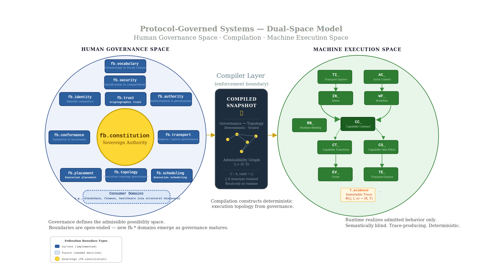
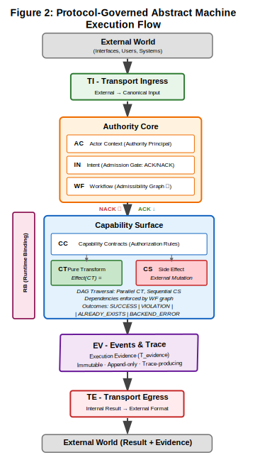

# Protocol-Governed Systems: A Constitutionally Constrained Architecture for Autonomous and AI-Generated Software

© 2026 Bhash Ganti. All rights reserved.

*Bhash Ganti (aka Bachi)*

Contact: bachipeachy@gmail.com

## Abstract

The rapid acceleration of AI-assisted software generation exposes a
fundamental limitation in conventional software architecture: behavior
is implicitly defined by implementation, while governance operates
reactively and at human speed. This mismatch creates a structural gap in
which systems can exhibit **unauthorized, non-deterministic, and
unauditable behavior.** Existing approaches --- static analysis, runtime
guardrails, policy engines --- attempt to constrain behavior after code
is produced, but cannot guarantee compliance when implementation evolves
faster than governance capacity.

This paper introduces **Protocol-Governed Systems (PGS)**, a
computational architecture in which behavior is defined explicitly
through governance artifacts and compiled into deterministic execution
graphs prior to runtime. PGS establishes a strict boundary between
intent and execution via a dedicated Compiler Subsystem that derives
orchestration structure from protocol declarations, while computation
remains implemented in conventional programming languages. Execution is
constrained by a constitutionally defined model that separates pure
computation from governed mutation and requires all externally
observable effects to be explicitly enumerated and authorized.

Within this model, code possesses no inherent authority; all privileges
originate from protocol declarations and are enforced during execution.
As a result, execution paths that violate declared protocol constraints
cannot be constructed within the system, yielding **constitutionally
admissible execution by construction**. This structural property
replaces ambient authority with a zero-authority baseline and enables
deterministic trace generation, replayable execution semantics, and
complete auditability of externally observable behavior.

This paper builds on the conceptual model defined in \[[Ganti,
2026b](https://doi.org/10.5281/zenodo.20300611)\], which establishes PGS
as a constitutional execution substrate, defines the protocol snapshot
as the immutable admissibility boundary, formalizes compositional
admissibility across four architectural layers, and states the
constitutional invariants governing execution behavior. The present
paper extends that foundation with a complementary operational
perspective --- the Dual-Space Model --- formalizes the execution
semantics, demonstrates that entire classes of security vulnerabilities
are structurally unrepresentable, and validates the architecture's
linear governance scalability through theoretical analysis and empirical
evidence from the OmniBachi reference implementation.

PGS demonstrates that governance complexity scales linearly with system
growth by replacing O(N × M) pairwise implementation dependencies ---
where N denotes the number of distinct capabilities and M denotes the
number of workflows composing those capabilities --- with
protocol-mediated capability interfaces, reducing lifecycle complexity
to O(N + M). We also show that these constraints preserve computational
expressiveness through underlying CT (Capability Transform) and CS
(Capability Side Effect) implementations while maintaining bounded
orchestration topology, ensuring that governance rigor does not limit
the computational power available within governed capability boundaries.

Protocol-Governed Systems redefine software construction as a
compiler-mediated process in which behavior is specified prior to
implementation and execution is **constructed by the compiler from
governance artifacts rather than authored directly**. The architecture
enables the generation of complete execution graphs at compile time ---
without requiring the execution of underlying implementations --- while
simultaneously validating conformance to constitutional constraints.
This establishes a form of structurally governed execution in which
behavioral admissibility is determined prior to runtime. The paradigm
provides a foundation for building high-velocity, governable systems in
environments where implementation is increasingly autonomous and
ephemeral.

## 1. Introduction {#introduction-1}

### 1.1 The Governance Crisis in High-Velocity Software

Software systems are entering a regime in which the velocity of
implementation is no longer bounded by human effort. Modern development
workflows increasingly rely on automated code generation, synthesis
tools, and large language models capable of producing substantial
portions of production code. As a result, implementation artifacts can
be created, modified, and replaced at a rate that exceeds the capacity
of human-driven validation and governance.

This creates what we term the **generation-governance impedance
mismatch**. Let V_g denote the velocity of implementation generation and
V_gov denote the velocity at which governance mechanisms can validate
and constrain behavioral change. In conventional systems, governance
assumes V_g ≤ V_gov. In AI-accelerated environments, this assumption no
longer holds: V_g \>\> V_gov.

This inequality produces three systemic failure modes:

1.  **Behavioral Drift**: Implementation evolves independently of
    governance constraints, introducing unauthorized behavior. Because
    behavior is defined by code, drift is often undetectable until
    runtime.

2.  **Audit Infeasibility**: When execution depends on non-deterministic
    code paths and implicit state interactions, reproducing system
    behavior becomes infeasible. This limitation is compounded when the
    implementation responsible for a behavior may no longer exist when
    analysis is required.

3.  **Ambient Authority**: Implementation inherits authority from its
    execution environment rather than from explicit declarations,
    enabling privilege escalation through code structure rather than
    through governed capability.

**Definition (Behavior)**: For the purposes of this paper, *behavior* is
defined as the set of externally observable effects produced by a
system, together with the causal execution trace that leads to those
effects, independent of the semantic implementation details of the
underlying code.

### 1.2 Why Reactive Governance Approaches Fail

Existing governance mechanisms attempt to constrain behavior after
implementation exists:

**Static Analysis** attempts to detect violations by inspecting code
structure, but cannot guarantee conformance to intended behavior when
implementations are generated or mutated dynamically. It answers "what
might go wrong?" rather than "what is permitted?"

**Runtime Guardrails** intercept execution to enforce policy constraints
but operate as post-hoc filters on unconstrained execution. They
introduce performance overhead and cannot eliminate unanticipated
behavior paths.

**Policy Engines** externalize rules but remain coupled to
implementation semantics. They depend on correct instrumentation of code
and assume that behavior can be reliably observed and constrained at
runtime.

**Formal Verification** can prove properties of specific implementations
but does not scale when implementations are continuously generated or
replaced.

These approaches share a common limitation: **they attempt to constrain
unconstrained artifacts**. As long as implementation remains the source
of behavior, governance remains reactive, incomplete, and fundamentally
non-scalable.

### 1.3 The Case for Protocol-Governed Execution

Resolving the generation-governance impedance mismatch requires a
structural inversion: **behavior must be defined independently of
implementation and enforced prior to execution**.

This implies three necessary properties:

1.  **Behavioral Preemption**: All permissible behavior must be declared
    before execution. Implementations must operate within a pre-defined
    behavioral space rather than defining it dynamically.

2.  **Enumerated Authority**: All externally observable effects must be
    explicitly declared and bounded. No execution context may grant
    implicit or ambient authority.

3.  **Deterministic Enforcement**: Execution must be constrained such
    that only behavior conforming to declared specifications can occur.
    Enforcement must not depend on runtime interpretation or post-hoc
    validation.

The critical architectural requirement is a mechanism that transforms
declared behavior into enforceable execution structure **before
runtime**. This role is fulfilled by the **Compiler Subsystem**, which
acts as an enforcement boundary between intent and execution by:

- Constructing execution graphs from protocol artifacts
- Validating structural correctness and dependency resolution
- Rejecting invalid or non-conformant behavior prior to execution

This transformation is performed **without requiring the execution of
underlying implementations**, ensuring that behavioral admissibility is
determined independently of code. As a result, **only behavior that can
be constructed from valid protocol declarations can be executed**.

Consider a constitutional rail network: governance defines the railway
law; the compiler lays the track; the runtime is the train. Railway law
may declare, for example, that hazardous cargo cannot enter civilian
districts, international freight must pass through customs junctions,
and military routes remain isolated from public transit lines. The
compiler materializes only rail topology that satisfies those
constraints. The runtime train does not need to understand its cargo or
destination semantics --- it only follows constructed rail. Unauthorized
destinations are unreachable not because guards block them dynamically,
but because no legal track leads there. This metaphor will recur as the
architecture is formalized below.

### 1.4 Research Question and Contributions

This paper addresses the following research question:

**How can software execution remain governable when implementation is
autonomous, ephemeral, or evolves faster than governance capacity?**

We argue that this requires a fundamental shift from code-centric
execution models to protocol-governed execution, where behavior is
defined, validated, and enforced independently of implementation.

We introduce **Protocol-Governed Systems (PGS)** as a computational
architecture that achieves this separation. The conceptual model ---
defining PGS as a constitutional execution substrate, the protocol
snapshot as an immutable admissibility boundary, compositional
admissibility across four architectural layers, and the constitutional
invariants --- is established in \[Ganti, 2026b\]. The present paper
extends that foundation with four contributions:

**1. The Dual-Space Operational Model**

We introduce a complementary perspective on the conceptual model's
four-layer architecture \[Ganti, 2026b, Section 1.2\] --- the Dual-Space
Model --- which separates the system into the Human Governance Space and
the Machine Execution Space. This perspective illuminates the
operational separation between governance authoring and deterministic
execution, providing an intuitive frame for understanding how the four
architectural layers map to distinct operational domains.

**2. Compile-Time Behavioral Enforcement**

We introduce the **Compiler Subsystem as a first-class architectural
primitive** that constructs deterministic execution graphs from protocol
artifacts, validates structural and dependency correctness, and
determines behavioral admissibility without executing implementation
code, rendering the execution model **semantic-agnostic** --- meaning
admissibility and topology enforcement do not depend on implementation
semantics. Implementation logic may still produce semantically incorrect
results within its authorized capability boundary. This enables
**structurally governed execution by construction**, where behavior
outside the admissibility boundary cannot be expressed in executable
form.

**3. Security Inversion Principle**

We formalize a security model in which code possesses no inherent
authority; all privileges originate from explicit protocol declarations;
and execution is constrained by enumerated capability boundaries. This
eliminates ambient authority and ensures that unauthorized execution
topology is structurally unconstructible within the admissibility graph.

**4. Linear Governance Scalability**

We demonstrate that governance complexity scales as O(N + M) where N is
the number of distinct capabilities and M is the number of workflows
composing those capabilities. This is achieved by replacing O(N × M)
pairwise implementation dependencies with protocol-mediated capability
interfaces, decoupling behavioral specification from implementation.

## 2. Background and Related Work {#background-and-related-work-1}

Protocol-Governed Systems draws upon multiple established traditions in
computer science. These traditions provide critical foundations but none
resolve the **generation-governance impedance mismatch** (V_g \>\>
V_gov). A common limitation is that they assume **implementation as the
primary carrier of behavior**, requiring governance mechanisms to
interpret, analyze, or constrain implementation artifacts. PGS
introduces a shift to **semantic-agnostic execution**, where governance
operates on explicitly declared protocol structures rather than inferred
implementation semantics.

### 2.1 Functional Programming and Effect Systems

Functional programming introduced **referential transparency**, ensuring
that functions produce consistent outputs for given inputs and avoid
side effects. Languages such as Haskell enforce purity through type
systems, separating pure computation from effectful operations. Effect
systems extend type systems to track computational effects such as I/O,
state mutation, and exceptions.

**Limitation**: Functional purity is primarily a **linguistic property**
dependent on source-level correctness and language semantics. In
AI-generated environments where implementations may be transient or
machine-authored, such guarantees are insufficient.

**PGS Shift**: PGS elevates purity from a language feature to an
**architectural invariant** \[Ganti, 2026b, invariant E2\]. Purity is
enforced structurally rather than syntactically, making the
implementation language irrelevant. Even impure code becomes
**operationally pure** within the execution environment. This
establishes implementation-independent purity enforcement, where
correctness does not depend on understanding or trusting implementation
semantics.

### 2.2 Capability-Based Security

Capability-based security replaces ambient authority with explicit,
unforgeable tokens that grant access to resources. This model ensures
that code can only act on resources for which it holds capabilities,
representing a major advancement over implicit authority models.

**Limitation**: Traditional capability systems are often
**object-centric** (capabilities passed dynamically at runtime),
dynamically distributed, and difficult to reason about globally at
scale. As systems grow, capability relationships form complex graphs,
reintroducing coupling and limiting scalability.

**PGS Shift**: PGS introduces **protocol-centric capabilities**:
Capabilities are declared in governance artifacts (Capability Contract
CC\_ and Capability Side Effects CS\_), authority is defined at
**compile time** (not distributed at runtime), and capability invocation
is structurally constrained by workflows. This enables global reasoning
over authority, the elimination of hidden capability propagation, and
direct support for **linear governance scalability** (O(N + M)).

### 2.3 Formal Specification and Verification

Formal methods, such as TLA+, separate specification from implementation
and enable reasoning about system correctness. These approaches provide
strong guarantees for design-time verification.

**Limitation**: Formal specifications are typically **non-executable
artifacts**, separate from runtime systems, and expensive to maintain
under continuous change. They describe behavior but do not enforce it
directly.

**PGS Shift**: PGS transforms specification into **executable
governance**. Protocol artifacts are compiled into execution structure;
the Compiler Layer enforces correctness **before runtime**; and behavior
is constructed under constraint rather than verified post-hoc. This
represents a shift from **implementation correctness** to **behavioral
admissibility**.

### 2.4 Positioning Statement

PGS does not replace prior paradigms --- it composes and extends them by
shifting the locus of correctness from implementation semantics to
protocol-defined admissibility, enforced through compile-time
construction rather than post-hoc inspection of code. By decoupling
**behavioral identity** from **implementation identity**, PGS ensures
that even as the code responsible for an action is regenerated or
replaced, the governance relationship remains persistent, enforceable,
and auditable. **Governance survives the temporal decay of
implementation.**

## 3. Protocol-Governed System Model

This section defines PGS not as a collection of components, but as a
**coherent computational model** in which behavior is explicitly
declared, structurally constructed, and deterministically enforced
independent of implementation.

PGS distinguishes semantic sovereignty from implementation
responsibility. Federation boundaries govern semantic authority,
publication scope, and constitutional ownership, while implementation
subsystems provide materialization, execution, and tooling
infrastructure. These axes are orthogonal and intentionally decoupled.

### 3.1 The Four-Layer Architecture

The foundational architectural model for PGS is the four-layer model
defined in \[Ganti, 2026b, Section 1.2\], which separates the system
into layers ordered by semantic dependency:

- **Layer 1 --- Constitutional Governance**: Invariants, axioms,
  federation boundary definitions. The fb.\* namespace governs the
  constitutional rules that apply to federation boundary definitions
  themselves. This is the source of all constitutional authority.

- **Layer 4 --- Governed Execution Protocols**: Domain protocol
  definitions --- the artifacts (WF\_, CC\_, CT\_, CS\_, IN\_, AC\_,
  TI\_, TE\_, EV\_) that declare admissible behavior within federation
  boundaries. Layer 4 is constrained by Layer 1.

- **Layer 2 --- Compiler / Snapshot**: Validates Layer 4 definitions
  against Layer 1 constitutional governance, resolves dependencies, and
  produces the protocol snapshot --- a verified, read-only artifact
  bundle that encodes all admissible execution topologies. The snapshot
  is the immutable admissibility boundary between governance and
  execution.

- **Layer 3 --- Runtime Execution**: Generic DAG traversal with zero
  domain knowledge. Reads the snapshot, enforces topology, produces
  traces. The runtime has no knowledge of protocol semantics --- it is
  purely structural.

- **Evidence Projection** (orthogonal): Derivative, append-only,
  attestational. Output of Layer 3 execution. Never input to any layer.
  Traces and admissibility attestations.

Layer numbering reflects semantic dependency order, not execution
chronology. Layer 1 constrains Layer 4, which is compiled by Layer 2,
producing the snapshot consumed by Layer 3.

**PGS-Protocol** specifically names Layers 1 and 2 together: the
constitutional governance layer and the artifact grammar / compilation
contract that it governs. It is the meta-level --- what makes a protocol
definition valid and what a runtime must do to be conformant \[Ganti,
2026b, Section 1.2\].

### 3.2 The Dual-Space Model: An Operational Perspective

The four-layer model describes architectural dependency --- which
concerns constrain which. The **Dual-Space Model** provides a
complementary perspective: it describes the **operational separation**
between the human-facing and machine-facing domains of a
Protocol-Governed System.

Traditional software architecture is effectively **flat**: governance,
authority, orchestration, control flow, and implementation are collapsed
into a single operational space where behavior emerges implicitly from
code. As systems evolve, this coupling causes behavioral drift,
unbounded execution reachability, hidden authority propagation, and
non-deterministic operational complexity.

Protocol-Governed Systems introduce a fundamentally different
architectural model by separating software into two distinct operational
spaces:

1.  **The Human Governance Space**
2.  **The Machine Execution Space**

This separation maps directly to the four-layer architecture:

  -----------------------------------------------------------------------
  Operational Space       Layers                  Activity
  ----------------------- ----------------------- -----------------------
  Human Governance Space  Layer 1 + Layer 4       Constitutional
                                                  governance and protocol
                                                  authoring

  Admissibility Boundary  Layer 2 output          Compiled, verified,
                          (snapshot)              read-only artifact
                                                  bundle

  Machine Execution Space Layer 3                 Deterministic traversal
                                                  of compiled topology

  Evidence Projection     Orthogonal              Append-only execution
                                                  witness
  -----------------------------------------------------------------------

*The Human Governance Space*

The Human Governance Space is the semantic and constitutional domain of
the system. It encompasses Layer 1 (constitutional governance ---
invariants, axioms, federation boundaries) and Layer 4 (governed
execution protocols --- domain-specific artifact definitions).

Within this space, humans author declarative behavioral specifications
as protocol artifacts rather than directly authoring executable control
flow. These declarations govern the admissible possibility space from
which deterministic execution topology may later be constructed through
compilation.

*In simpler terms: the Governance Space acts like constitutional law for
the system --- it determines what kinds of behavior may legally exist
before any execution begins.*

The Governance Space contains multiple orthogonal governance axes. These
governance axes are formalized through bounded federation governance
domains identified by fb.\* Federated Boundary codes. Like
constitutional ministries or sovereign governance domains, each fb.\*
boundary governs exactly one orthogonal aspect of admissibility ---
together constituting the full authority surface of the Governance
Space. Examples include:

- **FB_CONSTITUTION**: Root sovereign authority governing the
  constitutional legality of all federation boundaries through delegated
  governance.
- **FB_EXECUTION_TOPOLOGY**: Governs the execution-topology surface of
  Capability Contract artifacts and admissible execution reachability.
- **FB_EXECUTION_PLACEMENT**: Governs execution locality, substrate
  placement, and runtime deployment admissibility.
- **FB_EXECUTION_SCHEDULING**: Governs execution scheduling semantics
  including parallelism, synchronization, and deterministic joins.
- **FB_AUTHORITY**: Governs invocation authorization, execution
  permission semantics, and actor authority state.
- **FB_IDENTITY**: Governs actor identity semantics and the separation
  of identity from authority.
- **FB_VOCABULARY**: Governs protocol terminology, execution state
  vocabulary, and concern vocabulary closure across all PGS domains.
- **FB_TRANSPORT**: Governs transport ingress, transport egress,
  admission normalization, and projection semantics.
- **FB_CONFORMANCE**: Governs protocol validation, invariant
  enforcement, and conformance admissibility.
- **FB_SECURITY_DOMAIN**: Governs classification domains,
  compartmentalization, and secure information-flow legality.
- **FB_CRYPTOGRAPHIC_TRUST**: Governs snapshot signing, attestation,
  encryption, trust admissibility, and secure execution semantics.

Domain repositories (such as blockchain, ai_governance, finance, and
other future protocol-governed systems) are governance-capable. Each
domain repository may contain local constitutions, invariants, and
assertions governing domain-specific semantics. Domain-specific
governance law belongs in the domain repository; only universally
applicable governance law belongs in pgs_governance as a central
federation boundary. Domains connect to the governance model through the
structural discovery layer, not through a central federation boundary
created on their behalf.

Unlike the execution concerns of the Machine Execution Space,
federation-boundary codes govern semantic authority, ownership scope,
admissibility boundaries, trust domains, topology legality, execution
placement, security constraints, and other orthogonal governance
concerns that shape the admissible behavior space from which execution
may later be constructed.

The number of federation-boundary axes is intentionally open-ended.
Protocol-Governed Systems are designed for horizontal governance
expansion, allowing new orthogonal governance domains to emerge without
requiring redesign of the execution substrate. This enables future
architectural growth in areas such as distributed execution,
cryptographic trust, classified systems, placement governance,
silicon-hosted execution, and other governance concerns not yet known at
the time of system construction.

Unlike the execution concerns of the Machine Execution Space, federation
boundaries are not computational primitives. They are semantic
governance domains that define bounded authority, ownership, visibility,
and admissibility scope.

These axes operate independently while remaining constitutionally
coherent through shared governance law.

Execution cannot originate from this space directly. It must first pass
through compilation, where governance declarations are transformed into
deterministic execution structure.

*The Machine Execution Space*

The Machine Execution Space is the deterministic realization domain of
the system. It corresponds to Layer 3 of the four-layer architecture ---
it executes only behavior that has already been admitted by the
Governance Space and constructed by the compiler.

The execution substrate of PGS consists of nine canonical execution
concerns:

- **TI (Transport Ingress)**: External admission and normalization
- **AC (Actor Context)**: Authority principal binding
- **IN (Intent)**: Declarative operation request
- **WF (Workflow)**: Orchestration graph
- **CC (Capability Contracts)**: Admissible capability surfaces
- **CT (Capability Transforms)**: Pure computation
- **CS (Capability Side Effects)**: Governed mutation and external
  interaction
- **EV (Events)**: Trace, signaling, and reactive governance feedback
- **TE (Transport Egress)**: External projection and rendering

In addition, **RB (Runtime Binding)** operates as an orthogonal
resolution mechanism that maps capability identities to concrete
implementations without participating in behavioral authority. RB
participates in realization but not admissibility \[Ganti, 2026b,
Section 2.6\].

These concerns collectively form the computational substrate of the PGS
Abstract Machine. No additional execution concerns exist outside this
bounded vocabulary. The Machine Execution Space is intentionally closed
under vocabulary. Its computational substrate consists exclusively of
the nine canonical execution concerns, with RB operating as an
orthogonal runtime resolution mechanism. New execution behavior may
emerge through protocol composition, but not through the creation of new
runtime concern categories. This bounded vocabulary is a foundational
invariant of the PGS execution model. The Machine Execution Space is:

- deterministic
- semantically blind
- topology-constrained
- contract-driven
- bounded by compiled admissibility

The runtime does not infer behavior, construct new execution paths,
interpret implementation semantics, or negotiate authority dynamically.
Its role is limited to deterministic traversal of the compiled
admissibility graph.

*Orthogonality Between Spaces*

The two spaces are orthogonal.

The Human Governance Space defines: **what behavior may exist**.

The Machine Execution Space defines: **how admitted behavior is
realized**.

Neither space independently defines system behavior.

Behavior exists only when:

1.  Governance admits the behavior,
2.  Compilation constructs admissible execution topology,
3.  Runtime deterministically enforces traversal of that topology.

This separation produces a fundamental inversion of conventional
software architecture:

> Code is no longer the sovereign definition of behavior.

Instead:

- governance defines admissibility,
- compilation constructs execution structure,
- runtime realizes admitted behavior.

The compiler therefore becomes the primary enforcement boundary of the
system. The compiler determines behavioral reachability by constructing
the admissibility graph G. If governance does not admit a path, the
compiler cannot construct it; if the compiler does not construct it,
runtime execution cannot traverse it.

This establishes a critical security property:

> Unauthorized behavior is structurally not constructible within the
> admissibility graph G.

In the constitutional rail network: no track leads to unauthorized
destinations --- a path the compiler did not construct is a path the
runtime cannot traverse.

The figure below captures the central idea.

{width="7.0in" height="4.0in"}

*Dataflow-Oriented Execution*

Although the Governance Space is semantic and the Execution Space is
mechanical, the resulting execution model is neither procedural nor
pipeline-oriented. PGS execution is fundamentally a form of
deterministic governed dataflow execution.

Execution progresses through:

- dependency satisfaction,
- topology traversal,
- capability activation,
- governed message flow,
- deterministic state transitions.

Independent execution branches may execute concurrently when admissible
under governance constraints, while deterministic joins preserve
behavioral reproducibility.

This model naturally supports:

- single-node execution,
- federated distributed multi-node execution,
- parallel execution substrates,
- cryptographically secured execution environments,
- silicon-hosted runtimes,

without changing protocol semantics.

*Architectural Consequence*

The separation between Human Governance Space and Machine Execution
Space, understood as the operational realization of the four-layer
architectural model, produces the defining property of Protocol-Governed
Systems:

> Behavior is not authored directly. Behavior is constructed under
> governance.

This transforms software architecture from an implementation-centric
discipline into a governance-constructed execution system in which:

- authority is explicit,
- behavior is enumerable,
- execution is bounded,
- traces are deterministic,
- governance survives implementation change,
- and admissibility precedes execution.

### 3.3 Formal Definition of the Protocol-Governed System

The four-layer architecture \[Ganti, 2026b\] and the Dual-Space
operational perspective (Section 3.2) define the structural and
operational organization of PGS. Within that architecture, the system's
functional responsibilities can be formally decomposed as a tuple:

**P** = (A, G, C, E, S)

where:

- **A (Authoring)**: Defines the set of protocol artifacts ---
  declarations of behavior, structure, and capability. This corresponds
  to the activity within Layer 4 of the four-layer model: the creation
  of governed execution protocol definitions (WF\_, CC\_, CT\_, CS\_,
  IN\_, AC\_, TI\_, TE\_, EV\_).

- **G (Governance)**: Defines a set of validation functions and
  constitutional invariants I_const that determine admissibility of
  artifacts. An artifact is admitted **if and only if** it satisfies all
  invariants. This corresponds to Layer 1 of the four-layer model:
  constitutional governance, including federation boundary definitions
  and the invariants enumerated in \[Ganti, 2026b, Section 4\].

- **C (Compiler)**: A transformation function C: A_valid → G mapping
  ratified protocol declarations into a **deterministic execution
  graph** G that encodes all admissible execution paths. This
  corresponds to Layer 2 of the four-layer model.

- **E (Execution)**: A deterministic runtime that enforces traversal of
  G, mediating all interaction between orchestration and implementation.
  This corresponds to Layer 3 of the four-layer model.

- **S (Structure)**: A canonical identity and resolution service that
  provides a unique mapping between logical identifiers and their
  physical representations. Structure is a cross-cutting concern within
  the four-layer model --- it participates in compilation (Layer 2)
  through FQDN-based artifact resolution and in runtime (Layer 3)
  through canonical identity enforcement. It does not correspond to a
  single layer but is architecturally necessary for deterministic
  resolution.

The formal tuple refines the four-layer model by decomposing it into
named functional responsibilities. It is not an alternative architecture
but a formalization tool for reasoning about properties. The four-layer
model remains the canonical architectural reference.

The formal model is intentionally closed and stable. PGS defines a
bounded set of functional responsibilities required to construct and
execute protocol-governed behavior. This differs fundamentally from
federation-boundary governance, which is intentionally open-ended and
extensible. Federation boundaries may grow horizontally as new
governance concerns emerge, while the functional responsibilities (A, G,
C, E, S) remain fixed as the canonical decomposition of the protocol
construction and execution lifecycle.

**Execution Function**:\
Execution in PGS is a **formal function of the compiled protocol
state**:\
Φ(G, I, σ) → (R, T_evidence)\
where G is the execution graph, I is the input payload, σ is the Actor
Context (authority principal), R is the computed result, and T_evidence
is an immutable, deterministic execution trace.

**Evidence-Backed Result**:\
The output (R, T_evidence) is an **evidence-backed result**, where R
represents the outcome and T_evidence is a verifiable record proving
that R was produced through a constitutionally admissible execution
path.

**Admissibility-by-Construction Property**:\
The compiler C is a partial function:\
C : A → G\
where:\
- A represents the authored behavioral space\
- G represents the admissible execution topology space\
- I_const represents the constitutional invariant set

The compiler constructs an admissible execution topology only when
authored behavior satisfies all constitutional invariants.\
Formally:\
∀a ∈ A :\
(∀i ∈ I_const : i(a) = true) ⇒ C(a) = g ∈ G

Otherwise:\
C(a) is undefined\
Meaning:\
- inadmissible behavior cannot be compiled into executable topology\
- unauthorized execution structure is structurally not constructible\
- runtime traversal is restricted to compiler-admitted topology only

The compiler serves as the sole constructor of admissible behavioral
reachability; runtime execution cannot introduce new paths.

The formal model P is **semantic-agnostic**. The Execution Layer E does
not interpret or reason about implementation logic, does not rely on
language semantics, and enforces only the structure defined by G.
**Correctness of behavior does not depend on understanding the
implementation.**

Semantic-agnostic execution refers to independence from implementation
semantics for behavioral admissibility. It does not imply correctness of
implementation logic itself; it ensures that only structurally
authorized behavior can execute.

The execution substrate of PGS is intentionally vocabulary-bounded. All
admissible runtime behavior must be expressible through the canonical
execution concerns defined by the Machine Execution Space. New
behavioral composition may emerge through protocol construction, but new
categories of execution concern cannot emerge dynamically at runtime.
This establishes closure of the computational substrate while preserving
extensibility through governance composition.

### 3.4 Evidence-Backed Execution

The execution trace --- not the implementation --- is the authoritative
representation of system behavior. An execution trace T_evidence is a
complete, ordered record of all operations and authority context. It
represents a **causal total order** of system events, providing a
**logical clock** that establishes the exact sequence of authority
delegation, capability invocation, and side-effect interaction.

**Trace Completeness Property: All externally observable behavior must
be representable within the trace.** This ensures that there are no
hidden side-channels of authority and no externally visible action can
occur outside the trace. **If an action does not appear in the trace, it
is architecturally prohibited from occurring.**

**Behavioral Identity**: Decoupling behavior from implementation
establishes **referential persistence of governance**, ensuring that
governance survives the temporal decay of implementation. **Trace as
Ground Truth** enables deterministic replay and auditability by
construction. Audit is performed directly on T_evidence, transforming
execution from a black-box process into a **provable sequence of
admissible operations**. The trace reflects executed structure and
outcomes, not internal implementation reasoning.

*Construction-Time and Execution-Time Evidence*

Evidence generation in Protocol-Governed Systems occurs across two
orthogonal phases of system realization.

During compilation, the Compiler (Layer 2) produces construction-time
admissibility evidence describing artifact validation, dependency
resolution, admissibility determination, topology construction, and
constitutional conformance. This evidence establishes how the
admissibility graph G was constructed and why specific execution paths
are reachable or rejected.

During runtime, the Execution Layer (Layer 3) produces execution-time
evidence through the immutable execution trace T_evidence, recording the
exact traversal path, authority context, capability activations,
side-effects, and outcomes associated with a specific execution
instance.

Together, these two evidence surfaces provide both:

- admissibility provenance --- why behavior was permitted to exist, and
- execution provenance --- how a particular behavior instance was
  realized.

This establishes end-to-end behavioral accountability spanning both
protocol construction and execution realization.

### 3.5 Security Inversion and Compiler Enforcement

**Unauthorized behavior is structurally unrepresentable within the
admissibility graph G.** This is not a runtime guarantee --- it is a
**construction-time property** of the system.

Conventional systems attempt to **detect or prevent unauthorized
behavior** through static analysis, runtime guards, or monitoring. These
approaches operate on a shared assumption: **all behavior is possible;
security must constrain it**. Protocol-Governed Systems reject this
assumption. **Only behavior that can be constructed from protocol
artifacts is executable.** All other behavior is not prevented --- it is
**never constructed**.

The compiler C acts as a **pruning function** over the set of all
conceivable behaviors. The compiler defines a restricted subset
B_admissible ⊂ B such that B_admissible = {b \| b ∈ G}. **Reachability
is treated as a governance-derived permission.** In Protocol-Governed
Systems, executable reachability itself becomes a governed authority
surface. The Compiler Layer acts as an **Automated Reachability
Broker**: in conventional systems, any technically reachable path may
execute; in PGS, reachability is explicitly constructed and therefore
governed. **If a path is not present in G, it is unreachable by
definition --- regardless of implementation attempts.**

**Security Inversion Principle**: **Security is achieved by restricting
the space of constructible behaviors, not by constraining execution of
arbitrary behavior.**

Let V be the constitutionally defined set of execution concerns and
capability primitives. Then:

> **Executable Behavior ⊆ Expressible in V.**

**Vocabulary Closure Invariant: No behavior may occur outside the
declared concern vocabulary.** All behavior must originate from protocol
artifacts, conform to schema and concern structure, and be routable
through known execution concerns. Behavior not expressible within the
bounded concern vocabulary V cannot satisfy governance admissibility,
cannot be constructed into G, and therefore cannot execute.

**Absence of Ambient Authority**: Code does not inherit authority from
execution context. Authority derives only from (AC\_, IN\_, WF\_, CC\_)
declarations \[Ganti, 2026b, invariant S3\]. An operation has exactly
the authority declared in its artifacts --- no more. Without ambient
authority, confused deputy attacks are structurally eliminated, not
merely defended against.

**Bounded Mutation Surface**: All state changes must occur through
enumerated side-effect capabilities. The mutation surface is M = {cs \|
cs ∈ CS\_}. There is no implicit write path. Attack surface equals
\|CS\_\| + \|AC\_\| + \|RB\_\| --- mutation primitives, authority
artifacts, and binding declarations. No other vector is structurally
admissible.

Because the admissible mutation surface is finite, enumerable, and
structurally isolated, security analysis shifts from heuristic
exploration of emergent behavior toward bounded verification of declared
authority surfaces.

Protocol-Governed Systems constrain behavioral admissibility and
authority reachability, but do not by themselves guarantee semantic
correctness of implementation logic. Correctness of execution behavior
and authorization of execution behavior are orthogonal concerns within
the model.

## 4. Execution Semantics: The Protocol-Governed Abstract Machine

The Machine Execution Space is realized by the Protocol-Governed
Abstract Machine. The execution model operates as a **Directed Acyclic
Graph (DAG) traversal machine** where each node represents a capability
invocation and each edge represents a data or control dependency.

**Node Types**:

- **Transform Nodes (CT\_)**: Pure computation nodes with no side
  effects. Multiple transforms may execute in parallel if no data
  dependency exists.
- **Side-Effect Nodes (CS\_)**: Interact with external systems
  (databases, APIs, file systems). Execution order is determined by
  declared dependencies in the workflow.
- **Control Nodes (Decision, Merge)**: Route execution based on outcomes
  (SUCCESS, VIOLATION, ALREADY_EXISTS, BACKEND_ERROR).

**Execution Constraints**:

1.  **No out-of-order execution**: Nodes execute only when all
    dependencies are satisfied.
2.  **Deterministic routing**: Control flow is determined by declared
    workflow structure, not runtime logic.
3.  **Trace completeness**: Every node execution emits a trace event
    with artifact identity, inputs, outputs, and outcome.
4.  **Hermetic boundary**: Execution occurs within a closed environment;
    all external interaction is mediated by CS\_ nodes.

**Admission Gate**: Before any DAG traversal begins, the IN\_ admission
gate evaluates the execution request against declared authority and
admission conditions \[Ganti, 2026b, Section 3.4\]. The gate produces
exactly one of two outcomes:

- **ACK**: Execution request accepted; DAG traversal proceeds.
- **NACK**: Execution request rejected at admission gate; no traversal
  occurs.

This is the mechanism by which the runtime contracts the governance
surface to a specific execution surface --- it selects from what the
snapshot already permits, never expanding what is admissible \[Ganti,
2026b, Section 2.3\].

**Execution Outcomes**: During DAG traversal, each capability step
produces a declared outcome:

- **SUCCESS**: Admitted execution completed; capability produced
  expected result.
- **VIOLATION**: Admitted execution encountered a governed constraint
  violation during capability execution.
- **ALREADY_EXISTS**: Admitted execution detected an idempotency
  condition; no duplicate state produced.
- **BACKEND_ERROR**: Infrastructure or storage failure during capability
  execution; environmental, not constitutional.

The outcome vocabulary is organized into two categories: **Admission
outcomes** (ACK, NACK) are produced by the IN\_ gate before DAG
traversal and are admissibility decisions. **Execution outcomes**
(SUCCESS, VIOLATION, ALREADY_EXISTS, BACKEND_ERROR) are produced during
DAG traversal by capability contracts and describe what happened during
permitted execution \[Ganti, 2026b, Section 5.2\].

Each CC\_ declares its allowed outcome surface --- the set of outcomes
it may produce. The runtime routes on these outcomes; it does not
interpret them. Outcome semantics are protocol-defined; outcome routing
is snapshot-defined.

**Termination**: Execution guarantees deterministic termination for
well-formed graphs when all reachable terminal nodes have executed or
when a governance event (EV\_) signals halt. The execution engine
guarantees eventual termination for well-formed workflows (acyclic
graphs with bounded loops).

The abstract machine ensures that **execution is a deterministic
function of protocol + input + actor context**, making behavior fully
reproducible and auditable independent of implementation details.

{width="4.0in" height="7.2in"}

## 5. Security Model and Threat Analysis {#security-model-and-threat-analysis-1}

This section demonstrates that entire classes of vulnerabilities are
**architecturally unrepresentable** in Protocol-Governed Systems. The
proof follows from the structural properties established in Section 3
and the constitutional invariants defined in \[Ganti, 2026b, Section
4\].

### 5.1 Threat Model

We assume an adversary capable of:

- Supplying arbitrary external input
- Compromising execution implementations (CT\_, CS\_, RB\_)
- Observing runtime state
- Attempting privilege escalation or behavioral injection

We do not assume compromise of governance artifacts or constitutional
validation.

### 5.2 Elimination of Attack Classes

**Remote Code Execution (RCE)**

*Definition*: Execution of attacker-controlled logic not present in the
system.

*Claim*: Execution of behavior not present in the admissibility graph is
structurally impossible.

*Justification*: All execution paths originate from WF\_ artifacts. No
runtime code generation or dynamic evaluation occurs. Executed(b) ⇒ b ∈
V (bounded vocabulary). Input is treated as data, never as logic.
**Result**: RCE ∉ G.

*Invariant basis*: S1 --- Protocol Sovereignty; E4 --- No Topology
Synthesis; S2 --- Compile-Time Resolution \[Ganti, 2026b, Section
4.1--4.2\].

**Privilege Escalation**

*Definition*: Gaining authority beyond intended permissions.

*Claim*: Privilege escalation is structurally unrepresentable within the
admissibility graph.

*Justification*: Authority derives only from (AC\_, IN\_, WF\_, CC\_)
declarations. No ambient authority exists. Unauthorized paths are absent
from G. **Result**: Authority ⊆ Declared(G).

*Invariant basis*: S3 --- No Ambient Authority \[Ganti, 2026b, Section
4.1\].

**Injection Attacks (SQL Injection, Command Injection, XSS)**

*Definition*: Transforming input into executable logic.

*Claim*: Injection attacks are structurally unrepresentable within the
admissibility graph.

*Justification*: Strict separation between data and execution. All
operations must be declared in WF. Execution graph is fixed at compile
time. No amount of crafted input can introduce new operations.
**Result**: Input ↛ Instruction.

*Invariant basis*: E4 --- No Topology Synthesis; S2 --- Compile-Time
Resolution \[Ganti, 2026b, Section 4.1--4.2\].

**Data Leakage**

*Definition*: Unauthorized exposure of internal state.

*Claim*: Unauthorized protocol-level data exposure paths are
structurally eliminated.

*Justification*: All outputs pass through TE (Transport Egress).
Internal state is not directly accessible. Trace completeness ensures
full observability. **Result**: Output = TE(σ).

*Invariant basis*: V1 --- Trace Immutability; V2 --- Trace Completeness
\[Ganti, 2026b, Section 4.3\].

**Execution Compromise**

*Definition*: Malicious or faulty implementation behavior.

*Claim*: Execution compromise cannot expand behavioral reachability
beyond the admissibility graph.

*Justification*: Security derives from protocol artifacts, not
implementation. The machine controls execution transitions n → n'.
Runtime binding (RB) is authority-neutral. RB resolves implementation
references but cannot expand behavioral reachability beyond what is
constructed in the admissibility graph. An implementation is
architecturally sandwiched between its input schema and its output
contract. It possesses neither the authority to reach outside its
capability surface nor the ability to traverse unauthorized paths in G.
**Result**: Compromise ⇒ Degradation, not escalation.

*Invariant basis*: S1 --- Protocol Sovereignty; S6 --- Runtime
Non-Expansion \[Ganti, 2026b, Section 4.1\].

### 5.3 Attack Surface Quantification

In conventional systems, attack surface grows with codebase size,
dynamic features, hidden dependencies, and interaction complexity. In
Protocol-Governed Systems, Architecturally admissible attack surface
equals:

> \|Attack Surface\| = \|CS\_\| + \|AC\_\| + \|RB\_\|

That is: mutation primitives (what can change state), authority
artifacts (what authority exists), and binding declarations (what
implementations are used). **No other vector is structurally
admissible.** Attack surface is finite and enumerable.

An auditor need not analyze entire codebases, but only the enumerated
side-effects (CS) and binding integrity (RB). This represents a drastic
reduction in vulnerability search space.

### 5.4 Trace-Based Accountability

Every state mutation and computation step is attributable to a versioned
artifact and actor:

> ∀step ∈ Execution: Attributable(step, artifact, actor)

Attribution is structural, not reconstructed. Every trace event records
which artifact authorized the operation, which actor initiated the
workflow, which capability was invoked, and what inputs and outputs
occurred. Security is **evidence-first**:

  -----------------------------------------
  Traditional       Protocol-Governed
  Approach          Approach
  ----------------- -----------------------
  Detect anomalies  Prove authorization

  Investigate       Replay execution
  incidents         

  Reconstruct       Read trace evidence
  events            

  Trust log         Verify trace against
  integrity         artifacts
  -----------------------------------------

Traces provide forensic advantages: replay capability, semantic
integrity verification, tamper detection via hash chains, and
attribution certainty. Post-incident analysis shifts from "what might
have happened" to "what exactly happened."

## 6. Evaluation: Linear Scalability and the Governance Dividend

This section validates the scalability claims through theoretical
analysis and empirical evidence from the OmniBachi reference
implementation. The following claims are not empirical --- they are
structural consequences of the model defined in Sections 3 and 4.

### 6.1 The Complexity Problem in Conventional Systems

Software complexity scaling is the binding constraint. While throughput
scaling is largely solved through horizontal scaling, caching, and
distributed systems, **complexity scaling** remains unsolved. The
question is: how do systems accommodate more features, more
integrations, more edge cases, more configurations?

Conventional systems exhibit structural patterns that amplify
complexity:

- **Interwoven logic**: Business logic and execution code are
  inseparable
- **Implicit state mutation**: State changes occur without explicit
  declaration
- **Non-deterministic drift**: Behavior changes through accumulated
  modifications
- **Hidden control flow**: Execution paths are not fully enumerable

As conventional systems grow, complexity exhibits non-linear growth. If
N components can each potentially affect each other, interaction space
is O(N²). Testing surface explodes as O(2\^N) with N conditionals.
Technical debt accumulates, and implicit semantic drift occurs ---
behavior changes without corresponding specification changes.

### 6.2 Structural Claim: Linear vs. Quadratic Governance Interaction Complexity

Protocol-Governed Systems exhibit:

> Governance Interaction Complexity_PGS = O(N + M) vs. Governance
> Interaction Complexity_Traditional ≈ O(N × M)

where N is the number of distinct capabilities and M is the number of
workflows composing those capabilities.

**Traditional Complexity Growth**: In conventional systems, each of N
capabilities may need to integrate with each of M workflows through
pairwise implementation dependencies --- data flow, invocation patterns,
error propagation, shared state. The interaction surface is O(N × M)
because each capability-workflow pair requires its own integration code.

**Protocol-Governed Complexity Growth**: In PGS, capabilities declare
their interfaces through CC\_ contracts. Workflows compose capabilities
through declared topology. Integration is not implemented in code --- it
is declared in protocol artifacts: orchestration order is declared in
WF\_ workflow DAG; data flow between capabilities is declared in CC\_
machine block bindings; error routing is declared in WF\_ outcome edges;
cross-capability dependencies are structural, resolved at build time.
**The integration graph still exists --- but it is a governance
artifact, not code.**

**Scaling Differential**:

  ---------------------------------------------------
  System Size    Traditional O(N  PGS O(N +   Ratio
                 × M)             M)          
  -------------- ---------------- ----------- -------
  N=10, M=10     100              20          5×

  N=50, M=50     2,500            100         25×

  N=100, M=100   10,000           200         50×

  N=1000, M=1000 1,000,000        2,000       500×
  ---------------------------------------------------

The differential increases with scale. Large protocol-governed systems
are orders of magnitude less complex than equivalent conventional
systems.

The scaling differential arises from how coupling manifests.
**Conventional systems**: Coupling is emergent --- components interact
through implicit pathways that grow combinatorially. **Protocol-governed
systems**: Coupling is explicit --- components interact only through
declared contracts. New components add their declared interactions, not
combinatorial possibilities. Explicit coupling grows additively;
emergent coupling grows multiplicatively.

### 6.3 Implementation Cost Topology

Define the total implementation cost of a traditional domain with N
capabilities and M workflows:

> C_trad(N,M) = C_logic(N) + C_integration(N,M) + C_state(N) +
> C_orchestration(M) + C_security(N,M)

The dominant cost term is integration: C_trad(N,M) ≈ C_integration(N,M)
= O(N × M). This is the structural root of why traditional systems
become expensive at scale: **integration cost, not business complexity,
drives the budget.**

PGS partitions the same system into constitutionally isolated federation
boundaries and implementation subsystems:

> C_pgs(N,M) = C_protocol + C_executor + C_cs + C_ct(N)

  -----------------------------------------------------------------------
  Component               Nature                  Growth
  ----------------------- ----------------------- -----------------------
  Protocol artifacts      Declarative --- no      O(N + M) in artifact
                          imperative code         count, O(0) in SLOC

  Execution engine        Domain-blind, fixed     O(1) --- constant
                                                  across all domains

  Capability side effects Backend-aligned         O(b) where b = backend
                          adapters                types (finite, small)

  Capability transforms   Domain-function         C_reusable + C_novel(N)
                          mechanics               
  -----------------------------------------------------------------------

**Critical insight**: Integration is not reduced --- it is **eliminated
as imperative code** and **relocated to declarative protocol**. In PGS,
orchestration order is declared in WF\_ workflow DAG; data flow between
capabilities is declared in CC\_ machine block bindings; error routing
is declared in WF\_ outcome edges; cross-capability dependencies are
structural, resolved at build time. **The integration graph still exists
--- but it is a governance artifact, not code.** C_integration_pgs = 0
(in imperative SLOC).

Since C_executor, C_cs, and C_reusable are fixed or amortized:

> C_pgs(N,M) ≈ K + C_novel(N)

where K is the fixed platform cost.

As the reusable capability substrate matures:

> lim(domains→∞) C_novel(d) → 0

**The marginal implementation cost of new domains approaches the cost of
authoring governance artifacts alone.**

### 6.4 Empirical Evidence: OmniBachi

The OmniBachi reference implementation validates these properties
through concrete measurements:

**Structural Change Locality**: A system-wide identity model update
required 5 localized changes, 1 STRUCTURE artifact, and 0
execution-layer modifications. This demonstrates bounded change
propagation even for cross-cutting concerns.

**Domain Cost**: A greenfield domain (AI Agent Governance) required zero
execution engine changes, zero novel capability transforms (full reuse
of existing CT\_ capabilities), and only protocol artifacts (WF\_, CC\_,
IN\_). Implementation consisted entirely of declarative authoring,
validating the claim that C_novel(d) → 0 as the reusable capabilities
matures.

**Determinism**: Identical inputs produce identical traces. Traces fully
reconstruct behavior. This validates the evidence-backed execution
model.

**Attack Surface Reduction**: \|Surface\| = \|CS\_\| + \|AC\_\| +
\|RB\_\|. For OmniBachi, \|CS\_\| = 6, \|AC\_\| = 7, \|RB\_\| = 7,
yielding a total attack surface of 20 artifacts across the entire
platform --- orders of magnitude smaller than conventional architectures
of comparable functionality.

### 6.5 The Governance Dividend

The **Governance Dividend** is the long-term reduction in behavioral
ambiguity, mutation surface sprawl, change propagation cost, testing
uncertainty, and conformance ambiguity achieved through constitutional
constraint.

Conventional systems accumulate technical debt: quick fixes create areas
requiring more quick fixes, creating debt accumulation spirals. Commonly
reported estimates suggest technical debt eventually consumes 40-60% of
development capacity in large conventional systems.

Protocol governance **inverts the debt accumulation curve** by enforcing
version immutability (changes create versions, not overwrites), explicit
amendment (all changes are declared and governed), referential integrity
(references resolve; no dangling dependencies), and trace-based
validation (behavior is verifiable against specification).

This shifts cost distribution:

> Conventional: Low G_0, High growing ΔC Protocol-Governed: Higher G_0,
> Lower stable ΔC

where G_0 = initial governance/design cost and ΔC = per-change cost.

**Conventional trajectory**: Low initial investment, debt accumulates,
per-change cost grows, eventually change becomes prohibitively
expensive.

**Protocol-governed trajectory**: Higher initial investment, debt does
not accumulate (explicit versioning), per-change cost remains stable,
change remains tractable indefinitely.

The crossover point depends on system lifespan and change frequency. For
non-trivial systems with multi-year lifespans, crossover typically
occurs within the first major evolution cycle.

### 6.6 Scaling Law

Total Cost = K + C(d) with ΔC(d) ↓ over time. As systems grow, marginal
cost decreases and complexity remains bounded. PGS scalability is a
structural consequence of its design.

## 7. Conclusion {#conclusion-1}

The rapid acceleration of AI-assisted software generation exposes a
fundamental architectural limitation: behavior is implicitly defined by
implementation, while governance operates reactively and cannot match
generation velocity. This **generation-governance impedance mismatch**
(V_g \>\> V_gov) cannot be resolved through process scaling alone.

Protocol-Governed Systems resolve this mismatch structurally by:

1.  **Separating behavioral authority from implementation mechanics**:
    Behavior is defined in versioned protocol artifacts, not derived
    from code.

2.  **Enforcing governance at compile time**: The Compiler Layer
    constructs deterministic execution graphs from protocol
    declarations, determining behavioral admissibility without executing
    implementation code.

3.  **Eliminating ambient authority**: Code possesses no inherent
    authority; all privileges originate from explicit protocol
    declarations.

4.  **Providing trace-based evidence**: Every execution produces an
    immutable, deterministic trace that proves conformance to protocol
    law.

5.  **Scaling governance linearly**: Complexity grows as O(N + M) rather
    than O(N × M) through protocol-mediated capability interfaces.

The architecture achieves **closure under AI authorship conditions**:
behavioral authority is preserved under arbitrary implementation
generation velocity. No new architectural primitives are required. The
separation of behavioral authority from implementation mechanics ---
established throughout this work and grounded in the conceptual model
\[Ganti, 2026b\] --- is sufficient to govern AI-generated systems.

As AI-generated code becomes the majority of production software, the
question that defines software governance shifts from "Did a human
review this code?" to "Is this behavior authorized by institutional law,
and can you prove it?" Protocol-Governed Systems provide both the
authorization mechanism and the proof.

In PGS, protocol defines admissible behavior while implementation
fulfills admissible capability contracts. This distinction is
foundational: protocol governs what may exist; implementation provides
how it is realized.

**PGS transforms software engineering from a discipline of reactive
mitigation into a science of proactive construction.** Behavior is no
longer an emergent property of code --- it is a constructed property of
protocol.

PGS establishes behavioral admissibility as a compile-time property,
transforming execution from an act of interpretation into an act of
construction --- the track laid by governance, traversed
deterministically by the runtime.

## Appendix A: Reference Implementation (OmniBachi)

### A.1. Purpose

The OmniBachi reference implementation validates the feasibility of the
PGS model, serving as a **proof-of-structure** demonstrating that
theoretical constructs can be realized without compromise. The
implementation further validates that behavioral admissibility can be
constructed independently of implementation semantics while preserving
deterministic execution, bounded authority, implementation-independent
runtime behavior, and governance scalability.

### A.2. Repositories

It is organized as an eight-repository ecosystem, each with a distinct
architectural role:

  ------------------------------------------------------------------------
  Repository          Role
  ------------------- ----------------------------------------------------
  pgs_workspace       Public operational entry point containing compiled
                      protocol snapshot, execution tooling, traces, and
                      demonstration workflows

  pgs_runtime         Deterministic semantic-agnostic execution engine
                      (omnibachi) responsible for admissibility graph
                      traversal

  pgs_governance      Constitutional governance source-of-truth: federated
                      boundaries, structural artifact definitions,
                      invariant enforcement, and assertion handlers

  pgs_compiler        Compiler pipeline and protocol tooling: artifact
                      discovery, validation, admissibility construction,
                      conformance generation, and snapshot build

  pgs_transport       Transport realization boundary: ingress and egress
                      adapters for HTTP and CLI surfaces

  pgs_capabilities    Shared governed capability substrate containing
                      reusable CT and CS implementations and capability
                      protocol artifacts

  pgs_blockchain      Federated blockchain governance domain implementing
                      identity, wallet, and transaction protocols

  pgs_ai_governance   Federated AI governance domain implementing agent
                      governance, licensing, reclamation, and policy
                      workflows
  ------------------------------------------------------------------------

All repositories are publicly available under the GitHub organization
bachipeachy. The pgs_workspace repository serves as the single
operational entry point for running the system.

The implementation directly realizes the four-layer architecture and the
Dual-Space operational model described in Section 3. Human Governance
Space responsibilities are represented through protocol authoring,
federation-boundary governance, constitutional validation, and
admissibility construction, while the Machine Execution Space realizes
deterministic execution solely through compiled admissibility topology.

### A.3 Implementation Overview

OmniBachi is composed of distinct functional layers:

  -----------------------------------------------------------------------
  Functional Layer      Responsibility
  --------------------- -------------------------------------------------
  Tooling               Developer tooling: compiler-phase artifact
                        validation, trace examination, visualization, and
                        structure resolution

  Governance            Constitutional validation, federation-boundary
                        governance, invariant enforcement

  Structure             Canonical identity, discovery, namespace
                        governance, and deterministic resolution

  Compiler              Validation, admissibility construction,
                        dependency resolution, topology materialization,
                        and conformance verification

  Execution             Deterministic admissibility-graph traversal

  Capability Substrate  Governed CT and CS implementations resolved
                        through RB

  Federated Domains     Domain-specific governance vocabularies and
                        workflows
  -----------------------------------------------------------------------

Execution is domain-agnostic and invariant across domains. Runtime
Bindings (RB\_) resolve both CT\_ and CS\_ to their concrete
implementations, making the runtime fully implementation-agnostic across
all capability types.

The runtime performs deterministic admissibility-graph traversal without
semantic interpretation of workflow meaning, protocol intent, or
implementation logic. Behavioral admissibility is fully determined prior
to runtime through compilation.

### A.4 Model Coverage

**Fully Implemented**:

- Admissibility graph construction
- Deterministic execution engine
- Execution trace generation
- Construction-time admissibility evidence generation
- Deterministic topology materialization
- Compile-time dependency closure
- Protocol-snapshot execution isolation
- Security inversion principles
- Closed-loop boundary enforcement
- Symmetric CT/CS runtime binding
- FQDN-only canonical identity resolution

**Partially Implemented**:

- Full invariant verification framework
- Event-driven reactive governance
- Multi-domain ecosystem validation
- Federated execution topology governance
- Cryptographic trust federation

**Open Work**:

- Formal proofs of correctness
- Distributed execution
- Cryptographic trace attestation
- Silicon-hosted execution
- Hardware-assisted deterministic execution

### A.5 Empirical Observations

- **Structural Change Locality**: A system-wide identity model update
  required five localized implementation changes, one STRUCTURE
  artifact, and zero execution-engine modifications. This demonstrates
  bounded change propagation and validates the Governance Dividend
  described in Section 6.

- **Domain Cost**: A greenfield domain (AI Agent Governance) required
  zero execution engine changes, zero novel capability transforms (full
  reuse of existing CT\_ capabilities), and only protocol artifacts
  (WF\_, CC\_, IN\_). Implementation consisted almost entirely of
  declarative authoring, validating the claim that marginal domain
  construction cost decreases as the governed capability substrate
  matures.

- **Determinism**: Identical inputs produce identical traces. Traces
  fully reconstruct behavior. This validates the evidence-backed
  execution model.

- **Evidence Generation**: OmniBachi produces both construction-time
  admissibility evidence and execution-time realization evidence.
  Compilation records admissibility determination, dependency closure,
  topology construction, and protocol conformance, while runtime
  execution records exact traversal paths, authority context,
  side-effects, and execution outcomes.

- **Attack Surface Reduction**:

> \|Attack Surface\| = \|CS\_\| + \|AC\_\| + \|RB\_\|

For OmniBachi:

> \|Attack Surface\| = 6 + 7 + 7 = 20

yielding a finite, enumerable, and structurally isolated attack surface
across the platform.

### A.6 Constraints

- FQDN-only identity
- No runtime discovery
- No implicit behavior
- No heuristic resolution
- No semantic runtime inference
- No cross-layer leakage

**Canonical Identity Constraint**: All protocol artifacts employ fully
qualified deterministic identities (FQDN-only identity). No short-name
resolution, heuristic lookup, runtime discovery, or implicit namespace
inference is permitted anywhere within the execution model.

### A.7 Limitations

- Single-node execution focus
- Limited performance optimization
- Evolving tooling and ergonomics
- Partial federation-boundary coverage

### A.8 Reproducibility

Clone pgs_workspace from:

https://github.com/bachipeachy/pgs_workspace

and follow the bootstrap instructions. The workspace bootstrap process
installs all sibling repositories as editable packages and wires the
runtime to the compiled admissibility graph.

Full compilation, execution, trace generation, evidence-backed replay,
and domain extension are demonstrated in
scripts/demo_sample_workflow.sh.

### A.9 Interpretation

The implementation demonstrates that PGS is practically realizable, that
its core properties are structural rather than theoretical, and that
admissibility construction, deterministic execution, bounded authority,
implementation-independent enforcement, and evidence-backed execution
emerge from the architecture itself rather than from post-hoc
enforcement mechanisms layered onto implementation code.

The implementation further validates that governance-defined behavioral
admissibility can remain stable even as implementations evolve, are
regenerated, or are replaced entirely. Behavioral authority therefore
persists independently of implementation identity, establishing
governance as a first-class computational construct rather than an
external operational concern.

## Appendix B: Essential Vocabulary {#appendix-b-essential-vocabulary-1}

### Purpose

This appendix defines the operational vocabulary of Protocol-Governed
Systems. PGS vocabulary is operational, not descriptive. Each term
corresponds to a structural role within the system. Definitions are
aligned with the authoritative conceptual model \[Ganti, 2026b\].

### The Core Paradigm

*Protocol-Governed System (PGS)*

A computational model where behavior is a compiled artifact of protocol
declarations, rather than an emergent property of implementation code.
PGS is a constitutional execution substrate --- the governed artifact
grammar and deterministic execution semantics within which any
PGS-conformant execution protocol is defined, compiled, and executed
\[Ganti, 2026b, Section 1.3\].

*Protocol Artifact*

A declarative unit of behavior (Intent, Workflow, Capability Contract)
that is validated prior to runtime and transformed into an execution
graph.

*Admissibility Graph (G)*

The deterministic set of all authorized execution paths. G = (V, E). If
a path is not in G, it is unreachable and unrepresentable.

*Execution Trace (T_evidence)*

The authoritative execution record of the system: an immutable, causally
ordered record of execution. Captures node transitions, inputs and
outputs, and side-effects. The trace proves that execution followed an
admissible path.

*Protocol Snapshot*

The compiled, verified, read-only artifact bundle that a runtime
ingests. It is the immutable admissibility boundary between governance
and execution. The snapshot contains all information a generic runtime
needs to execute any declared workflow --- and nothing more \[Ganti,
2026b, Section 2.1\].

*Federation Boundary (fb.\*)*

A semantic sovereignty region representing bounded protocol authority,
ownership scope, publication scope, compilation containment, and
governance isolation \[Ganti, 2026b, Section 2.5\].

*Sovereign Boundary*

The unique federation boundary (fb.constitution) that originates
foundational protocol legality and constitutional authority.

*Delegated Boundary*

A federation boundary deriving governance legitimacy from the sovereign
constitutional boundary while maintaining isolated semantic ownership.

*Publication Scope*

The compile-time visibility and aggregation legality of protocol
artifacts across federation boundaries. Publication scope governs
discoverability and compilation participation, not runtime
communication.

### Architecture and Computational Substrate

For the four-layer architecture, see Section 3.1. For the nine execution
concerns and their groupings, see Section 3.2 (Machine Execution Space).
For Runtime Binding (RB\_), see Section 3.2 (Orthogonal Resolution).

### Structural Guarantees (Summary)

  -----------------------------------------------------------------------
  Guarantee                           Definition
  ----------------------------------- -----------------------------------
  Implementation-independent          Runtime enforces topology without
  enforcement                         interpreting implementation logic

  Security Inversion                  Unauthorized topology is
                                      structurally unconstructible, not
                                      detected post-hoc

  Implementation Blindness            Implementations cannot access each
                                      other or alter execution structure

  Structural Purity                   Effect(CT) = ∅ is a constitutional
                                      invariant, not a convention
                                      \[Ganti, 2026b, E2\]

  Enumerated Mutation                 All state changes occur through
                                      declared CS\_ artifacts; mutation
                                      surface is finite

  Closed-Loop Execution               All interaction follows TI\_ → G →
                                      TE\_; no other path is admissible

  Referential Persistence             Governance-defined admissibility
                                      persists independently of
                                      implementation identity

  Governance Dividend                 Per-change cost stabilizes as the
                                      system grows (Section 6.5)
  -----------------------------------------------------------------------

### Admissibility Model

Admissibility in PGS is compositional, operating at four layers with
distinct timing and semantics \[Ganti, 2026b, Section 3\]:

*Layer 1 --- Constitutional Admissibility* (compile time): Does this
protocol definition satisfy all constitutional invariants?

*Layer 2 --- Structural Admissibility* (compile time, verified on load):
Are all artifacts referenced in this workflow DAG resolved within the
snapshot?

*Layer 3 --- Authority Admissibility* (runtime, at TI\_/IN\_ boundary):
Does this specific execution request satisfy declared authority and
admission conditions? Produces ACK or NACK.

*Layer 4 --- Topological Admissibility* (runtime, per capability step):
Are this step's declared input requirements satisfiable from the current
execution context? Guaranteed by structural admissibility (Layer 2).

### Outcome Vocabulary

*Admission Outcomes* (produced by IN\_ gate, before DAG traversal):

- **ACK**: Execution request accepted; DAG traversal proceeds.
- **NACK**: Execution request rejected; no traversal occurs.

*Execution Outcomes* (produced during DAG traversal by capability
contracts):

- **SUCCESS**: Capability completed; expected result produced.
- **VIOLATION**: Governed constraint violation during capability
  execution.
- **ALREADY_EXISTS**: Idempotency condition detected; no duplicate state
  produced.
- **BACKEND_ERROR**: Infrastructure or storage failure; environmental,
  not constitutional.

## Appendix C: References {#appendix-c-references-1}

### Foundational Reference

Bachi aka Bhash Ganti (2026b). Protocol-Governed Systems: A Conceptual
Model. *Zenodo.* DOI: https://doi.org/10.5281/zenodo.20300611

### Working Paper Series

*Note: All referenced PGS working papers are authored by the same author
and serve as supporting materials for the development of the model
presented below.* These working papers provided foundational insights
and were refined based on early review comments, culminating in the
consolidated model presented herein.

Bachi aka Bhash Ganti (2026a). Protocol-Governed Systems: An
architectural foundation for the AI era. *Zenodo Working Paper.* DOI:
<https://doi.org/10.5281/zenodo.18715516>

Bhash Ganti (2026b). Protocol-Governed Systems: A Conceptual Model.
Zenodo Preprint.\
<https://doi.org/10.5281/zenodo.20300611>

Bachi aka Bhash Ganti (2026c). Protocol-Governed Systems: A
constitutional realization of Turing-complete systems. *Zenodo Working
Paper.* DOI: <https://doi.org/10.5281/zenodo.18718409>

Bachi aka Bhash Ganti (2026d). The Federation-Concern Constitutional
Model: A formal structural taxonomy for protocol-governed systems.
*Zenodo Working Paper.* DOI: <https://doi.org/10.5281/zenodo.18719589>

Bachi aka Bhash Ganti (2026e). Governance and Authoring: The legislative
process of behavioral law. *Zenodo Working Paper.* DOI:
<https://doi.org/10.5281/zenodo.18929868>

Bachi aka Bhash Ganti (2026f). Protocol as Law: Behavioral specification
and versioned authority. *Zenodo Working Paper.* DOI:
<https://doi.org/10.5281/zenodo.18930048>

Bachi aka Bhash Ganti (2026g). Deterministic Enforcement: Runtime
binding, execution, and trace conformance. *Zenodo Working Paper.* DOI:
<https://doi.org/10.5281/zenodo.18930314>

Bachi aka Bhash Ganti (2026h). Pure Computation and Governed Mutation:
Capability transforms and side effects in protocol-governed systems.
*Zenodo Working Paper.* DOI: <https://doi.org/10.5281/zenodo.18930423>

Bachi aka Bhash Ganti (2026i). The Inversion of Trust:
Vocabulary-bounded security in protocol-governed systems. *Zenodo
Working Paper.* DOI: <https://doi.org/10.5281/zenodo.18930512>

Bachi aka Bhash Ganti (2026j). The Three Dividends: Governance,
Protocol, and Architecture Economics in Protocol-Governed Systems.
*Zenodo Working Paper.* DOI: <https://doi.org/10.5281/zenodo.18930787>

### Foundational Works

Church, A. (1941). The calculi of lambda-conversion. *Annals of
Mathematics Studies*, 6.

Dijkstra, E.W. (1974). On the role of scientific thought. EWD447.

Dijkstra, E.W. (1982). On the role of scientific thought. In *Selected
Writings on Computing: A Personal Perspective*, pages 60--66. Springer.

Hoare, C.A.R. (1969). An axiomatic basis for computer programming.
*Communications of the ACM*, 12(10):576--580.

### Programming Languages and Type Systems

Hughes, J. (1989). Why functional programming matters. *The Computer
Journal*, 32(2):98--107.

Moggi, E. (1991). Notions of computation and monads. *Information and
Computation*, 93(1):55--92.

Peyton Jones, S. (2001). Tackling the awkward squad: monadic
input/output, concurrency, exceptions, and foreign-language calls in
Haskell. In *Engineering Theories of Software Construction*, pages
47--96. IOS Press.

Wadler, P. (1995). Monads for functional programming. In *Advanced
Functional Programming*, pages 24--52. Springer.

### Formal Methods and Specification

Clarke, E.M., Henzinger, T.A., Veith, H., and Bloem, R. (2018).
*Handbook of Model Checking*. Springer.

Lamport, L. (1978). Time, clocks, and the ordering of events in a
distributed system. *Communications of the ACM*, 21(7):558--565.

Lamport, L. (2002). *Specifying Systems: The TLA+ Language and Tools for
Hardware and Software Engineers*. Addison-Wesley.

Milner, R. (1999). *Communicating and Mobile Systems: The Pi-Calculus*.
Cambridge University Press.

Spivey, J.M. (1989). *The Z Notation: A Reference Manual*. Prentice
Hall.

### Dataflow and Process Models

Kahn, G. (1974). The semantics of a simple language for parallel
programming. In *Information Processing 74: Proceedings of IFIP
Congress*, pages 471--475. North-Holland.

Hewitt, C., Bishop, P., and Steiger, R. (1973). A universal modular
actor formalism for artificial intelligence. In *Proceedings of the 3rd
International Joint Conference on Artificial Intelligence*, pages
235--245.

Petri, C.A. (1962). Kommunikation mit Automaten. *Schriften des
Institutes für Instrumentelle Mathematik*, Universität Bonn.

### Software Architecture and Design

Buschmann, F., Meunier, R., Rohnert, H., Sommerlad, P., and Stal, M.
(1996). *Pattern-Oriented Software Architecture: A System of Patterns*.
Wiley.

Kiczales, G., Lamping, J., Mendhekar, A., Maeda, C., Lopes, C.,
Loingtier, J.-M., and Irwin, J. (1997). Aspect-oriented programming. In
*European Conference on Object-Oriented Programming*, pages 220--242.
Springer.

Meyer, B. (1988). *Object-Oriented Software Construction*. Prentice
Hall.

Object Management Group (2011). Business process model and notation
(BPMN) version 2.0. OMG Standard.

Object Management Group (2014). Model driven architecture (MDA) guide
revision 2.0. OMG Document ormsc/14-06-01.

Parnas, D.L. (1972). On the criteria to be used in decomposing systems
into modules. *Communications of the ACM*, 15(12):1053--1058.

van der Aalst, W.M.P., ter Hofstede, A.H.M., Kiepuszewski, B., and
Barros, A.P. (2003). Workflow patterns. *Distributed and Parallel
Databases*, 14(1):5--51.

### Security

Saltzer, J.H., and Schroeder, M.D. (1975). The protection of information
in computer systems. *Proceedings of the IEEE*, 63(9):1278--1308.

### AI and Code Generation

Amodei, D., Olah, C., Steinhardt, J., Christiano, P., Schulman, J., and
Mane, D. (2016). Concrete problems in AI safety. *arXiv preprint
arXiv:1606.06565*.

Chen, M., Tworek, J., Jun, H., et al. (2021). Evaluating large language
models trained on code. *arXiv preprint arXiv:2107.03374*.

Pearce, H., Ahmad, B., Tan, B., Dolan-Gavitt, B., and Karri, R. (2022).
Asleep at the keyboard? Assessing the security of GitHub Copilot's code
contributions. *IEEE Symposium on Security and Privacy*, pages 754--768.

Russell, S. (2019). *Human Compatible: Artificial Intelligence and the
Problem of Control*. Viking.

### Institutional Economics

North, D.C. (1990). *Institutions, Institutional Change and Economic
Performance*. Cambridge University Press.

## Author Information

**Bhash Ganti aka Bachi**

Contact: bachipeachy@gmail.com
